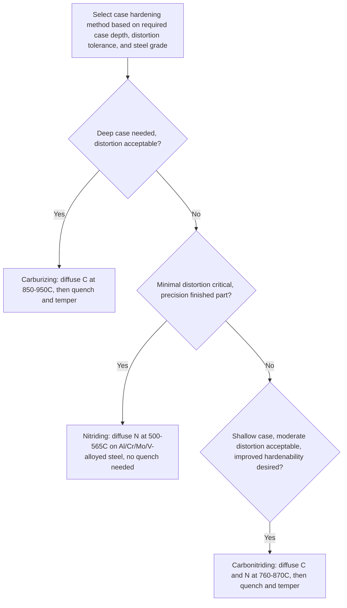

## Case Hardening: Carburizing, Nitriding, and Carbonitriding

### Overview

Case hardening is a family of surface-hardening treatments that produce a hard, wear-resistant outer layer (the "case") on a component while retaining a tougher, more ductile interior (the "core"). This combination is achieved by locally modifying the surface chemistry—typically by diffusing carbon, nitrogen, or both into the surface—rather than through-hardening the entire cross-section. Case hardening is widely used for gears, shafts, cams, bearings, and other components that require high surface hardness for wear and fatigue resistance while needing a tough core to withstand impact and bending loads without brittle fracture.

### Carburizing

**Process Principle**

Carburizing introduces additional carbon into the surface of a low-carbon steel (typically 0.10-0.25 wt% C) by holding it at an elevated temperature (typically 850-950°C, within the austenite phase field) in a carbon-rich environment, allowing carbon to diffuse inward from the surface. The carbon concentration profile follows approximately a diffusion (error-function) relationship, described by Fick's second law, producing a carbon-rich case that grades gradually into the lower-carbon core.

**Carburizing Methods**

| Method | Carbon Source | Typical Characteristics |
| --- | --- | --- |
| Gas carburizing | Hydrocarbon gas (e.g., methane, propane) or endothermic gas atmosphere | Most common industrial method; good process control; suitable for high-volume production |
| Pack carburizing | Solid carbonaceous compound (charcoal + energizer) packed around parts | Older method; simple equipment; slower, less precise control |
| Liquid (salt bath) carburizing | Molten cyanide or non-cyanide carburizing salts | Fast, uniform heating; environmental/safety concerns with cyanide salts have reduced use |
| Vacuum carburizing | Hydrocarbon gas under vacuum/low pressure | Excellent process control, minimal oxidation, suited to complex geometries and deep cases |
| Plasma (ion) carburizing | Ionized hydrocarbon gas under vacuum with applied electric field | High process control, uniform case even in blind holes/complex geometry, reduced cycle time |

**Key Points**

- After carburizing, the part must be **quenched** (directly from the carburizing temperature or after reheating) to transform the carbon-enriched case to martensite, followed by a low-temperature temper (typically 150-200°C) to relieve stress while retaining high case hardness.
- The **case depth** (the distance from the surface to a specified hardness or carbon content threshold) is controlled primarily by carburizing time and temperature, following approximately a square-root-of-time diffusion relationship—doubling case depth requires roughly quadrupling the diffusion time at a given temperature.
- The core remains at its original low carbon content (since it is not exposed to the carburizing atmosphere for significant diffusion distance) and, upon quenching, forms a tough, lower-hardness low-carbon martensite or bainite, providing the toughness needed to resist fatigue crack initiation and catastrophic core fracture.
- Common substrate steels are low-carbon grades with sufficient hardenability for the core (e.g., AISI 8620, 4320, 1018/1020), selected based on required core properties and section size.

### Nitriding

**Process Principle**

Nitriding introduces nitrogen into the steel surface at a relatively low temperature (typically 500-565°C, well below $A_1$, so **no austenitizing or subsequent quenching is required**), forming a hard layer of iron nitrides and/or alloy nitrides directly in the ferritic matrix. Because no phase transformation or quenching is involved, nitriding produces minimal distortion compared to carburizing.

**Nitriding Methods**

| Method | Nitrogen Source | Typical Characteristics |
| --- | --- | --- |
| Gas nitriding | Dissociated ammonia (NH₃ → N + 3H) | Traditional method; long cycle times (many hours to days); good case uniformity |
| Salt bath (liquid) nitriding | Molten cyanide/cyanate salts | Faster than gas nitriding; environmental/handling concerns with cyanide-based salts |
| Plasma (ion) nitriding | Ionized nitrogen gas under vacuum with applied electric field | Excellent process control, can tailor compound layer thickness/absence, reduced cycle time, more environmentally favorable |

**Key Points**

- Nitriding steels are specifically alloyed with strong nitride-forming elements (**Al, Cr, Mo, V**) to produce fine, hard alloy nitride precipitates; plain carbon steels respond poorly to nitriding because iron nitrides alone are less hard and less stable than alloy nitrides.
- The resulting case structure typically has two zones: a thin, very hard, brittle **compound layer** (often called the "white layer" due to its appearance when etched) at the immediate surface, composed of iron nitrides (ε and/or γ' phases), and beneath it a thicker **diffusion zone** where nitrogen is in solid solution and/or has precipitated as fine alloy nitrides within the ferrite matrix.
- The compound layer is often undesirable for components subject to significant contact stress or requiring good fatigue resistance (due to its brittleness), so process parameters or a subsequent light grinding/lapping step are frequently used to minimize or remove it, leaving the tougher, still very hard diffusion zone as the functional case.
- Because nitriding is performed below $A_1$ with no subsequent quench, dimensional distortion is minimal, making it well suited to finish-machined precision components (e.g., gears, crankshafts) where post-hardening machining/grinding must be minimized or eliminated.
- Nitrided cases also provide notably improved fatigue resistance (via beneficial compressive residual stress in the case) and, in many alloy compositions, improved corrosion resistance compared to the bare substrate.

### Carbonitriding

**Process Principle**

Carbonitriding is a hybrid process that diffuses both carbon and nitrogen into the steel surface simultaneously, typically performed at a temperature intermediate between carburizing and nitriding (usually 760-870°C, in the austenite range but generally lower than typical carburizing temperature), using a gas atmosphere enriched with both a hydrocarbon (carbon source) and ammonia (nitrogen source).

**Key Points**

- Because carbonitriding is performed at a lower temperature than carburizing and for shorter times, it typically produces a **shallower case** than carburizing, making it well suited to smaller parts, thinner sections, or applications not requiring deep case depth.
- The presence of nitrogen in the case **lowers the $M_s$ temperature** locally in the case region (nitrogen, like carbon, is an austenite stabilizer that depresses $M_s$), which can be advantageous by increasing the amount of retained austenite in a controlled way (providing some toughness/compressive stress benefit) or disadvantageous if excessive retained austenite reduces case hardness below specification.
- Nitrogen also **increases the hardenability** of the case region, allowing case hardening of somewhat lower-hardenability steels or the use of a milder, less distortion-prone quench (e.g., oil rather than water) than might otherwise be required for an equivalent carbon-only case.
- Like carburizing, carbonitriding requires quenching to transform the case to martensite, followed by a low-temperature temper.

### Comparative Summary

| Characteristic | Carburizing | Nitriding | Carbonitriding |
| --- | --- | --- | --- |
| Diffusing element(s) | Carbon | Nitrogen | Carbon + Nitrogen |
| Process temperature | High (850-950°C) | Low (500-565°C) | Intermediate (760-870°C) |
| Requires quench? | Yes | No | Yes |
| Distortion | Moderate-high | Minimal | Moderate |
| Typical case depth | Deep (up to several mm) | Shallow (typically <0.5 mm) | Shallow-moderate |
| Core toughness dependency | Depends on core composition/quench | Unaffected (no core transformation) | Depends on core composition/quench |
| Steel requirement | Low-carbon, adequate core hardenability | Contains Al, Cr, Mo, V (nitride formers) | Low-carbon, adequate core hardenability |

### Case Hardening Process Comparison

### Case Depth and Hardness Profile

<svg xmlns="http://www.w3.org/2000/svg" viewBox="0 0 600 380">
<text x="300" y="25" font-size="16" text-anchor="middle" font-family="sans-serif" font-weight="bold">Case Hardness Profiles (svg_diagram)</text>
<line x1="80" y1="330" x2="550" y2="330" stroke="black" stroke-width="1.5" />
<line x1="80" y1="330" x2="80" y2="60" stroke="black" stroke-width="1.5" />
<text x="315" y="360" font-size="14" text-anchor="middle" font-family="sans-serif">Depth from Surface</text>
<text x="35" y="195" font-size="14" text-anchor="middle" font-family="sans-serif" transform="rotate(-90 35,195)">Hardness (HRC)</text>

<text x="80" y="345" font-size="11" text-anchor="middle" font-family="sans-serif">0</text>

<path d="M 80,90 L 200,95 L 350,180 L 500,280 L 550,300" fill="none" stroke="#1f77b4" stroke-width="2.5" />
<text x="360" y="170" font-size="12" font-family="sans-serif" fill="#1f77b4">Carburized (deep case)</text>

<path d="M 80,70 L 100,75 L 150,150 L 250,260 L 350,300 L 550,315" fill="none" stroke="#d62728" stroke-width="2.5" />
<text x="160" y="140" font-size="12" font-family="sans-serif" fill="#d62728">Nitrided (shallow, hard compound layer)</text>

<line x1="80" y1="300" x2="550" y2="300" stroke="gray" stroke-dasharray="4,3" />
<text x="480" y="295" font-size="11" font-family="sans-serif" fill="gray">Core hardness</text>
</svg>

### Applications and Selection Criteria

**Key Points**

- **Carburizing** is preferred for components requiring deep case depth and high load-carrying capacity (e.g., truck and automotive gears, heavily loaded shafts, bearing races) where the resulting distortion can be managed by post-hardening grinding/finishing operations.
- **Nitriding** is preferred for precision components where distortion must be minimized after final machining (e.g., precision gears, crankshafts, extrusion dies, some aerospace components) and where the somewhat shallower case depth is acceptable for the expected service loads.
- **Carbonitriding** is often selected as a cost-effective alternative to carburizing for smaller, less heavily loaded parts (e.g., small gears, fasteners, thin stampings) where its shallower case is adequate and its improved hardenability allows the use of lower-cost steel grades or milder quenchants.
- Post-treatment surface finishing (grinding, honing, or light lapping) is frequently applied after case hardening to achieve final dimensional tolerances and, particularly for nitrided parts, to remove or minimize the brittle compound layer where fatigue performance is critical.

**[Inference]** Because case hardening response depends on the interaction of diffusion kinetics, steel composition, and subsequent thermal treatment, achieving a specified case depth and hardness profile in production is generally validated through metallographic case-depth measurement and hardness traverse testing on production or witness samples, rather than relying solely on calculated diffusion predictions.

### Related Topics

- Fick's Laws of Diffusion Applied to Case Hardening Kinetics
- Martensite Formation and Tempering in Case-Hardened Steels
- Retained Austenite Effects in Carbonitrided Cases
- Alloy Steel Selection for Carburizing Grades (8620, 4320, 4820)
- Nitriding Steel Alloy Design (Nitralloy-type Steels)
- Residual Stress Development in Case-Hardened Components
- Gear Tooth Bending and Contact Fatigue Design Considerations
- Induction and Flame Hardening as Alternative Surface Hardening Methods