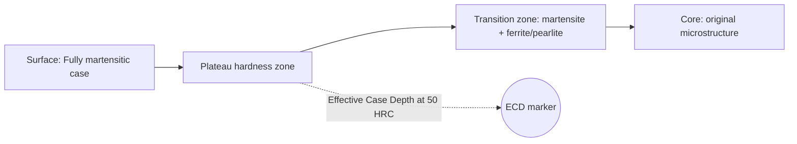
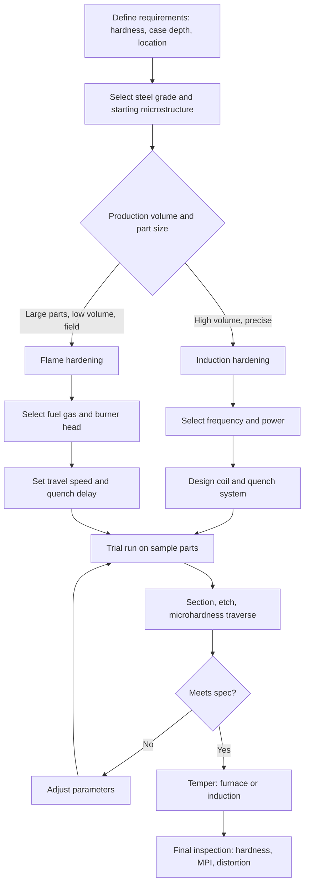

## Induction and Flame Hardening


Induction hardening and flame hardening are **selective surface hardening** processes. Instead of heating an entire component through its section (as in conventional through-hardening), only a defined surface layer is rapidly heated into the austenite range and then quenched. The result is a hard, wear-resistant martensitic case over a softer, tougher core, with beneficial compressive residual stresses at the surface that improve fatigue performance.

Both methods rely on the same metallurgical principle (local austenitization followed by martensitic transformation) but differ in the heat source: **electromagnetic induction** for induction hardening and a **fuel-gas/oxygen flame** for flame hardening.

---

### Fundamentals of Surface Hardening

#### Why Selectively Harden the Surface?

Many components (gears, camshafts, crankshafts, axles, bearing races, rails, machine tool ways) require:

- High surface hardness for wear and contact-fatigue resistance
- A tough, ductile core to withstand impact and bending loads
- Compressive residual surface stress to retard fatigue crack initiation
- Minimal distortion compared with through-hardening

**Key Points**

- The steel must contain enough carbon to form hard martensite after quenching (typically 0.35–0.60 wt% C).
- Unlike carburizing or nitriding, **no chemical composition change** occurs: the case and core share the same chemistry.
- Case depth is controlled by heating time, power density, and frequency (induction), or flame intensity and travel speed (flame).

#### Metallurgical Basis

Rapid heating shifts the transformation temperatures upward. The critical temperature under fast heating is denoted $A_{c3}$ (heating) rather than the equilibrium $A_3$. Because austenite formation is diffusion-controlled, short heating times require higher temperatures to complete austenitization and dissolve carbides.

**Sequence of events at the surface layer:**

1. Rapid heating above $A_{c3}$ (hypoeutectoid steels) or $A_{c1}$ (with carbide dissolution) to form austenite
2. Very brief soak (seconds or fractions of a second)
3. Rapid quench (water, polymer, or air/spray)
4. Austenite transforms to martensite with a volume expansion, producing compressive residual stress at the surface
5. Optional low-temperature tempering (150–200 °C) to relieve quench stresses and improve toughness

**Key Points**

- Prior microstructure matters: a **quenched and tempered (QT)** or normalized starting structure with finely dispersed carbides austenitizes faster and more homogeneously than a coarse ferrite–pearlite structure.
- Short heating times yield **fine-grained austenite**, and thus fine martensite with excellent hardness and toughness.
- Incomplete carbide dissolution or insufficient time produces soft spots and non-uniform hardness.

#### Typical Case Structure

The hardened part exhibits distinct zones from the surface inward:

| Zone | Microstructure | Hardness Trend |
| --- | --- | --- |
| Hardened case | Martensite (fully austenitized then quenched) | Maximum, plateau |
| Transition zone | Martensite + ferrite/pearlite/bainite (partially austenitized) | Gradual decrease |
| Core | Original microstructure (unaffected) | Base hardness |

---

### Steels Suitable for Induction and Flame Hardening

#### Carbon and Alloy Grade Selection

Surface hardness is governed primarily by carbon content; hardenability (depth) depends on alloying.

| Steel Grade (AISI/SAE) | Approx. C (wt%) | Typical Application | As-Quenched Surface Hardness (HRC) |
| --- | --- | --- | --- |
| 1038 / 1040 | 0.38–0.43 | Shafts, axles, studs | 50–55 |
| 1045 | 0.43–0.50 | Gears, spindles, crankshafts | 55–60 |
| 1050 / 1055 | 0.48–0.60 | Camshafts, wear parts | 57–62 |
| 4140 | 0.38–0.43 | High-strength shafts, gears | 54–59 |
| 4340 | 0.38–0.43 | Heavy-duty shafts, landing gear parts | 54–58 |
| 5150 / 5160 | 0.48–0.60 | Springs, wear components | 58–63 |
| 52100 | ~1.00 | Bearing races (special practice) | 60–65 |
| Ductile / gray / malleable cast iron | 2.5–4.0 (with graphitic C) | Cams, cylinder liners, gear teeth | Varies (45–60 HRC) |

**Key Points**

- Below ~0.30% C, martensite hardness is insufficient for wear applications.
- Above ~0.60% C, quench cracking risk rises sharply.
- Low-alloy steels (4140, 4340) allow deeper case depths and use of gentler quenchants.
- Cast irons can be hardened, but the carbon must dissolve from graphite/pearlite, requiring longer or hotter heating.

The approximate maximum attainable martensite hardness can be estimated from carbon content:

$$HRC_{max} \approx 20 + 60\sqrt{C}$$

where $C$ is carbon content in weight percent. [Inference] This is an empirical approximation and varies by source and alloy content; consult grade-specific hardness charts for design work.

#### Starting Microstructure

- **Quenched and tempered (QT)**: best; fine carbide distribution allows fast, uniform austenitization
- **Normalized**: acceptable for most applications
- **Annealed / spheroidized**: slow to austenitize; requires higher temperature or longer time
- **As-rolled with banding**: risk of hardness scatter

---

### Induction Hardening

#### Principle of Operation

A workpiece is placed inside or adjacent to a **water-cooled copper inductor coil** carrying alternating current. The alternating magnetic field induces **eddy currents** in the part. These currents heat the surface by Joule heating ($I^2R$), with additional contribution from hysteresis losses in the ferromagnetic state (below the Curie temperature, approximately 768 °C for iron).

Key phenomena:

- **Skin effect**: eddy currents concentrate near the surface
- **Proximity effect**: current distribution is influenced by nearby conductors (coil turns, adjacent part geometry)
- **Ring effect / coil geometry effects**: current concentrates on the side of the conductor facing the workpiece

#### Skin Effect and Current Penetration Depth

The current density decays exponentially from the surface. The **reference depth** (skin depth) $\delta$, where current density falls to $1/e$ (≈ 37%) of the surface value, is:

$$\delta = \sqrt{\frac{\rho}{\pi f \mu_0 \mu_r}}$$

Where:

- $\delta$ = penetration (skin) depth (m)
- $\rho$ = electrical resistivity of the workpiece (Ω·m)
- $f$ = frequency (Hz)
- $\mu_0$ = permeability of free space ($4\pi \times 10^{-7}$ H/m)
- $\mu_r$ = relative magnetic permeability

**Key Points**

- Higher frequency gives **shallower** penetration (thinner case).
- Below the Curie temperature, steel is ferromagnetic ($\mu_r$ can be ~100 or higher), giving very small $\delta$ and rapid surface heating.
- Above the Curie temperature, steel becomes paramagnetic ($\mu_r \approx 1$) and resistivity rises, so $\delta$ increases substantially (often 10–20 times or more). This is why heating a thick section behaves differently in its early and late stages.

**Example: Estimated skin depth in hot (non-magnetic) steel**

For $\rho \approx 1.0 \times 10^{-6}\ \Omega\cdot m$ (hot steel, above Curie), $\mu_r = 1$, and $f = 10$ kHz:

$$\delta = \sqrt{\frac{1.0 \times 10^{-6}}{\pi \times 10^{4} \times 4\pi \times 10^{-7} \times 1}} \approx 5.0 \times 10^{-3}\ \text{m} \approx 5\ \text{mm}$$

**Output**

$\delta \approx 5\ \text{mm}$ at 10 kHz for hot non-magnetic steel. At 100 kHz, $\delta \approx 1.6\ \text{mm}$.

#### Frequency Selection

Frequency is the primary lever controlling case depth.

| Frequency Range | Designation | Typical Case Depth | Typical Applications |
| --- | --- | --- | --- |
| 1–10 kHz | Low/medium frequency | 3–10+ mm | Large shafts, rolls, heavy gears, through-heating |
| 10–50 kHz | Medium frequency | 1.5–5 mm | Crankshafts, axles, medium gears |
| 100–400 kHz | High frequency | 0.5–2 mm | Small gears, fasteners, thin cases, bearing races |
| Above ~500 kHz | Very high frequency | < 0.5 mm | Small parts, saw teeth, thin skins |

A common guideline for the **minimum frequency** to heat a cylindrical bar of diameter $D$ efficiently is that the diameter should exceed roughly 3–4 times the hot penetration depth:

$$D \gtrsim 4\delta_{hot}$$

[Inference] This is a rule of thumb; efficiency and heating pattern depend on coil design and process objectives.

#### Case Depth Control

Effective case depth is governed by:

1. **Frequency** (skin depth)
2. **Power density** (kW/cm² or kW/in² at the surface)
3. **Heating time**
4. **Thermal conduction** into the core during heating
5. **Quench delay and quench intensity**

Two heating strategies:

| Strategy | Power Density | Time | Result |
| --- | --- | --- | --- |
| Very high power density, short time | High | Very short | Shallow case, sharp transition, minimal core heating |
| Lower power density, longer time | Lower | Longer | Deeper case via thermal conduction, softer gradient |

**Key Points**

- The heated layer depth generally exceeds the electromagnetic skin depth because heat conducts inward during heating.
- Dual-frequency systems (e.g., medium then high frequency) can heat gear teeth contour-wise: a low frequency preheats the root and a high frequency completes the tip.

#### Effective Case Depth Definition

**Effective case depth (ECD)** is the perpendicular distance from the surface to the point where hardness falls to a specified threshold, commonly **50 HRC** (or 80% of minimum surface hardness, depending on specification).

**Total case depth** extends to where hardness or microstructure matches the core.

#### Induction Hardening Equipment

| Component | Function |
| --- | --- |
| Power supply (solid-state inverter) | Generates the desired frequency and power (kW) |
| Matching network / heat station | Impedance matching between the power supply and the coil |
| Inductor (coil) | Water-cooled copper tubing shaped to the workpiece |
| Flux concentrators | Laminated or ferrite/powder-composite material that directs magnetic flux to selected zones |
| Quench system | Spray ring integrated in the coil or separate quench station |
| Fixture / handling | Rotates or translates the part (scan or static) |
| Process controller / sensors | Monitors power, energy, time, temperature, and flow |

#### Heating Methods

| Method | Description | Typical Use |
| --- | --- | --- |
| **Static (single-shot)** | Entire zone heated simultaneously, then quenched | Short or complex-shaped surfaces, gear journals |
| **Scanning (progressive)** | Coil and part move relatively; heating and quench follow continuously | Long shafts, axles, rails |
| **Tooth-by-tooth** | Coil indexes over one gear tooth space at a time | Large module gears |
| **Contour (spin) hardening** | Part spins inside a coil that follows the gear contour, often dual-frequency | Small/medium gears with uniform profile hardness |

#### Coil (Inductor) Design

**Key Points**

- **Coupling gap**: distance between coil and part affects efficiency. Smaller gaps give better coupling but risk arcing or mechanical contact. Typical gaps are 1.5–4 mm.
- **Coil shape**: external (solenoid, encircling), internal (bore hardening), pancake (flat faces), hairpin (linear traces), split (crankshaft journals).
- **Flux concentrators** locally enhance heating and reduce the power required, useful for grooves, fillets, and internal diameters.
- **Uneven coupling** causes uneven hardening; part rotation is used to average heating.
- Coil design is typically iterative, supported by electromagnetic-thermal simulation (FEM) and trial runs.

#### Quenching in Induction Hardening

| Quenchant | Characteristics | Typical Use |
| --- | --- | --- |
| Water | Most severe, highest crack risk | Low-carbon-equivalent steels, simple shapes |
| Polymer solution (PAG, 5–15%) | Adjustable severity, reduces cracking, inhibits corrosion | Most common industrial choice |
| Oil | Mild, slower | High-hardenability alloy steels, complex shapes |
| Compressed air / air-water mist | Very mild | Highly hardenable steels, sensitive parts |

**Key Points**

- **Self-quenching** occurs when the cold core rapidly absorbs heat from the thin heated case after power is removed, useful for very shallow cases.
- Spray quench flow rate, pressure, and angle must be controlled for repeatable results.
- **Quench delay** (interval between heat end and quench start) is typically fractions of a second; excess delay allows cooling before quench and loss of hardness or scatter.

#### Tempering After Induction Hardening

- **Furnace tempering**: 150–200 °C for 1–2 hours (typical)
- **Induction tempering**: shorter time at higher temperature (e.g., 200–250 °C for seconds to minutes) using a low-power induction cycle
- **Self-tempering**: retained heat from the core tempers the case; sometimes used, but repeatability is limited

#### Process Parameters Summary

| Parameter | Typical Range | Effect |
| --- | --- | --- |
| Frequency | 1 kHz – 400+ kHz | Depth of eddy current penetration |
| Power density | 1–15 kW/cm² (approx.) | Heating rate, temperature gradient |
| Heating time | 0.1–30 s | Case depth, core heating |
| Surface temperature | 850–1000 °C (steel dependent) | Austenite completeness, grain size |
| Quench delay | 0.1–2 s | Hardness consistency |
| Quench flow / pressure | Application-specific | Cooling rate, cracking risk |

[Inference] Ranges vary considerably by supplier, part geometry, and steel grade; values shown are indicative starting points for process development, not specifications.

#### Advantages of Induction Hardening

- Very fast: seconds per part
- Precisely localized heating with excellent repeatability
- Low distortion relative to through-hardening
- No decarburization or scaling concerns (short cycle, often protective atmosphere unnecessary)
- Easy to integrate in-line with machining
- Energy-efficient: heat is generated in the part itself
- Clean and automatable; instantly on/off

#### Limitations of Induction Hardening

- Coils are **part-specific**; high tooling cost for small batches
- Requires suitable prior microstructure and adequate carbon content
- Complex geometries (sharp corners, holes, keyways) risk overheating or cracking
- Requires accurate control and maintenance of water and quench systems
- Not suitable for very large, irregular parts without special equipment

---

### Flame Hardening

#### Principle of Operation

A high-temperature **oxy-fuel flame** (typically oxy-acetylene, oxy-propane, oxy-natural gas, or oxy-hydrogen) heats the steel surface rapidly to the austenitizing temperature. A **water spray or quench jet** follows immediately behind (or the part is quenched after flame withdrawal), transforming the heated layer to martensite.

#### Fuel Gases and Flame Characteristics

| Fuel Gas | Approx. Max Flame Temperature (with oxygen) | Heat Transfer Character |
| --- | --- | --- |
| Acetylene ($C_2H_2$) | ~3100 °C | Very high intensity, concentrated inner cone, fast heating |
| Propane ($C_3H_8$) | ~2800 °C | Lower temperature, large total heat output |
| Natural gas (mainly $CH_4$) | ~2700–2800 °C | Economical, softer flame |
| Hydrogen ($H_2$) | ~2800 °C | Clean, invisible flame, no carbon deposition |
| MAPP / propylene mixtures | ~2900 °C | Intermediate performance |

[Inference] Temperatures depend on oxygen-to-fuel ratio and measurement method; values are typical literature approximations.

**Key Points**

- **Neutral flame** (correct oxygen-to-fuel ratio) is generally preferred to avoid carburization or oxidation of the surface.
- Oxy-acetylene provides the highest heat flux, so it is preferred for shallow and fast cases.
- Flame heating is dominated by **convection and radiation** from the flame to the surface; heat flux is lower than induction, so heating times are longer.

#### Flame Hardening Methods

| Method | Description | Typical Use |
| --- | --- | --- |
| **Stationary (spot)** | Flame held over one area, then quenched | Small, localized regions, lugs, tips |
| **Progressive** | Torch head with integrated quench moves along the surface | Long flat surfaces, rails, machine ways, gear teeth (one flank at a time) |
| **Spinning** | Part rotates while heated by a fixed burner array, then quenched | Cylindrical parts: shafts, rolls, journals |
| **Combined progressive-spinning** | Part rotates while torch/quench moves axially | Long shafts and rolls |

#### Equipment

- Oxy-fuel supply (cylinders, regulators, flowmeters, flashback arrestors)
- Multi-orifice burner heads customized to the geometry
- Integrated water spray quench heads (mounted behind the burner)
- Motion system: lathe-type rotation, traversing carriage, or manual handling
- Temperature indicators (optical pyrometers, temperature-indicating crayons/paints) in less automated setups

#### Process Parameters

| Parameter | Effect |
| --- | --- |
| Fuel/oxygen ratio | Flame temperature and atmosphere (neutral vs. oxidizing/carburizing) |
| Burner-to-work distance | Heat flux intensity (commonly tip of inner cone about 3–10 mm from surface) |
| Travel speed | Heating time, depth of heat penetration |
| Flame power (gas flow) | Total heat input |
| Quench delay (distance between burner and quench) | Temperature at the start of quench; hardness and depth |
| Quench spray flow and angle | Cooling severity |
| Rotational speed (spin method) | Circumferential uniformity |

#### Case Depth in Flame Hardening

Typical effective case depths range from **1.5 to 6 mm** (deeper cases are possible with slower travel). Depth is controlled mainly by:

1. Heat input rate (flame intensity)
2. Travel speed
3. Quench delay

Approximate relationship (thermal diffusion approach):

$$d \approx k\sqrt{\alpha t}$$

Where:

- $d$ = depth of heated layer (m)
- $\alpha$ = thermal diffusivity of steel (approximately $1 \times 10^{-5}\ \text{m}^2/\text{s}$ at elevated temperature; varies with temperature and composition)
- $t$ = heating time (s)
- $k$ = dimensionless factor depending on surface temperature target and heat flux (order of 1–3)

[Inference] This is a simplified conduction estimate for a semi-infinite solid under surface heating; it is not a substitute for experimental calibration.

**Example: Estimated heating depth for progressive flame hardening**

For $\alpha = 1 \times 10^{-5}\ \text{m}^2/\text{s}$, $t = 5$ s, and $k = 2$:

$$d \approx 2\sqrt{1 \times 10^{-5} \times 5} = 2\sqrt{5 \times 10^{-5}} \approx 2 \times 7.07 \times 10^{-3} = 1.41 \times 10^{-2}\ \text{m}$$

This estimate (≈14 mm) is the *heat-affected* depth. Only the portion above the austenitizing temperature at quench time contributes to the hardened case, so the effective case depth is materially smaller (typically 2–6 mm).

**Output**

The thermal diffusion estimate gives a heat-affected depth of about 14 mm, while the effective hardened depth is considerably shallower.

#### Advantages of Flame Hardening

- Low equipment cost, highly portable
- Suitable for **very large or heavy components** (rolls, large gears, machine beds, rails) that cannot be placed in a furnace or induction coil
- Adaptable to field/on-site and repair work
- Can harden localized areas of irregular parts
- No part-specific coil required; burners are relatively simple to modify

#### Limitations of Flame Hardening

- Less precise temperature control than induction (operator dependence in manual setups)
- Greater risk of **overheating, surface melting, and decarburization** if flame is poorly controlled
- Wider hardness scatter and a less predictable case depth
- Safety concerns: flammable gases, open flame, cylinders
- Lower productivity for high-volume parts
- Scale formation and rougher surface finish

---

### Comparison of Induction and Flame Hardening

| Feature | Induction Hardening | Flame Hardening |
| --- | --- | --- |
| Heat source | Electromagnetic eddy currents (in part) | Oxy-fuel flame (external) |
| Heating rate | Very high (10²–10³ °C/s or more) | Moderate to high (10¹–10² °C/s) |
| Heating time | Fractions of a second to seconds | Seconds to tens of seconds |
| Control and repeatability | Excellent (electronic) | Moderate (operator/gas dependent) |
| Case depth range | ~0.3–10+ mm | ~1.5–6 mm (deeper possible) |
| Case uniformity | High | Variable |
| Tooling cost | High (coils, power supplies) | Low |
| Suitability for mass production | Excellent | Poor to fair |
| Suitability for large/heavy parts | Limited by coil and power | Excellent |
| Surface finish | Clean | Some scaling/oxidation |
| Energy efficiency | High | Low |
| Distortion | Low | Low to moderate |
| Safety profile | Electrical/high-frequency hazards | Fire, explosion, gas hazards |

---

### Hardness Profile and Quality Metrics

#### Typical Microhardness Traverse

A microhardness traverse (Vickers or Knoop) from the surface toward the core measures:

- **Surface hardness** (maximum plateau)
- **Effective case depth (ECD)** at the specified threshold hardness (e.g., 550 HV ≈ 52 HRC, or 50 HRC)
- **Transition zone** width and gradient
- **Core hardness**



#### Common Inspection Methods

| Method | Purpose |
| --- | --- |
| Microhardness traverse (ISO 6507, ASTM E384) | Case depth and hardness profile |
| Rockwell C (or superficial Rockwell 15N/30N) | Surface hardness verification |
| Metallographic sectioning and etching (nital) | Microstructure, grain size, pattern, transition |
| Magnetic Barkhausen noise / eddy current sorting | Non-destructive verification of hardness and case depth |
| Ultrasonic case depth measurement | NDT for case depth estimation |
| Magnetic particle inspection (MPI) | Detection of quench cracks |
| Residual stress measurement (X-ray diffraction) | Compressive stress verification |

#### Residual Stress

Martensitic transformation involves a volume increase (~4% for high-carbon martensite relative to austenite, less for medium-carbon steels), so the transformed surface layer is constrained by the untransformed core. This yields:

- **Compressive stress in the hardened case** (beneficial for fatigue)
- **Balancing tensile stress in the core or transition zone** (potential site of subsurface fatigue initiation if the case is too shallow)

**Key Points**

- Peak compressive stresses of several hundred MPa are commonly reported for induction-hardened components. [Inference] Magnitude depends on case depth, steel, geometry, and process, and should be verified experimentally.
- A case-to-section-size ratio of roughly 10–20% is a common design guideline for balancing surface compression and subsurface tensile stress. [Inference] Application-specific fatigue testing is recommended.

---

### Process Design Workflow



---

### Practical Examples

#### Example 1: Induction Hardening a 4140 Shaft Journal

**Requirements**

- Steel: AISI 4140 QT to 28–32 HRC before hardening
- Journal diameter: 50 mm
- Target surface hardness: 54–58 HRC
- Effective case depth: 2.0–3.0 mm (to 50 HRC)

**Process Parameters (indicative starting point)**

| Parameter | Value |
| --- | --- |
| Frequency | 10 kHz |
| Method | Scanning (progressive) with rotation |
| Scan speed | 8–12 mm/s |
| Power | 100–150 kW |
| Surface temperature at quench | 880–920 °C |
| Quench | Polymer (8–10% PAG) spray, coil-integrated |
| Post-hardening temper | 180 °C for 1 hour |

**Expected Output**

- Surface hardness 55–58 HRC
- Effective case depth ≈ 2.5 mm
- Fine, uniform martensite in the case; tempered martensite/ferrite-bainite in the core

[Inference] Values are representative starting points for trials. Optimal parameters depend on equipment, coil design, and material batch.

#### Example 2: Flame Hardening a 1045 Machine Guideway

**Requirements**

- Steel: AISI 1045, normalized
- Flat surface, length 2 m
- Target surface hardness: 55–58 HRC
- Effective case depth: 3–4 mm

**Process Parameters (indicative starting point)**

| Parameter | Value |
| --- | --- |
| Fuel gas | Oxy-acetylene, neutral flame |
| Method | Progressive (burner and water quench head travel) |
| Burner-to-surface distance | ~6–8 mm (inner cone tip) |
| Travel speed | 3–6 mm/s |
| Quench delay | ~10–20 mm behind flame center |
| Quench | Water spray |
| Post-hardening temper | 180–200 °C for 1–2 hours (or induction temper) |

**Expected Output**

- Surface hardness ~54–58 HRC
- Effective case depth ≈ 3–4 mm
- Some scale on surface requiring light finish grinding

[Inference] Actual parameters must be developed empirically on the specific machine and workpiece.

#### Example 3: Simple Case-Depth Estimation Script

The following Python snippet estimates electromagnetic skin depth and provides a first-pass frequency screening for induction hardening.

```python
import math

MU0 = 4 * math.pi * 1e-7  # H/m

def skin_depth(resistivity_ohm_m, frequency_hz, mu_r=1.0):
    """Electromagnetic skin depth in metres."""
    return math.sqrt(resistivity_ohm_m / (math.pi * frequency_hz * MU0 * mu_r))

# Hot (non-magnetic) steel above the Curie temperature
rho_hot = 1.0e-6   # ohm·m (approximate)
frequencies = [1e3, 3e3, 10e3, 30e3, 100e3, 300e3]

print(f"{'f (kHz)':>10} {'delta_hot (mm)':>16}")
for f in frequencies:
    d = skin_depth(rho_hot, f) * 1000
    print(f"{f/1e3:>10.1f} {d:>16.2f}")

# Rule of thumb: cylinder diameter should be > ~4x hot skin depth
diameter_mm = 50
min_f = None
for f in frequencies:
    if diameter_mm > 4 * skin_depth(rho_hot, f) * 1000:
        min_f = f
        break
print(f"\nFor D = {diameter_mm} mm, lowest screened frequency satisfying D > 4*delta: {min_f/1e3:.1f} kHz")
```

**Output**



```
   f (kHz)   delta_hot (mm)
       1.0            15.92
       3.0             9.19
      10.0             5.03
      30.0             2.90
     100.0             1.59
     300.0             0.92

For D = 50 mm, lowest screened frequency satisfying D > 4*delta: 1.0 kHz
```

[Inference] The output reflects the simplified rule of thumb and constant resistivity/permeability assumptions. In real processes, $\rho$ and $\mu_r$ vary strongly with temperature, so practical frequency choice also considers desired case depth, not only the minimum frequency.

---

### Common Defects and Troubleshooting

| Defect | Probable Causes | Remedies |
| --- | --- | --- |
| **Quench cracks** | Excessive carbon, sharp edges/holes, too severe quench, overheating | Use polymer quench, radius edges, lower temperature, temper promptly |
| **Soft spots** | Local under-heating, poor coupling, quench delay too long, uneven quench | Improve coil design, rotation, quench uniformity |
| **Insufficient case depth** | Too high frequency, low power/time, fast scan | Lower frequency, increase energy, slow scan |
| **Excessive case depth / through-hardening** | Too low frequency, excessive time, thin section | Raise frequency, increase power density, shorten time |
| **Overheating / grain coarsening** | Excessive temperature, excessive dwell | Reduce temperature/time, use controlled power |
| **Surface melting (flame)** | Flame too intense, torch too close or too slow | Increase distance/speed, adjust flame |
| **Decarburization / scaling (flame)** | Oxidizing flame, long heating | Neutral/slightly reducing flame, faster travel |
| **Distortion** | Non-uniform heating or quenching, residual stress release | Symmetric heating, part rotation, controlled quench, stress relief |
| **Hardness scatter** | Prior microstructure variation, banding, chemistry variance | Specify QT starting condition, tighten material specs |
| **Grinding cracks (post-process)** | Untempered martensite, aggressive grinding | Temper before grinding, use proper grinding parameters |

---

### Design Considerations

**Key Points**

- **Geometry**: avoid sharp corners, small holes near the hardened zone, keyways, and abrupt section changes. Provide fillet radii.
- **Hardened zone runout**: the end of a hardened zone is a metallurgical notch (transition from compressive to tensile stress); avoid locating it at high-stress locations.
- **Case-to-core ratio**: too thin a case risks subsurface fatigue failure below the case; too deep a case increases distortion and crack risk.
- **Section thickness**: minimum section should exceed roughly 3–4 times the intended case depth to avoid through-hardening.
- **Tempering**: always temper after hardening (except sometimes very shallow, low-stress applications) to reduce crack sensitivity.
- **Machining allowance**: account for growth (typically small, ~0.02–0.1% dimensional growth) and grinding allowance.

---

### Comparison with Other Surface Hardening Methods

| Method | Case Type | Typical Depth | Composition Change | Distortion | Notes |
| --- | --- | --- | --- | --- | --- |
| Induction hardening | Martensite | 0.3–10+ mm | None | Low | Fast, localized |
| Flame hardening | Martensite | 1.5–6 mm | None | Low–moderate | Large parts, portable |
| Carburizing | High-C martensite | 0.5–3+ mm | Carbon added | Moderate | Deeper, higher hardness, long cycle |
| Carbonitriding | C+N enriched martensite | 0.1–0.75 mm | Carbon + nitrogen | Moderate | Shallow, moderate hardenability steels |
| Nitriding (gas/plasma) | Nitride compound + diffusion zone | 0.1–0.6 mm | Nitrogen added | Very low | Low temperature, no quench |
| Laser hardening | Martensite | 0.2–2 mm | None | Very low | Precise, expensive |
| Electron beam hardening | Martensite | 0.1–1.5 mm | None | Very low | Vacuum required |

---

### Safety and Environmental Considerations

**Induction Hardening**

- High-voltage and high-frequency electrical hazards; interlocks and guarding required
- Electromagnetic field exposure: avoid for personnel with implanted medical devices
- Cooling water and quenchant management (polymer disposal, fire risk with oil quenchants)
- Hot workpiece and spray splash hazards

**Flame Hardening**

- Flammable/explosive gases (acetylene decomposition risk at elevated pressure); use flashback arrestors, proper regulators, ventilated storage
- Eye protection (shaded lenses), heat protection, and fume control
- Hot metal and steam hazards from quenching

**General**

- Follow applicable standards and local regulations; verify current requirements for your jurisdiction.

---

### Relevant Standards

| Standard | Scope |
| --- | --- |
| ISO 3754 | Determination of effective depth of hardening after flame or induction hardening |
| ISO 6507 | Vickers hardness test |
| ISO 6508 | Rockwell hardness test |
| ASTM E384 | Microindentation hardness of materials |
| ASTM E18 | Rockwell hardness of metallic materials |
| ASTM A255 | Determining hardenability of steel (Jominy end-quench) |
| SAE AMS 2759/x series | Heat treatment specifications for steel parts (various parts, including induction hardening in AMS 2759/5) |

[Unverified] Specific clause numbers and current revision status of standards should be confirmed against the latest published versions before use in contract or certification work.

---

### Conclusion

Induction and flame hardening are established, cost-effective methods for producing wear-resistant, fatigue-resistant surfaces on medium-carbon and alloy steels without altering bulk composition. Induction hardening dominates high-volume, precision applications because of its speed, repeatability, and cleanliness, with case depth tuned primarily by frequency and power density. Flame hardening remains indispensable for large, heavy, or field-serviced components where furnaces and coils are impractical, trading precision and repeatability for flexibility and low capital cost. Success in both depends on correct steel selection (adequate carbon and hardenability), a suitable starting microstructure, controlled heating and quenching, and prompt tempering.

---

**Related Topics**

- Carburizing and carbonitriding processes
- Nitriding and nitrocarburizing (gas, plasma, salt bath)
- Laser and electron-beam surface hardening
- Hardenability and the Jominy end-quench test
- Quenchants and quenching media (polymers, oils, water)
- Residual stress and distortion in heat-treated components
- Tempering of martensite and temper embrittlement
- Case depth measurement and hardness testing methods
- Electromagnetic and thermal FEM simulation of induction heating
- Fatigue and contact-fatigue behavior of surface-hardened components