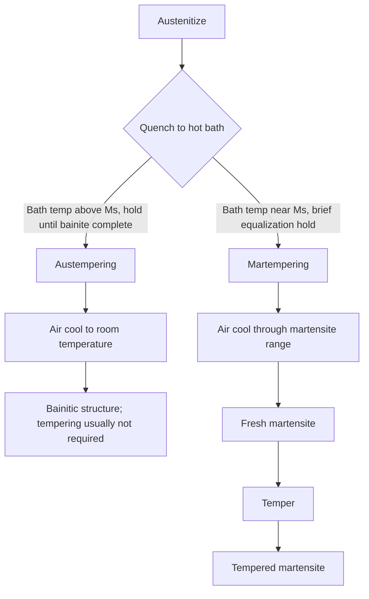
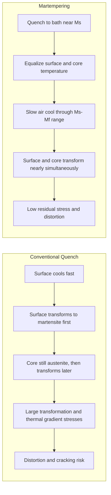

## Austempering and Martempering


Austempering and martempering (also called marquenching) are **interrupted-quench heat treatments** that use a hot quenching medium, typically molten salt or hot oil, to hold steel at an intermediate temperature before final cooling. Both processes aim to reduce thermal gradients between surface and core during quenching, thereby minimizing distortion and quench cracking relative to conventional quench-and-temper practice.

They differ in their metallurgical objective:

- **Austempering** holds the steel *isothermally* above the martensite start temperature ($M_s$) until austenite transforms **completely to bainite**.
- **Martempering** holds the steel *just above or slightly within the martensite range* only long enough to equalize temperature throughout the section, then air-cools through the martensite transformation, producing **martensite** (which is subsequently tempered).

---

### Fundamentals

#### Background: Transformation Diagrams

The behavior of austenite during isothermal or continuous cooling is described by:

- **TTT (Time-Temperature-Transformation) diagrams**: transformation at constant temperature
- **CCT (Continuous-Cooling-Transformation) diagrams**: transformation during cooling at varying rates

Key features relevant to both processes:

| Feature | Description |
| --- | --- |
| Pearlite nose | Region of fastest pearlite formation (~500–600 °C for plain carbon steels); the quench must miss it |
| Bainite region | Below the pearlite nose, above $M_s$; transformation product is bainite |
| $M_s$ (martensite start) | Temperature at which martensite begins to form on cooling |
| $M_f$ (martensite finish) | Temperature at which martensite transformation is essentially complete |
| Incubation time | Delay before transformation begins at a given temperature |

An empirical estimate of $M_s$ for steels (Andrews linear equation, temperatures in °C, compositions in wt%):

$$M_s = 539 - 423\,C - 30.4\,Mn - 17.7\,Ni - 12.1\,Cr - 7.5\,Mo$$

[Inference] This is an empirical approximation with limited accuracy across compositions (typically ±20–30 °C or more); experimental determination (dilatometry) is preferred for design.

#### Why Interrupted Quenching?

In conventional quenching (direct quench to room temperature or a cold oil bath), the surface cools faster than the core. Two stresses arise:

1. **Thermal stresses**: from non-uniform contraction during cooling
2. **Transformation stresses**: from the ~2–4% volume expansion during austenite to martensite transformation, occurring at different times at surface and core

When surface and core transform at different times, large residual stresses, distortion, and cracking can result.

**Key Points**

- Holding at an elevated bath temperature equalizes temperature *before* transformation begins (martempering) or lets transformation occur *uniformly and slowly* (austempering).
- Both approaches reduce the magnitude of thermal and transformation stress gradients.
- Interrupted quenching does not reduce the need for adequate hardenability; the steel must avoid pearlite formation during the initial quench.



---

### Austempering

#### Definition and Objective

Austempering is a heat treatment in which steel is:

1. Austenitized
2. Quenched rapidly (fast enough to avoid pearlite) to a bath held at a temperature between roughly **250 and 450 °C**, above $M_s$
3. Held isothermally until the austenite transforms fully to **bainite**
4. Cooled to room temperature in air

The result is a bainitic microstructure with an attractive combination of hardness, strength, ductility, and toughness, typically superior in toughness to martensite tempered to the same hardness.

#### Process Steps

| Step | Description | Typical Parameters |
| --- | --- | --- |
| 1. Austenitize | Heat to austenitizing temperature to dissolve carbides and form homogeneous austenite | 790–900 °C (steel dependent), time per section thickness |
| 2. Quench | Transfer rapidly to hot salt (or hot oil) bath | Bath at 230–450 °C, transfer time as short as possible |
| 3. Isothermal hold | Hold until transformation is complete | Minutes to hours depending on temperature and alloy |
| 4. Cool | Air cool to room temperature | Ambient |
| 5. Wash | Remove residual salt (water rinse) | Ensure salt removal to prevent corrosion |

**Key Points**

- The quench must be fast enough to **miss the pearlite nose**, so section size and steel hardenability set practical limits.
- Transformation must be **complete** before removal; interrupting too early leaves untransformed austenite that transforms to fresh (untempered) martensite on cooling, producing a brittle mixed structure.
- No subsequent tempering is generally required, although a light temper is sometimes applied for stress relief.

#### Bainite Formation

Bainite is a non-lamellar aggregate of **ferrite plates (sheaves) and carbides** (or carbon-enriched austenite) formed by a combined displacive and diffusional mechanism. Two morphologies are commonly distinguished by transformation temperature:

| Type | Temperature Range (approx.) | Structure | Properties |
| --- | --- | --- | --- |
| **Upper bainite** | ~400–550 °C | Coarse ferrite laths with carbide precipitates at lath boundaries | Lower toughness, moderate strength |
| **Lower bainite** | ~250–400 °C | Fine ferrite plates with fine carbides *inside* the plates | Higher strength and better toughness |

[Inference] Temperature boundaries between upper and lower bainite depend on carbon content and alloying; values above are typical for medium-to-high-carbon steels.

**Key Points**

- Lower bainite is usually preferred for high-performance applications because of superior strength-toughness balance.
- In high-silicon (or aluminum) steels, carbide precipitation is suppressed, giving **carbide-free bainite**: ferrite plates separated by carbon-enriched retained austenite. This is the basis for TRIP-assisted steels and nanostructured bainite.
- The transformation is **incomplete** in the classical sense in many steels: it stops when the remaining austenite is sufficiently enriched in carbon that its free energy equals that of ferrite of the same composition (the *incomplete reaction phenomenon*, $T_0$ curve criterion).

The $T_0$ concept states that bainitic ferrite growth ceases when the carbon content of residual austenite reaches the $T_0$ (or $T_0'$, including strain energy) curve composition, where austenite and ferrite of identical composition have equal free energy.

#### Kinetics and Time Selection

Isothermal transformation kinetics are commonly described by the **Johnson-Mehl-Avrami-Kolmogorov (JMAK)** equation:

$$f = 1 - \exp\left(-k\,t^{n}\right)$$

Where:

- $f$ = fraction transformed
- $k$ = rate constant (temperature dependent)
- $t$ = time
- $n$ = Avrami exponent (depends on nucleation and growth mode)

The time to reach a target transformed fraction is:

$$t = \left[\frac{-\ln(1-f)}{k}\right]^{1/n}$$

**Example: Estimating hold time for 99% transformation**

Given $k = 2.0 \times 10^{-3}\ \text{s}^{-n}$ and $n = 1.5$ (illustrative values), find the time for $f = 0.99$:

$$t = \left[\frac{-\ln(0.01)}{2.0 \times 10^{-3}}\right]^{1/1.5} = \left[\frac{4.605}{2.0 \times 10^{-3}}\right]^{0.667} = (2302.6)^{0.667} \approx 172\ \text{s}$$

**Output**

$t \approx 172\ \text{s}$ (about 3 minutes) for 99% transformation with these illustrative constants.

[Inference] Real values of $k$ and $n$ must be measured for the specific steel and temperature (e.g., by dilatometry or from published TTT curves). Industrial hold times for common steels are commonly minutes to hours, because plain-carbon and low-alloy steels transform bainite relatively slowly at lower temperatures.

#### Steels Suitable for Austempering

| Steel Type | Typical Grades | Notes |
| --- | --- | --- |
| Plain carbon, medium-to-high C | 1050, 1070, 1080, 1095 | Sections limited (thin) due to limited hardenability |
| Low alloy | 5160, 4140 (limited), 4340 (limited) | Longer transformation times |
| Spring steels | 1074, 1095, 5160 | Clips, springs, saw blades |
| Tool steels | Some (e.g., certain shock-resisting types) | Selected applications |
| Cast irons | Ductile iron (ADI) | Major commercial application |
| Silicon-rich bainitic steels | e.g., 0.6–0.8% C with ~1.5–2.0% Si | Carbide-free bainite |
| Nanostructured bainitic steels | High C (~0.8–1.0%), Si, Mn, Cr, Mo, Co, Al | Very low transformation temperature (~200–250 °C), very long times |

**Key Points**

- Plain-carbon steels typically require sections **below ~5–6 mm** for austempering, because the quench must clear the pearlite nose across the whole section. Alloying extends allowable section thickness.
- The **Carbon Content Guide**: steels with about 0.5–1.0% C are most commonly austempered. Lower-carbon steels can be austempered but yield lower-strength bainite.

#### Austempering Media

| Medium | Temperature Range | Notes |
| --- | --- | --- |
| Molten nitrate/nitrite salt (e.g., NaNO$_3$/KNO$_3$/NaNO$_2$ mixtures) | ~160–600 °C | Most common; high and uniform heat extraction; small water additions accelerate cooling |
| Hot oil (martempering/austempering oil) | up to ~230 °C (typical), some to ~250 °C | Limited maximum temperature, so suited to lower-temperature bainite |
| Fluidized bed | Wide range | Uniform, dry, less common |
| Lead bath | Historic use | Largely obsolete due to toxicity |

**Key Points**

- Salt bath cooling rate is significantly enhanced by **controlled water additions** (about 0.5–1.5%), which increase vapor-film breakdown and quench severity for thicker sections.
- Salt must be carefully managed: nitrate/nitrite salts are strong oxidizers, and contact with organic material or cyanide salts, or overheating above the safe limit, can cause fire or explosion.
- Parts must be **dry** before entering the salt bath to avoid violent steam eruption.

#### Properties of Austempered Steel

Compared with quenched-and-tempered steel at the same hardness (typically 40–50 HRC):

| Property | Austempered (bainitic) | Quenched and Tempered (martensitic) |
| --- | --- | --- |
| Ductility (elongation, reduction of area) | Higher | Lower |
| Impact toughness | Typically higher | Lower |
| Fatigue resistance | Comparable or improved | Baseline |
| Distortion | Lower | Higher |
| Quench-crack risk | Very low | Higher |
| Hydrogen embrittlement susceptibility | Lower | Higher |
| Maximum attainable hardness | Lower than untempered martensite | Higher |

**Key Points**

- Austempering is often applied to parts requiring **40–55 HRC** with good toughness (springs, clips, small tools, fasteners, chain components).
- The reduced quench-crack and hydrogen embrittlement susceptibility make it attractive for fasteners and thin-walled components. [Inference] The degree of benefit depends on steel and process conditions.

#### Austempered Ductile Iron (ADI)

ADI is one of the largest commercial applications of austempering. Ductile iron is austenitized (~840–950 °C), quenched to an austempering temperature (~250–400 °C), and held to form **ausferrite**, a mixture of acicular ferrite and carbon-stabilized (high-carbon) retained austenite, while graphite nodules remain.

| ADI Grade Trend | Austempering Temp | Result |
| --- | --- | --- |
| Low austempering temperature (~250–300 °C) | Fine ausferrite | High strength (up to ~1400 MPa tensile), high hardness and wear resistance, lower ductility |
| High austempering temperature (~350–400 °C) | Coarser ausferrite, more retained austenite | Lower strength, higher ductility and toughness |

**Key Points**

- The **process window** is the time between completion of the first-stage reaction (austenite to ausferrite plus stabilized austenite) and onset of the second-stage reaction (high-carbon austenite decomposes to ferrite plus carbide, which is detrimental). Holding time must remain within this window.
- ADI offers an excellent strength-to-weight ratio and wear resistance for gears, crankshafts, suspension parts, and rail components.
- Alloying (Cu, Ni, Mo) increases hardenability and allows austempering of thicker sections.

---

### Martempering (Marquenching)

#### Definition and Objective

Martempering is a heat treatment in which steel is:

1. Austenitized
2. Quenched into a hot bath (salt or oil) held at a temperature **just above or slightly within the martensite range** (approximately at $M_s$)
3. Held only long enough for the temperature to **equalize between surface and core** (before bainite forms)
4. Removed and cooled slowly (air cooling) through the martensite transformation range
5. Tempered, as in conventional practice

Martempering yields **martensite** with the same hardness potential as conventional quenching, but with markedly reduced residual stress and distortion, since the surface and core transform to martensite at nearly the same time during the final slow cooling.

#### Process Steps

| Step | Description | Typical Parameters |
| --- | --- | --- |
| 1. Austenitize | Heat to standard austenitizing temperature | Same as conventional hardening (e.g., 800–870 °C) |
| 2. Quench | Transfer to hot bath at or near $M_s$ | Bath at ~150–260 °C (often $M_s$ ± 25 °C) |
| 3. Equalize | Hold briefly for temperature uniformity | Seconds to a few minutes; must stay *below* the incubation time of bainite |
| 4. Air cool | Cool in still or slowly moving air through the $M_s$–$M_f$ range | Ambient |
| 5. Wash | Remove salt residue | Water or hot rinse |
| 6. Temper | Standard tempering to reduce brittleness | 150–650 °C, depending on target hardness |

**Key Points**

- The equalizing hold must be **shorter than the incubation period for bainite** at the bath temperature; otherwise bainite begins to form, resulting in a mixed structure and reduced hardness.
- Tempering is essential, because the as-cooled structure is untempered martensite (hard but brittle).

#### Variants of Martempering

| Variant | Bath Temperature | Description |
| --- | --- | --- |
| **Conventional martempering** | Slightly above $M_s$ | Standard variant, maximum stress reduction with hardness comparable to full quench |
| **Modified martempering** | Below $M_s$ (~ within martensite range), often 100–200 °C | Faster cooling, suitable for steels with lower hardenability; reduces but does not eliminate transformation stresses |
| **Time quenching** | Interrupted oil quench, then air | Practical shop-floor approach; quench is interrupted when parts reach a specific temperature |

#### Selection of Bath Temperature

| Bath Temperature Relative to $M_s$ | Effect |
| --- | --- |
| Well above $M_s$ (e.g., +50 °C) | Maximum equalization; greater risk of bainite formation for slowly transforming steels; lower cooling rate at the surface may not miss the pearlite nose in low-hardenability steels |
| At $M_s$ (± 25 °C) | Good compromise; commonly used |
| Below $M_s$ | Some martensite forms in the bath; faster overall cooling, but less stress relief |

**Key Points**

- Martempering is most effective for steels with **sufficient hardenability** to avoid pearlite and bainite formation during the transfer and hold.
- Alloy and tool steels are typical candidates, since plain-carbon steels have a short window before pearlite transformation in thicker sections.

#### Mechanism of Distortion and Crack Reduction



Key stress reduction arguments:

- Temperature gradient across the section at the onset of martensite formation is minimized.
- Martensite forms nearly simultaneously across the section during slow cooling, so transformation strain is more uniform.
- The lower cooling rate through $M_s$–$M_f$ reduces thermal stress.

#### Steels Suitable for Martempering

| Steel Type | Examples | Notes |
| --- | --- | --- |
| Carburized case-hardening steels | 8620, 4320, 9310 | Very common, reduces distortion of gears |
| Medium-carbon alloy steels | 4140, 4340, 5140 | Good hardenability |
| Tool steels | O1, A2, D2, H13, M2 (high-speed steels) | Standard practice; step quenching in salt is well established for high-speed steels |
| High-carbon steels | 52100, 1095 (thin sections) | Distortion control for bearings and dies |
| Thin-section plain-carbon steels | 1045, 1095 | Limited by hardenability |

**Key Points**

- Martempering is widely used for **carburized gears and bearing races**, where distortion is critical for subsequent load-carrying accuracy.
- High-speed steels (e.g., M2) are often stepped through a **series of hold temperatures** (e.g., ~540 °C, then ~850 °C for pre-heat) before final quench, a form of staged interrupted quench.

#### Properties of Martempered Steel

Compared with conventional quench and temper:

| Property | Martempered | Conventional Quench |
| --- | --- | --- |
| Hardness | Essentially the same (same martensite) | Baseline |
| Distortion | Significantly lower | Higher |
| Quench cracking | Significantly lower | Higher |
| Residual stress | Lower (near surface) | Higher |
| Fatigue strength | Often improved | Baseline |
| Ductility / toughness | Comparable after tempering | Comparable after tempering |
| Process complexity | Higher (salt bath maintenance) | Lower |

---

### Comparison of Austempering and Martempering

| Feature | Austempering | Martempering |
| --- | --- | --- |
| Bath temperature | ~250–450 °C (above $M_s$) | ~ $M_s$ (± 25–50 °C), typically 150–260 °C |
| Hold time | Long (until bainite transformation complete) | Short (temperature equalization only) |
| Final microstructure | Bainite (or ausferrite in ADI) | Martensite, then tempered martensite |
| Transformation during hold | Yes, austenite to bainite | No (should be avoided) |
| Tempering required | Usually no | Yes |
| Hardness range | ~35–55 HRC (typical) | Up to full martensitic hardness (60+ HRC) |
| Ductility and toughness | High for given hardness | Good after tempering |
| Distortion / cracking | Very low | Low |
| Typical section limit | Thin (plain C ~ under 5–6 mm; alloy steel thicker) | Moderate (limited by hardenability) |
| Typical parts | Springs, fasteners, clips, ADI castings, chain links | Gears, tools, dies, bearing races, precision parts |
| Cycle time | Long (hold time) | Short-moderate |

**Key Points**

- Austempering trades maximum hardness for **toughness and dimensional stability**.
- Martempering retains **martensitic hardness** while reducing stress-related defects.

---

### Process Control and Equipment

#### Salt Bath Furnace Practice

**Equipment**

- Austenitizing furnace (neutral salt bath, atmosphere furnace, or vacuum furnace)
- Quench salt bath (nitrate/nitrite mixture) with heating (electric or gas-fired) and cooling capability
- Agitation system (mechanical stirrers or pumps) to ensure uniform heat transfer
- Water addition system for controlled bath cooling capacity (austempering)
- Wash and rinse stations; salt recovery system
- Temperature control and safety interlocks (over-temperature cutout, level detection)

**Process control parameters**

| Parameter | Importance |
| --- | --- |
| Bath temperature (uniformity ±5 °C) | Determines microstructure (bainite type or $M_s$ equalization) |
| Bath agitation | Uniform cooling rates and avoiding vapor pockets |
| Water content (austempering salt) | Adjusts quench severity |
| Load size and density | Affects bath temperature recovery and cooling rate |
| Transfer time (furnace to bath) | Must minimize to avoid premature transformation on the surface |
| Salt contamination (carbonate, chloride, cyanide) | Affects cooling behavior and corrosion; may create safety hazards |

#### Hot Oil Quenching

- Martempering oils are formulated for **temperatures up to ~230 °C** with good oxidation resistance.
- Oil is convenient and avoids salt washing, but its maximum operating temperature (and thus $M_s$-range coverage) is lower than salt.
- Flash and fire points impose strict operating limits; use inert atmosphere or covers where practical.
- Suitable primarily for martempering low-$M_s$ steels and lower-temperature austempering of certain grades.

#### Fluidized Bed

- Dry, uniform, environmentally cleaner alternative.
- Lower heat transfer coefficient than salt; suitable for thinner sections and specialized applications.

---

### Practical Examples

#### Example 1: Austempering a 1080 Steel Spring Clip

**Requirements**

- Material: AISI 1080, thickness 1.5 mm
- Target hardness: 46–50 HRC
- Requirement: high ductility, no cracking, minimal distortion

**Process (indicative starting parameters)**

| Step | Parameters |
| --- | --- |
| Austenitize | 830–850 °C, protective atmosphere, 10–15 min |
| Quench | Nitrate/nitrite salt at 315–345 °C, with ~1% water addition |
| Isothermal hold | 20–30 min (verify by TTT/trial) |
| Cool | Air |
| Wash | Hot water rinse |

**Output**

- Lower bainite microstructure
- Hardness ~47–50 HRC
- Improved elongation and toughness relative to quenched and tempered martensite at the same hardness

[Inference] Bath temperature and hold time should be validated against the TTT diagram and trial parts for the specific alloy chemistry and section thickness.

#### Example 2: Martempering a Carburized 8620 Gear

**Requirements**

- Material: AISI 8620, carburized to ~0.8% surface C, case depth ~1.0 mm
- Requirement: minimal distortion of gear teeth (critical for noise and load distribution)

**Process (indicative starting parameters)**

| Step | Parameters |
| --- | --- |
| Carburize | 925 °C, endothermic atmosphere with carbon potential control |
| Cool and reheat | Reheat to ~840 °C (hardening temperature) |
| Quench | Martempering oil at ~150–180 °C, or salt at ~170–200 °C |
| Equalize | 5–10 min |
| Air cool | To room temperature |
| Temper | 160–180 °C, 1–2 h |

**Output**

- Case: tempered martensite, surface hardness ~58–62 HRC
- Core: low-carbon lath martensite/bainite (~30–40 HRC)
- Reduced distortion (helix/lead variation) compared with direct oil quench at ~60 °C

[Inference] Case $M_s$ (about 200–250 °C for ~0.8% C, lower than core) and section size drive bath temperature selection; adjust to minimize distortion for a specific gear geometry.

#### Example 3: Estimating Bath Temperature from $M_s$ and Selecting a Process

The following Python script estimates $M_s$ using the Andrews linear equation and suggests a process window.

```python
def andrews_ms(C, Mn=0.0, Ni=0.0, Cr=0.0, Mo=0.0):
    """Andrews linear M_s estimate (deg C); compositions in wt%."""
    return 539 - 423*C - 30.4*Mn - 17.7*Ni - 12.1*Cr - 7.5*Mo

def suggest_process(name, C, Mn=0.0, Ni=0.0, Cr=0.0, Mo=0.0):
    ms = andrews_ms(C, Mn, Ni, Cr, Mo)
    print(f"{name}: estimated Ms = {ms:.0f} C")
    print(f"  Martempering bath : {ms-25:.0f} to {ms+25:.0f} C (equalize only)")
    print(f"  Austempering bath : {ms+30:.0f} to {ms+200:.0f} C (hold to bainite completion)")
    print()

suggest_process("1080", C=0.80, Mn=0.75)
suggest_process("4140", C=0.40, Mn=0.85, Cr=0.95, Mo=0.20)
suggest_process("8620 (carburized case, 0.8C)", C=0.80, Mn=0.80, Ni=0.55, Cr=0.50, Mo=0.20)
```

**Output**



```
1080: estimated Ms = 177 C
  Martempering bath : 152 to 202 C (equalize only)
  Austempering bath : 207 to 377 C (hold to bainite completion)

4140: estimated Ms = 300 C
  Martempering bath : 275 to 325 C (equalize only)
  Austempering bath : 330 to 500 C (hold to bainite completion)

8620 (carburized case, 0.8C): estimated Ms = 164 C
  Martempering bath : 139 to 189 C (equalize only)
  Austempering bath : 194 to 364 C (hold to bainite completion)
```

[Inference] The Andrews equation is approximate. Austempering bath temperatures near the upper part of the range give upper bainite with lower strength and are rarely used for high-performance parts; final selection should be based on the TTT diagram and property targets.

---

### Common Problems and Troubleshooting

| Problem | Process | Probable Causes | Remedies |
| --- | --- | --- | --- |
| Soft, mixed structure (pearlite present) | Both | Quench too slow, load too dense, bath too hot, low-hardenability steel | Increase agitation, add water (salt), reduce load density, lower bath temp, use higher-hardenability grade |
| Fresh martensite in austempered part | Austempering | Hold time too short, incomplete bainite transformation | Extend hold time; verify against TTT/dilatometry |
| Bainite in martempered part | Martempering | Equalization hold too long, bath too hot | Shorten hold; lower bath temp closer to $M_s$ |
| Excessive distortion | Both | Non-uniform loading/fixturing, poor agitation, bath temp gradient | Improve fixturing, symmetrical racking, maintain bath uniformity |
| Cracking | Both | Parts entering bath wet, sharp geometry, excessive retained stresses | Ensure dry parts, radius corners, stress relieve before hardening |
| Low hardness (austempering) | Austempering | Bath temperature too high (upper bainite) | Reduce bath temperature |
| Brittle behavior (martempering) | Martempering | Skipped or inadequate tempering | Temper promptly after quench |
| Salt staining / corrosion | Both | Inadequate washing | Add multi-stage rinse; neutralize |
| Salt bath fire/eruption | Both | Water contact at high temp, contamination, overheating | Dry parts, strict housekeeping, temperature limits, appropriate salt chemistry |
| Second-stage reaction (ADI) | Austempering (ADI) | Hold time beyond process window | Limit hold time; verify with test coupons |

---

### Design and Selection Guidelines

**Key Points**

- **Choose austempering when**: high toughness/ductility at moderate hardness (about 40–55 HRC) is needed, parts are relatively thin, or quench cracking and hydrogen embrittlement risks are a concern (springs, clips, fasteners).
- **Choose martempering when**: high hardness (martensitic) is required but distortion and cracking must be controlled (gears, tool steels, precision dies, bearings).
- **Check hardenability**: perform Jominy or use TTT/CCT diagrams to confirm the steel avoids pearlite in the required section.
- **Section size**: limit section thickness for plain-carbon steels; use alloy steels for larger sections.
- **Fixturing**: rack parts to permit free circulation of the quenchant, prevent nesting, and avoid distortion during heating.
- **Cleaning and finishing**: plan for salt removal and possible post-hardening grinding or straightening (straightening after austempering is usually not feasible because bainite has limited plasticity margin; [Inference] minor straightening may be possible in low-hardness ranges).

---

### Safety and Environmental Considerations

**Key Points**

- **Nitrate/nitrite salts** are powerful oxidizers; keep away from organic materials, cyanides, carbonaceous fuels, and reducing agents. Observe manufacturer limits on maximum bath temperature (commonly ~600 °C for nitrate/nitrite quench salts) to avoid decomposition.
- **Moisture and steam explosion risk**: parts, fixtures, and charging equipment must be completely dry before immersion in hot salt.
- **Personal protective equipment**: face shield, heat-resistant gloves, aprons, and appropriate respiratory protection where required.
- **Oil quenching hazards**: flash fire risk; maintain fire suppression, temperature limits, and oil condition monitoring.
- **Waste handling**: spent salt and rinse waters may contain nitrates/nitrites; follow local environmental regulations for treatment and disposal.
- Verify safety data sheets (SDS), regulatory requirements, and salt supplier guidance for site-specific operation.

---

### Relevant Standards and References

| Standard / Reference | Scope |
| --- | --- |
| ASTM A897/A897M | Austempered ductile iron castings specification |
| ASTM A1015 | Austempering-related requirements for steel/iron (verify scope) |
| SAE AMS 2759 series | Heat treatment of steel parts (includes interrupted-quench provisions in certain parts) |
| ISO 17804 | Ductile cast iron, austempered (ADI), classification |
| ASM Handbook, Vol. 4A/4B | Steel Heat Treating Fundamentals and Processes; Steel Heat Treating Technologies |
| Bhadeshia, H.K.D.H., *Bainite in Steels* | Comprehensive reference on bainite transformation and microstructure |

[Unverified] Exact standard numbers, scopes, and revisions should be confirmed against the latest published versions before use in specifications or procurement.

---

### Conclusion

Austempering and martempering both exploit an isothermal or near-isothermal hold in a hot quench bath to control the timing of transformation and thereby reduce residual stress, distortion, and cracking. Austempering produces a **bainitic** structure (ausferrite in ductile iron) with an excellent combination of hardness, ductility, and toughness, and generally needs no tempering. Martempering delivers the **full hardness of martensite**, but the equalization hold ensures the surface and core transform together during air cooling, which is followed by conventional tempering. Selection depends on the required hardness, toughness, section size, steel hardenability, and dimensional tolerance, with salt-bath control, water content, agitation, and load management being key to consistent industrial results.

---

**Related Topics**

- TTT and CCT diagrams and their construction (dilatometry)
- Bainite microstructure, upper vs. lower bainite, carbide-free bainite
- Nanostructured bainite (low-temperature bainite) steels
- Austempered ductile iron (ADI) processing and applications
- Quench media and quench severity (H-value, Grossmann number)
- Tempering of martensite and temper embrittlement
- Retained austenite and its stability (TRIP effect)
- Distortion control and residual stress measurement
- Carburizing followed by interrupted quenching
- Isothermal annealing and patenting (related isothermal processes)