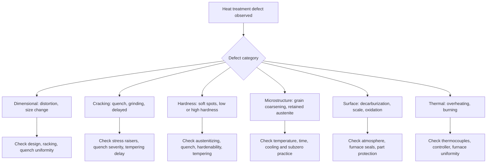

## Heat Treatment Defects and Troubleshooting


Heat treatment defects are departures from the intended microstructure, hardness, dimensions, surface condition, or residual stress state of a steel component after thermal processing. They arise from errors or variability in the **material**, **design**, **furnace and atmosphere control**, **heating and soaking practice**, **quenching**, **tempering**, or **post-treatment handling**. Effective troubleshooting is a systematic exercise: identify the defect, correlate it with the process history and metallurgy, isolate the root cause, and implement corrective and preventive action.

**Key Points**

- Most heat treatment failures trace back to one of four sources: (1) the steel itself (chemistry, cleanliness, prior structure), (2) part design (geometry, section changes), (3) process control (temperature, time, atmosphere, quench), or (4) downstream operations (grinding, plating, straightening).
- Many defects interact: for example, overheating promotes grain coarsening, which raises quench-crack susceptibility and lowers toughness.
- Root cause analysis requires both **process records** (time-temperature charts, atmosphere logs, quenchant condition) and **metallurgical evidence** (hardness traverses, metallography, fractography).

---

### Classification of Heat Treatment Defects

| Category | Representative Defects | Primary Consequence |
| --- | --- | --- |
| Dimensional | Distortion, warpage, size change (growth/shrinkage), out-of-roundness | Fit and assembly failure, rework or scrap |
| Cracking | Quench cracks, grinding cracks, delayed (hydrogen) cracks, seam and lap opening | Scrap, service fracture |
| Hardness-related | Soft spots, insufficient hardness, excessive hardness, hardness scatter | Wear or strength shortfall, brittleness |
| Microstructural | Grain coarsening, retained austenite, incomplete transformation, banding, carbide networks, temper embrittlement | Toughness and fatigue loss |
| Surface | Decarburization, carburization, oxidation/scale, soot, pitting, intergranular oxidation | Fatigue life reduction, poor finish |
| Thermal-metallurgical | Overheating, burning, incipient melting | Irreversible damage, scrap |
| Stress-related | High residual tensile stress, stress corrosion or delayed fracture | Premature failure |



---

### Root Cause Analysis Framework

#### The Four-Factor Approach

| Factor | Questions to Ask |
| --- | --- |
| **Material** | Is the chemistry within specification (C, Mn, Cr, Mo, B, residuals)? Is the heat lot different from previous lots? Is there banding, segregation, inclusions, or seams? What is the prior microstructure (annealed, normalized, cold-worked)? |
| **Design** | Are there sharp corners, holes, keyways, thin-to-thick transitions, or asymmetry? Is the section size appropriate for the steel hardenability? |
| **Process** | Furnace temperature uniformity (TUS)? Soak time? Atmosphere or carbon potential? Load density and racking? Transfer time? Quenchant type, temperature, agitation, contamination? Tempering delay and temperature? |
| **Post-treatment** | Aggressive grinding? Straightening? Plating or pickling (hydrogen uptake)? Storage delays before tempering? |

#### Systematic Investigation Steps

1. **Define the defect** precisely: location, frequency, timing (found after quench, after temper, after grinding, in service).
2. **Review records**: furnace charts, calibration and TUS reports (e.g., AMS 2750), atmosphere data, quenchant tests, certificates of conformity for the steel.
3. **Non-destructive checks**: visual, magnetic particle inspection (MPI), hardness survey, eddy current, dimensional gauging.
4. **Destructive analysis**: sectioning, macro-etch, microstructure (nital, picral), microhardness traverse, grain size (prior austenite grain boundary etch), fractography (SEM).
5. **Chemical verification**: spark or OES analysis, carbon and nitrogen profiles.
6. **Reproduce** the defect on test pieces if possible (e.g., varying one parameter at a time).
7. **Implement corrective action**, then verify with controlled trials.
8. **Update procedures** and control plans to prevent recurrence.

**Key Points**

- Fractographic features help identify the mechanism: intergranular fracture surfaces suggest overheating, temper embrittlement, hydrogen, or grain-boundary carbide films; transgranular cleavage suggests brittle martensite or low-temperature fracture.
- The **time of appearance** is diagnostic: cracks appearing immediately in the quench point to thermal/transformation stress; cracks appearing hours or days later suggest hydrogen or residual stress release (delayed cracking, season cracking in stressed martensite).

---

### Distortion and Dimensional Change

#### Sources of Distortion

| Source | Mechanism |
| --- | --- |
| Residual stresses from prior processing (machining, forging, rolling, welding) | Stress relaxation on heating, causing shape change |
| Thermal gradients on heating | Non-uniform expansion, plastic yielding at temperature |
| Thermal gradients on quenching | Differential contraction, plastic deformation of soft austenite |
| Transformation volume change | Austenite (dense) to martensite (~2–4% volume expansion, carbon dependent) or bainite; non-uniform transformation produces shape change |
| Gravity (creep) at high temperature | Sagging of unsupported sections during soak |
| Racking and fixturing | Non-symmetric support, constraint |

#### Types of Dimensional Change

- **Size change (volumetric)**: predictable growth or shrinkage due to phase change and retained austenite. Martensite formation causes growth; retained austenite decreases growth; tempering martensite causes slight shrinkage; transformation of retained austenite causes growth.
- **Shape change (distortion)**: bending, bowing, twisting, out-of-roundness, taper, non-uniform growth. These vary with part geometry and quench asymmetry.

An approximate estimate of linear dimensional growth from full martensitic transformation is:

$$\frac{\Delta L}{L} \approx \frac{1}{3}\frac{\Delta V}{V}$$

Where $\Delta V/V$ is the fractional volume change accompanying the transformation. [Inference] For medium-carbon steel, the volume increase on martensite formation is typically on the order of 1–3%, so linear growth is on the order of 0.3–1.0 ×10⁻² (≈0.3–1%) in the idealized fully constrained-free case; actual values depend on carbon, retained austenite, and geometry, and should be measured empirically.

**Example: Estimating linear growth**

For a bar with $\Delta V/V = 0.015$:

$$\frac{\Delta L}{L} \approx \frac{0.015}{3} = 0.005$$

**Output**

A $200\ \text{mm}$ length would grow about $1.0\ \text{mm}$ in the isotropic idealization. [Inference] Real components rarely change isotropically; the calculation is a first-pass estimate only.

#### Distortion Control Measures

| Stage | Preventive Action |
| --- | --- |
| Design | Symmetric geometry, uniform section thickness, generous radii, avoid blind holes, use balanced ribs; consider steels of higher hardenability so gentler quenches can be used |
| Material | Use stress-relieved or normalized blanks; homogeneous, banding-free steel |
| Pre-treatment | Stress relieve after rough machining (e.g., 550–650 °C) before hardening |
| Heating | Slow, uniform heating; preheat stages for complex geometries; support long parts to prevent sagging |
| Racking | Symmetric loading, hanging long parts vertically, avoid contact points that constrain movement |
| Quenching | Use least severe quenchant that achieves required hardness; martempering or austempering; uniform agitation; press or plug quenching for critical geometries |
| Post-treatment | Prompt tempering; subzero treatment followed by tempering for dimensional stability |

**Key Points**

- **Press quenching** (constrained quenching) controls distortion in gears, rings, and thin discs by mechanically restraining the part during cooling.
- **Predictable distortion** can be compensated by machining allowances (e.g., pre-shrinking or pre-expanding dimensions) based on historical data.
- Distortion tends to be lowest in **through-hardened parts with mild quench** and in parts with symmetrical geometry.

---

### Quench Cracking

#### Mechanism

Quench cracks form when tensile stress exceeds the local fracture strength of the untempered (brittle) martensite. Contributing stress components:

- **Thermal stress** from temperature gradient
- **Transformation stress** from non-simultaneous martensite formation at surface and core
- **Stress concentration** at geometric notches

Cracks typically initiate at stress raisers and propagate along prior austenite grain boundaries (intergranular) or transgranular through martensite plates. They commonly appear as **straight or slightly branched, deep cracks, with non-oxidized or lightly oxidized fracture surfaces** (if tempered promptly). Cracks that occurred before tempering often show tempering colors or decarburized edges if tempering was delayed after crack formation.

#### Risk Factors

| Factor | Effect |
| --- | --- |
| High carbon content (typically >0.5%) | Lower $M_s$, harder, more brittle martensite, higher crack sensitivity |
| Alloying elements raising hardenability | Allow milder quenchants, but very high hardenability with rapid quench may also promote cracking |
| Sharp corners, keyways, threads, holes | Stress concentrators |
| Abrupt section changes | Differential cooling |
| Overheating (grain coarsening) | Coarse martensite, lower fracture resistance |
| Excessively severe quench (water, brine) | High thermal gradient |
| Delay between quench and temper | Untempered martensite stress relaxation lacking; delayed cracking risk |
| Prior defects (seams, laps, inclusions, decarburization, banding) | Crack initiation sites |
| High surface carbon (carburized) | Retained austenite and high-carbon martensite brittleness |

#### Prevention

| Action | Rationale |
| --- | --- |
| Use a **milder quenchant** (oil, polymer, or interrupted quench) | Reduce thermal gradient |
| **Martempering / austempering** | Reduce transformation stress differential |
| Temper immediately (within minutes to hours, before cooling fully to room temperature where recommended by the quenchant/steel) | Relieves stress, tempers brittle martensite |
| Add radii and remove sharp notches | Lower stress concentration |
| Plug holes or use insulating paste in sensitive zones | Balance cooling rates |
| Avoid overheating; control grain size | Tougher microstructure |
| Verify steel quality (no seams, low banding) | Remove initiation sites |
| Subcritical anneal or stress relieve before hardening | Lower baseline residual stress |
| Use steel with lower carbon or use more hardenable alloy for milder quench | Reduce brittleness |

**Key Points**

- Quench cracks are **distinguished from grinding cracks** by orientation and network pattern: quench cracks are typically longitudinal or radial and deep; grinding cracks form a fine, shallow, networked or perpendicular-to-grinding-direction pattern.
- The "**delay to temper**" interval is critical for high-carbon and highly alloyed steels: many should be tempered while still warm (about 50–70 °C, or when hands can just hold the part, depending on the practice guide for the grade).

#### Quench Severity (Grossmann H-value)

Quench severity is often characterized by the Grossmann number $H$:

$$H = \frac{h}{2k}$$

Where $h$ is the surface heat transfer coefficient (W/m²·K) and $k$ is the thermal conductivity of the steel (W/m·K), giving $H$ in units of m⁻¹ (often reported in in⁻¹).

| Quench Medium | Typical $H$ (in⁻¹, still to agitated) |
| --- | --- |
| Air | ~0.02 |
| Oil (still to moderate agitation) | ~0.25–0.7 |
| Polymer solution | ~0.2–1.0 (concentration dependent) |
| Water (still to agitated) | ~1.0–4.0 |
| Brine | ~2.0–5.0 |

[Inference] Values vary with temperature, agitation, and source; treat as indicative. Milder quench (lower $H$) reduces cracking risk but may fail to reach through-hardness in low-hardenability steels.

---

### Delayed Cracking and Hydrogen-Related Defects

#### Hydrogen Embrittlement and Delayed Cracking

Atomic hydrogen dissolved in high-strength steel migrates to regions of high triaxial stress (crack tips, notches) and reduces cohesive strength, leading to delayed, often intergranular, cracking under sustained or residual stress.

**Sources of hydrogen in heat-treatment shops**

- Moisture in furnace atmosphere or on parts
- Dissociation of hydrocarbons and ammonia (in carburizing/nitriding atmospheres)
- Pickling and acid cleaning, electroplating (especially cadmium and zinc), phosphating
- Steam or water quenchants in contact with hot parts

**Prevention and remedy**

| Measure | Purpose |
| --- | --- |
| Baking (hydrogen relief) at ~190–230 °C for several hours (e.g., 4–24 h, commonly within a few hours of plating) | Effuse hydrogen before it causes cracking |
| Control furnace atmosphere dew point | Reduce hydrogen uptake |
| Avoid acid pickling of hardened high-strength parts, or use inhibitors and immediate baking | Limit absorption |
| Use lower strength level (temper higher) where feasible | Lower susceptibility |
| Prompt temper after quench | Reduce residual stress |

[Inference] Baking parameters (temperature, time, timing after plating) are governed by the applicable specification (e.g., aerospace and fastener standards) and should be taken from the specific standard rather than from these general values.

#### Season Cracking / Stress-Corrosion Cracking

Retained tensile stress plus a corrosive environment can produce delayed intergranular cracking in some high-strength steels, especially high-carbon or untempered, highly stressed parts. Mitigation: thorough tempering, corrosion-protective coatings, low residual stress, and appropriate storage.

---

### Grinding Cracks

Grinding cracks arise when abrasive grinding overheats the surface, producing local re-austenitization and re-hardening (fresh untempered martensite) or over-tempering, with associated tensile stress.

**Characteristics**

- Fine, shallow crack networks (chicken-wire pattern) or cracks perpendicular to the grinding direction
- Often adjacent to **"grinding burn"** zones that show discoloration, softened (overtempered) or rehardened (whiter) regions on nital etch (revealed by "temper etch" inspection)

**Causes**

- Untempered or insufficiently tempered martensite in the part
- Retained austenite transforming under grinding stress
- Excessive wheel pressure, dull or glazed wheel, insufficient coolant, aggressive infeed
- High residual tensile stresses from hardening

**Prevention**

| Action | Rationale |
| --- | --- |
| Temper properly before grinding, use double tempering for high-alloy steels | Stabilize structure, relieve stress |
| Use proper wheel grade and dressing, adequate coolant flow, light cuts | Reduce heat generation |
| Stress relief after rough grinding (e.g., 10–20 °C below the prior tempering temperature) | Relax grinding stresses |
| Inspect with **nital etch (temper etch inspection)** and MPI | Detect grinding damage |

---

### Hardness Defects

#### Soft Spots and Insufficient Hardness

| Cause | Diagnostic Clue | Corrective Action |
| --- | --- | --- |
| Underheating (below $A_{c3}$ or too short soak) | Unhardened ferrite, undissolved carbides on metallography | Verify furnace temperature (TUS), extend soak, correct thermocouple |
| Slow quench / vapor blanketing | Soft spots at ribs, corners, or where parts contact each other; pearlite or bainite in microstructure | Improve agitation, use lower vapor-film quenchant, better racking, clean quenchant |
| Low carbon or decarburized surface | Low surface hardness with hard core; carbon profile shows depletion | Control atmosphere, add stock, use carbon-restoring atmosphere, protective coating |
| Inadequate hardenability (wrong grade, low alloy heat) | Pearlite/bainite in core; low core hardness | Verify chemistry and Jominy; change heat or grade |
| Contaminated or aged quenchant | Reduced cooling power | Test quenchant (cooling curve, polymer concentration), refresh |
| Excess retained austenite | Lower hardness, dimensional instability | Lower austenitizing temperature, subzero treatment, adjust temper |
| Tempering temperature too high | Low hardness with correct structure | Verify tempering furnace and recipe |
| Scale or surface deposits on parts | Localized slow cooling | Clean parts before treatment |

#### Excessive Hardness or Brittleness

- Tempering temperature too low or time too short
- Wrong steel grade (higher carbon than specified)
- Incomplete tempering of retained austenite (single-temper on high-alloy steel)
- Skipped or delayed tempering

#### Hardness Scatter

Scatter within a single load or between loads usually indicates temperature non-uniformity, uneven quenchant flow, material chemistry variation between heats, or inconsistent loading. Investigate furnace temperature uniformity, agitation patterns, and lot-to-lot chemistry.

**Example: Jominy-based diagnosis of low core hardness**

Suppose a 50 mm bar of 4140 must have core hardness ≥ 45 HRC after oil quench. From the specified hardenability band, J-distance at the equivalent quench severity ($H = 0.35$) for a 50 mm round center is approximately 12–13 mm (J-distance equivalent). If the Jominy curve of the heat shows 45 HRC at only J = 8 mm, the heat lacks adequate hardenability.

**Output**

The heat fails the requirement. Remedies: select a higher-hardenability heat, change grade (e.g., 4340), or use a more severe quenchant if crack risk allows.

[Inference] The J-distance equivalence values are illustrative; use standard Grossmann and Jominy correlation charts or ASTM A255 methods for actual design.

---

### Microstructural Defects

#### Grain Coarsening (Overheating)

**Cause**: Austenitizing above the grain-coarsening temperature (loss of pinning by AlN, Nb(C,N), TiN precipitates), or excessive soak time.

**Effects**: Coarse martensite, reduced toughness and fatigue strength, increased crack sensitivity, hardness may be normal or slightly higher.

**Detection**: Prior austenite grain size measurement (ASTM E112, prior-austenite-grain etching), fracture appearance (coarse, faceted fracture surface).

**Correction**: Normalize and re-harden at correct temperature. Grain refinement by multiple thermal cycling (subcritical to austenitizing) can partly restore the structure.

#### Burning (Incipient Melting)

**Cause**: Heating close to the solidus, causing grain boundary liquation, oxidation of grain boundaries, and sulfide/phosphide-rich film melting.

**Effects**: **Irreversible damage**, with intergranular cracking, brittle, granular fracture, and oxidized grain boundaries. Part must be scrapped.

**Prevention**: Accurate temperature control, verified thermocouples, over-temperature protection.

#### Retained Austenite

**Cause**: High carbon or alloy content lowers $M_f$ below room temperature; high austenitizing temperature dissolves more carbon; slow or interrupted quench may stabilize austenite.

**Effects**: Lower hardness, dimensional instability (transforms under service stress or temperature), reduced wear resistance in some cases, or in others (bearings, carburized gears), controlled amounts may benefit toughness and rolling contact fatigue.

**Control**

| Measure | Effect |
| --- | --- |
| Lower austenitizing temperature | Reduce dissolved carbon, raise $M_s$ |
| Subzero treatment (e.g., −80 °C, dry ice or cryogenic to −196 °C) | Transform retained austenite to martensite |
| Multiple tempering cycles | Condition and transform retained austenite (high-speed steels) |
| Quench to lower temperature promptly | Avoid stabilization |

[Inference] Retained austenite levels acceptable for a given application vary widely (e.g., ~5–15% in carburized case layers is common practice in some industries); consult the relevant specification.

#### Banding and Segregation

**Cause**: Inherited from ingot solidification and rolling, forming alternating bands of ferrite/pearlite or martensite with different local carbon and alloy (Mn, Cr, Mo) content.

**Effects**: Non-uniform hardness, anisotropic properties, distortion, and reduced fatigue.

**Remedy**: Homogenizing high-temperature soak (diffusion anneal, e.g., ~1100–1200 °C) prior to normalizing, better steel procurement (low segregation grades).

#### Carbide Networks and Coarse Carbides (Hypereutectoid Steels)

**Cause**: Slow cooling from above $A_{cm}$ allows proeutectoid carbide to precipitate at grain boundaries, forming continuous networks.

**Effect**: Brittle grain-boundary paths, reduced toughness.

**Remedy**: Normalize from above $A_{cm}$ with fast cooling, followed by spheroidize anneal.

#### Temper Embrittlement and Tempered Martensite Embrittlement

| Type | Temperature Range | Mechanism | Prevention |
| --- | --- | --- | --- |
| **Tempered martensite embrittlement (TME) or "350 °C / 500 °F embrittlement"** | ~250–400 °C | Cementite films at lath boundaries, impurity effects | Avoid tempering in this range; use higher or lower temper |
| **Temper embrittlement (reversible)** | ~375–575 °C (slow cooling through this range) | Segregation of P, Sb, Sn, As to prior-austenite grain boundaries in alloy steels (Ni, Cr, Mn) | Fast cool after tempering above ~575 °C, use low impurity steel, add Mo (~0.5%) |

Reversible temper embrittlement can be recovered by re-tempering above ~600 °C followed by rapid cooling.

---

### Surface Defects

#### Decarburization

Loss of carbon from the surface layer during heating in oxidizing, water vapor-containing, or hydrogen-containing atmospheres.

**Reactions (simplified)**

$$\text{Fe}_3\text{C} + \text{O}_2 \rightarrow 3\text{Fe} + \text{CO}_2$$


$$\text{Fe}_3\text{C} + \text{H}_2\text{O} \rightarrow 3\text{Fe} + \text{CO} + \text{H}_2$$

[Inference] Actual reactions are governed by atmosphere equilibrium and carbon activity; these are representative simplifications.

**Effects**: Soft surface, lowered fatigue strength and wear resistance, residual tensile stress after quench (soft surface transforms later than core), potential cracking.

**Types**: **Partial** (partially depleted, ferrite and pearlite mix) and **complete** (fully ferritic surface layer).

**Detection**: Microhardness traverse, metallography (ferrite at surface), carbon profile analysis.

**Prevention**

| Measure | Rationale |
| --- | --- |
| Controlled atmosphere with matched carbon potential | Prevent net carbon loss |
| Vacuum or inert gas furnace | No oxygen or water vapor |
| Neutral salt bath (with proper rectification) | Protected surface |
| Protective coatings, stainless steel foil wrap, or cast iron chips (pack) | Barrier |
| Minimize soak time and temperature | Reduce diffusion loss |
| Allow machining stock to remove decarburized layer | Post-treatment remedy |

#### Carburization (Unintended Carbon Gain)

Occurs in rich atmospheres (excess endothermic gas, carbon-bearing contaminants such as oil residue). Effects include local hard, brittle surface layers, retained austenite, and dimensional change. Control the atmosphere and clean the parts.

#### Oxidation and Scale

Reaction of the steel surface with oxygen or water vapor forms iron oxide scale (FeO, Fe₃O₄, Fe₂O₃).

**Consequences**: Surface roughness, dimensional loss, uneven quench (scale insulates), soft spots, tool wear in subsequent machining.

**Prevention**: Protective atmospheres, vacuum, salt baths, anti-scale coatings, and proper furnace sealing (positive pressure).

#### Intergranular Oxidation (IGO)

In carburizing atmospheres, oxygen diffuses along grain boundaries, forming oxides of Cr, Mn, and Si, and depleting alloy content near the surface. This depleted zone transforms to non-martensitic products (bainite, pearlite) creating a soft surface layer up to about 10–20 µm deep.

**Effects**: Reduced bending fatigue, compromised wear resistance.

**Mitigation**: Control dew point and oxygen potential, use low-pressure (vacuum) carburizing, minimize furnace leaks, shot peening after treatment for fatigue-critical parts.

#### Soot and Sooting

Excess carbon deposition from unbalanced rich atmospheres (e.g., exceeding the carbon potential limit for the temperature), leaving carbon black on parts and furnace surfaces. Cures: reduce enrichment, burn out furnace, verify atmosphere control, and check for leaks or flow imbalances.

#### Pitting and Corrosion after Salt Bath or Quench

Residual salt or aged quenchant can cause pitting corrosion. Ensure thorough washing, neutralization, and rust-preventative treatment.

---

### Furnace and Equipment Defects

| Issue | Symptom | Cause | Fix |
| --- | --- | --- | --- |
| Poor temperature uniformity | Hardness scatter, mixed structures | Dead zones, failed heating elements, blocked fans, load placement | Perform TUS and SAT per applicable standard, replace elements, correct loading |
| Thermocouple drift | Systematic overheating or underheating | Aging, contamination, improper compensation | Regular calibration, thermocouple replacement, use of test/load thermocouples |
| Atmosphere leaks | Decarburization, scaling, sooting | Door seals, worn gaskets, burnt-out atmosphere generator, dew point drift | Repair seals, maintain positive pressure, service generators, dew point/oxygen probe calibration |
| Quench tank issues | Soft spots, cracks, distortion | Low oil level, contamination, poor agitation, excessive water in oil, wrong temperature | Maintain quenchant per supplier specifications, monitor cooling curves |
| Delay in quench transfer | Surface pearlite/bainite, soft spots | Slow door/elevator, excessive transfer time | Reduce transfer time, automate, adjust fixtures |
| Overloaded furnace | Under-heating of core loads, uneven quench | Excess mass/density, poor gas/quenchant flow | Load per validated load patterns |

**Key Points**

- Aerospace and other regulated industries follow **pyrometry specifications** (e.g., AMS 2750, CQI-9) for system accuracy tests (SAT), temperature uniformity surveys (TUS), and instrumentation classes; specifics should be confirmed against the current revision.
- Preventive maintenance and calibration records are integral to defect prevention and are the first documents examined in an investigation.

---

### Quenchant-Related Problems

| Quenchant | Typical Problem | Effect | Remedy |
| --- | --- | --- | --- |
| Oil | Aging, sludge, oxidation, contamination with water | Reduced cooling power, smoke/fire hazard, soft spots, staining, cracking (if water present) | Monitor viscosity, flash point, water content (Karl Fischer), and cooling curves; filter and replace |
| Water-based polymer (e.g., PAG) | Wrong concentration, bacterial growth, degradation, polymer drag-out | Cracking or soft spots, corrosion, odor | Measure concentration by refractometer, biocide, filtering, replenish |
| Water | Vapor blanketing, temperature rise | Inconsistent cooling, distortion, cracking | Keep temperature controlled (~20–40 °C), agitate, add surfactants where used |
| Salt (martempering/austempering) | Contamination, water content out of range | Inconsistent cooling, corrosion | Analyze and adjust salt chemistry; water addition control |
| Gas (vacuum quench) | Insufficient pressure/flow, uneven gas distribution | Soft spots, non-uniform hardness, distortion | Increase pressure (e.g., 6–20 bar), improve loading and gas flow paths |

**Cooling Curve Analysis**

Cooling curve testing (e.g., ISO 9950 or ASTM D6200 for oils) yields:

- Maximum cooling rate and temperature at which it occurs
- Time to reach specific temperatures (e.g., 300 °C)
- Cooling rate at 300 °C (martensite range)

Comparing new and in-service quenchant curves detects degradation before defects appear.

---

### Troubleshooting Guide by Symptom

| Symptom | Possible Causes | Diagnostic Steps | Corrective Actions |
| --- | --- | --- | --- |
| **Cracks after quench** | Severe quench, sharp geometry, high carbon, overheating, delayed temper, defective steel | MPI, fractography (intergranular?), check quench media, austenitizing temp, tempering delay | Milder quench, radii, correct temperature, immediate tempering, verify material |
| **Cracks after grinding** | Overheated grinding, untempered martensite, retained austenite | Nital etch, MPI, review tempering | Improve tempering, grinding practice, stress relieve |
| **Low surface hardness** | Decarburization, slow quench, low austenitizing temperature, high retained austenite | Microhardness traverse, metallography, carbon profile | Atmosphere control, faster quench, verify temperature, subzero and re-temper |
| **Low core hardness** | Low hardenability, thick section, slow quench, low austenitizing temperature | Jominy test, chemistry, section size check | Higher hardenability grade, more severe quench (if safe), correct temperature |
| **Soft spots** | Vapor blanket, scale, part contact, poor agitation | Metallography at spots, check racking | Improve cleaning, racking, agitation |
| **Excessive distortion** | Asymmetric heating/cooling, residual stress, poor fixturing, sagging | Pre/post dimension mapping, examine loading | Stress relief, better fixtures, mild or interrupted quench, press quench |
| **Brittle failure in service** | Overheating, temper embrittlement, insufficient tempering, hydrogen, banding | Fractography, hardness, microstructure, chemistry | Correct tempering, avoid embrittlement range, bake for hydrogen, refine grain |
| **Excess retained austenite** | High austenitizing temperature, high carbon, incomplete quench | XRD measurement, metallography | Lower austenitizing temp, subzero, multiple tempers |
| **Grain coarsening** | Overheating, extended soak, loss of grain pinning | Prior austenite grain size | Correct temperature, normalize and re-treat |
| **Scale and rough surface** | Atmosphere leak, insufficient protection | Visual, atmosphere dew point | Improve sealing, atmosphere control |
| **Dimensional growth beyond spec** | Retained austenite transformation, insufficient tempering | Dimension trend, XRD | Stabilizing treatment, subzero, additional temper |
| **Hardness scatter in load** | Furnace non-uniformity, uneven quench flow, chemistry variation | TUS report, load thermocouple data, chemistry check | Furnace maintenance, uniform load pattern, standardize material |

---

### Practical Examples

#### Example 1: Diagnosing Quench Cracks in a 4140 Shaft

**Situation**: Ø60 mm 4140 shafts with a keyway show longitudinal cracks originating at the keyway after oil quenching.

**Investigation**

| Item | Finding |
| --- | --- |
| Austenitizing | 900 °C for 90 min (specified 845–870 °C) |
| Quenchant | Oil, 25 °C, minimal agitation; tank has ~1% water contamination |
| Keyway | Sharp inside corners (r < 0.2 mm) |
| Time to temper | Overnight delay before tempering |
| Microstructure | Coarse martensite, prior austenite grain size ASTM 3–4 (expected 6–8) |
| Fracture surface | Intergranular, originating at keyway corner |

**Root cause**: Overheating (coarse grains) plus water-contaminated, severe quench, sharp keyway, and long delay to temper.

**Corrective actions**

1. Correct austenitizing temperature to 845–870 °C and verify controller/thermocouple calibration.
2. Filter and dehydrate the oil (or replace), maintain water < 0.1%.
3. Add keyway radius (≥ 0.5–1.0 mm) or fill with high-temperature refractory paste for hardening.
4. Temper within a defined short interval after quench (e.g., when the part cools to ~60–80 °C).
5. Consider a polymer quench or martempering for further crack reduction.

**Output**

After changes, crack incidence dropped in trial lots from repeated cracking to no MPI indications. [Inference] Outcomes in practice depend on the whole process and should be verified with controlled trials and inspection.

#### Example 2: Surface Softness on a Carburized 8620 Gear

**Situation**: Surface hardness measured 54–56 HRC (spec 58–62 HRC) with a soft layer of ~15 µm at the surface on microhardness traverse. Core and case depth are in specification.

**Analysis**

- Microstructure shows non-martensitic transformation products (bainite/pearlite) at the outer 15 µm and **intergranular oxidation** along prior austenite grain boundaries.
- Furnace dew point log shows an upward drift during the carburizing cycle, and door seal wear.

**Root cause**: Intergranular oxidation causing alloy depletion (Cr, Mn) at grain boundaries and a soft surface layer due to reduced local hardenability.

**Corrective actions**

- Repair door seals, recalibrate dew point/oxygen probe, and tighten atmosphere control.
- Adjust carbon potential control strategy and reduce time at temperature where feasible.
- Add a final light grinding or honing operation to remove the affected layer, where design allows.
- Consider low-pressure (vacuum) carburizing to eliminate IGO.
- Shot peen for fatigue-critical gears.

**Output**

Surface hardness returns to 59–61 HRC and IGO depth is reduced to below ~5 µm in verification samples. [Inference] Values are illustrative and depend on equipment and steel batch.

#### Example 3: Simple Defect Screening Script

The following Python script encodes a basic rule-based screening for likely causes given observed symptoms and inputs. It is a teaching aid and not a substitute for metallurgical analysis.

```python
def screen_defect(symptoms):
    """symptoms: dict of booleans/values describing observation"""
    causes = []

    if symptoms.get("cracks_after_quench"):
        causes.append("Severe quench or stress raiser (check quenchant, geometry)")
        if symptoms.get("austenitizing_temp_high"):
            causes.append("Overheating / grain coarsening")
        if symptoms.get("delay_to_temper_hours", 0) > 2:
            causes.append("Excessive delay before tempering")
        if symptoms.get("carbon_pct", 0) > 0.5:
            causes.append("High carbon: brittle martensite / low Ms")

    if symptoms.get("low_surface_hardness_only"):
        causes.append("Decarburization or intergranular oxidation")

    if symptoms.get("low_core_hardness"):
        causes.append("Insufficient hardenability or slow quench")

    if symptoms.get("soft_spots"):
        causes.append("Vapor blanketing, scale, or racking contact")

    if symptoms.get("dimension_growth_over_time"):
        causes.append("Retained austenite transformation (consider subzero/temper)")

    return causes or ["No rule matched: perform metallography and record review"]

obs = {
    "cracks_after_quench": True,
    "austenitizing_temp_high": True,
    "delay_to_temper_hours": 12,
    "carbon_pct": 0.40,
}

for c in screen_defect(obs):
    print("-", c)
```

**Output**



```
- Severe quench or stress raiser (check quenchant, geometry)
- Overheating / grain coarsening
- Excessive delay before tempering
```

[Inference] Rule-based screening prioritizes hypotheses; confirmation requires inspection, metallography, and process data review.

---

### Preventive Quality Practices

| Practice | Benefit |
| --- | --- |
| Written, validated heat treatment procedures (recipes) | Repeatable process |
| Furnace TUS, SAT, and calibration per applicable pyrometry standard | Confidence in temperature |
| Atmosphere and dew-point monitoring; periodic shim-stock carbon potential checks | Prevent decarburization/carburization |
| Quenchant management program (cooling curves, concentration, contamination) | Consistent cooling |
| Incoming material verification (chemistry, Jominy, cleanliness, grain size) | Reduces heat-to-heat variability |
| Witness/test coupons with each load (hardness, microstructure) | Detects drift early |
| SPC on hardness, case depth, and dimensional data | Trend detection |
| First article inspection for new part numbers | Establishes baseline |
| Operator training and documented racking patterns | Reduces human-related defects |
| Traceability and lot control | Facilitates containment and root cause analysis |

**Key Points**

- **FMEA (Failure Mode and Effects Analysis)** for heat treatment lines helps prioritize risks such as thermocouple failure or quench delay.
- Standards commonly referenced for heat treat quality systems include AMS 2750 (pyrometry), AMS 2759 series (steel heat treatment), and CQI-9 (automotive heat treat system assessment); confirm current versions before use.

---

### Inspection and Testing Methods for Defect Detection

| Method | Detects | Notes |
| --- | --- | --- |
| Visual and dimensional inspection | Scale, distortion, gross cracks | First-line check |
| Hardness testing (Rockwell, Vickers, Brinell) | Soft spots, over/under-hardness, decarburization (microhardness) | Use correct scale and surface preparation |
| Microhardness traverse | Case depth, decarburization, IGO, transition zone | ASTM E384, ISO 6507 |
| Metallography (nital, picral, prior-austenite etch) | Grain size, phases, carbide networks, banding, decarb | ASTM E3, E112, E407 |
| Magnetic particle inspection (MPI) | Surface/near-surface cracks | Requires ferromagnetic material; demagnetize after |
| Fluorescent penetrant inspection (FPI) | Surface-breaking cracks | Good for open cracks |
| Eddy current / Barkhausen noise | Hardness variation, grinding burn, residual stress trends | Requires calibration standards |
| Nital (temper) etch inspection | Grinding burn | Standard in bearing/gear industry |
| X-ray diffraction (XRD) | Retained austenite, residual stress | Quantitative |
| Fractography (SEM) | Failure mechanism (intergranular, cleavage, fatigue) | Critical for root cause |
| Chemical analysis (OES, combustion) | Composition, carbon | Material verification |
| Jominy end-quench test (ASTM A255) | Hardenability | Material qualification |
| Cooling curve testing | Quenchant condition | ISO 9950, ASTM D6200 |

---

### Safety Considerations During Troubleshooting

**Key Points**

- Hot furnaces, quenchants (oil fire, steam eruption), and salt baths present thermal and chemical hazards; follow lockout/tagout and site procedures during investigations.
- Cracked hardened parts can fail explosively under load or grinding; use guards and safe handling.
- MPI and penetrant chemicals require ventilation and PPE; follow SDS guidance.
- Hydrogen-related cracking can occur days after processing; quarantine suspect lots.

---

### Conclusion

Heat treatment defects result from interactions among material, design, process control, and downstream handling. Systematic classification (dimensional, cracking, hardness, microstructural, surface, thermal), disciplined data review, targeted metallurgical examination, and cause-and-effect analysis allow rapid identification of root causes. Prevention rests on validated procedures, calibrated equipment (pyrometry and atmosphere control), quenchant management, sound part design, correct tempering practice, and process monitoring with statistical controls. Where troubleshooting is required, combining process records with hardness traverses, metallography, fractography, and reproducing trials gives the most reliable path to corrective action.

---

**Related Topics**

- Quenching theory, quench severity, and cooling curve analysis
- Hardenability, Jominy test, and Grossmann critical diameter
- Residual stress generation and measurement (XRD, hole-drilling)
- Hydrogen embrittlement mechanisms and baking practice
- Atmosphere control: carbon potential, dew point, oxygen probes
- Furnace pyrometry: AMS 2750, TUS/SAT, and instrument calibration
- Tempering theory and temper embrittlement
- Retained austenite control and subzero/cryogenic treatments
- Distortion prediction and simulation (FEM of quenching)
- Failure analysis and fractography of heat-treated components
- Statistical process control (SPC) and quality systems (CQI-9)
- Low-pressure carburizing and vacuum heat treatment