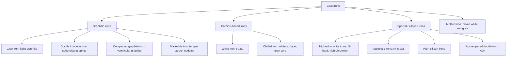
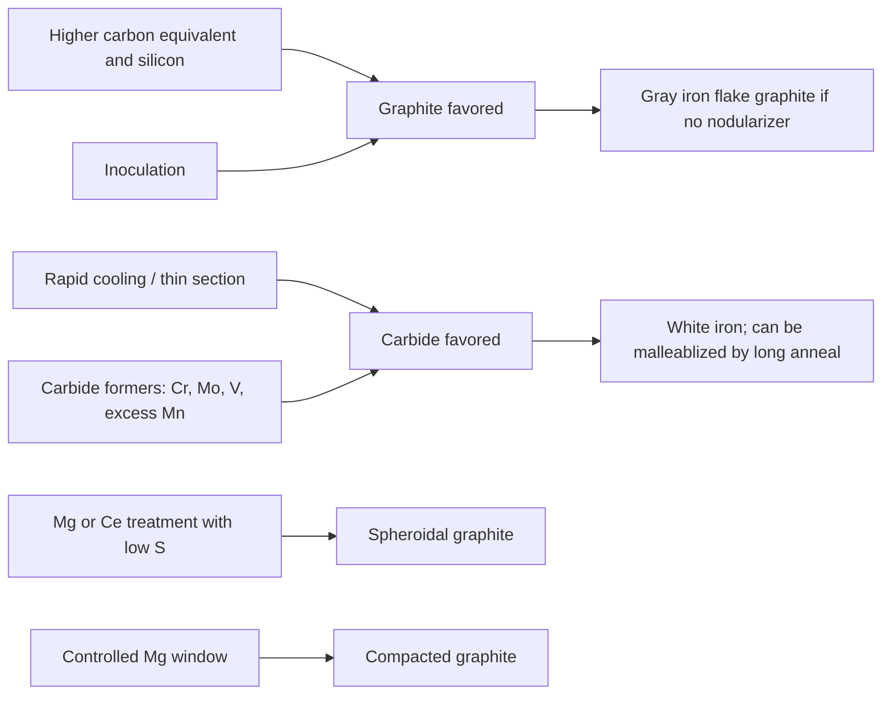

## Classification of Cast Irons


Cast irons are a family of **iron-carbon-silicon alloys** with carbon contents generally between about 2.0 and 4.5 wt% and silicon contents of about 0.5 to 3.5 wt%. Because carbon exceeds the maximum solubility in austenite (about 2.1 wt% in the binary Fe-C system), the alloys solidify through a **eutectic reaction**, and the carbon appears either as **graphite** (stable) or as **cementite, Fe₃C** (metastable). The form, shape, and distribution of the carbon-rich phase, together with the metallic matrix, provide the basis for classification and largely determine mechanical properties, machinability, castability, and applications.

**Key Points**

- Cast irons are classified primarily by **graphite morphology** (flake, spheroidal/nodular, compacted, temper nodules) or by the **absence of graphite** (white iron, where carbon is present as carbide).
- The **metallic matrix** (ferrite, pearlite, ferrite-pearlite, martensite, bainite, austenite/ausferrite) is a second classification axis.
- Composition (alloying additions), **cooling rate**, **inoculation**, and **nodularizing treatments** control which structure forms.
- Classification can also follow **fracture appearance** (gray vs. white), **commercial name**, or **specification grade** (tensile strength, elongation, hardness).

---

### Foundations of Cast Iron Metallurgy

#### The Fe-C and Fe-Fe₃C Systems

Two equilibrium diagrams describe cast iron solidification:

| System | Carbon-Rich Phase | Eutectic Temperature (approx.) | Eutectic Composition (approx.) |
| --- | --- | --- | --- |
| **Stable Fe-graphite** | Graphite | ~1153 °C | ~4.26 wt% C |
| **Metastable Fe-Fe₃C** | Cementite | ~1147 °C | ~4.30 wt% C |

The stable eutectic temperature is slightly higher, so slow cooling, high silicon, and effective graphitizing agents favor **graphite**. Fast cooling, carbide stabilizers (Cr, Mo, V, Mn), and low silicon favor **cementite**, producing white iron.

Eutectic reaction (stable):

$$L \rightarrow \gamma + \text{Graphite}$$

Eutectic reaction (metastable):

$$L \rightarrow \gamma + \text{Fe}_3\text{C}\ (\text{ledeburite})$$

Below the eutectic, austenite ($\gamma$) precipitates additional carbon on cooling and undergoes the **eutectoid reaction** at around 727 °C (metastable) or ~738 °C (stable, with Si raising the temperature and widening the range):

$$\gamma \rightarrow \alpha + \text{Fe}_3\text{C}\ (\text{pearlite})\quad\text{or}\quad \gamma \rightarrow \alpha + \text{Graphite}\ (\text{ferrite matrix})$$

[Inference] The exact transformation temperatures depend on silicon and other alloying elements; the values above are indicative.

#### Carbon Equivalent (CE)

The influence of silicon and phosphorus on the eutectic composition is captured by the **carbon equivalent**:

$$CE = \%C + \frac{\%Si + \%P}{3}$$

- $CE \approx 4.3$: eutectic composition
- $CE < 4.3$: hypoeutectic (primary austenite dendrites solidify first)
- $CE > 4.3$: hypereutectic (primary graphite, "kish graphite" in some cases, forms first)

**Example: Carbon equivalent of a gray iron**

For 3.3% C, 2.0% Si, 0.05% P:

$$CE = 3.3 + \frac{2.0 + 0.05}{3} = 3.3 + 0.683 = 3.98$$

**Output**

$CE \approx 3.98$, a **hypoeutectic** composition (below 4.3). Primary austenite dendrites form first, followed by the eutectic.

A related **degree of saturation** (saturation ratio) is:

$$S_c = \frac{\%C}{4.26 - 0.3(\%Si + \%P)}$$

$S_c < 1$ is hypoeutectic, $S_c = 1$ eutectic, $S_c > 1$ hypereutectic. [Inference] Coefficients vary among sources; use the formula appropriate to your foundry standard.

#### Graphite Forming Tendency

| Element | Effect |
| --- | --- |
| Si, C, Al, Ni, Cu, Ti (moderate) | Promote graphite, reduce chill |
| Cr, Mo, V, Mn (excess), Te, Bi, Mg (residual under some conditions) | Promote carbide (chill or white iron) |
| S | Promotes carbide when uncontrolled; interacts with Mn (MnS formation) and with Mg/Ce in nodular iron (consumes nodularizer) |
| P | Forms steadite (Fe-Fe₃C-Fe₃P phosphide eutectic), hard and brittle |

Cooling rate acts as a decisive factor: **thin sections cool rapidly** and tend to chill (white structure), while thick sections cool slowly and form graphite.

---

### Overall Classification Scheme



| Class | Carbon Form | Typical Matrix | Fracture Appearance |
| --- | --- | --- | --- |
| Gray iron | Flake graphite | Pearlite, ferrite, or mixed | Gray (graphite flakes) |
| Ductile (nodular, SG) iron | Spheroidal graphite | Ferrite, pearlite, mixed, or bainitic/ausferritic (ADI) | Silvery-gray |
| Compacted graphite iron (CGI) | Vermicular (worm-like) graphite | Pearlite/ferrite | Gray |
| Malleable iron | Temper carbon (irregular nodules) | Ferrite, pearlite, or tempered martensite | Blackheart: dark; whiteheart: silvery |
| White iron | Cementite (Fe₃C) | Pearlite + carbide, or martensite + carbide | White, crystalline |
| Mottled iron | Mixed graphite and carbide | Transitional | Mottled (white and gray patches) |
| Chilled iron | White at surface, gray in core | Layered structure | White skin, gray core |

---

### Typical Composition Ranges

| Type | C (wt%) | Si (wt%) | Mn (wt%) | S (wt%) | P (wt%) | Other |
| --- | --- | --- | --- | --- | --- | --- |
| Gray iron | 2.5–4.0 | 1.0–3.0 | 0.2–1.0 | 0.02–0.25 | 0.02–1.0 | Cu, Cr, Ni, Mo (optional) |
| Ductile iron | 3.2–4.2 | 1.8–2.8 | 0.1–0.5 | <0.02 | <0.08 | 0.03–0.06 Mg residual |
| Compacted graphite iron | 3.1–4.0 | 1.7–3.0 | 0.1–0.6 | <0.02 | <0.05 | Mg ~0.008–0.020 (with Ti control) |
| Malleable iron (white cast, before anneal) | 2.2–2.9 | 0.9–1.9 | 0.15–1.2 | 0.02–0.20 | <0.18 | Cr low; Bi, B additions in some grades |
| White iron (unalloyed) | 1.8–3.6 | 0.5–1.9 | 0.25–0.80 | 0.06–0.20 | 0.06–0.20 | Ni-hard: 3–5% Ni, 1.4–4% Cr |
| High-chromium white iron | 2.0–3.6 | 0.5–1.5 | 0.5–1.5 | <0.06 | <0.10 | 11–30% Cr, Mo, Cu, Ni |
| Ni-resist (austenitic) | 1.8–3.0 | 1.0–2.8 | 0.5–1.5 | — | <0.08 | 13.5–36% Ni, Cr, Cu |

[Inference] Ranges are representative across standards (ASTM, ISO, EN, BS); exact limits depend on the specification and grade.

---

### Gray Cast Iron

#### Microstructure

Gray iron contains **interconnected flake graphite** in a matrix that is typically pearlitic, ferritic, or mixed. The flakes act as internal notches and crack initiators, causing low tensile strength and low ductility, but they provide excellent damping, machinability, and thermal conductivity.

#### ASTM A247 Graphite Types (Flake Distribution)

| Type | Description | Formation / Relevance |
| --- | --- | --- |
| **Type A** | Uniform, random orientation | Desirable; moderate undercooling, well-inoculated |
| **Type B** | Rosette (flakes radiating from a center) | Moderate cooling, higher carbon |
| **Type C** | Kish graphite (large, coarse, primary flakes) | Hypereutectic composition; reduces strength |
| **Type D** | Interdendritic, random orientation (fine) | Rapid cooling; can give ferritic matrix in small sections |
| **Type E** | Interdendritic, preferred orientation | Hypoeutectic; directional |

**Key Points**

- **Type A** graphite is preferred for most gray iron castings.
- Flake size is classified from 1 (coarsest) to 8 (finest) under ASTM A247.
- **Inoculation** with ferrosilicon-based agents (e.g., FeSi with Ca, Ba, Sr, Al) promotes nucleation of graphite and reduces chill in thin sections.

#### Mechanical Properties (Classification by Tensile Strength)

| ASTM A48 Class | Minimum Tensile Strength (MPa) | Approx. Brinell Hardness (HB) | Typical Matrix |
| --- | --- | --- | --- |
| Class 20 | 138 | ~156 | Mostly ferritic |
| Class 25 | 172 | ~174 | Ferrite-pearlite |
| Class 30 | 207 | ~210 | Pearlite-ferrite |
| Class 35 | 241 | ~212 | Pearlite |
| Class 40 | 276 | ~235 | Pearlite |
| Class 50 | 345 | ~262 | Fine pearlite (alloyed) |
| Class 60 | 414 | ~302 | Fine pearlite (alloyed) |

The class number gives the minimum tensile strength in ksi (thousand psi). [Unverified] Confirm the specific values and hardness typical ranges in the current revision of ASTM A48 or the equivalent ISO 185 and EN 1561 grades (EN-GJL-150 to EN-GJL-350).

**Key Points**

- Compressive strength is about **3–5 times** the tensile strength.
- Gray iron has **excellent damping capacity** and good wear resistance (graphite lubricates).
- Elastic modulus is variable (roughly 70–140 GPa) and non-linear at low strain because of graphite flakes.

#### Strength–Carbon Equivalent Relationship

Strength decreases as $CE$ increases (more and coarser graphite). A common empirical approximation for tensile strength of a given section is:

$$\sigma_{UTS} \approx A - B\cdot CE$$

[Inference] Constants $A$ and $B$ depend on section size, inoculation, and alloying; they must be derived for a specific foundry process.

#### Applications

Engine blocks, cylinder heads, brake discs and drums, machine tool beds, pump housings, gearbox cases, cookware, pipe fittings, and manhole covers.

---

### Ductile (Nodular, Spheroidal Graphite) Iron

#### Microstructure and Production

In ductile iron, carbon precipitates as **spheroidal (nodular) graphite**, formed by treating the molten iron with a **nodularizing agent** (magnesium, sometimes with cerium or other rare earths) and then **inoculating** (typically with ferrosilicon). Nodules minimize stress concentration, so the matrix strength is utilized, giving steel-like strength with ductility.

**Key Points**

- Residual Mg of roughly **0.03–0.06 wt%** is typical to obtain nodules.
- Sulfur must be low (typically <0.02%) prior to treatment, since Mg reacts with S to form MgS.
- **Fading** of the treatment occurs with time (Mg loss), so pouring should follow treatment quickly.
- Degenerate graphite forms (exploded, chunky, spiky) can appear from contaminants (Pb, Ti, Sb, Bi), rare-earth imbalance, or improper treatment; they degrade properties.

#### ASTM A536 / ISO 1083 Grades

Grades are designated by tensile strength (ksi or MPa), yield strength, and elongation.

| ASTM A536 Grade | Tensile Strength (MPa) | Yield Strength (MPa) | Elongation (%) | Matrix |
| --- | --- | --- | --- | --- |
| 60-40-18 | 414 | 276 | 18 | Ferritic |
| 65-45-12 | 448 | 310 | 12 | Ferritic-pearlitic |
| 80-55-06 | 552 | 379 | 6 | Ferritic-pearlitic |
| 100-70-03 | 689 | 483 | 3 | Pearlitic |
| 120-90-02 | 827 | 621 | 2 | Tempered martensite (quenched and tempered) |

The grade number "60-40-18" reads: 60 ksi tensile, 40 ksi yield, 18% elongation. EN-GJS grades (e.g., EN-GJS-400-15, EN-GJS-500-7, EN-GJS-700-2) follow the same logic in MPa and % elongation.

#### Graphite Nodularity and Nodule Count

- **Nodularity** (percent of graphite in spheroidal form): typically ≥80–90% specified for structural grades (ISO 945-1 form VI and V).
- **Nodule count**: number of nodules per mm², controls the matrix uniformity and carbide/shrinkage tendency.

#### Applications

Automotive crankshafts, camshafts, steering knuckles, suspension components, gears, pressure pipe (ductile iron pipe), wind turbine hubs, and heavy machinery housings.

---

### Austempered Ductile Iron (ADI)

ADI is a heat-treated ductile iron. It is austenitized (~840–950 °C), quenched to an austempering temperature (~250–400 °C), and held isothermally to form **ausferrite** (acicular ferrite plus carbon-stabilized high-carbon austenite). The process window between the first-stage reaction and the deleterious second-stage reaction (decomposition of high-carbon austenite into ferrite + carbide) must be respected.

| ADI Grade (ASTM A897) | Tensile Strength (MPa) | Yield Strength (MPa) | Elongation (%) | Approx. Hardness (HB) |
| --- | --- | --- | --- | --- |
| 750/500/11 (Grade 1) | 750 | 500 | 11 | 241–302 |
| 900/650/09 (Grade 2) | 900 | 650 | 9 | 269–341 |
| 1050/750/07 (Grade 3) | 1050 | 750 | 7 | 302–375 |
| 1200/850/04 (Grade 4) | 1200 | 850 | 4 | 341–444 |
| 1400/1100/02 (Grade 5) | 1400 | 1100 | 2 | 388–477 |

[Unverified] Confirm the exact grade limits and hardness ranges in the current ASTM A897/A897M revision or ISO 17804.

**Key Points**

- Higher austempering temperatures yield more retained austenite, higher ductility and toughness; lower temperatures give finer ausferrite, higher strength and wear resistance.
- ADI offers superior fatigue strength and wear resistance compared to conventional ductile iron, and competes with forged and cast steel.

---

### Compacted Graphite Iron (CGI)

#### Microstructure

CGI, also called vermicular iron, has **short, thick, rounded-edge graphite "worms"** with interconnected morphology, forming an intermediate structure between flake and spheroidal graphite. Typical nodularity is limited to below about 20% (commonly 0–20%) to maintain the compacted morphology.

**Key Points**

- Production requires a **narrow Mg window** (about 0.008–0.020 wt%) and tight control of sulfur and titanium; excess Mg produces nodules, insufficient Mg produces flakes.
- Process control uses thermal analysis or oxygen/sulfur activity sensors for consistent results.
- Properties: higher strength and stiffness than gray iron, better thermal conductivity and damping than ductile iron, good fatigue resistance.

#### Grades (ISO 16112 / ASTM A842)

| Grade (ISO 16112) | Tensile Strength (MPa) | Yield Strength (MPa) | Elongation (%) | Matrix |
| --- | --- | --- | --- | --- |
| GJV-300 | 300 | 220 | 1.5 | Ferritic (>80% ferrite) |
| GJV-350 | 350 | 260 | 1.5 | Ferritic-pearlitic |
| GJV-400 | 400 | 300 | 1.0 | Ferritic-pearlitic |
| GJV-450 | 450 | 340 | 1.0 | Pearlitic-ferritic |
| GJV-500 | 500 | 380 | 0.5 | Pearlitic |

[Unverified] Verify grade values against the current ISO 16112 or ASTM A842 edition.

#### Applications

Diesel engine blocks and cylinder heads, exhaust manifolds, brake discs, turbocharger housings, and gear housings where high strength and thermal fatigue resistance are needed.

---

### Malleable Cast Iron

#### Production Route

Malleable iron begins as **white iron** (all carbon as cementite) that is then given a prolonged **malleablizing anneal** to decompose cementite into **temper carbon** (irregular graphite nodules or rosettes) in a ferritic or pearlitic matrix.

$$\text{Fe}_3\text{C} \rightarrow 3\text{Fe} + \text{C (temper carbon)}$$

**Two-stage graphitization (blackheart route)**

| Stage | Temperature | Process | Result |
| --- | --- | --- | --- |
| First stage (FSG) | ~900–970 °C | Eutectic and primary cementite decompose to austenite + temper carbon | Removes massive carbides |
| Intermediate cooling | ~ 740 °C | Controlled cooling through the eutectoid | Choose ferrite or pearlite matrix |
| Second stage (SSG) | ~ 700–730 °C | Eutectoid cementite decomposes | Ferritic matrix (for ferritic grade) |

For **whiteheart malleable iron**, the white iron is annealed in an oxidizing (decarburizing) atmosphere, reducing surface carbon, giving a lighter fracture.

#### Types

| Type | Structure | Description |
| --- | --- | --- |
| **Ferritic (blackheart) malleable** | Temper carbon in ferrite | Most common in North America; excellent machinability and toughness |
| **Pearlitic malleable** | Temper carbon in pearlite (or tempered martensite) | Higher strength and wear resistance |
| **Whiteheart malleable** | Decarburized ferritic surface, pearlitic core | Common in Europe; weldable |

#### ASTM A47 / A220 Grades

| Grade | Tensile Strength (MPa) | Yield Strength (MPa) | Elongation (%) |
| --- | --- | --- | --- |
| 32510 (ferritic) | 345 | 224 | 10 |
| 35018 (ferritic) | 365 | 241 | 18 |
| 45008 (pearlitic) | 448 | 310 | 8 |
| 50005 (pearlitic) | 517 | 345 | 5 |
| 70003 (pearlitic) | 724 | 483 | 3 |
| 90001 (martensitic) | 862 | 621 | 1 |

[Unverified] Confirm values for the specific edition of ASTM A47/A220.

**Key Points**

- Section size is limited (typically up to ~ 100 mm and commonly under 50 mm) because white iron must form in the as-cast state.
- Long annealing cycles (tens of hours) increase cost and energy consumption; malleable iron has been partly replaced by ductile iron in many applications.

#### Applications

Pipe fittings, railway and automotive components (brackets, differential carriers), hand tools, hardware, and electrical line hardware.

---

### White Cast Iron

#### Microstructure

White iron solidifies according to the **metastable** Fe-Fe₃C system, so carbon is entirely in the form of **cementite (Fe₃C)**. The as-cast microstructure includes **primary austenite dendrites (transformed to pearlite or martensite) and ledeburite** (eutectic of austenite and cementite). Fracture surfaces appear white and crystalline.

#### Classification of White Irons

| Class | Composition Highlights | Microstructure | Properties |
| --- | --- | --- | --- |
| **Unalloyed (plain) white iron** | 2.5–3.6% C, low Si | Pearlite + Fe₃C | Hard (HB ~ 400–500), brittle |
| **Ni-Cr white iron (Ni-Hard)** | 3–5% Ni, 1.4–4% Cr | Martensite + eutectic Fe₃C (M₃C) | High hardness, abrasion resistance |
| **High-chromium white iron** | 11–30% Cr, 1.8–3.6% C, Mo, Ni, Cu | Martensite/austenite + M₇C₃ carbides | Superior abrasion and some corrosion resistance |
| **Chilled iron** | Gray iron composition with chilling (rapid cooling) at surface | White layer with gray core | Hard surface, tough core (rolls, wheels) |

**Key Points**

- **Ni-Hard (ASTM A532 Class I)** gains hardness from martensitic matrix and M₃C carbide network; Ni suppresses pearlite formation.
- **High-chromium irons** contain **M₇C₃** carbides (harder, ~1200–1800 HV, and more discontinuous than M₃C), giving improved toughness relative to Ni-hard at comparable abrasion resistance.
- Heat treatment (destabilization, hardening, subcritical tempering) controls matrix (martensite vs retained austenite) and hardness.

#### ASTM A532 (Abrasion-Resistant Cast Irons)

| Class | Type | Typical Hardness (HRC) |
| --- | --- | --- |
| Class I | Ni-Cr-Hc (Ni-hard) | 550–650 HB (approx. 55–60+ HRC after HT) |
| Class II | Ni-Cr-Lc | Similar to I with lower carbon |
| Class III | 25% Cr | ~ 50–62 HRC depending on HT |
| Class IIIA | High chromium (~ 25% Cr) | 55–64 HRC |

[Unverified] Verify class definitions and hardness bands in ASTM A532/A532M.

#### Applications

Slurry pump casings and impellers, mill liners, grinding balls, shot-blast components, crusher parts, ploughshares, and rolling mill rolls.

---

### Mottled and Chilled Iron

- **Mottled iron**: a transition structure with both graphite and cementite regions, arising from intermediate cooling rates or composition near the graphite/carbide boundary; typically undesirable except where chill depth is intentionally controlled.
- **Chilled iron**: a purposeful casting practice where **chills** (metal inserts) or metal molds cool the surface rapidly, producing a **white iron layer (chill)** with a gray or ductile iron core for wear surfaces (rolls, cam followers, wheels).

**Key Points**

- Chill depth is controlled by chemistry (Si and carbide formers), pouring temperature, and chill design.
- Wedge (chill) tests are used in foundries to quantify chill tendency.

---

### High-Alloy Cast Irons

| Type | Composition Highlights | Key Properties | Typical Uses |
| --- | --- | --- | --- |
| **Austenitic (Ni-Resist) iron** | 13.5–36% Ni, Cr, Cu; flake (Type 1–5) or nodular (D-2, D-5) | Corrosion, heat, and oxidation resistance; non-magnetic (some grades); low thermal expansion (Type D-5B) | Pump and valve parts, turbocharger housings, exhaust manifolds, marine parts |
| **High-silicon iron** | 14–18% Si | Excellent acid corrosion resistance (H₂SO₄, HNO₃), brittle, hard to machine | Chemical process equipment, anodes, drain pipe |
| **High-chromium corrosion/heat-resistant irons** | 12–35% Cr | Scale and corrosion resistance at high temperature | Furnace parts, grates, glass molds |
| **Medium-silicon iron (SiMo ductile)** | 3.5–4.5% Si, 0.5–1.0% Mo | Elevated-temperature strength and oxidation resistance | Exhaust manifolds, turbocharger housings |
| **Aluminum-alloyed iron** | ~ 6–8% Al (special) | High-temperature oxidation resistance | Specialized furnace components |

[Inference] Alloy ranges and designations differ between ASTM A436/A439 (austenitic), A518 (high-silicon), and A532; verify against the specification of interest.

---

### Classification by Specification Systems

| System | Coverage | Example Designation | Meaning |
| --- | --- | --- | --- |
| **ASTM A48** | Gray iron | Class 30 | Min. tensile strength 30 ksi |
| **ASTM A536** | Ductile iron | 65-45-12 | 65 ksi tensile, 45 ksi yield, 12% elongation |
| **ASTM A47 / A220** | Malleable iron | 32510, 45008 | Yield (ksi × 10) and elongation (%) |
| **ASTM A897** | ADI | 900/650/09 | Tensile/yield (MPa)/elongation (%) |
| **ASTM A842** | CGI | Grade 350 | Tensile in MPa |
| **ASTM A532** | Abrasion-resistant white iron | Class III Type A | High-chromium type |
| **EN 1561** | Gray iron | EN-GJL-250 | Tensile 250 MPa |
| **EN 1563** | Ductile iron | EN-GJS-500-7 | Tensile 500 MPa, 7% elongation |
| **EN 1562** | Malleable iron | EN-GJMB-350-10 | Blackheart, 350 MPa, 10% |
| **ISO 185, 1083, 5922, 16112, 17804** | Gray, ductile, malleable, CGI, ADI | — | International equivalents |
| **SAE J431 / J434 / J1887** | Automotive gray, ductile, malleable | G3000, D4512 | Grade-based |

**Key Points**

- Designations often indicate **mechanical properties**, not chemical composition; foundries adjust composition and process to meet property targets.
- Cross-referencing between standards requires attention to test bar diameter and section sensitivity.

---

### Comparative Summary of Cast Iron Types

| Property | Gray | Ductile | CGI | Malleable | White |
| --- | --- | --- | --- | --- | --- |
| Graphite shape | Flake | Spheroid | Vermicular | Temper nodules | None (Fe₃C) |
| Tensile strength (MPa, typical) | 150–400 | 400–900 (up to 1400 ADI) | 300–500 | 320–860 | 200–500 (brittle) |
| Elongation (%) | ~0–1 | 2–18 | 0.5–2 | 1–18 | ~0 |
| Impact toughness | Very low | Good | Low-moderate | Good | Very low |
| Castability / fluidity | Excellent | Good | Good | Good (as white iron) | Fair |
| Machinability | Excellent | Good | Fair-good | Excellent (ferritic) | Poor (grind only) |
| Damping capacity | Excellent | Moderate | Good | Moderate | Poor |
| Thermal conductivity | High | Lower | Intermediate | Moderate | Lower |
| Wear/abrasion resistance | Good | Good (especially ADI) | Good | Fair | Excellent |
| Relative cost | Low | Moderate | Moderate | Higher (long anneal) | Low–moderate |
| Section sensitivity | High | Moderate | Moderate | Very high (thin only) | Very high |
| Typical use | Blocks, discs, beds | Crankshafts, gears | Diesel blocks | Fittings, brackets | Liners, grinding media |

---

### Effect of Cooling Rate and Composition: Maurer and Greiner-Klingenstein Diagrams

Structural diagrams predict the as-cast matrix from composition and section size.

**Maurer diagram**: plots the structure regions (white, mottled, pearlitic gray, ferritic gray) versus carbon content (x-axis) and silicon content (y-axis) for a fixed section size.

**Greiner-Klingenstein diagram**: maps structure against carbon equivalent and section thickness (or cooling modulus), showing the transition from white to gray with thicker sections and higher $CE$.

**Key Points**

- For a given composition, **thin sections** may chill (white or mottled), while thick sections become gray or ferritic.
- Predicting structure requires the diagram calibrated for the specific melt practice; charts in handbooks (e.g., ASM Handbook Vol. 1 and Vol. 15) give general guidance.



---

### Matrix Structures and Their Control

| Matrix | Formation | Properties | Alloy/Process Influence |
| --- | --- | --- | --- |
| **Ferritic** | Slow cooling through eutectoid, high Si, low pearlite stabilizers, or ferritizing anneal (~700–900 °C) | Soft, ductile, good machinability, lower strength | Low Mn, Cu, Sn; Si high |
| **Pearlitic** | Faster cooling through eutectoid, Cu, Sn, Mn, Ni, Cr additions | Higher strength and wear resistance | Pearlite stabilizers (Cu, Sn, Mn) |
| **Ferritic-pearlitic** | Intermediate | Balanced | Composition and cooling |
| **Martensitic (tempered)** | Austenitize (~ 850–900 °C), quench, temper | Very hard, high strength | Hardenability (Mo, Ni, Cu) |
| **Bainitic / ausferritic** | Austempering | High strength with ductility | Alloying (Mo, Ni, Cu) for hardenability |
| **Austenitic** | High Ni (and Mn) additions | Non-magnetic, corrosion-resistant, tough | Ni 18–36% |

---

### Practical Examples

#### Example 1: Selecting a Cast Iron Type for a Component

**Requirement**: An automotive suspension knuckle needs tensile strength ≥ 550 MPa, elongation ≥ 6%, good fatigue resistance, and moderate cost, with section thickness 10–40 mm.

**Analysis**

| Candidate | Meets Strength/Ductility? | Notes |
| --- | --- | --- |
| Gray iron (Class 50) | Strength borderline; elongation ≈ 0% | Fails ductility |
| Malleable 45008 | Strength ≈ 448 MPa | Strength insufficient |
| Ductile iron 80-55-06 (≈ EN-GJS-600-3 class) | 552 MPa, 6% | Meets both requirements |
| ADI Grade 1 | 750 MPa, 11% | Exceeds but adds heat treatment cost |
| CGI | ~ 400–500 MPa, ≤ 1% | Fails ductility |

**Output**

**Ductile iron 80-55-06** (ferritic-pearlitic) is the most economical choice that satisfies the requirements. ADI is preferred if higher fatigue or wear performance is needed.

#### Example 2: Identifying Cast Iron Type from Microstructure

| Observation (polished and etched) | Likely Classification |
| --- | --- |
| Dark, elongated interconnected flakes in pearlite | Gray iron (Type A graphite) |
| Round black nodules with ferrite "bull's-eye" rings | Ferritic or ferritic-pearlitic ductile iron |
| Short, thick, blunt-ended worm-like graphite | Compacted graphite iron |
| Irregular rosette-shaped clusters of graphite in ferrite | Malleable iron (temper carbon) |
| No graphite; light needles and ledeburite in matrix | White iron |
| Nodules in acicular matrix | ADI (ausferrite) or quenched-and-tempered ductile iron |
| Blocky angular carbides in martensitic matrix | Ni-hard or high-chromium white iron |

**Key Points**

- Graphite is best examined **unetched** (as-polished) for shape and size; the matrix is revealed by 2–4% nital.
- Nodularity is measured by image analysis per ISO 945-4 or ASTM A247.

#### Example 3: Computing Carbon Equivalent and Predicting Structure

The following Python snippet calculates $CE$ and the saturation ratio, then gives a qualitative structure indication.

```python
def carbon_equivalent(C, Si, P=0.0):
    return C + (Si + P) / 3.0

def saturation_ratio(C, Si, P=0.0):
    return C / (4.26 - 0.3 * (Si + P))

def classify_iron(name, C, Si, P=0.0, thin_section=False, has_nodularizer=False, has_carbide_former=False):
    ce = carbon_equivalent(C, Si, P)
    sc = saturation_ratio(C, Si, P)
    if ce < 4.3:
        comp = "hypoeutectic"
    elif ce > 4.3:
        comp = "hypereutectic (kish/primary graphite risk)"
    else:
        comp = "eutectic"

    if has_carbide_former or (thin_section and Si < 1.5):
        structure = "carbide-prone (white/mottled/chilled)"
    elif has_nodularizer:
        structure = "spheroidal graphite (ductile iron) if S is low and Mg residual adequate"
    else:
        structure = "flake graphite (gray iron)"

    print(f"{name}: CE = {ce:.2f}, Sc = {sc:.2f}, {comp}")
    print(f"  Expected structure tendency: {structure}\n")

classify_iron("Gray iron melt", C=3.30, Si=2.00, P=0.05)
classify_iron("Ductile iron melt", C=3.70, Si=2.40, P=0.03, has_nodularizer=True)
classify_iron("Thin-wall, low-Si melt", C=3.10, Si=1.00, P=0.05, thin_section=True)
```

**Output**



```
Gray iron melt: CE = 3.98, Sc = 0.86, hypoeutectic
  Expected structure tendency: flake graphite (gray iron)

Ductile iron melt: CE = 4.51, Sc = 1.02, hypereutectic (kish/primary graphite risk)
  Expected structure tendency: spheroidal graphite (ductile iron) if S is low and Mg residual adequate

Thin-wall, low-Si melt: CE = 3.45, Sc = 0.79, hypoeutectic
  Expected structure tendency: carbide-prone (white/mottled/chilled)
```

[Inference] Ductile iron is normally poured slightly hypereutectic ($CE \approx 4.3$–$4.6$), where nodules nucleate readily; excessive $CE$ (>4.6–4.7) risks graphite flotation in thick sections. This script is a simplified screening tool, not a substitute for thermal analysis and metallography.

---

### Common Selection Criteria

| Requirement | Preferred Iron |
| --- | --- |
| Lowest cost, high castability, damping, machinability | Gray iron |
| High strength and ductility, fatigue, impact | Ductile iron |
| Highest strength/wear with toughness | ADI |
| Thermal fatigue, higher stiffness than gray, lower weight than ductile | CGI |
| Thin-section, tough, machinable small parts | Malleable iron |
| Extreme abrasion resistance | High-Cr or Ni-hard white iron |
| Corrosion, heat, or non-magnetic service | Austenitic (Ni-resist) or high-silicon iron |
| Hard wearing surface, tough core | Chilled iron |

---

### Common Defects and Quality Concerns by Class

| Class | Typical Concerns |
| --- | --- |
| Gray iron | Chill in thin sections, shrinkage, low strength from coarse graphite, hardness variation |
| Ductile iron | Nodularity loss (fade), dross/slag inclusions (Mg oxides/sulfides), shrinkage porosity, carbides, exploded graphite |
| CGI | Narrow Mg window, nodularity above/below limits, Ti contamination |
| Malleable | Incomplete graphitization, surface decarburization, thick-section limits |
| White iron | Cracking during cooling or heat treatment, retained austenite variability |
| ADI | Incomplete transformation, second-stage reaction, segregation-related martensite |

---

### Conclusion

Cast irons are classified by the **form of carbon** (flake, spheroidal, compacted, temper nodules, or carbide) and by **matrix structure and alloy content**. Gray iron is the most widely used, offering low cost, damping, and machinability; ductile iron and ADI extend cast iron into high-strength, tough, fatigue-resistant applications; CGI bridges gray and ductile iron for thermally loaded engine parts; malleable iron provides toughness in small sections; and white and high-alloy irons deliver abrasion, heat, or corrosion resistance. Composition (carbon equivalent, Si, S, Mn, alloying), inoculation and nodularizing treatments, cooling rate, and heat treatment together govern which classification a casting attains, so consistent classification and grade selection rely on both metallurgical understanding and process control.

---

**Related Topics**

- Graphite nucleation, growth, and inoculation practice
- Solidification of cast irons: eutectic cells and undercooling
- Ductile iron nodularization treatment and Mg-fading control
- Thermal analysis and process control in the iron foundry
- Heat treatment of cast irons: annealing, normalizing, quench and temper, austempering
- Austempered ductile iron (ADI) and austempering process window
- High-chromium white iron heat treatment and carbide types (M₃C, M₇C₃, M₂₃C₆)
- Alloy cast irons: Ni-resist, high-silicon, SiMo ductile iron
- Mechanical properties and fracture behavior of cast irons
- Wear and corrosion behavior of cast irons
- Casting defects: shrinkage, gas porosity, inclusions, chill