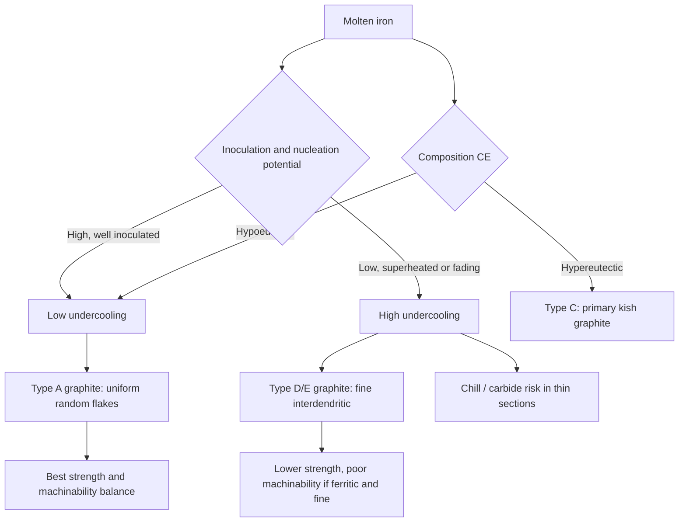

## Gray Cast Iron


Gray cast iron is an **iron-carbon-silicon alloy** in which most of the carbon is present as **interconnected flake graphite** embedded in a metallic matrix of ferrite, pearlite, or a mixture of both. The name derives from the gray, sooty appearance of a fractured surface, where the fracture path follows graphite flakes. It is the oldest and by tonnage the most widely produced cast iron, valued for excellent castability, machinability, vibration damping, thermal conductivity, and low cost.

**Key Points**

- Typical composition: 2.5–4.0 wt% C, 1.0–3.0 wt% Si, 0.2–1.0 wt% Mn, up to ~0.15 wt% S, and 0.02–0.15 wt% P (higher P in some castings).
- Graphite flakes act as **internal notches**, giving low tensile strength, near-zero ductility, and brittle fracture in tension, but high compressive strength (3–5 times tensile).
- Properties are controlled by **carbon equivalent (CE)**, graphite flake size and distribution, matrix structure, alloying, inoculation, cooling rate, and section size.
- Gray iron is inherently **section sensitive**: properties measured on a test bar differ from those in the actual casting.

---

### Metallurgical Fundamentals

#### Solidification Path

Gray iron solidifies according to the **stable Fe-graphite system**, in which the eutectic is a combination of austenite and graphite (a "eutectic cell" structure):

$$L \rightarrow \gamma + \text{Graphite}\quad(\text{eutectic, }\approx 1153\,^\circ\text{C for the binary system})$$

For hypoeutectic compositions ($CE < 4.3$), solidification begins with **primary austenite dendrites**, and the remaining liquid becomes enriched in carbon until it reaches the eutectic composition and solidifies as eutectic cells.

The **carbon equivalent** is:

$$CE = \%C + \frac{\%Si + \%P}{3}$$

**Example: Determining solidification mode**

For a melt with 3.4% C, 2.1% Si, 0.06% P:

$$CE = 3.4 + \frac{2.1 + 0.06}{3} = 3.4 + 0.72 = 4.12$$

**Output**

$CE = 4.12 < 4.3$: hypoeutectic. Primary austenite dendrites form first, followed by the eutectic. Hypereutectic gray irons ($CE > 4.3$) form primary graphite ("kish") first, which coarsens and degrades strength.

The saturation ratio offers another description:

$$S_c = \frac{\%C}{4.26 - 0.3\,(\%Si + \%P)}$$

[Inference] Coefficients differ among references; use the relationship defined in your foundry or standard.

#### Eutectic Cells

A eutectic cell is a roughly spherical colony of graphite flakes and austenite growing from a single nucleus.

| Cell Characteristic | Effect |
| --- | --- |
| **Fine, numerous cells** (high nucleation, inoculated) | Finer graphite, higher strength, less chill |
| **Coarse, few cells** (low nucleation, hot or uninoculated melt) | Coarser graphite, lower strength, more undercooling and Type D/E graphite risk |

Eutectic cell size is revealed by **Stead's reagent** or similar macroetchants, or by fracture examination.

#### Undercooling and Graphite Morphology

Graphite morphology depends on the degree of **eutectic undercooling** (the temperature depression below the eutectic equilibrium temperature). Higher undercooling promotes finer, more interdendritic graphite (Type D/E), while low undercooling favors uniformly distributed Type A flakes.



---

### Graphite Morphology (ASTM A247)

#### Flake Types

| Type | Description | Typical Cause | Effect |
| --- | --- | --- | --- |
| **A** | Uniform distribution, random orientation | Adequate inoculation, moderate cooling | Desirable; best strength and machinability balance |
| **B** | Rosette pattern (flakes radiating from center) | Near-eutectic composition, moderate undercooling | Acceptable, slightly varied properties |
| **C** | Kish graphite (large primary flakes) | Hypereutectic composition ($CE > 4.3$) | Reduced strength, poor surface finish; suited to high thermal conductivity applications |
| **D** | Fine, random interdendritic, no preferred orientation | High undercooling, low CE, thin sections | Ferritic matrix around fine graphite; lower strength, poor wear resistance |
| **E** | Interdendritic with preferred orientation | Hypoeutectic, high undercooling | Directional properties |

#### Flake Size

ASTM A247 grades flake size on a scale of **1 (largest, coarsest) to 8 (smallest, finest)** at 100× magnification. Finer flakes (sizes 4–6 typically) correlate with higher strength, but very fine flakes may signal undercooling and Type D graphite.

**Key Points**

- **Type A, size 3–5** is a common target for engine blocks and brake components.
- Graphite is best examined **unetched** (as-polished); the matrix is revealed with 2–4% nital.
- Flake length rather than thickness is the primary control on effective stress concentration.

---

### Matrix Structure

| Matrix | Formation | Properties |
| --- | --- | --- |
| **Ferritic** | Slow cooling, high Si, low Mn and pearlite promoters, or ferritizing anneal | Soft (about 120–170 HB), lowest strength, best machinability, higher ductility relative to other gray irons |
| **Pearlitic** | Faster cooling, or additions of Cu, Sn, Mn, Cr, Ni, Mo | Stronger (about 180–260 HB), better wear resistance |
| **Ferritic-pearlitic** | Intermediate | Balanced properties; typical of general-purpose grades |
| **Martensitic / bainitic** | Quench and temper or austempering, or alloyed | High hardness and wear resistance; used in specialized parts (cylinder liners, cams) |
| **Steadite (phosphide eutectic)** | Present when P exceeds ~0.1–0.15% | Hard, brittle Fe-Fe₃P-Fe₃C eutectic; improves wear resistance and fluidity, reduces toughness |

#### Controlling Pearlite Content

Pearlite formation is promoted by alloys that retard ferrite formation:

| Element | Typical Addition | Role |
| --- | --- | --- |
| Cu | 0.3–1.0% | Mild pearlite stabilizer, strengthens matrix without carbide formation |
| Sn | 0.03–0.10% | Strong pearlite promoter; excess embrittles |
| Mn | 0.5–1.0% | Pearlite promoter; combines with S to form MnS |
| Cr | 0.15–0.5% | Pearlite stabilizer, carbide former (chill risk) |
| Ni | 0.5–2.0% | Pearlite refinement, hardenability |
| Mo | 0.2–0.8% | Pearlite refinement, high-temperature strength |
| Si (high) | >2.5% | Promotes ferrite |

The **Mn/S balance** is commonly controlled to ensure sulfur is fixed as MnS rather than FeS:

$$\%Mn_{min} \approx 1.7\times\%S + 0.3$$

[Inference] Formulas of this type vary among foundries and references; the factor 1.7 arises from the atomic mass ratio of Mn to S (about 1.71) for stoichiometric MnS, with an excess to promote pearlite. Use process-specific guidance.

---

### Chemical Composition and Elemental Effects

#### Typical Composition Ranges

| Element | Typical Range (wt%) | Function |
| --- | --- | --- |
| C | 2.5–4.0 | Graphite formation; increases fluidity, lowers strength |
| Si | 1.0–3.0 | Graphitizer, ferrite promoter, raises eutectoid temperature, improves oxidation resistance |
| Mn | 0.2–1.0 | Fixes S, pearlite promoter |
| S | 0.02–0.15 | Aids graphite nucleation (via MnS nuclei), but excess causes hardness, shrinkage, and lower properties |
| P | 0.02–0.15 (up to 1.0 in thin decorative or specialty castings) | Improves fluidity, forms steadite, reduces toughness |
| Cr, Mo, Ni, Cu, Sn | Alloy additions | Modify matrix, hardenability, strength |

#### Elemental Effects Summary

| Element | Effect on Graphite/Carbide | Effect on Matrix | Notes |
| --- | --- | --- | --- |
| Si | Strong graphitizer | Ferrite promoter | Increases CE; hardens ferrite by solid-solution strengthening |
| C | Graphite quantity | Reduces strength when high | Controls CE and fluidity |
| Mn | Mild carbide former (excess) | Pearlite promoter | Balance with S |
| Cr | Strong carbide former | Pearlite stabilizer | Adds chill risk; used for wear resistance |
| Cu | Weak graphitizer | Pearlite promoter | Non-carbide-forming strengthening |
| Ni | Weak graphitizer | Pearlite refiner | Reduces section sensitivity |
| Mo | Mild carbide former | Refines pearlite, raises elevated temperature strength | Common in brake discs and engine blocks |
| Sn | Neutral | Strong pearlite promoter at 0.03–0.1% | Excess causes embrittlement |
| Ti, V | Carbide formers | Refine graphite (Ti nitrides may nucleate) | Ti can cause hardspots/stringers when excessive |
| Al | Graphitizer | Ferrite promoter | Gas defect risk (pinholes) |
| Pb, Bi, Sb, Te | Trace | Can produce Widmanstätten graphite or chill | Control in charge materials |
| H, N | Gas | Porosity, fissure defects | Control via charge selection and melt practice |

---

### Mechanical and Physical Properties

#### Classification by Tensile Strength (ASTM A48)

| Class | Minimum Tensile Strength (MPa) | Typical Brinell Hardness (HB) | Typical Matrix and Use |
| --- | --- | --- | --- |
| 20 | 138 | ~156 | Mostly ferritic; low-stress castings, decorative |
| 25 | 172 | ~174 | Ferritic-pearlitic; pipe fittings, housings |
| 30 | 207 | ~210 | Pearlitic-ferritic; general engineering, engine blocks |
| 35 | 241 | ~212 | Pearlitic; machine parts |
| 40 | 276 | ~235 | Pearlitic; gears, high-stress parts |
| 50 | 345 | ~262 | Fine pearlitic (alloyed); heavy-duty machine parts |
| 60 | 414 | ~302 | Fine pearlitic (alloyed); dies, high-strength parts |

The class number represents minimum tensile strength in ksi. [Unverified] Verify values and hardness ranges against the current ASTM A48 revision, and the equivalent ISO 185 (grades 100–350) and EN 1561 (EN-GJL-100 to EN-GJL-350) grades.

#### Test Bar and Section Sensitivity

Mechanical properties in ASTM A48 are reported for separately cast test bars (e.g., **B bar of 30 mm diameter, S bar of 22 mm, C bar of 13 mm, etc.**). Because gray iron is highly section sensitive, the strength in the casting depends on local cooling rate and can differ significantly from the test bar.

**Key Points**

- Thin sections cool rapidly: finer graphite, higher strength, greater chill risk.
- Thick sections cool slowly: coarser graphite, more ferrite, lower strength.
- Section sensitivity is reduced by alloying (Ni, Mo, Cu), higher Si-to-C balance control, and inoculation.

#### Tensile Strength and Carbon Equivalent

Tensile strength decreases with increasing $CE$ because graphite quantity and size increase. A common empirical form is:

$$\sigma_{UTS} \approx A - B \cdot CE$$

where $A$ and $B$ depend on section size, inoculation, alloy content, and process. [Inference] Constants must be fitted from local foundry data.

**Example: Empirical strength relationship (illustrative)**

For a hypothetical process where $A = 1000$ MPa and $B = 200$ MPa per unit CE, with $CE = 3.98$:

$$\sigma_{UTS} \approx 1000 - 200 \times 3.98 = 204\ \text{MPa}$$

**Output**

Estimated tensile strength ≈ 204 MPa (near Class 30). [Inference] The constants are illustrative only and not general material data.

#### Physical and Mechanical Property Summary

| Property | Typical Value (varies with grade) |
| --- | --- |
| Density | 6.9–7.3 g/cm³ |
| Elastic modulus (tension) | ~66–138 GPa (non-linear; increases with strength grade) |
| Compressive strength | ~3–5 times tensile strength (≈ 570–1290 MPa) |
| Elongation | <1% |
| Shear strength | ~1.1–1.6 × tensile strength |
| Fatigue limit (rotating bending) | ~0.35–0.50 × tensile strength |
| Thermal conductivity | ~46–60 W/m·K (higher with higher C and flake size) |
| Coefficient of thermal expansion | ~10–12 × 10⁻⁶ /K |
| Damping capacity | Excellent (roughly 10–30 times that of steel, order of magnitude) |
| Melting/solidus range | ~1150–1200 °C |
| Specific heat | ~460 J/kg·K |

[Inference] Values are representative; damping and elastic modulus depend on graphite volume, flake length, and stress level.

**Key Points**

- The **stress-strain curve is non-linear** even at low stress; there is no distinct yield point. Proof stress or secant modulus is used.
- **Notch sensitivity is low** because graphite flakes already act as notches; adding external notches has a limited additional effect.
- **Damping capacity** results from internal friction at graphite-matrix interfaces, valuable in machine tool beds, engine blocks, and brake components.

---

### Inoculation and Melt Treatment

#### Purpose of Inoculation

Inoculation is a **late addition** (ladle, stream, or in-mold) of ferrosilicon-based alloys to the molten iron just before pouring. It increases nucleation sites for graphite, reducing undercooling, chill tendency, and eutectic cell size, thereby promoting Type A graphite.

| Inoculant Type | Typical Composition | Notes |
| --- | --- | --- |
| 75% FeSi with Ca, Al | 75% Si, 0.5–1.5% Ca, 0.5–1.5% Al | Standard, widely used |
| FeSi with Ba or Sr | 60–75% Si, Ba or Sr 1–3% | Strong, slower fade, reduces chill effectively |
| FeSi with Zr | Zr-bearing | Resists fade, low chill |
| Graphite-based inoculants | Fine synthetic graphite | Helpful in low-graphite melts (e.g., steel-scrap heavy charges) |
| Ce-based rare earth FeSi | Ce, La | For special applications, controlled addition |

Typical addition: **0.1–0.5 wt%** of inoculant, depending on method and iron quality.

**Key Points**

- **Fade**: inoculation effect diminishes within minutes after addition, so late (stream or in-mold) inoculation gives the best effect.
- Overinoculation can cause excessive nucleation, increasing shrinkage tendency and porosity.
- Effective inoculation depends on melt oxygen and sulfur activity and on the presence of nucleation sites (MnS, oxide-sulfide complexes).

#### Superheating and Melt Practice

| Factor | Effect |
| --- | --- |
| High superheat (above ~1500 °C) and long holding | Dissolves nuclei, promotes undercooled graphite and chill; melt "loses" its nucleation potential |
| Melting practice (cupola vs induction) | Cupola gives naturally nucleated iron; induction (especially with high steel scrap) needs graphite/FeSi additions and inoculation |
| Charge composition | Steel scrap increases lower-carbon, less-nucleated melts; pig iron and returns supply carbon and nucleation "memory" |

---

### Effect of Cooling Rate and Section Size

#### Chill and White Iron Formation

Rapid cooling can suppress graphite and yield **chilled or white iron** in thin sections or at corners/edges, causing hard, brittle, difficult-to-machine zones.

**Chill tendency is tested by wedge test**: the width of the white zone (chill depth) at the wedge tip is measured after fracture.

| Factor | Effect on Chill |
| --- | --- |
| Lower Si (below ~1.5%) | Increases chill |
| Carbide formers (Cr, V, Mo, Te, Bi in excess) | Increases chill |
| Higher CE | Reduces chill |
| Inoculation | Reduces chill |
| Thin section, cold mold | Increases chill |
| High sulfur without adequate Mn balance, excess S | Increases chill in some conditions |

#### Structural Diagrams

- **Maurer diagram**: structure vs. C and Si for a fixed section (predicts white, mottled, pearlitic, ferritic gray).
- **Greiner-Klingenstein diagram**: structure vs. CE and section thickness.

[Inference] These diagrams are approximate and calibrated to specific melt and mold conditions; use for guidance, then confirm with wedge tests and metallography.

---

### Heat Treatment of Gray Iron

| Treatment | Temperature / Practice | Purpose | Result |
| --- | --- | --- | --- |
| **Stress relief (aging)** | 500–650 °C, 1–8 h (thicker: longer), slow cool (≤ 50–100 °C/h to ~300 °C) | Reduce residual casting stresses; improve dimensional stability | Lower distortion in machining and service; minimal hardness change (below ~ 550 °C); above ~ 550–600 °C pearlite may begin to decompose |
| **Ferritizing anneal (full)** | ~ 900–950 °C (austenitize) then slow furnace cool through eutectoid | Convert pearlite to ferrite; soften; improve machinability | Ferritic matrix, lower strength |
| **Subcritical (partial) anneal** | ~ 700–760 °C for 1–4 h | Decompose pearlite partially without full austenitization | Softer, with lower risk of distortion |
| **Graphitizing anneal** | ~ 900–950 °C for hours | Convert massive carbides in chilled areas to graphite and ferrite | Removes hard spots, improves machinability |
| **Normalizing** | ~ 870–920 °C, air cool | Refine pearlite, raise strength/hardness (moderately) | Uniform pearlitic matrix; slight residual stress |
| **Hardening (quench and temper)** | Austenitize ~ 840–900 °C (avoid excessive dissolved C), oil or polymer quench, temper 150–600 °C | Increase hardness and wear resistance | Martensitic matrix; hardness 40–55 HRC as-quenched (varies with dissolved carbon) |
| **Austempering** | Austenitize then hold at 260–400 °C in salt | Bainitic matrix with better toughness than martensite | Moderate improvement; rarely used for gray iron |
| **Flame / induction hardening** | Rapid surface heating and quench | Selective surface hardening | Hard surface for guideways, cams, gear teeth, brake surfaces |

**Key Points**

- Gray iron quenching carries **cracking risk** due to flake notches and low toughness; use milder quenchants (oil, polymer) and avoid sharp sections.
- **Dissolved carbon in austenite** at the austenitizing temperature controls attainable martensite hardness; matrix carbon can be tailored (approximately 0.5–0.8% dissolved carbon) by choosing temperature and time.
- Surface hardening by **flame or induction** is common for machine tool ways and cylinder bores, exploiting rapid heating with limited carbon dissolution.

---

### Alloyed Gray Irons

| Alloy Family | Typical Additions | Purpose | Applications |
| --- | --- | --- | --- |
| Low-alloy strengthened | 0.3–1.0% Cu, 0.2–0.5% Mo, 0.3–0.6% Cr, 0.5–1.5% Ni | Higher strength, reduced section sensitivity | Engine blocks, brake drums, machine bases |
| High-carbon, high-CE thermal irons | 3.7–3.9% C, higher CE, Type A/C graphite, Mo, Cr additions | High thermal conductivity, thermal fatigue resistance | Brake discs, cylinder heads |
| Wear-resistant | Cr, Mo, Ni, P (steadite), or hardened structure | Increased hardness, wear resistance | Cylinder liners, piston rings, cams |
| Corrosion-resistant | Ni, Cu, Cr | Improved corrosion, especially in mildly corrosive service | Pump castings, valve bodies |
| Heat-resistant | Cr, Mo, Si (higher) | Resist growth and scaling at elevated temperature | Ingot molds, furnace parts |
| High-silicon (14–18% Si) | Very high Si | Acid corrosion resistance | Chemical processing (special class; see high-alloy irons) |

**Key Points**

- Alloy additions increase cost; use only where required by property specification.
- Cu, Sn, and Mo additions are effective for achieving pearlitic matrix in heavy sections without carbide formation.

---

### Machinability, Wear, and Damping

#### Machinability

Gray iron is one of the most machinable ferrous alloys. Graphite acts as **chip breaker** and lubricates the cutting edge; chips are short and discontinuous.

**Factors reducing machinability**

- Free carbides (chill, cementite) and hard steadite (high P)
- Excess pearlite fineness or high hardness (>250–260 HB)
- Type D/E graphite in a ferritic matrix (fine, "sticky", causing built-up edge)
- Sand inclusions or cast skin

#### Wear Resistance

- Graphite flakes act as **solid lubricant** and oil reservoirs (favorable to sliding wear, scuffing resistance).
- Pearlitic matrix, steadite, and hard phases improve abrasive wear resistance.
- Cylinder liners and brake surfaces rely on this behavior.

#### Damping

Vibration damping is greater than in steel or ductile iron because of energy dissipation at graphite flakes.

**Key Points**

- Damping decreases as tensile strength increases (finer graphite, less graphite volume).
- Machine tool beds use lower-strength, high-damping grades (ASTM Class 30–35 or similar) to suppress chatter.

---

### Casting Considerations

#### Fluidity and Shrinkage

- Gray iron has excellent **fluidity**, especially near eutectic composition, enabling thin-wall and intricate castings.
- Graphite precipitation during eutectic solidification causes **expansion**, which compensates for solidification shrinkage; well-designed gray iron castings can be produced with little or no feeding (risers) if mold rigidity is adequate.
- **Rigid molds** (green sand well rammed, resin sand) allow the graphite expansion to feed the casting internally (self-feeding), reducing shrinkage porosity.
- Mold wall movement (soft molds) can cause shrinkage cavities even in gray iron.

#### Typical Casting Defects

| Defect | Cause | Remedy |
| --- | --- | --- |
| **Chill / hard edges** | Low Si, thin sections, low nucleation, cold molds | Raise Si/CE, inoculate, preheat molds, modify design |
| **Shrinkage porosity** | Low CE, soft mold, insufficient feeding | Increase CE, improve mold rigidity, add risers/chills correctly |
| **Gas porosity/pinholes** | Hydrogen, nitrogen, moisture, Al, binder gas | Dry charge, control Al, vent molds, use lower-N binders |
| **Sand inclusions, dross** | Poor gating, slag carryover | Slag control, filters, better gating |
| **Hardspots** | Carbides from Ti, V, Cr, or localized chill | Control residual elements, heat treat (graphitizing anneal) |
| **Cold laps, misruns** | Low pouring temperature, low fluidity | Increase pouring temperature or CE, improve gating |
| **Hot tears and cracks** | Restrained contraction, thermal stress | Redesign, ribbing, controlled shakeout |
| **Type D/E graphite** | Undercooling, low CE, fast cooling | Inoculate, adjust composition, slow cooling |
| **Kish graphite** | High CE (hypereutectic) | Lower CE, control melt |
| **Slag/dross stringers (Mg-related for contamination)** | Cross-contamination from ductile iron returns | Segregate returns, monitor Mg |

---

### Quality Control and Testing

| Test | Purpose | Standard / Method |
| --- | --- | --- |
| Chemical analysis (OES, combustion C/S) | Composition, CE | ASTM E415, E1019 |
| Thermal analysis (cooling curve) | Predict CE, undercooling, chill, nucleation state | Foundry-specific; TA cups |
| Tensile test | Confirm grade | ASTM A48, ISO 6892 |
| Hardness (Brinell) | Property and machinability check | ASTM E10, ISO 6506 |
| Metallography | Graphite type/size, matrix, carbides, steadite | ASTM A247, ISO 945 |
| Wedge test | Chill tendency | Foundry practice |
| Non-destructive testing (visual, MPI, UT, X-ray) | Cracks, shrinkage, porosity | ASTM E709, E165, E94 (varies) |
| Ultrasonic velocity / resonance tests | Indirect assessment of graphite structure | Supplier/foundry practice |

**Example: Estimating pearlite fraction and hardness relationship (illustrative)**

A simplified linear rule-of-mixtures for hardness:

$$HB \approx HB_{ferrite}(1 - f_p) + HB_{pearlite}\,f_p$$

For $HB_{ferrite} = 140$, $HB_{pearlite} = 240$, and pearlite fraction $f_p = 0.6$:

$$HB \approx 140(0.4) + 240(0.6) = 56 + 144 = 200$$

**Output**

Predicted hardness ≈ 200 HB. [Inference] This approximation ignores graphite volume, flake size, and alloy solid-solution effects; measurements take precedence.

---

### Applications

| Application | Reason for Gray Iron |
| --- | --- |
| Engine blocks, cylinder heads | Castability, damping, thermal conductivity, wear |
| Cylinder liners | Graphite lubrication, wear resistance, scuff resistance |
| Brake discs and drums | Thermal conductivity, damping, wear |
| Machine tool beds, bases, columns | Damping, rigidity, stability, low cost |
| Gearbox and transmission housings | Castability, machinability, low cost |
| Pump housings, valve bodies, pipes and fittings | Castability, corrosion resistance (soil, water) |
| Cookware (skillets, Dutch ovens) | Heat retention, seasoning |
| Manhole covers, grates, architectural castings | Cost, castability |
| Flywheels, pulleys, counterweights | Density, damping, low cost |
| Ingot molds, glass molds | Thermal fatigue resistance, thermal conductivity |

**Key Points**

- Gray iron is **not suitable** for applications requiring ductility, impact resistance, or high tensile/fatigue loading (where ductile iron or steel is preferred).
- Compressive and thermally stressed applications exploit its strengths.

---

### Comparison with Other Cast Irons and Steel

| Property | Gray Iron | Ductile Iron | Compacted Graphite Iron | Cast Steel |
| --- | --- | --- | --- | --- |
| Graphite | Flake | Spheroidal | Vermicular | None |
| Tensile strength (MPa) | 150–400 | 400–900 | 300–500 | 400–1000+ |
| Elongation (%) | <1 | 2–18 | 0.5–2 | 10–25 |
| Damping | Excellent | Moderate | Good | Low |
| Thermal conductivity | High | Lower | Intermediate | Lower |
| Castability/fluidity | Excellent | Good | Good | Fair (higher shrinkage) |
| Machinability | Excellent | Good | Fair-good | Fair |
| Cost | Lowest | Moderate | Moderate | Higher |

---

### Practical Examples

#### Example 1: Selecting a Gray Iron Grade for a Machine Tool Bed

**Requirement**: Bed section thickness 25–80 mm; need high damping and dimensional stability; tensile strength ≥ 250 MPa in a 30 mm section; low residual stress.

**Analysis**

| Choice | Rationale |
| --- | --- |
| Grade | ASTM Class 35 (~241 MPa) or EN-GJL-250; consider Class 40 if stronger is needed (damping reduces slightly) |
| Composition | CE ~ 3.9–4.1, C 3.1–3.3%, Si 1.8–2.2%, Mn 0.6–0.9%, S 0.06–0.10%, controlled P (<0.10%) |
| Alloying | 0.3–0.5% Cu and 0.2–0.3% Mo for pearlitic matrix in the thickest sections |
| Inoculation | Late ladle or stream inoculation with Ba/Sr-FeSi (~0.2–0.3%) to ensure Type A graphite |
| Heat treatment | Stress relief at ~ 550–600 °C for several hours, slow furnace cooling |
| Machining | Rough machine, stress relieve again if required, then finish machine |

**Output**

A pearlitic Class 35 (or EN-GJL-250) gray iron with Type A graphite provides the necessary damping and stability. [Inference] Final composition and heat-treatment schedule must be validated on trial castings and section-specific tests.

#### Example 2: Diagnosing Hard Edges in a Thin-Walled Housing

**Symptoms**: Hard, difficult-to-machine zones at corners of a 5 mm thin-wall gray iron housing; microscopy reveals cementite and Type D graphite.

| Item | Finding |
| --- | --- |
| Composition | 3.2% C, 1.5% Si (CE ≈ 3.7) |
| Inoculation | Low addition (~0.1%), added early in furnace |
| Pouring temperature | ~1420 °C, mold cold |

**Root cause**: High cooling rate in thin sections, low CE and Si, and weak inoculation caused chill and undercooled graphite.

**Corrective actions**

1. Raise Si to ~2.0–2.3% and CE to ~4.0–4.2.
2. Use late inoculation (ladle or stream) at ~0.25–0.4% with Sr or Ba-bearing FeSi.
3. Raise pouring temperature modestly and preheat molds if applicable.
4. Optionally apply a graphitizing anneal (~ 900–950 °C) to decompose chill carbides.
5. Verify with a wedge test and metallography.

**Output**

Chill depth in the wedge test drops markedly and machinability improves. [Inference] Achievable results depend on foundry practice and should be verified by trial.

#### Example 3: Simple Property Estimation Script

The following Python script computes CE, saturation ratio, and a rough strength grade estimate from an illustrative empirical relation, with a check for Mn/S balance.

```python
def carbon_equivalent(C, Si, P=0.0):
    return C + (Si + P) / 3.0

def saturation_ratio(C, Si, P=0.0):
    return C / (4.26 - 0.3 * (Si + P))

def mn_s_check(Mn, S):
    mn_min = 1.7 * S + 0.3
    return Mn >= mn_min, mn_min

def estimate_strength(CE, A=1000.0, B=200.0):
    """Illustrative empirical relation only; fit A and B locally."""
    return A - B * CE

def report(name, C, Si, Mn, S, P):
    ce = carbon_equivalent(C, Si, P)
    sc = saturation_ratio(C, Si, P)
    ok, mn_min = mn_s_check(Mn, S)
    uts = estimate_strength(ce)
    mode = "hypoeutectic" if ce < 4.3 else ("eutectic" if abs(ce - 4.3) < 0.02 else "hypereutectic")
    print(f"{name}")
    print(f"  CE = {ce:.2f} ({mode}), Sc = {sc:.2f}")
    print(f"  Mn/S check: Mn = {Mn:.2f}, required >= {mn_min:.2f} -> {'OK' if ok else 'LOW Mn'}")
    print(f"  Illustrative UTS estimate = {uts:.0f} MPa\n")

report("Melt A (machine bed)", C=3.20, Si=2.00, Mn=0.70, S=0.08, P=0.05)
report("Melt B (thin housing)", C=3.10, Si=1.60, Mn=0.45, S=0.12, P=0.08)
```

**Output**



```
Melt A (machine bed)
  CE = 3.88 (hypoeutectic), Sc = 0.83
  Mn/S check: Mn = 0.70, required >= 0.44 -> OK
  Illustrative UTS estimate = 224 MPa

Melt B (thin housing)
  CE = 3.66 (hypoeutectic), Sc = 0.77
  Mn/S check: Mn = 0.45, required >= 0.50 -> LOW Mn
  Illustrative UTS estimate = 268 MPa
```

[Inference] The strength estimate uses arbitrary illustrative constants; the model ignores section size and alloying and is not a design tool. Melt B shows that a lower CE alone does not guarantee good castings: thin-section chill and inadequate Mn for sulfur balance must also be addressed.

---

### Design and Engineering Guidelines

**Key Points**

- **Section thickness**: keep sections uniform; avoid abrupt transitions; use generous fillets (radius ≥ 0.5–1× wall thickness where possible).
- **Minimum wall thickness**: about 3–5 mm for green-sand gray iron castings, depending on size and complexity.
- **Loading**: place graphite-flake iron mainly under **compression or low tensile stress**; avoid impact and cyclic tension where possible.
- **Stress concentrations**: although notch sensitivity is low, sharp corners still raise residual and thermal stress and hot-tearing risk.
- **Design stress**: apply generous safety factors on tensile strength (commonly 4–6) because of low ductility and scatter; use compressive strength where feasible.
- **Thermal loading**: use higher-CE, Mo- or Cr-alloyed irons for thermal-fatigue resistance (brake discs, cylinder heads).
- **Machining allowance**: allow sufficient stock to remove cast skin and any surface chill, typically 2–5 mm depending on casting size.

---

### Environmental and Safety Considerations

- Foundry operations involve **molten metal, silica dust, binder fumes, and noise**; follow local occupational health and safety requirements.
- **Moisture** contacting molten iron can cause explosive steam eruptions; ensure dry tools, ladles, and charge materials.
- Machining and grinding produce **graphite and iron dust**; use ventilation and dust control.
- Gray iron is fully recyclable and forms a significant part of the scrap stream; recycled content is high in modern foundry practice.

---

### Relevant Standards

| Standard | Scope |
| --- | --- |
| ASTM A48/A48M | Gray iron castings (Class 20–60) |
| ASTM A247 | Evaluating microstructure of graphite in iron castings |
| ASTM A278/A278M | Gray iron castings for pressure-containing parts for temperatures up to 650 °F (350 °C) |
| ASTM A159 | Automotive gray iron castings (SAE grades G1800–G4000) |
| SAE J431 | Automotive gray iron castings |
| ISO 185 | Grey cast irons classification (grades 100–350) |
| EN 1561 | Founding: grey cast irons (EN-GJL grades) |
| ISO 945-1 | Microstructure of cast irons: graphite classification by visual analysis |
| BS 1452 (legacy) | Flake graphite cast iron |

[Unverified] Confirm current revisions, scope, and equivalent grades before using in specifications or procurement.

---

### Conclusion

Gray cast iron is a cost-effective engineering material whose flake-graphite microstructure gives excellent castability, machinability, damping, thermal conductivity, and wear resistance, at the expense of low tensile strength and negligible ductility. Its properties are governed by the **carbon equivalent**, **graphite type and size**, **matrix (ferrite/pearlite)**, **alloying**, **inoculation**, and **cooling rate/section size**. Good practice requires balancing composition (particularly C, Si, Mn, S, P), controlling melt nucleation potential through superheat and inoculation, designing castings with uniform sections and rigid molds, and selecting heat treatments such as stress relief, ferritizing, or surface hardening according to the application. Understanding these relationships allows reliable grade selection and troubleshooting across engine, machine tool, brake, pipe, and general engineering applications.

---

**Related Topics**

- Ductile (nodular) cast iron and nodularization treatment
- Compacted graphite iron and control of the Mg window
- White and chilled irons; alloyed abrasion-resistant irons
- Malleable cast iron and malleablizing anneal
- Graphite nucleation, growth, and eutectic cell theory
- Thermal analysis and process control in the iron foundry
- Heat treatment of cast irons: annealing, normalizing, hardening, austempering
- Residual stress and dimensional stability in gray iron castings
- Casting defects: shrinkage, gas porosity, hardspots, inclusions
- Tribology of cast irons: cylinder liner and brake disc wear
- High-alloy irons: Ni-resist, high-silicon, heat-resistant grades