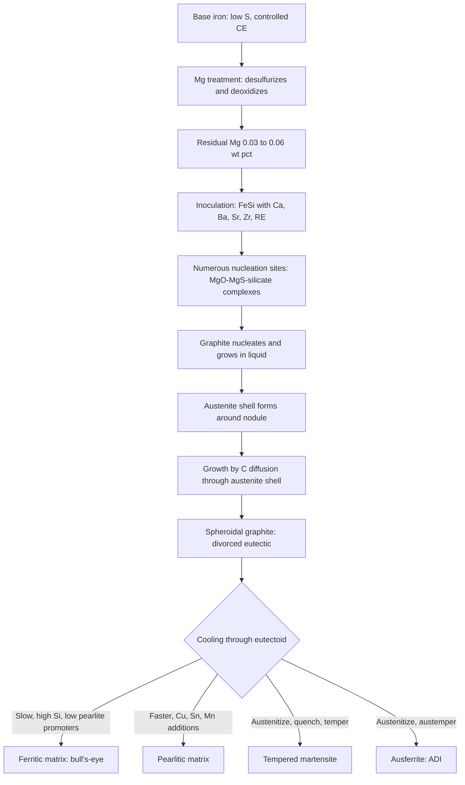
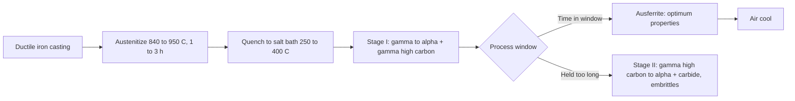

## Ductile and Nodular Cast Iron


Ductile iron, also called **nodular iron**, **spheroidal graphite (SG) iron**, or **ductile cast iron**, is a family of cast irons in which the carbon precipitates during solidification as **spheroidal (nodular) graphite** instead of flakes. The rounded graphite minimizes stress concentration and interrupts crack paths far less than flakes do, so the metallic matrix can express its strength and ductility. The result is a castable iron with strength, toughness, and fatigue resistance approaching those of steel, combined with good castability, machinability, and damping. The material was developed in 1943 to 1948 (Millis, Gagnebin, and Pilling at INCO, and independently Morrogh at BCIRA) after the discovery that small additions of **magnesium** (or cerium) convert flake graphite to spheroids.

**Key Points**

- Typical composition: 3.2–4.2 wt% C, 1.8–2.8 wt% Si (higher in SiMo and solution-strengthened grades), 0.1–0.5 wt% Mn, <0.02 wt% S (before treatment), <0.08 wt% P, and 0.03–0.06 wt% residual Mg.
- The nodularizing treatment uses **magnesium** (most common), cerium or other rare earths, or Mg-containing alloys, followed by **inoculation**.
- Grades range from ferritic (high ductility, up to ~18% elongation) to pearlitic (high strength and wear resistance), through quenched-and-tempered and **austempered (ADI)** grades exceeding 1400 MPa tensile strength.
- Ductile iron is more **section-tolerant** than gray iron but requires tight melt and process control; shrinkage porosity, nodularity loss, and carbides are the dominant quality concerns.

---

### Metallurgical Fundamentals

#### Graphite Formation and Nodule Growth

Graphite nucleates on non-metallic inclusions (typically complex Mg-Ca-Al-Si oxide-sulfide particles). In flake iron, graphite grows in contact with the liquid along its basal-plane edges, giving the flake shape. In ductile iron, Mg (and O, S scavenging) alters the interfacial energy so that graphite grows as spheroids radially from the nucleus. As the eutectic proceeds, each nodule becomes **enveloped by an austenite shell**; further growth of the nodule then occurs by **carbon diffusion through the austenite shell**, which explains why spheroidal graphite growth is slower and why the eutectic in ductile iron is called *divorced*.



#### Solidification and Carbon Equivalent

Ductile iron is normally poured at or slightly above the eutectic composition. The carbon equivalent is:

$$CE = \%C + \frac{\%Si + \%P}{3}$$

| Composition Zone | Typical CE | Behavior |
| --- | --- | --- |
| Hypoeutectic | < 4.2 | Primary austenite dendrites; higher shrinkage/feeding demands; greater carbide risk in thin sections |
| Near-eutectic | 4.2–4.6 | Usual target range for most castings |
| Hypereutectic | > 4.6–4.7 | Risk of **graphite flotation** (primary nodules float in thick sections), especially at high pouring temperature |

**Example: Carbon equivalent of a typical ductile iron**

For 3.70% C, 2.40% Si, 0.03% P:

$$CE = 3.70 + \frac{2.40 + 0.03}{3} = 3.70 + 0.81 = 4.51$$

**Output**

$CE = 4.51$: slightly hypereutectic (eutectic at approximately 4.3). This is acceptable in thin to moderate sections but risks graphite flotation in very heavy sections without control of pouring temperature and cooling rate.

#### Stable vs. Metastable Solidification

Ductile iron solidifies in the stable (graphite) system when nucleation is adequate. Insufficient inoculation, excessive Mg, carbide formers (Cr, V, Mo, Ti, Mn segregation), or fast cooling promote **carbides (chill)**, which are brittle and hard to machine. Because Mg raises the tendency toward carbide formation (it is a mild carbide promoter and nucleation depressor), inoculation is essential.

---

### Nodularization Treatment

#### Principle

Magnesium is added to the molten base iron where it:

1. **Desulfurizes** the melt: $Mg + S \rightarrow MgS$
2. **Deoxidizes** the melt: $Mg + O \rightarrow MgO$
3. Dissolves in the iron, and the remaining (**residual**) Mg modifies graphite growth to spheroidal

The base iron sulfur content should be low (typically <0.02%, often 0.005–0.015% after desulfurization). Mg vapor pressure at iron temperatures is very high (boiling point of Mg ≈ 1090 °C), so the reaction is violent unless controlled by alloy form or treatment vessel.

#### Mg Recovery and Residual Magnesium

The amount of Mg to add can be estimated from:

$$Mg_{add} = \frac{(\%S_i - \%S_f)\times 0.76 + \%Mg_{res}}{R_{Mg}}$$

Where:

- $\%S_i$ = initial sulfur, $\%S_f$ = final sulfur (after treatment)
- $0.76$ = stoichiometric ratio of Mg to S (atomic mass 24.3 / 32.1)
- $\%Mg_{res}$ = target residual Mg (typically 0.03–0.05%)
- $R_{Mg}$ = Mg recovery (fraction of added Mg that dissolves; depends on process, typically 0.3–0.8 as a fraction)

**Example: Magnesium addition calculation**

Initial S = 0.015%, final S = 0.008%, target residual Mg = 0.040%, recovery = 0.50:

$$Mg_{add} = \frac{(0.015 - 0.008)\times 0.76 + 0.040}{0.50} = \frac{0.00532 + 0.040}{0.50} = 0.0906\%$$

**Output**

About 0.09% Mg must be added (as pure Mg equivalent), which for a 5% Mg alloy corresponds to roughly $0.0906 / 0.05 \approx 1.8\%$ of alloy relative to the treated iron weight.

[Inference] Recovery values and reaction stoichiometry vary by treatment method, ladle geometry, temperature, and base sulfur; foundry-specific calibration is required.

#### Treatment Methods

| Method | Description | Typical Mg Recovery | Notes |
| --- | --- | --- | --- |
| **Sandwich (ladle with pocket)** | Alloy placed in a ladle pocket, covered with steel scrap or FeSi; iron poured over | ~40–60% | Widely used; simple and economical |
| **Tundish cover** | Ladle with a lid; iron enters through a tundish, alloy in a pocket | ~50–70% | Reduced fume, better recovery |
| **Plunging (bell)** | Mg alloy in a graphite or refractory bell plunged into the melt | ~40–60% | Uses pure Mg or Mg-bearing briquettes; good for large ladles |
| **Pressure vessel (converter)** | Mg added under pressure to suppress vaporization | ~60–85% | High recovery, allows pure Mg use |
| **Wire injection (cored wire)** | Mg or MgFeSi cored wire fed into the melt | ~50–75% | Precise, automatic dosing |
| **In-mold treatment (inmold)** | Nodulizing alloy placed in a reaction chamber in the gating system | ~40–70% | No fading; used for automotive and other high-volume, one-mold runs |
| **Flow-through, Georg Fischer converter** | Iron flows across pure Mg | ~60–80% | Historic, still used |

#### Nodularizing Alloys

| Alloy Type | Typical Composition | Comment |
| --- | --- | --- |
| MgFeSi (5–9% Mg) | 44–48% Si, 5–9% Mg, ~0.5–1% Ca, 0.5–1% RE | Standard; RE neutralizes tramp elements |
| NiMg | 10–20% Mg in Ni | For austenitic ductile (Ni-resist D) |
| Pure Mg | ~99.9% Mg | Requires pressure or plunging systems |
| Cerium-mischmetal-bearing alloys | Ce/La additions | Aid nodule count and neutralize Pb, Ti, etc. |
| Ca-bearing alloys | Ca-FeSi | Contribute to desulfurization and nucleation |

**Key Points**

- Treatment temperature is typically ~1450–1520 °C; higher temperatures reduce Mg recovery and increase fade.
- **Rare earths (Ce, La)** counter the harmful effect of trace elements (Pb, Bi, Sb, Ti, As) that cause degenerate graphite.
- Slag (Mg silicates, sulfides) must be skimmed before pouring to avoid dross inclusions.

#### Fading

Residual Mg decreases with holding time due to oxidation and evaporation ("**Mg fade**"). Typical fade is ~0.001–0.002% Mg per minute in open ladles, and inoculation fade occurs within minutes. Consequently, treated iron must be poured within a limited time, typically **10–20 minutes** or less depending on the ladle practice.

---

### Inoculation

Inoculation follows nodularization and increases the number of graphite nuclei, reducing carbide formation and improving nodule count and uniformity.

| Inoculation Stage | Description | Effect |
| --- | --- | --- |
| **Primary (ladle)** | 75% FeSi addition, ~0.3–0.8% during or after Mg treatment | Basic nucleation |
| **Secondary (late)** | Stream or transfer-ladle addition | Improves nodule count, reduces fade |
| **In-mold inoculation** | Inoculant in a chamber or filter in the gating | Maximum nucleation at pouring; minimal fade |

Inoculants contain Ca, Ba, Sr, Zr, Al, or rare earths, which form oxide/sulfide substrates (e.g., BaS, CaS, or complex silicates) suitable for graphite nucleation.

**Key Points**

- Typical nodule count ranges from about **100–300 nodules/mm²** in general castings, and higher (300–600+/mm²) in thin sections.
- Insufficient inoculation gives carbides and low nodule count; excessive inoculation raises shrinkage tendency, slag, and cost.

---

### Chemical Composition and Elemental Effects

#### Typical Composition Ranges

| Element | Typical Range (wt%) | Role |
| --- | --- | --- |
| C | 3.2–4.2 | Graphite volume; CE control |
| Si | 1.8–2.8 (up to 4.5% in SiMo) | Graphitizer, ferrite promoter, solid-solution strengthening |
| Mn | 0.1–0.5 (lower for ferritic, up to 0.7% in pearlitic) | Pearlite promoter; segregates to cell boundaries (carbide risk) |
| P | <0.05–0.08 | Embrittles at cell boundaries (phosphide eutectic) |
| S | <0.02 (base), <0.01 (final) | Consumes Mg (forms MgS) |
| Mg | 0.03–0.06 (residual) | Spheroidization |
| Cu | 0.2–1.0 | Pearlite promoter, strengthening |
| Ni | 0.5–2.0 | Hardenability, toughness |
| Mo | 0.1–0.5 | Hardenability, elevated temperature strength; segregation-prone (carbides) |
| Cr | <0.05 (normally) | Strong carbide former; limited in most grades |
| Sn, Sb | 0.01–0.10 (Sn); trace Sb | Strong pearlite promoters (also carbide/degenerate graphite risk) |
| RE (Ce, La) | 0.005–0.02 | Neutralize tramp elements, aid nodularity |

#### Deleterious Trace Elements (Anti-Nodularizers)

| Element | Effect | Typical Limit |
| --- | --- | --- |
| Pb | Promotes Widmanstätten graphite, degenerate graphite | <0.002–0.005% |
| Bi | Fine graphite, carbides | <0.002–0.01% (small amounts can boost nodule count in thin castings) |
| Sb | Pearlite promoter; deleterious at excess | <0.004% for most grades |
| Ti | Spiky/flake graphite in hypereutectic, compacted graphite | <0.03–0.04% |
| As | Degenerate graphite | <0.02% |
| Al | Pinholes (hydrogen from moisture reaction) | <0.02% in many specifications |
| Te, Se | Carbide formers | Trace control |

[Inference] Limits vary by specification, casting section size, and rare-earth level; treat listed values as typical guidance.

The **Thielemann factor** (Ti-free anti-nodularizing index, in one common form) is often used to estimate the harmful combined effect of trace elements:

$$K_1 = 4.4\,Ti + 2.3\,Sb + 290\,Pb + 370\,Bi + 1.6\,Al$$

[Unverified] Coefficients and the exact form of the index vary among references; consult the source used by your foundry, and interpret using its recommended limit.

---

### Microstructure

#### Graphite Morphology (ISO 945-1 / ASTM A247)

| Form | Description | Comment |
| --- | --- | --- |
| **I** | Flake | Failure in nodularization |
| **II** | Crab (irregular) | Poor |
| **III** | Vermicular (compacted) | Intermediate; CGI when controlled |
| **IV** | Temper carbon (irregular nodules) | Typical of malleable iron |
| **V** | Imperfect nodules (irregular, spiky) | Degrades properties |
| **VI** | Regular spheroidal nodules | Target |

Typical requirement: **nodularity ≥ 80–90%** (Form V + VI counted as nodular by some standards, Form VI preferred).

Degenerate graphite forms include **exploded graphite** (thick section, high CE, high RE), **chunky graphite** (heavy sections, excess RE or Ce, Si-rich grades, slow cooling), **spiky graphite** (Pb, Ti), and **flake/vermicular graphite** (Mg fade, high S).

#### Matrix Structures

| Matrix | Formation | Appearance | Properties |
| --- | --- | --- | --- |
| **Ferritic ("bull's-eye")** | Slow cooling, high Si, low Mn/Cu/Sn, or ferritizing anneal | Ferrite halos around nodules | Highest ductility and toughness, lowest strength |
| **Pearlitic** | Faster cooling, Cu, Sn, Mn, Ni additions | Lamellar pearlite | High strength, wear resistance |
| **Ferritic-pearlitic** | Intermediate | Mixed | Balanced |
| **Tempered martensite** | Quench and temper | Fine acicular structure | Highest hardness and strength (non-ADI) |
| **Ausferrite (ADI)** | Austempering | Acicular ferrite + high-carbon austenite | High strength, ductility, fatigue, wear |
| **Austenitic** | 18–36% Ni (Ni-resist D types) | Fully austenitic | Corrosion, heat resistance, non-magnetic |
| **Carbides (cementite, chill)** | Insufficient nuclei, carbide formers | Hard eutectic carbide | Undesirable in most grades |

#### Microstructural Segregation

Elements such as Mn, Mo, Cr, and P **segregate to the last-to-freeze intercellular regions**, while Si and Ni segregate near the nodules (first-to-freeze). This segregation produces intercellular carbides in heavy sections, "**eutectic cell boundary**" carbide networks, and mixed matrix zones, all of which degrade toughness and machinability.

---

### Mechanical Properties

#### ASTM A536 Grades

| Grade | Tensile Strength (MPa) | Yield Strength (MPa) | Elongation (%) | Typical Hardness (HB) | Matrix |
| --- | --- | --- | --- | --- | --- |
| 60-40-18 | 414 | 276 | 18 | 143–187 | Ferritic |
| 65-45-12 | 448 | 310 | 12 | 156–217 | Ferritic-pearlitic |
| 80-55-06 | 552 | 379 | 6 | 187–255 | Ferritic-pearlitic |
| 100-70-03 | 689 | 483 | 3 | 241–300 | Pearlitic |
| 120-90-02 | 827 | 621 | 2 | 240–300 (quench and temper) | Tempered martensite |

The nomenclature "60-40-18" = tensile (ksi) – yield (ksi) – elongation (%). [Unverified] Confirm hardness bands and grade limits against the current ASTM A536 revision.

#### EN 1563 / ISO 1083 Grades

| Grade (EN-GJS) | Min. Tensile (MPa) | Min. Proof Stress Rp0.2 (MPa) | Min. Elongation (%) | Matrix |
| --- | --- | --- | --- | --- |
| 350-22 | 350 | 220 | 22 | Ferritic |
| 400-18 | 400 | 250 | 18 | Ferritic |
| 450-10 | 450 | 310 | 10 | Ferritic |
| 500-7 | 500 | 320 | 7 | Ferritic-pearlitic |
| 600-3 | 600 | 370 | 3 | Pearlitic-ferritic |
| 700-2 | 700 | 420 | 2 | Pearlitic |
| 800-2 | 800 | 480 | 2 | Pearlitic or tempered |
| 900-2 | 900 | 600 | 2 | Tempered martensite |

[Unverified] Confirm grade properties (including low-temperature impact grades such as EN-GJS-350-22-LT and RT) against the current edition of EN 1563 or ISO 1083.

#### Physical and General Properties

| Property | Typical Value |
| --- | --- |
| Density | 7.0–7.2 g/cm³ |
| Elastic modulus | ~160–175 GPa (higher than gray iron) |
| Poisson's ratio | ~0.275 |
| Thermal conductivity | ~30–40 W/m·K (lower than gray iron) |
| Thermal expansion coefficient | ~11–12.5 × 10⁻⁶ /K |
| Fatigue limit (unnotched, rotating bending) | ~0.40–0.50 × tensile strength (higher in ADI) |
| Damping capacity | Lower than gray iron, higher than steel |
| Fracture toughness $K_{Ic}$ | ~ 30–90 MPa√m depending on grade and matrix |
| Charpy impact (ferritic grades at room temperature) | ~ 10–20 J unnotched-class values for standard specimens; low-temperature grades specify minimum notched values |

[Inference] Property values are representative; consult specifications for guaranteed values and relevant test-bar geometry.

**Key Points**

- Ductile iron has a **distinct yield point behavior** (proof stress) and considerable plasticity, unlike gray iron.
- **Ferritic grades** show a ductile-to-brittle transition; low-temperature impact-tested grades use controlled composition (low P, adequate Si) to lower the transition temperature.
- Silicon solid-solution strengthening increases ferrite hardness and yield strength but reduces toughness and raises the transition temperature above ~ 3.5–4.0% Si.

#### Relationship Between Hardness and Strength

Empirical correlations between Brinell hardness and tensile strength are commonly used for quality control:

$$\sigma_{UTS} \approx k \cdot HB$$

with $k$ roughly 3.0–3.4 MPa per HB for many pearlitic-ferritic grades. [Inference] $k$ varies with matrix, nodularity, and grade; establish the correlation on your own production data.

**Example: Estimating tensile strength from hardness**

For HB = 200 and $k = 3.2$:

$$\sigma_{UTS} \approx 3.2 \times 200 = 640\ \text{MPa}$$

**Output**

Estimated tensile strength ≈ 640 MPa, consistent with a pearlitic-ferritic grade between 600-3 and 700-2 (EN designations). Actual acceptance requires tensile testing.

---

### Solid-Solution Strengthened Ferritic Ductile Iron (SSFDI)

By raising Si to about **3.2–4.3%** and controlling Mn and P, ferritic grades gain strength through **solid-solution strengthening** without pearlite, retaining ductility and giving uniform hardness and better machinability.

| Grade (EN 1563:2018) | Rp0.2 min (MPa) | Rm min (MPa) | A min (%) |
| --- | --- | --- | --- |
| EN-GJS-450-18 | 350 | 450 | 18 |
| EN-GJS-500-14 | 400 | 500 | 14 |
| EN-GJS-600-10 | 470 | 600 | 10 |

[Unverified] Verify SSFDI grade limits in the current edition of EN 1563 before specification.

**Key Points**

- Uniform hardness across the section and reduced sensitivity to cooling rate make SSFDI attractive for wind turbine hubs and automotive parts.
- Higher Si narrows the process window: risks include chunky graphite in heavy sections and reduced low-temperature toughness beyond ~4% Si.

---

### Alloyed and Special Ductile Irons

| Type | Composition Highlights | Key Properties | Applications |
| --- | --- | --- | --- |
| **SiMo ductile iron** | 3.5–4.5% Si, 0.5–1.0% Mo | Elevated temperature strength, oxidation and scaling resistance, up to ~ 800 °C | Exhaust manifolds, turbocharger housings |
| **Austenitic ductile (Ni-resist D-2, D-5)** | 18–36% Ni, Cr, Mn | Corrosion, heat resistance, non-magnetic, low expansion (D-5B) | Pumps, marine, turbochargers, precision instruments |
| **High-Ni or high-Mn low-temperature ductile** | 3.5–4% Ni | Improved low-temperature toughness | Cryogenic and arctic service |
| **Cu-Mo pearlitic ductile** | 0.5–1% Cu, 0.2–0.4% Mo | High strength, wear resistance | Gears, crankshafts |
| **Ductile iron for pipe (centrifugally cast)** | Ferritic, ~ 3.6% C, 2.4% Si | Corrosion resistance with cement lining, ductility | Water and sewage pipe |
| **ADI** | See below | Highest strength/toughness combination | Gears, crankshafts, rail, construction |

---

### Austempered Ductile Iron (ADI)

#### Process

ADI is produced by:

1. **Austenitizing** ductile iron at ~ 840–950 °C for 1–3 h (carbon saturation of austenite controlled by temperature)
2. **Quenching** rapidly (avoiding pearlite) into a salt bath at the **austempering temperature** (~ 250–400 °C)
3. **Isothermal hold** for ~ 1–4 h to form **ausferrite** (acicular ferrite + carbon-stabilized high-carbon austenite)
4. **Air cooling** to room temperature



The **process window** is the time interval between completion of Stage I (formation of ausferrite with carbon-stabilized austenite) and onset of Stage II (decomposition of high-carbon austenite into ferrite and carbide). Holding within the window gives peak ductility and toughness.

#### ASTM A897 / EN 1564 / ISO 17804 Grades

| ASTM A897 Grade | Tensile (MPa) | Yield (MPa) | Elongation (%) | Hardness (HB) | Impact (J, unnotched) |
| --- | --- | --- | --- | --- | --- |
| 750-500-11 (Grade 1) | 750 | 500 | 11 | 241–302 | ~ 110 |
| 900-650-09 (Grade 2) | 900 | 650 | 9 | 269–341 | ~ 100 |
| 1050-750-07 (Grade 3) | 1050 | 750 | 7 | 302–375 | ~ 80 |
| 1200-850-04 (Grade 4) | 1200 | 850 | 4 | 341–444 | ~ 60 |
| 1400-1100-02 (Grade 5) | 1400 | 1100 | 2 | 388–477 | ~ 35 |

[Unverified] Confirm grade limits and impact requirements in the current edition of ASTM A897/A897M, EN 1564, or ISO 17804.

**Key Points**

- **Low austempering temperature** (~250–300 °C) gives fine ausferrite, high strength and wear resistance, lower ductility.
- **High austempering temperature** (~350–400 °C) gives coarser ausferrite with more retained austenite, higher ductility and toughness.
- Alloying (Cu, Ni, Mo) provides hardenability for thicker sections; Mo and Mn segregation can cause martensite or carbides in cell boundaries, so limits are set.
- The high-carbon austenite in ADI can transform to martensite under strain (TRIP-like effect), improving wear and rolling-contact performance after strain hardening. [Inference] Magnitude is grade and load dependent.

---

### Heat Treatment of Ductile Iron

| Treatment | Temperature / Practice | Purpose | Result |
| --- | --- | --- | --- |
| **Stress relief** | 550–650 °C, 1–4 h, slow cool | Reduce casting/machining residual stress | Dimensional stability; minor matrix change |
| **Ferritizing anneal (full)** | 880–925 °C (austenitize, 1–3 h), furnace cool slowly through eutectoid (or hold at ~ 700–760 °C) | Convert pearlite and carbides to ferrite; maximize ductility | Ferritic matrix (grades 60-40-18, EN-GJS-400-18) |
| **Subcritical anneal** | ~ 700–760 °C, 2–8 h | Decompose pearlite without full austenitization; low distortion | Mostly ferritic matrix; may not remove massive carbides |
| **Graphitizing (carbide-removal) anneal** | ~ 900–950 °C, 1–4 h | Decompose free carbides | Restores machinability |
| **Normalizing** | ~ 870–930 °C, air cool | Uniform pearlite, moderate strength and hardness | Pearlitic matrix (100-70-03 type) |
| **Quench and temper** | Austenitize ~ 850–900 °C, oil quench, temper 400–650 °C | High strength and hardness | Tempered martensite (120-90-02) |
| **Flame/induction hardening** | Rapid surface heating, quench | Wear surfaces (crankshaft journals, gear teeth) | Hard martensitic case |
| **Austempering** | See ADI | Highest strength/toughness | Ausferrite |
| **Nitriding / nitrocarburizing** | 500–580 °C | Surface wear and fatigue | Compound and diffusion layers |

**Key Points**

- Graphite nodules dissolve carbon during austenitization; matrix carbon content (~0.7–0.9% at typical temperatures) is set by the austenitizing temperature and Si content.
- Ductile iron is more tolerant of quenching than gray iron, but section thickness and hardenability (Mn, Cu, Ni, Mo) govern through-hardening depth.
- **Tempering embrittlement** and cracking risks apply as in low-alloy steels.

---

### Casting and Foundry Practice

#### Melting and Base Iron

- **Charge**: low-S, low-tramp pig iron (sorelmetal, high-purity pig), steel scrap, clean returns; keep Ti, Pb, Bi, Sb, As, Al at low levels.
- **Melting**: induction (typical) or cupola (with desulfurization); base iron typically 3.5–3.9% C, 1.3–2.0% Si before treatment (Si is increased by the FeSi in the nodulizing and inoculation alloys, giving final ~2.2–2.8%).
- Superheating and holding: controlled to avoid loss of nucleation and carbon.

#### Gating, Feeding, and Molding

- Ductile iron exhibits a **two-stage solidification shrinkage-expansion behavior**: initial contraction, graphite-driven expansion during eutectic growth, then shrinkage at the end of solidification.
- With **rigid molds** (well-compacted green sand, resin sand, or shell), graphite expansion can compensate for shrinkage to a considerable degree ("**self-feeding**"), allowing reduced feeder size or riserless designs. Mold wall movement destroys this effect.
- **Filters** (ceramic foam) reduce slag and dross inclusions.
- **Chills** promote directional solidification in isolated hot spots.

**Key Points**

- Ductile iron is more prone to **shrinkage porosity** and **dross defects** than gray iron.
- Pouring temperature typically 1350–1420 °C, depending on section thickness and design.

#### Typical Casting Defects

| Defect | Cause | Remedy |
| --- | --- | --- |
| **Nodularity loss / low nodule count** | Low Mg (fade), high S, tramp elements, oxidation | Adequate Mg, low base S, RE addition, control tramps, pour promptly |
| **Carbides (chill)** | Low nodule count, thin section, carbide formers (Cr, Mo, V, Mn), inadequate inoculation | Better inoculation, control composition, higher Si, heat treat (graphitizing anneal) |
| **Shrinkage porosity** | Soft mold, low CE, poor feeding, high pouring temperature | Rigid molds, adequate risers/chills, control CE, lower pouring temperature |
| **Dross and slag inclusions (Mg silicates, sulfides, oxides)** | Poor slag skimming, turbulence, high Mg | Skim slag, filters, proper gating, control Mg |
| **Graphite flotation** | Hypereutectic CE, slow cooling, high superheat | Reduce CE, faster cooling, lower pouring temperature |
| **Chunky graphite** | Heavy sections, high Si, high RE, slow cooling | Limit RE and Si, faster cooling (chills), add Sb or Bi in controlled amounts |
| **Exploded graphite** | High CE, high RE, thick sections | Reduce CE and RE |
| **Pinholes / gas porosity** | Al plus moisture (hydrogen), binder gas, high N | Control Al, dry mold and charge, vent, low-N binders |
| **Mg-related surface defects (subsurface graphite degeneration)** | Mg reaction with mold sulfur (from resin binders, sulfonic acid catalysts) or moisture | Coatings, control S in binders, Mg level |
| **Spiky/vermicular graphite** | Pb, Ti, low residual Mg | Control tramps, add RE, adjust Mg |
| **Cold shuts, misruns** | Low pouring temperature, fading iron | Pour hotter or faster, improve gating |

---

### Quality Control and Testing

| Method | Purpose | Standard / Practice |
| --- | --- | --- |
| Chemical analysis (spectrometry, combustion C/S) | Composition, CE, Mg residual | ASTM E415, E1019 |
| Thermal analysis (cooling curve, TA cups with and without tellurium) | Predict CE, nucleation, chill tendency, nodularity/Mg state | Foundry-specific; process control |
| Metallography (unetched for graphite; nital for matrix) | Nodularity, nodule count, matrix, carbides | ASTM A247, ISO 945-1/4 |
| Image analysis | Quantify nodularity and nodule count | ISO 945-4 |
| Tensile test (separately cast, attached, or cast-on coupons) | Grade acceptance | ASTM A536, ISO 1083, ASTM E8, ISO 6892 |
| Impact test (Charpy V-notch or unnotched) | Toughness, ductile-brittle transition (low-temp grades) | ASTM E23, ISO 148 |
| Hardness test (Brinell) | Matrix verification, production control | ASTM E10, ISO 6506 |
| Ultrasonic velocity/attenuation, resonance frequency | Non-destructive nodularity estimation | Supplier and foundry practice |
| Magnetic particle, penetrant, radiography, UT | Surface/subsurface defects, shrinkage | ASTM E709, E165, E94, E114 |
| Magnesium / oxygen activity sensors | Process control of Mg | Foundry practice |

**Key Points**

- **Ultrasonic velocity** correlates with nodularity (sound velocity is highest in nodular iron and lowest in flake iron); it is a common, fast production check.
- Test coupon thickness must represent the critical section; **cast-on or attached test bars** give more representative properties than separately cast bars for heavy sections.

**Example: Simple nodularity check via ultrasonic velocity (illustrative)**

A widely used rule of thumb: longitudinal wave velocity $v_L$ in ductile iron of about 5,500–5,600 m/s indicates well-formed nodules, while values near 4,500–5,000 m/s indicate flake or vermicular graphite.

$$E \approx \rho\,v_L^2\,\frac{(1+\nu)(1-2\nu)}{(1-\nu)}$$

For $\rho = 7100\ \text{kg/m}^3$, $v_L = 5600\ \text{m/s}$, $\nu = 0.275$:

$$E \approx 7100 \times (5600)^2 \times \frac{(1.275)(0.45)}{0.725} = 7100 \times 3.136\times10^{7} \times 0.7914 \approx 1.762\times10^{11}\ \text{Pa} \approx 176\ \text{GPa}$$

**Output**

$E \approx 176$ GPa, consistent with nodular iron's elastic modulus (about 160–175 GPa). [Inference] The relationship assumes an isotropic, homogeneous solid; velocity-based nodularity thresholds are calibrated per foundry and are not universal.

---

### Applications

| Application | Reason for Ductile Iron |
| --- | --- |
| Automotive crankshafts, camshafts, connecting rods (some) | Strength, fatigue resistance, machinability, cost vs. forged steel |
| Steering knuckles, control arms, suspension brackets | Ductility, impact resistance, fatigue |
| Differential carriers and housings | Strength, castability |
| Gears and sprockets | Wear, strength (pearlitic, ADI) |
| Ductile iron pipe and fittings (water, sewage) | Corrosion resistance with lining, ductility, pressure capacity |
| Wind turbine hubs, rotor housings, main shafts and frames | Large sections, fatigue, low-temperature toughness (EN-GJS-350-22-LT type) |
| Pump and valve bodies, hydraulic components | Pressure containment, castability |
| Railway components (brake components, couplers) | Toughness, fatigue |
| Mining and construction equipment components | Impact, wear (ADI) |
| Turbocharger and exhaust manifolds | SiMo and Ni-resist grades for heat |
| Heavy machinery frames, presses, container casks (nuclear waste and spent fuel casks) | Large section castings, containment integrity |

**Key Points**

- Ductile iron often replaces **steel forgings and weldments** where net-shape casting reduces machining and cost.
- Ductile iron pipe dominates water distribution in many regions owing to its strength, ductility, and corrosion performance with cement mortar lining and polyethylene encasement.

---

### Comparison with Other Materials

| Property | Ductile Iron (Pearlitic) | Gray Iron (Class 40) | Malleable Iron (45008) | Cast Steel (~ 0.3% C) |
| --- | --- | --- | --- | --- |
| Graphite | Spheroidal | Flake | Temper carbon | None |
| Tensile strength (MPa) | 600–800 | ~276 | ~448 | 450–700 |
| Yield (MPa) | 370–500 | none defined | ~310 | 250–450 |
| Elongation (%) | 2–10 | <1 | ~ 8 | 15–25 |
| Elastic modulus (GPa) | 160–175 | 100–140 | ~170 | ~207 |
| Fatigue strength | High | Low | Medium | High |
| Damping | Moderate | Excellent | Moderate | Low |
| Castability | Good | Excellent | Good (needs anneal) | Fair |
| Machinability | Good | Excellent | Excellent | Fair |
| Relative cost | Moderate | Low | Higher | Higher |
| Weight (density g/cm³) | ~ 7.1 | ~ 7.1 | ~ 7.2 | ~ 7.8 |

---

### Practical Examples

#### Example 1: Selecting a Ductile Iron Grade for a Suspension Knuckle

**Requirements**: Tensile strength ≥ 550 MPa, yield ≥ 350 MPa, elongation ≥ 6%, good fatigue resistance, wall thickness 8–30 mm, high volume, low cost.

| Candidate | Evaluation |
| --- | --- |
| EN-GJS-500-7 | Rm 500, Rp0.2 320: slightly below requirement |
| EN-GJS-600-3 | Rm 600, Rp0.2 370: strength OK, elongation 3% below 6% |
| ASTM 80-55-06 (approx. EN-GJS-550-6 type) | 552 MPa / 379 MPa / 6%: meets all |
| SSFDI EN-GJS-600-10 | Rm 600, Rp0.2 470, A 10%: exceeds; needs higher Si control |
| ADI Grade 1 (750-500-11) | Exceeds; extra heat treatment cost |

**Output**

**ASTM 80-55-06 (ferritic-pearlitic)** is the economical choice. If fatigue and toughness margins must increase, SSFDI 600-10 avoids pearlite variation and heat treatment. [Inference] Final selection depends on fatigue testing, section-size-specific properties, and machinability cost.

#### Example 2: Diagnosing Low Nodularity in Heavy-Section Castings

**Symptoms**: Nodularity 60% (spec ≥ 85%) with vermicular graphite in thick-section areas; tensile test bars pass but elongation is low.

| Item | Finding |
| --- | --- |
| Base sulfur | 0.018% (high) |
| Residual Mg (spectrometer) | 0.028% (low end) |
| Time from treatment to pour | 22 min |
| Ladle temperature | 1500 °C at treatment |

**Root cause**: High initial S consumed Mg, low residual Mg, plus excessive time (fade) and high treatment temperature (poor recovery).

**Corrective actions**

1. Desulfurize the base iron to ≤ 0.010% S before treatment.
2. Increase Mg addition to reach 0.040–0.050% residual.
3. Reduce treatment temperature to ~ 1470–1490 °C.
4. Limit time to pour to ≤ 12–15 min, or use in-mold treatment.
5. Add rare earths (Ce/La-bearing alloy) if tramp elements (Pb, Ti) are present.
6. Verify with thermal analysis and ultrasonic checks, then confirm with metallography.

**Output**

Nodularity returns above 85% and elongation meets specification. [Inference] Actual results vary by ladle geometry, alloy type, and melt practice; confirm through controlled trials.

#### Example 3: Melt and Treatment Calculator Script

The following Python script computes CE, estimates the Mg addition, checks a tramp-element index, and flags graphite flotation risk.

```python
def carbon_equivalent(C, Si, P=0.0):
    return C + (Si + P) / 3.0

def mg_addition(S_init, S_final, Mg_res, recovery):
    """Pure-Mg-equivalent addition in wt%. recovery is a fraction (0-1)."""
    return ((S_init - S_final) * 0.76 + Mg_res) / recovery

def alloy_required(mg_add_pct, alloy_mg_pct):
    """Percent of alloy relative to iron weight."""
    return mg_add_pct / (alloy_mg_pct / 100.0)

def anti_nodularizer_index(Ti=0.0, Sb=0.0, Pb=0.0, Bi=0.0, Al=0.0):
    # One commonly cited form; verify coefficients for your foundry.
    return 4.4*Ti + 2.3*Sb + 290*Pb + 370*Bi + 1.6*Al

def evaluate(name, C, Si, P, S_init, S_final, Mg_res, recovery, alloy_mg, section_mm, tramp):
    ce = carbon_equivalent(C, Si, P)
    mg = mg_addition(S_init, S_final, Mg_res, recovery)
    alloy = alloy_required(mg, alloy_mg)
    k1 = anti_nodularizer_index(**tramp)
    print(f"{name}")
    print(f"  CE = {ce:.2f}")
    if ce > 4.6 and section_mm > 50:
        print("  Warning: hypereutectic CE in heavy section -> graphite flotation risk")
    print(f"  Mg addition (pure Mg basis) = {mg:.3f}%")
    print(f"  Alloy required ({alloy_mg}% Mg) = {alloy:.2f}% of iron weight")
    print(f"  Anti-nodularizer index K1 = {k1:.2f}")
    print()

evaluate(
    name="Melt 1: automotive knuckle",
    C=3.70, Si=2.40, P=0.03,
    S_init=0.012, S_final=0.008, Mg_res=0.040, recovery=0.50, alloy_mg=5.0,
    section_mm=20,
    tramp=dict(Ti=0.015, Sb=0.001, Pb=0.0005, Bi=0.0002, Al=0.010),
)

evaluate(
    name="Melt 2: heavy wind-turbine hub",
    C=3.75, Si=2.20, P=0.04,
    S_init=0.010, S_final=0.006, Mg_res=0.045, recovery=0.55, alloy_mg=6.0,
    section_mm=150,
    tramp=dict(Ti=0.020, Sb=0.001, Pb=0.0008, Bi=0.0003, Al=0.012),
)
```

**Output**



```
Melt 1: automotive knuckle
  CE = 4.51
  Mg addition (pure Mg basis) = 0.086%
  Alloy required (5.0% Mg) = 1.72% of iron weight
  Anti-nodularizer index K1 = 0.26

Melt 2: heavy wind-turbine hub
  CE = 4.49
  Mg addition (pure Mg basis) = 0.086%
  Alloy required (6.0% Mg) = 1.43% of iron weight
  Anti-nodularizer index K1 = 0.52
```

[Inference] Recovery, stoichiometric factors, and the anti-nodularizer index coefficients are simplified; treat outputs as screening estimates and validate with spectrometry, thermal analysis, and trial pours. Melt 2's heavy section warrants close control of CE (below ~4.4–4.5) and RE addition to limit chunky and exploded graphite.

---

### Design and Engineering Guidelines

**Key Points**

- **Uniform sections**: avoid abrupt thickness changes; use generous fillets to reduce hot spots and shrinkage.
- **Heavy sections**: reduce CE, control RE and Si, and use chills to limit chunky graphite and flotation; consider cast-on test coupons to verify properties in the critical section.
- **Design stress**: base design on yield strength (proof stress) and fatigue limits from data for the specific grade, section size, and surface condition; apply appropriate safety factors.
- **Notch and surface effects**: cast skin, surface degeneration, and machining marks affect fatigue; shot peening and rolling (for crankshaft fillets) markedly improve fatigue strength.
- **Low-temperature service**: specify low-temperature impact grades (e.g., EN-GJS-350-22-LT, -RT), low P and Mn, and ensure ferritic matrix.
- **Welding**: possible but requires special procedures (Ni-based or ductile iron electrodes, preheat, post-weld heat treatment); avoid for critical structural repairs unless qualified.
- **Machining allowance**: typically 2–5 mm depending on size and skin condition.

---

### Environmental and Safety Considerations

- **Mg treatment** produces intense reaction, fume (MgO), light, and splash hazard; use covered treatment stations, exhaust ventilation, and PPE.
- **Moisture** contact with molten iron can cause steam explosions; ensure dry tools, ladles, and charge.
- **Salt bath (ADI)** hazards are as for austempering of steels: strong oxidizers, fire/eruption risk if wet parts or contamination enter the bath.
- **Dust and fume** (silica, MgO, metal fumes, binder decomposition products) require controls and monitoring.
- Ductile iron is highly recyclable; returns and scrap can be reused with attention to Mg, Ti, and tramp control.

---

### Relevant Standards

| Standard | Scope |
| --- | --- |
| ASTM A536 | Ductile iron castings (grades 60-40-18 to 120-90-02) |
| ASTM A897/A897M | Austempered ductile iron castings |
| ASTM A395/A395M | Ferritic ductile iron pressure-retaining castings for elevated temperatures |
| ASTM A874/A874M | Ferritic ductile iron castings for low-temperature service |
| ASTM A247 | Evaluating graphite microstructure in iron castings |
| ASTM A716, A746 | Ductile iron culvert pipe; gravity sewer pipe |
| ASTM A439 | Austenitic ductile (Ni-resist) castings |
| ISO 1083 | Spheroidal graphite cast irons: classification |
| EN 1563 | Founding: spheroidal graphite cast irons |
| EN 1564 | Founding: austempered ductile cast irons |
| ISO 17804 | Founding: ausferritic spheroidal graphite cast irons |
| ISO 2531, EN 545, AWWA C151 | Ductile iron pipe |
| ISO 945-1, -4 | Graphite microstructure classification and nodularity assessment |
| SAE J434 | Automotive ductile (nodular) iron castings |

[Unverified] Confirm current revisions and scope before use in specifications, procurement, or certification.

---

### Conclusion

Ductile (nodular) cast iron combines the castability and low cost of cast irons with strength, ductility, toughness, and fatigue properties approaching those of steel, due to graphite occurring as compact spheroids rather than flakes. Achieving that structure depends on a low-sulfur base iron, an effective **magnesium (or rare-earth-assisted) nodularizing treatment**, robust **inoculation**, and control of carbon equivalent, tramp elements, and pouring practice. The matrix, controlled by composition, cooling rate, and heat treatment (ferritizing, normalizing, quench and temper, or **austempering to ADI**), determines the property level from highly ductile ferritic grades to ultra-high-strength ADI. Success in production requires disciplined melt control, thermal analysis, metallography, and defect prevention (carbides, shrinkage, dross, nodularity loss, and heavy-section graphite degeneration), supported by suitable design practices for section thickness and feeding.

---

**Related Topics**

- Compacted graphite iron and the narrow Mg window
- Austempered ductile iron: austempering kinetics and the process window
- Graphite nucleation and growth theories in nodular iron
- Inoculation practice and fading mechanisms
- Solidification and feeding of ductile iron; riser design and mold rigidity
- Chunky, exploded, and other degenerate graphite forms
- Heat treatment of ductile iron: ferritizing, normalizing, quench and temper
- Fatigue and fracture toughness of ductile iron
- Thermal analysis and sensors for ductile iron process control
- Ni-resist and SiMo ductile irons for elevated temperature service
- Ductile iron pipe manufacturing (centrifugal casting) and corrosion protection