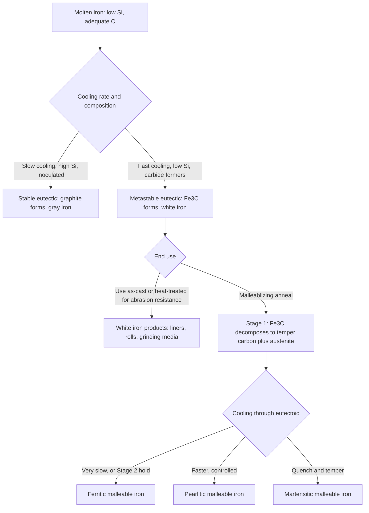
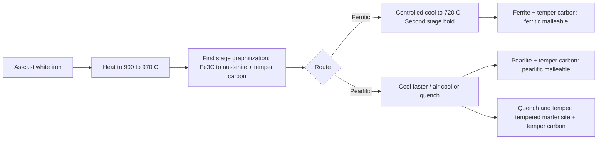

## White and Malleable Cast Iron


White cast iron and malleable cast iron are closely linked members of the cast iron family. **White iron** solidifies according to the *metastable* Fe-Fe₃C system, so nearly all of its carbon is combined as **cementite (Fe₃C)** or alloy carbides; it is extremely hard, wear-resistant, and brittle, and its fracture surface is bright and crystalline (hence "white"). **Malleable iron** begins life as a white iron casting of carefully controlled composition, which is then given a prolonged **malleablizing (graphitizing) anneal** that decomposes the cementite into **temper carbon** (compact, irregular graphite nodules) in a ferritic or pearlitic matrix, giving a tough, machinable, moderately ductile material.

**Key Points**

- White iron is used in the as-cast (or heat-treated) state where **abrasion resistance** dominates: mill liners, slurry pump parts, grinding media, rolls, and crusher components.
- Malleable iron is used where **toughness, machinability, and thin-section castability** are needed: pipe fittings, automotive and rail brackets, hardware, and electrical line fittings.
- Both depend on **suppressing graphite during solidification** (high cooling rate, low Si, and carbide-stabilizing additions), which limits section thickness, especially for malleable iron.
- Malleable iron production is energy- and time-intensive (anneal cycles of tens of hours), and ductile iron has displaced it in many applications, but it remains valuable for small, thin-walled, complex castings.

---

### Metallurgical Fundamentals

#### Stable vs. Metastable Solidification

Cast irons can solidify by two competing eutectic reactions:

| System | Reaction | Eutectic Temperature (approx.) | Product |
| --- | --- | --- | --- |
| Stable (Fe-C) | $L \rightarrow \gamma + \text{Graphite}$ | ~1153 °C | Gray, ductile, CGI iron |
| Metastable (Fe-Fe₃C) | $L \rightarrow \gamma + \text{Fe}_3\text{C}$ | ~1147 °C | White iron (ledeburite) |

The stable eutectic temperature is slightly higher, so graphite is favored at low cooling rates. White iron forms when:

- **Cooling is rapid** (thin sections, chills, metal molds)
- **Silicon is low** (typically below ~1.5–2.0% in most white irons)
- **Carbide-stabilizing elements** (Cr, Mo, V, Mn, W) are present
- Nucleation of graphite is limited (no inoculation, low sulfur/oxygen nuclei)

A useful expression for the **graphitizing potential** is the carbon equivalent:

$$CE = \%C + \frac{\%Si + \%P}{3}$$

**Example: Carbon equivalent of a white iron and a malleable base iron**

Unalloyed white iron (3.2% C, 0.6% Si, 0.15% P):

$$CE = 3.2 + \frac{0.6 + 0.15}{3} = 3.2 + 0.25 = 3.45$$

Malleable base iron (2.5% C, 1.2% Si, 0.10% P):

$$CE = 2.5 + \frac{1.2 + 0.10}{3} = 2.5 + 0.43 = 2.93$$

**Output**

Both compositions are strongly **hypoeutectic** ($CE < 4.3$). The low carbon and silicon levels in malleable base iron ensure a fully white as-cast structure (no primary graphite) even in moderate sections, while leaving enough carbon and Si to allow graphitization during the subsequent anneal.

#### Solidification Structure of White Iron

For hypoeutectic white iron, solidification proceeds as:

1. **Primary austenite dendrites** form first from the liquid.
2. Remaining liquid enriches in carbon until it reaches the **metastable eutectic composition**.
3. **Ledeburite** (eutectic austenite + Fe₃C) forms interdendritically.
4. On cooling through the eutectoid, austenite transforms to **pearlite** (or, with alloying/heat treatment, to martensite plus retained austenite).
5. In alloyed irons, carbides other than cementite (e.g., $M_7C_3$) may form, changing hardness and toughness.



---

### White Cast Iron

#### Microstructure

Unalloyed white iron contains **massive carbide (ledeburite) networks with primary austenite dendrite sites** that transform to pearlite. The carbide (Fe₃C, hardness ~ 800–1000 HV) forms a continuous or semi-continuous network, giving high hardness but low toughness.

| Microconstituent | Description | Hardness (approx.) |
| --- | --- | --- |
| Cementite (Fe₃C) | Hard, brittle carbide | ~ 800–1100 HV |
| Pearlite | Lamellar ferrite + cementite | ~ 250–350 HV |
| Martensite (in heat-treated alloyed irons) | Hard acicular matrix | ~ 600–800 HV |
| Retained austenite | Softer, tough constituent | ~ 300–500 HV |
| $M_7C_3$ carbides (Cr-rich) | Discontinuous, rod/blade-like carbides | ~ 1200–1800 HV |

#### Classification of White Irons

| Class | Composition Highlights | Microstructure | Key Properties |
| --- | --- | --- | --- |
| **Unalloyed (plain) white iron** | 2.5–3.6% C, 0.5–1.5% Si, low alloy | Pearlite + Fe₃C (ledeburite) | Hard (HB ~ 400–500), brittle, inexpensive |
| **Chilled iron** | Gray-type composition, rapid surface cooling | White layer (chill) on gray/ductile core | Hard surface with tough core; rolls, wheels |
| **Ni-Cr white iron (Ni-Hard)** | 3–5% Ni, 1.4–4% Cr, 2.5–3.6% C | Martensite (+ retained austenite) + eutectic $M_3C$ carbide | High hardness, good abrasion resistance |
| **High-chromium white iron** | 11–30% Cr, 1.8–3.6% C, Mo, Ni, Cu | Martensite/austenite + $M_7C_3$ carbides | Best abrasion resistance, some corrosion and heat resistance |
| **Ni-Cr with high C and Cr (Ni-Hard 4)** | ~ 7–11% Cr, 4–7% Ni | Martensite + $M_7C_3$ | Improved toughness over Ni-Hard 1 |

**Key Points**

- **Ni-Hard** relies on Ni (3–5%) to suppress pearlite so the matrix transforms to martensite on air cooling or mild heat treatment.
- **High-chromium irons** contain discontinuous $M_7C_3$ carbides (harder and less continuous than $M_3C$), giving improved toughness relative to Ni-Hard at similar or better abrasion resistance.
- Chromium in excess of about **11–12%** shifts the carbide type from $M_3C$ to $M_7C_3$; the hardness of $M_7C_3$ (≈ 1500 HV) exceeds that of cementite (≈ 900 HV).

#### Carbide Type and Volume Fraction

The volume fraction of eutectic carbides in high-chromium white iron can be estimated from composition. An empirical relation for the carbide volume fraction (CVF) is:

$$CVF\ (\%) \approx 12.33\,(\%C) + 0.55\,(\%Cr) - 15.2$$

[Inference] This is an empirical approximation from literature (e.g., Maratray) valid for a limited composition range of high-chromium irons; use it for screening only and verify with metallography and image analysis.

**Example: Carbide volume fraction estimate**

For a 15% Cr iron with 2.8% C:

$$CVF \approx 12.33(2.8) + 0.55(15) - 15.2 = 34.52 + 8.25 - 15.2 = 27.6\%$$

**Output**

About **27.6 vol%** carbides, in line with typical values (20–35%) for a hypoeutectic 15% Cr white iron. [Inference] Actual values depend on heat treatment and solidification conditions.

The **eutectic composition** in high-chromium irons shifts with Cr content. A commonly cited approximation for eutectic carbon:

$$\%C_{eut} \approx 4.3 - 0.087\,(\%Cr)$$

[Unverified] Coefficients vary by source (e.g., 0.05–0.09 per %Cr); consult phase-diagram data or thermodynamic calculations (Fe-Cr-C liquidus projection) for design work.

#### Compositions of Standard Abrasion-Resistant Irons (ASTM A532)

| Class | Type | Typical C (%) | Typical Cr (%) | Typical Ni (%) | Typical Mo (%) | Typical Hardness |
| --- | --- | --- | --- | --- | --- | --- |
| I A | Ni-Cr-Hc (Ni-Hard 1) | 2.8–3.6 | 1.4–4.0 | 3.3–5.0 | ≤ 1.0 | 550–650 HB (as hardened) |
| I B | Ni-Cr-Hc | 2.4–3.0 | 1.4–4.0 | 3.3–5.0 | ≤ 1.0 | Similar |
| I C | Ni-Cr-Gb | 2.5–3.7 | 1.0–2.5 | 4.0 | ≤ 1.0 | Lower, more graphite |
| I D | Ni-HiCr (Ni-Hard 4) | 2.5–3.6 | 7.0–11.0 | 5.0–7.0 | 1.5 max | 500–700 HB |
| II A–E | 11–14% Cr | 2.0–3.3 | 11–14 | ≤ 2.5 | 3.0 max | 500–700 HB after HT |
| III A | 25% Cr | 2.0–3.3 | 23–30 | ≤ 2.5 | 3.0 max | ~ 450–600 HB, high corrosion resistance |

[Unverified] Class definitions, composition limits, and hardness requirements should be verified against the current edition of ASTM A532/A532M (and equivalent EN 12513 or ISO specifications).

#### Mechanical and Physical Properties

| Property | Typical Value (varies with type) |
| --- | --- |
| Hardness | 400–500 HB (unalloyed); 550–800 HB (Ni-Hard, high-Cr after HT) |
| Tensile strength | ~ 200–500 MPa (brittle; not a reliable design parameter) |
| Compressive strength | 1400–2500+ MPa (high) |
| Elongation | ~ 0% |
| Fracture toughness $K_{Ic}$ | ~ 15–35 MPa√m (high-Cr irons with martensitic matrices reach the upper end) |
| Density | 7.4–7.8 g/cm³ |
| Elastic modulus | ~ 175–200 GPa |
| Abrasion resistance | Excellent (relative to steels and gray iron) |
| Machinability | Very poor (grinding only) |

[Inference] Values are representative; check data sheets for grade-specific properties.

**Key Points**

- **Fracture toughness** rather than tensile strength governs the service life of white iron parts, because impact and cracking dominate failure.
- Toughness improves with a **martensitic/austenitic matrix**, lower carbide volume, and discontinuous carbide morphology; hardness and toughness must be balanced against wear conditions.

#### Heat Treatment of White Irons

| Treatment | Practice | Purpose |
| --- | --- | --- |
| **Stress relief / tempering** | ~ 200–300 °C, 2–8 h (Ni-Hard); ~ 450–550 °C for some high-Cr grades | Relieve casting stresses, temper martensite |
| **Subcritical treatment** | ~ 500–700 °C | Convert retained austenite, precipitate secondary carbides |
| **Destabilization hardening (high-Cr)** | Austenitize ~ 950–1050 °C (soak 1–6 h based on section), air cool (or oil/forced air for thick sections) | Precipitate secondary carbides in austenite, raising $M_s$ so martensite forms on cooling; adjusts retained austenite level |
| **Tempering after hardening** | ~ 200–500 °C | Reduce residual stress, temper martensite, transform some retained austenite |
| **Annealing (soften for machining)** | ~ 900–950 °C then slow cool (or subcritical anneal ~ 700–750 °C for extended time) | Soften for machining before final hardening; produce pearlitic matrix |

**Key Points**

- **Destabilization** at 950–1050 °C reduces carbon and Cr in austenite by precipitating secondary carbides, which raises $M_s$ and allows martensite to form on cooling.
- Excessive austenitizing temperature dissolves too much carbon, stabilizing austenite and lowering hardness; too low a temperature leaves the matrix insufficiently hardenable.
- Ni-Hard normally requires only tempering (~ 200–250 °C) after casting because Ni gives martensite on air cooling; heavy sections may need controlled cooling.

#### Applications of White Iron

| Application | Typical Type | Reason |
| --- | --- | --- |
| Slurry pump casings, impellers, and liners | High-Cr (15–28% Cr), Ni-Hard | Abrasion and erosion resistance |
| Ball mill and SAG mill liners; grinding balls | High-Cr, Ni-Hard, low-alloy white iron | Impact-abrasion resistance |
| Crusher and shredder wear parts (blow bars, hammers) | High-Cr, composite castings with steel inserts | Abrasion resistance with toughness |
| Rolling mill rolls (chilled iron, indefinite chill) | Chilled or alloyed white iron on gray/ductile core | Surface hardness with tough core |
| Shot blasting blades and nozzles | High-Cr | Abrasion resistance |
| Plowshares, railway brake shoes (historic) | Unalloyed or low-alloy white | Cost-effective wear parts |
| Coal pulverizer parts, ash-handling parts | Ni-Hard, high-Cr | Abrasion and mild corrosion |

---

### Chilled Iron

Chilled iron is a gray or ductile iron casting purposely cooled at the surface, using **metal chills or metal molds**, to produce a **white iron layer** on wear surfaces while the core remains graphitic and tough.

| Feature | Description |
| --- | --- |
| Chill depth | Typically 5–25 mm (or more) depending on chill design and composition |
| Structure profile | White (carbide) surface, mottled transition, gray/ductile core |
| Control variables | Si, CE, carbide formers (Cr, Mo, V), chill thickness/material, pouring temperature |
| Testing | Wedge (chill) test measures chill depth vs. section |

**Key Points**

- **Indefinite chill rolls** for steel and non-ferrous rolling exploit hard wear layers over tough cores (often ductile iron).
- Transition-zone (mottled) quality and residual stresses are critical; heat treatment (stress relief) is common.

---

### Malleable Cast Iron

#### Concept and Production Route

Malleable iron production has two essential steps:

1. **Cast as white iron**: a hypoeutectic, low C-Si composition cast into relatively thin sections (typically ≤ 50–100 mm) so that a fully white structure (no graphite flakes) forms.
2. **Malleablizing anneal**: prolonged heat treatment decomposes cementite into **temper carbon** (graphite nodules) and a ferritic or pearlitic matrix.

The graphitization reaction is:

$$\text{Fe}_3\text{C} \rightarrow 3\text{Fe} + \text{C (temper carbon)}$$

The resulting temper carbon is irregular and compact, so it is much less damaging to ductility than flake graphite.

#### Typical Composition of Base White Iron

| Element | Typical Range (wt%) | Role |
| --- | --- | --- |
| C | 2.2–2.9 | Sufficient for carbide formation; keeps CE low |
| Si | 0.9–1.9 | Promotes graphitization during anneal; too high causes as-cast graphite |
| Mn | 0.15–1.2 | Fixes S as MnS; slows graphitization if in excess |
| S | 0.02–0.20 | Retards graphitization; balance with Mn |
| P | ≤ 0.18 | Limits (steadite formation embrittles) |
| Cr | ≤ 0.06 | Strong carbide stabilizer, must be minimal (impedes graphitization) |
| Bi, B, Al (small additions) | Trace | Boron and Bi may promote temper carbon nucleation in some practices |

A typical guideline for **Mn/S balance** in malleable base iron is:

$$\%Mn \approx 1.7\,\%S + 0.15\ \text{(to} + 0.35)$$

[Inference] The exact excess Mn recommended depends on the foundry and grade; excessive free Mn hinders graphitization, while low Mn leaves FeS films that promote brittleness.

**Key Points**

- The **carbon and silicon window is narrow**: enough to allow graphitization in the anneal, but not enough to cause graphite in the as-cast state.
- Base iron **sulfur and manganese** control both as-cast whiteness and graphitization kinetics.
- Sections thicker than roughly 50–100 mm cannot be reliably cast fully white without excessive carbide stabilizers, hence the practical section limit.

#### Malleablizing Anneal

**Two-stage graphitization (blackheart, ferritic malleable iron)**

| Stage | Temperature | Time (typical) | Reaction | Result |
| --- | --- | --- | --- | --- |
| **First stage (FSG)** | ~ 900–970 °C | ~ 3–20 h (composition and section dependent) | Massive eutectic and primary carbides decompose to austenite + temper carbon | Removes ledeburite; austenite saturated with carbon at temperature |
| **Intermediate cooling** | ~ 900 °C → ~ 750 °C (controlled cooling) | Hours | Carbon rejection from austenite onto existing temper carbon nodules | Reduces carbon in austenite; minimizes pearlite risk |
| **Second stage (SSG)** | ~ 700–730 °C (or very slow cooling through 760–700 °C) | ~ 10–30 h | Eutectoid cementite/pearlite decomposes to ferrite + temper carbon | Ferritic matrix |

For **pearlitic malleable iron**, the second stage is bypassed or partially completed: after FSG, the castings are cooled at a controlled rate (or air cooled) through the eutectoid range, retaining pearlite (or transformed to martensite by quenching and tempered).



**Whiteheart malleable iron (European route)**

- Castings are annealed (~ 950–1050 °C, 40–100 h) in an **oxidizing/decarburizing atmosphere** (iron ore, mill scale, or controlled gas), decarburizing the surface.
- Result: a **decarburized ferritic skin** with a pearlitic/temper carbon core in thicker sections, and a nearly fully ferritic structure in thin sections.
- Because of the decarburization, whiteheart malleable iron has **good weldability**, but properties vary across the section.

**Key Points**

- Total anneal cycles frequently exceed **30–100 hours**, including heating and cooling, contributing heavily to production cost.
- **Temper carbon nodules** nucleate at MnS and other inclusions, carbide/austenite interfaces, and (in some processes) at boron- or bismuth-modified sites; nodule count influences anneal time.
- Higher **Si** and lower **Mn/S/Cr** speed graphitization; trace elements (Bi, B, Al, Ti) may accelerate or retard specific stages.

#### Kinetics of Graphitization

The rate of graphitization in the first stage is often described by an Avrami-type relation:

$$f = 1 - \exp\left(-k\,t^{n}\right)$$

where $f$ is the fraction of carbide decomposed, $k$ is the temperature-dependent rate constant, $t$ is time, and $n$ is an exponent (often ~ 1–2 depending on nucleation and growth mode). The rate constant follows an Arrhenius dependence:

$$k = k_0 \exp\left(-\frac{Q}{RT}\right)$$

**Example: Time to reach 95% decomposition (illustrative)**

Given $k = 0.10\ \text{h}^{-n}$ and $n = 1.5$ at 940 °C:

$$t = \left[\frac{-\ln(1 - 0.95)}{k}\right]^{1/n} = \left[\frac{2.996}{0.10}\right]^{0.667} = (29.96)^{0.667} \approx 9.6\ \text{h}$$

**Output**

Approximately **9.6 h** to decompose 95% of the carbide in the first stage for these illustrative constants. [Inference] Real constants must be determined experimentally (dilatometry or metallography) for the actual composition, nucleation state, and section.

The temperature dependence can be exploited to compare cycle choices. With $Q \approx 250$ kJ/mol, raising the temperature from 900 °C to 960 °C changes the rate constant by:

$$\frac{k_{960}}{k_{900}} = \exp\left[\frac{Q}{R}\left(\frac{1}{T_1} - \frac{1}{T_2}\right)\right]$$

with $T_1 = 1173\ \text{K}$, $T_2 = 1233\ \text{K}$, $R = 8.314\ \text{J/mol·K}$:

$$\frac{k_{960}}{k_{900}} = \exp\left[\frac{250000}{8.314}\left(\frac{1}{1173} - \frac{1}{1233}\right)\right] = \exp\left[30069 \times 4.148\times10^{-5}\right] = \exp(1.247) \approx 3.5$$

**Output**

About a **3.5-fold** increase in rate for a 60 °C rise, illustrating why the first stage is run as hot as practical (subject to distortion, scaling, and furnace limits). [Inference] The activation energy is an assumed illustrative value.

#### Types and Microstructures

| Type | Matrix | Graphite | Features |
| --- | --- | --- | --- |
| **Ferritic (blackheart) malleable** | Ferrite | Temper carbon nodules | Highest ductility and toughness, excellent machinability |
| **Pearlitic malleable** | Pearlite (fine lamellar, or tempered martensite) | Temper carbon nodules | Higher strength, wear resistance |
| **Martensitic malleable (quenched and tempered)** | Tempered martensite | Temper carbon nodules | Highest strength, hardness |
| **Whiteheart** | Decarburized ferrite skin, pearlite/temper carbon core | Little/no graphite at skin | Weldable, European use |

Microstructural features:

- Temper carbon appears as **irregular, rounded, compact aggregates** (rosettes, "popcorn-like") rather than smooth spheroids as in ductile iron, and are often surrounded by ferrite halos.
- **Nodule size and count** influence properties: finer, more numerous nodules improve toughness.

#### ASTM A47 / A220 and EN Grades

| Standard | Grade | Tensile Strength (MPa) | Yield Strength (MPa) | Elongation (%) | Matrix |
| --- | --- | --- | --- | --- | --- |
| ASTM A47 | 32510 | 345 | 224 | 10 | Ferritic |
| ASTM A47 | 35018 | 365 | 241 | 18 | Ferritic |
| ASTM A220 | 40010 | 414 | 276 | 10 | Pearlitic |
| ASTM A220 | 45008 | 448 | 310 | 8 | Pearlitic |
| ASTM A220 | 45006 | 448 | 310 | 6 | Pearlitic |
| ASTM A220 | 50005 | 517 | 345 | 5 | Pearlitic |
| ASTM A220 | 60004 | 586 | 414 | 4 | Pearlitic/martensitic |
| ASTM A220 | 70003 | 724 | 483 | 3 | Martensitic |
| ASTM A220 | 80002 | 793 | 552 | 2 | Martensitic |
| ASTM A220 | 90001 | 862 | 621 | 1 | Martensitic |
| EN 1562 | EN-GJMB-350-10 | 350 | 200 | 10 | Blackheart, ferritic |
| EN 1562 | EN-GJMB-450-6 | 450 | 270 | 6 | Blackheart, pearlitic |
| EN 1562 | EN-GJMB-650-2 | 650 | 430 | 2 | Blackheart, pearlitic/martensitic |
| EN 1562 | EN-GJMW-400-5 | 400 | 220 | 5 | Whiteheart |

The ASTM five-digit designation gives **yield strength (×100 psi... in ksi tens)** and **elongation (%)**: for example, 32510 = 32,500 psi yield and 10% elongation; 45008 = 45,000 psi yield and 8% elongation.

[Unverified] Confirm mechanical property limits and designation conventions against the current editions of ASTM A47/A47M, ASTM A220/A220M, and EN 1562 or ISO 5922 before use.

#### Physical and General Properties

| Property | Ferritic Malleable | Pearlitic Malleable |
| --- | --- | --- |
| Density | ~ 7.2–7.4 g/cm³ | ~ 7.2–7.4 g/cm³ |
| Elastic modulus | ~ 170–175 GPa | ~ 170–180 GPa |
| Hardness | 110–156 HB | 156–280 HB |
| Fatigue limit (rotating bending) | ~ 0.35–0.45 × Rm (roughly 130–200 MPa) | ~ 0.35–0.45 × Rm |
| Impact toughness (Charpy) | Good (higher for ferritic) | Moderate |
| Machinability | Excellent (among the best of ferrous alloys) | Good |
| Thermal conductivity | ~ 40–50 W/m·K | ~ 30–45 W/m·K |
| Damping capacity | Moderate | Moderate |

[Inference] Values are representative; consult supplier data for specific grades and section sizes.

**Key Points**

- Ferritic malleable iron has a **defined yield point** and gives substantial plastic deformation before fracture, unlike gray iron.
- Its **machinability** allows high-speed cuts with excellent surface finish and long tool life.
- Bending/straightening (limited cold work) is feasible for ferritic grades, historically valued in fittings and hardware.

---

### Comparison of White, Malleable, and Related Irons

| Feature | White Iron | Malleable Iron | Gray Iron | Ductile Iron |
| --- | --- | --- | --- | --- |
| Carbon form | Fe₃C / alloy carbides | Temper carbon (irregular nodules) | Flake graphite | Spheroidal graphite |
| As-cast structure | White (carbide) | White (before anneal) | Gray | Gray/ferrite-pearlite |
| Requires heat treatment for final structure | Optional (alloyed) | **Required** (anneal) | Optional | Optional |
| Hardness | Very high (400–800 HB) | 110–280 HB | 150–300 HB | 140–300 HB |
| Elongation | ~ 0% | 1–18% | <1% | 2–18% |
| Tensile strength (MPa) | 200–500 (brittle) | 345–860 | 150–400 | 400–900 |
| Section size range | Limited by hardenability/casting design (can be heavy in alloyed grades) | **Thin (≤ ~ 50–100 mm)** | Any | Any (with process control) |
| Machinability | Very poor (grind) | Excellent | Excellent | Good |
| Abrasion resistance | Excellent | Fair | Good | Good |
| Relative production cost | Low–moderate | Higher (long anneal) | Lowest | Moderate |
| Typical use | Wear parts | Thin, tough, complex castings | Blocks, housings | Crankshafts, pipe |

---

### Casting and Process Considerations

#### White Iron Casting Practice

- **Melting**: cupola, induction, or arc furnace; alloy additions (Cr, Ni, Mo, Cu) made in the furnace or ladle.
- **Molds**: sand molds for most castings; metal (chill) molds for high cooling rate applications (chilled rolls, grinding balls).
- **Feeding**: white iron has **high shrinkage** (no graphite expansion), requiring adequate risers, padding, and directional solidification; shrinkage in heavy sections is a major defect source.
- **Cooling and shakeout**: high-Cr and Ni-Hard castings are sensitive to thermal shock; they are usually cooled slowly in the mold to avoid cracking.

#### Malleable Iron Casting Practice

- **Melting**: cupola-duplexed with electric holding, or induction; strict control of C, Si, Mn, S, Cr, and residuals.
- **Section control**: the design must promote fully white structure through the entire section (hence thin walls and good chills).
- **Gating and feeding**: high shrinkage in white iron requires substantial feeding, which tends to increase yield losses compared to gray iron. [Inference] Yield is commonly lower (≈ 50–65%) than for gray iron because of feeder volume.
- **Annealing**: castings are packed in **annealing pots** with sand or ore (for whiteheart) or placed in **continuous or batch furnaces** with protective atmosphere (blackheart) to avoid scaling; typical loading uses fixtures to limit distortion.

**Key Points**

- **Sulfur and Mn** control is critical: high S retards graphitization; unbalanced Mn adds hardness and retards annealing.
- **Cr and other carbide stabilizers** must be kept extremely low in malleable iron (typically ≤ 0.06% Cr), and scrap selection must avoid contamination.
- Mold and pattern design should include generous fillets and section uniformity to avoid hot spots that could form graphite (gray spots) in the as-cast condition.

#### Typical Defects

| Defect | Material | Cause | Remedy |
| --- | --- | --- | --- |
| **Gray spots / primary graphite in as-cast section** | Malleable | Si too high, thick sections, slow cooling | Reduce Si/C, use chills, thin sections |
| **Incomplete graphitization (residual carbides)** | Malleable | Low Si, high Mn/S/Cr, short or cool anneal | Adjust composition, extend/raise anneal temperature |
| **Surface decarburization / oxidation** | Malleable | Uncontrolled atmosphere in blackheart anneal | Use protective atmosphere, packing, lower temperatures |
| **Distortion / sagging** | Malleable | Long high-temperature soak, poor support | Fixtures, support, lower loads |
| **Brittle fracture (blackheart)** | Malleable | Steadite (P too high), residual carbides, poor S/Mn balance | Control P, S/Mn balance |
| **Shrinkage cavities** | White and malleable | High solidification shrinkage, inadequate feeding | Risers, chills, directional solidification |
| **Cracking** | White (esp. high-Cr, Ni-Hard) | Thermal shock, sharp corners, rapid cooling, heavy sections | Slow mold cooling, radii, stress relief, preheat |
| **Retained austenite variability** | High-Cr white | Austenitizing temperature errors, composition variation | Control heat treatment and composition |
| **Spalling (in service)** | White | Impact overload, thermal cycling, inadequate toughness | Use tougher matrix, lower carbide volume, composite designs |

---

### Wear Behavior and Selection of White Irons

Wear resistance depends on the **hardness ratio** between the abrasive and the material, and on the **carbide volume, size, and matrix support**. A widely used relationship shows that when the hardness of the wear material $H_m$ is greater than about 0.8 times that of the abrasive $H_a$, wear rates fall sharply:

$$\frac{H_m}{H_a} \gtrsim 0.8$$

Quartz (silica) sand has hardness of about 800–1200 HV, so carbides at ~ 1200–1800 HV ($M_7C_3$) resist scratching well, while cementite (~ 900–1100 HV) is marginal.

| Wear Condition | Preferred White Iron |
| --- | --- |
| Low-stress sliding abrasion by fine particles (slurry pumps) | High-Cr with high carbide volume, or Ni-Hard |
| High-stress gouging with impact (crusher parts) | Lower-carbon, tougher high-Cr; composite designs |
| Corrosive slurry (mineral processing) | 25–30% Cr (Class III), Mo-alloyed |
| Grinding media in ball mills | High-Cr (12–28% Cr), low-alloy white iron, forged steel alternatives in some cases |
| Erosive wear at moderate angle | High-Cr martensitic |

**Key Points**

- **Toughness–abrasion tradeoff**: increasing carbide fraction improves abrasion resistance but reduces toughness; the matrix (martensite vs. austenite) determines how well carbides are supported.
- Retained austenite can improve toughness and work-hardens under impact, so an optimized mixture is often better than a fully martensitic matrix in impact-heavy service. [Inference] Optimal retained austenite level depends on application.

---

### Quality Control and Testing

| Method | Purpose | Standard / Practice |
| --- | --- | --- |
| Chemical analysis (OES, combustion C/S) | Composition, CE, Cr, Ni, Mo, Mn/S balance | ASTM E415, E1019 |
| Chill wedge test | As-cast whiteness/chill depth (malleable base iron) | Foundry practice |
| Thermal analysis | Verify CE and carbide tendency | Foundry practice |
| Hardness testing (Brinell, Rockwell C) | Grade acceptance, matrix verification | ASTM E10, E18; ISO 6506, 6508 |
| Metallography (nital, Vilella's, Murakami's reagents) | Carbide type/volume, matrix, temper carbon distribution | ASTM E3, E407; image analysis |
| Tensile and impact testing | Malleable grade acceptance | ASTM A47/A220, E8, E23 |
| X-ray diffraction | Retained austenite | ASTM E975 |
| Dye penetrant / magnetic particle / radiography / UT | Surface and internal defects | ASTM E165, E709, E94 |
| Carbide volume fraction by image analysis | Correlate with wear performance | ASTM E562 (point count), image analysis |
| Wear testing (ASTM G65 dry sand-rubber wheel, G75 slurry abrasivity) | Compare abrasion resistance | ASTM G65, G75 |

---

### Practical Examples

#### Example 1: Selecting a White Iron for a Slurry Pump Impeller

**Requirements**: Handling a siliceous slurry with 30% solids by weight, particle size < 2 mm, pH 6–8, moderate impact, section thickness up to 40 mm.

| Candidate | Evaluation |
| --- | --- |
| Unalloyed white iron | Too soft for silica; short life |
| Ni-Hard 1 | Good abrasion; moderate toughness; not ideal in mildly corrosive slurry |
| **High-Cr 15% Cr–3% Mo (Class II)** | High hardness, $M_7C_3$ carbides, martensitic/austenitic matrix, moderate corrosion resistance |
| High-Cr 27% Cr (Class III A) | Better corrosion resistance; suitable if acidic slurry or higher chloride |
| Rubber-lined or polyurethane | Alternative for fine particles but poor at higher temperature and impact |

**Output**

**High-chromium (15% Cr–Mo) white iron**, destabilized at ~ 980–1010 °C and air hardened, tempered at 200–250 °C, is the balanced choice. If slurry acidity or chlorides increase, move to 25–28% Cr (Class III). [Inference] Final selection should be validated by wear test (ASTM G75 or field trials).

#### Example 2: Designing a Malleablizing Cycle for a Ferritic Malleable Fitting

**Requirements**: Ferritic malleable 32510 pipe fitting, wall thickness 6 mm, maximum section 15 mm; base iron 2.5% C, 1.2% Si, 0.45% Mn, 0.06% S, 0.05% P, ≤ 0.04% Cr.

**Composition check (Mn/S balance)**

Using the guideline $\%Mn \approx 1.7\times\%S + 0.15$ to $0.35$:

$$\%Mn_{target} = 1.7(0.06) + 0.15\ \text{to}\ 0.35 = 0.102 + 0.15\ \text{to}\ 0.35 = 0.25\ \text{to}\ 0.45\%$$

Mn of 0.45% sits at the upper edge; consider reducing Mn slightly or S to speed graphitization.

**Suggested cycle (indicative)**

| Step | Temperature | Time | Notes |
| --- | --- | --- | --- |
| Load and heat | Ambient → 950 °C | ~ 6–8 h | Controlled rate to limit distortion |
| First stage graphitization | 950 °C | 6–12 h | Decompose eutectic carbides |
| Controlled cooling | 950 → 760 °C | 4–6 h | Encourage carbon deposition on existing nodules |
| Second stage | 760 → 700 °C slow cool (or hold at ~ 720 °C) | 12–24 h | Convert pearlite/eutectoid cementite to ferrite |
| Final cool | Below 650 °C, air cool | 2–4 h | Prevent temper embrittlement (avoid slow cooling below ~ 500 °C where feasible) |

**Output**

Total cycle roughly 35–55 h, producing ferritic matrix with well-dispersed temper carbon and hardness ~ 110–150 HB. [Inference] Cycle parameters vary with composition and section; validate with sectioned test castings and metallography for each furnace.

#### Example 3: Screening Script for White/Malleable Iron Base Composition

The following Python script computes CE, checks Mn/S balance, estimates carbide volume fraction for high-Cr irons, and flags likely as-cast structure risk for a malleable base iron.

```python
def carbon_equivalent(C, Si, P=0.0):
    return C + (Si + P) / 3.0

def mn_target_range(S):
    base = 1.7 * S
    return base + 0.15, base + 0.35

def carbide_volume_fraction(C, Cr):
    """Empirical CVF for high-Cr white iron (screening only)."""
    return 12.33 * C + 0.55 * Cr - 15.2

def malleable_base_check(C, Si, Mn, S, P, Cr, section_mm):
    ce = carbon_equivalent(C, Si, P)
    mn_lo, mn_hi = mn_target_range(S)
    print(f"  CE = {ce:.2f}")
    print(f"  Mn target range = {mn_lo:.2f}-{mn_hi:.2f}% (actual {Mn:.2f}%)")
    issues = []
    if Si > 1.9:
        issues.append("Si high: gray-spot (primary graphite) risk in as-cast section")
    if Si < 0.9:
        issues.append("Si low: slow graphitization in anneal")
    if Cr > 0.06:
        issues.append("Cr high: carbide stabilization impedes graphitization")
    if not (mn_lo <= Mn <= mn_hi):
        issues.append("Mn/S balance outside guideline")
    if section_mm > 50:
        issues.append("Section > ~50 mm: fully white as-cast structure difficult")
    if ce > 3.4:
        issues.append("CE high for malleable base iron: check as-cast whiteness")
    print("  Issues:", "; ".join(issues) if issues else "None flagged")

def white_iron_check(name, C, Cr):
    cvf = carbide_volume_fraction(C, Cr)
    print(f"{name}: estimated carbide volume fraction = {cvf:.1f}%")

print("Malleable base iron A:")
malleable_base_check(C=2.50, Si=1.20, Mn=0.45, S=0.06, P=0.05, Cr=0.04, section_mm=15)

print("\nMalleable base iron B (thick section, high Si):")
malleable_base_check(C=2.80, Si=2.00, Mn=0.30, S=0.05, P=0.08, Cr=0.10, section_mm=70)

print()
white_iron_check("High-Cr iron, 15% Cr / 2.8% C", C=2.8, Cr=15)
white_iron_check("High-Cr iron, 27% Cr / 2.6% C", C=2.6, Cr=27)
```

**Output**



```
Malleable base iron A:
  CE = 2.93
  Mn target range = 0.25-0.45% (actual 0.45%)
  Issues: None flagged

Malleable base iron B (thick section, high Si):
  CE = 3.53
  Mn target range = 0.24-0.44% (actual 0.30%)
  Issues: Si high: gray-spot (primary graphite) risk in as-cast section; Cr high: carbide stabilization impedes graphitization; Section > ~50 mm: fully white as-cast structure difficult; CE high for malleable base iron: check as-cast whiteness

High-Cr iron, 15% Cr / 2.8% C: estimated carbide volume fraction = 27.6%
High-Cr iron, 27% Cr / 2.6% C: estimated carbide volume fraction = 31.7%
```

[Inference] The thresholds encode general foundry guidance, not a specification. The CVF relation is an empirical screening estimate; melt-specific thermal analysis, trial castings, and metallography are needed before release.

---

### Design and Engineering Guidelines

**Key Points**

- **White iron parts**: avoid sharp corners, thin unsupported edges, and abrupt section changes; use radii ≥ 6–10 mm where possible, and design for compressive loading with bolted-in or cast-in retention features (avoid tensile stresses on the casting).
- **Composite castings**: cast high-Cr white iron over or against steel backing to combine toughness with wear surface; bimetallic liners and hammers are common.
- **Malleable iron**: use wall thickness ~ 3–25 mm (up to ~ 50 mm in some practice), uniform sections, and generous fillets; allow for dimensional change during anneal (growth from graphite formation is small; distortion from handling and sag is larger).
- **Machining allowance**: malleable iron machines well and needs modest stock (1.5–3 mm); white iron requires grinding and much larger allowances when hardened.
- **Fatigue and impact**: ferritic malleable iron tolerates impact and moderate fatigue loads; avoid stress raisers and surface defects that reduce fatigue life.
- **Corrosion**: galvanizing is common for malleable iron fittings; pipe-fitting malleable iron should meet dimensional and pressure standards.

---

### Environmental and Safety Considerations

- **Foundry hazards**: molten metal, silica dust, binder fumes, and noise; follow local occupational health requirements.
- **Annealing furnaces**: high-temperature operation, protective atmospheres (endothermic gas, nitrogen-hydrogen) require gas safety and leak detection; oxidizing whiteheart anneal generates scale and requires dust and fume control.
- **Grinding white iron**: produces hard abrasive dust and sparks; use dust extraction, appropriate wheels, and PPE.
- **Energy use**: long anneal cycles make malleable iron energy-intensive; heat recovery and continuous furnaces help reduce consumption.
- **Recycling**: worn white iron parts and malleable scrap are recyclable, but high-Cr and Ni-Hard scrap should be segregated to avoid contaminating gray or ductile iron melts (Cr is a carbide former and detrimental to ductile iron nodularity).

---

### Relevant Standards

| Standard | Scope |
| --- | --- |
| ASTM A532/A532M | Abrasion-resistant cast irons (Ni-Hard, high-Cr, etc.) |
| ASTM A47/A47M | Ferritic malleable iron castings |
| ASTM A220/A220M | Pearlitic malleable iron castings |
| ASTM A197/A197M | Cupola malleable iron |
| ASTM A602 | Automotive malleable iron castings |
| SAE J158 | Automotive malleable iron castings |
| ISO 5922 | Malleable cast iron |
| EN 1562 | Founding: malleable cast irons (EN-GJMB, EN-GJMW) |
| EN 12513 | Founding: abrasion-resistant cast irons |
| ISO 21988 | Abrasion-resistant cast irons (classification) |
| ASTM G65, G75 | Abrasion and slurry abrasivity/wear tests |

[Unverified] Confirm current revisions, scope, and equivalence between ASTM, ISO, and EN standards before applying them in specifications or procurement.

---

### Conclusion

White cast iron and malleable cast iron share a common origin in **metastable (carbide) solidification** but diverge in purpose. White iron, particularly in Ni-Hard and high-chromium forms, exploits **hard eutectic carbides in a martensitic or austenitic matrix** for exceptional abrasion resistance where toughness demands are moderate. Malleable iron converts a low-carbon, low-silicon white iron casting into a **tough, machinable, ductile-behaving material** through a controlled malleablizing anneal that transforms cementite into temper carbon in a ferritic or pearlitic matrix. Successful production in both cases depends on tight control of composition (C, Si, Mn/S balance, carbide formers), cooling rate and section thickness, feeding of the high-shrinkage white structure, and precisely controlled heat treatment (destabilization and tempering for white iron; two-stage graphitization for malleable iron). Selecting between them and neighboring materials (gray, ductile, and steel) rests on the balance of wear resistance, toughness, section size, machinability, and cost.

---

**Related Topics**

- Abrasion mechanisms and wear testing of cast irons
- High-chromium white iron heat treatment and carbide types ($M_3C$, $M_7C_3$, $M_{23}C_6$)
- Fe-Cr-C phase diagram and liquidus projection
- Bimetallic and composite wear castings
- Chilled iron rolls and roll metallurgy
- Graphitization kinetics and temper carbon nucleation
- Whiteheart vs. blackheart malleablizing practice
- Ductile iron as a competitor to malleable iron
- Casting design for high-shrinkage irons: risers, chills, and feeding
- Retained austenite control and subzero treatment in white irons
- Austenitic Ni-resist and other high-alloy irons