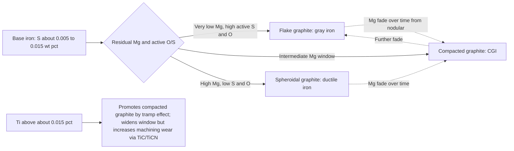

## Compacted Graphite Iron


Compacted graphite iron (CGI), also called **vermicular graphite iron** or **vermicular cast iron**, is a cast iron in which graphite occurs as short, thick, interconnected **"worm-like" particles with rounded edges and irregular bumpy surfaces**. Its graphite morphology sits between the sharp, continuous flakes of gray iron and the isolated spheroids of ductile iron. As a result, CGI combines properties from both neighbors: it has substantially higher **strength, stiffness, and fatigue resistance** than gray iron, while retaining better **thermal conductivity, damping, castability, and machinability** than ductile iron. The blunt graphite tips and the strong bonding between the graphite and matrix (the graphite worms are interlocked with the matrix in three dimensions) retard crack initiation and propagation compared with flakes.

CGI was observed early (Morrogh, 1948, in Mg- and Ce-treated irons) but remained a laboratory curiosity because its narrow production window was difficult to control. Sensor-based process control (Sinter-Cast, developed from the 1980s) enabled reliable series production, leading to its adoption in diesel engine blocks and heads beginning in the late 1990s and 2000s.

**Key Points**

- Typical composition: 3.1–4.0 wt% C, 1.7–3.0 wt% Si, 0.1–0.6 wt% Mn, <0.02 wt% S (after treatment), <0.05 wt% P, with residual Mg of about **0.008–0.020 wt%** and controlled Ti (<0.015–0.020%).
- Graphite shape is defined by **nodularity (typically 0–20%; up to ~ 20–30% allowed depending on the specification)**, with the remainder vermicular and only a trace of flake.
- The **production window is narrow**: too little Mg produces flake graphite; too much produces nodular graphite; both degrade the intended CGI property balance.
- Main application: **diesel and high-performance engine blocks, cylinder heads, exhaust manifolds, brake discs, and other parts under high mechanical and thermal load**.

---

### Metallurgical Fundamentals

#### Graphite Morphology and 3D Structure

In two-dimensional metallographic sections, CGI graphite appears as short, thick, rounded-tip particles, sometimes described as "worms," "vermicules," or blunt ridges. Deep etching and 3D reconstruction (serial sectioning, SEM after deep etching, X-ray tomography) show that the apparent separate particles in a polished section are frequently **parts of a single, coral-like eutectic cell structure**, connected at the cell center and branching outward, with the graphite growing in close contact with the liquid and austenite.

| Graphite Type | Shape (2D section) | Tip Geometry | 3D Connectivity |
| --- | --- | --- | --- |
| Flake (gray iron) | Long, thin, straight or curved plates | Sharp | Highly interconnected in a cell |
| **Vermicular (CGI)** | Short, thick, worm-like | **Blunt, rounded** | Interconnected in a cell, coral-like |
| Spheroidal (ductile iron) | Round nodules | None | Isolated |
| Temper carbon (malleable iron) | Irregular clusters | Rounded | Isolated |

#### ISO 945 / ASTM A247 Classification

| ISO 945-1 Form | Description | Relevance |
| --- | --- | --- |
| I | Flake | Undesired in CGI (indicates Mg deficiency or high S) |
| II | Crab / irregular flake | Undesired |
| **III** | **Vermicular (compacted)** | **Target morphology** |
| IV | Temper carbon | Malleable iron |
| V | Imperfect nodular (spiky, irregular) | Tolerated in limited amounts |
| VI | Regular nodular | Limited in CGI (nodularity limit) |

**Nodularity** is the fraction (percent) of graphite particles that are nodular (Forms V and VI, by ISO 16112 rules, counting particles above a size and shape-factor criterion). For CGI:

$$\text{Nodularity (\%)} = \frac{\text{Area (or count) of nodular graphite particles}}{\text{Total graphite particles}} \times 100$$

Typical acceptance criteria:

| Specification Context | Nodularity Requirement |
| --- | --- |
| ISO 16112 (general) | Nodularity ≤ 20% |
| Automotive engine blocks | Often 0–10% nodularity; some allow up to ~ 20% with mostly compacted; strict rejection for flake |
| Bulk properties target | ≥ 80% compacted (Form III) and < ~20% Form V/VI, and no flake |

[Unverified] Exact nodularity limits and how particles are counted differ by standard and customer specification (e.g., ISO 16112, ASTM A842, OEM engineering standards). Verify against the applicable document.

#### The Role of Magnesium, Sulfur, and Oxygen

Graphite growth mode in liquid iron depends on the **surface-active elements** (S and O) that promote basal-plane-edge growth (flakes) versus the effect of Mg (and rare earths) that scavenge S and O and change interfacial energy so that graphite grows more isotropically (spheroids).

Simplified conceptual picture:

| Melt Condition | Dominant Surface-Active Elements | Graphite Result |
| --- | --- | --- |
| High S and O (dissolved) | S, O adsorb on prism faces | Flake graphite |
| S and O partly removed, low residual Mg | Intermediate | **Compacted (vermicular) graphite** |
| S and O mostly removed, higher residual Mg | Mg dominates | Nodular (spheroidal) graphite |

The **Mg window** for stable CGI at typical S levels is narrow, on the order of:

$$Mg_{res} \approx 0.008\text{–}0.020\ \text{wt\%}$$

and it shifts with base sulfur, treatment alloy, section size, and cooling rate. As Mg decays (fade), the structure can drift from nodular to compacted to flake within minutes.



#### Solidification Behavior

CGI solidification proceeds through:

1. **Primary austenite dendrites** (hypoeutectic) or primary graphite (hypereutectic).
2. **Eutectic reaction** forming austenite plus compacted graphite in a eutectic cell.
3. **Eutectoid reaction**: austenite decomposes to pearlite or ferrite depending on composition and cooling rate.

Volume changes during solidification lie between gray and ductile iron. Gray iron shows strong graphite expansion, so it can be nearly self-feeding in rigid molds. Ductile iron shows greater shrinkage tendency and needs more feeding. CGI has **intermediate shrinkage behavior**, requiring feeding practice closer to ductile iron than to gray iron, especially in heavy sections.

The **carbon equivalent** is:

$$CE = \%C + \frac{\%Si + \%P}{3}$$

Typical CGI CE values are near-eutectic: **4.2–4.5**, slightly lower than for many ductile irons to limit graphite flotation and dross, and higher than gray iron's typical hypoeutectic range.

**Example: Carbon equivalent of a typical CGI melt**

For 3.65% C, 2.30% Si, 0.03% P:

$$CE = 3.65 + \frac{2.30 + 0.03}{3} = 3.65 + 0.777 = 4.43$$

**Output**

$CE = 4.43$: slightly hypereutectic. Careful control of pouring temperature and cooling rate is needed to avoid primary graphite flotation in thick sections.

#### Matrix Structure

| Matrix | Formation | Properties |
| --- | --- | --- |
| **Pearlitic (typical, 70–100% pearlite)** | Cu, Sn, or Mn additions; faster cooling | High strength and hardness; standard for engine blocks (e.g., ~ 90% pearlite) |
| **Ferritic-pearlitic** | Moderate | Balanced strength and ductility; better machinability |
| **Ferritic (>80% ferrite)** | High Si, low pearlite promoters, ferritizing anneal | Highest elongation, lowest strength |
| **Alloyed** | Cu, Mo, Ni, Cr | Higher strength, thermal stability |

**Key Points**

- Typical engine block CGI is **~ 90% pearlitic** for strength and wear, with pearlite stabilized by 0.5–1.0% Cu and/or ~ 0.05–0.1% Sn.
- Ferrite content strongly affects yield strength and machinability; pearlite content typically is specified by metallographic rating or limited by hardness.

---

### Chemical Composition and Elemental Effects

#### Typical Composition Ranges

| Element | Typical Range (wt%) | Role |
| --- | --- | --- |
| C | 3.1–4.0 | Graphite volume, CE control |
| Si | 1.7–3.0 | Graphitizer, ferrite promoter, solid-solution strengthening |
| Mn | 0.1–0.6 | Pearlite promoter; controlled to limit carbides and segregation |
| S | <0.02 (final), often 0.005–0.015 | Governs Mg requirement and graphite shape |
| P | <0.05 | Steadite formation; embrittlement |
| Mg | 0.008–0.020 (residual) | Compacting agent |
| Ti | 0.005–0.020 (upper limit ~ 0.020%) | Widens compacting window as an anti-nodularizer; too high causes machining problems |
| Cu | 0.4–1.0 | Pearlite promoter, strength |
| Sn | 0.03–0.10 | Strong pearlite promoter |
| Mo | 0.1–0.5 | Elevated-temperature strength; carbide-prone |
| Cr | <0.1 | Carbide-forming; controlled |
| RE (Ce, La) | ≤ ~ 0.01–0.02 (if used) | Modifies graphite; in CGI often small or via alloys |
| Ca, Al | Trace | Present from alloys; Al can cause gas defects |

#### Compacting Agents and Anti-Nodularizers

| Approach | Description |
| --- | --- |
| **Under-treatment with Mg** | Add Mg less than the nodularizing quantity (e.g., MgFeSi alloy, or cored wire) to land in the compacted window |
| **Mg plus Ti** | Ti (~ 0.08–0.12% in some early practices; modern practice often lower) counters nodularizing effect and widens the Mg window, but TiC/Ti(C,N) particles reduce tool life |
| **Mg plus rare earth (Ce, La)** | Tailors nodularity, sometimes used to widen window |
| **Over-treatment then dilution (e.g., by adding base iron)** | Historical practice; imprecise |
| **Thermal-analysis-controlled corrective additions (Sinter-Cast)** | Real-time correction using Mg wire or base iron to keep within the compacted window |

**Key Points**

- Modern production limits **Ti to ≤ ~ 0.015–0.020%** in engine block CGI because Ti carbides and carbonitrides accelerate tool wear.
- **Sulfur** must be controlled in the base iron; it affects Mg consumption ($Mg + S \rightarrow MgS$) and the stability of the window.

The Mg consumed by sulfur can be estimated by:

$$Mg_{S} = 0.76 \times (\%S_{i} - \%S_{f})$$

where $0.76 \approx 24.3/32.1$ is the atomic mass ratio of Mg to S.

**Example: Mg consumed by sulfur**

For $S_i = 0.012\%$, $S_f = 0.008\%$:

$$Mg_S = 0.76 \times (0.012 - 0.008) = 0.00304\%$$

**Output**

About 0.003% Mg is used up by the sulfur reaction. The remaining Mg (residual) determines graphite shape, in addition to O-related consumption and recovery losses. [Inference] Practical additions must also allow for Mg oxidation and vaporization losses, recovery efficiency, and fade.

---

### Production of Compacted Graphite Iron

#### Process Control Challenge

Because the Mg window (about 0.008–0.020%) is only roughly 0.01% wide, ordinary spectrometric analysis and open-loop treatment are insufficient in series production. Fade of Mg (about 0.001–0.002% per minute in open ladles; and inoculation fade) means the state of the melt changes as the metal waits for pouring.

#### Approaches to CGI Production

| Method | Description | Advantages | Limitations |
| --- | --- | --- | --- |
| **Thermal-analysis-controlled (Sinter-Cast style, "SinterCast")** | Sample the treated melt in a special cup with a thermocouple at the wall and center; analyze cooling curves to determine nodularity, Mg state, and CE; correct with Mg wire or base iron before pouring | Reliable, high-volume production; quantitative | Requires investment and trained operators, proprietary system |
| **Conventional Mg/Ti treatment (with sandwich or cored wire)** | Tailored Mg amount with Ti (~ 0.1%) as anti-nodularizer | Lower equipment cost; wider window | Ti causes machining wear; less consistent |
| **Two-step (over-treated ductile + base iron dilution)** | Produce nodular iron, mix with base iron to reduce Mg | Simple concept | Poor control; rarely used in series |
| **Rare-earth-based compacting alloys** | Ce/La/Mg alloys to shift the window | Simple additions | Sensitivity to tramps; RE can degrade if overdosed |
| **Oxygen/sulfur activity sensors** | Measure active O (electrochemical probe) and correlate to graphite shape | Real-time | Calibration and probe life |
| **Cored wire injection (Mg, MgFeSi, with inoculant wires)** | Precise dosing into ladle | Automated, repeatable | Needs wire feeder |

**Key Points**

- **Thermal analysis** uses cooling curve features: for example, the eutectic undercooling and recalescence (rise in temperature) differ between flake, compacted, and nodular iron. In CGI, the **center thermocouple** shows a characteristic undercooling and recalescence pattern, and the **wall thermocouple** shows the rate and start of solidification.
- After analysis, a corrective **Mg cored-wire addition** or **base iron addition** shifts the melt back into the compacted window. The correction must be completed and the metal poured within a controlled time.

#### Inoculation

CGI is **inoculated lightly** (in comparison to gray iron) to control carbides and eutectic cells while not pushing the structure toward nodular form.

| Aspect | Practice |
| --- | --- |
| Inoculant | FeSi-based (Ca, Ba, Sr, Al, Zr) added after Mg treatment |
| Typical addition | ~ 0.1–0.4% depending on system and wall section |
| Timing | Late (stream or in-mold) improves effectiveness and reduces fade |
| Purpose | Prevent carbides (chill), improve eutectic cell count, control shrinkage tendency |

[Inference] Excessive inoculation can increase nodularity and shrinkage tendency; under-inoculation risks carbides in thin walls.

#### Melting and Base Iron

- Induction or cupola-duplex melting with careful charge selection (low Ti, Pb, Bi, Sb, As, Al).
- Base iron sulfur typically **0.005–0.015%** before treatment (often refined by desulfurization).
- Treated iron should be poured quickly (commonly within **~ 8–15 minutes** of the final correction) because of fade.

#### Casting Practice

| Consideration | Guidance |
| --- | --- |
| **Molds** | Rigid, high-density molds (green sand at high compaction, resin sand); rigid molds limit mold wall movement and reduce shrinkage porosity |
| **Feeding** | Greater than gray iron, less than fully nodular ductile iron; riser design based on intermediate shrinkage behavior; chills for hot spots |
| **Pouring temperature** | Typically ~ 1380–1440 °C, section-dependent |
| **Filtration** | Ceramic foam filters reduce slag and dross |
| **Gating** | Non-turbulent, bottom-fill or controlled top-fill to reduce oxide films |
| **Cooling rate** | Influences nodularity and matrix; thin sections raise nodularity slightly, and thick sections may allow flake or degenerate forms if Mg is marginal |

---

### Mechanical Properties

#### ISO 16112 / ASTM A842 Grades

| Grade (ISO 16112) | Tensile Strength Rm (MPa) | 0.2% Proof Stress Rp0.2 (MPa) | Elongation A (%) | Predominant Matrix |
| --- | --- | --- | --- | --- |
| EN-GJV-300 | 300 | 220 | 1.5 | Ferritic (>80% ferrite) |
| EN-GJV-350 | 350 | 260 | 1.5 | Ferritic-pearlitic |
| EN-GJV-400 | 400 | 300 | 1.0 | Ferritic-pearlitic |
| EN-GJV-450 | 450 | 340 | 1.0 | Pearlitic-ferritic |
| EN-GJV-500 | 500 | 380 | 0.5 | Pearlitic |

[Unverified] Verify grade limits, hardness ranges, and test methods against the current edition of ISO 16112 and ASTM A842 (grades 250, 300, 350, 400, 450).

#### Typical Property Comparison (Engine-Block Grade CGI at ~ 90% Pearlite)

| Property | Gray Iron (Class 40 / GJL-250) | CGI (GJV-450 type) | Ductile Iron (GJS-500-7) |
| --- | --- | --- | --- |
| Tensile strength (MPa) | ~ 250–300 | ~ 450 | ~ 500–700 |
| Yield / proof strength (MPa) | not defined; ~ 200 | ~ 315–350 | ~ 320–450 |
| Elongation (%) | <1 | 1–2 | 5–10+ |
| Elastic modulus (GPa) | ~ 100–120 | ~ 140–160 | ~ 160–170 |
| Fatigue limit, unnotched (MPa) | ~ 110–130 | ~ 200–225 | ~ 220–260 |
| Thermal conductivity (W/m·K, room temp) | ~ 46–50 | ~ 36–40 | ~ 30–36 |
| Damping capacity | High | Medium-high (about 30–50% lower than gray) | Lower |
| Hardness (HB) | 190–230 | 215–250 | 190–250 |
| Density (g/cm³) | ~ 7.05–7.15 | ~ 7.10–7.20 | ~ 7.10–7.20 |
| Coefficient of thermal expansion (10⁻⁶/K) | 10.5–11.5 | 11–12 | 11.5–12.5 |

[Inference] Values are typical literature ranges for engine block grades; actual values depend on section size, chemistry, pearlite level, nodularity, and test method.

**Key Points**

- CGI's tensile strength is roughly **75% higher** than that of typical gray iron used in blocks, and its elastic modulus is about **35–45% higher**, allowing thinner walls (weight reduction) and higher peak cylinder pressures.
- The fatigue strength improvement is substantial (often **~ 1.5–2 times gray iron**), a major driver of diesel engine adoption.
- Thermal conductivity is lower than gray iron by about 20–25%, which matters for thermal management, but remains higher than ductile iron.

#### Effect of Nodularity on Properties

As nodularity rises from 0% toward 20%, strength and stiffness increase while thermal conductivity and damping decrease; above 20% nodularity, the alloy behaves increasingly like ductile iron, and machinability and thermal fatigue behavior change. An approximate linear trend used for screening is:

$$\sigma_{UTS}(N) \approx \sigma_{0} + k_N\,N$$

where $N$ is nodularity in percent and $k_N$ is a small positive constant (on the order of a few MPa per percent nodularity for pearlitic CGI). [Inference] Constants must be fitted to local data; the relation is a screening trend, not a design equation.

**Example: Estimating strength at a nodularity change**

Suppose a CGI has $\sigma_0 = 430$ MPa at 0% nodularity and $k_N = 2.5$ MPa per %:

$$\sigma_{UTS}(15\%) \approx 430 + 2.5 \times 15 = 467.5\ \text{MPa}$$

**Output**

Estimated UTS ≈ 468 MPa at 15% nodularity (illustrative constants only).

#### Fatigue and Thermomechanical Fatigue

CGI performs well in **high-cycle mechanical fatigue** and in **thermomechanical fatigue (TMF)** for cylinder heads and exhaust manifolds, because its combination of moderate thermal conductivity, reasonable stiffness, and good ductility relative to gray iron controls thermal stress and crack initiation. In some high-temperature applications (exhaust manifolds), SiMo and Ni-resist alloyed irons are used instead.

**Key Points**

- Fatigue crack initiation in CGI occurs at graphite/matrix interfaces and at casting defects (shrinkage, dross, oxide films); casting soundness is critical.
- Cylinder bore distortion is lower in CGI blocks (higher stiffness), improving piston ring sealing and reducing oil consumption and blow-by.

---

### Machinability and Wear

#### Machining Challenges

CGI is **more difficult to machine than gray iron**, typically with **tool life 2–5 times shorter** in conventional high-speed machining (turning, boring, milling), for these reasons:

| Factor | Effect |
| --- | --- |
| **Higher strength and hardness** | Greater cutting forces, higher heat |
| **Reduced MnS layer formation** | In gray iron, MnS forms a protective lubricating film on the tool; in CGI (lower S, Mg reacts with S) this layer is less effective, increasing diffusion wear |
| **Graphite morphology** | Vermicular graphite provides less chip-breaking and lubrication than flakes |
| **Ti carbides/carbonitrides** | Hard particles that abrade cutting edges |
| **Interrupted cuts and higher thermal load** | Promote coating failure |

#### Mitigation Strategies

| Strategy | Detail |
| --- | --- |
| Lower cutting speeds (e.g., 20–40% below gray iron speeds for turning) with adapted feeds | Reduce thermal load |
| Coated carbide (e.g., CVD Al₂O₃/TiCN, PVD TiAlN) and ceramic/CBN for select operations (finishing, some roughing) | Extend life; CBN used for finish machining in some contexts, but tool wear on CGI is higher than on gray iron |
| Control Ti below ~ 0.015% and keep nodularity low | Reduces abrasive wear |
| Keep S (as MnS) balance adequate | Supports protective MnS film formation where possible |
| Optimized coolant delivery (through-tool, high-pressure) | Manage heat and chip evacuation |
| Adjust pearlite content (limit maximum hardness) | Improve tool life |
| Optimized tool geometry and process parameters (e.g., plunge milling, helical interpolation) | Reduce impact and heat |

[Inference] Actual tool-life ratios vary widely by operation, tooling, and machine setup; the range reflects reported industrial experience and should be verified on the specific line.

#### Wear and Tribology

CGI has good wear resistance in cylinder bores and can accept **plateau honing** to create the required bore surface finish for piston ring sealing and oil retention. Its graphite provides a degree of solid lubrication (less than flake structures), and the higher stiffness reduces bore distortion under load.

---

### Heat Treatment of CGI

| Treatment | Temperature / Practice | Purpose | Result |
| --- | --- | --- | --- |
| **Stress relief** | ~ 500–600 °C, 1–4 h, slow cool | Relieve casting stresses | Dimensional stability; minimal property change |
| **Ferritizing anneal** | ~ 700–760 °C (subcritical) or ~ 850–900 °C (full) with slow cooling | Increase ferrite, improve ductility and machinability | Ferritic matrix (grades GJV-300/350) |
| **Normalizing** | ~ 870–920 °C, air cool | Increase pearlite uniformity | Pearlitic matrix |
| **Quench and temper** | Austenitize ~ 850–900 °C, oil quench, temper 200–600 °C | High strength and hardness | Tempered martensite; risk of cracking due to compacted graphite interconnected structure |
| **Austempering** | Austenitize, austemper ~ 250–400 °C | Ausferritic matrix, higher strength and wear resistance | Used experimentally and in niche applications ("austempered CGI") |
| **Surface hardening (induction/flame)** | Rapid heating and quench | Local wear resistance | Hard surface layers in select parts |

**Key Points**

- **Most CGI is used in the as-cast condition**, where composition and cooling rate set the pearlite/ferrite ratio.
- Heat treatment is used less than for ductile iron; stress relief is more common for precision parts.

---

### Casting Defects and Troubleshooting

| Defect | Cause | Remedy |
| --- | --- | --- |
| **Flake graphite (Mg too low, Mg fade)** | Insufficient Mg, high S, time delay, low treatment recovery | Correct Mg with cored wire, reduce time to pour, control S, verify recovery |
| **Excess nodularity (>20%)** | Too much Mg, low S/O | Reduce Mg addition, add base iron, correct via thermal analysis |
| **Shrinkage porosity** | Soft mold, inadequate feeding, high pouring temperature, low CE | Rigid molds, sizing of risers/chills, adjust CE and pouring temperature |
| **Dross/slag inclusions** | Mg oxides and silicates, turbulence, inadequate skimming | Filters, non-turbulent gating, skimming, control Mg, low Al |
| **Carbides (chill)** | Insufficient inoculation, thin sections, carbide formers (Cr, Mo, V, Ti) | Increase inoculation (with care), control alloying, adjust section design |
| **Graphite flotation** | Hypereutectic CE, slow cooling, high pouring temperature | Lower CE, faster cooling, reduce superheat |
| **Pinholes / gas porosity** | Al plus moisture (H₂), binder gas, N | Control Al, dry charge and mold, low-N binders, venting |
| **Surface graphite degeneration (skin flake)** | Mg reaction with mold sulfur/moisture, low Mg near surface | Coatings, low-S binders, Mg control |
| **Excess Ti carbides / machining wear** | High Ti in charge (scrap contamination) | Charge control (Ti < 0.015–0.020%), scrap sorting |
| **Distortion / dimensional variation** | Residual stress, non-uniform cooling | Design uniformity, stress relief, controlled shakeout |
| **Hot tears and cracks** | Restrained contraction | Radii, ribbing, controlled cooling |

---

### Quality Control and Testing

| Method | Purpose | Standard / Practice |
| --- | --- | --- |
| **Thermal analysis (cooling curve, dual thermocouple)** | Pre-pour prediction of graphite shape, CE, Mg state; corrective additions | Sinter-Cast or foundry-specific systems |
| **Metallography (unetched and nital-etched)** | Nodularity, graphite type, pearlite/ferrite ratio, carbides | ASTM A247, ISO 945-1, ISO 945-4 (image analysis), ISO 16112 |
| **Image analysis** | Quantify nodularity, nodule count, graphite fraction | ISO 945-4 |
| **Chemical analysis (OES, combustion)** | Composition, Mg, S, Ti, tramps | ASTM E415, E1019 |
| **Tensile test** | Grade acceptance | ISO 6892, ASTM E8, ASTM A842 |
| **Hardness (Brinell)** | Pearlite level indicator, process control | ISO 6506, ASTM E10 |
| **Ultrasonic velocity and attenuation** | Non-destructive graphite shape indicator | Foundry practice; calibrated vs. metallography |
| **Resonance/dynamic modulus** | Nodularity and structure indirect check | Foundry practice |
| **NDT (MT, PT, RT, UT), leak testing, CT** | Casting soundness (shrinkage, cracks), oil galleries | ASTM E709, E165, E94; CT scanning |
| **Cylinder bore testing (roughness, plateau honing metrics)** | Tribological performance | OEM specifications |

**Key Points**

- **Ultrasonic velocity** in CGI lies between that of flake and nodular iron; typical longitudinal wave velocity is about **~ 5,000–5,400 m/s** for CGI, compared with ~ 4,500–4,900 for flake and ~ 5,500–5,700 for nodular iron. [Inference] Thresholds vary with matrix, density, and measurement method; use calibrated correlations.
- Sampling location and cooling rate of test coupons must reflect the casting's critical sections.

**Example: Interpreting an ultrasonic velocity reading**

A measured longitudinal velocity of 5,250 m/s on a pearlitic engine block sample is compared with calibration limits of 5,000–5,400 m/s for acceptable compacted structure.

**Output**

The reading falls within the CGI acceptance band. Confirm with metallography if the reading approaches band edges or if process conditions changed (e.g., new Mg wire lot, new charge material).

---

### Applications

| Application | Reason for CGI |
| --- | --- |
| **Diesel engine blocks (passenger car, truck, marine)** | Higher strength and stiffness permit higher peak firing pressures (over ~ 180–200 bar), thinner walls, weight reduction, lower NVH (than ductile) |
| **Cylinder heads (high-load diesel, heavy-duty)** | Thermomechanical fatigue resistance, strength |
| **Exhaust manifolds and turbocharger housings** | Thermal fatigue resistance (often SiMo CGI or alloyed variants) |
| **Brake discs and drums (heavy commercial vehicles)** | Thermal cracking resistance versus gray iron |
| **Flywheels, bedplates, ladder frames** | Stiffness and damping compromise |
| **Hydraulic components, pump housings** | Pressure containment with castability |
| **Gearbox and differential housings (high-load)** | Strength, machinability trade-off |
| **Large marine and stationary engine blocks/heads** | Strength for high cylinder pressure |
| **Rail and heavy-duty components** | Fatigue and thermal cycling |

**Key Points**

- CGI enables **downsizing and increased cylinder pressures** in diesel engines, contributing to power density and fuel efficiency improvement, compared with gray iron blocks; it offers **weight advantages over gray iron** and cost advantages relative to aluminum with iron liners in some designs.
- **Aluminum blocks** offer lower weight but often lower stiffness and high-temperature strength; CGI is preferred in higher-load or durability-critical designs.

---

### Comparison with Other Cast Irons and Aluminum

| Feature | Gray Iron | **CGI** | Ductile Iron | Aluminum (A356/319) |
| --- | --- | --- | --- | --- |
| Graphite shape | Flake | **Compacted** | Spheroidal | None |
| Tensile strength (MPa) | 200–350 | **300–500** | 400–900 | ~ 200–300 |
| Elastic modulus (GPa) | 100–140 | **140–160** | 160–175 | ~ 70–75 |
| Fatigue strength | Low | **High** | High | Moderate |
| Thermal conductivity | High | **Medium** | Lower | Very high (~ 100–160) |
| Damping | Excellent | **Good** | Moderate | Low |
| Castability | Excellent | **Good** | Good (feeding demanding) | Excellent |
| Machinability | Excellent | **Fair (2–5× tool wear vs. gray)** | Good | Excellent |
| Process control difficulty | Low | **High (narrow Mg window)** | Moderate | Moderate |
| Weight (block design) | Baseline | **Lower via thinner walls** | Similar to CGI | Lowest |
| Cost | Lowest | **Moderate** | Moderate | Higher |

---

### Practical Examples

#### Example 1: Selecting a Material for a Diesel Engine Block

**Requirements**: Peak cylinder pressure ~ 190 bar, bore spacing minimized for compact design, weight reduction target 10–15% vs. existing gray iron block, acceptable NVH, wall thickness down to 3.5–4 mm in water-jacket areas.

| Candidate | Evaluation |
| --- | --- |
| Gray iron (GJL-300) | Insufficient fatigue strength at 190 bar with thin walls; limited by stiffness |
| **CGI (GJV-450, ~ 90% pearlite)** | Meets strength and fatigue; thinner walls; lower bore distortion; manageable NVH with design |
| Ductile iron (GJS-500-7) | Strong but lower damping and thermal conductivity; higher NVH and thermal gradients |
| Aluminum with iron liners | Lighter but bulkhead and fatigue limits at 190 bar, larger bore spacing |

**Output**

**CGI GJV-450** with ~ 90% pearlite (Cu ~ 0.7–0.9%, Sn ~ 0.05–0.08%), nodularity ≤ 10%, Ti ≤ 0.015%, is the recommended choice. Machining process development (tool coatings, feeds/speeds) should accompany material selection. [Inference] Final choice depends on the complete design, thermal analysis, NVH targets, and cost of machining line changes.

#### Example 2: Diagnosing a Drift Toward Flake Graphite

**Symptoms**: Metallography of production castings shows 15% Form I/II flake graphite in thick sections; tensile strength drops to 380 MPa (target ≥ 430 MPa); thermal analysis alarms show low Mg state.

| Item | Finding |
| --- | --- |
| Residual Mg | 0.007% (below window) |
| Time from treatment to pour | 18 min (limit 12 min) |
| Ladle temperature | 1495 °C at treatment (higher than usual) |
| Base S | 0.014% (above target 0.010%) |

**Root cause**: Excessive fade (long hold time and high temperature), higher base sulfur consuming Mg, and marginal treatment.

**Corrective actions**

1. Improve desulfurization or charge control to hold base S ≤ 0.010%.
2. Reduce treatment temperature to ~ 1470–1485 °C to improve recovery.
3. Shorten the hold-to-pour interval to ≤ 12 min, or add a corrective Mg cored wire dose based on thermal analysis.
4. Recalibrate thermal analysis cups and probes; verify wire feeder accuracy.
5. Confirm with metallography and re-tensile testing.

**Output**

Structure returns to compacted (≥ 80% Form III, nodularity < 15%) and UTS returns above 440 MPa. [Inference] Results depend on installation-specific controls; verify by trial.

#### Example 3: Mg and CE Screening Script

The following Python script performs basic screening: computes CE, estimates Mg consumed by sulfur, and classifies the predicted graphite shape from residual Mg against an illustrative window.

```python
def carbon_equivalent(C, Si, P=0.0):
    return C + (Si + P) / 3.0

def mg_consumed_by_sulfur(S_init, S_final):
    """Mg tied up as MgS (wt%), using stoichiometric ratio 0.76."""
    return 0.76 * (S_init - S_final)

def graphite_shape_from_mg(mg_res, ti=0.0, s_final=0.008,
                           window_lo=0.008, window_hi=0.020):
    """
    Illustrative classifier only. The true window depends on S, O activity,
    Ti, section size and cooling rate.
    """
    # Ti nudges structure toward compacted; widen the window slightly
    lo = window_lo - 0.5 * ti
    hi = window_hi + 0.5 * ti
    if mg_res < lo:
        return "flake risk (Mg too low)"
    if mg_res > hi:
        return "nodular risk (Mg too high)"
    return "compacted window"

def evaluate(name, C, Si, P, S_i, S_f, Mg_res, Ti, section_mm, t_to_pour_min):
    ce = carbon_equivalent(C, Si, P)
    mg_s = mg_consumed_by_sulfur(S_i, S_f)
    shape = graphite_shape_from_mg(Mg_res, Ti, S_f)
    # crude fade projection at 0.0012 wt% Mg per minute (illustrative)
    mg_at_pour = Mg_res - 0.0012 * t_to_pour_min
    shape_at_pour = graphite_shape_from_mg(mg_at_pour, Ti, S_f)
    print(name)
    print(f"  CE = {ce:.2f}")
    if ce > 4.5 and section_mm > 40:
        print("  Warning: high CE in heavy section -> graphite flotation risk")
    print(f"  Mg tied up as MgS = {mg_s:.4f}%")
    print(f"  Residual Mg at treatment = {Mg_res:.4f}% -> {shape}")
    print(f"  Projected Mg at pour ({t_to_pour_min} min) = {mg_at_pour:.4f}% -> {shape_at_pour}")
    print()

evaluate("Melt A: engine block, prompt pour",
         C=3.65, Si=2.30, P=0.03, S_i=0.012, S_f=0.008,
         Mg_res=0.020, Ti=0.012, section_mm=25, t_to_pour_min=6)

evaluate("Melt B: engine block, delayed pour",
         C=3.65, Si=2.30, P=0.03, S_i=0.014, S_f=0.010,
         Mg_res=0.017, Ti=0.012, section_mm=25, t_to_pour_min=14)
```

**Output**



```
Melt A: engine block, prompt pour
  CE = 4.43
  Mg tied up as MgS = 0.0030%
  Residual Mg at treatment = 0.0200% -> compacted window
  Projected Mg at pour (6 min) = 0.0128% -> compacted window

Melt B: engine block, delayed pour
  CE = 4.43
  Mg tied up as MgS = 0.0030%
  Residual Mg at treatment = 0.0170% -> compacted window
  Projected Mg at pour (14 min) = 0.0002% -> flake risk (Mg too low)
```

[Inference] The window limits, Ti adjustment, and fade rate are illustrative assumptions for demonstration. Real control uses thermal analysis and measured activity, not a fixed Mg number alone. The example shows why delayed pouring can push a compliant treatment into the flake region.

---

### Design and Engineering Guidelines

**Key Points**

- **Wall thickness**: CGI supports thinner walls than gray iron (e.g., cylinder block bulkheads and jackets of ~ 3.5–5 mm are practical), but must maintain uniformity to avoid shrinkage and graphite variation.
- **Section sensitivity**: CGI is less section-sensitive than gray iron but more than ductile iron in terms of nodularity control; design for consistent cooling rates across critical regions.
- **Machining allowances and process planning**: plan for lower cutting speeds and higher tooling cost per part relative to gray iron, and account for coating/insert selection early in design.
- **Thermal design**: CGI's lower thermal conductivity relative to gray iron increases peak temperatures and thermal gradients; water jacket and cooling design must compensate.
- **Casting design**: rigid molds and adequate risers/chills; avoid abrupt thickness transitions.
- **Surface finishing**: plateau honing of bores requires process development to achieve the desired oil retention and ring sealing characteristics.
- **NVH**: CGI has lower damping than gray iron; use structural stiffening, ladder frames, or damping features to manage noise if required.

---

### Environmental and Safety Considerations

- **Mg treatment** produces intense reaction, fume (MgO), and splash; use covered treatment stations, exhaust ventilation, and appropriate PPE.
- **Moisture** contact with molten iron creates steam explosion hazards; ensure dry tools, ladles, and charge.
- **Cored wire handling** involves sparks and metal splash at the ladle; use guarding and controlled feeding.
- **Dust and fume** (silica, MgO, binder decomposition products) require capture and monitoring.
- **Machining CGI** generates hard-particle dust and heat; use dust extraction and coolant management.
- Recycling: CGI returns can be reused with control of Mg, Ti, and tramp elements; segregate returns from gray iron lines where practical to avoid Mg contamination of flake-iron melts.

---

### Relevant Standards

| Standard | Scope |
| --- | --- |
| ISO 16112 | Compacted (vermicular) graphite cast irons: classification |
| ASTM A842/A842M | Compacted graphite iron castings |
| ISO 945-1 | Microstructure of cast irons: graphite classification by visual analysis |
| ISO 945-4 | Microstructure of cast irons: evaluation of nodularity (image analysis) |
| EN 1560 | Founding: designation system for cast iron |
| ISO 6892-1 | Tensile testing of metallic materials |
| ISO 6506 / ASTM E10 | Brinell hardness testing |
| SAE J1887 (historic/related) | Automotive irons (verify applicability) |
| OEM engineering specifications | Customer-specific nodularity, pearlite, and property requirements |

[Unverified] Confirm current revisions, scope, and applicability of each standard, and any OEM-specific requirements, before use in specifications or procurement.

---

### Conclusion

Compacted graphite iron occupies a valuable middle ground in the cast iron family: its blunt, interconnected vermicular graphite provides **strength, stiffness, and fatigue resistance well above gray iron**, while keeping **better thermal conductivity, damping, and castability than ductile iron**. These properties made CGI the material of choice for high-load diesel engine blocks and heads and other thermomechanically demanding castings. The trade-offs are demanding **process control** (a Mg window of only about 0.01% that drifts with fade, sulfur, and temperature), **feeding and shrinkage management**, and **machining difficulty** (shorter tool life, sensitivity to titanium content). Robust production relies on low-sulfur base iron, precise Mg treatment with thermal-analysis-based correction, controlled inoculation, rigid molds, well-designed gating and feeding, and quality checks that include metallography, tensile testing, and non-destructive evaluation.

---

**Related Topics**

- Gray, ductile, white, and malleable cast iron comparisons
- Thermal analysis of cast irons and cooling curve interpretation
- Graphite nucleation, growth, and eutectic cell structure in cast irons
- Magnesium treatment technology: cored wire, sandwich, converter, and in-mold methods
- Inoculation practice and fade mechanisms
- Machining of cast irons: tool wear mechanisms and coatings for CGI
- Thermomechanical fatigue of cast irons in engine components
- SiMo and Ni-resist irons for high-temperature service
- Casting design and feeding of intermediate-shrinkage irons
- Cylinder bore finishing (plateau honing) and tribology
- Austempered CGI and heat-treated variants