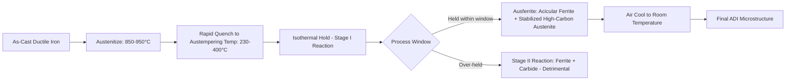

## Austempered Ductile Iron

### Definition and Classification

Austempered Ductile Iron (ADI) is a ductile (nodular/spheroidal graphite) cast iron that has undergone an isothermal heat treatment (austempering) to produce a unique matrix microstructure called **ausferrite**, consisting of acicular ferrite and carbon-stabilized (high-carbon) retained austenite. This microstructure imparts a combination of high strength, good ductility, and excellent wear resistance that is not achievable in conventional as-cast or normalized ductile iron.

ADI is distinguished from standard ductile iron (which typically has a ferritic, pearlitic, or ferritic-pearlitic matrix) purely by heat treatment; the starting base iron composition and graphite morphology (spheroidal nodules) are the same as conventional ductile iron.

### Base Material Requirements

Before austempering, the ductile iron must meet specific metallurgical prerequisites:

- **High nodularity**: Typically greater than 85–90% spheroidal graphite nodules, since irregular or degenerate graphite morphology impairs mechanical properties and hardenability response
- **Controlled alloying**: Additions of nickel, molybdenum, copper, and/or manganese are used to increase hardenability, ensuring the section can be quenched fast enough to avoid pearlite formation before reaching the austempering temperature
- **Low as-cast defect content**: Minimal porosity, dross, and inclusions, since these defects are not eliminated by heat treatment and remain potential fatigue/fracture initiation sites
- **Section size consideration**: Alloying level must be tailored to the section thickness of the casting to ensure the entire cross-section transforms to ausferrite rather than pearlite forming in thick sections during the quench

### The Austempering Process

#### Process Steps

1. **Austenitizing**: The casting is heated to the austenitizing temperature, typically in the range of 850–950°C, and held to achieve a fully austenitic matrix saturated with carbon (the specific temperature and carbon content control subsequent transformation kinetics and final austenite carbon content).
2. **Quenching to the austempering temperature**: The casting is rapidly quenched (typically in a salt bath, though other media are used) to an intermediate isothermal holding temperature, typically 230–400°C, bypassing the pearlite nose of the continuous cooling transformation diagram to avoid pearlite formation.
3. **Isothermal holding (austempering)**: The casting is held at this temperature for a period ranging from approximately 30 minutes to several hours, during which the austenite-to-ausferrite transformation occurs in two stages:
   - **Stage I**: Austenite decomposes into acicular ferrite and high-carbon austenite (carbon rejected from the growing ferrite enriches the surrounding austenite)
   - **Stage II** (to be avoided): If held too long, the high-carbon austenite further decomposes into ferrite and carbide (bainite-like reaction), which is detrimental to ductility and toughness — the practical processing window is the interval between the end of Stage I and the onset of Stage II, sometimes called the "process window"
4. **Final cooling**: The casting is air-cooled to room temperature, retaining the stabilized high-carbon austenite (which resists further transformation because its elevated carbon content depresses the $M_s$ temperature below room temperature).

#### The TTT/Process Window Concept

The austempering process window is bounded by the completion of the Stage I reaction (below which insufficient ausferrite has formed) and the onset of Stage II (above which embrittling carbides form). This window's width and position are functions of alloy composition, austenitizing temperature/time, and austempering temperature, and are typically characterized using isothermal transformation (TTT) diagrams specific to each alloy grade.

[Inference] Because the width of this process window narrows at higher austempering temperatures in many ductile iron compositions, tighter process control (time and temperature uniformity within the salt bath or furnace) is generally required for higher-temperature austempering cycles compared to lower-temperature cycles, though the exact window width is alloy- and composition-dependent and should be verified against the specific grade's TTT data.

### Resultant Microstructure: Ausferrite

The name "ausferrite" (austenite + ferrite) distinguishes this microstructure from bainite, though it is structurally similar (both consist of acicular ferrite laths with carbon-enriched regions between them). The key distinctions:

- In **ausferrite**, the carbon-enriched regions between ferrite laths remain as **stable, high-carbon retained austenite** (not carbide, unlike in bainite where cementite typically forms between ferrite laths)
- The retained austenite in ADI is mechanically stable due to its high carbon content (which can reach approximately 1.8–2.2 wt% locally, compared to the bulk average), meaning it resists transformation to martensite under moderate applied stress — though it can undergo **strain-induced transformation to martensite (TRIP effect)** under sufficiently high local stress, contributing additional toughening and work-hardening capability during service

This transformation-induced plasticity (TRIP) behavior is a significant contributor to ADI's favorable combination of strength and toughness, since stress-induced martensite formation at a crack tip can locally absorb energy and retard crack propagation.

### Mechanical Property Grades

ADI is standardized internationally (e.g., ASTM A897/A897M, ISO 17804) into grades that reflect the trade-off between strength and ductility, controlled primarily by austempering temperature:

| Grade Characteristic | Lower Austempering Temp (~230-280°C) | Higher Austempering Temp (~350-400°C) |
| --- | --- | --- |
| Tensile strength | Higher (typically 1200-1600 MPa) | Lower (typically 850-1050 MPa) |
| Elongation | Lower (2-4%) | Higher (10-15%+) |
| Hardness | Higher (typically 40-50+ HRC range for highest grades) | Lower |
| Fracture toughness | Lower | Higher |
| Wear resistance | Higher | Lower |
| Typical microstructure feature | Finer ausferrite, lower retained austenite fraction | Coarser ausferrite, higher retained austenite fraction |

**Key Points**

- Lower austempering temperatures produce finer ausferritic structure with higher strength and hardness but reduced ductility and toughness — suited to gears, wear components.
- Higher austempering temperatures produce coarser structure with greater ductility and impact toughness at somewhat lower strength — suited to structural and fatigue-critical applications requiring energy absorption.
- ADI grades span a strength range roughly comparable to or exceeding many forged and cast steels while retaining substantially lower density than steel, giving a favorable strength-to-weight ratio.

### Comparison to Conventional Ductile Iron and Cast/Forged Steel

**Advantages of ADI over conventional ductile iron:**

- Approximately 2× the tensile strength for comparable ductility class
- Significantly improved fatigue strength
- Superior wear resistance, particularly in higher-strength grades
- Improved fracture toughness relative to pearlitic ductile iron at comparable strength levels

**Advantages of ADI over steel castings/forgings:**

- Lower density (comparable to conventional cast iron, ~7.1 g/cm³ vs. ~7.85 g/cm³ for steel), giving favorable strength-to-weight ratio
- Excellent castability and near-net-shape production, reducing machining requirements compared to forged steel components
- Good damping capacity (inherited from the graphite nodule morphology, similar to conventional cast iron, though somewhat reduced compared to gray iron due to the spheroidal rather than flake graphite form)
- Lower cost per unit strength in many applications due to reduced machining and material input costs relative to steel forgings

**Limitations:**

- More complex and cost-additive heat treatment process compared to as-cast or simply normalized ductile iron
- Section size sensitivity: very thick sections may not achieve full ausferritic transformation throughout without sufficient alloying, risking pearlite formation in the core
- Machinability is reduced in the as-austempered condition (high hardness), often requiring machining to be performed before heat treatment or using the lower-strength/higher-ductility grades for post-treatment machining operations
- Weldability is limited post-austempering due to the metastable nature of the retained austenite, which can be disrupted by welding thermal cycles

### Applications

ADI's combination of strength, toughness, wear resistance, and lower density than steel has driven adoption in:

- **Automotive**: Gears, crankshafts, suspension components (control arms, steering knuckles), differential housings
- **Off-highway and agricultural equipment**: Sprockets, track components, wear plates subject to abrasive conditions
- **Railway**: Various wear-resistant and structural components
- **Mining and earthmoving**: Ground-engaging tools, wear liners
- **General machinery**: Gears and gear-like components where the combination of wear resistance and fatigue strength is required at lower cost than forged/case-hardened steel alternatives

### Machining and Processing Considerations

Because austempering significantly increases hardness and work-hardening tendency, ADI presents distinct machining challenges compared to conventional ductile iron:

- **Higher cutting forces and tool wear** due to elevated hardness and the strain-induced transformation (TRIP effect) occurring in the workpiece surface during cutting, which can locally harden the machined surface (similar to machining austenitic stainless steels)
- **Preference for machining before austempering** where geometry allows, followed by a controlled final heat treatment, to reduce machining costs and tool wear — though this requires accounting for any dimensional changes during heat treatment
- **Rigid tooling and appropriate cutting parameters** (often carbide or ceramic tooling, controlled feed rates) are recommended to manage the TRIP-induced surface hardening effect during cutting

### Related Cast Iron Family Context

ADI sits within the broader cast iron family as a heat-treated derivative specifically of **ductile (spheroidal graphite) iron**. It should not be confused with:

- **Austempered Gray Iron (AGI)**: A less common analog using flake graphite base iron, generally with lower achievable properties due to the flake graphite morphology's stress concentration effect
- **Compacted Graphite Iron (CGI)**: A distinct graphite morphology (vermicular) with intermediate properties between gray and ductile iron; austempering of CGI is a less mature but researched variant
- **Bainitic ductile iron / Continuous-cool bainitic ductile iron**: Produced via continuous cooling rather than isothermal austempering, generally yielding a bainitic (rather than true ausferritic) matrix with somewhat different property balance and less process control precision than true ADI

**Related Topics**

- TTT and CCT diagrams for ductile iron alloy systems
- Bainite vs. ausferrite microstructural distinctions
- TRIP (transformation-induced plasticity) mechanisms in metastable austenite
- Nodularity and graphite morphology control in ductile iron production (Mg treatment, inoculation)
- Hardenability and alloying strategy for heavy-section ADI castings
- Fatigue and fracture toughness testing of ADI grades (ASTM A897/A897M standard grades)
- Machining strategies for high-hardness cast irons
- Compacted graphite iron (CGI) metallurgy and applications