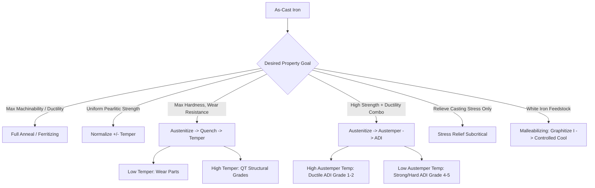

## Heat Treatment of Cast Irons

### Overview

Cast irons—gray, ductile (nodular), white, malleable, and compacted graphite (CGI)—respond to heat treatment through mechanisms distinct from steels because of their high carbon content (typically 2–4 wt%) and the presence of free graphite or massive carbides in the microstructure. Heat treatment of cast irons manipulates the matrix (ferrite, pearlite, martensite, bainite, austenite) surrounding the graphite phase, or transforms the carbide/graphite balance itself, to achieve target combinations of strength, ductility, wear resistance, and machinability. Unlike steel, the graphite phase is largely thermodynamically stable and does not dissolve during normal heat treatment cycles; treatments instead redistribute carbon between the matrix and existing graphite, or between cementite and graphite.

### Metallurgical Basis for Heat Treatment

**Key Points**

- The stable Fe–C system (with graphite) and metastable Fe–Fe₃C system (with cementite) coexist; heat treatment exploits the competition between them.
- The eutectoid transformation in cast irons occurs over a temperature range (roughly 727–900°C depending on silicon content) rather than at a fixed point, because Si raises the eutectoid temperature and widens the two-phase (austenite + graphite) field.
- Silicon content is central: higher Si promotes graphitization (favors the stable system) and raises the eutectoid temperature range; this must be accounted for when selecting austenitizing temperatures.
- During austenitizing, the matrix converts to austenite, dissolving pearlitic cementite and absorbing carbon; graphite nodules/flakes remain largely intact and act as carbon reservoirs.
- On cooling, the austenite decomposes into ferrite, pearlite, bainite, or martensite depending on cooling rate, exactly as in steel, but carbon partitioning is influenced by proximity to graphite (decarburizing the adjacent matrix into ferrite can occur, producing a "bull's-eye" ferrite halo around graphite nodules in slowly cooled ductile iron).

**Example**

A ductile iron casting with a pearlitic-ferritic as-cast matrix, when austenitized at 900°C, dissolves the pearlite into austenite while the graphite nodules remain essentially unchanged in size and shape; the austenite's carbon content is fixed largely by the local Fe–C–Si phase boundary at that temperature.

### Common Heat Treatment Processes

#### Stress Relieving

- **Purpose**: Removes residual stresses from casting/solidification without significantly altering the matrix microstructure.
- **Typical cycle**: Heat to 500–650°C, hold 1–2 hours (rule of thumb: ~1 hour per 25 mm of section thickness), furnace cool slowly (below ~150°C/hour above 300°C) to avoid re-introducing stress.
- **Application**: Machine tool beds, engine blocks, and other precision castings where dimensional stability is critical.
- [Inference] Held below the lower critical temperature to avoid phase transformation; exact upper bound depends on alloy composition and eutectoid range.

#### Full Annealing (Ferritizing Anneal)

- **Purpose**: Produces a fully ferritic matrix for maximum ductility and machinability, and eliminates free/massive carbides in as-cast irons prone to chill.
- **Two common variants**:
  1. **High-temperature (graphitizing) anneal**: Heat to 850–950°C (above upper critical), hold to homogenize austenite and dissolve carbides, then slow cool through the eutectoid range (≈1–3°C/min or furnace cool) to allow proeutectoid and eutectoid graphitization, yielding ferrite + graphite.
  2. **Subcritical (in-situ) anneal**: Heat to 700–760°C (within/just below the eutectoid range), hold to decompose pearlite via graphitization of eutectoid cementite, then air or furnace cool. Faster and cheaper when no massive carbides are present.
- **Application**: Malleable iron production (first stage), ductile iron requiring ASTM Grade 60-40-18 (fully ferritic, high elongation), and gray iron requiring maximum machinability.

#### Normalizing

- **Purpose**: Produces a uniform, fully pearlitic matrix with higher strength and hardness than annealed structures.
- **Typical cycle**: Austenitize at 870–950°C, hold for uniformity, then air cool (fan-assisted for heavier sections).
- **Effect**: Suppresses graphitization during cooling (faster than furnace cooling), locking carbon into pearlitic cementite rather than allowing it to diffuse to graphite.
- **Application**: Ductile iron Grades 80-55-06 and 100-70-03, camshafts, crankshafts requiring pearlitic strength without full hardening.

#### Normalize and Temper

- Following normalizing, a temper at 500–650°C is applied to relieve the stresses introduced by air cooling and to adjust hardness/toughness balance, analogous to steel tempering but with less dramatic softening since pearlite (not martensite) is the starting structure.

#### Quenching and Tempering (Austempering distinguished separately below)

- **Austenitizing**: 845–925°C, hold time selected to fully austenitize and saturate the matrix with carbon (typically 1–2 hours depending on section size and prior structure); higher Si irons need proportionally higher austenitizing temperatures because Si raises A₁.
- **Quenching medium**: Oil is most common for ductile iron (water quenching risks cracking due to the abrupt volume change and graphite/matrix stress concentration at nodules); polymer quenchants are used to control severity.
- **Resulting structure**: As-quenched martensite (plus retained austenite) surrounding graphite nodules; very high hardness (typically 55–65 HRC) but brittle.
- **Tempering**: 150–650°C depending on desired hardness/toughness; low-temperature temper (150–250°C) retains high hardness for wear parts; high-temperature temper (500–650°C, sometimes called "quenched and tempered" or QT grades) balances strength and ductility (e.g., ASTM A536 Grade 120-90-02).
- [Inference] Section-size sensitivity is more pronounced in cast irons than in many alloy steels because graphite nodules act as internal stress risers during the martensitic volume expansion, increasing quench-crack susceptibility in thick or geometrically complex sections.

#### Austempering (Producing Austempered Ductile Iron, ADI)

**Key Points**

- Austempering transforms austenitized ductile iron isothermally in the bainitic range to produce **ausferrite**—a unique mixture of acicular ferrite and high-carbon, carbon-stabilized retained austenite—rather than classical bainite (no carbide precipitation, unlike austempered steel).
- **Process stages**:
  1. Austenitize at 840–950°C (grade-dependent) to homogenize carbon in austenite.
  2. Rapidly quench (typically in a salt bath) to the austempering temperature, avoiding the pearlite nose.
  3. Hold isothermally at 230–400°C for 0.5–4 hours. This "austempering window" allows carbon to partition from forming ferrite into surrounding austenite, stabilizing it against martensite formation on final cooling to room temperature.
  4. Cool to room temperature (air cool); no further transformation occurs if the process window was correctly selected.
- **Property range**: ADI grades (ASTM A897) span from high-ductility, moderate-strength (Grade 1, ~850 MPa UTS, 10% elongation, produced at higher austempering temperatures ~370–400°C, "lower bainite" analog region sometimes termed upper ausferrite) to high-strength, wear-resistant (Grade 5, ~1600 MPa UTS, 1% elongation, produced at lower austempering temperatures ~230–260°C).
- **Mechanism note**: The two-stage reaction is time-critical—understaging leaves untransformed high-carbon austenite that later transforms to brittle martensite; overstaging ("Stage II" reaction) precipitates carbides from the retained austenite, embrittling the structure. Process control window is narrower than for steel austempering.
- ADI offers a strength-to-weight ratio competitive with some steels at lower cost, along with good fatigue resistance and wear resistance, making it common in gears, crankshafts, and suspension components. [Inference: exact competitive advantage vs. specific steel grades is application- and cost-context-dependent.]

**Example**

A gear blank austenitized at 900°C for 90 minutes, salt-bath quenched to 300°C, held 90 minutes, then air-cooled, yields Grade 3 ADI (≈1050 MPa UTS, 7% elongation)—suitable for gear teeth requiring wear resistance and fatigue strength without the distortion risk of through-hardening.

#### Malleabilizing (Malleable Iron Production)

- Starts from **white iron** (fully carbidic, no free graphite as-cast), which is heat treated in two stages to produce temper carbon (irregular graphite rosettes) in a ferritic or pearlitic matrix.
- **First stage (graphitization I)**: Heat to 900–970°C, hold 3–20+ hours to decompose the massive eutectic and proeutectoid cementite into austenite + graphite (temper carbon nucleates and grows).
- **Cooling through eutectoid**:
  - For **ferritic malleable iron**: slow cool (≈3–10°C/hour) through 760–700°C to allow full graphitization of eutectoid cementite.
  - For **pearlitic malleable iron**: cool more rapidly (air cool or accelerated furnace cool) through the eutectoid to retain pearlite, then optionally temper for the desired hardness.
- **Application**: Pipe fittings, hand tool bodies, small automotive brackets—largely superseded by ductile iron in most modern applications but retained where thin-section castability and excellent machinability of malleable iron remain advantageous.
- [Unverified] Total malleabilizing cycles can be quite long (24–60 hours cumulative) depending on section thickness and furnace practice; specific cycle times vary substantially by foundry and are proprietary in many cases.

#### Surface Hardening Treatments

- **Flame hardening / induction hardening**: Rapidly austenitize a surface layer (typically pearlitic or pearlitic-ferritic gray or ductile iron) and quench, producing a martensitic case over a tougher, unaffected core. Requires sufficient combined carbon (pearlite) in the as-cast/pre-treated structure since free ferrite regions may not harden adequately; used on cylinder liners, camshaft lobes, and gear teeth.
- **Nitriding**: Diffusion of nitrogen at 480–590°C (below transformation temperature) forms a hard nitride case (iron nitrides plus alloy nitrides if Cr, Al, Mo present) without requiring subsequent quenching; commonly applied to alloyed gray and ductile iron (e.g., Ni-resist or Cr-Mo ductile iron) cylinder liners for wear and scuff resistance.
- **Carburizing**: Rarely applied to cast irons given their inherently high bulk carbon content; occasionally used on low-carbon white iron or specialty low-C ductile iron for specific case requirements. [Inference] Less common in production practice than nitriding or induction hardening for cast iron components.

#### Destabilization and Subzero Treatment (Chilled/White Iron)

- High-chromium white irons (used for abrasion-resistant liners, mill balls) undergo **destabilization heat treatment**: heating to 900–1050°C to precipitate secondary carbides from the austenite matrix, which reduces the matrix's carbon/chromium content and raises the martensite start temperature (Ms), enabling more complete martensitic transformation on air cooling.
- Subsequent tempering (200–550°C, grade-dependent) relieves quenching stresses; low-temperature tempers preserve maximum hardness (58–64 HRC) for abrasion resistance.
- [Inference] Subzero (cryogenic) treatments are sometimes applied to transform retained austenite to martensite in high-Cr white irons, though the practice is less universally standardized than destabilization/temper cycles themselves.

### Effect of Alloying Elements on Heat Treatment Response

**Key Points**

- **Silicon**: Raises eutectoid temperature and promotes graphitization; higher-Si irons need higher austenitizing temperatures and are more prone to ferrite formation on slow cooling.
- **Manganese**: Stabilizes pearlite/carbides (mild carbide stabilizer), counteracting Si; used to balance matrix in as-cast pearlitic irons.
- **Chromium, Molybdenum, Vanadium**: Strong carbide stabilizers/formers; increase hardenability (useful for through-hardening thick sections and producing ADI in heavy-section ductile iron) but can leave undissolved primary or secondary carbides if austenitizing temperature/time is insufficient.
- **Nickel, Copper**: Mild pearlite stabilizers and hardenability promoters without strong carbide-forming tendency; commonly used in ADI and quenched-and-tempered ductile iron to improve hardenability in thicker sections while keeping the matrix carbide-free.
- **Nickel (high, e.g., Ni-resist irons)**: Austenitic matrix stabilized at room temperature; largely unresponsive to conventional ferrite/pearlite/martensite heat treatments, instead treated for stress relief or specific corrosion/thermal-growth resistance objectives.

### Process Selection Diagram

### Time–Temperature Schematic for Austempering (Ausferrite Formation)

<svg xmlns="http://www.w3.org/2000/svg" viewBox="0 0 700 420" font-family="sans-serif">
<text x="350" y="25" text-anchor="middle" font-size="16" font-weight="bold">Austempering Cycle for Ductile Iron (svg_diagram)</text>
<line x1="70" y1="360" x2="650" y2="360" stroke="black" stroke-width="2" />
<line x1="70" y1="360" x2="70" y2="50" stroke="black" stroke-width="2" />
<text x="360" y="400" text-anchor="middle" font-size="13">Time (log scale)</text>
<text x="25" y="200" text-anchor="middle" font-size="13" transform="rotate(-90,25,200)">Temperature (°C)</text>
<text x="60" y="70" text-anchor="end" font-size="11">900</text>
<text x="60" y="180" text-anchor="end" font-size="11">Ms</text>
<text x="60" y="230" text-anchor="end" font-size="11">300</text>
<text x="60" y="355" text-anchor="end" font-size="11">25</text>
<path d="M 90 70 L 90 70 Q 150 70 200 230" stroke="red" stroke-width="2" fill="none" />
<line x1="200" y1="230" x2="480" y2="230" stroke="red" stroke-width="3" />
<path d="M 480 230 Q 550 230 600 360" stroke="red" stroke-width="2" fill="none" />
<ellipse cx="330" cy="150" rx="150" ry="60" fill="none" stroke="gray" stroke-dasharray="4,3" />
<text x="330" y="145" text-anchor="middle" font-size="11" fill="gray">Pearlite Nose (avoid)</text>
<line x1="70" y1="185" x2="650" y2="185" stroke="blue" stroke-dasharray="6,3" stroke-width="1" />
<text x="620" y="180" font-size="11" fill="blue">Ms</text>
<text x="330" y="215" text-anchor="middle" font-size="12" fill="black">Isothermal hold: Ausferrite forms</text>
<text x="90" y="60" font-size="11">Austenitize</text>
<text x="600" y="380" font-size="11">Air cool</text>
</svg>

### Practical Considerations and Common Defects

**Key Points**

- **Cracking risk**: Ductile iron is more prone to quench cracking than gray iron because nodular graphite provides less internal stress relief than flake graphite; section thickness transitions and sharp corners are especially vulnerable.
- **Distortion**: Thin, complex castings can warp during rapid quenching; press quenching or fixture quenching is used for critical-dimension parts (e.g., large gears).
- **Incomplete graphitization**: Insufficient time/temperature during annealing or malleabilizing leaves residual carbides, reducing machinability and ductility below specification—verified by microstructural examination (ASTM A247 for graphite form, other standards for matrix assessment).
- **Furnace atmosphere control**: Decarburization of a machined surface can occur during austenitizing in oxidizing atmospheres; protective/controlled atmospheres or slight carbon potential adjustment are used for critical wear surfaces.
- [Inference] Because graphite morphology (flake vs. nodular vs. compacted) affects local stress concentration and carbon diffusion paths, heat treatment cycles developed for ductile iron are not directly transferable to gray iron of similar nominal composition without adjustment.

### Standards and Specifications (Representative)

- **ASTM A536**: Ductile (nodular) iron grades, some requiring specified heat-treated conditions (e.g., 120-90-02 quenched and tempered).
- **ASTM A897/A897M**: Austempered ductile iron (ADI) grades 1–5, defining mechanical property ranges achieved via austempering.
- **ASTM A220**: Pearlitic malleable iron.
- **ASTM A47/A197**: Ferritic malleable iron.
- **ASTM A532**: Abrasion-resistant white irons (including high-Cr irons), covering destabilization heat treatment practice.

**Related Topics**

- Austenitizing Kinetics and Carbon Partitioning in Ductile Iron
- Austempered Ductile Iron (ADI): Microstructure–Property Relationships
- Isothermal and Continuous-Cooling Transformation (TTT/CCT) Diagrams for Cast Irons
- Malleable Iron Production Metallurgy
- High-Chromium White Iron: Destabilization and Secondary Carbide Precipitation
- Surface Hardening of Cast Iron Components (Induction, Flame, Nitriding)
- Effect of Alloying Elements on Cast Iron Hardenability
- Graphite Morphology and Its Influence on Mechanical and Thermal Response