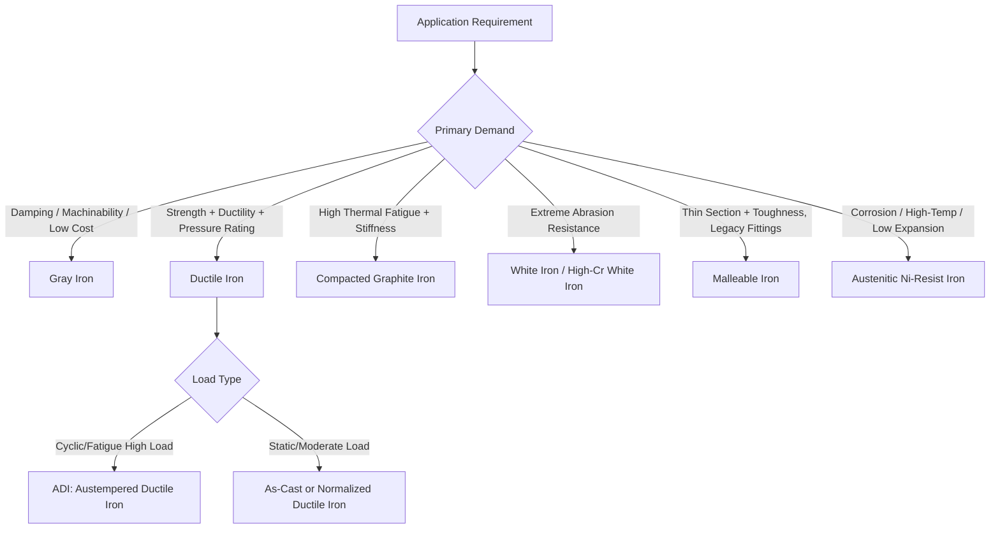

## Applications of Cast Irons

### Overview

Cast irons are selected for applications based on the property combinations arising from their graphite morphology (flake, nodular/spheroidal, compacted, or temper carbon) and matrix structure (ferritic, pearlitic, martensitic, austenitic, or ausferritic). Their advantages—excellent castability into complex shapes, good machinability, high compressive strength, damping capacity, and wear resistance—make them dominant in specific sectors even where steel offers higher tensile strength or ductility. This section surveys applications organized by cast iron type.

### Gray Cast Iron Applications

**Key Points**

- Flake graphite provides excellent vibration damping (converting mechanical energy to heat via friction at graphite-matrix interfaces), good thermal conductivity, self-lubricating machinability, and good compressive strength (typically 3–4× tensile strength), but low tensile ductility due to stress concentration at flake tips.
- Classified by ASTM A48 into classes (e.g., Class 20, 30, 40, 50) by minimum tensile strength in ksi.

**Example**

- **Engine blocks and cylinder heads**: Damping reduces engine noise/vibration; good thermal conductivity aids heat dissipation; graphite flakes assist piston-ring lubrication and wear-in.
- **Machine tool bases and frames**: High damping capacity minimizes chatter and improves surface finish in precision machining; excellent dimensional stability after stress-relief annealing.
- **Brake rotors and drums**: Combination of thermal conductivity, wear resistance, and damping (reduces brake squeal) makes gray iron the standard automotive brake disc material.
- **Pipe and fittings (soil pipe, historically water mains)**: Corrosion resistance (graphite layer forms a protective "graphitic corrosion" residue in some environments) and low cost; largely displaced by ductile iron for pressure piping.
- **Manhole covers, counterweights, decorative castings**: Low cost, easy castability into intricate patterns.

### Ductile (Nodular/Spheroidal Graphite) Iron Applications

**Key Points**

- Spheroidal graphite nodules minimize stress concentration compared to flakes, giving tensile strength and ductility approaching some steels while retaining good castability and moderate damping.
- Graded by ASTM A536 as (tensile strength ksi)-(yield strength ksi)-(% elongation), e.g., 65-45-12, 80-55-06, 100-70-03, 120-90-02.

**Example**

- **Crankshafts (automotive and diesel)**: Ductile iron crankshafts (often pearlitic or as quenched-and-tempered) offer adequate fatigue strength at substantially lower cost than forged steel, especially for passenger car and light truck engines.
- **Gears and gear housings**: Ferritic-pearlitic or fully pearlitic ductile iron used for moderate-duty gears; austempered ductile iron (ADI) used for high-load gears (e.g., differential gears, some transmission components) as a lower-cost alternative to case-hardened steel.
- **Pressure pipe (water and wastewater mains)**: Ductile iron pipe (per AWWA/ISO standards) is the modern standard replacing gray iron pipe due to superior ductility, impact resistance, and ability to withstand water hammer and ground movement.
- **Wind turbine components (main shafts, hubs, gearbox housings)**: Ductile iron (often ferritic, sometimes solution-strengthened with silicon per newer high-silicon ductile iron grades) is widely used for large, thick-section castings due to good castability at scale, adequate fatigue properties, and lower cost than fabricated/forged steel equivalents.
- **Suspension and steering components (control arms, steering knuckles)**: Ductile iron and increasingly ADI are used for automotive suspension parts requiring fatigue resistance and complex geometry achievable only through casting.
- **Valve and pump bodies**: Pressure-containing capability with good machinability for complex internal passages.

### Compacted Graphite Iron (CGI) Applications

**Key Points**

- Graphite morphology (vermicular/wormlike, intermediate between flake and nodular) gives properties between gray and ductile iron: tensile strength and stiffness closer to ductile iron, thermal conductivity and damping closer to gray iron.
- More difficult to produce reliably (narrow processing window for nodularity control) but increasingly used where gray iron's strength is marginal.

**Example**

- **Heavy-duty diesel engine blocks and cylinder heads**: Higher cylinder pressures in modern diesel engines (for fuel efficiency and emissions) exceed gray iron's fatigue limits; CGI's higher strength and stiffness with retained good thermal conductivity and castability make it the preferred material for many heavy-duty and some high-performance passenger diesel/gasoline engine blocks.
- **Exhaust manifolds**: Better thermal fatigue resistance than gray iron under repeated heating/cooling cycles from exhaust gas.
- **Brake discs (specialty/high-performance)**: [Inference] Adopted in some heavy-vehicle and performance applications for improved thermal and fatigue performance versus gray iron, though gray iron remains dominant for cost reasons in most passenger vehicles.

### White Cast Iron Applications

**Key Points**

- Fully carbidic microstructure (little to no free graphite) gives extreme hardness and abrasion resistance but very low ductility and toughness (essentially unmachinable by conventional cutting; ground or cast to near-net shape).
- High-chromium white irons (12–30% Cr) are the dominant commercial subclass, combining chromium carbides (harder and more stable than cementite) with a heat-treatable matrix.

**Example**

- **Ball mill liners and grinding balls (mineral processing, cement)**: Extreme two-body and three-body abrasion resistance in ore crushing/grinding circuits.
- **Slurry pump components (impellers, casings)**: Abrasive slurry wear resistance in mining and dredging.
- **Shot blasting wheel components, chute liners, dredge pump parts**: General high-abrasion wear parts.
- **Chilled iron rolls (as-cast surface chill on gray/ductile iron base)**: Combines a hard, wear-resistant white iron working surface with a tougher gray/ductile iron or steel core for rolling mill rolls.

### Malleable Iron Applications

**Key Points**

- Produced by heat-treating white iron castings to develop temper carbon graphite in a ferritic or pearlitic matrix, giving good ductility and machinability in thin-to-moderate sections.
- Largely displaced by ductile iron since the mid-20th century (ductile iron avoids the long malleabilizing heat treatment) but retained for specific thin-section, high-volume, or historically-tooled applications.

**Example**

- **Pipe fittings and hardware (elbows, tees, unions)**: Thin-wall castability and good machinability for threading.
- **Automotive brackets, universal joint yokes (older/legacy designs)**: [Inference] Historical dominance in this niche has substantially declined in favor of ductile iron or forged steel in newer designs, though malleable iron remains specified in some legacy and replacement-part contexts.
- **Hand tool components (wrench bodies, small brackets)**: Good toughness and impact resistance for thin sections.

### Austenitic (Ni-Resist Type) Cast Iron Applications

**Key Points**

- High nickel content (up to ~35%) stabilizes an austenitic matrix at room temperature, giving good corrosion resistance, high-temperature strength/scaling resistance, low thermal expansion (in high-Ni grades), and non-magnetic behavior.
- Standardized as ASTM A436 (flake graphite, "Ni-Resist") and ASTM A439 (nodular graphite, "Ductile Ni-Resist").

**Example**

- **Turbocharger housings and exhaust components**: High-temperature strength and thermal fatigue/scaling resistance under exhaust gas conditions.
- **Pump and valve components in corrosive service (seawater, chemical processing)**: Corrosion resistance superior to conventional gray/ductile iron.
- **Compressor and cryogenic equipment components**: Low thermal expansion coefficient grades used where dimensional stability across temperature swings matters.

### Selection Framework: Matching Cast Iron Type to Application Demand

### Comparative Application Suitability

| Cast Iron Type | Typical Tensile Strength Range | Key Strength | Representative Applications |
| --- | --- | --- | --- |
| Gray Iron | 150–400 MPa | Damping, machinability | Engine blocks, brake rotors, machine bases |
| Ductile Iron | 400–1000+ MPa (ADI higher) | Strength–ductility balance | Crankshafts, pipe, gears, suspension parts |
| Compacted Graphite Iron | 300–450 MPa | Thermal fatigue + stiffness | Diesel engine blocks, exhaust manifolds |
| White Iron | Low tensile, very high hardness | Abrasion resistance | Mill liners, grinding balls, slurry pumps |
| Malleable Iron | 350–700 MPa | Thin-section toughness | Pipe fittings, small brackets |
| Austenitic (Ni-Resist) | 170–450 MPa | Corrosion/heat resistance | Turbocharger housings, pumps in corrosive service |

**Note**: Property ranges are representative and grade/section-dependent; specific design values should be taken from the relevant ASTM/ISO specification for the exact grade and section size involved. [Unverified] Exact numerical boundaries vary by standard revision and are not universal across all national standards (e.g., ISO 1083, EN 1563 for ductile iron may define slightly different grade boundaries than ASTM A536).

### Emerging and Cross-Cutting Application Trends

**Key Points**

- **Weight reduction competition with aluminum**: In automotive applications, cast iron components (blocks, brackets) face ongoing substitution pressure from aluminum alloys where weight savings outweigh cast iron's cost and damping advantages; thin-wall ductile iron and CGI are partly a response to remain competitive on a strength-to-weight basis.
- **ADI growth in structural/wear applications**: Continued adoption of austempered ductile iron in gears, agricultural equipment, and mining components as a cost-effective alternative to forged and case-hardened steel.
- **High-silicon ductile iron (solution-strengthened ferritic grades, e.g., per ASTM A897 companion grades or EN 1563 SiMo/high-Si grades)**: Growing use in wind turbine and heavy-section castings where improved ductility-at-strength and reduced heat treatment requirements are valued. [Inference] Adoption trends are foundry- and region-dependent and continue to evolve with wind energy market growth.

**Related Topics**

- Gray Iron Microstructure and Graphite Flake Classification (ASTM A247)
- Ductile Iron Production: Nodularization and Inoculation Practice
- Austempered Ductile Iron (ADI) Design Properties
- Compacted Graphite Iron Production Control and Process Window
- High-Chromium White Iron Metallurgy and Wear Mechanisms
- Ni-Resist Austenitic Cast Irons: Composition and Corrosion Behavior
- Cast Iron vs. Cast/Forged Steel: Material Selection Criteria
- Thin-Wall Casting Technology for Weight-Competitive Ductile Iron