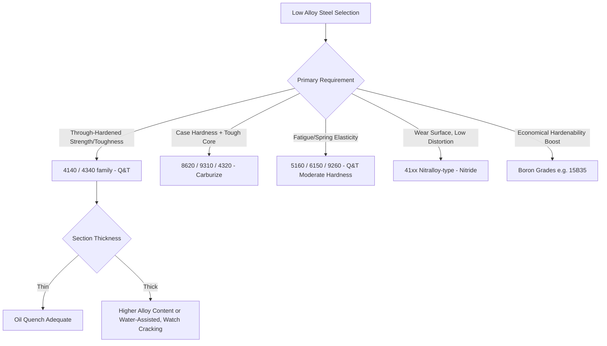

## Low Alloy Steels

### Overview

Low alloy steels are iron-carbon alloys containing modest additions of alloying elements (typically total alloy content below ~5–8 wt%, excluding carbon) beyond the manganese, silicon, sulfur, and phosphorus levels found in plain carbon steel. These additions—chromium, nickel, molybdenum, vanadium, boron, and others—are used to improve hardenability, strength, toughness, wear resistance, and elevated-temperature performance beyond what plain carbon steel can achieve, without pushing the alloy into the high-alloy/stainless regime. Low alloy steels form the backbone of structural, automotive, and pressure-vessel engineering where properties exceeding plain carbon steel are required at moderate cost.

### Classification and Designation

**Key Points**

- **SAE/AISI 4-digit system**: First two digits indicate the principal alloying series (e.g., 41xx = Cr-Mo, 43xx = Ni-Cr-Mo, 86xx = Ni-Cr-Mo low alloy); last two (or three) digits indicate nominal carbon content in hundredths of a percent (e.g., 4140 = Cr-Mo steel with 0.40% C).
- **Major series**:
  - 13xx: Manganese steels
  - 40xx: Molybdenum steels
  - 41xx: Chromium-molybdenum steels
  - 43xx: Nickel-chromium-molybdenum steels
  - 46xx/48xx: Nickel-molybdenum steels
  - 51xx: Chromium steels
  - 61xx: Chromium-vanadium steels
  - 86xx/87xx: Nickel-chromium-molybdenum (lower alloy content than 43xx)
  - 92xx: Silicon-manganese (spring steels)
- **HSLA (High-Strength Low-Alloy) steels**: A related but distinct subclass emphasizing microalloying (Nb, V, Ti in small fractions, <0.1% each) combined with controlled rolling to achieve strength through grain refinement and precipitation strengthening rather than through hardenability/heat treatment; typically classified separately from the quenched-and-tempered 4xxx/5xxx/86xx families discussed here.

**Example**

AISI 4140 (0.40% C, ~1% Cr, ~0.2% Mo) is one of the most widely used low alloy steels, valued for its balance of strength, toughness, and hardenability in the normalized, or quenched-and-tempered condition.

### Role of Alloying Elements

**Key Points**

- **Chromium**: Increases hardenability, wear resistance, and moderately increases corrosion/oxidation resistance at low levels; forms carbides that contribute to wear resistance and temper resistance.
- **Molybdenum**: Strongly increases hardenability (especially in thick sections), suppresses temper embrittlement, contributes to elevated-temperature creep strength, and refines grain size, limiting grain growth during austenitizing.
- **Nickel**: Increases toughness (particularly low-temperature/impact toughness) and hardenability without strong carbide formation; commonly paired with Cr and Mo for case-hardening and high-toughness structural grades.
- **Vanadium**: Strong carbide former; refines grain size, increases hardenability in small amounts, and provides secondary hardening during tempering (retards softening at elevated tempering temperatures).
- **Manganese**: Increases hardenability economically; also acts to tie up sulfur as MnS, mitigating hot shortness.
- **Boron** (added in trace amounts, ~0.0005–0.003%): Dramatically increases hardenability at very low cost when steel is fully deoxidized (aluminum- or titanium-killed) to protect boron from combining with nitrogen; used in boron-treated grades (e.g., 15B35, 94B30) as an economical hardenability booster.
- **Silicon**: Primarily a deoxidizer at typical levels; at higher levels (spring steel, 92xx series) increases yield strength and elastic limit.

### Hardenability and the Jominy End-Quench Concept

**Key Points**

- Hardenability—the depth and distribution of hardness achievable on quenching—is the central engineering property distinguishing low alloy steels from plain carbon steels of similar carbon content; alloy additions shift the TTC (time-temperature-transformation) curve to longer times, allowing slower cooling rates to still produce martensite.
- The Jominy end-quench test standardizes hardenability measurement: a heated bar is quenched from one end, and hardness is measured at intervals along the length; low alloy steels show a flatter hardness-vs-distance curve (more uniform through-thickness hardness) compared to plain carbon steel of equivalent surface hardness.
- Hardenability bands (H-steels, e.g., 4140H) specify a hardenability range rather than a fixed composition, accounting for minor compositional variation between heats while guaranteeing a Jominy response window.

**Example**

A thick section (e.g., 75 mm diameter shaft) in plain carbon 1040 steel will show a soft, pearlitic core after oil quenching because the cooling rate at the center falls below the critical cooling rate for martensite; the same section in 4140 steel achieves substantially higher core hardness because Cr and Mo additions push the pearlite/bainite noses to longer times, allowing martensite (or bainite) formation even at the slower cooling rate experienced at the center.

### Time–Temperature Transformation Comparison (Schematic)

<svg xmlns="http://www.w3.org/2000/svg" viewBox="0 0 700 420" font-family="sans-serif">
<text x="350" y="25" text-anchor="middle" font-size="16" font-weight="bold">TTC Curve Shift: Plain Carbon vs Low Alloy Steel (svg_diagram)</text>
<line x1="70" y1="360" x2="650" y2="360" stroke="black" stroke-width="2" />
<line x1="70" y1="360" x2="70" y2="50" stroke="black" stroke-width="2" />
<text x="360" y="400" text-anchor="middle" font-size="13">Time (log scale)</text>
<text x="25" y="200" text-anchor="middle" font-size="13" transform="rotate(-90,25,200)">Temperature</text>
<path d="M 90 70 Q 150 150 180 220 Q 220 260 300 260 Q 380 260 420 220 Q 460 150 500 70" fill="none" stroke="black" stroke-width="2" />
<text x="185" y="215" font-size="11" text-anchor="middle">Plain C</text>
<path d="M 90 70 Q 250 180 320 280 Q 380 340 480 340 Q 560 340 600 280 Q 630 220 640 70" fill="none" stroke="red" stroke-width="2" />
<text x="330" y="295" font-size="11" fill="red" text-anchor="middle">Low Alloy</text>
<line x1="150" y1="360" x2="150" y2="70" stroke="blue" stroke-dasharray="5,4" />
<text x="150" y="380" font-size="10" text-anchor="middle" fill="blue">Oil quench rate</text>
<text x="90" y="60" font-size="11">Austenitize</text>
</svg>

### Standard Heat Treatments

**Key Points**

- **Annealing/Normalizing**: Refines as-rolled/forged grain structure and relieves residual stress prior to machining or further heat treatment; low alloy steels are typically normalized at 850–900°C (grade-dependent) followed by air cooling.
- **Quenching and Tempering (Q&T)**: The dominant strengthening treatment—austenitize (typically 830–870°C), quench in oil (or water for less-hardenable grades, though this risks distortion/cracking in alloy steels which are usually oil- or air-hardenable by design), then temper at 200–650°C to achieve the target strength-toughness balance.
- **Case Hardening (carburizing, carbonitriding)**: Applied to low-carbon low alloy grades (e.g., 4320, 8620, 4820) to produce a hard, wear-resistant case over a tough core; the Ni-Cr-Mo composition of these grades is specifically selected for good core toughness after case hardening.
- **Nitriding**: Applied to grades containing strong nitride formers (Cr, Al, Mo—e.g., Nitralloy-type steels, 41xx series) to produce an extremely hard, wear- and fatigue-resistant surface without quenching, minimizing distortion.
- **Austempering**: Applied to thinner sections of appropriately hardenable low alloy grades to produce bainitic structures with good toughness-strength combinations and reduced distortion/cracking risk relative to martensitic quench-and-temper.

### Tempering Behavior and Temper Embrittlement

**Key Points**

- As-quenched martensite is tempered to relieve internal stress and adjust hardness/toughness; low alloy steels generally show a smoother, more gradual hardness decrease with tempering temperature compared to plain carbon steel due to alloy carbide formation delaying softening (secondary hardening effects are pronounced in Mo- and V-bearing grades at 500–550°C).
- **Temper embrittlement** (reversible, associated with impurity segregation—P, Sb, Sn, As—to prior austenite grain boundaries during slow cooling through or isothermal holding in the 375–575°C range) is a known concern in Ni-Cr steels; molybdenum additions (~0.2–0.5%) are specifically used to suppress this embrittlement, which is why many Ni-Cr low alloy grades (e.g., 4340 vs. older 3140-type Ni-Cr steels) include Mo.
- [Inference] The practical significance of temper embrittlement is most pronounced in heavy sections (e.g., large pressure vessel forgings) that cool slowly through the critical range; thin sections air- or oil-cooled quickly through this range are less susceptible, though grade selection still commonly includes Mo as a precaution.

### Representative Grades and Applications

| Grade | Principal Alloys | Key Application |
| --- | --- | --- |
| 4130 | Cr-Mo | Aircraft tubing, welded structures (weldable, moderate strength) |
| 4140 | Cr-Mo | Shafts, gears, high-strength fasteners, oilfield tooling |
| 4340 | Ni-Cr-Mo | Aircraft landing gear, high-strength structural forgings |
| 8620 | Ni-Cr-Mo (low alloy content) | Carburized gears, camshafts (case-hardening grade) |
| 9310 | Ni-Cr-Mo | Aerospace gears (high core toughness after carburizing) |
| 5160 | Cr | Leaf springs, coil springs |
| 6150 | Cr-V | Springs, hand tools requiring toughness + wear resistance |
| 4820 | Ni-Mo | Carburized gears requiring high core toughness |

**Example**

A truck leaf spring manufactured from 5160 steel is austenitized, oil quenched, and tempered to a moderate hardness (typically 45–50 HRC) to provide the fatigue resistance and elastic energy storage required for repeated flexing, leveraging chromium's hardenability at a lower cost than more heavily alloyed grades.

### Weldability Considerations

**Key Points**

- Increasing carbon and alloy content (higher hardenability) raises the risk of heat-affected zone (HAZ) cracking (cold cracking/hydrogen-induced cracking) during welding, because the HAZ can transform to hard, brittle martensite on cooling.
- **Carbon equivalent (CE) formulas** (e.g., CE = C + Mn/6 + (Cr+Mo+V)/5 + (Ni+Cu)/15) are used to estimate weldability and the need for preheat/post-weld heat treatment; low alloy steels generally show higher CE than plain carbon steels of similar carbon content, requiring more attention to preheat, interpass temperature control, low-hydrogen electrodes, and sometimes post-weld heat treatment (stress relief or temper) to avoid cracking.
- Lower-carbon, leaner-alloy grades (e.g., 4130 at 0.30% C) are considered more weldable than higher-carbon, more heavily alloyed grades (e.g., 4340 at 0.40% C with higher total alloy content).
- [Inference] Specific preheat and interpass temperature requirements are grade-, thickness-, and hydrogen-control-procedure-dependent; values should be taken from the applicable welding procedure specification (WPS) and code (e.g., AWS D1.1) rather than treated as universal constants.

### Process Selection Overview

### Comparison with Plain Carbon and High-Alloy Steels

**Key Points**

- **Vs. plain carbon steel**: Low alloy steels achieve comparable or higher strength at lower carbon content (improving toughness and weldability for a given strength level) and provide much deeper hardenability, enabling uniform properties in thicker sections.
- **Vs. high-alloy/stainless/tool steels**: Low alloy steels are not designed for significant corrosion resistance (no substantial Cr for passive film formation, typically <2% Cr) or extreme wear/red-hardness (unlike tool steels with high Cr/W/Mo/V content); they occupy the cost-performance middle ground for structural and mechanical component applications.

**Related Topics**

- Jominy End-Quench Hardenability Testing
- Carburizing and Case Hardening Metallurgy
- Temper Embrittlement Mechanisms and Mitigation
- High-Strength Low-Alloy (HSLA) Steels and Microalloying
- Quenched and Tempered Steel Microstructure Development
- Carbon Equivalent and Weldability of Alloy Steels
- Nitriding Steels (Nitralloy Compositions)
- Boron Treatment for Hardenability Enhancement