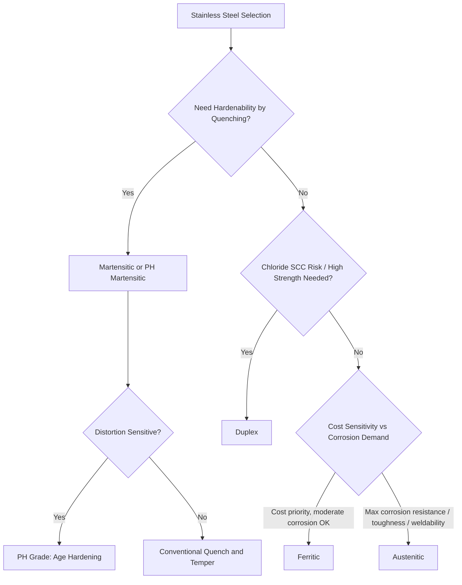

## Stainless Steels: Austenitic, Ferritic, Martensitic, and Duplex

### Overview

Stainless steels are iron-based alloys containing a minimum of approximately 10.5–11% chromium, which forms a thin, adherent, self-healing passive chromium oxide (Cr₂O₃) film responsible for corrosion resistance. Beyond this common thread, the four major families—austenitic, ferritic, martensitic, and duplex—differ fundamentally in crystal structure, alloying strategy, achievable properties, and heat treatment response, making family selection as important as grade selection within a family.

### Metallurgical Basis: Ferrite and Austenite Stabilizers

**Key Points**

- Alloying elements are classified as **ferrite stabilizers** (expand the BCC ferrite phase field, effectively closing or shrinking the austenite loop): Cr, Mo, Si, Nb, Ti, Al.
- Or as **austenite stabilizers** (expand the FCC austenite phase field, allowing austenite to be retained to room temperature): Ni, Mn, C, N, Cu.
- The balance between these stabilizers, often visualized on **Schaeffler or WRC (Welding Research Council) diagrams** using chromium equivalent (Creq) and nickel equivalent (Nieq) axes, determines the resulting phase constitution and underlies the four-family classification.
- Composition also governs weld metal microstructure prediction (critical for avoiding hot cracking and controlling ferrite content in austenitic weld deposits).

### Austenitic Stainless Steels

**Key Points**

- FCC crystal structure stabilized at room temperature by sufficient Ni (typically 8%+) combined with 16–26% Cr; the largest and most widely used stainless family (300 series, e.g., 304, 316, 321, plus 200 series Mn-substituted grades).
- **Non-hardenable by heat treatment** (no martensitic transformation possible in standard grades); strengthened only by cold work (strain hardening/work hardening, which is pronounced due to TRIP/TWIP-like deformation mechanisms in some grades) or, for precipitation-hardenable variants, aging.
- Excellent corrosion resistance, excellent toughness (including at cryogenic temperatures, since FCC structure has no ductile-to-brittle transition), good weldability, non-magnetic in the annealed condition (though can develop slight magnetism from cold-work-induced martensite in some grades, notably 304).
- **Solution annealing**: Heat to 1010–1120°C (grade-dependent) followed by rapid cooling (water quench or forced air for thin sections) to dissolve any precipitated carbides and restore maximum corrosion resistance and ductility; this is the only standard "heat treatment" for non-hardenable austenitic grades.
- **Sensitization**: Slow cooling or prolonged exposure in the 425–870°C range precipitates chromium carbides (Cr₂₃C₆) at grain boundaries, locally depleting adjacent chromium below the passivation threshold and causing susceptibility to intergranular corrosion; mitigated by low-carbon "L" grades (e.g., 304L, 316L, <0.03% C) or stabilized grades (321 with Ti, 347 with Nb) that tie up carbon as stable carbides instead of chromium carbides.
- **Key grades**: 304 (general purpose, 18Cr-8Ni), 316 (2–3% Mo added for improved pitting/crevice corrosion resistance in chloride environments), 321/347 (Ti/Nb stabilized for elevated-temperature and post-weld service), 310 (high Cr-Ni for high-temperature oxidation resistance).

**Example**

A 316L stainless steel vessel used in chloride-containing chemical processing is specified in the low-carbon grade specifically to allow field welding without post-weld solution annealing, since the low carbon content suppresses sensitization-related intergranular corrosion in the heat-affected zone.

### Ferritic Stainless Steels

**Key Points**

- BCC crystal structure stable from room temperature to melting (no austenite-to-ferrite transformation on cooling in most grades), typically 10.5–30% Cr with low carbon and generally little to no nickel (400 series ferritic, e.g., 409, 430, 439, 444).
- **Non-hardenable by heat treatment** (no martensite formation, similar to austenitic grades in this respect), strengthened only by cold work, though cold work capacity/ductility is more limited than austenitic grades due to BCC structure.
- Magnetic (ferromagnetic) in all conditions; moderate corrosion resistance (generally less than austenitic grades of similar Cr content due to absence of Ni benefits and generally lower Mo); good resistance to chloride stress corrosion cracking (a specific advantage over austenitic grades, which are quite susceptible).
- Lower cost than austenitic grades (no or minimal Ni), making ferritics attractive for cost-sensitive applications where the corrosion demand does not require austenitic performance.
- **475°C embrittlement**: Long-term exposure in the 400–540°C range causes a hard, brittle alpha-prime (α′) phase to precipitate via spinodal decomposition, embrittling the steel; mitigated by limiting service temperature or by rapid cooling through this range after high-temperature exposure.
- **Sigma phase embrittlement**: High-Cr ferritic (and duplex) grades exposed to 550–900°C for extended periods can form brittle intermetallic sigma phase, requiring solution treatment to redissolve.
- **Grain growth and HAZ toughness**: Ferritic grades lack the grain-refining austenite-ferrite transformation available to carbon/low-alloy steels, so weld HAZ grain growth can significantly reduce toughness; welding procedures (heat input control, sometimes post-weld annealing) address this.
- **Key grades**: 430 (general purpose, decorative/appliance trim), 409 (automotive exhaust systems, lower Cr, cost-optimized), 444 (Mo-added, improved pitting resistance, used in hot water heaters), 446 (high-Cr, high-temperature oxidation resistance).

### Martensitic Stainless Steels

**Key Points**

- BCC/BCT crystal structure; the only stainless family capable of conventional quench-hardening to martensite, since these grades contain sufficient carbon (typically 0.1–1.2%) combined with moderate Cr (typically 11.5–18%) balanced to permit full austenitization and martensitic transformation on quenching.
- Heat treatment follows the same austenitize-quench-temper sequence as alloy steel: austenitize at 950–1050°C (higher than plain carbon/low alloy steel due to Cr's effect on the Fe-C-Cr phase diagram), quench (oil or air, depending on hardenability and section size—many are air-hardenable due to Cr's strong hardenability contribution), temper at 150–750°C depending on target hardness/toughness balance.
- **Tempering caution**: A temper embrittlement range (~400–550°C, "500°C embrittlement" or secondary hardening interaction with chromium carbide precipitation) is generally avoided in critical applications; tempering is typically done either below ~200°C (max hardness, wear applications) or above ~600°C (improved toughness, moderate hardness).
- Corrosion resistance is generally the lowest of the four families (moderate Cr, no Ni, carbon ties up chromium as carbides reducing free Cr available for passivation), adequate for mild atmospheric/moisture exposure but not aggressive chemical environments.
- Magnetic in all conditions.
- **Key grades**: 410 (general purpose martensitic, cutlery/fasteners/pump shafts), 420 (higher carbon, cutlery/surgical instruments, higher hardness), 440A/B/C (high carbon, highest hardness/wear resistance among stainless grades, used for knife blades and bearings), 17-4PH (precipitation-hardening martensitic, discussed below).

**Example**

A 440C stainless steel ball bearing race is austenitized around 1010°C, oil quenched, and tempered at approximately 150–175°C to achieve high hardness (58–60 HRC) for rolling contact fatigue resistance while retaining adequate corrosion resistance for the service environment.

### Precipitation-Hardening (PH) Stainless Steels

**Key Points**

- A specialized cross-cutting category (martensitic, semi-austenitic, or austenitic base) strengthened by aging to precipitate fine intermetallic phases (e.g., Cu-rich clusters, Ni₃Al, Ni₃Ti) rather than (or in addition to) martensitic transformation.
- **17-4PH** (martensitic base): Solution treated at ~1040°C, air cooled to martensite (condition A), then aged at 480–620°C (H900 through H1150 conditions) to precipitate Cu-rich phases, achieving high strength with good corrosion resistance and only moderate distortion (age-hardening produces minimal dimensional change compared to quench hardening).
- **17-7PH** (semi-austenitic): Requires a conditioning treatment (subzero cooling or specific thermal treatment, "Condition A" to "Condition CH900," etc.) to trigger the austenite-to-martensite transformation before aging, since the as-solution-annealed structure is austenitic and must be destabilized.
- Widely used in aerospace fasteners, springs, and structural components requiring high strength-to-weight ratio combined with corrosion resistance and dimensionally stable heat treatment.

### Duplex Stainless Steels

**Key Points**

- Biphasic microstructure of roughly equal parts ferrite and austenite (typically 40–60% ferrite), achieved by balancing ferrite stabilizers (Cr, Mo) against austenite stabilizers (Ni, N) in compositions with higher Cr (typically 21–28%) than standard austenitic grades.
- Combines advantages of both constituent phases: strength roughly double that of standard austenitic grades (yield strength often 2×+ that of 304/316), good toughness (though generally less than fully austenitic grades, particularly at low temperature), excellent resistance to chloride stress corrosion cracking (a specific weakness of austenitic grades that duplex grades largely overcome due to the ferrite phase), and good resistance to pitting/crevice corrosion (often quantified by PREN, Pitting Resistance Equivalent Number = %Cr + 3.3×%Mo + 16×%N).
- **Solution annealing**: Heat to 1020–1100°C (grade-dependent) followed by rapid water quench to redissolve any intermetallic phases and restore the balanced ferrite-austenite ratio; slow cooling risks intermetallic (sigma, chi) phase precipitation.
- **Intermetallic phase precipitation (sigma, chi phases)**: A critical processing concern—duplex grades are highly susceptible to embrittling sigma phase formation in the 650–1000°C range (faster kinetics than in ferritic stainless due to higher Cr and Mo content), requiring careful control of cooling rates through this range during both mill processing and welding.
- **Subcategories by alloy content**:
  - **Lean duplex** (e.g., 2101, 2304): Lower Mo/Ni, cost-optimized, moderate corrosion resistance.
  - **Standard duplex** (e.g., 2205, the most widely used grade): PREN ~35, general chemical/oil & gas service.
  - **Super duplex** (e.g., 2507): Higher Cr/Mo/N, PREN >40, aggressive offshore/chemical environments.
  - **Hyper duplex**: PREN >45, most demanding service (deep sour gas, seawater at high temperature).
- **Welding considerations**: Weld heat input and cooling rate must be controlled to maintain proper ferrite-austenite balance in the HAZ and weld metal (excessive ferrite formation on rapid cooling reduces toughness/corrosion resistance; nitrogen additions in filler metal help restore austenite content).

**Example**

2205 duplex stainless steel is widely specified for offshore platform piping and pressure vessels handling seawater and sour (H₂S-containing) service, where its combination of high strength (allowing thinner wall sections than 316L) and superior chloride stress corrosion cracking resistance provides both a performance and weight/cost advantage over standard austenitic grades.

### Comparative Property Summary

| Property | Austenitic | Ferritic | Martensitic | Duplex |
| --- | --- | --- | --- | --- |
| Crystal Structure | FCC | BCC | BCT (martensite) | Mixed FCC+BCC |
| Heat Treatment Hardenable | No (cold work only) | No (cold work only) | Yes (quench & temper) | No (solution anneal only) |
| Magnetic | No (mostly) | Yes | Yes | Yes (partially, ferrite phase) |
| Relative Corrosion Resistance | High | Moderate | Low–Moderate | High |
| Relative Strength (annealed) | Moderate | Moderate | High (hardened) | High |
| Weldability | Good | Fair (HAZ grain growth) | Fair (preheat/PWHT often needed) | Good (with heat input control) |
| Toughness (incl. low temp) | Excellent | Fair–Poor at low temp | Fair (temper-dependent) | Good (less than austenitic at cryo) |
| Cost Driver | Ni content | Low (minimal Ni) | Low–Moderate | Moderate (Ni + Mo + N) |

### Schaeffler-Type Phase Selection Schematic

<svg xmlns="http://www.w3.org/2000/svg" viewBox="0 0 700 450" font-family="sans-serif">
<text x="350" y="25" text-anchor="middle" font-size="16" font-weight="bold">Schaeffler Diagram Concept: Family Location (svg_diagram)</text>
<line x1="80" y1="400" x2="650" y2="400" stroke="black" stroke-width="2" />
<line x1="80" y1="400" x2="80" y2="50" stroke="black" stroke-width="2" />
<text x="360" y="425" text-anchor="middle" font-size="13">Chromium Equivalent (Cr + Mo + 1.5Si + 0.5Nb)</text>
<text x="30" y="220" text-anchor="middle" font-size="13" transform="rotate(-90,30,220)">Nickel Equivalent (Ni + 30C + 0.5Mn)</text>
<ellipse cx="180" cy="150" rx="70" ry="90" fill="none" stroke="blue" stroke-width="2" />
<text x="180" y="150" text-anchor="middle" font-size="12" fill="blue">Austenitic</text>
<ellipse cx="480" cy="340" rx="110" ry="45" fill="none" stroke="green" stroke-width="2" />
<text x="480" y="345" text-anchor="middle" font-size="12" fill="green">Ferritic</text>
<ellipse cx="280" cy="290" rx="80" ry="60" fill="none" stroke="red" stroke-width="2" />
<text x="280" y="295" text-anchor="middle" font-size="12" fill="red">Martensitic</text>
<ellipse cx="340" cy="220" rx="60" ry="50" fill="none" stroke="purple" stroke-width="2" />
<text x="340" y="225" text-anchor="middle" font-size="12" fill="purple">Duplex</text>
</svg>

### Family Selection Framework

### General Corrosion and Metallurgical Failure Considerations

**Key Points**

- **Pitting and crevice corrosion**: Localized breakdown of the passive film in chloride-containing environments; resistance improves with Cr, Mo, and N content (captured by PREN), most relevant to austenitic and duplex grades in marine/chemical service.
- **Chloride stress corrosion cracking (Cl-SCC)**: A specific vulnerability of austenitic grades (particularly standard 304/316 at elevated temperature, e.g., >60°C, in chloride environments) due to FCC structure's susceptibility; ferritic and duplex grades are markedly more resistant due to the ferrite phase.
- **Intergranular corrosion**: Primarily a sensitization phenomenon in austenitic (and to a lesser extent ferritic) grades from chromium carbide precipitation, mitigated by low-carbon or stabilized grades as discussed above.
- [Inference] Actual field performance in any given environment depends on specific chemistry, temperature, flow conditions, and the presence of other species (e.g., H₂S, fluorides), so grade selection for critical service should reference application-specific corrosion data or testing rather than general family characteristics alone.

**Related Topics**

- Schaeffler and WRC-1992 Diagrams for Weld Metal Prediction
- Sensitization and Intergranular Corrosion in Austenitic Stainless Steels
- Sigma Phase and Intermetallic Embrittlement in Duplex/Ferritic Grades
- Precipitation Hardening Mechanisms in 17-4PH and 17-7PH Steels
- Pitting Resistance Equivalent Number (PREN) and Chloride Environment Design
- Welding Metallurgy of Duplex Stainless Steels
- 475°C Embrittlement in Ferritic Stainless Steels
- Cryogenic Toughness Behavior of Austenitic Stainless Steels