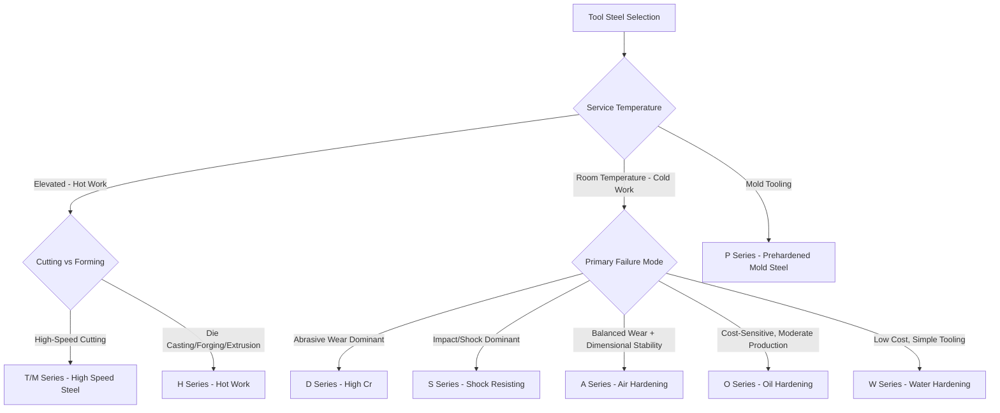

## Tool and Die Steels

### Overview

Tool and die steels are a family of high-carbon, often highly alloyed steels engineered to withstand the demanding combination of hardness, wear resistance, toughness, and (in many applications) elevated-temperature strength required for shaping, cutting, or forming other materials. Selection among tool steel families involves balancing hardness/wear resistance against toughness, and matching hot/cold working demands, heat treatment complexity, and dimensional stability requirements to the specific tooling application. The AISI classification system groups tool steels by primary characteristic and quenching medium rather than by a simple compositional series.

### AISI Classification System

**Key Points**

- **W (Water-hardening)**: Plain high-carbon tool steels, minimal alloy addition, shallow hardenability, requiring water quenching.
- **O (Oil-hardening)**: Moderate alloy content for deeper hardenability than W-types, oil quenched, general-purpose cold work tooling.
- **A (Air-hardening, medium alloy cold work)**: Higher Cr/Mo content enabling air hardening, reducing distortion versus oil/water hardening.
- **D (High-carbon, high-chromium cold work)**: Very high Cr (~12%) for maximum wear resistance and deep hardenability via air or light oil quench.
- **S (Shock-resisting)**: Lower carbon, silicon/molybdenum alloyed for high toughness/impact resistance at moderate hardness.
- **H (Hot-work)**: Chromium-, tungsten-, or molybdenum-based subgroups (H10–H19 Cr-based, H20–H39 W-based, H40s Mo-based) for elevated-temperature strength retention.
- **T (Tungsten high-speed steel)** and **M (Molybdenum high-speed steel)**: High alloy content for red hardness (hot hardness) and wear resistance in high-speed cutting applications.
- **P (Mold steels)**: Lower carbon, moderate alloy, for plastic injection/compression molds.
- **L (Low-alloy special-purpose)** and **F (Carbon-tungsten)**: Specialty grades for specific wear/toughness combinations.

### Water-Hardening (W) Tool Steels

**Key Points**

- Essentially high-carbon plain carbon steel (0.6–1.4% C) with minimal alloy addition (sometimes trace Cr or V for grain refinement); shallow hardenability requires water quenching, producing a hard case with a tougher, lower-carbon-response core (a natural "differential hardening" effect useful for some applications).
- Lowest cost of all tool steel families but limited to applications where high heat resistance or deep hardening is unnecessary and where the shallow-hardening characteristic is acceptable or even desired (e.g., for a tough core).
- **Application**: Woodworking tools, cold headers, blacksmithing tools, files, and applications requiring a very hard, wear-resistant surface with good core toughness in relatively thin/small cross-sections.
- Prone to distortion and cracking during the required rapid water quench, especially in complex geometries; requires skilled quenching technique.

### Oil-Hardening (O) Tool Steels

**Key Points**

- Moderate alloy additions (typically Mn, Cr, W, or combinations) provide sufficient hardenability for oil quenching, reducing distortion/cracking risk relative to W-types while remaining more economical than air-hardening grades.
- **O1** (Mn-Cr-W): The most common general-purpose oil-hardening grade—good balance of machinability, hardenability, and dimensional stability for a wide range of cold work tooling.
- **O2** (Mn-based): Similar general application, slightly different alloy balance.
- **Application**: Blanking and forming dies, gauges, cutting tools, and general tooling where moderate production runs and moderate wear resistance are acceptable.

### Air-Hardening, Medium-Alloy Cold-Work (A) Tool Steels

**Key Points**

- Higher Cr (typically 5%) combined with Mo and sometimes V provides sufficient hardenability for air hardening even in fairly large sections, substantially reducing the distortion and cracking risk associated with liquid quenching.
- **A2**: The most widely used grade in this family—good wear resistance, good toughness, minimal size change on hardening (dimensionally stable), making it a workhorse for precision cold-work tooling.
- **A6, A7, A9, A10**: Variations with different carbon/alloy balances for higher wear resistance (A7, higher V and C) or different toughness/hardness trade-offs.
- **Application**: Blanking dies, forming dies, punches, and tooling with complex geometry where minimizing quench distortion is critical to maintaining dimensional tolerances.

### High-Carbon, High-Chromium Cold-Work (D) Tool Steels

**Key Points**

- Very high chromium content (~12%) forms substantial chromium carbides, providing the highest wear resistance among cold-work tool steel families along with deep hardenability (air or light-oil hardening).
- **D2**: The most widely used grade—excellent wear resistance and dimensional stability, but toughness is lower than A- or O-series grades due to the large volume fraction of primary carbides (which can also cause carbide banding/segregation issues affecting toughness anisotropy).
- **D3, D4, D7**: Variations with different carbon/V content for specific wear resistance/toughness trade-offs (D7, highest V content, maximum abrasion resistance).
- **Application**: Long-run blanking and forming dies, thread rolling dies, forming rolls—applications prioritizing wear life over impact toughness.
- [Inference] The high carbide volume fraction that gives D-series steels their wear resistance is also the primary limitation on their toughness and grindability; die designers commonly must reinforce sharp corners or provide adequate support to compensate for lower fracture toughness relative to A2.

### Shock-Resisting (S) Tool Steels

**Key Points**

- Lower carbon content (typically 0.5% C) with Si and/or Mo alloying provides a matrix optimized for toughness/impact resistance rather than maximum hardness, at the expense of some wear resistance.
- **S1** (Cr-W): General shock-resisting applications.
- **S5** (Si-Mn-Mo): Higher toughness, common for pneumatic tooling.
- **S7** (Cr-Mo): Very high toughness combined with reasonably good wear resistance and excellent hardenability (air hardening even in thick sections); one of the most versatile and widely used S-series grades.
- **Application**: Chisels, punches, pneumatic tool bits, header dies, and other tooling subject to repeated impact loading rather than primarily sliding wear.

### Hot-Work (H) Tool Steels

**Key Points**

- Designed to retain hardness and resist thermal fatigue (heat checking) at elevated service temperatures (up to ~600°C), where cold-work tool steels would rapidly soften.
- **H11, H12, H13** (Cr-based, ~5% Cr, Mo and V additions): The most widely used hot-work family—H13 in particular is the dominant grade for die casting dies, extrusion dies, and forging dies due to its excellent combination of hot hardness, toughness, and thermal fatigue resistance.
- **H21–H26** (W-based): Higher hot hardness than Cr-based grades but lower toughness and higher cost; used for extreme-temperature hot-work applications.
- **H41–H43** (Mo-based): Economical alternative to W-based grades with similar elevated-temperature performance characteristics.
- **Heat treatment**: Typically austenitized at 1000–1030°C (H13), air quenched (excellent hardenability supports this even in large die blocks), then double or triple tempered at 550–650°C to achieve a secondary-hardening peak while ensuring dimensional/microstructural stability at service temperature (tempering above the expected service temperature is standard practice to avoid in-service softening).
- **Application**: Die casting dies (aluminum, zinc, magnesium), forging dies, hot extrusion dies and mandrels, plastic mold cores for high-temperature molding processes.

**Example**

An H13 die-casting die is heat treated to a moderate hardness (typically 44–48 HRC, sometimes lower for larger dies to maximize toughness and thermal fatigue resistance) rather than the maximum achievable hardness, because thermal fatigue (heat checking) resistance—not wear resistance alone—governs die life in this cyclic thermal service.

### High-Speed Steels (T and M Series)

**Key Points**

- Formulated to retain cutting-edge hardness at the elevated temperatures generated during high-speed metal cutting ("red hardness" or hot hardness), a property plain high-carbon tool steel lacks (it softens rapidly above ~200°C).
- **T-series (tungsten-based)**: T1 (18% W, 4% Cr, 1% V) is the historical original high-speed steel; largely superseded by M-series in most applications due to higher cost of tungsten versus molybdenum.
- **M-series (molybdenum-based)**: M2 (6% W, 5% Mo, 4% Cr, 2% V) is the most widely used general-purpose high-speed steel, offering an excellent balance of red hardness, toughness, and wear resistance at lower cost than tungsten-based equivalents; M42 and other cobalt-enhanced grades (8% Co) provide even higher hot hardness for the most demanding cutting applications.
- **Secondary hardening**: A hallmark of high-speed steel heat treatment—tempering in the 500–600°C range causes fine alloy carbides (particularly from Mo, W, V) to precipitate, which can increase hardness above the as-quenched value (secondary hardening peak) while simultaneously transforming retained austenite; multiple tempers (typically 2–3 cycles) are standard practice to fully convert retained austenite and stabilize the structure.
- **Austenitizing**: Requires very high temperatures (1180–1230°C depending on grade) to dissolve sufficient alloy carbides into solution for the secondary hardening response, approaching the steel's incipient melting point—precise furnace temperature control and short soak times are critical to avoid grain growth or incipient melting.
- **Application**: Drill bits, milling cutters, lathe tool bits, saw blades, broaches—any cutting tool application where the tool edge experiences significant frictional heating during use.
- Increasingly supplemented or replaced by powder-metallurgy (PM) high-speed steels and cemented carbide/ceramic tooling in the highest-performance cutting applications, though conventional wrought M-series remains widely used for general-purpose and resharpenable tooling. [Inference] The specific market share shift toward PM and carbide tooling varies significantly by industry sector and cutting application.

### Mold Steels (P Series)

**Key Points**

- Lower carbon content than other tool steel families, often used in the carburized-and-hardened condition (P-series grades are frequently too low in carbon for through-hardening alone) or in a prehardened condition supplied directly to the moldmaker.
- **P20**: The dominant grade for plastic injection molds—typically supplied prehardened (30–36 HRC) to avoid the distortion and machining difficulty associated with post-machining heat treatment of large mold cavities.
- **Application**: Plastic injection molds, compression molds, die casting mold components for lower-temperature/lower-wear applications than true hot-work dies.

### Comparative Property Summary

| Family | Representative Grade | Hardening Method | Relative Wear Resistance | Relative Toughness | Max Service Temp |
| --- | --- | --- | --- | --- | --- |
| W | W1 | Water | Low–Moderate | Moderate (core) | Low |
| O | O1 | Oil | Moderate | Moderate | Low |
| A | A2 | Air | Moderate–High | Good | Low–Moderate |
| D | D2 | Air/Light Oil | Very High | Low–Moderate | Moderate |
| S | S7 | Air/Oil | Moderate | Very High | Low–Moderate |
| H | H13 | Air | Moderate | High | High (~600°C) |
| M | M2 | Oil/Salt/Air (grade-dependent) | High | Moderate | High (red hardness) |
| P | P20 | Prehardened/Carburized | Low–Moderate | Good | Low |

### Selection Framework

### Heat Treatment Response Comparison (Schematic)

<svg xmlns="http://www.w3.org/2000/svg" viewBox="0 0 700 400" font-family="sans-serif">
<text x="350" y="25" text-anchor="middle" font-size="16" font-weight="bold">Hardness vs Tempering Temperature by Family (svg_diagram)</text>
<line x1="70" y1="340" x2="650" y2="340" stroke="black" stroke-width="2" />
<line x1="70" y1="340" x2="70" y2="50" stroke="black" stroke-width="2" />
<text x="360" y="365" text-anchor="middle" font-size="13">Tempering Temperature (°C)</text>
<text x="25" y="200" text-anchor="middle" font-size="13" transform="rotate(-90,25,200)">Hardness (HRC)</text>
<path d="M 100 90 L 250 130 L 400 180 L 550 260" stroke="black" stroke-width="2" fill="none" />
<text x="560" y="255" font-size="11">O1/A2/D2 (monotonic softening)</text>
<path d="M 100 120 L 250 150 L 380 100 L 450 130 L 550 180" stroke="red" stroke-width="2" fill="none" />
<text x="560" y="175" font-size="11" fill="red">M2/H13 (secondary hardening hump)</text>
<text x="90" y="80" font-size="11">As-Quenched</text>
</svg>

### General Heat Treatment Practices

**Key Points**

- **Preheating**: Multi-stage preheating (e.g., 550°C then 850°C before final austenitizing) is standard practice for highly alloyed tool steels (D-, H-, M-series) to minimize thermal shock and distortion given the high final austenitizing temperatures required.
- **Furnace atmosphere/vacuum**: Controlled atmosphere or vacuum furnaces are standard for tool steel heat treatment to prevent decarburization of the surface, which would compromise the hardness and wear resistance of the finished tool.
- **Cryogenic treatment**: Subzero treatment (typically -80°C to -196°C) following quenching is used, particularly for D2 and high-speed steels, to transform retained austenite to martensite, improving dimensional stability and sometimes wear resistance; this is typically followed by tempering.
- **Multiple tempering**: Standard practice for air-hardening and high-alloy grades (A, D, H, M series) to ensure complete transformation of retained austenite and relieve stresses from each preceding temper cycle—commonly 2–3 temper cycles.
- [Inference] Exact preheat stages, temper cycle counts, and cryogenic treatment parameters are grade- and supplier-specific; manufacturer datasheets or a recognized reference (e.g., ASM Handbook Vol. 4) should be consulted for a specific commercial grade rather than treating the above as universal values.

**Related Topics**

- Secondary Hardening Mechanisms in High-Speed and Hot-Work Steels
- Carbide Morphology and Segregation in D-Series Cold-Work Steels
- Thermal Fatigue (Heat Checking) in Hot-Work Die Steels
- Cryogenic Treatment and Retained Austenite Transformation
- Powder Metallurgy Tool Steels vs. Conventional Wrought Grades
- Vacuum Heat Treatment and Decarburization Control for Tool Steels
- Die Casting Die Failure Modes and Material Selection
- Cemented Carbide and Ceramic Cutting Tools as Alternatives to High-Speed Steel