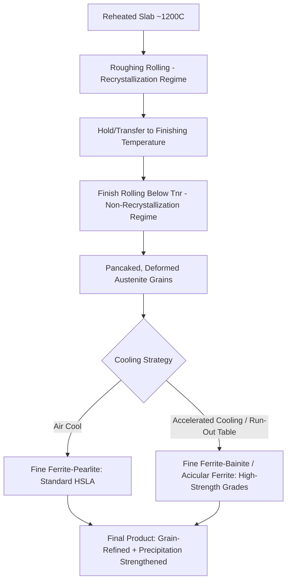
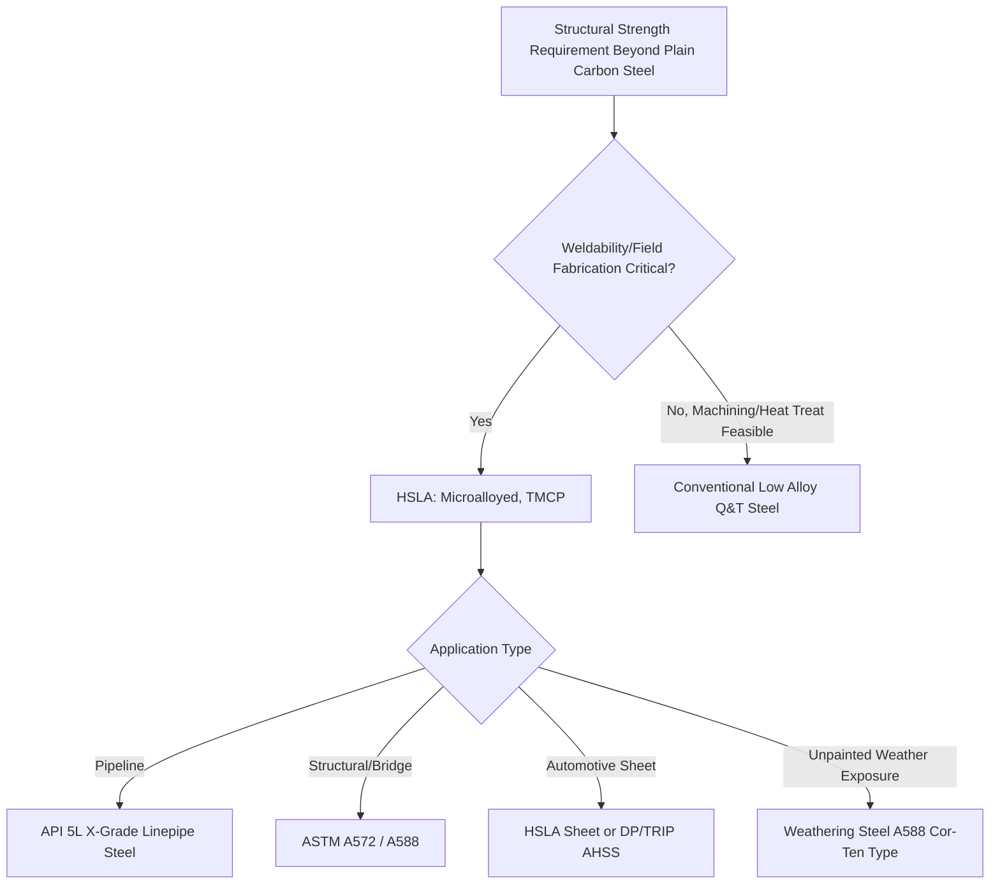

## High Strength Low Alloy Steels

### Overview

High-strength low-alloy (HSLA) steels are a family of structural steels engineered to achieve mechanical properties superior to plain carbon steel—primarily higher yield strength at good toughness and weldability—through microalloying and controlled processing rather than through the hardenability-driven quench-and-temper approach used for conventional alloy steels. Total alloy content is deliberately kept low (microalloying additions typically well under 0.15% each), keeping carbon content low (commonly 0.05–0.25%) to preserve weldability and toughness while achieving strength through grain refinement and precipitation strengthening.

### Distinguishing HSLA from Conventional Low Alloy Steel

**Key Points**

- Conventional low alloy steels (e.g., 4140, 4340) achieve strength primarily through **hardenability**—alloying elements delay transformation, enabling martensite/bainite formation on quenching, followed by tempering.
- HSLA steels achieve strength primarily through **microstructural refinement and precipitation strengthening** in the as-rolled or normalized condition, generally without requiring quench-and-temper heat treatment, using microalloying elements (Nb, V, Ti) in small quantities combined with controlled thermomechanical processing.
- This distinction matters practically: HSLA steels are typically supplied and used in the as-hot-rolled or normalized condition, are more weldable due to lower carbon content and lower carbon equivalent, and are generally more cost-effective for large structural applications where quench-and-temper heat treatment of large sections would be impractical or uneconomical.

### Strengthening Mechanisms

**Key Points**

- **Grain refinement**: The dominant strengthening mechanism—fine ferrite grain size (often ASTM grain size 10 or finer) simultaneously increases yield strength (per the Hall-Petch relationship, $\sigma_y = \sigma_0 + k_y d^{-1/2}$) and improves toughness (lowers the ductile-to-brittle transition temperature), an unusual combination since most strengthening mechanisms trade strength for toughness.
- **Precipitation strengthening**: Fine carbide, nitride, or carbonitride precipitates (Nb(C,N), V(C,N), TiC, TiN) formed during or after hot rolling impede dislocation motion, contributing significant strength increments; particle size and distribution (controlled by processing) determine the magnitude of strengthening.
- **Solid solution strengthening**: Manganese and, to a lesser extent, other substitutional/interstitial elements provide a baseline strength contribution, though this is secondary to grain refinement and precipitation effects in most HSLA grades.
- **Pinning of austenite grain boundaries during processing**: Niobium and titanium carbonitrides, particularly, retard austenite recrystallization and grain growth during hot rolling, which is the mechanism enabling controlled rolling to produce the fine final ferrite grain size (grain refinement occurs because fine, unrecrystallized/pancaked austenite grains provide many more nucleation sites for ferrite on transformation).

### Microalloying Elements and Their Roles

**Key Points**

- **Niobium (Nb)**: Most widely used microalloying element; even at 0.02–0.05%, strongly retards austenite recrystallization during hot rolling (enabling controlled rolling) and forms fine Nb(C,N) precipitates for precipitation strengthening.
- **Vanadium (V)**: Forms V(C,N) precipitates readily during cooling after rolling (more soluble at hot-rolling temperatures than Nb, so its main strengthening contribution is precipitation on cooling/coiling rather than recrystallization control); provides significant precipitation strengthening, particularly effective in air-cooled or normalized products.
- **Titanium (Ti)**: Forms very stable TiN particles that resist dissolution even at high reheating temperatures, effectively pinning austenite grain boundaries during reheating and welding (limiting HAZ grain growth, a specific weldability benefit); also ties up nitrogen, improving toughness and allowing boron additions (if present) to remain effective for hardenability.
- **Combined Nb-V, Nb-Ti, or Nb-V-Ti additions**: Common in commercial HSLA grades to combine recrystallization control (Nb), precipitation strengthening (V), and grain-boundary pinning during welding/reheating (Ti).
- **Molybdenum**: Sometimes added in small amounts to promote acicular ferrite or bainite formation in certain HSLA grades (particularly linepipe steels), improving strength-toughness combination.

### Controlled Rolling and Thermomechanical Processing

**Key Points**

- **Controlled rolling (Thermo-Mechanical Controlled Processing, TMCP)** is the processing route that realizes HSLA properties—rolling is conducted in stages with controlled temperatures rather than simply hot rolling to shape and allowing conventional recrystallization:
  1. **Roughing stage**: Conventional recrystallization rolling at high temperature (above ~1000°C) to break down the cast/reheated structure.
  2. **Non-recrystallization (finishing) rolling**: Conducted below the recrystallization stop temperature (Tnr, typically 900–950°C, controlled by Nb/Ti content), where deformation accumulates in unrecrystallized, "pancaked" austenite grains rather than being erased by recrystallization between passes.
  3. **Controlled cooling**: Accelerated cooling (often via run-out table water sprays) after finish rolling promotes fine ferrite nucleation from the pancaked austenite and can additionally produce bainite or acicular ferrite in higher-strength grades.
- **Accelerated cooling and direct quenching variants**: Some modern HSLA grades (e.g., high-strength linepipe, structural plate) use accelerated cooling or direct quenching after rolling to further refine microstructure and increase strength without a separate reheating/quenching heat treatment cycle.
- [Inference] The specific Tnr and cooling parameters are alloy- and product-specific, optimized by individual steel producers; general ranges given here represent typical industrial practice rather than universal constants.

### Controlled Rolling Process Schematic

### Grain Refinement Effect Schematic

<svg xmlns="http://www.w3.org/2000/svg" viewBox="0 0 700 380" font-family="sans-serif">
<text x="350" y="25" text-anchor="middle" font-size="16" font-weight="bold">Hall-Petch Effect: Strength and Toughness vs Grain Size (svg_diagram)</text>
<line x1="80" y1="330" x2="620" y2="330" stroke="black" stroke-width="2" />
<line x1="80" y1="330" x2="80" y2="50" stroke="black" stroke-width="2" />
<text x="350" y="355" text-anchor="middle" font-size="13">Grain Size (decreasing to the right)</text>
<text x="35" y="200" text-anchor="middle" font-size="13" transform="rotate(-90,35,200)">Yield Strength</text>
<path d="M 100 300 Q 300 200 580 90" stroke="blue" stroke-width="2" fill="none" />
<text x="590" y="85" font-size="11" fill="blue">Strength increases</text>
<path d="M 100 100 Q 300 180 580 290" stroke="green" stroke-width="2" fill="none" stroke-dasharray="5,3" />
<text x="590" y="295" font-size="11" fill="green">DBTT decreases</text>
<text x="90" y="345" font-size="10">Coarse</text>
<text x="560" y="345" font-size="10">Fine</text>
</svg>

### Classification and Standard Grades

**Key Points**

- **SAE/ASTM grades**: Designated primarily by minimum yield strength (ksi), e.g., ASTM A572 (Gr. 42, 50, 60, 65), ASTM A588 (weathering HSLA structural steel), ASTM A606/A607 (sheet/strip HSLA).
- **API linepipe grades**: X-designation indicates minimum yield strength in ksi (e.g., API 5L X60, X65, X70, X80, up to X100/X120 in advanced grades), a major application area for HSLA/TMCP steel.
- **Weathering steels (e.g., A588, "Cor-Ten")**: A specific HSLA subclass with Cu, Cr, Ni, P additions promoting formation of a stable, adherent oxide (patina) layer that significantly slows further atmospheric corrosion, allowing use without painting in appropriate exposure conditions.
- **Dual-phase (DP) and TRIP steels**: Related advanced high-strength steel (AHSS) families used extensively in automotive applications, sharing the low-carbon, controlled-processing philosophy of HSLA but achieving strength through a ferrite-martensite (DP) or ferrite-bainite-retained austenite (TRIP) microstructure rather than primarily grain refinement/precipitation; often discussed as a distinct but related category from classical microalloyed HSLA.

### Applications

**Key Points**

- **Large-diameter transmission pipelines (oil and gas)**: X70/X80 grade linepipe is the dominant modern application, where high strength-to-weight ratio reduces wall thickness (and thus material cost and welding time) while controlled rolling ensures adequate low-temperature toughness and weldability for field girth welding.
- **Structural steel for bridges, buildings, and heavy equipment**: A572/A588 grades provide higher allowable design stresses than plain carbon A36 steel, reducing structural weight; A588 weathering grades are used for bridges and architectural structures where unpainted service life is desired.
- **Automotive structural and chassis components**: Sheet HSLA (and increasingly DP/TRIP AHSS) is used for body structure, chassis, and wheel components where weight reduction (via thinner, higher-strength sheet) contributes to fuel economy and crash performance.
- **Off-highway and mobile equipment**: Booms, frames, and structural members in construction and agricultural equipment benefit from the strength-to-weight advantage, reducing dead weight while maintaining load capacity.
- **Ship and offshore structures**: Higher-strength, good-toughness HSLA plate is used in hull structures and offshore platforms where weight savings and low-temperature toughness (Arctic/North Sea service) are both valued.

### Weldability Advantages

**Key Points**

- Low carbon content (typically ≤0.12–0.20%) keeps carbon equivalent (CE) values low despite the higher strength level, meaning HSLA steels generally require less stringent preheat and post-weld heat treatment than conventional low-alloy steels of comparable strength, a major driver of their adoption in field-welded structures (pipelines, structural steel).
- Titanium nitride particles (where present) pin prior-austenite grain boundaries in the heat-affected zone, limiting HAZ grain growth and helping preserve HAZ toughness—a specific advantage over conventional carbon-manganese steels of similar strength.
- [Inference] Weldability, while generally favorable, still depends on the specific grade's carbon/manganese/microalloy balance, plate thickness, and welding process; procedure qualification per the applicable code (e.g., API 1104 for pipelines, AWS D1.1 for structures) remains standard practice rather than an assumption of unconditional weldability.

### HSLA vs. Conventional Structural/Alloy Steel Comparison

| Characteristic | Plain Carbon Structural (e.g., A36) | HSLA (e.g., A572 Gr 50) | Conventional Low-Alloy Q&T (e.g., 4140) |
| --- | --- | --- | --- |
| Typical Yield Strength | ~250 MPa | ~345 MPa | 700+ MPa (heat treated) |
| Strengthening Mechanism | Ferrite-pearlite, minimal refinement | Grain refinement + precipitation | Martensite/bainite + tempering |
| Carbon Content | ~0.25–0.29% | ~0.05–0.15% | ~0.40% |
| Heat Treatment Required | None (as-rolled) | None (as-rolled/normalized, TMCP) | Quench and temper mandatory |
| Weldability | Good | Very Good | Fair (preheat/PWHT often needed) |
| Typical Application | General structural | Bridges, pipelines, mobile equipment | Shafts, gears, high-strength fasteners |

### Selection and Processing Decision Framework

**Related Topics**

- Thermo-Mechanical Controlled Processing (TMCP) and Controlled Rolling Practice
- Hall-Petch Relationship and Grain Refinement Strengthening
- Microalloy Precipitation Behavior (Nb, V, Ti Carbonitrides)
- API 5L Linepipe Steel Grades and Pipeline Girth Welding
- Weathering Steel Patina Formation and Atmospheric Corrosion
- Dual-Phase and TRIP Advanced High-Strength Steels (AHSS)
- Carbon Equivalent and Weldability Assessment
- Heat-Affected Zone Grain Growth Control in Microalloyed Steels