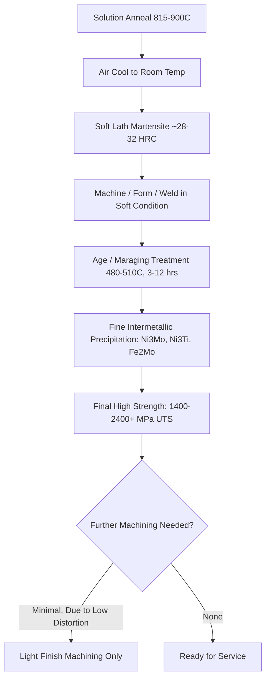
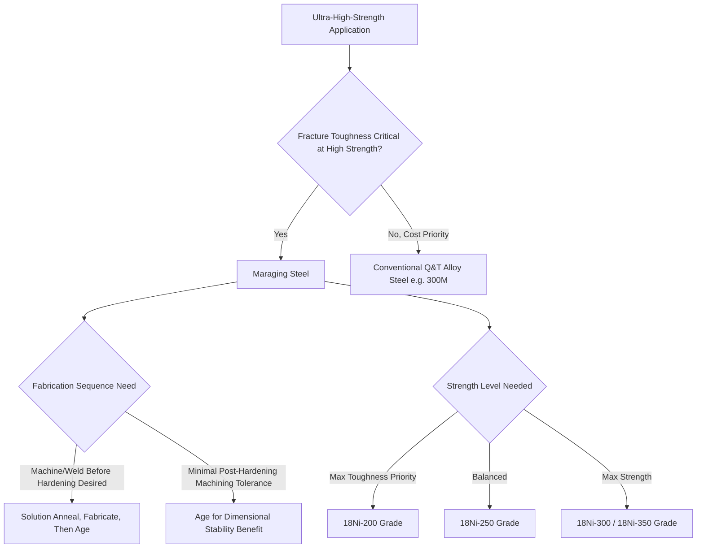

## Maraging Steels

### Overview

Maraging steels are ultra-high-strength, low-carbon iron-nickel martensitic alloys strengthened primarily through age hardening (precipitation of intermetallic compounds) rather than through carbon-based martensitic hardening. The name derives from "martensite aging"—the steel is first transformed to a soft, tough martensite on air cooling (not requiring rapid quenching, since the alloy content is calibrated so that martensite forms even on slow cooling), then aged at moderate temperature to precipitate strengthening intermetallic phases within the martensitic matrix. This combination yields an unusual property profile: very high strength (1400–2400+ MPa UTS depending on grade) combined with good fracture toughness and ductility, along with minimal distortion during heat treatment.

### Metallurgical Basis

**Key Points**

- Base composition is typically 17–19% Ni with additions of Co, Mo, and Ti (plus small Al); carbon is kept extremely low (typically <0.03%, often <0.01%), which is the defining departure from conventional and tool steels—strength does not come from carbon-martensite tetragonality or carbide formation.
- **Solution/air-cooled condition**: On cooling from the austenitizing/solutionizing temperature (typically 815–900°C), the high nickel content depresses the martensite start temperature into a range where a soft, low-carbon lath martensite forms even on air cooling (no water or oil quench required), avoiding quench distortion and cracking risk associated with conventional martensitic steels.
- **As-transformed lath martensite**: In the solution-annealed condition, this martensite is soft (typically 28–32 HRC) and highly ductile/formable—maraging steel is often machined, formed, or welded in this condition before final strengthening, a significant fabrication advantage over conventional steels that must be hardened before or after machining with associated distortion risk.
- **Aging (maraging) treatment**: Heating the martensite to 480–510°C for 3–12 hours precipitates fine, coherent intermetallic compounds (primarily Ni₃Mo, Ni₃Ti, Fe₂Mo, and related Laves phases depending on grade) throughout the martensite lath structure, dramatically increasing strength (often more than doubling yield strength) while causing minimal dimensional change (typically <0.1% linear change), a key advantage for precision components.
- Cobalt's role is notable and somewhat distinct from typical alloying logic: it does not directly form strengthening precipitates but instead lowers the solubility of molybdenum in the martensite matrix, promoting more complete and finer Mo-containing precipitation during aging, indirectly amplifying the aging response.

### Maraging Heat Treatment Cycle

### Aging Response Schematic

<svg xmlns="http://www.w3.org/2000/svg" viewBox="0 0 700 380" font-family="sans-serif">
<text x="350" y="25" text-anchor="middle" font-size="16" font-weight="bold">Hardness vs Aging Time at Fixed Temperature (svg_diagram)</text>
<line x1="80" y1="330" x2="620" y2="330" stroke="black" stroke-width="2" />
<line x1="80" y1="330" x2="80" y2="50" stroke="black" stroke-width="2" />
<text x="350" y="355" text-anchor="middle" font-size="13">Aging Time (hours, log scale)</text>
<text x="35" y="200" text-anchor="middle" font-size="13" transform="rotate(-90,35,200)">Hardness (HRC)</text>
<path d="M 100 300 Q 200 200 320 110 Q 420 80 500 90 Q 570 100 600 130" stroke="red" stroke-width="2" fill="none" />
<text x="320" y="95" font-size="11" text-anchor="middle">Peak Aging</text>
<text x="580" y="150" font-size="11">Overaging (slight softening)</text>
<text x="100" y="315" font-size="10">As-solutionized ~30 HRC</text>
</svg>

### Standard Grades and Classification

**Key Points**

- **18Ni Maraging series** (the most common commercial family, classified by nominal UTS in ksi):
  - **18Ni(200)**: ~1400 MPa (200 ksi) UTS, highest toughness of the series, used where fracture toughness is prioritized over absolute strength.
  - **18Ni(250)**: ~1700 MPa (250 ksi) UTS, the most widely used general-purpose grade, balancing strength and toughness.
  - **18Ni(300)**: ~2000 MPa (300 ksi) UTS, higher strength with correspondingly reduced toughness, used in aerospace structural applications.
  - **18Ni(350)**: ~2400 MPa (350 ksi) UTS, highest strength grade, more limited toughness, used in specialized high-load, low-fracture-critical applications.
- **Cobalt-free maraging steels**: Developed as a lower-cost alternative when cobalt supply/cost was a concern historically; rely more heavily on Mo and Ti for equivalent strength, generally requiring higher Mo/Ti content to compensate for the loss of cobalt's precipitation-promoting effect.
- **Lower-nickel and specialty maraging grades**: Variants exist for specific applications (e.g., corrosion-resistant maraging steels with added Cr, though these trade off some strength for corrosion resistance).

### Fabrication Characteristics

**Key Points**

- **Machinability**: Excellent in the solution-annealed (soft martensite) condition, comparable to or better than many medium-strength alloy steels, because the matrix is a soft, low-carbon martensite without carbide particles to accelerate tool wear.
- **Weldability**: Very good compared to conventional ultra-high-strength steels—the low-carbon martensite HAZ does not develop the brittle, crack-prone microstructure typical of welding high-carbon quenched-and-tempered steel; welding is typically performed in the solution-annealed condition, followed by a post-weld age treatment to restore full strength to the weld and HAZ (often requiring a slightly modified/extended age cycle to compensate for any dilution effects in the fusion zone).
- **Dimensional stability**: The hallmark practical advantage—because aging causes minimal size change (unlike the significant volume expansion accompanying carbon-martensite formation in conventional steel quenching), precision components can be machined to near-final dimensions before aging, with only minor finish machining or grinding required afterward.
- [Inference] The exact magnitude of dimensional change during aging is grade- and prior-processing-dependent; critical precision applications typically validate dimensional change empirically for the specific part geometry and grade rather than relying solely on generic published values.

### Applications

**Key Points**

- **Aerospace structural components**: Aircraft landing gear, wing attachment fittings, and other high-load structural parts where the strength-to-weight ratio and good fracture toughness (relative to conventional ultra-high-strength steel at comparable strength) are valued.
- **Rocket motor cases and pressure vessels**: High strength-to-weight ratio combined with good weldability makes maraging steel historically significant for solid rocket motor casings and other aerospace pressure vessels.
- **Tooling for demanding forming/molding applications**: Maraging tool steel is used for extrusion dies, die-casting inserts, and plastic injection mold components requiring high strength and toughness combined with good machinability before final aging and minimal distortion after.
- **Precision instruments and springs**: Applications benefiting from high strength, dimensional stability, and good fatigue resistance, such as precision springs and flexures.
- **Historical/specialty context**: Maraging steel gained notable attention for gas centrifuge rotor applications (uranium enrichment) due to its very high strength-to-weight ratio, a fact relevant to export control and nonproliferation regulatory frameworks governing certain high-strength maraging grades and associated manufacturing technology.

### Comparison with Conventional Quenched-and-Tempered Ultra-High-Strength Steel

| Characteristic | Maraging Steel | Conventional Q&T (e.g., 4340, 300M) |
| --- | --- | --- |
| Strengthening Mechanism | Intermetallic precipitation in low-C martensite | Carbon-martensite + carbide tempering |
| Carbon Content | Very low (<0.03%) | Moderate-high (0.3–0.5%) |
| Pre-Aging Hardness | Soft (~30 HRC), machinable | Requires separate anneal for machinability |
| Quench Requirement | Air cool only | Oil/water quench, distortion risk |
| Dimensional Change on Hardening | Minimal | Significant (martensitic transformation) |
| Weldability | Good (low-C martensite HAZ) | Poor-Fair (crack-prone HAZ) |
| Toughness at Given Strength | Generally superior | Lower at equivalent strength |
| Relative Cost | High (Ni, Co, Mo content) | Lower |

### Selection Rationale Framework

**Related Topics**

- Intermetallic Precipitation Kinetics (Ni₃Mo, Ni₃Ti, Fe₂Mo)
- Lath Martensite Formation in Low-Carbon Fe-Ni Alloys
- Fracture Toughness–Strength Trade-offs in Ultra-High-Strength Steels
- Welding Metallurgy of Maraging Steels and Post-Weld Aging
- Aerospace Landing Gear and Structural Steel Selection
- Export Control Considerations for High-Strength Maraging Alloys
- Cobalt-Free Maraging Steel Development
- Comparison with 300M and Other Ultra-High-Strength Q&T Steels