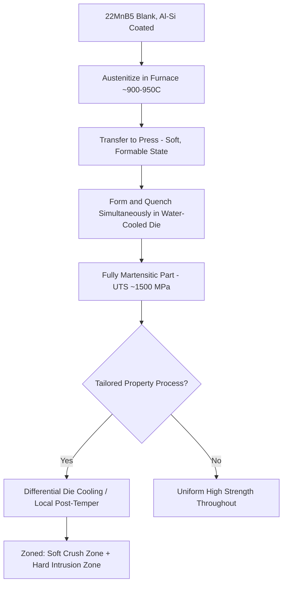
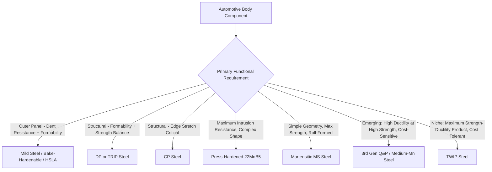

## Advanced High Strength Steels for Automotive Use

### Overview

Advanced High-Strength Steels (AHSS) are a family of automotive sheet steels engineered to achieve strength-ductility combinations superior to conventional HSLA and mild steels through multiphase microstructures rather than single-phase ferrite-pearlite structures. AHSS grades are generally classified into generations (first, second, and third) based on the strength-ductility trade-off achieved and the underlying microstructural strategy, driven by the automotive industry's dual demands for crash safety performance and vehicle weight reduction (fuel economy/emissions).

### Generational Classification Framework

**Key Points**

- **First-generation AHSS**: Ferrite-based multiphase microstructures (ferrite as the majority soft phase, combined with harder constituents); includes Dual-Phase (DP), Transformation-Induced Plasticity (TRIP), Complex-Phase (CP), and Martensitic (MS) steels. Good strength but formability (total elongation) decreases substantially as strength increases—the classic strength-ductility trade-off.
- **Second-generation AHSS**: Fully austenitic at room temperature (achieved through high Mn content, typically 15–25%), including Twinning-Induced Plasticity (TWIP) steels. Exceptional combination of very high strength AND very high ductility (breaking the traditional trade-off), but high alloy cost (Mn) and processing challenges (galvanizing difficulty, weldability issues) have limited widespread commercial adoption.
- **Third-generation AHSS**: Engineered to fill the property gap between first and second generation at lower cost than second-generation TWIP steels—includes Quenching & Partitioning (Q&P) steels, medium-Mn steels, and TRIP-assisted bainitic ferrite (TBF) steels, using retained austenite stabilization strategies to achieve improved ductility at first-generation-comparable cost.

### Strength-Ductility Banana Diagram Concept

<svg viewBox="0 0 700 420" xmlns="http://www.w3.org/2000/svg" font-family="sans-serif">
<text x="350" y="25" text-anchor="middle" font-size="16" font-weight="bold">AHSS Strength vs Total Elongation Landscape (svg_diagram)</text>
<line x1="80" y1="370" x2="640" y2="370" stroke="black" stroke-width="2"/>
<line x1="80" y1="370" x2="80" y2="50" stroke="black" stroke-width="2"/>
<text x="360" y="395" text-anchor="middle" font-size="13">Tensile Strength (MPa, increasing right)</text>
<text x="30" y="220" text-anchor="middle" font-size="13" transform="rotate(-90,30,220)">Total Elongation (%)</text>
<ellipse cx="180" cy="150" rx="70" ry="60" fill="none" stroke="gray" stroke-width="2"/>
<text x="180" y="150" text-anchor="middle" font-size="11">Mild Steel / HSLA</text>
<path d="M 250 130 Q 350 220 450 290" stroke="blue" stroke-width="2" fill="none"/>
<text x="330" y="240" font-size="11" fill="blue">1st Gen: DP, TRIP, CP, MS</text>
<ellipse cx="560" cy="130" rx="70" ry="70" fill="none" stroke="green" stroke-width="2"/>
<text x="560" y="130" text-anchor="middle" font-size="11" fill="green">2nd Gen: TWIP</text>
<path d="M 400 220 Q 480 190 540 200" stroke="red" stroke-width="2" fill="none" stroke-dasharray="5,3"/>
<text x="470" y="185" font-size="11" fill="red">3rd Gen: Q&P, Medium-Mn</text>
</svg>

### Dual-Phase (DP) Steels

**Key Points**

- Microstructure consists of soft, ductile ferrite (typically 80–90% by volume) containing dispersed islands of hard martensite (10–20%), produced by intercritical annealing (heating into the ferrite+austenite two-phase field, typically 750–850°C) followed by rapid cooling to transform the austenite islands to martensite while the ferrite remains largely unchanged.
- Continuous yielding behavior (no distinct yield point elongation/Lüders strain, unlike conventional low-carbon steel), high initial work-hardening rate (beneficial for stretch forming and crash energy absorption), and good combination of strength and formability among first-generation grades.
- Graded by minimum yield/tensile strength combinations, e.g., DP590, DP780, DP980, DP1180 (numbers indicate approximate minimum tensile strength in MPa).
- **Application**: Body structure reinforcements, wheels, bumper reinforcements, and structural components requiring good formability combined with strength for crash energy management.

### Transformation-Induced Plasticity (TRIP) Steels

**Key Points**

- Microstructure contains ferrite, bainite, and retained austenite (typically 5–15%); the retained austenite is metastable and transforms to martensite during subsequent plastic deformation (the TRIP effect), which locally increases strain hardening and delays necking, providing enhanced ductility and energy absorption compared to DP steel at similar strength.
- Requires higher alloy content (Si and/or Al, in addition to C and Mn) than DP steel to suppress carbide precipitation during the bainitic holding stage of processing, which is necessary to enrich the retained austenite with carbon and stabilize it to room temperature.
- **Processing**: Intercritical annealing followed by an isothermal hold in the bainite formation range (similar in principle to austempering) to develop the bainite/retained-austenite constituents before final cooling.
- **Application**: Structural and safety components requiring higher energy absorption during crash deformation than DP steel provides at comparable strength, such as B-pillar reinforcements and side-impact structures.

### Complex-Phase (CP) and Martensitic (MS) Steels

**Key Points**

- **Complex-Phase (CP) steels**: Very fine microstructure of ferrite and higher fractions of bainite/martensite than DP steel, with microalloy precipitation strengthening (similar to HSLA principles) contributing additional strength; higher yield strength and better hole-expansion/edge stretchability than DP steel at comparable tensile strength, though generally lower total elongation.
- **Martensitic (MS) steels**: Predominantly or fully martensitic microstructure produced by cooling rapidly enough from the austenitizing/annealing temperature to avoid ferrite/bainite formation almost entirely; the highest strength of the first-generation family (often 1200–1700+ MPa) but the lowest ductility/formability, generally requiring roll forming or minimal additional forming after production rather than complex stamping.
- **Application (CP)**: Bumper systems, side-impact beams requiring good edge stretch formability.
- **Application (MS)**: Roll-formed structural reinforcements, door intrusion beams, and other components with simple geometry requiring maximum strength.

### Press Hardening / Hot Stamping Steel (e.g., 22MnB5)

**Key Points**

- A distinct and highly significant AHSS processing route: boron-alloyed steel blanks (commonly 22MnB5) are heated to full austenitization (~900–950°C), then formed and simultaneously quenched within water-cooled dies in a single operation ("press hardening" or "hot stamping"), producing a fully martensitic part with very high strength (typically 1500 MPa UTS, up to ~2000 MPa in newer grades) directly in the final formed shape.
- This approach solves the formability problem inherent to forming very high-strength steel in the cold-stamped condition—the steel is soft and highly formable at hot-stamping temperature, then hardens to full strength only after the die closes and quenches the part, achieving both complex geometry and maximum strength simultaneously.
- **Aluminum-silicon (Al-Si) coating**: Commonly applied to hot-stamped blanks to prevent scaling/decarburization during furnace austenitization and to provide corrosion protection, though the coating requires specific process control (diffusion alloying during heating) to remain intact through forming.
- **Tailored properties**: Advanced hot-stamping processes can produce tailored/graded properties within a single part (e.g., a softer, more ductile crush zone combined with a harder, high-strength intrusion-resistant zone) through differential die cooling rates or post-form tempering of specific regions.
- **Application**: A-pillars, B-pillars, roof rails, bumper beams, and tunnel/floor reinforcements—components requiring maximum intrusion resistance in the passenger safety cell combined with complex geometry.

### Hot Stamping Process Schematic

### Second-Generation: TWIP Steels

**Key Points**

- Fully austenitic microstructure at room temperature, stabilized by very high manganese content (typically 15–25% Mn) combined with Al and/or Si; deformation occurs through extensive mechanical twinning (in addition to dislocation slip), which continuously refines the effective grain size during deformation (twin boundaries act as additional barriers to dislocation motion), sustaining a high work-hardening rate to very large strains.
- Achieves an exceptional combination of tensile strength (~1000 MPa) and total elongation (50%+), the highest strength-ductility product among commercial sheet steel grades.
- **Commercial limitations**: High manganese content raises material cost, complicates hot-dip galvanizing (Mn oxidizes preferentially, interfering with coating adhesion), and can pose specific weldability and delayed-cracking (hydrogen embrittlement-related) challenges; these factors have limited TWIP steel to niche/limited-volume automotive applications relative to first-generation AHSS. [Inference] Adoption levels vary by manufacturer and have generally remained below early industry projections due to these processing and cost challenges.

### Third-Generation AHSS: Quenching & Partitioning (Q&P) Steels

**Key Points**

- A processing route (rather than a single fixed composition) designed to produce a controlled fraction of stable retained austenite within a martensitic matrix, combining high strength with improved ductility at lower alloy cost than TWIP steel.
- **Process stages**:
  1. Austenitize (fully or intercritically), then quench to a temperature between the martensite start (Ms) and martensite finish (Mf) temperatures, forming a controlled fraction of primary martensite while leaving some austenite untransformed.
  2. **Partitioning step**: Hold at the quench temperature or reheat slightly, allowing carbon to diffuse ("partition") from the supersaturated martensite into the remaining untransformed austenite, enriching and stabilizing that austenite against transformation on final cooling to room temperature.
  3. Cool to room temperature, retaining the carbon-enriched austenite (which may contribute a TRIP effect during subsequent forming/crash deformation, similar in principle to TRIP steel but via a distinct processing route).
- Silicon (and sometimes aluminum) additions are important to suppress carbide precipitation during partitioning, which would otherwise consume the carbon needed to stabilize the retained austenite.
- **Application**: Positioned as a potential successor to first-generation DP/TRIP steels for structural components requiring improved formability at high strength, with ongoing industrial adoption as processing capability (precise quench-temperature control) matures at production scale. [Inference] Q&P steel commercial penetration continues to evolve and varies significantly by steelmaker and automaker program.

### Comparative Property Summary

| Steel Type | Typical UTS Range | Typical Total Elongation | Key Mechanism | Representative Use |
| --- | --- | --- | --- | --- |
| Mild/HSLA Steel | 270–550 MPa | 25–45% | Ferrite grain refinement | Outer panels, brackets |
| Dual-Phase (DP) | 590–1180 MPa | 10–25% | Ferrite + martensite islands | Structural reinforcements |
| TRIP | 590–980 MPa | 20–30% | Ferrite + bainite + retained austenite (TRIP effect) | B-pillar, side-impact structures |
| Complex-Phase (CP) | 780–1180 MPa | 8–15% | Fine ferrite/bainite/martensite + precipitates | Bumpers, side beams |
| Martensitic (MS) | 1200–1700+ MPa | 4–8% | Full martensite | Door beams, roll-formed reinforcements |
| Press-Hardened (22MnB5) | ~1500–2000 MPa | 4–8% (as formed) | Full martensite, hot-formed | A/B-pillars, roof rails |
| TWIP (2nd Gen) | ~1000 MPa | 50%+ | Austenite + mechanical twinning | Niche/limited-volume structural |
| Q&P (3rd Gen) | 980–1500 MPa | 12–20% | Martensite + stabilized retained austenite | Emerging structural applications |

### Design and Manufacturing Considerations

**Key Points**

- **Springback**: Higher-strength AHSS grades exhibit greater elastic springback after forming due to higher yield strength, requiring more sophisticated die design/compensation (over-bending, tonnage control) compared to mild steel.
- **Edge stretchability and hole expansion**: A critical formability metric for AHSS (especially DP steel, where hard martensite islands at a sheared edge can initiate cracking during subsequent hole expansion or flanging); CP steel's more uniform hardness distribution generally improves this property relative to DP steel at similar strength.
- **Weld strength and softening**: Resistance spot welding of martensitic and high-carbon AHSS grades can produce a softened HAZ region (due to tempering effects) or, conversely, brittle weld nugget behavior; weld schedule optimization and sometimes post-weld tempering pulses are used to manage joint performance.
- **Joining technology evolution**: Increased use of adhesive bonding, self-piercing rivets, and laser welding alongside traditional resistance spot welding to address AHSS-specific joining challenges (electrode wear, weld strength consistency) in modern multi-material and high-strength-steel-intensive body structures.

### Grade Selection Framework by Component Function

**Related Topics**

- Intercritical Annealing and Continuous Annealing Line Processing
- Hot Stamping / Press Hardening Process and Die-Quench Design
- Retained Austenite Stabilization Mechanisms (TRIP, Q&P)
- Edge Stretchability and Hole Expansion Testing (Formability Metrics)
- Resistance Spot Welding of Multiphase and Martensitic AHSS
- TWIP Steel Twinning Mechanisms and Galvanizing Challenges
- Springback Compensation in High-Strength Steel Stamping
- Multi-Material Automotive Body Structures and Joining Technology