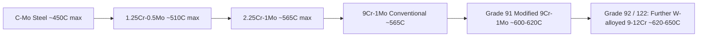
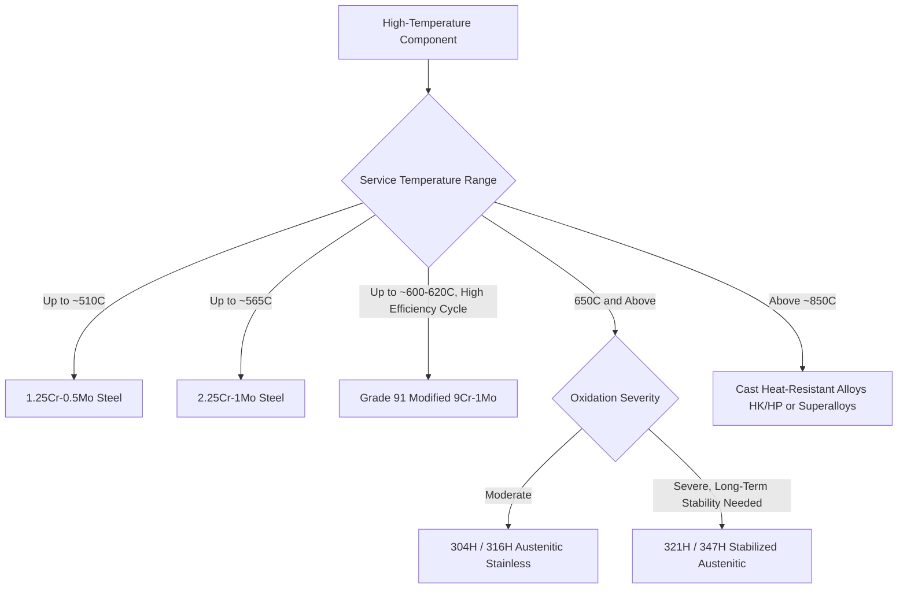

## Steels for High Temperature Service

### Overview

Steels for high-temperature service are engineered to resist the degradation mechanisms that become dominant above roughly 370–400°C, where conventional room-temperature-focused strength criteria give way to time-dependent phenomena: creep (progressive deformation under sustained stress), oxidation/scaling, and microstructural instability. Selection of high-temperature steel grades involves matching alloy content and heat treatment to the specific temperature regime, stress level, service duration, and environmental exposure of the application, spanning from moderate-temperature carbon-molybdenum steels to fully austenitic and superalloy-adjacent compositions.

### Degradation Mechanisms at Elevated Temperature

**Key Points**

- **Creep**: Time-dependent plastic deformation under constant stress at elevated temperature (generally significant above ~0.3–0.4 times the absolute melting temperature, $T_m$), progressing through primary (decreasing rate), secondary/steady-state (minimum, roughly constant rate), and tertiary (accelerating rate leading to rupture) stages; creep-resistant alloy design aims to minimize the secondary-stage creep rate and extend time to rupture.
- **Creep mechanisms**: Include dislocation climb and glide (dominant at higher stress/moderate temperature), diffusional flow (Nabarro-Herring and Coble creep, dominant at lower stress/very high temperature), and grain boundary sliding; alloy design (solid solution strengthening, precipitate strengthening, grain boundary strengthening via carbide films) targets these mechanisms to slow creep progression.
- **Oxidation and scaling**: High-temperature exposure to air/combustion gases forms surface oxide scale; chromium is the primary alloying element relied upon to form a protective, adherent Cr₂O₃ scale, with the required Cr content increasing with service temperature (roughly 1–2% Cr for moderate protection up to ~500°C, 5%+ for ~600°C, 9%+ for higher, and stainless-level Cr, 18%+, for the most demanding oxidation environments above ~750–800°C).
- **Microstructural instability**: Prolonged high-temperature exposure can cause carbide coarsening (Ostwald ripening, reducing precipitation strengthening effectiveness over service life), graphitization (in older C-Mo steels, discussed below), spheroidization of pearlite, and, in stainless/high-Cr grades, embrittling intermetallic phase formation (sigma phase).
- **Temper embrittlement and creep-fatigue interaction**: In cyclic high-temperature service (e.g., power plant startup/shutdown cycles), combined creep and fatigue damage mechanisms interact, often reducing component life below what either mechanism would predict in isolation.

### Creep Curve and Design Concept

<svg xmlns="http://www.w3.org/2000/svg" viewBox="0 0 700 380" font-family="sans-serif">
<text x="350" y="25" text-anchor="middle" font-size="16" font-weight="bold">Classic Creep Curve: Strain vs Time at Constant Stress/Temp (svg_diagram)</text>
<line x1="80" y1="330" x2="620" y2="330" stroke="black" stroke-width="2" />
<line x1="80" y1="330" x2="80" y2="50" stroke="black" stroke-width="2" />
<text x="350" y="355" text-anchor="middle" font-size="13">Time</text>
<text x="35" y="200" text-anchor="middle" font-size="13" transform="rotate(-90,35,200)">Strain</text>
<path d="M 100 320 Q 130 250 200 230 L 400 210 Q 500 190 560 100 L 590 60" stroke="black" stroke-width="2" fill="none" />
<text x="150" y="260" font-size="11">Primary</text>
<text x="290" y="205" font-size="11">Secondary (steady-state)</text>
<text x="500" y="150" font-size="11">Tertiary</text>
<circle cx="590" cy="60" r="4" fill="red" />
<text x="600" y="55" font-size="11" fill="red">Rupture</text>
</svg>

### Carbon-Molybdenum and Low-Alloy Chromium-Molybdenum Steels

**Key Points**

- **Carbon-Molybdenum steel (C-Mo, ~0.5% Mo)**: An early creep-resistant grade for moderate temperature service (up to ~450–480°C); molybdenum in solid solution provides modest creep strength improvement over plain carbon steel, but this grade has been largely phased out in new construction (particularly in ASME Section I/VIII power piping applications) due to susceptibility to graphitization.
- **Graphitization**: A specific degradation mode in C-Mo and similar low-alloy steels exposed for extended periods in the 425–595°C range, where cementite decomposes into graphite nodules (particularly at weld HAZ regions or areas of prior cold work), severely reducing strength and ductility at the affected location; this vulnerability drove the shift toward Cr-Mo grades, which are far more resistant to graphitization because chromium stabilizes carbides against decomposition.
- **Chromium-Molybdenum steels (1¼Cr-½Mo, 2¼Cr-1Mo, and higher-Cr variants)**: The workhorse family for power generation piping, headers, and pressure vessels in the 400–600°C range—increasing Cr content improves both creep strength (via more stable, finer alloy carbides: initially Fe₃C, transitioning to Cr-rich M₇C₃ and M₂₃C₆ carbides with increasing Cr and aging time) and oxidation resistance.
- **9Cr-1Mo and modified 9Cr-1Mo (Grade 91)**: A major advancement using vanadium and niobium microalloying (in addition to the base 9Cr-1Mo composition) combined with a normalize-and-temper heat treatment to produce a tempered martensitic structure with fine MX (V,Nb)(C,N) precipitates, providing substantially improved creep strength over conventional 9Cr-1Mo, enabling thinner-walled components at higher steam temperatures/pressures in modern supercritical and ultra-supercritical power plants.
- **Heat treatment of Grade 91**: Normalize at ~1040–1070°C (fully austenitize to dissolve carbides and achieve the necessary fine-grained martensitic structure on cooling) followed by tempering at ~730–780°C to develop the fine MX precipitate distribution responsible for creep strength; precise control of both steps is critical, as deviation can significantly reduce creep rupture life. [Inference] Field experience with Grade 91 has shown that improper heat treatment (particularly during welding/PWHT) or Type IV cracking in weld HAZs has been a documented service issue requiring careful welding procedure control.

### Ferritic Cr-Mo Steel Progression

### Austenitic Stainless Steels for High-Temperature Service

**Key Points**

- Fully austenitic FCC structure provides inherently better high-temperature strength (higher melting point fraction advantage, better creep resistance due to lower self-diffusion rates in FCC vs BCC) and superior oxidation resistance (higher Cr, plus Ni) compared to ferritic Cr-Mo steels, extending usable service temperature to 650–850°C and beyond for select grades.
- **Common grades**: 304H, 316H (higher carbon "H" grades specifically for elevated-temperature service, since higher carbon improves creep strength via carbide precipitation—opposite of the low-carbon "L" grades used for corrosion service), 321H/347H (Ti/Nb stabilized, resisting sensitization during prolonged high-temperature exposure), and more highly alloyed grades (e.g., 310, alloy 800H) for the highest temperature ranges.
- **Sensitization revisited at high temperature**: Even H-grade stabilized austenitics can experience chromium carbide precipitation at grain boundaries during prolonged elevated-temperature service; stabilized grades (Ti, Nb) mitigate this by preferentially forming stable MC carbides instead of Cr-depleting M₂₃C₆.
- **Application**: Superheater and reheater tubing in power boilers, high-temperature furnace components, ethylene cracking furnace tubes (often as cast HK/HP grades, a related but distinct heat-resistant casting alloy family), and gas turbine combustor/exhaust components at the lower end of the superalloy application range.

### Comparative Temperature Capability

| Steel Family | Approximate Max Service Temp (Continuous) | Primary Strengthening | Typical Application |
| --- | --- | --- | --- |
| Carbon-Mo Steel | ~450°C | Solid solution (Mo) | Legacy piping (largely phased out) |
| 1.25Cr-0.5Mo | ~510°C | Carbide precipitation | Power piping, headers |
| 2.25Cr-1Mo | ~565°C | Carbide precipitation | Hydroprocessing reactors, piping |
| Grade 91 (Mod 9Cr-1Mo) | ~600–620°C | Tempered martensite + fine MX precipitates | Supercritical/USC power plant piping |
| 304H/316H Austenitic | ~650–815°C | Solid solution + carbide precipitation | Superheater tubing, furnace parts |
| 321H/347H Stabilized Austenitic | ~650–815°C | Stabilized carbides (Ti/Nb) | High-temp tubing resisting sensitization |
| HK/HP Cast Heat-Resistant Alloys | ~980–1100°C | Austenitic matrix + carbide network | Ethylene cracker tubes, furnace fixtures |

### Design Approaches: Time-Temperature-Stress Correlation

**Key Points**

- **Larson-Miller Parameter (LMP)**: A widely used extrapolation method combining temperature and time-to-rupture into a single parameter, $LMP = T(C + \log t_r)$, where $T$ is absolute temperature, $t_r$ is rupture time, and $C$ is a material-specific constant (often ~20 for steels); allows creep rupture data collected over practical laboratory test durations (hours to a few years) to be extrapolated to predict long-term (decades) service behavior at lower design stresses.
- **ASME Code allowable stress tables**: Incorporate creep rupture data (including Larson-Miller-based extrapolations) to define maximum allowable design stresses as a function of temperature for code-approved materials, forming the basis for pressure vessel and piping design in high-temperature service (ASME Section I, Section VIII, B31.1, B31.3).
- [Inference] Extrapolation methods like Larson-Miller carry inherent uncertainty when extending well beyond the tested time range, which is one reason why long-term field experience and periodic re-evaluation of allowable stresses (as seen historically with some Grade 91 applications) remains an active area of engineering and code-committee attention.

### Application Selection Framework

### Welding and Fabrication Considerations

**Key Points**

- **Preheat and post-weld heat treatment (PWHT)**: Cr-Mo steels require carefully controlled preheat (to avoid hydrogen-induced cold cracking in the martensitic/bainitic HAZ) and PWHT (tempering to relieve residual stress and temper any untempered martensite formed in the HAZ), with requirements becoming more stringent as Cr-Mo content increases (Grade 91 in particular requires tightly controlled PWHT temperature and time to develop appropriate HAZ toughness without over- or under-tempering).
- **Type IV cracking**: A specific, well-documented failure mode in Grade 91 (and other 9-12Cr creep-strength-enhanced ferritic steels) weld heat-affected zones, occurring in the fine-grained HAZ region where the tempering/normalizing effect of welding refines grain size and reduces creep strength locally, creating a weak zone that can fail prematurely under long-term creep loading; this remains an active area of inspection/monitoring practice in power plant maintenance programs.
- **Filler metal matching**: High-temperature steel welding generally requires filler metal compositionally matched (or closely matched) to the base metal to maintain consistent creep strength across the weldment, unlike some room-temperature applications where slight mismatch is acceptable.

**Related Topics**

- Larson-Miller Parameter and Creep Rupture Data Extrapolation
- Graphitization in Carbon-Molybdenum Steels
- Grade 91/92 Modified 9Cr-1Mo Steel Metallurgy and Type IV Cracking
- Sensitization and Carbide Precipitation in High-Temperature Austenitic Grades
- ASME Boiler and Pressure Vessel Code Allowable Stress Basis
- Cast Heat-Resistant Alloys (HK, HP) for Furnace Applications
- Creep-Fatigue Interaction in Cyclic High-Temperature Service
- Post-Weld Heat Treatment Practices for Creep-Strength-Enhanced Ferritic Steels