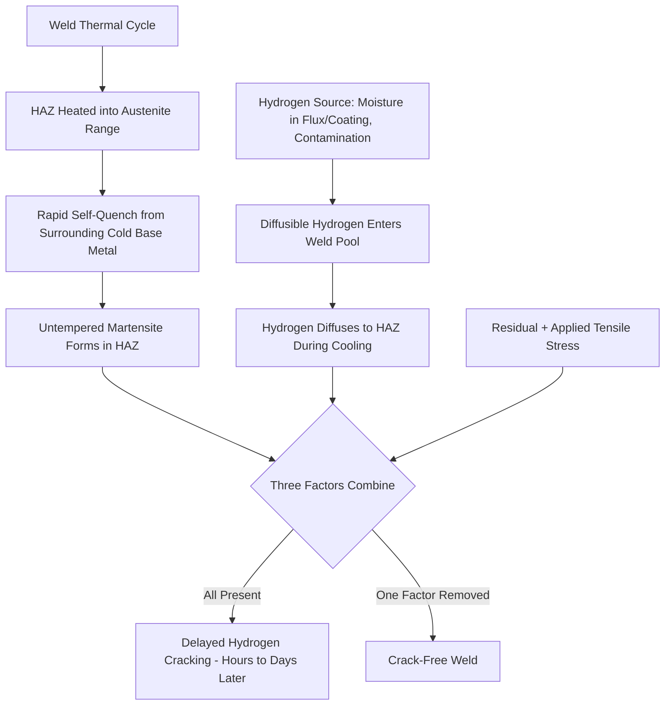
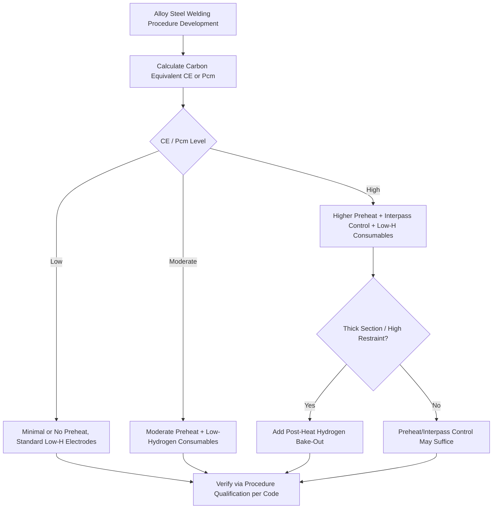
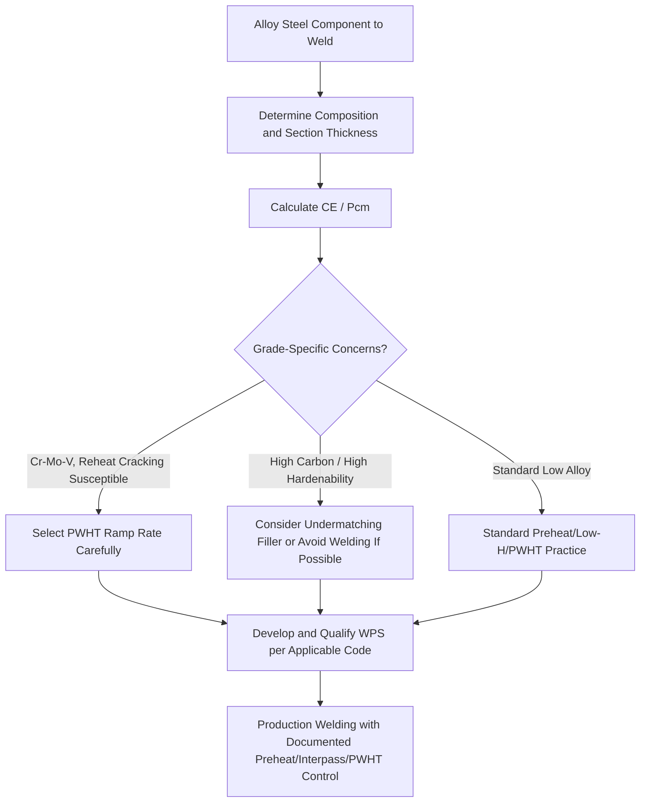

## Weldability of Alloy Steels

### Overview

Weldability of alloy steels refers to the relative ease with which sound, crack-free welds meeting service performance requirements can be produced, and how much process control (preheat, interpass temperature, filler selection, post-weld heat treatment) is required to achieve that soundness. As carbon content and alloy content increase to provide hardenability and strength, weldability generally decreases because the same metallurgical mechanisms that produce desirable base-metal properties (hardenability leading to martensite formation) also make the weld heat-affected zone (HAZ) prone to hard, brittle, crack-susceptible microstructures.

### Primary Weldability Concerns in Alloy Steel

**Key Points**

- **Hydrogen-induced cold cracking (HICC)**: The dominant weldability concern for alloy steels—requires the simultaneous presence of three factors: (1) diffusible hydrogen (from moisture in electrode coatings/flux, hydrocarbon contamination, or atmospheric humidity), (2) a susceptible microstructure (untempered or as-quenched martensite in the HAZ or weld metal), and (3) tensile stress (residual welding stress plus any applied load); cracking typically occurs hours to days after welding as hydrogen diffuses to regions of high stress/susceptible microstructure, hence the alternative name "delayed cracking."
- **HAZ hardening**: Alloy steel HAZs experience rapid thermal cycling (heating into the austenite range followed by very fast self-quenching from surrounding cold base metal), and because alloy steels are formulated for good hardenability, this rapid cooling readily produces martensite in the HAZ even without any external quenching medium—the weld itself acts as the "quench."
- **Lamellar tearing**: A distinct mechanism relevant to thick-section, highly restrained joints (particularly T- and corner-joints) where through-thickness ductility is inadequate due to non-metallic inclusions (sulfide stringers) elongated during rolling; more of a base-metal cleanliness/rolling-direction issue than an alloy-content issue per se, but relevant to heavy alloy steel fabrication.
- **Reheat cracking (stress-relief cracking)**: Occurs during post-weld heat treatment (PWHT) or subsequent elevated-temperature service in certain alloy steels (particularly Cr-Mo-V grades with strong carbide-forming elements), where precipitation hardening in the HAZ during PWHT reduces ductility faster than residual stresses relax, leading to intergranular cracking.
- **Solidification cracking (hot cracking)**: Primarily a weld-metal (not HAZ) phenomenon related to sulfur/phosphorus segregation and low-melting-point films at solidifying grain boundaries; more common in fully austenitic weld metal or steels with elevated S/P content than in typical low alloy steel HAZs, but relevant when selecting filler metal composition.

### Hydrogen Cracking Mechanism Schematic

### Carbon Equivalent Formulas and Their Use

**Key Points**

- Carbon equivalent (CE) formulas estimate a steel's hardenability/crack susceptibility from its bulk composition, allowing weldability screening without direct testing for every heat/composition variation.
- **IIW (International Institute of Welding) formula**, most common for structural and low alloy steel:

  $$CE_{IIW} = C + \frac{Mn}{6} + \frac{Cr + Mo + V}{5} + \frac{Ni + Cu}{15}$$
- **Ito-Bessyo (Pcm) formula**, generally preferred for lower-carbon HSLA and pipeline steels where the IIW formula overestimates cracking risk at low carbon levels:

  $$P_{cm} = C + \frac{Si}{30} + \frac{Mn + Cu + Cr}{20} + \frac{Ni}{60} + \frac{Mo}{15} + \frac{V}{10} + 5B$$
- Higher CE/Pcm values generally correlate with greater HAZ hardenability, higher HAZ hardness, and greater required preheat/precautions to avoid hydrogen cracking; specific numerical thresholds and associated preheat recommendations are typically taken from the governing code or standard (e.g., AWS D1.1 Annex, EN 1011-2) rather than treated as universal fixed limits, since acceptable practice also depends on section thickness, hydrogen level, and joint restraint.
- [Inference] Because CE formulas are empirical approximations, they provide useful comparative screening between compositions but do not replace procedure qualification testing (e.g., per ASME Section IX or AWS D1.1) for critical applications.

### Preheat, Interpass Temperature, and Hydrogen Control

**Key Points**

- **Preheat**: Raises the base metal temperature before welding, which slows the HAZ cooling rate (reducing martensite formation/hardness) and, critically, extends the time available for diffusible hydrogen to escape from the weld region before it accumulates to a crack-critical level; required preheat generally increases with carbon equivalent, section thickness, and joint restraint.
- **Interpass temperature**: Maintaining a minimum temperature between weld passes in multi-pass welds serves the same function as preheat throughout the welding process, not just at the start.
- **Post-heat (immediate post-weld hydrogen bake-out)**: Holding the completed weld at an elevated temperature (typically 200–300°C) for an extended period immediately after welding, before the joint is allowed to cool to room temperature, to drive out residual diffusible hydrogen before it can cause delayed cracking—particularly important for thick sections and higher-alloy/higher-CE steels.
- **Low-hydrogen consumables**: Using low-hydrogen electrode coatings (e.g., E7018-type SMAW electrodes) or gas-shielded processes (GMAW, GTAW, or flux-cored wires formulated for low diffusible hydrogen) minimizes the hydrogen source itself; proper electrode storage/baking (per manufacturer requirements, since low-hydrogen coatings readily reabsorb atmospheric moisture) is essential to realize this benefit in practice.
- **Combined strategy**: Real welding procedures typically combine several of these controls (moderate preheat + low-hydrogen consumables + controlled interpass temperature + sometimes post-heat) rather than relying on any single measure, particularly for higher-CE alloy steels or thick sections.

### Preheat/Hydrogen Control Decision Framework

### Post-Weld Heat Treatment (PWHT)

**Key Points**

- **Purpose**: Tempers any untempered martensite formed in the HAZ (restoring toughness and reducing hardness), relieves residual welding stresses (reducing both cracking risk and distortion in service), and, for some Cr-Mo grades, is a code-mandated requirement above certain thickness or CE thresholds (per ASME Section VIII, B31.1, B31.3).
- **Typical parameters**: Heating to a temperature below the base metal's lower transformation temperature (commonly 590–730°C for many low alloy and Cr-Mo grades, code- and grade-specific), holding for a time based on section thickness (often specified as a rate, e.g., 1 hour per 25 mm), then controlled slow cooling to avoid reintroducing stress.
- **Reheat cracking risk during PWHT**: As noted above, certain Cr-Mo-V grades (and some heavily alloyed martensitic/precipitation-hardening steels) are susceptible to intergranular reheat cracking during the PWHT heating ramp itself, requiring careful control of heating rate through the susceptible temperature range and sometimes composition-specific PWHT parameter selection (informed by empirical susceptibility indices developed for reheat cracking).
- [Inference] Whether PWHT is mandatory, and its exact parameters, depend on the governing code, material specification, thickness, and service conditions; specific numeric PWHT holding temperatures and times should be taken from the applicable code table for the exact grade rather than generalized.

### Filler Metal Selection Considerations

**Key Points**

- **Matching filler metal**: For many structural low alloy steel applications, filler metal is selected to match or closely approximate base metal composition and strength (matching or slightly under-matching strength is often preferred to avoid excessive weld metal hardness/brittleness relative to a tougher base metal).
- **Undermatching for hydrogen tolerance**: In some high-strength, crack-sensitive applications, a filler metal with slightly lower strength but higher inherent toughness/hydrogen tolerance than the base metal is deliberately selected, accepting that the weld metal is the "weak link" in exchange for reduced cracking risk—a deliberate engineering trade-off rather than a defect.
- **Austenitic stainless filler for dissimilar/hardenable steel welding**: Occasionally used when welding hardenable alloy steels (e.g., for repair welding or joining dissimilar alloy steels) because austenitic weld metal has very high solubility for hydrogen at welding temperature and retains it without transformation-related cracking, effectively "trapping" hydrogen in a benign FCC matrix rather than allowing it to concentrate in a susceptible ferritic/martensitic HAZ—though this approach introduces its own considerations (galvanic effects, differential thermal expansion, potential carbon migration at elevated service temperature).

### Comparative Weldability by Alloy Steel Family

| Steel Family | Relative Weldability | Primary Concern | Typical Mitigation |
| --- | --- | --- | --- |
| Low-carbon HSLA | Very Good | Minimal (low CE) | Minimal preheat usually sufficient |
| Medium-carbon low alloy (e.g., 4140) | Fair | HAZ hardening, HICC | Preheat, low-H electrodes, PWHT often required |
| High-carbon alloy (e.g., 4340, 52100) | Poor | HAZ hardening, HICC, high hardness | High preheat, low-H, PWHT mandatory, sometimes avoided by design |
| Cr-Mo creep-resistant (2.25Cr-1Mo, Grade 91) | Fair–Poor | HICC, reheat cracking, Type IV (Gr.91) | Preheat/interpass control, mandatory PWHT, matching filler |
| Maraging steel | Good | Minimal (low-C martensite HAZ) | Weld in solution-annealed condition, post-weld age |
| Austenitic stainless (non-hardenable) | Good | Sensitization, hot cracking (not HICC) | Low-carbon/stabilized grades, controlled ferrite content |

### General Weldability Assessment Workflow

**Related Topics**

- Carbon Equivalent (CE) and Pcm Formulas for Hardenability Screening
- Hydrogen-Induced Cold Cracking Mechanisms and Prevention
- Post-Weld Heat Treatment Code Requirements (ASME, AWS)
- Reheat (Stress-Relief) Cracking in Cr-Mo-V Steels
- Type IV Cracking in Grade 91 Heat-Affected Zones
- Welding Procedure Qualification per ASME Section IX / AWS D1.1
- Lamellar Tearing in Thick-Section Restrained Joints
- Filler Metal Matching and Undermatching Strategies