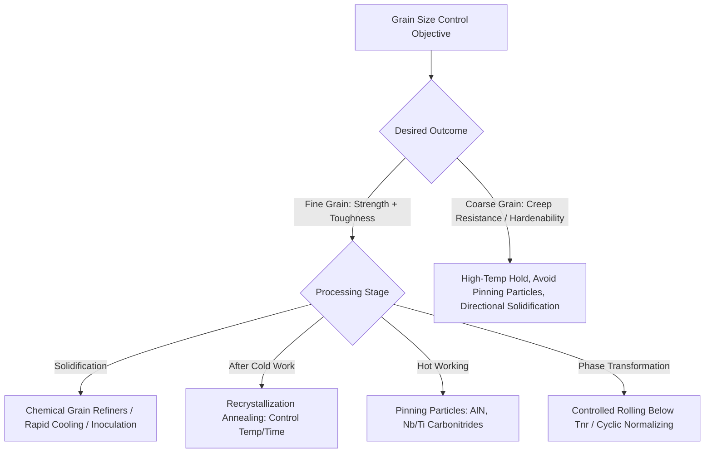
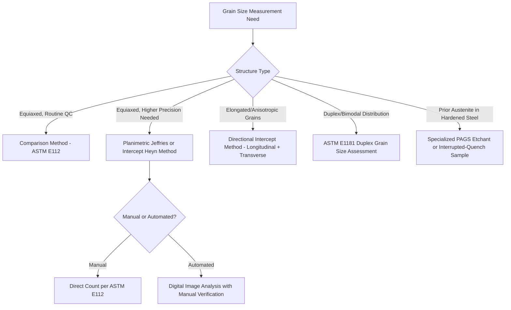

## Grain Size Control and Measurement

### Overview

Grain size is one of the most influential microstructural parameters in metallurgy, governing strength, toughness, hardenability, formability, and many other mechanical and physical properties. Grain size control involves manipulating nucleation and growth during solidification, recrystallization, and phase transformation, while grain size measurement provides the quantitative basis for specification, quality control, and property prediction through standardized metallographic techniques.

### Significance of Grain Size on Properties

**Key Points**

- **Hall-Petch relationship**: Yield strength increases with decreasing grain size according to $\sigma_y = \sigma_0 + k_y d^{-1/2}$, where $\sigma_0$ is the friction stress (lattice resistance to dislocation motion) and $k_y$ is a material-specific strengthening coefficient; grain boundaries act as barriers to dislocation motion, and finer grains provide more boundary area per unit volume, increasing strength.
- **Toughness and ductile-to-brittle transition temperature (DBTT)**: Fine grain size lowers the DBTT in body-centered cubic metals (notably ferritic steels), because smaller grains reduce the effective slip/cleavage plane length available for crack propagation, requiring higher stress to trigger brittle fracture at a given temperature—this is the basis for grain refinement being one of the few strengthening mechanisms that improves both strength and toughness simultaneously.
- **Hardenability**: Coarser austenite grain size increases hardenability (deeper hardening on quenching) because fewer grain boundaries are available as nucleation sites for competing transformation products (ferrite, pearlite), delaying these reactions and allowing martensite to form at slower cooling rates; this is a case where coarse grain size is sometimes deliberately tolerated or even sought (within limits) for hardenability purposes, illustrating that "finer is always better" does not universally apply.
- **Creep resistance**: At elevated temperature, coarser grain size is generally beneficial for creep resistance, because grain boundaries are preferential sites for diffusional creep and grain boundary sliding; this is the opposite property trend from room-temperature strength/toughness, meaning high-temperature alloys are sometimes intentionally processed for coarse or even directionally solidified/single-crystal structures.
- **Fatigue and formability**: Fine grain size generally improves fatigue strength (more barriers to slip band formation/crack initiation) and, notably for sheet forming, improves surface finish after forming (coarse grains produce visible "orange peel" surface roughness during stretch forming) while sometimes reducing total formability slightly compared to specific coarser-grain conditions optimized for deep drawing.

### Mechanisms of Grain Size Control

**Key Points**

- **Solidification grain refinement**: Controlled by nucleation rate relative to growth rate during casting; rapid cooling, chemical grain refiners (e.g., Al-Ti-B master alloys in aluminum casting, or inoculation in cast iron/steel), and mechanical/electromagnetic stirring during solidification all promote finer as-cast grain structure by increasing effective nucleation site density.
- **Recrystallization grain size control**: After cold working, annealing causes recrystallization (nucleation and growth of new, strain-free grains); recrystallized grain size is controlled by the amount of prior cold work (more cold work generally produces finer recrystallized grain size, up to a point) and annealing temperature/time (higher temperature and longer time promote larger recrystallized grains and subsequent grain growth).
- **Grain growth inhibition (Zener pinning)**: Second-phase particles (carbides, nitrides, oxides) pin grain boundaries, resisting migration and thereby limiting grain growth during high-temperature processing (hot rolling, normalizing, carburizing); this is the mechanism exploited by aluminum-killed "fine-grain practice" steels (AlN particles) and by microalloyed HSLA steels (Nb, Ti carbonitrides) to maintain fine austenite grain size during reheating and hot working.
- **Controlled thermomechanical processing**: As discussed in the context of HSLA steels, deformation below the recrystallization stop temperature (Tnr) accumulates strain in unrecrystallized austenite, providing abundant nucleation sites for fine ferrite on subsequent transformation—a deliberate grain-size-control strategy distinct from simple grain-growth inhibition.
- **Phase transformation grain refinement**: Repeated normalizing or specific transformation cycling (e.g., cyclic normalizing, or the grain-refining effect of the austenite-to-ferrite-to-austenite cycle in steel) can progressively refine grain size beyond what a single treatment achieves, since each new austenite grain nucleates independently at prior ferrite/pearlite boundaries.
- **Coarsening/deliberate coarse-grain processing**: For applications favoring coarse grain size (creep resistance, certain magnetic properties, hardenability), high-temperature holds, avoidance of pinning particles (e.g., using aluminum-deoxidized but not fully AlN-pinned "coarse-grain practice" steel), or directional solidification/single-crystal casting techniques (superalloy turbine blades) are used.

### Grain Size Manipulation Overview

### Standard Grain Size Measurement Methods

**Key Points**

- **ASTM E112 (Standard Test Methods for Determining Average Grain Size)**: The primary governing standard in North American practice, providing several measurement approaches:
  - **Comparison method**: Visual comparison of the etched, polished microstructure against a set of standard reference chart images at fixed magnification (typically 100x), assigning an ASTM grain size number (G) based on the closest match—fast but somewhat subjective, suitable for routine quality control.
  - **Planimetric (Jeffries) method**: Counting the number of grains within a known circular or rectangular test area (accounting for grains intersecting the boundary, typically counted as one-half), then calculating grains per unit area and converting to ASTM grain size number.
  - **Intercept (Heyn) method**: Counting the number of grain boundary intersections along one or more straight test lines of known length superimposed on the micrograph, calculating the mean lineal intercept length, and converting to grain size number—generally considered more precise and less subjective than the comparison method, and applicable to non-equiaxed (elongated) grain structures using directional intercept counts.
- **ASTM grain size number (G)**: Related to the number of grains per square inch at 100x magnification ($N_{ae}$) by $N_{ae} = 2^{G-1}$; higher G numbers indicate finer grain size (e.g., G=8 is a fine grain typical of many quality steels, G=1 or coarser indicates a very coarse structure).
- **ISO 643**: The international standard equivalent, using a similar comparative and planimetric methodology with slightly different reference charts and index numbering conventions; care must be taken not to directly equate ASTM G numbers with ISO index numbers without confirming the specific conversion.
- **Etching for grain boundary revelation**: Different etchants reveal grain boundaries in different alloy systems (e.g., picral or nital for ferritic/pearlitic steel, various oxidizing or specialized etchants for austenitic stainless steel, aluminum, or other alloys); prior austenite grain boundaries in hardened steel require specific etchants (e.g., saturated aqueous picric acid with a wetting agent) since the room-temperature martensitic structure does not directly reveal the parent austenite boundaries.

### Grain Size Number Relationship Schematic

<svg xmlns="http://www.w3.org/2000/svg" viewBox="0 0 700 380" font-family="sans-serif">
<text x="350" y="25" text-anchor="middle" font-size="16" font-weight="bold">ASTM Grain Size Number vs Grain Count (svg_diagram)</text>
<line x1="80" y1="330" x2="620" y2="330" stroke="black" stroke-width="2" />
<line x1="80" y1="330" x2="80" y2="50" stroke="black" stroke-width="2" />
<text x="350" y="355" text-anchor="middle" font-size="13">ASTM Grain Size Number (G)</text>
<text x="35" y="200" text-anchor="middle" font-size="13" transform="rotate(-90,35,200)">Grains per sq in at 100x (log)</text>
<path d="M 100 300 L 200 260 L 300 210 L 400 160 L 500 110 L 580 70" stroke="blue" stroke-width="2" fill="none" />
<circle cx="100" cy="300" r="4" fill="blue" />
<text x="100" y="320" font-size="10" text-anchor="middle">G=1 Coarse</text>
<circle cx="580" cy="70" r="4" fill="blue" />
<text x="580" y="55" font-size="10" text-anchor="middle">G=10 Fine</text>
</svg>

### Intercept Method Illustration

<svg xmlns="http://www.w3.org/2000/svg" viewBox="0 0 700 380" font-family="sans-serif">
<text x="350" y="25" text-anchor="middle" font-size="16" font-weight="bold">Heyn Intercept Method Concept (svg_diagram)</text>
<rect x="100" y="60" width="500" height="280" fill="none" stroke="black" stroke-width="1" />
<path d="M 130 100 L 200 90 L 260 130 L 320 100 L 380 140 L 440 110 L 500 150 L 560 120" fill="none" stroke="gray" stroke-width="1.5" />
<path d="M 120 180 L 190 200 L 250 170 L 310 210 L 370 180 L 430 220 L 490 190 L 550 210" fill="none" stroke="gray" stroke-width="1.5" />
<path d="M 140 270 L 210 250 L 270 290 L 330 260 L 390 300 L 450 270 L 510 310 L 570 280" fill="none" stroke="gray" stroke-width="1.5" />
<path d="M 180 60 L 180 340 M 280 60 L 280 340 M 380 60 L 380 340 M 480 60 L 480 340" fill="none" stroke="gray" stroke-width="1" />
<line x1="110" y1="200" x2="590" y2="200" stroke="red" stroke-width="2" />
<circle cx="190" cy="200" r="3" fill="red" />
<circle cx="255" cy="200" r="3" fill="red" />
<circle cx="315" cy="200" r="3" fill="red" />
<circle cx="380" cy="200" r="3" fill="red" />
<circle cx="445" cy="200" r="3" fill="red" />
<circle cx="510" cy="200" r="3" fill="red" />
<text x="350" y="365" text-anchor="middle" font-size="12">Test line length / number of intersections = mean intercept length</text>
</svg>

### Grain Boundary Intersections Along Test Line

**Example**

A test line of 500 μm total length superimposed on a micrograph crosses 25 grain boundaries; the mean lineal intercept length is $\bar{L} = 500/25 = 20\ \mu m$. This value is then converted to an ASTM grain size number using the standard tables or formulas in ASTM E112, providing a quantitative, reproducible grain size determination less prone to the observer subjectivity inherent in the comparison chart method.

### Special Considerations in Grain Size Assessment

**Key Points**

- **Duplex/bimodal grain structures**: Some processing conditions (e.g., incomplete recrystallization, or abnormal/secondary recrystallization) produce a mixed grain size distribution (fine matrix grains with scattered coarse grains); ASTM E1181 specifically addresses characterizing and reporting duplex grain size distributions, since a single average grain size number can be misleading for such structures.
- **Prior austenite grain size (PAGS) in hardened steel**: Because martensite does not directly reveal the parent austenite grain boundaries under standard etching, PAGS assessment requires specialized etching techniques (as noted above) or, alternatively, examination of the material in the as-quenched (unhardened, i.e., interrupted quench or normalized) condition where austenite grain boundaries are still directly visible; PAGS is a critical quality parameter since coarse PAGS is associated with reduced toughness in quenched and tempered steel.
- **Non-equiaxed (elongated/pancaked) grains**: Common in heavily rolled or forged products (and deliberately produced in controlled-rolled HSLA steel, as discussed elsewhere); the intercept method with separate longitudinal and transverse test line orientations is used to characterize grain aspect ratio and anisotropy rather than reporting a single averaged grain size number.
- **Automated image analysis**: Modern metallography increasingly uses digital image analysis software to perform intercept or planimetric counts automatically from digitized micrographs, improving throughput and reducing (though not entirely eliminating) subjective judgment, particularly in distinguishing true grain boundaries from other microstructural features (twin boundaries, subgrain boundaries, etching artifacts) that can confound automated detection. [Inference] The reliability of automated grain size analysis depends significantly on image quality, etching technique, and software calibration; manual verification against standard methods remains common practice for critical/reportable results.

### Grain Size Measurement Method Selection

### Application Context: Grain Size Specification in Practice

**Key Points**

- **Steel product specifications**: Many structural, pressure vessel, and pipeline steel specifications require a minimum ASTM grain size number (i.e., a maximum grain size limit) as a quality/toughness assurance measure, verified by mill certification testing per ASTM E112.
- **Fine-grain vs. coarse-grain practice steels**: Historically distinguished by deoxidation practice (aluminum-killed fine-grain steels vs. semi-killed/rimmed coarse-grain steels), fine-grain practice remains standard for most modern structural and pressure-vessel steel due to the toughness benefits discussed above.
- **Carburizing steel grain size**: Case-hardening (carburizing) grades are specifically required to exhibit fine, stable austenite grain size during the extended high-temperature carburizing cycle (to avoid coarsening that would degrade core toughness); this is a primary driver for the aluminum/niobium fine-grain practice in carburizing steel grades (e.g., 8620, 4320).

**Related Topics**

- Hall-Petch Relationship and Strengthening Mechanisms
- Recrystallization and Grain Growth Kinetics
- Zener Pinning and Second-Phase Particle Effects on Grain Boundaries
- Prior Austenite Grain Size Assessment in Hardened Steel
- ASTM E112 vs. ISO 643 Grain Size Standards
- Duplex Grain Size Structures (ASTM E1181)
- Controlled Rolling and Austenite Grain Refinement in HSLA Steel
- Directional Solidification and Single-Crystal Grain Structures in Superalloys