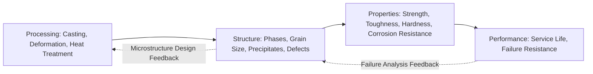
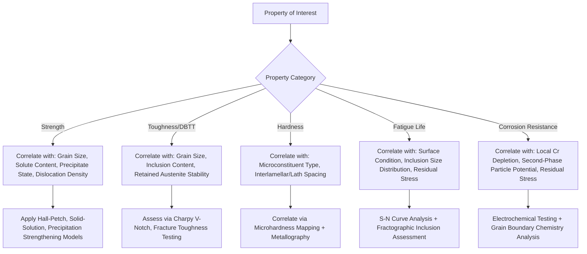

## Microstructure Property Correlations

### Overview

Microstructure-property correlations form the conceptual foundation of physical metallurgy: the systematic relationships between phase constitution, grain/particle morphology, defect density, and the resulting mechanical, physical, and chemical properties of a material. Understanding these correlations allows metallurgists to predict properties from processing/microstructure data, diagnose failures by working backward from properties to microstructural causes, and design heat treatments and alloys to target specific property combinations.

### The Processing-Structure-Property-Performance Paradigm

**Key Points**

- The central organizing framework in materials science: **Processing** (casting, deformation, heat treatment) determines **Structure** (phases, grain size, defects, precipitates), which determines **Properties** (strength, toughness, hardness, corrosion resistance), which determines **Performance** (component service life, failure resistance) in the actual application.
- This framework implies a two-way analytical capability: forward prediction (given known processing, predict structure and properties) for alloy/process design, and backward diagnosis (given observed properties or failure, infer the microstructural cause and the processing deviation responsible) for failure analysis and quality control.
- Microstructure-property correlations are the critical middle link connecting the physically observable microstructure to the macroscopically measured properties that determine whether a component performs as intended.

### Processing-Structure-Property-Performance Chain

### Strength Contributions and Superposition

**Key Points**

- Total yield strength is commonly modeled as the superposition of several independent strengthening mechanisms, each correlating with a specific microstructural feature:

  $$\sigma_y = \sigma_0 + \sigma_{ss} + \sigma_{gb} + \sigma_{ppt} + \sigma_\rho$$

  where $\sigma_0$ is the lattice friction stress (Peierls stress), $\sigma_{ss}$ is solid-solution strengthening (correlates with substitutional/interstitial solute concentration), $\sigma_{gb}$ is grain boundary strengthening (Hall-Petch, correlates with grain size $d^{-1/2}$), $\sigma_{ppt}$ is precipitation/dispersion strengthening (correlates with precipitate size, spacing, and coherency), and $\sigma_\rho$ is dislocation (work-hardening) strengthening (correlates with dislocation density $\rho^{1/2}$).
- **Solid solution strengthening**: Correlates with the atomic size mismatch and modulus mismatch between solute and solvent atoms; larger mismatch produces a stronger, more localized lattice strain field that impedes dislocation motion more effectively per atomic percent solute.
- **Precipitation strengthening mechanisms**: Correlate with whether dislocations shear through precipitates (coherent, small, soft precipitates—strengthening increases with precipitate size up to a point) or bypass them via Orowan looping (larger, incoherent precipitates—strengthening decreases with increasing interparticle spacing), producing the characteristic strength-vs-aging-time peak observed in age-hardenable alloys.
- **Dislocation density and cold work**: Correlates directly with the degree of plastic strain imparted (e.g., percent cold reduction in rolling/drawing); this is the basis of strain hardening and explains why cold-worked (non-heat-treatable) alloys are strengthened by mechanical deformation rather than precipitation.

### Toughness and Fracture Correlations

**Key Points**

- **Grain size and DBTT**: As established in grain size control, finer grain size correlates with lower ductile-to-brittle transition temperature in BCC metals, since grain boundaries interrupt cleavage crack propagation paths, requiring the crack to renucleate at each boundary.
- **Inclusion content and toughness/anisotropy**: Non-metallic inclusions (sulfides, oxides) act as void nucleation sites during ductile fracture and, when elongated by rolling, create pronounced through-thickness toughness anisotropy (correlating directly with lamellar tearing susceptibility and reduced through-thickness Charpy/tensile ductility); inclusion shape control (Ca treatment to globularize sulfides) is a direct microstructure-property intervention targeting this correlation.
- **Retained austenite and toughness**: In quenched and tempered steel, small amounts of stable retained austenite can improve toughness (by blunting crack tips via localized stress-induced transformation, a limited TRIP-like effect), while excessive or unstable retained austenite that transforms to untempered martensite during service or subsequent cooling can severely embrittle the structure—illustrating that the same microstructural constituent can correlate with either beneficial or detrimental property outcomes depending on its stability and morphology.
- **Precipitate-free zones (PFZs) and localized deformation**: In some age-hardened alloys, precipitate-free zones adjacent to grain boundaries (formed by solute depletion during quenching/aging) are softer than the matrix, concentrating strain locally and correlating with reduced ductility and intergranular fracture tendency.
- **Notch sensitivity and microstructural homogeneity**: Banded or segregated microstructures (e.g., alternating ferrite-pearlite bands from Mn segregation) correlate with anisotropic toughness and can promote crack path deflection or, conversely, provide easy crack propagation paths along band interfaces depending on orientation relative to loading.

### Hardness-Strength-Microstructure Correlations

**Key Points**

- **Hardness-tensile strength correlation**: For many steels, an approximately linear empirical correlation exists between Brinell hardness and ultimate tensile strength (a commonly cited approximation is $UTS (MPa) \approx 3.45 \times HB$), allowing hardness testing to serve as a practical, non-destructive proxy for strength estimation, though this correlation's accuracy varies with microstructure type and alloy composition, and this is a well-established empirical practice rather than a fundamental physical law.
- **Microconstituent-hardness relationships**: Distinct microstructural constituents in steel correlate with characteristic hardness ranges (e.g., ferrite typically ~90–100 HB, pearlite ~200–300 HB depending on interlamellar spacing, bainite ~250–450 HB depending on formation temperature, martensite ~500–700+ HB depending on carbon content), providing metallographers a practical tool for correlating observed microstructure with expected bulk hardness and flagging inconsistencies (e.g., unexpectedly low hardness in a nominally martensitic structure suggesting incomplete transformation or excessive retained austenite).
- **Interlamellar spacing and pearlite strength**: Finer pearlite interlamellar spacing (produced by faster cooling/lower transformation temperature) correlates with higher strength and hardness, following a Hall-Petch-like relationship analogous to grain size effects, since the ferrite-cementite interfaces act similarly to grain boundaries in impeding dislocation motion.

### Microstructure-Hardness Correlation Schematic

<svg xmlns="http://www.w3.org/2000/svg" viewBox="0 0 700 380" font-family="sans-serif">
<text x="350" y="25" text-anchor="middle" font-size="16" font-weight="bold">Hardness Ranges by Steel Microconstituent (svg_diagram)</text>
<line x1="80" y1="330" x2="620" y2="330" stroke="black" stroke-width="2" />
<line x1="80" y1="330" x2="80" y2="50" stroke="black" stroke-width="2" />
<text x="350" y="355" text-anchor="middle" font-size="13">Microconstituent</text>
<text x="35" y="200" text-anchor="middle" font-size="13" transform="rotate(-90,35,200)">Hardness (HB, approximate)</text>
<rect x="110" y="300" width="80" height="30" fill="lightblue" stroke="black" />
<text x="150" y="345" text-anchor="middle" font-size="11">Ferrite</text>
<rect x="230" y="230" width="80" height="100" fill="lightgreen" stroke="black" />
<text x="270" y="345" text-anchor="middle" font-size="11">Pearlite</text>
<rect x="350" y="150" width="80" height="180" fill="orange" stroke="black" />
<text x="390" y="345" text-anchor="middle" font-size="11">Bainite</text>
<rect x="470" y="70" width="80" height="260" fill="red" stroke="black" />
<text x="510" y="345" text-anchor="middle" font-size="11">Martensite</text>
</svg>

### Fatigue Behavior Correlations

**Key Points**

- **Surface condition and fatigue initiation**: Since fatigue cracks predominantly initiate at surfaces, surface microstructure (decarburization, surface roughness, residual stress from grinding/machining) correlates strongly with fatigue life, often more strongly than bulk microstructure; this underlies the effectiveness of surface treatments (shot peening, case hardening, nitriding) that introduce beneficial compressive residual stress or increase surface hardness specifically.
- **Inclusion size and high-cycle fatigue**: In high-strength steels, fatigue crack initiation frequently occurs at large non-metallic inclusions (particularly oxides), and fatigue strength at very high cycle counts correlates inversely with the size of the largest inclusion present (statistically governed by extreme-value distributions of inclusion population), which is why clean-steel practice (vacuum degassing, inclusion shape control) is critical for high-performance fatigue-critical components (bearings, aerospace components).
- **Microstructural homogeneity and scatter**: Heterogeneous microstructures (mixed grain size, banding, retained casting porosity) correlate with increased scatter in fatigue life data, complicating design allowables and often necessitating more conservative design factors for such materials compared to more homogeneous, well-processed alternatives.

### Corrosion Resistance Correlations

**Key Points**

- **Chromium depletion and intergranular corrosion**: As discussed in stainless steel sensitization, chromium carbide precipitation at grain boundaries correlates directly with localized Cr depletion in the adjacent matrix, and this depletion (rather than bulk composition) determines local susceptibility to intergranular attack—a clear example where a specific, localized microstructural feature (not the average bulk composition) governs the property outcome.
- **Second-phase particles and galvanic microcells**: Intermetallic particles or carbides with different electrochemical potential than the surrounding matrix can act as local anodes or cathodes, correlating with pitting initiation sites; this explains why controlling second-phase particle size, distribution, and composition is a corrosion-resistance lever independent of bulk alloy content.
- **Residual stress and stress corrosion cracking**: Tensile residual stress (from welding, cold work, or quenching) correlates strongly with SCC susceptibility in susceptible alloy-environment combinations, illustrating that mechanical/thermal processing history, not just microstructural phase constitution, is part of the full "microstructure" relevant to property correlation in a broad sense.

### Correlation Framework by Property Category

### Practical Application: Failure Analysis Backward Correlation

**Example**

A shaft fails in service with a brittle, intergranular fracture surface at lower-than-expected applied stress. Metallographic examination reveals coarse prior austenite grain size and evidence of temper embrittlement (intergranular fracture path along prior austenite boundaries). Working backward through the microstructure-property correlation: coarse PAGS correlates with reduced toughness and higher DBTT; combined with evidence of slow cooling through the temper embrittlement range (375–575°C) causing impurity segregation to those same boundaries, the failure analyst can conclude the root cause was likely an improper (too-slow) cooling rate after tempering, rather than a material defect or design error—directly connecting the observed fracture microstructure back to a specific processing deviation.

### Quantitative Microstructural Characterization Tools

**Key Points**

- **Optical and electron microscopy**: Provide direct qualitative and (with image analysis) quantitative microstructural data (phase fractions, grain size, precipitate size/spacing) correlating to the property models described above.
- **Microhardness mapping**: Provides spatially resolved hardness data (e.g., across a weld HAZ or case-hardened depth profile) that correlates directly with local microstructural variation, often used to validate that heat treatment achieved the intended structure without full metallographic sectioning at every location.
- **Electron backscatter diffraction (EBSD)**: Provides crystallographic orientation data enabling quantification of grain boundary character (e.g., fraction of special/low-energy boundaries vs. random high-angle boundaries), which correlates with properties such as intergranular corrosion/cracking resistance (grain boundary engineering) beyond what simple grain size alone predicts.
- **X-ray diffraction (XRD)**: Used to quantify retained austenite fraction, residual stress (via peak shift), and phase identification, each of which correlates with specific property outcomes as discussed above (retained austenite stability/toughness, residual stress/fatigue-SCC).
- [Inference] The specific quantitative correlation coefficients or model constants (e.g., Hall-Petch $k_y$ values, hardness-strength conversion factors) are alloy-system and even product-form specific; general relationships describe the expected trend and mechanism, while precise design values should be obtained from testing of the specific material and condition of interest.

**Related Topics**

- Hall-Petch Relationship and Strengthening Mechanism Superposition
- Precipitation Hardening and Orowan Strengthening Mechanisms
- Ductile-to-Brittle Transition Temperature and Charpy Impact Testing
- Retained Austenite: Stability, Measurement, and Property Effects
- Clean Steel Practice and Inclusion Engineering for Fatigue Performance
- Electron Backscatter Diffraction (EBSD) and Grain Boundary Engineering
- Sensitization and Localized Corrosion Mechanisms
- Failure Analysis Methodology: Fractography to Root Cause