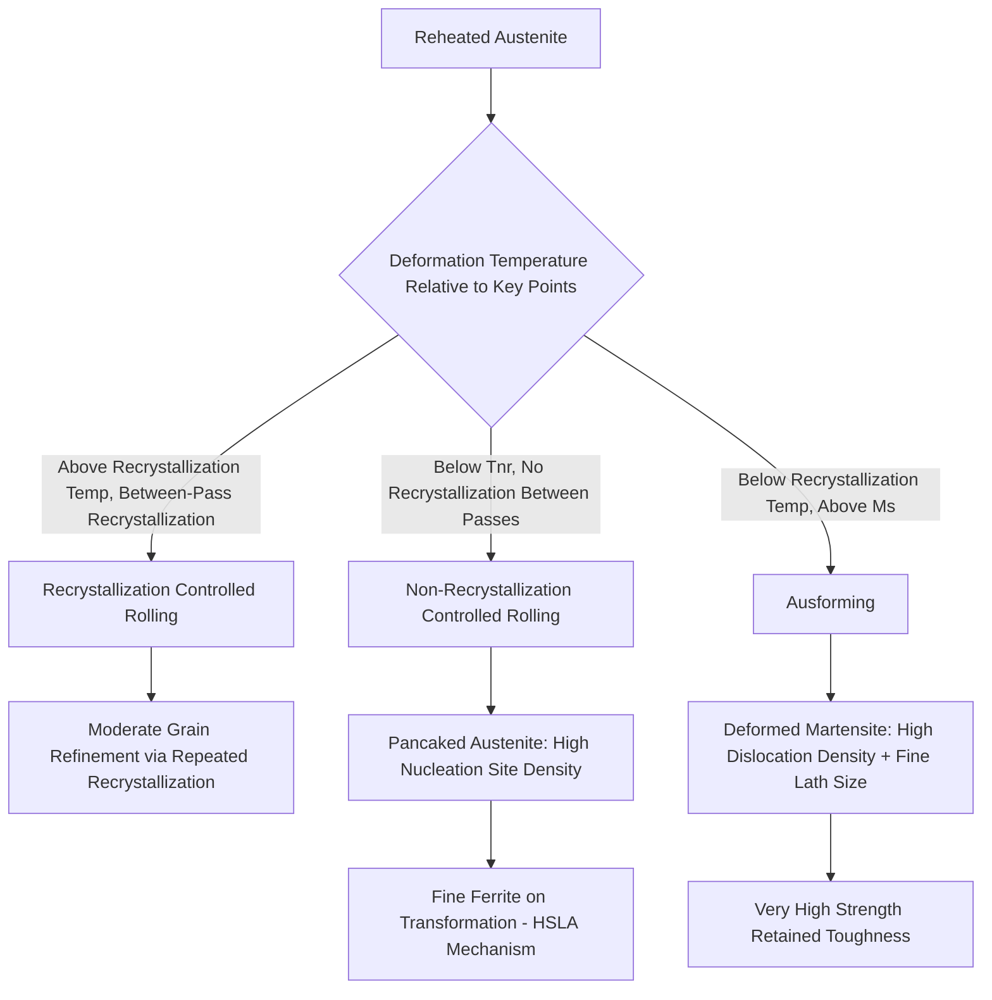
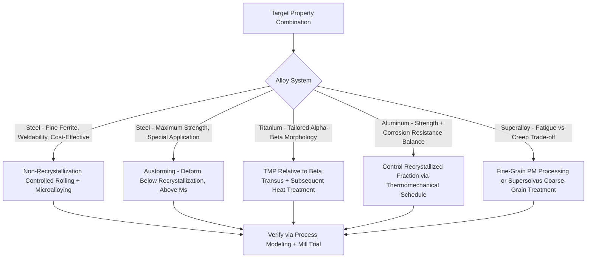

## Thermomechanical Processing

### Overview

Thermomechanical processing (TMP) is the deliberate combination and sequencing of deformation (rolling, forging, extrusion) and thermal treatment (heating, controlled cooling) to simultaneously control shape and microstructure in a single integrated process, rather than treating forming and heat treatment as separate, independent steps. By coupling the mechanisms of work hardening, recovery, recrystallization, and phase transformation with precise temperature and strain control, TMP achieves microstructures and property combinations that would be difficult or impossible to obtain through conventional forming followed by separate heat treatment.

### Fundamental Concept: Coupling Deformation and Transformation

**Key Points**

- Conventional processing sequences deformation (typically hot working, primarily for shape) and heat treatment (for property development) as largely separate operations; TMP instead exploits the fact that deformation history (strain, strain rate, temperature) directly influences subsequent transformation behavior (nucleation site density, transformation kinetics, resulting phase morphology).
- The central mechanism is that plastic deformation of austenite (in the case of steel) introduces defects (dislocations, deformation bands) and, if performed below the recrystallization temperature, elongates/"pancakes" the grains—both effects dramatically increase the number of potential nucleation sites available when the austenite subsequently transforms to ferrite, bainite, or martensite, refining the final transformed microstructure well beyond what static (undeformed) transformation would produce.
- TMP is fundamentally about controlling **when, how much, and at what temperature** deformation occurs relative to the recrystallization and phase transformation temperatures, rather than simply controlling the total amount of deformation.

### Classification of Thermomechanical Processing Regimes

**Key Points**

- **Recrystallization controlled rolling (RCR)**: Deformation performed above the recrystallization temperature between passes, with sufficient time/temperature for the deformed austenite to fully recrystallize before the next pass; each recrystallization event refines the austenite grain size somewhat, but the grain-refining benefit is more limited than non-recrystallization rolling.
- **Conventional (unconstrained) controlled rolling / Non-recrystallization controlled rolling (as used in HSLA processing)**: Finishing passes performed below the recrystallization stop temperature ($T_{nr}$), where deformed austenite does not recrystallize between passes, accumulating strain and producing highly elongated, pancaked austenite grains with a very high density of internal deformation bands—this is the specific mechanism underlying fine ferrite grain size in controlled-rolled HSLA steel.
- **Ausforming**: Deformation of metastable austenite below the recrystallization temperature but above the martensite start temperature (Ms), followed by quenching to martensite; the deformation is retained in the resulting martensite structure (as a very high dislocation density combined with fine martensite lath size), producing exceptionally high strength (often exceeding conventional quench-and-temper strength at equivalent alloy content) at reasonably retained toughness, though the process is complex and less common in large-scale commercial production due to the narrow processing window and equipment demands (requiring deformation capability at the specific isothermal holding temperature).
- **Interrupted/isothermal treatments combined with deformation**: Various specialized TMP routes exist that combine austempering-like isothermal holds with intermediate deformation steps to further tailor bainitic or ausferritic structures (relevant to advanced bainitic steel and ADI-adjacent processing research).

### Thermomechanical Processing Regime Comparison

### Controlled Rolling Process Stages (Steel Plate/Strip)

**Key Points**

- **Stage 1 (Roughing/Recrystallization rolling)**: Conducted at high temperature (typically above 1000°C), where each deformation pass is followed by rapid recrystallization before the next pass; this stage primarily breaks down the coarse as-cast/reheated grain structure and achieves the bulk of the shape reduction, with the recrystallization cycles providing progressive but limited grain refinement.
- **Stage 2 (Transfer/holding)**: The partially rolled product is held or air-cooled to bring the temperature down to the finishing rolling range, allowing the microstructure to stabilize before non-recrystallization rolling begins.
- **Stage 3 (Finishing/Non-recrystallization rolling)**: Conducted below $T_{nr}$ (typically 900–950°C for microalloyed steel, controlled by the specific Nb/Ti content, which retards recrystallization to progressively lower temperatures with increasing microalloy content), where strain accumulates in unrecrystallized, elongated austenite grains without intervening recrystallization.
- **Stage 4 (Controlled/accelerated cooling)**: After finishing rolling, cooling rate is controlled (natural air cooling for standard HSLA, or accelerated cooling via run-out table water sprays for higher-strength/bainitic grades) to determine the final transformation product and its scale/distribution, exploiting the abundant nucleation sites created in Stage 3.
- [Inference] The specific temperature thresholds for each stage transition are alloy- and product-specific, determined by the particular Nb, Ti, V content and the desired final microstructure; production mills calibrate these parameters through extensive process modeling and trial rolling for each grade.

### Effect of TMP Parameters on Final Grain Size

<svg xmlns="http://www.w3.org/2000/svg" viewBox="0 0 700 400" font-family="sans-serif">
<text x="350" y="25" text-anchor="middle" font-size="16" font-weight="bold">Finish Rolling Temperature vs Final Ferrite Grain Size (svg_diagram)</text>
<line x1="80" y1="350" x2="620" y2="350" stroke="black" stroke-width="2" />
<line x1="80" y1="350" x2="80" y2="50" stroke="black" stroke-width="2" />
<text x="350" y="375" text-anchor="middle" font-size="13">Finish Rolling Temperature (decreasing right)</text>
<text x="35" y="200" text-anchor="middle" font-size="13" transform="rotate(-90,35,200)">Final Ferrite Grain Size</text>
<path d="M 120 90 Q 200 100 280 150 Q 380 220 480 280 Q 550 310 590 320" stroke="blue" stroke-width="2" fill="none" />
<line x1="340" y1="350" x2="340" y2="50" stroke="red" stroke-dasharray="6,4" />
<text x="340" y="45" font-size="11" fill="red" text-anchor="middle">Tnr</text>
<text x="150" y="80" font-size="11">Recrystallization Regime: Coarser</text>
<text x="480" y="270" font-size="11">Non-Recrystallization Regime: Progressively Finer</text>
</svg>

### TMP in Non-Ferrous Alloy Systems

**Key Points**

- **Aluminum alloys**: TMP concepts apply to controlling recrystallized vs. unrecrystallized (fibrous) grain structure in wrought aluminum products, influencing texture, corrosion resistance (exfoliation/stress-corrosion susceptibility can correlate with grain structure and orientation), and mechanical anisotropy; specific thermomechanical schedules are used to develop desired combinations of strength and corrosion resistance in age-hardenable aluminum alloys (e.g., controlling the degree of recrystallization in 7xxx series aerospace aluminum plate).
- **Titanium alloys**: TMP is central to developing the specific alpha-beta phase morphology (equiaxed vs. lamellar/Widmanstätten alpha, or bimodal structures) in alpha-beta titanium alloys (e.g., Ti-6Al-4V), where deformation temperature relative to the beta transus, combined with subsequent heat treatment, determines the resulting microstructure and its characteristic strength-ductility-fatigue property balance; this is one of the most well-developed and commercially critical TMP application areas outside of steel.
- **Nickel-based superalloys**: TMP (including specific forging strategies) is used to control grain size and, in some powder-metallurgy superalloy processing, to achieve fine, uniform grain structure or, alternatively, to enable subsequent supersolvus heat treatment for coarse-grain creep-optimized structures—illustrating the same fine-vs-coarse trade-off (strength/fatigue vs. creep resistance) discussed generally in grain size control, now realized through deliberate deformation processing rather than heat treatment alone.

### Ausforming Process Detail

**Key Points**

- **Sequence**: Austenitize, cool rapidly to a temperature below the recrystallization temperature but above Ms (this requires alloy compositions with sufficient hardenability to avoid premature transformation to ferrite/pearlite/bainite during the necessary holding/deformation time at this intermediate temperature—hence ausforming is generally restricted to steels with substantial alloy content), deform (typically by rolling or forging) at this temperature to impart substantial strain into the metastable austenite, then quench to complete martensitic transformation.
- **Resulting structure**: The retained deformation substructure (dense dislocation tangles, deformation bands) is inherited by the martensite that subsequently forms, refining the martensite lath/block structure beyond what conventional (undeformed) austenitizing and quenching would produce, and the very high dislocation density itself contributes additional strengthening.
- **Property outcome**: Ausformed steel can achieve tensile strengths significantly higher than conventionally quenched-and-tempered steel of the same composition, often with improved or comparable toughness at the higher strength level—a favorable strength-toughness combination attributed to the finer, more uniform substructure. [Inference] Commercial application of ausforming has remained relatively limited compared to conventional Q&T processing, due to the process complexity (requiring deformation equipment capable of operating at the specific intermediate isothermal temperature) and narrower achievable component geometries compared to standard hot rolling/forging followed by separate heat treatment.

### Practical Process Control Considerations

**Key Points**

- **Rolling mill capability**: Non-recrystallization controlled rolling and accelerated cooling require mills with sufficient rolling force capacity at lower (finishing) temperatures (since flow stress increases as temperature decreases) and, for accelerated cooling, dedicated run-out table cooling systems with precise water flow and coiling temperature control.
- **Process modeling**: Modern TMP schedule design relies heavily on computational process models (incorporating recrystallization kinetics, $T_{nr}$ prediction from composition, and transformation kinetics) to predict and optimize rolling schedules for target microstructures, reducing the trial-and-error historically required for new grade development.
- **Composition-process interaction**: TMP effectiveness depends directly on alloy composition (particularly microalloy content for recrystallization retardation), meaning TMP schedule and alloy design are developed together rather than independently—a controlled-rolling schedule optimized for one Nb/Ti content will not produce the same result if simply applied to a different composition.

### TMP Design Decision Framework

**Related Topics**

- Recrystallization Stop Temperature (Tnr) and Microalloy Precipitation Effects
- Ausforming and Deformation-Induced Martensite Substructure Refinement
- Alpha-Beta Titanium Alloy Processing (Ti-6Al-4V Microstructure Control)
- Accelerated Cooling and Run-Out Table Technology in Plate/Strip Mills
- Recrystallization vs. Recovery in Hot-Worked Metals
- Superalloy Grain Size Optimization: Fine-Grain Fatigue vs Coarse-Grain Creep
- Aluminum Alloy Recrystallization Control for Corrosion Resistance
- Process Modeling and Simulation for Hot Rolling Schedule Design