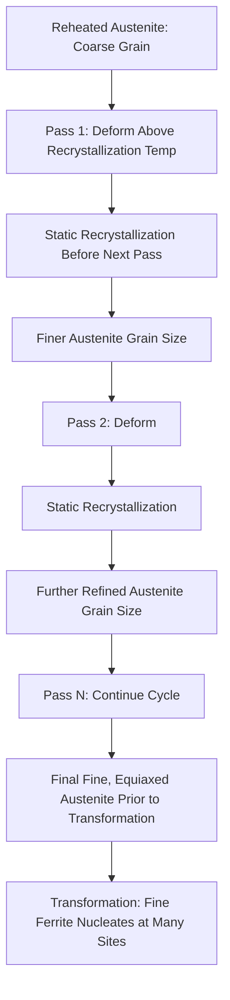
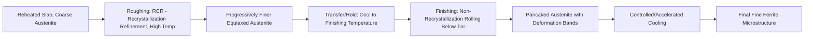
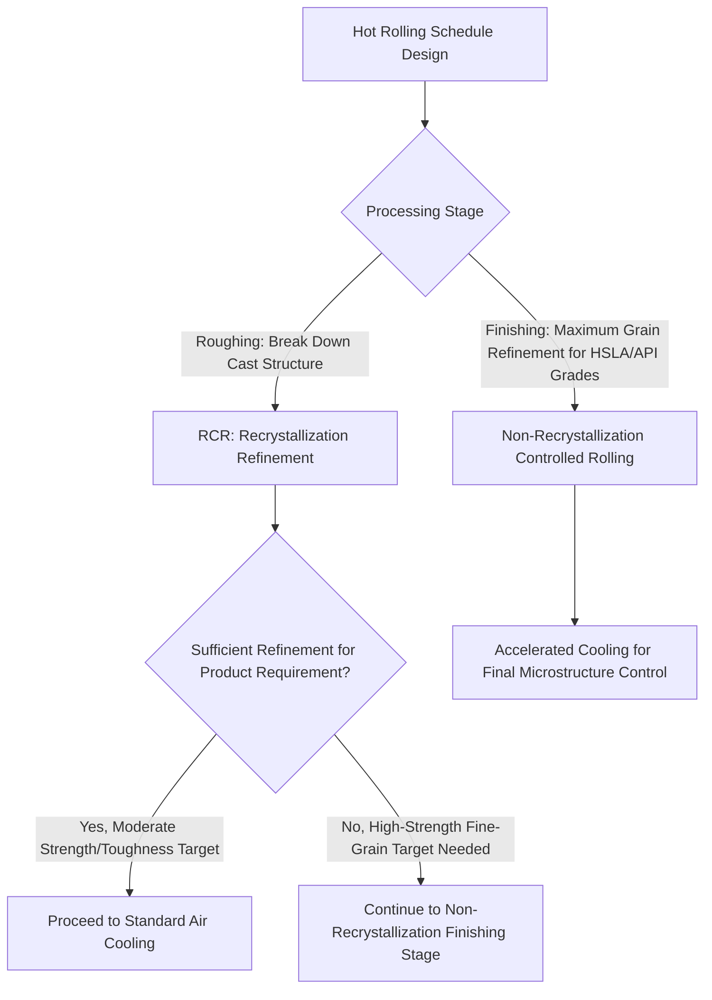

## Recrystallization Controlled Rolling

### Overview

Recrystallization Controlled Rolling (RCR) is a thermomechanical processing strategy in which hot deformation passes are conducted at temperatures where the deformed austenite fully (or nearly fully) recrystallizes between passes, using the repeated cycle of deformation and static recrystallization itself as the primary grain-refinement mechanism. This distinguishes RCR from non-recrystallization (conventional) controlled rolling, where finishing passes are deliberately conducted below the recrystallization stop temperature to accumulate strain in unrecrystallized austenite; RCR instead relies on progressive grain refinement through successive recrystallization cycles, each one starting from a finer prior grain size than the last.

### Mechanism: Static Recrystallization Refinement Cycle

**Key Points**

- Each rolling pass introduces plastic strain into the austenite, increasing stored dislocation energy; if the interpass time and temperature are sufficient, this stored energy drives nucleation and growth of new, strain-free austenite grains (static recrystallization) before the next pass is applied.
- Critically, the recrystallized grain size produced after each pass is generally **finer than the pre-deformation grain size**, provided the applied strain exceeds a critical threshold (sufficient to nucleate recrystallization) but is not so light that only partial/inhomogeneous recrystallization occurs; repeating this deform-recrystallize cycle over multiple passes produces a progressive, cumulative refinement of the austenite grain size with each pass.
- This behavior contrasts with simple **grain growth**, which would occur if the austenite were held at temperature without further deformation—continued deformation-recrystallization cycling is what sustains and compounds the refinement, rather than allowing static coarsening to dominate between passes.
- The refined, fine, equiaxed austenite grain structure produced by RCR provides many transformation nucleation sites when subsequently cooled through the transformation range, yielding a correspondingly refined final ferritic (or ferrite-pearlite) microstructure—though the grain-refining contribution from RCR is generally considered more moderate than that achievable through non-recrystallization controlled rolling for equivalent microalloy content, since RCR's refinement stops accumulating once passes are spaced too far apart in temperature/time for full recrystallization to occur before transformation.

### Recrystallization-Refinement Cycle Schematic

### Governing Parameters

**Key Points**

- **Interpass time and temperature**: Must be sufficient for the recrystallization reaction to reach completion (or a high fraction completion) before the next deformation pass; if interpass time is too short or temperature too low, recrystallization is incomplete, leaving a mixed (partially recrystallized, partially retained-strain) structure that can produce a duplex or non-uniform final grain size—an outcome generally considered undesirable in standard RCR practice, though it marks the practical transition zone toward non-recrystallization controlled rolling.
- **Strain per pass**: Must exceed a critical strain to nucleate recrystallization efficiently; strains below this critical value produce only partial recrystallization or grain growth of existing grains rather than new fine-grain nucleation, so pass schedule design (reduction per pass) is calibrated against this threshold.
- **Recrystallization temperature dependence on composition**: Alloying and microalloying elements (particularly Nb, and to a lesser degree Ti and V) raise the temperature at which recrystallization occurs and slow its kinetics (solute drag and, at sufficient concentration/precipitation conditions, strain-induced precipitate pinning of recrystallization fronts); RCR is therefore generally applied to plain carbon and lower-microalloyed steels or to the higher-temperature roughing stages of more heavily microalloyed steel schedules, since heavy Nb additions can retard recrystallization enough to push the process into the non-recrystallization regime even at relatively high rolling temperatures.
- **Number of passes**: Because each recrystallization cycle provides a bounded amount of refinement (with diminishing returns as the grain size decreases and the driving force for further refinement per cycle correspondingly changes), a practical number of properly spaced passes is needed to reach a target fine austenite grain size—simply increasing total reduction without appropriate interpass recrystallization does not substitute for the cyclic refinement mechanism itself.

### RCR Process Window Concept

<svg xmlns="http://www.w3.org/2000/svg" viewBox="0 0 700 400" font-family="sans-serif">
<text x="350" y="25" text-anchor="middle" font-size="16" font-weight="bold">Interpass Time-Temperature Regimes (svg_diagram)</text>
<line x1="80" y1="350" x2="620" y2="350" stroke="black" stroke-width="2" />
<line x1="80" y1="350" x2="80" y2="50" stroke="black" stroke-width="2" />
<text x="350" y="375" text-anchor="middle" font-size="13">Rolling Temperature (decreasing right)</text>
<text x="35" y="200" text-anchor="middle" font-size="13" transform="rotate(-90,35,200)">Time Available Between Passes</text>
<rect x="100" y="60" width="180" height="270" fill="lightblue" opacity="0.4" stroke="blue" />
<text x="190" y="90" text-anchor="middle" font-size="11" fill="blue">Full Recrystallization Zone: RCR Regime</text>
<rect x="280" y="60" width="120" height="270" fill="yellow" opacity="0.4" stroke="orange" />
<text x="340" y="90" text-anchor="middle" font-size="10" fill="black">Partial Recrystallization: Avoid (Duplex Grain Risk)</text>
<rect x="400" y="60" width="200" height="270" fill="lightcoral" opacity="0.4" stroke="red" />
<text x="500" y="90" text-anchor="middle" font-size="11" fill="red">Non-Recrystallization Zone: Below Tnr</text>
</svg>

### RCR vs. Non-Recrystallization Controlled Rolling

**Key Points**

- **RCR**: Deformation occurs entirely above the recrystallization stop temperature; grain refinement is achieved through cumulative recrystallization cycles; produces equiaxed, refined austenite grains prior to transformation; typically applied at higher rolling temperatures and is generally the simpler, more forgiving process from a mill-scheduling perspective since it does not require precise control right down to a critical low finishing temperature.
- **Non-recrystallization controlled rolling**: Finishing passes deliberately conducted below $T_{nr}$; grain refinement achieved through strain accumulation in pancaked, unrecrystallized austenite providing intragranular nucleation sites (deformation bands) in addition to grain boundary nucleation sites; generally produces finer final ferrite grain size than RCR alone for a given microalloy system, and is the dominant mechanism specifically exploited in modern HSLA/API linepipe steel processing.
- **Combined schedules**: Most practical commercial hot-rolling schedules for microalloyed steel combine both regimes sequentially—an initial RCR-type roughing sequence (recrystallization refinement at high temperature, breaking down the coarse cast structure efficiently) followed by non-recrystallization finishing passes (further refinement via pancaking) before controlled/accelerated cooling; RCR is therefore often best understood as the roughing-stage counterpart within a broader controlled-rolling schedule rather than a fully separate/exclusive processing route in modern practice.
- [Inference] Pure RCR schedules with no non-recrystallization finishing stage are more characteristic of older or lower-microalloy-content practice, or products where the finer refinement achievable via non-recrystallization rolling is not required; contemporary high-strength/high-toughness plate and pipe steel production generally relies on the non-recrystallization finishing stage as the primary fine-grain-producing step, using RCR principally for the roughing sequence.

### Combined Rolling Schedule Incorporating RCR

### Metallurgical Rationale and Limitations

**Key Points**

- **Advantage**: RCR achieves meaningful grain refinement without requiring the mill to reach very low finishing temperatures (which demand higher rolling forces and more sophisticated mill capability), making it a practically accessible refinement route, particularly for roughing stands or for products/compositions where extreme fine-grain refinement is not the primary target.
- **Limitation**: The degree of refinement achievable through RCR alone is generally more limited than non-recrystallization rolling for equivalent microalloy content, because each recrystallization event, while refining grain size, also erases the deformation substructure (dislocations, deformation bands) that would otherwise provide additional intragranular ferrite nucleation sites during subsequent transformation—RCR refines via grain boundary density increase alone, while non-recrystallization rolling adds intragranular nucleation site density on top of grain boundary refinement.
- **Sensitivity to schedule deviation**: If interpass times drift into the partial-recrystallization regime (e.g., due to mill delays or schedule changes), a mixed/duplex grain structure can result, since some grains fully recrystallize while others retain partial strain; this is a recognized quality risk in RCR practice requiring consistent mill pass scheduling.
- **Composition interaction**: Because microalloying elements retard recrystallization kinetics and raise the recrystallization temperature, RCR process windows and achievable refinement are directly linked to the specific Nb/Ti/V content of the steel being rolled, meaning RCR schedules cannot be transferred directly between different microalloy compositions without recalibration.

### Selection Context Within Broader TMP Strategy

**Related Topics**

- Non-Recrystallization Controlled Rolling and Recrystallization Stop Temperature (Tnr)
- Static Recrystallization Kinetics in Hot-Deformed Austenite
- Microalloy Precipitation and Recrystallization Retardation (Nb, Ti, V)
- Duplex/Mixed Grain Size Risk from Incomplete Recrystallization
- Accelerated Cooling and Run-Out Table Practice
- HSLA Steel Grain Refinement Strategy
- Hot Rolling Mill Pass Schedule Design and Process Modeling
- Grain Size Measurement in Controlled-Rolled Steel Products