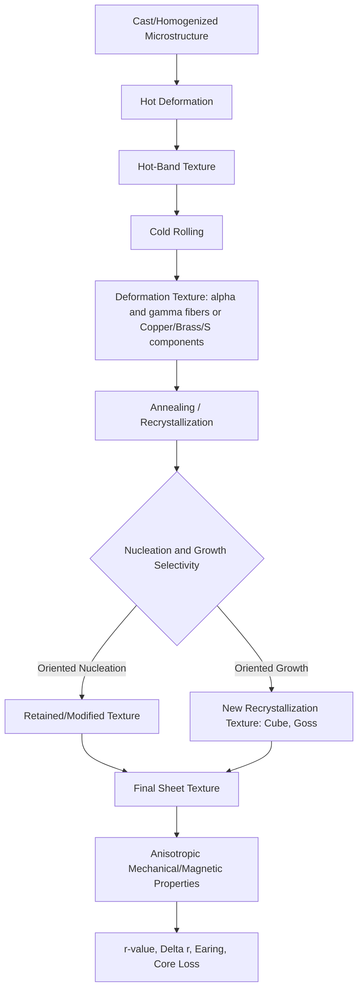

## Texture and Anisotropy Control

### Overview

Crystallographic texture refers to the non-random distribution of crystallite (grain) orientations within a polycrystalline material. Anisotropy is the directional dependence of a material's mechanical, physical, or magnetic properties, and in metals it arises predominantly from texture. Understanding and controlling texture is central to optimizing sheet formability, magnetic performance, weld integrity, and mechanical property uniformity in engineering alloys.

### Fundamentals of Crystallographic Texture

#### Definition and Origin

In an idealized polycrystal with completely random grain orientations, bulk properties are isotropic — identical in all directions — because directional effects at the single-crystal level average out. Real polycrystalline metals almost never achieve this random state. Deformation processing (rolling, drawing, extrusion) and phase transformations impose preferred orientations because:

- Slip and twinning systems activate selectively depending on the orientation of individual grains relative to the applied stress
- Grains rotate toward stable orientations as deformation accumulates
- Recrystallization nucleation and growth are orientation-selective
- Phase transformations (e.g., austenite-to-ferrite) follow orientation relationships (Kurdjumov-Sachs, Nishiyama-Wassermann)

#### Representation of Texture

**Miller Indices Notation**

Texture components are described using the notation $\{hkl\}\langle uvw \rangle$, where $\{hkl\}$ is the crystallographic plane parallel to the sheet/sample surface (rolling plane) and $\langle uvw \rangle$ is the crystallographic direction parallel to the rolling direction.

**Pole Figures**

A pole figure is a stereographic projection showing the distribution of a specific crystallographic plane normal (pole) relative to the sample reference frame (rolling direction, transverse direction, normal direction). Intensity contours indicate the density of poles in a given orientation, measured typically via X-ray diffraction (XRD), electron backscatter diffraction (EBSD), or neutron diffraction.

**Orientation Distribution Function (ODF)**

The ODF, $f(g)$, describes the volume fraction of crystallites with orientation $g$ within an infinitesimal orientation-space element, expressed as a function of Euler angles $(\varphi_1, \Phi, \varphi_2)$ in Bunge notation:

$$dV/V = f(g)\,dg$$

The ODF is typically computed from multiple incomplete pole figures via harmonic series expansion, providing a full three-dimensional orientation distribution rather than a 2D projection.

**Euler Space Sections**

ODFs for cubic metals are commonly displayed as constant-$\varphi_2$ sections (frequently $\varphi_2 = 45°$ for BCC, $\varphi_2 = 0°/65°$ for FCC), on which standard texture fibers and components are plotted as reference points.

### SVG Diagram — Pole Figure Concept

<svg xmlns="http://www.w3.org/2000/svg" viewBox="0 0 520 300" font-family="sans-serif">
<text x="260" y="20" text-anchor="middle" font-size="14" font-weight="bold">Pole Figure Construction (svg_diagram)</text>

<circle cx="140" cy="160" r="90" fill="none" stroke="#333" stroke-width="1.5" />
<line x1="140" y1="70" x2="140" y2="250" stroke="#999" stroke-width="1" />
<line x1="50" y1="160" x2="230" y2="160" stroke="#999" stroke-width="1" />
<text x="140" y="62" text-anchor="middle" font-size="11">RD</text>
<text x="238" y="164" text-anchor="middle" font-size="11">TD</text>
<text x="90" y="105" text-anchor="middle" font-size="10">ND (center)</text>

<circle cx="140" cy="120" r="5" fill="#c0392b" />
<circle cx="110" cy="140" r="5" fill="#c0392b" />
<circle cx="170" cy="140" r="5" fill="#c0392b" />
<circle cx="140" cy="200" r="5" fill="#c0392b" />
<circle cx="115" cy="185" r="5" fill="#c0392b" />
<circle cx="165" cy="185" r="5" fill="#c0392b" />

<text x="140" y="270" text-anchor="middle" font-size="11">Clustered poles = preferred orientation</text>

<g transform="translate(360,140)">
<rect x="-40" y="-40" width="80" height="80" fill="none" stroke="#2c3e50" stroke-width="2" transform="rotate(15)" />
<rect x="-40" y="-40" width="80" height="80" fill="none" stroke="#2980b9" stroke-width="2" stroke-dasharray="4,3" transform="rotate(-10)" />
<text x="0" y="90" text-anchor="middle" font-size="10">Grains rotated toward preferred orientation</text>
</g>
</svg>

### Deformation Textures

#### FCC Metals (Cu, Al, Ni, Austenitic Steels)

Rolling deformation textures in FCC metals typically fall into two broad classes:

- **Copper-type (pure metal) texture**: Dominated by Copper $\{112\}\langle111\rangle$, S $\{123\}\langle634\rangle$, and Brass $\{011\}\langle211\rangle$ components; favored in high stacking-fault-energy (SFE) metals like pure Cu and Al where dislocation cross-slip is easy
- **Brass-type (alloy) texture**: Dominated by Brass $\{011\}\langle211\rangle$ and Goss $\{011\}\langle100\rangle$ components; favored in low-SFE alloys (Cu-Zn brass, austenitic stainless steel) where deformation twinning becomes a significant accommodation mechanism

The transition between these texture types is governed by stacking fault energy, which controls the relative ease of cross-slip versus twinning.

#### BCC Metals (Ferritic Steels, Nb, Mo, W)

BCC rolling textures are described using two principal fibers in Euler space:

- **α-fiber**: $\langle110\rangle$ parallel to the rolling direction, spanning from $\{001\}\langle110\rangle$ to $\{111\}\langle110\rangle$
- **γ-fiber**: $\{111\}$ parallel to the sheet normal direction, spanning $\{111\}\langle110\rangle$ to $\{111\}\langle112\rangle$

The γ-fiber is of particular technological importance because it is strongly associated with favorable deep-drawing formability in low-carbon and interstitial-free (IF) steels.

#### HCP Metals (Ti, Mg, Zn, Zr)

HCP metals develop strong basal or prismatic textures depending on the $c/a$ ratio, which determines the relative critical resolved shear stress (CRSS) for basal slip, prismatic slip, pyramidal slip, and twinning.

- **Titanium** ($c/a = 1.587$, below ideal 1.633): Basal poles tilt away from the normal direction toward the transverse direction, producing a split basal texture
- **Magnesium** ($c/a = 1.624$, near ideal): Strong basal texture develops with $c$-axes aligned near the sheet normal, a major contributor to magnesium's poor room-temperature formability due to limited independent slip systems (violation of the von Mises criterion) and pronounced tension-compression yield asymmetry from $\{10\bar{1}2\}$ twinning

### Recrystallization Textures

Annealing after cold deformation can either retain, weaken, or completely replace the deformation texture through nucleation and growth selectivity.

#### Cube Texture

The Cube component, $\{001\}\langle100\rangle$, is a classic recrystallization texture in FCC metals such as Al and Cu, arising preferentially from oriented nucleation at pre-existing cube-oriented deformation bands and/or oriented growth advantage. Strong cube texture is generally undesirable for deep-drawing sheet because it produces severe planar anisotropy (pronounced earing).

#### Goss Texture

The Goss component, $\{011\}\langle100\rangle$, is critical in grain-oriented electrical steels (Fe-3%Si), where an extremely sharp Goss texture is engineered via secondary recrystallization (abnormal grain growth) using fine MnS/AlN inhibitor particles to suppress normal grain growth until sharply Goss-oriented grains consume the matrix.

#### Recrystallized BCC Steel Textures

In low-carbon steels, annealing after cold rolling aims to strengthen the γ-fiber ($\{111\}\langle uvw\rangle$) at the expense of the α-fiber, since $\{111\}$-oriented grains have their close-packed planes parallel to the sheet surface, maximizing plastic strain ratio $r$.

### Quantifying Anisotropy: The Lankford Parameter

#### Definition

The plastic strain ratio (Lankford coefficient), $r$, quantifies the resistance of sheet metal to thinning during uniaxial tension and is defined as:

$$r = \frac{\varepsilon_w}{\varepsilon_t}$$

where $\varepsilon_w$ is the true width strain and $\varepsilon_t$ is the true thickness strain during a tensile test.

#### Normal Anisotropy

Since $r$ varies with the angle $\theta$ from the rolling direction, the average (normal) anisotropy is:

$$\bar{r} = \frac{r_0 + 2r_{45} + r_{90}}{4}$$

A high $\bar{r}$ value indicates resistance to thinning and favors deep-drawability, since deformation is accommodated more readily in the plane of the sheet than through the thickness.

#### Planar Anisotropy

Planar anisotropy, $\Delta r$, describes the variation of $r$ within the plane of the sheet and predicts earing behavior during deep drawing:

$$\Delta r = \frac{r_0 - 2r_{45} + r_{90}}{2}$$

A positive $\Delta r$ produces ears at $0°/90°$ to the rolling direction; a negative $\Delta r$ produces ears at $45°$.

**Key Points**

- $\bar{r} > 1$: favorable for deep drawing (γ-fiber texture in steel)
- $\bar{r} = 1$: isotropic through-thickness behavior
- $\Delta r \neq 0$: causes earing, requiring trimming allowance and material waste in can/cup drawing operations
- Strong $\{111\}$ texture in BCC steels can yield $\bar{r}$ values of 1.8–2.2, versus $\bar{r} \approx 1.0$ for random texture [Unverified: exact values are alloy- and processing-dependent]

### Yield Locus and Anisotropic Plasticity Models

#### Hill's 1948 Anisotropic Yield Criterion

For orthotropic sheet metal, Hill's quadratic yield function generalizes the von Mises criterion:

$$F(\sigma_y - \sigma_z)^2 + G(\sigma_z - \sigma_x)^2 + H(\sigma_x - \sigma_y)^2 + 2L\tau_{yz}^2 + 2M\tau_{zx}^2 + 2N\tau_{xy}^2 = 1$$

where $F, G, H, L, M, N$ are anisotropy coefficients determined from directional yield stresses and $r$-values.

#### Barlat Yield Functions

More advanced non-quadratic yield surfaces (Barlat Yld91, Yld2000-2d, Yld2004-18p) were developed to better capture the yield surface curvature of textured FCC and BCC sheet metals, particularly for aluminum alloys where Hill48 significantly mispredicts biaxial and shear behavior. These models use linear transformations of the stress tensor calibrated against multiple directional flow stresses and $r$-values, and are standard inputs for sheet-forming finite element simulations (e.g., LS-DYNA, AutoForm).

### Anisotropy in Non-Mechanical Properties

#### Magnetic Anisotropy (Electrical Steels)

In BCC iron, the $\langle100\rangle$ direction is the easy magnetization axis, while $\langle111\rangle$ is the hard axis. Grain-oriented (GO) electrical steel exploits the sharp Goss texture to align $\langle001\rangle$ directions with the rolling direction, minimizing core loss and maximizing permeability along that axis for transformer laminations. Non-oriented (NO) electrical steel instead targets a random or $\{100\}\langle0vw\rangle$-type texture to provide more isotropic magnetic response for rotating machines (motors, generators).

#### Elastic Anisotropy

Single-crystal elastic stiffness is inherently anisotropic (e.g., for cubic crystals, described by $C_{11}$, $C_{12}$, $C_{44}$). The Zener anisotropy ratio:

$$A = \frac{2C_{44}}{C_{11} - C_{12}}$$

quantifies the degree of elastic anisotropy ($A = 1$ for elastically isotropic cubic crystals). Textured polycrystals inherit directional elastic modulus variation, affecting spring-back prediction in forming and dimensional stability in precision components.

#### Corrosion and Etching Anisotropy

Certain crystallographic planes exhibit different dissolution rates and susceptibility to localized corrosion (e.g., intergranular corrosion sensitivity varies with grain boundary character distribution, which correlates with bulk texture in some alloy systems). [Inference: the strength of this correlation is alloy- and environment-specific and should not be generalized without system-specific validation]

### Texture Measurement Techniques

| Technique | Spatial Resolution | Information Obtained | Typical Application |
| --- | --- | --- | --- |
| X-ray diffraction (XRD) pole figures | Bulk-averaged (mm–cm beam) | Macrotexture, ODF | Production QC, sheet products |
| Electron backscatter diffraction (EBSD) | Sub-micron to micron | Microtexture, grain boundary character, local misorientation | Research, grain-level texture evolution |
| Neutron diffraction | Bulk (cm-scale, high penetration) | Bulk texture through thick sections | Thick plates, welds, in-situ studies |
| Synchrotron XRD | Bulk to local, fast acquisition | High-speed texture evolution during in-situ deformation/annealing | Advanced research |

### Mermaid Diagram — Texture Evolution Pathway

### Processing Strategies for Texture Control

#### Alloy Design

- Adjusting stacking fault energy (SFE) via alloying additions (e.g., Zn content in brass) shifts deformation texture between copper-type and brass-type
- Micro-alloying with Nb, Ti in IF steels promotes strong γ-fiber development by controlling recrystallization kinetics and precipitate pinning

#### Thermomechanical Processing

- **Rolling schedule**: Reduction per pass, total reduction, and rolling temperature (hot vs. cold vs. warm) strongly influence resulting deformation texture sharpness
- **Cross-rolling**: Rolling in two perpendicular directions can randomize texture and reduce planar anisotropy ($\Delta r$)
- **Annealing parameters**: Heating rate, soak temperature, and time control recrystallization texture selection; rapid heating can suppress oriented nucleation and favor different texture components than slow heating
- **Inhibitor particle engineering**: In grain-oriented steel, fine, closely spaced MnS/AlN precipitates control secondary recrystallization kinetics essential for sharp Goss texture development

#### Severe Plastic Deformation (SPD)

Techniques such as equal-channel angular pressing (ECAP) and high-pressure torsion (HPT) impose extreme shear strains that can produce distinctly different texture components (simple shear textures) compared to conventional rolling, sometimes used to weaken or randomize texture for improved isotropy in ultrafine-grained materials. [Inference: texture outcomes in SPD are highly route- and pass-count-dependent]

### Worked Example

**Example**

A cold-rolled and annealed low-carbon steel sheet is tested in tension at $0°$, $45°$, and $90°$ to the rolling direction, yielding $r_0 = 1.8$, $r_{45} = 1.3$, $r_{90} = 2.2$.

Normal anisotropy:

$$\bar{r} = \frac{1.8 + 2(1.3) + 2.2}{4} = \frac{6.6}{4} = 1.65$$

Planar anisotropy:

$$\Delta r = \frac{1.8 - 2(1.3) + 2.2}{2} = \frac{1.4}{2} = 0.7$$

**Interpretation**: $\bar{r} = 1.65$ indicates good deep-drawability (resistance to thickness thinning). The positive $\Delta r = 0.7$ predicts ear formation at $0°$ and $90°$ to the rolling direction, requiring extra trim allowance in deep-drawn cup production.

### Common Pitfalls and Practical Considerations

- Treating $\bar{r}$ as the sole formability metric ignores strain-hardening exponent $n$, which governs uniform elongation and stretch-forming limits independently of texture-driven anisotropy
- Assuming Hill48 is universally valid; it can produce non-physical (negative) predicted uniaxial yield stresses for strongly anisotropic aluminum alloys, necessitating non-quadratic yield functions
- Overlooking through-thickness texture gradients in thick plate or hot-rolled products, where surface and center layers can have substantially different textures due to differential strain and thermal history
- Neglecting that texture-driven anisotropy and grain-shape-driven (morphological) anisotropy can both contribute to directional properties; EBSD analysis is needed to separate these effects

**Related Topics**

- Recrystallization Kinetics and Grain Growth
- Deformation Twinning Mechanisms in HCP Metals
- Grain Boundary Character Distribution and Engineering
- Finite Element Simulation of Sheet Metal Forming
- Grain-Oriented vs. Non-Oriented Electrical Steel Production
- Stacking Fault Energy and Its Effect on Deformation Mechanisms
- EBSD Data Analysis and Orientation Mapping
- Severe Plastic Deformation Techniques (ECAP, HPT, ARB)