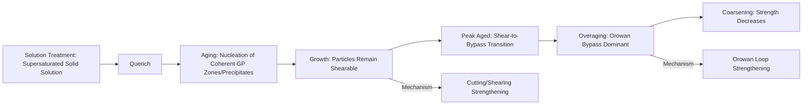

## Second Phase Particles and Their Effects

### Overview

Second phase particles are discrete regions of a distinct phase — differing in crystal structure, composition, or both — dispersed within a matrix phase. They arise from precipitation, solidification, solid-state reactions, or intentional powder-metallurgical addition, and they govern strength, ductility, toughness, fatigue resistance, recrystallization behavior, and grain size control in nearly all structural alloys. Understanding particle-matrix interactions is foundational to alloy design across steels, aluminum alloys, nickel superalloys, and composites.

### Classification of Second Phase Particles

#### By Origin

- **Precipitates**: Formed by solid-state phase transformation from a supersaturated solid solution (e.g., $\gamma'$ Ni$_3$(Al,Ti) in Ni-superalloys, $\theta'$ Al$_2$Cu in Al-Cu alloys)
- **Primary/Eutectic Phases**: Formed during solidification, often coarse and present from the as-cast state (e.g., primary Si in hypereutectic Al-Si alloys)
- **Dispersoids**: Fine, thermally stable particles introduced by powder metallurgy or internal oxidation, resistant to coarsening (e.g., Y$_2$O$_3$ in oxide dispersion strengthened, ODS, alloys)
- **Inclusions**: Typically non-metallic phases (oxides, sulfides, nitrides) originating from melt processing, generally considered deleterious to fracture and fatigue properties unless deliberately engineered (e.g., MnS for machinability)
- **Intermetallic Compounds**: Ordered phases with fixed or narrow stoichiometry (e.g., Fe$_3$C cementite, Ni$_3$Al, Laves phases)

#### By Coherency with Matrix

- **Coherent**: Lattice planes are continuous across the interface; strain fields exist but no dislocation is required at the boundary (e.g., early-stage GP zones, $\gamma'$ at small size)
- **Semi-coherent**: Partial lattice matching maintained by an array of interfacial dislocations that accommodate misfit
- **Incoherent**: No lattice continuity; a true interphase boundary exists, typically for particles that have grown beyond the coherency limit or that never shared a lattice relationship with the matrix

### SVG Diagram — Coherency States

<svg xmlns="http://www.w3.org/2000/svg" viewBox="0 0 620 260" font-family="sans-serif">
<text x="310" y="20" text-anchor="middle" font-size="14" font-weight="bold">Particle-Matrix Coherency (svg_diagram)</text>

<g transform="translate(90,60)">
<text x="0" y="-10" font-size="12" font-weight="bold">Coherent</text>
<g stroke="#2c3e50" stroke-width="1">
<line x1="0" y1="0" x2="0" y2="140" />
<line x1="20" y1="0" x2="20" y2="140" />
<line x1="40" y1="0" x2="40" y2="140" />
<line x1="60" y1="0" x2="60" y2="140" />
<line x1="0" y1="0" x2="60" y2="0" />
<line x1="0" y1="20" x2="60" y2="20" />
<line x1="0" y1="40" x2="60" y2="40" />
</g>
<rect x="5" y="45" width="50" height="50" fill="#e67e22" fill-opacity="0.3" stroke="#e67e22" />
<g stroke="#2c3e50" stroke-width="1">
<line x1="0" y1="100" x2="60" y2="100" />
<line x1="0" y1="120" x2="60" y2="120" />
<line x1="0" y1="140" x2="60" y2="140" />
</g>
<text x="30" y="160" font-size="9" text-anchor="middle">Continuous lattice, strained</text>
</g>

<g transform="translate(280,60)">
<text x="0" y="-10" font-size="12" font-weight="bold">Semi-coherent</text>
<g stroke="#2c3e50" stroke-width="1">
<line x1="0" y1="0" x2="0" y2="40" />
<line x1="20" y1="0" x2="20" y2="40" />
<line x1="40" y1="0" x2="40" y2="40" />
<line x1="60" y1="0" x2="60" y2="40" />
</g>
<rect x="5" y="45" width="50" height="50" fill="#e67e22" fill-opacity="0.3" stroke="#e67e22" />
<path d="M0,45 L10,40 M18,45 L28,40 M36,45 L46,40 M54,45 L60,42" stroke="#c0392b" stroke-width="1.5" />
<text x="30" y="42" font-size="8" fill="#c0392b" text-anchor="middle">misfit dislocations</text>
<g stroke="#2c3e50" stroke-width="1">
<line x1="0" y1="100" x2="60" y2="100" />
<line x1="0" y1="120" x2="60" y2="120" />
<line x1="0" y1="140" x2="60" y2="140" />
</g>
<text x="30" y="160" font-size="9" text-anchor="middle">Partial match + dislocation array</text>
</g>

<g transform="translate(470,60)">
<text x="0" y="-10" font-size="12" font-weight="bold">Incoherent</text>
<g stroke="#2c3e50" stroke-width="1">
<line x1="0" y1="0" x2="0" y2="40" />
<line x1="20" y1="0" x2="20" y2="40" />
<line x1="40" y1="0" x2="40" y2="40" />
<line x1="60" y1="0" x2="60" y2="40" />
</g>
<circle cx="30" cy="70" r="28" fill="#e67e22" fill-opacity="0.3" stroke="#e67e22" />
<g stroke="#2c3e50" stroke-width="1">
<line x1="0" y1="100" x2="60" y2="100" />
<line x1="0" y1="120" x2="60" y2="120" />
<line x1="0" y1="140" x2="60" y2="140" />
</g>
<text x="30" y="160" font-size="9" text-anchor="middle">Distinct interphase boundary</text>
</g>
</svg>

### Thermodynamics and Kinetics of Precipitation

#### Nucleation

Classical nucleation theory describes the free energy change for forming a spherical precipitate of radius $r$:

$$\Delta G = \frac{4}{3}\pi r^3 \Delta G_v + 4\pi r^2 \gamma + \frac{4}{3}\pi r^3 \Delta G_s$$

where $\Delta G_v$ is the volumetric chemical free energy change (negative, driving force), $\gamma$ is the interfacial energy (positive, resisting), and $\Delta G_s$ is the strain energy per unit volume from misfit (positive, resisting). The critical nucleus radius $r^*$ and activation barrier $\Delta G^*$ are found by setting $d(\Delta G)/dr = 0$:

$$r^* = \frac{-2\gamma}{\Delta G_v + \Delta G_s}$$

Coherent nuclei minimize $\gamma$ at the expense of higher $\Delta G_s$; incoherent nuclei show the reverse trade-off. This is why coherent precipitation is typically favored at high supersaturation/low temperature (nucleation-rate-limited regime).

#### Growth and Coarsening (Ostwald Ripening)

After initial precipitation, particles coarsen to reduce total interfacial energy, following Lifshitz-Slyozov-Wagner (LSW) kinetics:

$$\bar{r}^3 - \bar{r}_0^3 = kt$$

where $\bar{r}$ is mean particle radius at time $t$, and $k$ depends on interfacial energy, solute diffusivity, and equilibrium solubility. Coarsening reduces the number density of particles while increasing their average size, generally lowering precipitation strengthening efficiency at long aging times or high temperatures (overaging).

### Strengthening Mechanisms

#### Precipitation/Age Hardening

Small, closely spaced, coherent or semi-coherent particles impede dislocation motion via two competing mechanisms:

**Particle Shearing** (small, coherent particles): Dislocations cut through particles, and the associated strengthening increment scales approximately with $\sqrt{r}$ (increasing with particle size in the shearable regime), following relations such as:

$$\Delta\tau \propto \left(\frac{\gamma_{APB}}{b}\right)^{3/2}\left(\frac{r f}{T}\right)^{1/2}$$

for ordered precipitates sheared with anti-phase boundary (APB) energy $\gamma_{APB}$, where $f$ is volume fraction and $T$ is dislocation line tension. [Unverified: exact prefactors vary by model formulation]

**Orowan Bypass** (larger, incoherent/semi-coherent particles): Dislocations bow around particles, leaving behind dislocation loops, with strengthening inversely proportional to interparticle spacing $\lambda$:

$$\Delta\tau_{Orowan} = \frac{Gb}{\lambda}$$

The transition between shearing and bypassing occurs at a critical particle size, producing the characteristic peak-aging phenomenon: strength increases with aging time as particles grow through the shearable regime, reaches a maximum near the shear-to-bypass transition, then decreases (overaging) as Orowan strengthening weakens with increasing $\lambda$ from continued coarsening.

#### Dispersion Strengthening

Dispersoids (e.g., oxide particles in ODS alloys) are incoherent, thermally stable, and do not coarsen appreciably even at high homologous temperatures, providing Orowan-type strengthening that persists to much higher service temperatures than conventional precipitation hardening, which is limited by precipitate coarsening and dissolution.

### Mermaid Diagram — Aging Curve and Mechanism Transition

### Effects on Recrystallization and Grain Growth

#### Zener Pinning

Second phase particles exert a retarding pressure on migrating grain boundaries, described by the Zener pinning relation:

$$P_z = \frac{3 f \gamma_{gb}}{2r}$$

where $f$ is particle volume fraction, $\gamma_{gb}$ is grain boundary energy, and $r$ is particle radius. This pinning pressure opposes the driving pressure for grain boundary migration and grain growth, $P_d = 2\gamma_{gb}/D$ (for grain diameter $D$), leading to a limiting (Zener-limited) grain size:

$$D_{lim} = \frac{4r}{3f}$$

This relationship underlies microalloyed steel design (Nb, Ti, V carbonitrides pinning austenite grain boundaries during reheating and controlled rolling) and grain-oriented electrical steel processing (MnS/AlN inhibitor particles enabling secondary recrystallization).

#### Particle-Stimulated Nucleation (PSN)

Large (typically >1 μm), incoherent particles generate localized deformation zones with high stored energy and lattice curvature during plastic deformation. These zones act as preferential nucleation sites for recrystallization, often producing randomized texture components rather than the deformation or oriented-nucleation textures that would otherwise dominate. PSN efficiency generally increases with particle size and local strain gradient around the particle.

### Effects on Fracture and Ductility

#### Void Nucleation, Growth, and Coalescence

Second phase particles, particularly hard, brittle inclusions and coarse intermetallics, are primary sites for microvoid nucleation during ductile fracture, either through particle cracking or interfacial decohesion from the matrix. The sequence proceeds:

1. Void nucleation at particle/matrix interfaces or through particle fracture under local stress concentration
2. Void growth driven by plastic strain and stress triaxiality (accelerated under high triaxiality, e.g., ahead of a crack tip or notch)
3. Void coalescence via localized shear banding or void-sheet linkage between neighboring voids, producing the characteristic dimpled fracture surface seen in ductile fracture

#### Effect of Particle Size, Shape, and Distribution

- **Fine, well-dispersed particles**: Generally beneficial for strength (via precipitation/dispersion strengthening) with manageable ductility penalty if particle-matrix cohesion is strong
- **Coarse, clustered, or elongated particles** (e.g., stringer-type MnS inclusions in rolled steel): Promote anisotropic ductility and toughness, with markedly reduced through-thickness ("short transverse") properties and increased susceptibility to lamellar tearing in weldments
- **Particle-free zones (PFZs)**: Regions adjacent to grain boundaries depleted of strengthening precipitates (due to solute drain to grain boundary precipitates or vacancy depletion near boundaries) that are mechanically softer than the matrix, promoting localized strain concentration and can contribute to intergranular fracture susceptibility, notably in some Al-Zn-Mg-Cu (7xxx series) tempers

### Alloy System Case Studies

**Example**

*Nickel-based superalloys*: The $\gamma'$ Ni$_3$(Al,Ti) phase precipitates coherently within the FCC $\gamma$ matrix. High volume fractions (up to ~60–70% in advanced single-crystal superalloys) combined with low lattice misfit produce excellent microstructural stability and creep resistance at elevated temperature. The $\gamma/\gamma'$ lattice misfit sign and magnitude control the rafting morphology (directional coarsening) that develops under stress at high temperature, which can be beneficial or detrimental to creep life depending on raft orientation relative to applied stress.

*Aluminum 2xxx and 7xxx series*: Age-hardening response is governed by sequences such as GP zones → $\theta''$ → $\theta'$ → $\theta$ (Al-Cu) or GP zones → $\eta'$ → $\eta$ (Al-Zn-Mg), with peak strength occurring at the semi-coherent transition phase stage before equilibrium incoherent phases dominate in the overaged condition.

*Microalloyed (HSLA) steels*: Fine Nb(C,N), Ti(C,N), and V(C,N) precipitates provide combined effects: austenite grain boundary pinning (Zener effect) during hot rolling and reheating, retardation of recrystallization between rolling passes (enabling controlled rolling/thermomechanical processing), and precipitation strengthening in ferrite upon cooling.

*Gray and ductile cast iron*: Graphite exists as a discrete second phase; its morphology (flake in gray iron vs. nodular/spheroidal in ductile iron, controlled via Mg or Ce treatment) dramatically affects stress concentration behavior and hence tensile ductility and impact toughness, despite similar matrix compositions.

### Analytical and Characterization Techniques

| Technique | Information Obtained |
| --- | --- |
| Transmission electron microscopy (TEM) | Particle size, morphology, coherency (via diffraction contrast), crystal structure |
| Scanning electron microscopy (SEM) + EDS | Particle composition, size distribution, spatial distribution at coarser scale |
| Atom probe tomography (APT) | 3D atomic-scale composition mapping, early-stage cluster/GP zone detection |
| Small-angle X-ray/neutron scattering (SAXS/SANS) | Statistical particle size distribution and volume fraction in bulk samples |
| Differential scanning calorimetry (DSC) | Precipitation/dissolution reaction temperatures and enthalpies |
| Thermodynamic/kinetic simulation (CALPHAD-coupled, e.g., Thermo-Calc/TC-PRISMA, JMatPro) | Predicted phase fractions, precipitation sequence, particle size evolution vs. time-temperature |

### Common Pitfalls and Practical Considerations

- Assuming all second phase particles are strengthening agents; inclusions and brittle intermetallics are frequently deleterious to toughness and fatigue life despite sometimes contributing minor hardness increases
- Neglecting the shear/bypass transition when interpreting aging curves, leading to incorrect assumptions that "more precipitation is always stronger" — overaging is a coarsening-driven softening regime
- Overlooking particle-free zones near grain boundaries in stress corrosion cracking (SCC) and intergranular fracture analysis of age-hardenable alloys
- Confusing particle volume fraction effects with particle spacing effects; Orowan strengthening depends on interparticle spacing $\lambda$, not merely volume fraction, so a given $f$ can produce different strengthening depending on size distribution
- Ignoring anisotropic inclusion morphology (stringers from hot rolling) when specifying through-thickness mechanical property requirements or weldability for plate steel

**Related Topics**

- Precipitation Hardening Heat Treatment Design (Solutionizing, Quenching, Aging)
- Zener Pinning and Grain Size Control in Microalloyed Steels
- Ductile Fracture Mechanisms: Void Nucleation, Growth, and Coalescence
- CALPHAD and Precipitation Kinetics Modeling (TC-PRISMA)
- Gamma Prime Microstructure and Rafting in Nickel Superalloys
- Oxide Dispersion Strengthened (ODS) Alloy Processing
- Inclusion Engineering and Steel Cleanliness Control