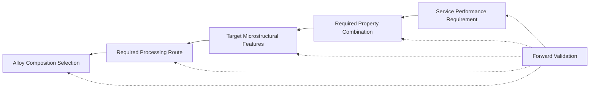

## Microstructural Design for Performance

### Overview

Microstructural design for performance is the systems-level integration of composition, processing, and resulting microstructure to meet a targeted combination of properties for a specific service application. Rather than optimizing a single microstructural feature in isolation, this discipline treats strength, ductility, toughness, fatigue resistance, corrosion resistance, and creep performance as interdependent outputs of a shared microstructural state, requiring deliberate trade-off management across the processing-structure-property-performance (PSPP) chain.

### The Processing-Structure-Property-Performance Paradigm

#### Conceptual Framework

The PSPP linkage, foundational to modern materials engineering, states that:

$$\text{Composition + Processing} \rightarrow \text{Microstructure} \rightarrow \text{Properties} \rightarrow \text{Performance}$$

Each arrow represents a mechanistic linkage that must be understood and, ideally, quantitatively modeled to enable predictive (rather than purely empirical) alloy and process design. Modern integrated computational materials engineering (ICME) approaches attempt to model each linkage explicitly, connecting thermodynamic (CALPHAD), kinetic (phase field, precipitation kinetics), and mechanistic (crystal plasticity, micromechanics) models into a continuous simulation chain.

#### Reverse Design Logic

Performance-driven microstructural design typically proceeds in reverse relative to the forward PSPP chain: starting from target performance requirements (e.g., a specific fatigue life at a given stress amplitude, a minimum fracture toughness at a minimum operating temperature), the required property combination is defined, the microstructural features that would deliver those properties are identified, and finally the composition and process route capable of producing that microstructure are selected.

### Mermaid Diagram — Reverse Design Logic

### Managing Fundamental Property Trade-offs

#### Strength-Ductility Trade-off

Most conventional strengthening mechanisms (solid solution, precipitation, dislocation/strain hardening, grain refinement below a certain limit) reduce ductility because they restrict dislocation mobility, which is also the mechanism enabling uniform plastic strain distribution. The exception, as discussed under microalloying and texture control, is grain refinement in its typical engineering range, which increases both strength and toughness simultaneously per Hall-Petch behavior — though at extremely fine (nanocrystalline) grain sizes, ductility can decrease again due to limited dislocation storage capacity within individual grains and grain-boundary-mediated deformation mechanisms becoming dominant.

**Advanced strategies to circumvent this trade-off include:**

- **Multiphase microstructures** (e.g., dual-phase steel: soft ferrite + hard martensite islands) that combine a ductile matrix with a strengthening constituent, producing continuous yielding behavior and high initial work-hardening rate
- **Transformation-Induced Plasticity (TRIP)**: Metastable retained austenite transforms to martensite progressively during straining, providing a continuously renewed work-hardening source that delays necking and extends uniform elongation
- **Twinning-Induced Plasticity (TWIP)**: In low-stacking-fault-energy austenitic steels, deformation twinning acts as a dynamic Hall-Petch mechanism (twin boundaries subdividing grains during straining), providing exceptional combined strength and elongation
- **Gradient and heterostructured microstructures**: Spatially varying grain size (e.g., fine surface layer, coarse core) generates back-stress hardening from strain incompatibility between regions, improving strength-ductility synergy beyond what either region alone would provide [Inference: this remains a more specialized/emerging design strategy relative to established multiphase approaches]

#### Strength-Toughness Trade-off

Increasing strength via mechanisms that raise the yield stress without concurrent grain refinement (e.g., high carbon content, heavy solid solution alloying, or coarse untempered martensite) generally raises the ductile-to-brittle transition temperature (DBTT) and lowers fracture toughness $K_{IC}$. Toughness-preserving high-strength design routes include:

- Grain refinement (Hall-Petch benefits both properties simultaneously)
- Tempering of martensite to relieve internal stresses and precipitate finely dispersed carbides rather than retaining brittle as-quenched martensite
- Minimizing embrittling second-phase distributions (coarse carbides, temper embrittlement-prone grain boundary segregants, brittle intermetallics)
- Selecting microstructures (e.g., bainite, tempered martensite) with favorable dislocation substructure and carbide morphology over microstructures more prone to cleavage or intergranular fracture

#### Fatigue Resistance Considerations

Fatigue performance depends on crack initiation resistance (favored by fine grain size, clean microstructure free of stress-concentrating inclusions, and compressive residual surface stresses) and crack propagation resistance (favored by microstructural features that deflect or bifurcate crack paths, such as coarse grain size or lamellar/pearlitic structures with favorable crack-arresting interfaces). This creates a genuine competing requirement: microstructures optimized purely for fatigue crack initiation resistance are not necessarily optimal for crack growth resistance, requiring performance targets to specify which regime (initiation-dominated vs. propagation-dominated life) is most critical for the intended service loading spectrum.

### Multiphase Microstructure Design Case Study

**Example**

*Dual-phase (DP) automotive steel*: Intercritical annealing (heating into the ferrite + austenite two-phase field, typically 750–850°C for low-carbon steel) followed by rapid cooling transforms the austenite fraction to martensite while retaining the ferrite matrix. The resulting **Key Points**:

- Martensite islands (typically 10–30 volume percent) provide high strength via load transfer and act as a barrier network restricting ferrite dislocation motion
- Continuous ferrite matrix provides ductility and formability, enabling complex automotive body panel geometries
- Absence of a sharp yield point (continuous yielding) results from mobile dislocations generated at ferrite-martensite interfaces during cooling (due to transformation volume mismatch), which is favorable for reducing Lüders band-related surface defects during stamping
- Tensile strength and ductility can be tuned across a wide range by adjusting martensite volume fraction and morphology (via intercritical annealing temperature and cooling rate control), allowing a family of grades (e.g., DP600, DP780, DP980) from a shared processing platform

### Microstructural Design for Creep Performance

For elevated-temperature applications (turbine blades, boiler components), design priorities shift toward microstructural stability at temperature rather than maximizing room-temperature strength:

- **Coarse or single-crystal grain structure**: Eliminates or minimizes grain boundaries, which are preferential sites for creep cavitation and grain boundary sliding at high homologous temperature
- **Stable, coherent precipitates with low lattice misfit**: Resist coarsening (per LSW kinetics) over long service times at temperature, maintaining precipitation strengthening throughout service life (e.g., $\gamma'$ in nickel superalloys)
- **Solid solution strengthening with slow-diffusing refractory elements** (W, Mo, Re): Reduces diffusion-controlled creep mechanisms (dislocation climb, Nabarro-Herring/Coble diffusional creep) by lowering atomic mobility
- **Grain boundary strengthening additions** (B, Zr, Hf, C) in polycrystalline superalloys: Segregate to grain boundaries to suppress boundary sliding and cavitation in applications where single-crystal or directionally solidified processing is not used

### Integrated Computational Materials Engineering (ICME) Tools

| Tool Category | Function | Representative Software |
| --- | --- | --- |
| Thermodynamic (CALPHAD) | Equilibrium phase fractions, phase diagrams, solidification paths | Thermo-Calc, Pandat, JMatPro |
| Precipitation kinetics | Time-dependent particle size distribution, volume fraction, number density | TC-PRISMA, PrecipiCalc |
| Phase field | Microstructural morphology evolution (dendrites, precipitates, grain growth) | MOOSE, OpenPhase, MICRESS |
| Crystal plasticity | Micromechanical deformation response accounting for grain orientation/texture | DAMASK, VPSC, CPFEM implementations |
| Process simulation | Coupled thermal-mechanical-microstructural evolution during forming/heat treatment | DEFORM, JMatPro, ABAQUS with UMAT |

Integrating these tools allows virtual screening of composition-process combinations prior to physical trials, substantially reducing the empirical alloy/process development cycle historically required in traditional metallurgical development.

### Systematic Design Workflow

1. **Define performance requirements**: Service temperature, loading spectrum (static, cyclic, impact), environment (corrosive, hydrogen-charging, oxidizing), and required property minimums with appropriate safety margins
2. **Translate to property targets**: Convert performance requirements into quantifiable property specifications (yield strength, $K_{IC}$, fatigue endurance limit, creep rupture life at temperature/stress)
3. **Identify candidate microstructures**: Draw on established structure-property relationships (Hall-Petch, precipitation strengthening models, phase fraction rules of mixtures) to identify microstructural states capable of meeting targets
4. **Select composition and process route**: Use thermodynamic/kinetic modeling and prior alloy system knowledge to identify a composition and thermomechanical processing path capable of producing the target microstructure reproducibly at production scale
5. **Validate experimentally**: Characterize resulting microstructure (optical/SEM/EBSD/TEM as appropriate) and mechanical/physical properties against targets; iterate composition or process parameters as needed
6. **Assess producibility and cost**: Confirm the selected route is compatible with existing production equipment, achievable tolerances, and cost targets — a microstructurally optimal solution that cannot be manufactured reliably or economically has limited practical value

### Common Pitfalls and Practical Considerations

- Optimizing a single property (e.g., yield strength) without considering coupled effects on toughness, fatigue, or weldability, resulting in a component that fails in service despite meeting the originally specified property
- Assuming laboratory-scale microstructures (e.g., small heat-treated coupons) will translate directly to full production scale, where cooling rates, segregation, and section-size effects can produce substantially different actual microstructures
- Neglecting microstructural gradients through thickness in real components (e.g., surface vs. core cooling rate differences in heat-treated forgings or castings), which can create locally inferior properties not captured by surface-only testing
- Treating ICME model outputs as exact predictions rather than guidance; model predictions require experimental validation, particularly for novel compositions or processing routes outside the calibration range of the underlying thermodynamic/kinetic databases
- Failing to consider in-service microstructural evolution (aging, coarsening, embrittlement) over the component's design life, rather than only the as-manufactured microstructural state

**Related Topics**

- Dual-Phase and TRIP/TWIP Steel Metallurgy
- Integrated Computational Materials Engineering (ICME) Workflows
- Creep Deformation Mechanisms and Superalloy Design
- Fatigue Crack Initiation and Propagation Mechanisms
- Hall-Petch Relationship and Grain Refinement Strategies
- Second Phase Particles and Their Effects (precipitation/dispersion strengthening)
- Texture and Anisotropy Control (property-microstructure coupling)