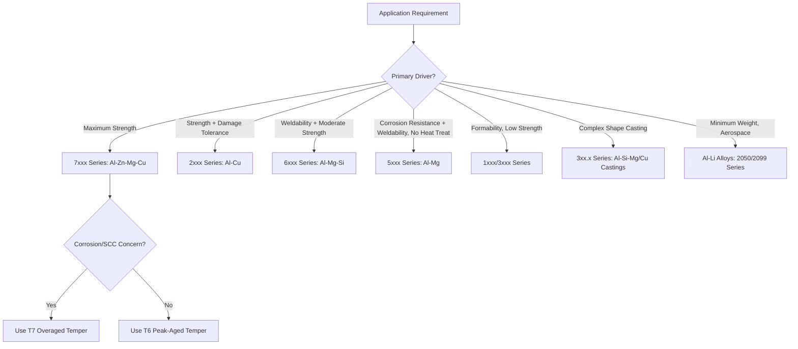

## Aluminum and Its Alloys

### Overview

Aluminum is a low-density (2.70 g/cm$^3$), face-centered cubic (FCC) metal valued for its high specific strength, excellent corrosion resistance via a self-healing native oxide film, good thermal and electrical conductivity, and favorable formability and weldability characteristics. Commercially, aluminum is almost never used in pure form for structural applications; instead, it is alloyed with elements such as copper, magnesium, manganese, silicon, and zinc to achieve a wide range of strength levels through solid solution strengthening, precipitation (age) hardening, and strain hardening.

### Classification System

#### Wrought Alloy Designation (Aluminum Association 4-Digit System)

| Series | Principal Alloying Element | Strengthening Mechanism | Typical Applications |
| --- | --- | --- | --- |
| 1xxx | None (99%+ pure Al) | Strain hardening only | Electrical conductors, chemical process equipment |
| 2xxx | Copper | Precipitation hardening | Aerospace structures (fuselage, wing skins) |
| 3xxx | Manganese | Strain hardening | Beverage cans, cooking utensils, roofing |
| 4xxx | Silicon | Strain hardening (some precipitation response) | Welding/brazing filler wire, architectural |
| 5xxx | Magnesium | Solid solution + strain hardening | Marine structures, pressure vessels, auto body sheet |
| 6xxx | Magnesium + Silicon | Precipitation hardening | Extrusions, architectural sections, automotive structures |
| 7xxx | Zinc | Precipitation hardening | High-strength aerospace structures |
| 8xxx | Other elements (Li, Fe, etc.) | Varies | Specialty applications (Al-Li aerospace alloys) |

#### Casting Alloy Designation

Cast aluminum alloys use a similar but distinct 4-digit xxx.x system (e.g., 356.0, 380.0), where the digit after the decimal indicates casting form (0 = casting, 1/2 = ingot), and the alloy series similarly groups by principal alloying addition, with the 3xx.x series (Al-Si-Mg or Al-Si-Cu) being the most widely used casting alloys due to excellent castability from silicon's effect on fluidity and shrinkage reduction.

#### Temper Designation System

Following the alloy designation, a temper suffix indicates the thermomechanical or heat treatment condition:

- **F**: As-fabricated (no special control over strain hardening or thermal treatment)
- **O**: Annealed (lowest strength, maximum ductility)
- **H**: Strain-hardened (non-heat-treatable alloys), subdivided as H1x (strain hardened only), H2x (strain hardened + partially annealed), H3x (strain hardened + stabilized); the second digit indicates degree (e.g., H14 = 1/2 hard, H18 = full hard)
- **T**: Thermally treated to produce stable tempers distinct from F, O, or H, subdivided as:
  - **T3**: Solution heat treated, cold worked, naturally aged
  - **T4**: Solution heat treated, naturally aged
  - **T5**: Cooled from an elevated-temperature shaping process, artificially aged
  - **T6**: Solution heat treated, artificially aged (peak strength condition)
  - **T7**: Solution heat treated, overaged/stabilized (improved stress corrosion resistance at some strength cost)
  - **T8**: Solution heat treated, cold worked, artificially aged

### Non-Heat-Treatable Alloys (1xxx, 3xxx, 4xxx, 5xxx Series)

These alloys derive strength from solid solution strengthening (particularly Mg in the 5xxx series) and strain hardening (cold work), since their alloying elements do not produce a strengthening precipitation sequence under practical aging conditions. The 5xxx series (Al-Mg) is the highest-strength non-heat-treatable system, with magnesium providing substantial solid solution strengthening while maintaining good weldability and excellent marine corrosion resistance, making it the dominant choice for shipbuilding, pressure vessels, and welded structures where post-weld heat treatment is impractical.

### Heat-Treatable Alloys: Precipitation Hardening Systems

#### 2xxx Series (Al-Cu)

Precipitation sequence: supersaturated solid solution → GP zones → $\theta''$ (coherent) → $\theta'$ (semi-coherent) → $\theta$-Al$_2$Cu (equilibrium, incoherent). Peak strength (T6/T8 temper) occurs at the $\theta''/\theta'$ transition stage. 2xxx alloys (e.g., 2024, 2014) offer high strength and good fatigue and fracture toughness performance, making them the historical mainstay of aircraft fuselage skin and lower wing structure, though they exhibit relatively poor corrosion resistance and typically require cladding (Alclad) with pure aluminum for protection.

#### 6xxx Series (Al-Mg-Si)

Precipitation sequence: supersaturated solid solution → GP zones/clusters → $\beta''$ (coherent, needle-shaped) → $\beta'$ (semi-coherent, rod-shaped) → $\beta$-Mg$_2$Si (equilibrium, incoherent). 6xxx alloys (e.g., 6061, 6063) offer moderate strength with excellent extrudability, good corrosion resistance, and good weldability, making them the dominant choice for architectural extrusions, structural automotive components, and general-purpose structural shapes.

#### 7xxx Series (Al-Zn-Mg-(Cu))

Precipitation sequence: supersaturated solid solution → GP zones → $\eta'$ (semi-coherent) → $\eta$-MgZn$_2$ (equilibrium, incoherent). The 7xxx series provides the highest strength among aluminum alloys (e.g., 7075-T6), used extensively in aerospace upper wing skins and other compression-dominated structures. Copper-containing variants (7075, 7050, 7150) achieve the highest strength but at some cost to corrosion resistance and weldability, generally requiring T7-type overaged tempers in stress-corrosion-susceptible applications to trade some strength for improved SCC resistance.

### SVG Diagram — Aging Curve Comparison Across Alloy Series

<svg xmlns="http://www.w3.org/2000/svg" viewBox="0 0 560 320" font-family="sans-serif">
<text x="280" y="20" text-anchor="middle" font-size="14" font-weight="bold">Age Hardening Curves: 2xxx, 6xxx, 7xxx (svg_diagram)</text>
<line x1="60" y1="280" x2="520" y2="280" stroke="#333" stroke-width="1.5" />
<line x1="60" y1="280" x2="60" y2="50" stroke="#333" stroke-width="1.5" />
<text x="290" y="305" text-anchor="middle" font-size="11">Aging Time (log scale)</text>
<text x="25" y="165" text-anchor="middle" font-size="11" transform="rotate(-90,25,165)">Hardness / Strength</text>

<path d="M70,250 Q150,90 220,70 Q280,75 340,110 Q420,160 500,190" fill="none" stroke="#c0392b" stroke-width="2.5" />
<text x="230" y="60" font-size="10" fill="#c0392b">7xxx (Al-Zn-Mg-Cu)</text>

<path d="M70,255 Q160,120 230,105 Q290,110 350,135 Q430,175 500,205" fill="none" stroke="#2980b9" stroke-width="2.5" />
<text x="350" y="125" font-size="10" fill="#2980b9">2xxx (Al-Cu)</text>

<path d="M70,260 Q180,180 250,160 Q320,158 390,175 Q450,195 500,215" fill="none" stroke="#27ae60" stroke-width="2.5" />
<text x="390" y="195" font-size="10" fill="#27ae60">6xxx (Al-Mg-Si)</text>

<text x="90" y="270" font-size="9">Underaged</text>

<text x="220" y="45" font-size="9">Peak Aged</text>

<text x="440" y="230" font-size="9">Overaged</text>

</svg>

### Corrosion Behavior and Protection

#### Native Oxide Film

Aluminum's corrosion resistance derives from a thin (2–10 nm), continuous, self-healing amorphous Al$_2$O$_3$ oxide film that forms spontaneously in air and reforms rapidly if mechanically damaged, provided oxygen is available. This passive film is stable across a moderate pH range (approximately 4–9) but dissolves in strongly acidic or alkaline environments.

#### Galvanic and Localized Corrosion

- **Galvanic corrosion**: Aluminum is anodic relative to most structural metals (steel, copper, brass), making galvanic coupling a significant design concern requiring insulating fasteners/gaskets or compatible material selection at joints
- **Pitting corrosion**: Chloride ions locally disrupt the passive film, initiating pits that can propagate under occluded-cell (autocatalytic) conditions, particularly relevant to marine and de-icing-salt-exposed applications
- **Intergranular corrosion (IGC) and exfoliation**: In some 2xxx and 7xxx tempers, grain boundary precipitates (e.g., copper-depleted zones adjacent to Al$_2$Cu grain boundary precipitates) create local galvanic cells along grain boundaries, producing IGC that can propagate as exfoliation (delamination) in wrought products with elongated grain structure
- **Stress corrosion cracking (SCC)**: High-strength 7xxx (and some 2xxx) alloys in peak-aged (T6) tempers are susceptible to SCC under sustained tensile stress in the short-transverse grain direction combined with corrosive environment exposure; overaging to T7-type tempers substantially improves SCC resistance at a strength penalty of roughly 10–15% [Unverified: exact strength penalty is alloy- and temper-specific]

### Casting Alloys and Solidification Behavior

#### Al-Si System

Silicon additions dramatically improve castability by increasing fluidity and reducing solidification shrinkage, since the Al-Si eutectic (at approximately 12.6 wt% Si) solidifies over a narrow temperature range with low volumetric contraction. Hypoeutectic (less than ~12% Si), eutectic, and hypereutectic (greater than ~12% Si, containing primary Si particles for wear resistance) compositions are used depending on application.

#### Modification and Grain Refinement

- **Eutectic modification**: Trace additions of sodium or strontium alter the eutectic silicon morphology from coarse, brittle acicular (needle-like) plates to a fine, fibrous form, substantially improving ductility and fatigue resistance of Al-Si castings
- **Grain refinement**: Al-Ti-B or Al-Ti-C master alloy additions provide potent heterogeneous nucleation sites (TiB$_2$/TiC particles plus a peritectic Al-Ti reaction), refining the as-cast grain structure and reducing hot tearing susceptibility and improving feeding characteristics during solidification

### Aluminum-Lithium Alloys (8xxx Series and 2xxx Li-Modified Variants)

Lithium additions (typically 1–2.5 wt%) reduce density (each 1 wt% Li reduces density by approximately 3%) while increasing elastic modulus, making Al-Li alloys (e.g., 2050, 2060, 2099) attractive for aerospace weight-critical structures. Strengthening occurs via coherent $\delta'$ (Al$_3$Li) precipitates, though early-generation Al-Li alloys suffered from anisotropic mechanical properties and reduced short-transverse fracture toughness due to planar slip and pronounced precipitate-free zones; modern third-generation Al-Li alloys have substantially mitigated these issues through refined composition and processing control.

### Mermaid Diagram — Alloy Selection Logic by Application Driver

### Worked Example

**Example**

Selecting between 6061-T6 and 7075-T6 for a structural bracket requiring moderate strength, good corrosion resistance, and weldability:

- 6061-T6: Yield strength ≈ 276 MPa, excellent weldability (though strength drops in the heat-affected zone, recoverable partially via post-weld natural aging over several weeks or full T6 re-solutionizing), good general corrosion resistance
- 7075-T6: Yield strength ≈ 503 MPa, essentially unweldable by conventional fusion methods (severe hot cracking and HAZ softening), reduced general corrosion resistance requiring cladding or coating for many applications

**Conclusion**: If the bracket requires welded assembly, 6061-T6 is the appropriate choice despite lower strength, since 7075's strength advantage cannot be practically realized through fusion welding; if the component is mechanically fastened and weight-critical, 7075-T6 provides substantially higher strength-to-weight ratio.

### Common Pitfalls and Practical Considerations

- Assuming all aluminum alloys are weldable; 2xxx and 7xxx heat-treatable, high-copper/zinc alloys are prone to hot cracking and severe HAZ softening, generally requiring mechanical fastening, friction stir welding, or specialized filler metal selection rather than conventional fusion arc welding
- Neglecting galvanic corrosion at dissimilar-metal joints; aluminum's position in the galvanic series makes it anodic (sacrificial) relative to most other structural metals, requiring isolation at fastener interfaces
- Overlooking short-transverse property anisotropy in thick wrought plate/forgings, where fracture toughness and SCC resistance are frequently substantially lower than in the longitudinal or long-transverse directions due to elongated grain structure and aligned second-phase particles
- Applying peak-aged (T6) tempers in SCC-prone environments without considering T7 overaged alternatives, particularly for 7xxx alloys in sustained-tensile-stress marine or humid service
- Assuming casting alloy and wrought alloy composition/property data are interchangeable; casting alloys (3xx.x series) contain much higher silicon content for castability and are not produced or heat-treated as wrought products

**Related Topics**

- Precipitation Hardening Sequences and Aging Curve Design (second phase particles)
- Stress Corrosion Cracking Mechanisms in High-Strength Aluminum
- Aluminum Casting Processes (Sand, Die, Investment) and Modification Treatments
- Friction Stir Welding of Aluminum Alloys
- Aluminum-Lithium Alloy Development for Aerospace Weight Reduction
- Galvanic Corrosion and Dissimilar Metal Joint Design
- Grain Refinement in Aluminum Castings (Al-Ti-B Master Alloys)