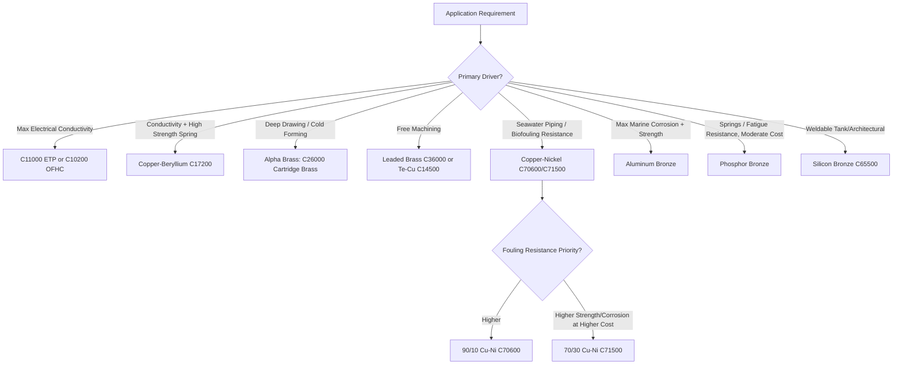

## Copper and Copper Alloys

### Overview

Copper is a face-centered cubic (FCC) metal distinguished by exceptionally high electrical and thermal conductivity (second only to silver among pure metals), excellent corrosion resistance in many environments, good ductility for extensive cold working, and antimicrobial surface properties. Copper alloys — principally brasses (Cu-Zn), bronzes (Cu-Sn and other Cu-X systems historically distinguished from brass), and copper-nickels — extend copper's property envelope to include higher strength, improved wear resistance, and tailored corrosion performance for specific service environments, particularly marine and seawater applications.

### Classification System (Unified Numbering System, UNS)

Copper and copper alloys are designated using the UNS Cxxxxx system, broadly grouped by composition family:

| UNS Range | Alloy Family | Principal Alloying Elements |
| --- | --- | --- |
| C10000–C15999 | Coppers | 99.3%+ Cu (minimal alloying) |
| C16000–C19999 | High copper alloys | Cu with minor additions (Be, Cr, Zr) |
| C20000–C28999 | Brasses | Cu-Zn |
| C30000–C39999 | Leaded brasses | Cu-Zn-Pb |
| C40000–C49999 | Tin brasses | Cu-Zn-Sn |
| C50000–C64999 | Bronzes (phosphor, aluminum, silicon) | Cu-Sn, Cu-Al, Cu-Si |
| C65000–C69999 | Copper-nickel-zinc (nickel silvers) | Cu-Ni-Zn |
| C70000–C79999 | Copper-nickels | Cu-Ni |
| C80000–C99999 | Cast copper alloys | Various |

### Pure and High-Copper Alloys

#### Electrical/Commercial Grades

- **C11000 (Electrolytic Tough Pitch, ETP)**: Contains a small controlled oxygen content (~0.02–0.04 wt%) as fine Cu$_2$O particles; the dominant commercial grade for electrical conductors due to lowest-cost high conductivity, though the oxygen content causes hydrogen embrittlement susceptibility if the material is heated in a hydrogen-bearing (reducing) atmosphere, as hydrogen diffuses in and reacts with Cu$_2$O to form steam, generating internal porosity
- **C10200 (Oxygen-Free Copper, OFC/OFHC)**: Produced without oxygen pickup, eliminating hydrogen embrittlement risk and suitable for vacuum applications, electron tubes, and environments requiring welding/brazing in reducing atmospheres
- **C14500 (Tellurium copper) / C18700 (Leaded copper)**: Free-machining grades with minor Te or Pb additions that form discrete soft/brittle phases promoting chip breakage during machining, at a modest conductivity penalty

#### Precipitation-Hardenable High-Copper Alloys

- **Copper-Beryllium (C17200, C17000)**: Age-hardenable via CuBe intermetallic precipitation, achieving the highest strength of any copper alloy family (yield strengths exceeding 1000 MPa in peak-aged condition) while retaining good electrical/thermal conductivity relative to strength, used for high-performance springs, electrical connectors, and non-sparking tools; beryllium oxide dust generated during machining/grinding is a recognized serious inhalation health hazard requiring engineering controls
- **Copper-Chromium (C18200) / Copper-Zirconium (C15000)**: Age-hardenable via fine Cr or Zr precipitation, providing moderate strength increase with minimal conductivity loss relative to beryllium copper, used in resistance welding electrodes requiring both strength and high thermal conductivity

### Brasses (Cu-Zn System)

#### Phase Behavior

The Cu-Zn phase diagram exhibits several intermediate phases, but commercial brasses are dominated by two regions:

- **Alpha ($\alpha$) brass**: FCC solid solution, stable up to approximately 35 wt% Zn, offering excellent cold formability (deep drawing, spinning) due to its single-phase FCC structure
- **Alpha-beta ($\alpha+\beta$) brass**: Above approximately 35–37 wt% Zn, a BCC-based $\beta$ phase appears alongside $\alpha$; $\beta$ phase is harder and less ductile at room temperature but more workable hot, making $\alpha+\beta$ brasses (e.g., Muntz metal, 60Cu-40Zn) suited to hot working processes (extrusion, hot forging) rather than extensive cold forming

#### Common Brass Grades

- **C26000 (Cartridge Brass, 70Cu-30Zn)**: Classic single-phase $\alpha$ brass with excellent cold formability, used for deep-drawn cartridge cases, plumbing fittings, and decorative hardware
- **C36000 (Free-Machining Brass)**: Contains ~3% Pb dispersed as discrete soft particles that promote chip breaking, historically the standard free-machining brass for screw-machine parts (though leaded brass use is increasingly restricted in potable water applications due to lead leaching concerns, driving adoption of low-lead/lead-free alternatives)
- **C46400 (Naval Brass)**: $\alpha+\beta$ brass with tin addition (~0.75% Sn) for improved seawater corrosion resistance, used in marine hardware and shafting

#### Dezincification

A characteristic corrosion mode specific to brasses in which zinc is selectively leached from the alloy, leaving behind a porous, mechanically weak copper-rich residue. Two morphological forms occur: **plug-type** dezincification (localized, deep penetration, common in $\alpha+\beta$ brasses) and **layer-type** (uniform, common in high-zinc single-phase brasses). Dezincification resistance is significantly improved by small additions of arsenic, antimony, or phosphorus (inhibited brasses, e.g., C28000 with As addition), which suppress the selective zinc dissolution mechanism. [Inference: the precise inhibition mechanism involves adsorption/segregation effects that are still an active area of corrosion science research]

### Bronzes

#### Tin (Phosphor) Bronzes (Cu-Sn-P System)

Tin bronzes (e.g., C51000, C52100) derive strength from solid solution strengthening by tin, with small phosphorus additions serving as a deoxidizer during melting that also contributes modest additional strengthening. Phosphor bronzes offer excellent fatigue resistance and spring properties combined with good corrosion resistance, making them the traditional choice for springs, bellows, and electrical contact applications before beryllium copper's development.

#### Aluminum Bronzes (Cu-Al System)

Aluminum bronzes (typically 5–12 wt% Al, often with Fe, Ni, Mn additions) form a protective, adherent Al$_2$O$_3$-based passive film analogous to aluminum's own oxide, providing excellent corrosion resistance in seawater and many acidic/industrial environments substantially exceeding that of tin bronzes or brasses. Higher-aluminum grades (above ~9.5% Al) can be heat treated via a martensitic-type transformation of the high-temperature $\beta$ phase, analogous in concept (though not in crystallography) to steel quench hardening, enabling a further strength increase through controlled cooling and tempering. Aluminum bronzes are widely used for ship propellers, pump and valve components, and bearings in demanding marine and chemical service.

#### Silicon Bronzes (Cu-Si System)

Silicon bronzes (e.g., C65500, typically 1–3 wt% Si with Mn additions) provide moderate strength with excellent weldability (comparable to mild steel welding practice) and good corrosion resistance, historically used for welded tanks, marine fasteners, and architectural applications where fusion welding of copper alloys is required.

### Copper-Nickel Alloys

Copper-nickel alloys (C70600 90/10 and C71500 70/30, denoting Cu:Ni weight ratios) form a complete solid solution across the full composition range (per the Cu-Ni phase diagram's simple isomorphous behavior), providing solid solution strengthening without a precipitation response. These alloys offer outstanding resistance to seawater corrosion and, notably, resistance to biofouling (marine organism attachment) attributed partly to copper ion release at the surface, making them the standard material for seawater piping systems, condenser and heat exchanger tubing in marine and desalination applications, and ship hull sheathing.

### SVG Diagram — Cu-Zn Phase Diagram Schematic (Brass Region)

<svg xmlns="http://www.w3.org/2000/svg" viewBox="0 0 560 320" font-family="sans-serif">
<text x="280" y="20" text-anchor="middle" font-size="14" font-weight="bold">Cu-Zn Phase Diagram, Brass Region (svg_diagram)</text>
<line x1="60" y1="270" x2="500" y2="270" stroke="#333" stroke-width="1.5" />
<line x1="60" y1="270" x2="60" y2="50" stroke="#333" stroke-width="1.5" />
<text x="280" y="300" text-anchor="middle" font-size="11">Zn Content (wt%) increasing right</text>
<text x="25" y="160" text-anchor="middle" font-size="11" transform="rotate(-90,25,160)">Temperature</text>

<path d="M60,60 Q200,90 300,130 Q400,170 500,140" fill="none" stroke="#333" stroke-width="1.5" />
<text x="150" y="75" font-size="9">Liquid</text>

<path d="M60,270 L60,150 Q140,140 190,180 L190,270 Z" fill="#3498db" fill-opacity="0.25" stroke="#3498db" />
<text x="100" y="220" font-size="11" fill="#2980b9">alpha (FCC)</text>

<path d="M190,180 L190,270 L300,270 L300,190 Z" fill="#9b59b6" fill-opacity="0.25" stroke="#9b59b6" />
<text x="215" y="230" font-size="10" fill="#8e44ad">alpha + beta</text>

<path d="M300,190 L300,270 L420,270 L420,160 Q360,150 300,190 Z" fill="#e67e22" fill-opacity="0.25" stroke="#e67e22" />
<text x="330" y="220" font-size="11" fill="#d35400">beta (BCC)</text>
<line x1="190" y1="270" x2="190" y2="50" stroke="#999" stroke-dasharray="3,3" />
<text x="180" y="45" font-size="9" text-anchor="middle">~35% Zn</text>

<text x="130" y="290" font-size="9">Cartridge Brass (70/30)</text>

<text x="330" y="290" font-size="9">Muntz Metal (60/40)</text>

</svg>

### Mermaid Diagram — Copper Alloy Selection by Service Requirement

### Corrosion Behavior Summary

**Key Points**

- Copper and its alloys generally exhibit excellent resistance to atmospheric, freshwater, and many industrial corrosion environments via formation of a protective, often visually distinctive patina (basic copper carbonates/sulfates)
- Ammonia and ammonium compounds are notably aggressive toward copper alloys, particularly promoting stress corrosion cracking (season cracking) in brasses under residual or applied tensile stress combined with ammoniacal environments (historically observed in stored brass cartridge cases, hence the term)
- Velocity-induced (impingement) corrosion/erosion-corrosion becomes a concern in high-flow-velocity piping applications, with copper-nickels generally outperforming brasses and tin bronzes at elevated flow velocities due to a more mechanically robust and adherent protective film
- Sulfide-containing waters (polluted seawater, some industrial effluents) can degrade copper-nickel protective film formation, requiring alloy or coating adjustments in such environments

### Worked Example

**Example**

Selecting a material for seawater condenser tubing subject to biofouling concerns and moderate flow velocity:

- Admiralty brass (historic choice, Cu-Zn-Sn) offers adequate general corrosion resistance but is susceptible to both dezincification and ammonia-induced stress corrosion cracking, and has largely been superseded in new installations
- 90/10 Copper-Nickel (C70600) provides substantially improved seawater corrosion resistance, adequate biofouling resistance for moderate flow conditions, and good resistance to impingement attack at typical condenser flow velocities, at a moderate cost premium over brass

**Conclusion**: For new seawater condenser/heat exchanger installations, 90/10 copper-nickel is generally favored over legacy admiralty brass specifications, reserving 70/30 copper-nickel for more severe service (higher velocity, more aggressive water chemistry) given its higher cost.

### Common Pitfalls and Practical Considerations

- Specifying leaded brass (e.g., C36000) for potable water components without checking current lead-content regulations, which increasingly restrict leaded copper alloys in drinking water contact applications
- Overlooking season cracking (ammonia-induced SCC) risk in brass components subject to residual stress (from cold forming) stored or used in ammonia-containing atmospheres, including some industrial and agricultural environments
- Assuming beryllium copper's superior strength justifies its use without accounting for beryllium oxide dust health hazards during machining, grinding, or any operation generating fine particulate
- Neglecting the distinct workability windows of $\alpha$ versus $\alpha+\beta$ brasses; attempting extensive cold forming on high-zinc $\alpha+\beta$ compositions intended for hot working can result in cracking or excessive springback issues
- Selecting copper-nickel alloys without confirming compatibility with local water sulfide/pollution levels, which can compromise the protective film formation mechanism copper-nickel corrosion resistance depends upon

**Related Topics**

- Precipitation Hardening in Copper-Beryllium Alloys (second phase particle strengthening)
- Stress Corrosion Cracking Mechanisms (Season Cracking in Brass)
- Seawater and Marine Corrosion Material Selection
- Electrical Conductor Materials and Hydrogen Embrittlement in Tough Pitch Copper
- Cast Copper Alloys and Bearing Bronze Applications
- Dezincification-Resistant Brass Alloy Design