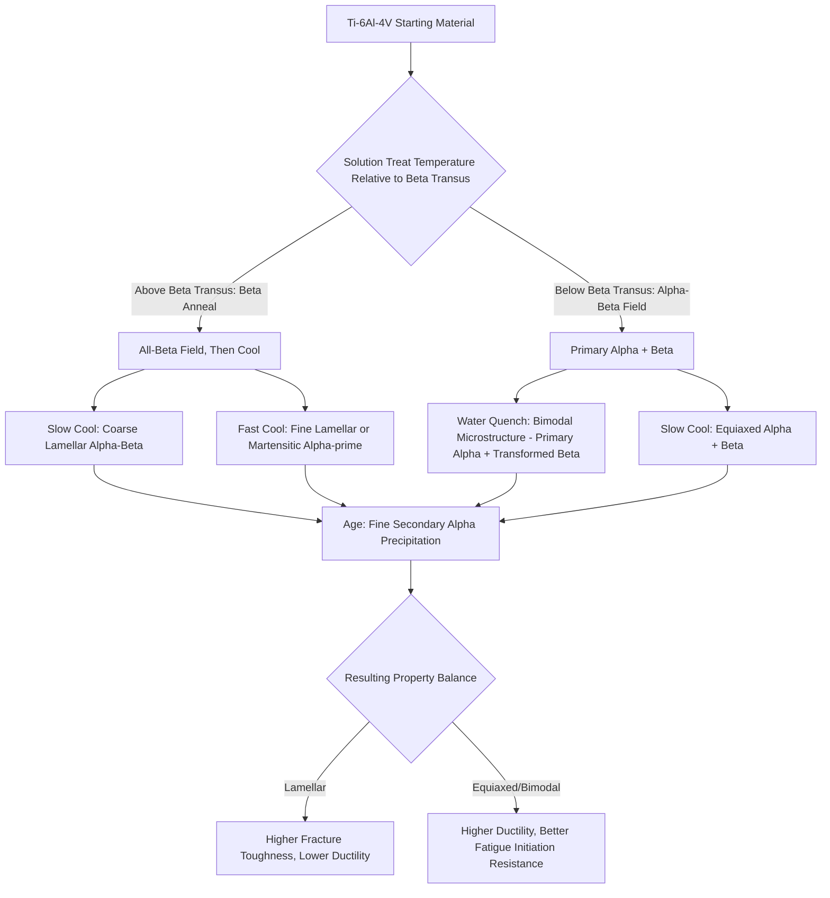

## Titanium and Titanium Alloys

### Overview

Titanium is distinguished among structural metals by its exceptional specific strength (strength-to-weight ratio), excellent corrosion resistance from a highly stable, self-healing native TiO$_2$ oxide film, and good elevated-temperature performance relative to aluminum alloys, though at roughly 60% the density of steel and significantly higher cost than either aluminum or steel. Its defining metallurgical characteristic is an allotropic phase transformation between a low-temperature hexagonal close-packed (HCP) $\alpha$ phase and a high-temperature body-centered cubic (BCC) $\beta$ phase, which underpins the entire alloy classification system and heat treatment strategy for the element.

### Allotropy and the Beta Transus

#### The Alpha-Beta Transformation

Pure titanium transforms from HCP $\alpha$ to BCC $\beta$ at 882°C (the $\beta$ transus temperature for unalloyed Ti). Alloying elements shift this transus temperature and are classified according to their effect:

- **Alpha stabilizers**: Raise the $\beta$ transus temperature, expanding the $\alpha$ phase field. Includes Al (the most important alpha stabilizer, present in nearly all commercial alloys), O, N, C (interstitial alpha stabilizers, also strengtheners but embrittling at excess levels)
- **Beta stabilizers**: Lower the $\beta$ transus temperature, expanding the $\beta$ phase field, subdivided into:
  - **Beta-isomorphous**: Completely miscible with $\beta$-Ti (V, Mo, Nb, Ta)
  - **Beta-eutectoid**: Form eutectoid systems with $\beta$-Ti, potentially forming intermetallic compounds at lower temperature/longer time (Fe, Cr, Ni, Cu, Si, Mn)
- **Neutral elements**: Minimal effect on transus temperature (Sn, Zr) — used primarily for solid solution strengthening without significantly altering phase balance

#### Martensitic and Metastable Transformations

Rapid cooling from the $\beta$ phase field can produce a metastable hexagonal martensite ($\alpha'$) or orthorhombic martensite ($\alpha''$) at higher beta-stabilizer content, analogous in concept to steel's austenite-to-martensite transformation though with distinct crystallography. At sufficiently high beta-stabilizer content, the $\beta$ phase can be retained metastably at room temperature (the basis for beta and near-beta alloy heat treatment), and in some compositions an athermal or isothermal omega ($\omega$) phase can form, which is generally embrittling and must be avoided or minimized through appropriate heat treatment control.

### SVG Diagram — Alpha/Beta Phase Field and Alloy Classification

<svg xmlns="http://www.w3.org/2000/svg" viewBox="0 0 580 320" font-family="sans-serif">
<text x="290" y="20" text-anchor="middle" font-size="14" font-weight="bold">Ti Alloy Classification vs. Beta Stabilizer Content (svg_diagram)</text>
<line x1="60" y1="270" x2="520" y2="270" stroke="#333" stroke-width="1.5" />
<line x1="60" y1="270" x2="60" y2="60" stroke="#333" stroke-width="1.5" />
<text x="290" y="300" text-anchor="middle" font-size="11">Beta Stabilizer Content (wt%) increasing right</text>
<text x="25" y="165" text-anchor="middle" font-size="11" transform="rotate(-90,25,165)">Temperature</text>

<path d="M60,90 Q200,110 300,170 Q400,220 520,250" fill="none" stroke="#333" stroke-width="1.5" />
<text x="90" y="80" font-size="9">Beta Transus</text>

<path d="M60,270 Q220,230 320,200 Q420,180 520,175" fill="none" stroke="#999" stroke-dasharray="4,3" stroke-width="1" />
<text x="380" y="170" font-size="8" fill="#666">Ms (approx)</text>
<rect x="60" y="230" width="90" height="40" fill="#3498db" fill-opacity="0.2" stroke="#3498db" />
<text x="75" y="255" font-size="10" fill="#2980b9">Alpha</text>
<rect x="150" y="220" width="100" height="50" fill="#2ecc71" fill-opacity="0.2" stroke="#2ecc71" />
<text x="165" y="250" font-size="10" fill="#27ae60">Near-Alpha</text>
<rect x="250" y="200" width="110" height="70" fill="#f1c40f" fill-opacity="0.25" stroke="#f39c12" />
<text x="265" y="240" font-size="10" fill="#d68910">Alpha-Beta</text>
<rect x="360" y="180" width="90" height="90" fill="#e67e22" fill-opacity="0.25" stroke="#e67e22" />
<text x="365" y="230" font-size="10" fill="#d35400">Near-Beta</text>
<rect x="450" y="160" width="70" height="110" fill="#9b59b6" fill-opacity="0.25" stroke="#9b59b6" />
<text x="460" y="220" font-size="10" fill="#8e44ad">Beta</text>
</svg>

### Alloy Classification and Representative Grades

#### Alpha and Near-Alpha Alloys

- **Commercially Pure (CP) Titanium (Grades 1–4)**: Unalloyed except for controlled interstitial (O, N, Fe) content, which governs the strength/ductility balance across grades; excellent corrosion resistance and weldability, used extensively in chemical processing equipment
- **Ti-5Al-2.5Sn**: Classic all-alpha alloy, not heat treatable (single-phase, no beta-to-alpha transformation strengthening available), good weldability and stable microstructure at elevated temperature, used in cryogenic and aerospace applications requiring weld integrity
- **Ti-8Al-1Mo-1V, Ti-6Al-2Sn-4Zr-2Mo**: Near-alpha alloys with small beta-stabilizer additions for minor processing/property benefit while retaining alpha-alloy characteristics of good creep resistance and weldability, used in gas turbine compressor components requiring elevated-temperature stability

#### Alpha-Beta Alloys

- **Ti-6Al-4V (Grade 5)**: By substantial margin the most widely used titanium alloy, accounting for the majority of titanium tonnage consumed across aerospace, medical, and industrial applications; offers a versatile balance of strength, ductility, fracture toughness, and processability, heat-treatable via solution treatment and aging to tune the alpha-beta phase balance and morphology
- **Ti-6Al-4V ELI (Extra Low Interstitial, Grade 23)**: Reduced O, N, Fe interstitial content compared to standard Grade 5, providing improved fracture toughness and fatigue crack growth resistance at some strength reduction, the standard choice for biomedical implants and cryogenic/damage-tolerance-critical aerospace applications
- **Ti-6Al-6V-2Sn**: Higher-strength alpha-beta alloy than Ti-6Al-4V, used where higher strength is prioritized over the toughness/weldability balance Ti-6Al-4V provides

#### Beta and Near-Beta Alloys

- **Ti-10V-2Fe-3Al, Ti-15V-3Cr-3Sn-3Al, Ti-5Al-5V-5Mo-3Cr (Ti-5553)**: High beta-stabilizer content alloys capable of retaining metastable $\beta$ phase upon quenching, then aged to precipitate fine secondary $\alpha$ within the retained $\beta$ matrix, achieving the highest strength levels among titanium alloys (yield strengths exceeding 1200 MPa in some compositions) with good deep-hardenability in thick sections, used in high-strength airframe structural components (landing gear, high-load fittings)

### Strengthening Mechanisms

#### Solid Solution Strengthening

Both alpha stabilizers (Al, interstitials O/N/C) and beta stabilizers contribute solid solution strengthening; interstitial oxygen in particular provides substantial strengthening per unit addition but reduces ductility and fracture toughness sharply beyond a threshold content, making oxygen content control (ELI grades) a critical specification parameter for toughness-critical applications.

#### Alpha-Beta Heat Treatment and Microstructure Control

For alpha-beta alloys such as Ti-6Al-4V, heat treatment above or below the beta transus produces fundamentally different microstructures:

- **Beta annealing (solution treatment above beta transus, then controlled cooling)**: Produces a lamellar (Widmanstätten or basketweave) alpha-beta microstructure with colonies of parallel alpha plates within prior beta grains; generally provides superior fracture toughness and fatigue crack growth resistance but lower ductility and fatigue crack initiation resistance
- **Alpha-beta processing (solution treatment below beta transus in the two-phase field)**: Produces an equiaxed or bimodal (equiaxed primary alpha plus transformed beta matrix) microstructure; generally provides better ductility, fatigue crack initiation resistance, and more isotropic properties, at some cost to fracture toughness relative to lamellar structures
- **Aging**: Following solution treatment, aging at intermediate temperature precipitates additional fine alpha within the retained/transformed beta phase, providing further strengthening

**Key Points**

- Microstructure (lamellar vs. equiaxed vs. bimodal), not merely composition, is a first-order determinant of the property balance achieved in alpha-beta titanium alloys
- The processing-microstructure-property linkage is analogous in principle to the aluminum age-hardening and steel controlled-rolling systems already discussed, but with titanium's allotropic beta transus playing the role that recrystallization temperature or the martensite start temperature plays in those other systems

### Mermaid Diagram — Ti-6Al-4V Microstructure Development

### Corrosion and Environmental Behavior

#### Passive Film Stability

The native TiO$_2$ oxide film is exceptionally stable across a broad pH range and in oxidizing, chloride-containing, and many acidic environments, providing corrosion resistance in seawater, chlorine-bearing process streams, and oxidizing acids that exceeds most stainless steels and even many nickel alloys, explaining titanium's extensive use in chemical process equipment, desalination plants, and marine hardware despite its higher cost.

#### Hydrogen Embrittlement

Titanium alloys are susceptible to hydrogen embrittlement through the precipitation of brittle titanium hydride (TiH$_x$) phases when hydrogen content exceeds alloy- and microstructure-dependent solubility limits, a concern particularly relevant to pickling/cleaning operations, cathodic protection overprotection, and hydrogen-charging service environments; hydrogen content is therefore a controlled specification parameter analogous to interstitial oxygen and nitrogen control.

#### Galvanic Behavior

Titanium's stable, noble passive film makes it cathodic relative to most other structural metals in galvanic series rankings — the reverse situation from aluminum — meaning titanium can accelerate galvanic corrosion of coupled dissimilar metals (steel, aluminum) even while the titanium itself remains essentially unaffected.

### Fabrication Considerations

- **Forming**: Titanium alloys exhibit relatively low elastic modulus (~110 GPa for Ti-6Al-4V, roughly half that of steel) causing significant springback during cold forming; hot forming at elevated temperature (typically 700–950°C depending on alloy) is frequently employed to improve formability and reduce springback
- **Machining**: Low thermal conductivity concentrates cutting heat at the tool-chip interface rather than dissipating into the workpiece, combined with chemical reactivity with tool materials at elevated temperature, necessitating specific tooling, lower cutting speeds, and effective coolant application relative to steel machining practice
- **Welding**: Titanium's high reactivity with oxygen, nitrogen, and hydrogen at elevated temperature requires complete inert gas shielding (including trailing shields and backing gas) during fusion welding to prevent embrittling contamination; contamination is often visually detectable via oxide discoloration (straw to blue to white/gray with increasing contamination severity) providing a practical weld quality inspection method

### Applications

| Application Sector | Representative Alloys | Key Property Driver |
| --- | --- | --- |
| Airframe structures (fittings, landing gear) | Ti-6Al-4V, Ti-10V-2Fe-3Al, Ti-5553 | High specific strength, damage tolerance |
| Gas turbine engine (compressor, fan) | Ti-6Al-4V, Ti-6Al-2Sn-4Zr-2Mo, near-alpha alloys | Elevated temperature strength, creep resistance, low density |
| Biomedical implants | Ti-6Al-4V ELI, CP-Ti | Biocompatibility, corrosion resistance, favorable modulus match to bone relative to steel |
| Chemical processing equipment | CP-Ti Grades 1–4 | Exceptional corrosion resistance across broad chemical environments |
| Marine hardware, desalination | CP-Ti, Ti-6Al-4V | Seawater and chloride corrosion resistance |

### Common Pitfalls and Practical Considerations

- Assuming all titanium alloys are heat-treatable; single-phase alpha alloys (CP-Ti, Ti-5Al-2.5Sn) have no beta phase to transform and therefore cannot be strengthened via the solution-treat-and-age approach applicable to alpha-beta and beta alloys
- Overlooking interstitial (O, N, H) content specification; small variations in these elements significantly affect strength, ductility, and fracture toughness, which is why standard and ELI grade variants of the same nominal composition exist as distinct specifications
- Neglecting inert gas shielding adequacy during welding; incomplete shielding produces embrittling contamination that may not be visually obvious without careful oxide color inspection, and can severely degrade weld ductility and fatigue performance
- Assuming titanium's excellent general corrosion resistance eliminates galvanic corrosion risk to coupled dissimilar metals; titanium's cathodic nobility can accelerate corrosion of adjacent less noble metals even though titanium itself is unaffected
- Confusing lamellar and equiaxed/bimodal microstructure property trade-offs; selecting a beta-anneal (lamellar) heat treatment for a component whose critical failure mode is fatigue crack initiation (favoring equiaxed structure) rather than fracture toughness/crack growth can result in a heat treatment mismatched to the actual service-limiting property

**Related Topics**

- Alpha-Beta Phase Transformation and Beta Transus Heat Treatment Design
- Titanium Alloy Fatigue and Fracture Toughness: Lamellar vs. Equiaxed Microstructure
- Hydrogen Embrittlement in Titanium Alloys
- Biomedical Implant Materials and Biocompatibility Requirements
- Galvanic Corrosion and Dissimilar Metal Joint Design (cross-reference: copper/aluminum galvanic behavior)
- Titanium Welding Metallurgy and Inert Gas Shielding Practice
- Beta Titanium Alloy Development for High-Strength Aerospace Structures