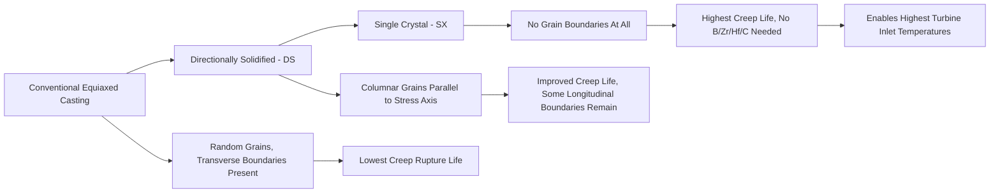

## Nickel and Nickel Superalloys

### Overview

Nickel-based alloys, and superalloys in particular, occupy a distinctive engineering niche as the material system capable of retaining useful strength, creep resistance, and microstructural stability at homologous temperatures ($T/T_m$) exceeding 0.8 — higher than virtually any other structural metal class. Nickel's FCC crystal structure provides inherently good ductility and toughness, while its ability to dissolve large quantities of alloying elements without embrittling intermetallic formation (in properly balanced compositions) enables an unusually rich strengthening toolkit. Superalloys are the enabling material for gas turbine hot-section components (combustors, turbine blades, vanes, discs) where operating temperatures approach or exceed 80–90% of the alloy's incipient melting temperature.

### Classification of Nickel-Base Alloys

#### Solid-Solution Strengthened Alloys

Alloys such as Hastelloy X, Inconel 625, and Nimonic 75 derive strength primarily from solid solution strengthening by refractory elements (Mo, W, Cr, Nb) and possess good weldability and fabricability but lower maximum-use temperature capability than precipitation-strengthened superalloys, making them suitable for combustor liners, ducting, and moderately loaded static structures rather than the highest-stress rotating components.

#### Precipitation (Gamma Prime)-Strengthened Superalloys

Alloys such as Inconel 718, Waspaloy, René 41, and the single-crystal turbine blade alloys (CMSX series, René N5) derive the majority of their strength from coherent $\gamma'$ (gamma prime, Ni$_3$(Al,Ti)) precipitation within the FCC $\gamma$ matrix, representing the dominant strengthening approach for the highest-temperature, highest-stress rotating turbine components.

#### Oxide Dispersion Strengthened (ODS) Alloys

Alloys such as MA754 and MA6000 incorporate fine, thermally stable Y$_2$O$_3$ dispersoid particles via mechanical alloying (powder processing), providing strengthening that persists to temperatures where $\gamma'$ would dissolve, at the expense of more complex and costly processing and generally lower ductility/toughness than conventionally cast and wrought superalloys.

### The Gamma-Gamma Prime ($\gamma/\gamma'$) Microstructure

#### Structure and Coherency

The $\gamma$ matrix (FCC nickel-rich solid solution) and $\gamma'$ precipitate (ordered L1$_2$ superlattice structure, Ni$_3$(Al,Ti)) share a very close lattice parameter match, typically within 0–1% misfit, enabling $\gamma'$ to remain coherent with the matrix even at large particle sizes and high volume fractions (up to 60–70% in advanced single-crystal alloys) — a coherency persistence not achievable in most other precipitation-hardening systems, where particles typically lose coherency well before reaching comparable volume fractions.

#### Why Gamma Prime Provides Exceptional High-Temperature Strength

- **Ordered structure and anti-phase boundary (APB) energy**: Because $\gamma'$ is an ordered intermetallic, a dislocation shearing through it must be followed by a second dislocation to restore the ordered arrangement (creating and then annihilating an APB), and the APB energy provides a substantial strengthening contribution that persists to elevated temperature
- **Anomalous yield strength behavior**: Unlike most metals and alloys, $\gamma'$ (and $\gamma/\gamma'$ superalloys containing it) exhibit an *increase* in yield strength with increasing temperature up to a peak (typically 700–800°C), attributed to a thermally activated cross-slip mechanism (Kear-Wilsdorf locking) that pins dislocations on low-mobility planes as temperature rises. This anomalous behavior is a primary reason superalloys retain useful strength deep into the creep-dominated temperature regime where most other alloys have already substantially softened
- **Low lattice misfit minimizing coarsening driving force**: Coherency and low interfacial energy slow $\gamma'$ coarsening (per LSW kinetics) during extended high-temperature service, preserving the strengthening precipitate distribution over long service lifetimes

### SVG Diagram — Gamma/Gamma Prime Microstructure and Rafting

<svg xmlns="http://www.w3.org/2000/svg" viewBox="0 0 600 300" font-family="sans-serif">
<text x="300" y="20" text-anchor="middle" font-size="14" font-weight="bold">Gamma/Gamma Prime Microstructure Evolution (svg_diagram)</text>

<g transform="translate(120,80)">
<text x="0" y="-15" font-size="12" font-weight="bold" text-anchor="middle">As-Processed</text>
<rect x="-70" y="0" width="140" height="140" fill="#ecf0f1" stroke="#333" />
<g fill="#3498db" stroke="#2980b9">
<rect x="-55" y="-10" width="30" height="30" />
<rect x="-10" y="-10" width="30" height="30" />
<rect x="35" y="-10" width="30" height="30" />
<rect x="-55" y="35" width="30" height="30" />
<rect x="-10" y="35" width="30" height="30" />
<rect x="35" y="35" width="30" height="30" />
<rect x="-55" y="80" width="30" height="30" />
<rect x="-10" y="80" width="30" height="30" />
<rect x="35" y="80" width="30" height="30" />
</g>
<text x="0" y="165" font-size="10" text-anchor="middle">Cuboidal gamma prime in gamma matrix</text>
</g>

<g transform="translate(420,80)">
<text x="0" y="-15" font-size="12" font-weight="bold" text-anchor="middle">Rafted (Stress + Temp)</text>
<rect x="-70" y="0" width="140" height="140" fill="#ecf0f1" stroke="#333" />
<g fill="#3498db" stroke="#2980b9">
<rect x="-60" y="-5" width="120" height="20" />
<rect x="-60" y="30" width="120" height="20" />
<rect x="-60" y="65" width="120" height="20" />
<rect x="-60" y="100" width="120" height="20" />
</g>
<text x="0" y="165" font-size="10" text-anchor="middle">Directional plate rafts perpendicular to stress</text>
</g>
<path d="M240,150 L360,150" stroke="#333" stroke-width="1.5" marker-end="url(#arrow)" />
</svg>

### Grain Boundary Strengthening Elements

In polycrystalline (as opposed to single-crystal or directionally solidified) superalloys, grain boundaries are the weak link governing creep rupture life because they permit grain boundary sliding and are preferential sites for creep cavitation. Minor additions address this:

- **Boron and Zirconium**: Segregate to grain boundaries, reportedly reducing grain boundary energy and impeding grain boundary sliding and carbide precipitate coarsening at boundaries
- **Hafnium**: Improves grain boundary ductility, particularly beneficial in equiaxed and directionally solidified cast superalloys
- **Carbon**: Forms grain boundary carbides (MC, M$_{23}$C$_6$, M$_6$C types) which, when present as discrete, appropriately morphology-controlled particles, can pin grain boundaries and improve creep resistance, though excessive or continuous grain boundary carbide films are embrittling and detrimental to ductility

### Casting Technology and Grain Structure Control

#### Conventional Equiaxed Casting

Standard investment casting produces a fine, randomly oriented equiaxed grain structure, adequate for less demanding static structural components but limited in creep-rupture life due to the presence of transverse grain boundaries perpendicular to the primary stress axis, which are preferential creep cavitation sites.

#### Directional Solidification (DS)

Controlled unidirectional heat extraction during casting produces long, columnar grains aligned parallel to the primary stress axis (typically the blade's radial direction), eliminating transverse grain boundaries and substantially improving creep rupture life and thermal fatigue resistance compared to equiaxed castings, at the cost of retaining some longitudinal grain boundaries.

#### Single-Crystal (SX) Casting

Using a specialized mold with a grain-selector or seed crystal, the entire casting solidifies as one continuous crystal with no grain boundaries at all, eliminating grain boundary creep and grain boundary sliding entirely. Single-crystal superalloys are consequently formulated without grain-boundary-strengthening elements (B, Zr, Hf, C) since these elements provide no benefit without grain boundaries present and can in some cases lower the incipient melting temperature, reducing the achievable solution heat treatment window. Single-crystal blades represent the highest-performance (and highest-cost) turbine blade technology, used in the hottest sections of advanced gas turbine engines.

### Mermaid Diagram — Superalloy Casting Technology Progression

### Key Superalloy Systems and Grades

| Alloy | Type | Key Characteristics |
| --- | --- | --- |
| Inconel 625 | Solid-solution strengthened | Excellent weldability, fabricability, moderate strength, good corrosion resistance; used in ducting, flexible piping, marine and chemical service |
| Inconel 718 | Precipitation-strengthened ($\gamma''$, not $\gamma'$, primary) | Excellent weldability relative to other precipitation-hardened superalloys (slow $\gamma''$ Ni$_3$Nb precipitation kinetics reduce strain-age cracking susceptibility), widely used for turbine discs and structural gas turbine components |
| Waspaloy | Precipitation-strengthened ($\gamma'$) | Wrought turbine disc alloy, good balance of strength and fabricability |
| René 41, René 88 | Precipitation-strengthened ($\gamma'$) | Higher-strength wrought disc alloys for more demanding temperature/stress combinations |
| CMSX-4, René N5 | Single-crystal, precipitation-strengthened | Highest-temperature-capability turbine blade alloys, high $\gamma'$ volume fraction, refractory-element solid solution strengthening (Re additions) |
| Hastelloy X | Solid-solution strengthened | Excellent oxidation resistance and fabricability, used for combustor liners |

### Environmental Degradation Mechanisms

#### High-Temperature Oxidation

Superalloys rely on formation of a protective Cr$_2$O$_3$ or Al$_2$O$_3$ scale (depending on composition and temperature regime) for oxidation resistance; alumina-forming alloys generally provide superior protection at the highest temperatures due to alumina's lower growth rate and better adherence, driving alloy design toward sufficient aluminum content to ensure alumina-scale formation in the most demanding applications.

#### Hot Corrosion

Molten salt deposits (typically Na$_2$SO$_4$ from sulfur and sodium chloride contaminants in fuel or ingested air, particularly in marine or industrial environments) can catastrophically accelerate degradation through fluxing of the protective oxide scale, a mechanism distinct from and generally more aggressive than simple high-temperature oxidation, requiring specific alloy chemistry adjustments (Cr content, in particular) and/or protective coatings for susceptible service environments.

#### Coatings

Thermal barrier coatings (TBCs, typically yttria-stabilized zirconia over a bond coat) and diffusion/overlay environmental coatings (aluminide diffusion coatings, MCrAlY overlay coatings) are extensively used on turbine blades and vanes to reduce substrate metal temperature (TBCs, via low thermal conductivity) and provide oxidation/hot corrosion protection independent of the base alloy's own environmental resistance, effectively decoupling mechanical property optimization (in the substrate) from environmental protection (in the coating system).

### Creep and the Role of Microstructural Stability

**Key Points**

- Superalloy creep performance depends on maintaining a stable $\gamma'$ size, morphology, and distribution throughout service life; excessive coarsening (per LSW kinetics) or, under combined high stress and temperature, directional coarsening (rafting) of $\gamma'$ from cuboidal to plate-like morphology can significantly influence creep behavior
- Rafting orientation relative to the applied stress axis can be either beneficial or detrimental to creep life depending on the sign of the lattice misfit and the resulting raft morphology, an area of ongoing superalloy research and alloy-specific optimization [Inference: the precise beneficial/detrimental threshold depends on stress state, temperature regime, and specific alloy misfit sign, making this a system-specific rather than universal design rule]
- Topologically close-packed (TCP) phase formation (e.g., $\sigma$, $\mu$, Laves phases) from excessive refractory element content or long-term thermal exposure can deplete the matrix of solid-solution strengtheners and act as crack initiation sites, representing a metallurgical instability that alloy design must avoid through careful compositional balance (often assessed via empirical electron-vacancy or PHACOMP-type parameters)

### Common Pitfalls and Practical Considerations

- Assuming higher $\gamma'$ volume fraction is unconditionally better; excessively high volume fractions without corresponding refinement of processing (solution heat treatment, controlled cooling) can produce coarse, poorly distributed precipitates that underperform a well-processed lower-volume-fraction alternative
- Neglecting strain-age cracking risk during welding or post-weld heat treatment of $\gamma'$-strengthened superalloys with fast precipitation kinetics; this is precisely why Inconel 718 (with slower-precipitating $\gamma''$) is favored over more weld-crack-prone $\gamma'$ alloys in fabricated/welded turbine components
- Applying grain-boundary-strengthening element additions (B, Zr, Hf, C) to single-crystal alloy compositions, where they provide no grain-boundary benefit and may reduce incipient melting temperature, narrowing the solution heat treatment processing window unnecessarily
- Overlooking hot corrosion as a distinct degradation mode from oxidation; an alloy/coating system optimized for oxidation resistance in clean-air service may perform poorly in marine or contaminated-fuel environments without additional consideration of hot corrosion resistance
- Assuming coating presence eliminates the need for substrate environmental resistance; coatings can spall, crack, or wear through in service, and substrate alloys are still specified with baseline environmental resistance as a design safety margin

**Related Topics**

- Directional Solidification and Single-Crystal Casting Process Design
- Creep Deformation Mechanisms and Rafting in Gamma Prime Superalloys
- Thermal Barrier Coating Systems and Bond Coat Metallurgy
- Hot Corrosion and High-Temperature Oxidation Mechanisms
- Second Phase Particles and Their Effects (precipitation strengthening fundamentals)
- Welding Metallurgy of Precipitation-Hardened Nickel Superalloys
- Gas Turbine Hot Section Design and Material Selection