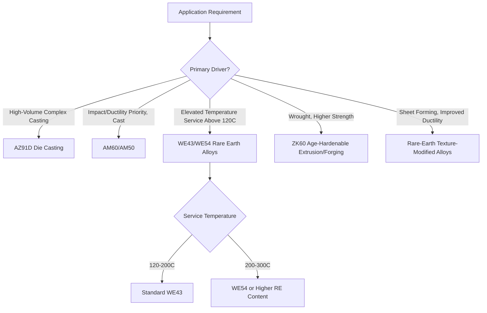

## Magnesium Alloys

### Overview

Magnesium is the lightest structural metal in common engineering use, with a density of approximately 1.74 g/cm$^3$ — roughly two-thirds that of aluminum and one-quarter that of steel — making magnesium alloys attractive wherever weight reduction is a primary design driver (automotive, aerospace, electronics housings, portable equipment). Magnesium's hexagonal close-packed (HCP) crystal structure, however, fundamentally constrains its room-temperature formability and ductility relative to FCC and BCC structural metals, making processing route selection and alloy design considerations distinct from and, in several respects, more demanding than those for aluminum or steel.

### Crystal Structure and the Formability Limitation

#### HCP Slip System Constraints

Magnesium's $c/a$ ratio (1.624) is close to the ideal HCP value (1.633), meaning basal slip ($\{0001\}\langle11\bar{2}0\rangle$) has the lowest critical resolved shear stress (CRSS) and is strongly favored at room temperature. However, basal slip alone provides only two independent slip systems, well short of the five independent systems required by the von Mises criterion for arbitrary homogeneous plastic deformation of a polycrystal. Additional slip systems (prismatic $\{10\bar{1}0\}\langle11\bar{2}0\rangle$, pyramidal $\{10\bar{1}1\}\langle11\bar{2}0\rangle$ and $\langle c+a\rangle$-type) have substantially higher CRSS at room temperature, meaning strain accommodation must rely heavily on **deformation twinning**, particularly $\{10\bar{1}2\}$ extension twinning, to supplement the limited slip system availability.

#### Twinning and Tension-Compression Yield Asymmetry

$\{10\bar{1}2\}$ extension twinning activates readily under tension along the $c$-axis (or compression perpendicular to it) but is much less active in the reverse loading sense, producing a pronounced **tension-compression yield asymmetry** unique among common structural metals — magnesium alloys can exhibit markedly different yield strengths and stress-strain curve shapes depending on whether the loading is tensile or compressive relative to the material's texture, a factor that significantly complicates both mechanical design and constitutive/finite-element modeling.

### SVG Diagram — HCP Slip and Twinning Systems in Magnesium

<svg xmlns="http://www.w3.org/2000/svg" viewBox="0 0 580 300" font-family="sans-serif">
<text x="290" y="20" text-anchor="middle" font-size="14" font-weight="bold">Deformation Mode Availability in HCP Mg (svg_diagram)</text>

<g transform="translate(90,60)">
<text x="0" y="-10" font-size="11" font-weight="bold" text-anchor="middle">Basal Slip</text>
<polygon points="-40,60 40,60 30,90 -30,90" fill="#3498db" fill-opacity="0.3" stroke="#3498db" />
<line x1="-40" y1="0" x2="-40" y2="150" stroke="#333" stroke-width="1" />
<line x1="40" y1="0" x2="40" y2="150" stroke="#333" stroke-width="1" />
<text x="0" y="180" font-size="9" text-anchor="middle">Low CRSS</text>
<text x="0" y="195" font-size="9" text-anchor="middle">2 independent systems</text>
</g>

<g transform="translate(290,60)">
<text x="0" y="-10" font-size="11" font-weight="bold" text-anchor="middle">Prismatic Slip</text>
<rect x="-30" y="40" width="60" height="100" fill="#e67e22" fill-opacity="0.3" stroke="#e67e22" />
<line x1="-40" y1="0" x2="-40" y2="150" stroke="#333" stroke-width="1" />
<line x1="40" y1="0" x2="40" y2="150" stroke="#333" stroke-width="1" />
<text x="0" y="180" font-size="9" text-anchor="middle">High CRSS at RT</text>
<text x="0" y="195" font-size="9" text-anchor="middle">Activated by heat/RE alloying</text>
</g>

<g transform="translate(480,60)">
<text x="0" y="-10" font-size="11" font-weight="bold" text-anchor="middle">{10-12} Twinning</text>
<line x1="-40" y1="0" x2="-40" y2="150" stroke="#333" stroke-width="1" />
<line x1="40" y1="0" x2="40" y2="150" stroke="#333" stroke-width="1" />
<path d="M-40,120 L40,90" stroke="#c0392b" stroke-width="2" />
<path d="M-40,140 L40,110" stroke="#c0392b" stroke-width="2" />
<text x="0" y="180" font-size="9" text-anchor="middle">Tension/comp asymmetric</text>
<text x="0" y="195" font-size="9" text-anchor="middle">Polar activation</text>
</g>
</svg>

### Alloy Classification (ASTM Designation System)

Magnesium alloys use a letter-number system where letters indicate principal alloying elements (A=Aluminum, Z=Zinc, M=Manganese, K=Zirconium, E=Rare Earth, W=Yttrium, S=Silicon) followed by numbers indicating approximate weight percent, and a temper suffix analogous in concept to the aluminum system.

#### Aluminum-Bearing Alloys (AZ, AM Series)

- **AZ91 (Mg-9Al-1Zn)**: The most widely used magnesium casting alloy, offering a good balance of castability, strength, and corrosion resistance for die-cast automotive and electronic housing components; strengthened partly by the Mg$_{17}$Al$_{12}$ ($\beta$ phase) intermetallic, which forms along grain boundaries and can be discontinuous (desirable) or continuous (embrittling, reduces creep resistance) depending on cooling rate and subsequent heat treatment
- **AM60, AM50**: Lower aluminum content than AZ91, sacrificing some strength for improved ductility and impact resistance, used in automotive structural applications (e.g., steering wheel armatures, seat frames) where energy absorption is prioritized

#### Zinc and Rare-Earth-Bearing Alloys (ZK, ZE, WE Series)

- **ZK60 (Mg-6Zn-0.5Zr)**: Age-hardenable via fine Zn-based precipitation, offering higher strength than AZ-series alloys for wrought (extruded/forged) applications, with zirconium providing effective grain refinement
- **WE43, WE54 (Mg-Y-Nd-based rare earth alloys)**: Rare earth and yttrium additions provide substantially improved elevated-temperature strength and creep resistance compared to aluminum-bearing alloys, since the Mg$_{17}$Al$_{12}$ phase in AZ-series alloys softens significantly above approximately 120°C, limiting AZ-series alloys to near-room-temperature service; WE-series alloys extend useful service temperature to 200–300°C, used in aerospace gearbox housings and other elevated-temperature-exposed structural components

### Grain Refinement Strategies

Because magnesium's limited room-temperature ductility places a premium on fine grain size (Hall-Petch benefits apply in magnesium as in other metals, and fine grain size also helps activate additional slip/twin systems by reducing the stress needed for compatible deformation across grain boundaries), grain refinement receives particular emphasis:

- **Zirconium additions**: Highly effective grain refiner in zirconium-compatible (aluminum-free) magnesium alloys via a peritectic reaction and subsequent heterogeneous nucleation, though zirconium's effectiveness is negated in aluminum-containing alloys due to Zr-Al intermetallic formation that removes zirconium from solution before it can refine the melt
- **Superheating and carbon inoculation**: Used for aluminum-bearing alloys (where Zr is ineffective) to achieve grain refinement through controlled solidification practice and carbonaceous inoculant additions
- **Rare earth and calcium additions**: Provide grain refinement in addition to their solid-solution and precipitation strengthening contributions, along with improved oxidation resistance during melting/casting (relevant given magnesium's high reactivity and flammability risk in molten and fine particulate form)

### Processing Routes

#### Die Casting

The dominant magnesium production process by volume, particularly high-pressure die casting (HPDC), exploiting magnesium's excellent castability (low viscosity, low latent heat requirement relative to volume) for high-volume, complex, thin-walled automotive and electronics components; AZ91D is the workhorse die-casting alloy.

#### Wrought Processing Challenges

Magnesium's limited room-temperature ductility (from restricted slip system availability, discussed above) makes conventional cold rolling and forming substantially more difficult than for aluminum or steel, generally necessitating:

- **Elevated-temperature forming**: Warm or hot working (typically 200–350°C) activates additional slip systems (particularly non-basal $\langle c+a\rangle$ pyramidal slip) and reduces twinning-related asymmetry effects, substantially improving formability relative to room-temperature processing
- **Texture management**: Because rolled/extruded magnesium develops a strong basal texture (as discussed in texture and anisotropy control), subsequent forming operations are strongly affected by the resulting anisotropy and twinning susceptibility, motivating alloy additions (rare earths, in particular) and processing routes specifically aimed at texture weakening to improve room-temperature formability

#### Rare-Earth Texture Modification

**Key Points**

- Certain rare earth element additions (Y, Nd, Ce, Gd) have been shown to weaken or randomize the strong basal texture that otherwise develops during magnesium rolling and extrusion, through mechanisms believed to involve altered recrystallization nucleation behavior and modified twinning activity
- Texture-weakened rare-earth-containing magnesium alloys can exhibit substantially improved room-temperature ductility and reduced tension-compression yield asymmetry compared to conventional AZ-series wrought alloys, an active area of alloy development aimed at expanding magnesium's viable application space in sheet-formed structural components [Inference: the precise mechanism of RE-induced texture weakening remains an active research topic without full scientific consensus, though the empirical texture-weakening effect itself is well documented]

### Mermaid Diagram — Magnesium Alloy Selection Logic

### Corrosion Behavior

#### Galvanic Sensitivity

Magnesium is the most anodic (least noble) common structural metal, placing it at the extreme active end of the galvanic series; even trace amounts of certain cathodic impurities (iron, nickel, copper) within the alloy itself — well below levels that would matter in other alloy systems — can establish damaging internal micro-galvanic corrosion cells, making impurity control (particularly Fe, Ni, Cu) a critical alloy specification parameter unique in its stringency among common structural metal systems.

#### High-Purity Alloy Development

Modern "high-purity" AZ91 and AM-series alloy grades control iron, nickel, and copper content to very low tolerance limits, providing substantially improved corrosion resistance compared to older-generation commercial-purity magnesium alloys, effectively addressing what was historically magnesium's most significant application-limiting weakness.

#### Coatings and Surface Treatment

Given magnesium's inherent galvanic and general corrosion sensitivity, most structural magnesium applications employ protective surface treatments (chromate or chromate-free conversion coatings, anodizing, organic coatings) as standard practice rather than relying on the base alloy's as-cast or as-wrought corrosion resistance alone.

### Flammability and Processing Safety Considerations

Magnesium's high reactivity with oxygen, combined with a relatively low ignition temperature for fine particulate (chips, dust, powder), presents a distinct safety consideration not shared to the same degree by aluminum, copper, or steel processing:

- Machining operations generating fine chips or dust require specific fire suppression considerations (Class D extinguishing agents; water is contraindicated as it can react with burning magnesium to liberate hydrogen)
- Melting and casting operations require protective atmospheres (SF$_6$/CO$_2$/air mixtures, or increasingly environmentally preferred alternatives given SF$_6$'s high global warming potential) or covering fluxes to prevent surface ignition of the molten metal

### Common Pitfalls and Practical Considerations

- Applying room-temperature sheet-forming practices developed for aluminum or steel directly to conventional magnesium alloys without accounting for the fundamentally more limited slip system availability; this typically produces cracking or requires impractically generous forming limits
- Neglecting tension-compression yield asymmetry in structural design/simulation; using a single (typically tensile) stress-strain curve to represent magnesium component behavior under combined or reversed loading can produce significantly non-conservative predictions
- Overlooking the incompatibility between zirconium grain refinement and aluminum-bearing compositions; specifying Zr as a grain refiner for an AZ-series alloy will not achieve the intended grain refinement due to Zr-Al intermetallic formation
- Underestimating impurity control requirements; iron, nickel, and copper tolerances that would be inconsequential in aluminum or steel alloys can severely compromise magnesium corrosion resistance at concentrations of only tens to hundreds of parts per million
- Failing to account for magnesium's elevated-temperature strength limitations when substituting AZ-series alloys into applications with sustained exposure above approximately 120°C, where Mg$_{17}$Al$_{12}$ phase softening substantially degrades mechanical properties compared to room-temperature specifications

**Related Topics**

- Texture and Anisotropy Control (basal texture development and rare-earth modification)
- Deformation Twinning Mechanisms and Tension-Compression Asymmetry
- Galvanic Corrosion and Impurity Control in Reactive Metal Systems
- High-Pressure Die Casting Process Design
- Grain Refinement Mechanisms Across Metal Systems (Zr, RE, inoculation)
- Elevated-Temperature Alloy Design: Comparing Mg-RE and Ni-Superalloy Approaches