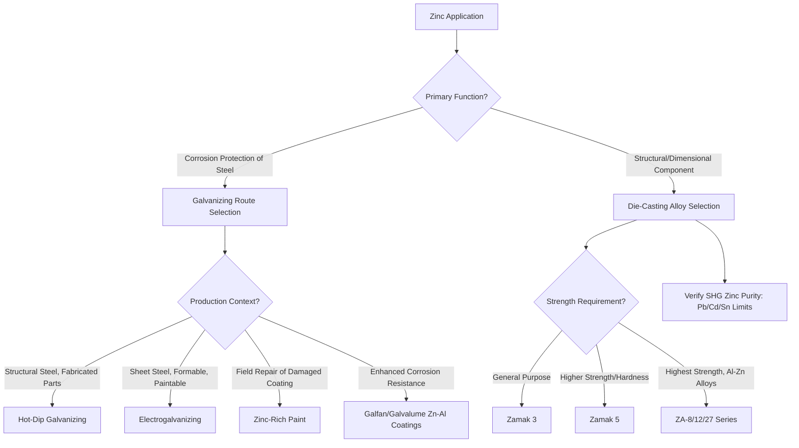

## Zinc and Zinc Alloys

### Overview

Zinc is a hexagonal close-packed (HCP) metal with a relatively low melting point (419.5°C) that occupies two major, largely distinct engineering roles: as a sacrificial corrosion-protective coating on steel (galvanizing) — by far its largest volume application — and as a base metal for die-casting alloys exploited for high-volume, dimensionally precise, thin-walled component production. Zinc's low melting point, excellent fluidity, and pronounced anodic (sacrificial) position relative to steel in the galvanic series underpin both of these applications.

### Crystal Structure and Room-Temperature Deformation Behavior

Zinc's HCP structure has a $c/a$ ratio of 1.856, substantially higher than the ideal HCP value (1.633) and higher than magnesium's near-ideal ratio. This elevated $c/a$ ratio makes basal slip even more strongly favored relative to non-basal slip systems than in magnesium, resulting in zinc exhibiting pronounced anisotropy and limited independent slip systems at room temperature, similar in general character to magnesium's formability constraints but arising from a different position along the HCP $c/a$ spectrum. Commercially, this is managed primarily through alloying (for die casting, where the alloy is never mechanically deformed in the solid state) and through warm/hot working practice for the more limited wrought zinc product forms (rolled sheet, extruded sections).

### Galvanizing: Zinc as a Sacrificial Coating

#### Galvanic Protection Mechanism

Zinc's position as more anodic (active) than steel in the galvanic series means that, when coupled, zinc corrodes preferentially, providing **cathodic (sacrificial) protection** to the underlying steel — critically, this protection continues even where the coating is locally damaged or scratched, exposing bare steel, because the surrounding intact zinc continues to act as the sacrificial anode for the exposed area. This self-healing characteristic at damaged sites is the key functional advantage of galvanizing over barrier-only coatings (paint, for example), which provide no protection once breached.

#### Hot-Dip Galvanizing

Steel is immersed in a molten zinc bath (typically 445–460°C), forming a series of zinc-iron intermetallic layers (Gamma, Delta, Zeta phases, in order of increasing zinc content moving outward from the steel substrate) topped by a relatively pure eta ($\eta$) zinc layer. Coating thickness and structure depend on immersion time, steel composition (silicon content notably affects intermetallic layer growth kinetics — the Sandelin effect, where certain silicon ranges produce excessive, brittle intermetallic layer growth), and withdrawal/cooling practice.

#### Other Galvanizing/Zinc Coating Methods

- **Electrogalvanizing**: Electrodeposition of a pure zinc layer, producing a thinner, more uniform, and more readily paintable coating than hot-dip galvanizing, commonly used for automotive sheet steel and appliance applications where surface finish and formability post-coating are priorities
- **Zinc-rich paints**: Organic or inorganic binder systems loaded with metallic zinc dust, providing galvanic protection through a paint application process rather than a metallurgical bonding process, used for maintenance/repair of damaged galvanized coatings and for large structures impractical to hot-dip
- **Zinc-Aluminum Coatings (Galfan, Galvalume)**: Zn-Al (Galfan, ~5% Al) or Al-Zn (Galvalume, ~55% Al) coating alloys provide improved corrosion resistance and, in some formulations, improved formability compared to pure zinc hot-dip coatings, exploiting aluminum's contribution to barrier-type protection alongside zinc's sacrificial protection

### SVG Diagram — Hot-Dip Galvanized Coating Structure

<svg xmlns="http://www.w3.org/2000/svg" viewBox="0 0 500 300" font-family="sans-serif">
<text x="250" y="20" text-anchor="middle" font-size="14" font-weight="bold">Hot-Dip Galvanized Coating Cross-Section (svg_diagram)</text>
<rect x="100" y="220" width="300" height="60" fill="#95a5a6" stroke="#333" />
<text x="250" y="255" text-anchor="middle" font-size="11" fill="white">Steel Substrate</text>
<rect x="100" y="200" width="300" height="20" fill="#7f8c8d" stroke="#333" />
<text x="250" y="214" text-anchor="middle" font-size="9" fill="white">Gamma Phase (highest Fe)</text>
<rect x="100" y="175" width="300" height="25" fill="#95a5a6" stroke="#333" />
<text x="250" y="191" text-anchor="middle" font-size="9">Delta Phase</text>
<rect x="100" y="150" width="300" height="25" fill="#bdc3c7" stroke="#333" />
<text x="250" y="166" text-anchor="middle" font-size="9">Zeta Phase</text>
<rect x="100" y="110" width="300" height="40" fill="#ecf0f1" stroke="#333" />
<text x="250" y="134" text-anchor="middle" font-size="10">Eta Phase (Pure Zinc, outer layer)</text>
<line x1="100" y1="90" x2="100" y2="280" stroke="#333" stroke-width="1" />
<line x1="400" y1="90" x2="400" y2="280" stroke="#333" stroke-width="1" />

<text x="420" y="130" font-size="9">Increasing</text>

<text x="420" y="145" font-size="9">Zn content</text>

<text x="420" y="160" font-size="9">outward</text>

</svg>

### Zinc Die-Casting Alloys

#### Zamak (No. 3, No. 5) and ZA Alloy Families

Zinc's low melting point and excellent fluidity make it exceptionally well-suited to high-pressure die casting, enabling extremely high production rates, tight dimensional tolerance, thin wall sections, and excellent surface finish suitable for direct plating (chrome plating of zinc die castings is a longstanding application in automotive trim and hardware).

- **Zamak 3 (Zn-4Al)**: The most widely used general-purpose die-casting alloy, offering good dimensional stability, ductility, and casting characteristics
- **Zamak 5 (Zn-4Al-1Cu)**: Copper addition provides increased strength and hardness compared to Zamak 3, at some cost to ductility
- **ZA-8, ZA-12, ZA-27 (increasing aluminum content series)**: Higher-aluminum alloys extending the strength range upward, with ZA-27 achieving mechanical properties competitive with some aluminum and cast iron alloys while retaining zinc's excellent castability and lower processing temperature

#### Critical Impurity Control: Intergranular Corrosion in Zinc Die Castings

**Key Points**

- Historically, zinc die castings suffered from a well-documented intergranular corrosion and dimensional instability failure mode when lead, cadmium, or tin impurities exceeded very low tolerance limits, as these elements segregate to grain boundaries and react with moisture to produce volume-expanding corrosion products that cause swelling, cracking, and eventual disintegration of the casting — sometimes over a period of years in service, making this a historically significant and costly failure mode
- Modern "special high grade" (SHG) zinc, refined to very high purity (99.99%+) with tightly controlled Pb, Cd, and Sn impurity limits, has essentially eliminated this failure mode in properly specified modern die-casting production, making raw material purity certification a critical specification requirement for zinc die-casting applications
- This case is frequently cited as a classic materials engineering lesson in trace impurity control, analogous in pedagogical importance to hydrogen embrittlement in steel or SCC in high-strength aluminum, despite being less frequently encountered in current production due to modern purity control practice

### Mermaid Diagram — Zinc Application Selection Logic

### Wrought Zinc Products

Rolled zinc sheet (used historically and currently in roofing, flashing, and architectural cladding applications, particularly in European building practice) requires warm rolling (typically 100–150°C) rather than cold rolling due to the room-temperature brittleness associated with zinc's limited slip system availability discussed above; small alloying additions (Cu, Ti) are used to refine grain size and improve creep resistance in architectural sheet applications, since pure zinc exhibits measurable creep even near room temperature due to its low homologous temperature threshold for creep-active mechanisms (a consequence of zinc's relatively low absolute melting point).

### Corrosion Behavior

#### Atmospheric Corrosion and Patina Formation

Zinc forms a protective patina in atmospheric exposure, initially zinc oxide/hydroxide that further reacts with atmospheric carbon dioxide and moisture to form basic zinc carbonate, a relatively stable, adherent, low-solubility compound that substantially slows further corrosion — the corrosion-rate-limiting mechanism underlying galvanizing's multi-decade service life in many atmospheric exposure conditions.

#### Environmental Sensitivity

Zinc's corrosion rate is significantly affected by exposure environment: marine (chloride) and industrial (sulfur dioxide) atmospheres accelerate corrosion relative to rural/inland exposure, and zinc corrosion products can be soluble and washed away in some acidic rainfall conditions rather than forming the stable protective patina achieved in more neutral-pH environments, meaning galvanized coating service life estimates are environment-specific rather than universal.

### Common Pitfalls and Practical Considerations

- Specifying standard hot-dip galvanizing for steel with silicon content in the Sandelin-effect-susceptible range without accounting for potentially excessive, brittle intermetallic layer growth, which can produce a dull gray finish and reduced coating adhesion/ductility compared to typical galvanized coatings
- Overlooking that galvanic protection at coating damage sites depends on sufficient remaining zinc area/thickness to sustain sacrificial current density; very small or heavily corroded zinc coatings can lose effective cathodic protection capability at damage sites well before the coating is visually "gone"
- Using non-SHG-grade zinc or scrap-sourced zinc without impurity certification in die-casting applications, risking the historically significant intergranular corrosion/dimensional instability failure mode associated with Pb/Cd/Sn contamination
- Assuming zinc die-cast component mechanical properties are temperature-independent; zinc alloys (particularly Zamak grades) can exhibit reduced impact strength and dimensional stability changes at elevated service temperatures and can be susceptible to some degree of natural aging dimensional change over time, relevant for precision dimensional applications
- Applying cold-working practice to wrought zinc products without accounting for room-temperature brittleness from limited HCP slip system availability, risking cracking during fabrication

**Related Topics**

- Galvanic Corrosion Series and Sacrificial Anode Protection Principles
- Hot-Dip Galvanizing Process Metallurgy and the Sandelin Effect
- Zinc Die-Casting Alloy Design and Impurity Control (Zamak/ZA Systems)
- HCP Slip Systems and Formability Constraints (cross-reference: magnesium alloys)
- Atmospheric Corrosion Mechanisms and Protective Patina Formation
- Steel Coating Systems Comparison (Galvanizing vs. Galvalume vs. Organic Coatings)