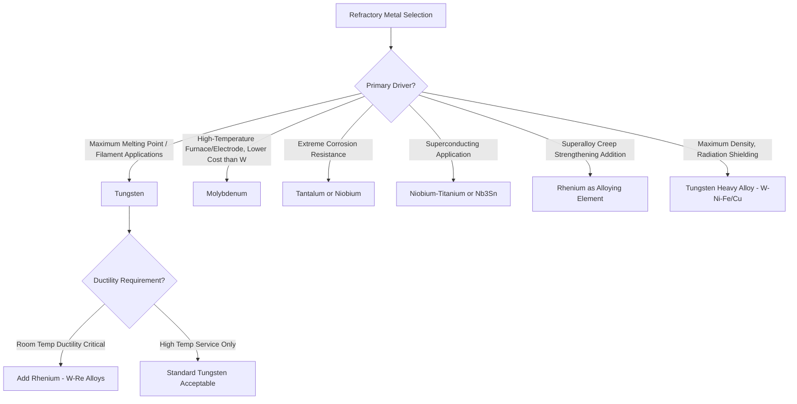

## Precious and Refractory Metals

### Overview

Precious metals (gold, silver, platinum group metals) and refractory metals (tungsten, molybdenum, tantalum, niobium, rhenium) represent two distinct classes united primarily by high cost and specialized application niches rather than shared metallurgical characteristics. Precious metals are valued for corrosion/oxidation resistance, electrical contact reliability, and catalytic activity; refractory metals are valued for exceptionally high melting points and retained strength at extreme temperature, defined conventionally as melting points exceeding approximately 2000°C.

### Precious Metals

#### Gold (Au)

Gold is FCC, exceptionally corrosion- and oxidation-resistant (essentially inert to atmospheric and most chemical attack, disproportionately so among metals), and among the most ductile and malleable of all metals, permitting mechanical working to extraordinarily thin foil without fracture. Pure gold's low hardness and strength necessitate alloying for most functional (non-decorative or non-electronic-contact) applications.

- **Karat system**: Purity expressed in parts per 24 (24K = pure gold; 18K = 75% Au); alloying additions (Ag, Cu, sometimes Ni, Zn, Pd) are used both to reduce cost and to tune color (Cu additions shift toward rose/red gold, Ag toward greenish-yellow, Pd/Ni toward white gold) and to increase hardness/wear resistance for jewelry applications
- **Electronic applications**: Gold's excellent electrical conductivity, oxidation resistance, and reliable low-resistance contact behavior make it standard for wire bonding in semiconductor packaging and for high-reliability electrical contacts (connectors, relays) where oxide-film-induced contact resistance instability must be avoided over long service life

#### Silver (Ag)

Silver possesses the highest electrical and thermal conductivity of any metal, exceeding even copper, but is more prone to tarnishing (surface sulfide film formation from atmospheric hydrogen sulfide/sulfur compounds) than gold, limiting its use in exposed electrical contact applications relative to gold or gold-plated alternatives despite silver's superior intrinsic conductivity. Silver alloys (sterling silver, 92.5% Ag-7.5% Cu) are used extensively in jewelry and tableware, with the copper addition substantially improving hardness and wear resistance relative to pure (fine) silver.

#### Platinum Group Metals (PGMs): Pt, Pd, Rh, Ir, Ru, Os

The platinum group metals share high melting points (Pt: 1768°C; Pd: 1555°C; Rh: 1964°C; Ir: 2446°C), excellent high-temperature oxidation resistance, and significant catalytic activity, underpinning their dominant application in automotive catalytic converters (Pt, Pd, Rh combinations for oxidation/reduction of exhaust pollutants), industrial chemical catalysis, and high-temperature/corrosion-resistant laboratory and industrial equipment (platinum crucibles, thermocouples).

- **Pt-Rh thermocouples (Type R, S, B)**: Exploit PGM oxidation resistance and stable, well-characterized thermoelectric behavior for high-temperature (up to ~1700°C) precision temperature measurement in industrial and laboratory settings where base-metal thermocouples would oxidize or drift
- **Iridium**: The most corrosion-resistant metal known, essentially unattacked by most acids (including aqua regia, which dissolves gold and platinum), combined with a very high melting point, used in specialized high-temperature crucible and spark plug electrode applications where extreme chemical and thermal stability is required

### SVG Diagram — Precious Metal Property Comparison

<svg xmlns="http://www.w3.org/2000/svg" viewBox="0 0 560 300" font-family="sans-serif">
<text x="280" y="20" text-anchor="middle" font-size="14" font-weight="bold">Precious Metal Property Positioning (svg_diagram)</text>
<line x1="80" y1="260" x2="500" y2="260" stroke="#333" stroke-width="1.5" />
<line x1="80" y1="260" x2="80" y2="50" stroke="#333" stroke-width="1.5" />
<text x="290" y="285" text-anchor="middle" font-size="11">Melting Point increasing right</text>
<text x="35" y="155" text-anchor="middle" font-size="11" transform="rotate(-90,35,155)">Corrosion Resistance</text>
<circle cx="130" cy="90" r="8" fill="#f1c40f" />
<text x="130" y="75" text-anchor="middle" font-size="10">Au</text>
<circle cx="140" cy="160" r="8" fill="#bdc3c7" />
<text x="140" y="145" text-anchor="middle" font-size="10">Ag</text>
<circle cx="300" cy="80" r="8" fill="#95a5a6" />
<text x="300" y="65" text-anchor="middle" font-size="10">Pt</text>
<circle cx="260" cy="100" r="8" fill="#7f8c8d" />
<text x="260" y="115" text-anchor="middle" font-size="10">Pd</text>
<circle cx="400" cy="60" r="8" fill="#34495e" />
<text x="400" y="45" text-anchor="middle" font-size="10">Ir</text>
<circle cx="380" cy="70" r="8" fill="#2c3e50" />
<text x="380" y="90" text-anchor="middle" font-size="10">Rh</text>
</svg>

### Refractory Metals

#### Tungsten (W)

Tungsten has the highest melting point of any metal (3422°C) and is BCC, exhibiting good high-temperature strength retention but pronounced ductile-to-brittle transition behavior — tungsten is typically brittle at room temperature in the recrystallized or cast condition, a significant fabrication and application constraint distinguishing refractory metal behavior from that of typical structural metals.

- **Incandescent lamp filaments**: Historically tungsten's dominant high-volume application, exploiting its high melting point (enabling high operating temperature and thus high luminous efficiency) and low vapor pressure (minimizing filament evaporation/thinning during service)
- **Heavy alloys (W-Ni-Fe, W-Ni-Cu)**: Tungsten combined with a ductile nickel-based binder phase via liquid-phase sintering (powder metallurgy processing, discussed further below) produces high-density (typically 17–18.5 g/cm$^3$) materials used for radiation shielding, kinetic energy penetrators, and balancing weights where maximum density is the design driver
- **Cutting tool and wear applications**: Tungsten carbide (WC, typically in a cobalt binder as "cemented carbide") is the dominant cutting tool and wear-resistant material for metal machining and mining/drilling applications, exploiting WC's extreme hardness combined with cobalt-binder-provided toughness

#### Molybdenum (Mo)

Molybdenum (melting point 2623°C) shares tungsten's BCC structure and ductile-to-brittle transition tendency but at somewhat lower cost and density, used for high-temperature furnace heating elements, glass-melting electrodes, and as a key alloying addition (rather than base metal) in steel and superalloy systems for hardenability, high-temperature strength, and pitting corrosion resistance.

#### Tantalum (Ta) and Niobium (Nb)

Tantalum and niobium (melting points 3017°C and 2477°C respectively) are BCC refractory metals distinguished by exceptional corrosion resistance from a highly stable, chemically inert native oxide film (particularly Ta$_2$O$_5$), providing corrosion resistance in aggressive chemical environments (including many strong acids) rivaling or exceeding that of noble metals at substantially lower cost.

- **Tantalum capacitors**: Exploit Ta$_2$O$_5$'s excellent dielectric properties and stability, forming the basis of a major electronics industry application distinct from tantalum's structural/corrosion-resistant uses
- **Chemical process equipment**: Tantalum-lined vessels and components are used where extreme corrosion resistance is required and cost can be justified, often as a thin liner or cladding over a lower-cost structural substrate rather than solid tantalum construction
- **Niobium in superconducting applications**: Niobium and Nb-Ti/Nb$_3$Sn alloys are the dominant practical low-temperature superconducting materials, used extensively in MRI magnets and superconducting accelerator magnets — an application domain entirely distinct from niobium's more commonly discussed role as a steel microalloying addition

#### Rhenium (Re)

Rhenium (melting point 3186°C, second highest of all metals) is notable for a distinctive strengthening effect when alloyed into tungsten or molybdenum (the "rhenium effect"), substantially improving low-temperature ductility and weldability of these otherwise brittle refractory metals, and for its use as a solid-solution strengthening addition in nickel-based single-crystal superalloys (second- and third-generation single-crystal alloys contain significant Re content specifically for elevated-temperature creep strength improvement). Rhenium's extreme scarcity and cost (among the rarest and most expensive engineering metals) restrict its use to applications where performance benefit clearly justifies cost.

### Mermaid Diagram — Refractory Metal Application Logic

### Powder Metallurgy Processing of Refractory Metals

#### Why Conventional Melting/Casting Is Often Impractical

The extremely high melting points of tungsten, molybdenum, tantalum, and niobium make conventional melting and ingot casting technically difficult (requiring specialized furnace technology such as electron beam or arc melting under vacuum/inert atmosphere) and, for tungsten and molybdenum particularly, cast/recrystallized microstructures exhibit poor room-temperature ductility due to grain boundary weakness and impurity segregation effects.

#### Sintering and Liquid-Phase Sintering

Powder metallurgy processing — pressing fine metal powder into a green compact followed by sintering below the melting point — avoids the extreme melting temperature requirement and, for single-phase refractory metal products (pure W or Mo mill products), produces a fine-grained, more ductile microstructure than cast material through subsequent thermomechanical working (swaging, rolling, drawing) of the sintered billet. For heavy alloys and cemented carbides, **liquid-phase sintering** exploits a lower-melting-point binder phase (Ni-Fe for tungsten heavy alloys, Co for tungsten carbide) that becomes liquid at the sintering temperature, wetting and bonding the refractory metal/carbide particles while densifying the compact to near-full density without requiring the refractory phase itself to melt.

**Key Points**

- Cemented tungsten carbide (WC-Co) is one of the most commercially significant powder-metallurgy products globally, with cobalt content (typically 3–25 wt%) tuned to balance hardness/wear resistance (favored by low Co) against toughness/impact resistance (favored by higher Co) for specific cutting tool, mining, or wear-part applications
- Fine WC grain size, controlled via powder particle size and sintering practice, generally improves both hardness and toughness simultaneously (a Hall-Petch-type benefit analogous to grain refinement in conventional alloys), making WC grain size a critical, closely controlled processing parameter in premium cutting tool grades

### Common Pitfalls and Practical Considerations

- Assuming refractory metals behave like conventional structural metals at room temperature; tungsten and molybdenum's pronounced ductile-to-brittle transition means room-temperature fabrication (bending, forming) of these metals requires specific processing history (worked/recrystallized state) and may still require elevated-temperature processing to avoid cracking
- Confusing precious metal purity/karat specifications with mechanical property implications; higher-karat gold is softer and less wear-resistant, not simply "better," making alloy selection application-specific (high-karat for corrosion-critical electronic contacts vs. lower-karat for wear-resistant jewelry)
- Overlooking that niobium's applications span two essentially unrelated domains (steel microalloying vs. superconducting magnet technology), leading to potential confusion when comparing property or cost data without specifying which application context and material form is relevant
- Selecting cemented carbide grade based on hardness alone without considering the hardness-toughness trade-off governed by cobalt binder content, risking premature tool failure from chipping/fracture in interrupted or impact-loaded cutting applications despite adequate wear resistance
- Underestimating rhenium's cost impact when specifying Re-containing superalloys or W-Re alloys; rhenium's extreme scarcity makes it one of the largest single cost drivers in advanced single-crystal superalloy compositions, relevant to both material selection and supply chain risk assessment

**Related Topics**

- Cemented Carbide (WC-Co) Metallurgy and Grade Selection
- Powder Metallurgy Processing: Pressing, Sintering, and Liquid-Phase Sintering
- Nickel Superalloy Refractory Element Strengthening (Re, W, Mo effects)
- Superconducting Materials: Niobium-Titanium and Nb3Sn Processing
- Ductile-to-Brittle Transition Behavior in BCC Metals
- Precious Metal Alloying for Jewelry and Electronic Contact Applications
- Corrosion-Resistant Refractory Metal Linings in Chemical Process Equipment