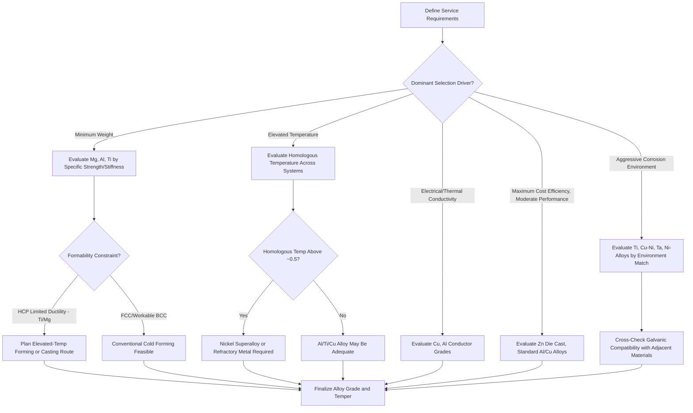

## Selection Criteria for Nonferrous Alloys

### Overview

Selecting among nonferrous alloy systems — aluminum, copper, titanium, nickel, magnesium, zinc, and precious/refractory metals — requires a structured evaluation framework that weighs mechanical performance, environmental resistance, fabricability, and total lifecycle cost against the specific service requirements of the application. Because nonferrous alloys frequently compete both against each other and against ferrous alternatives, selection criteria must be applied comparatively rather than treating any single property in isolation.

### Primary Selection Criteria Categories

#### Specific Strength and Density-Driven Selection

For weight-critical applications (aerospace, automotive, portable equipment), specific strength (strength-to-density ratio) and specific stiffness (modulus-to-density ratio) are frequently the dominant selection criteria rather than absolute strength alone. This framework consistently favors, in approximate ascending order of achievable specific strength for structural applications: magnesium alloys (lowest density but limited absolute strength and formability), aluminum alloys (intermediate density, broad strength range, mature processing base), titanium alloys (higher density than aluminum but substantially higher specific strength, particularly at elevated temperature), with nickel superalloys reserved for applications where elevated-temperature capability outweighs specific strength considerations entirely.

$$\text{Specific Strength} = \frac{\sigma_y}{\rho}$$

**Key Points**

- A material with lower absolute strength but sufficiently lower density can outperform a nominally stronger, denser alternative in weight-limited structural applications, which is why direct strength comparison across alloy families without normalizing for density can lead to incorrect selection conclusions
- Specific stiffness comparisons matter independently of specific strength comparisons in deflection-limited (rather than yield-limited) design, and the two criteria do not always favor the same material — magnesium and aluminum have similar specific stiffness despite magnesium's lower specific strength in many alloy comparisons [Unverified: exact relative rankings depend on the specific alloy grades and property basis being compared]

### SVG Diagram — Specific Strength vs. Service Temperature Selection Map

<svg xmlns="http://www.w3.org/2000/svg" viewBox="0 0 580 320" font-family="sans-serif">
<text x="290" y="20" text-anchor="middle" font-size="14" font-weight="bold">Nonferrous Alloy Selection Map: Specific Strength vs. Temperature (svg_diagram)</text>
<line x1="70" y1="280" x2="530" y2="280" stroke="#333" stroke-width="1.5" />
<line x1="70" y1="280" x2="70" y2="50" stroke="#333" stroke-width="1.5" />
<text x="300" y="305" text-anchor="middle" font-size="11">Service Temperature increasing right</text>
<text x="30" y="165" text-anchor="middle" font-size="11" transform="rotate(-90,30,165)">Specific Strength</text>
<ellipse cx="130" cy="150" rx="45" ry="60" fill="#2ecc71" fill-opacity="0.3" stroke="#27ae60" />
<text x="130" y="150" text-anchor="middle" font-size="10">Mg Alloys</text>
<ellipse cx="220" cy="110" rx="55" ry="70" fill="#3498db" fill-opacity="0.3" stroke="#2980b9" />
<text x="220" y="105" text-anchor="middle" font-size="10">Al Alloys</text>
<ellipse cx="330" cy="90" rx="60" ry="80" fill="#e67e22" fill-opacity="0.3" stroke="#d35400" />
<text x="330" y="85" text-anchor="middle" font-size="10">Ti Alloys</text>
<ellipse cx="460" cy="120" rx="60" ry="90" fill="#9b59b6" fill-opacity="0.3" stroke="#8e44ad" />
<text x="460" y="115" text-anchor="middle" font-size="10">Ni Superalloys</text>

<text x="130" y="270" font-size="9" text-anchor="middle">~room temp</text>

<text x="330" y="270" font-size="9" text-anchor="middle">~300-600C</text>

<text x="460" y="270" font-size="9" text-anchor="middle">~700-1100C</text>

</svg>

#### Corrosion and Environmental Resistance

Environmental service conditions frequently narrow alloy choice more decisively than mechanical property requirements alone:

- **General atmospheric/mild aqueous exposure**: Aluminum and zinc-coated steel typically offer adequate performance at low relative cost
- **Marine/chloride environments**: Copper-nickel alloys, aluminum bronzes, and certain aluminum series (5xxx) provide established performance histories; titanium provides superior resistance but at substantially higher cost, justified primarily where weight, higher-temperature capability, or extreme service severity also apply
- **Strong acids/aggressive chemical processing**: Titanium, tantalum, and select nickel alloys (Hastelloy family) are selected specifically for chemical resistance exceeding that available from more common structural alloys, with tantalum reserved for the most severe/highest-value applications given its cost
- **Galvanic compatibility**: Any multi-material assembly requires galvanic series position review; aluminum and magnesium's strongly anodic character and titanium's strongly cathodic (noble) character both create galvanic corrosion risk when directly coupled to less carefully matched metals, requiring isolation, compatible fastener selection, or sacrificial design consideration

#### Elevated-Temperature Service

Selection for elevated-temperature applications must account for both absolute temperature capability and the specific degradation mechanism relevant to the application (creep, oxidation, microstructural instability):

$$T_{homologous} = \frac{T_{service}}{T_{melting}}$$

Homologous temperature provides a useful cross-alloy-system comparison metric, since creep-controlled deformation mechanisms generally become significant above approximately $T_{homologous} \approx 0.4$–0.5, meaning a given absolute service temperature represents a far more severe condition for a lower-melting-point alloy (aluminum, magnesium) than for a higher-melting-point one (titanium, nickel superalloys) — this is why aluminum alloys are generally unsuitable above roughly 150–200°C for sustained structural service while nickel superalloys remain useful to 1000°C and beyond.

#### Fabricability and Manufacturing Compatibility

- **Weldability**: Varies dramatically even within a single alloy family (aluminum 5xxx/6xxx generally weldable, 2xxx/7xxx generally not without specialized processes; nickel Inconel 718 weldable, many $\gamma'$-rich superalloys prone to strain-age cracking); selection must account for the intended joining method rather than base-alloy properties alone
- **Formability**: HCP metals (titanium, magnesium, zinc) present formability constraints from limited room-temperature slip system availability absent in FCC (aluminum, copper, nickel) or appropriately processed BCC systems, frequently necessitating elevated-temperature forming operations that add processing cost and complexity
- **Castability vs. wrought processing suitability**: Some alloy systems (Al-Si castings, Zamak zinc die-casting alloys, 3xx.x aluminum) are specifically formulated for casting and are not typically produced as wrought mill products, while others (most 6xxx aluminum, most titanium alloys) are primarily wrought-processed; matching the alloy family to the intended production process is a foundational selection step often determined before detailed alloy grade selection occurs
- **Machinability**: Free-machining variants (leaded brass, tellurium copper) exist specifically to address machinability where it is the dominant cost driver, at the expense of other properties (corrosion resistance, potential regulatory restriction for leaded grades)

### Mermaid Diagram — Nonferrous Alloy Selection Decision Framework

### Cost Considerations Across the Alloy Selection Chain

#### Raw Material Cost Hierarchy

Approximate relative raw material cost per unit mass (highly time- and market-dependent) generally ranks, from lowest to highest: zinc and aluminum (lowest-cost common structural nonferrous metals) < magnesium < copper < titanium < nickel superalloys < refractory metals (Ta, W, Mo) < precious metals (Ag, Au, PGMs, with Re among the most expensive of all). [Unverified: actual market pricing fluctuates significantly and should be verified against current data for any specific procurement decision]

#### Total Cost of Ownership Beyond Raw Material

- **Processing cost**: Titanium and nickel superalloy machining costs substantially exceed raw material cost differentials alone due to low machinability, tool wear, and specialized processing requirements (inert gas welding, vacuum melting)
- **Life-cycle/maintenance cost**: A higher-initial-cost, more corrosion-resistant alloy (titanium, copper-nickel) can present lower total lifecycle cost than a cheaper alternative requiring more frequent replacement, coating maintenance, or inspection in aggressive service environments
- **Weight-driven system-level cost**: In aerospace and some automotive contexts, the value of weight savings (fuel economy, payload capacity) can justify substantially higher per-kilogram material and processing cost for aluminum, titanium, or magnesium relative to steel or cast iron alternatives, a calculation specific to the application's weight-sensitivity economics rather than a generalizable rule

### Worked Example: Structural Bracket Selection

**Example**

A structural bracket for an aircraft interior fitting requires moderate strength, corrosion resistance, weldability for assembly, and minimum weight, with service temperature not exceeding 100°C:

1. **Elevated temperature check**: 100°C service temperature is well within the useful range for aluminum alloys (homologous temperature relative to aluminum's ~660°C melting point remains low), eliminating the need to consider titanium or nickel alloys purely on temperature grounds
2. **Weldability requirement**: Screens out 2xxx and 7xxx aluminum series in favor of 5xxx or 6xxx alloys
3. **Corrosion environment**: Aircraft interior (non-marine, controlled environment) does not require the enhanced corrosion resistance of 5xxx magnesium-bearing alloys over 6xxx, so this criterion does not further narrow selection
4. **Strength/formability balance**: 6061-T6 provides adequate strength with good weldability and established aerospace qualification history

**Conclusion**: 6061-T6 aluminum represents an appropriate selection, illustrating how sequential application of temperature, fabricability, and environmental criteria progressively narrows the alloy family and grade selection rather than requiring simultaneous evaluation of all criteria at once.

### Common Pitfalls and Practical Considerations

- Selecting an alloy based on a single standout property (e.g., titanium's corrosion resistance) without verifying that other requirements (weldability, cost, machinability) are compatible with the application's full constraint set
- Comparing absolute mechanical properties across alloy families without normalizing for density in weight-critical applications, potentially eliminating a lighter, adequately performing alternative in favor of a nominally "stronger" but heavier option
- Overlooking galvanic compatibility when finalizing material selection for multi-material assemblies, since an otherwise ideal alloy choice can perform poorly if placed in unfavorable galvanic contact with adjacent structure
- Applying room-temperature property data to elevated-temperature applications without homologous temperature context, risking selection of an alloy whose absolute melting point appears adequate but whose creep or microstructural stability performance at the actual service temperature is insufficient
- Underweighting total lifecycle and processing cost relative to raw material cost, particularly for difficult-to-machine or difficult-to-weld alloys (titanium, nickel superalloys) where downstream processing cost can dominate the total component cost far more than the base material price suggests

**Related Topics**

- Specific Strength and Specific Stiffness in Weight-Critical Structural Design
- Homologous Temperature and Creep-Controlled Deformation Regimes
- Galvanic Corrosion and Dissimilar Metal Compatibility Across Alloy Systems
- Total Cost of Ownership Analysis in Materials Selection
- Weldability Comparison Across Aluminum, Titanium, and Nickel Alloy Families
- Aluminum and Its Alloys / Titanium and Titanium Alloys / Nickel and Nickel Superalloys (cross-reference for detailed alloy-specific data)