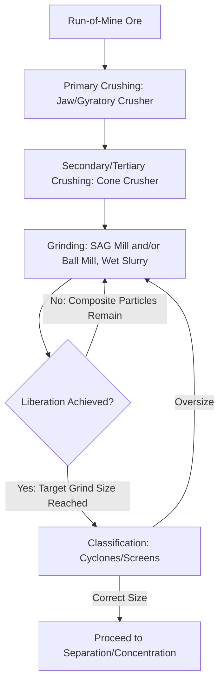
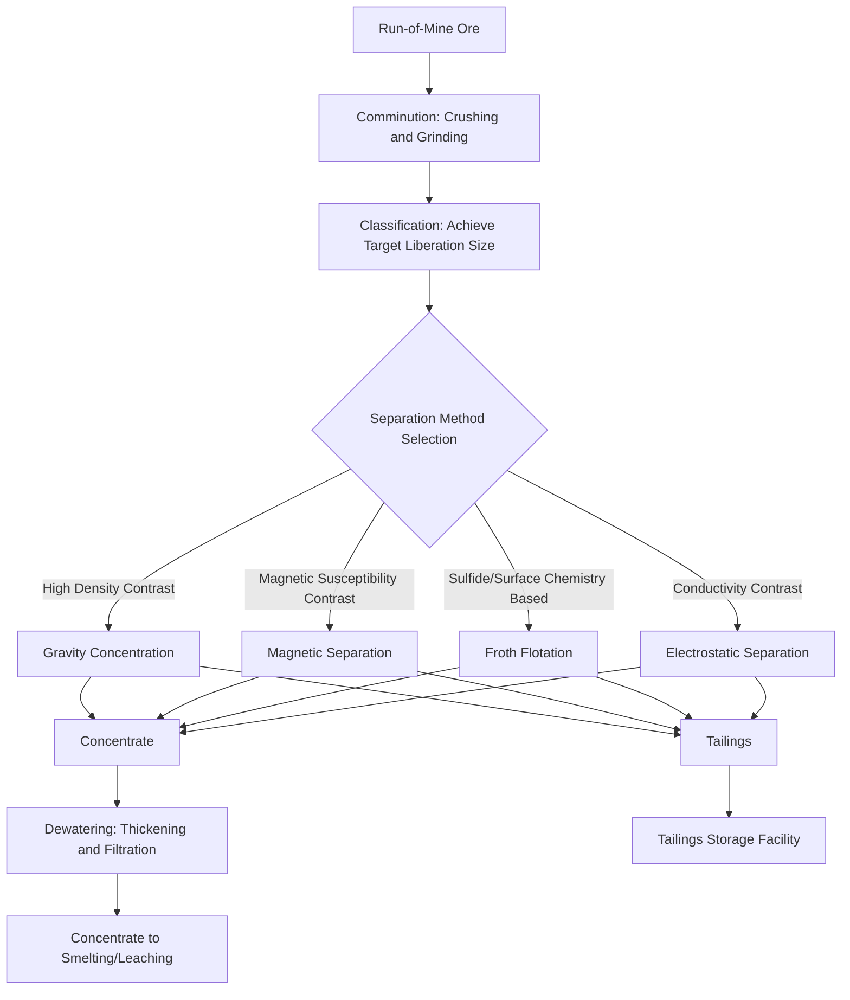

## Ore Beneficiation and Mineral Processing

### Overview

Ore beneficiation and mineral processing encompass the physical and physicochemical operations applied to run-of-mine ore to upgrade its metal or mineral content before smelting, leaching, or other extractive metallurgical treatment. Because ore as mined typically contains the valuable mineral(s) intimately intergrown with gangue (economically worthless) minerals at concentrations far below what downstream extraction processes can treat economically, beneficiation serves as the essential bridge between mining and extractive metallurgy proper, dramatically reducing the mass of material requiring energy-intensive downstream processing while producing a concentrate of specified grade and quality.

### Comminution: Size Reduction

#### Purpose and Stages

Comminution reduces ore particle size to (a) liberate valuable mineral grains from gangue at a scale where subsequent separation becomes physically possible, and (b) achieve the particle size required by the specific downstream separation process to be employed. Comminution proceeds in progressively finer stages due to the impracticality and energy inefficiency of achieving large size reductions in a single operation:

- **Crushing** (typically to 5–25 mm): Performed dry using jaw crushers (compression between a fixed and moving plate, used for primary/coarse crushing), gyratory crushers (compression within a conical chamber, high throughput primary crushing), and cone crushers (secondary/tertiary crushing to finer product sizes)
- **Grinding** (typically to below 1 mm, often to tens of microns): Performed wet (as a slurry) in rotating cylindrical mills — ball mills (steel ball grinding media, most common for fine grinding), rod mills (steel rod media, produce more uniform particle size distribution, often used as a preparatory stage ahead of ball milling), and semi-autogenous (SAG) or fully autogenous (AG) mills (using large ore fragments or, for AG, the ore itself as grinding media, reducing steel media consumption)

#### Liberation Size and the Grinding-Recovery Trade-off

**Key Points**

- The liberation size is the particle size at which the valuable mineral is sufficiently freed from gangue to permit efficient separation; grinding finer than the liberation size wastes energy without improving recoverable grade, while grinding coarser than the liberation size leaves valuable mineral locked in composite (unliberated) particles that separation processes cannot efficiently recover
- Because comminution (particularly fine grinding) is typically the most energy-intensive stage in the entire mineral processing and extractive metallurgy flowsheet, determining the minimum grind size that achieves adequate liberation — rather than grinding as fine as practically possible — is a central process optimization objective, generally established through mineralogical characterization (grain size, texture) and bench/pilot-scale testing specific to each ore body
- Overgrinding can also generate excessive fine particles ("slimes") that behave poorly in subsequent separation processes (particularly froth flotation, where very fine particles have reduced flotation recovery efficiency and can increase reagent consumption), making grind size optimization a genuine multi-objective balance rather than a simple energy-minimization exercise

### Mermaid Diagram — Comminution Circuit and Liberation Concept

### Classification and Sizing

Following grinding, classification separates particles by size (as a proxy for adequate liberation) typically using hydrocyclones (centrifugal classification within a wet slurry, the dominant industrial method for fine particle classification) or, for coarser separations, vibrating screens. Oversize material is typically recirculated to grinding (closed-circuit grinding), a configuration that improves overall grinding efficiency compared to open-circuit (single-pass) grinding by preventing overgrinding of already-liberated fine particles while ensuring coarse composite particles receive additional grinding.

### Physical Separation (Concentration) Methods

#### Gravity Concentration

Exploits density differences between valuable mineral and gangue using devices such as jigs (pulsating water flow separates particles by density and size), spiral concentrators (helical channel exploiting differential settling and centrifugal effects, widely used for iron ore and mineral sands processing), and shaking tables (exploit differential particle movement under combined shaking motion and water flow). Gravity concentration is most effective when there is a substantial density contrast between valuable mineral and gangue (e.g., gold, tin, tungsten, iron ore, heavy mineral sands) and is generally lower-cost and more environmentally benign (fewer chemical reagents) than flotation, making it a preferred first-choice method where density contrast is favorable.

#### Magnetic Separation

Exploits magnetic susceptibility differences, applicable directly to strongly magnetic minerals (magnetite, using low-intensity magnetic separators) and, with higher-intensity/high-gradient magnetic separation equipment, to weakly magnetic minerals (hematite, ilmenite) that are not amenable to low-intensity magnetic separation. Magnetic separation is a cornerstone of iron ore beneficiation, particularly for magnetite ores and for removing iron-bearing gangue minerals (impurity removal) from non-ferrous mineral concentrates.

#### Froth Flotation

The dominant concentration method for base metal sulfide ores (copper, lead, zinc, nickel sulfides) and increasingly applied to a wide range of other mineral systems, exploiting differences in mineral surface wettability (hydrophobicity) rather than density or magnetic properties, making it applicable to fine particle sizes and mineral systems where gravity or magnetic methods are ineffective.

**Process mechanism**: Finely ground ore slurry is conditioned with chemical reagents and aerated in flotation cells; hydrophobic (air-avid) particles attach to rising air bubbles and are carried into a froth layer that overflows for collection as concentrate, while hydrophilic particles remain in the pulp (tailings).

**Reagent classes**:

- **Collectors** (e.g., xanthates for sulfide minerals): Adsorb selectively onto the target mineral surface, rendering it hydrophobic
- **Frothers** (e.g., pine oil, MIBC — methyl isobutyl carbinol): Stabilize the froth layer, controlling bubble size and froth structure without conferring surface selectivity themselves
- **Depressants**: Selectively render unwanted minerals hydrophilic, suppressing their flotation to improve concentrate selectivity (e.g., lime for pyrite depression in copper flotation circuits, cyanide for depression of certain sulfides in complex polymetallic ore separation)
- **Activators**: Restore or enhance a mineral's floatability where natural or depressed floatability is inadequate (e.g., copper sulfate activation of sphalerite (zinc sulfide) flotation, which does not float efficiently with xanthate collectors alone without prior activation)
- **pH modifiers** (lime, soda ash, sulfuric acid): Control pulp pH, which strongly influences both collector selectivity and depressant/activator effectiveness across essentially all flotation reagent interactions

### SVG Diagram — Froth Flotation Cell Schematic

<svg xmlns="http://www.w3.org/2000/svg" viewBox="0 0 500 320" font-family="sans-serif">
<text x="250" y="20" text-anchor="middle" font-size="14" font-weight="bold">Froth Flotation Cell (svg_diagram)</text>
<rect x="80" y="80" width="300" height="200" fill="#d4e6f1" stroke="#333" stroke-width="1.5" />
<rect x="80" y="80" width="300" height="40" fill="#ecf0f1" stroke="#333" stroke-width="1" />
<text x="230" y="105" text-anchor="middle" font-size="10">Froth Layer (Concentrate Overflow)</text>
<path d="M380,90 L430,90 L430,70 L450,70" stroke="#333" fill="none" stroke-width="1.5" />
<text x="460" y="65" font-size="9">Concentrate</text>

<text x="230" y="200" text-anchor="middle" font-size="11" fill="`#1a5276`">Pulp (Slurry)</text>

<circle cx="150" cy="220" r="8" fill="none" stroke="#3498db" stroke-width="1.5" />
<circle cx="152" cy="228" r="3" fill="#2c3e50" />
<circle cx="220" cy="190" r="8" fill="none" stroke="#3498db" stroke-width="1.5" />
<circle cx="222" cy="198" r="3" fill="#2c3e50" />
<circle cx="290" cy="230" r="8" fill="none" stroke="#3498db" stroke-width="1.5" />
<circle cx="292" cy="238" r="3" fill="#2c3e50" />

<rect x="215" y="260" width="30" height="10" fill="#7f8c8d" />
<text x="230" y="300" text-anchor="middle" font-size="9">Impeller / Air Injection</text>
<path d="M80,280 L60,280 L60,300" stroke="#333" fill="none" stroke-width="1.5" />
<text x="30" y="315" font-size="9">Tailings</text>
</svg>

#### Electrostatic Separation

Exploits differences in electrical conductivity or dielectric behavior between minerals under a high-voltage electric field, used in specialized applications such as mineral sands processing (separating conductive from non-conductive heavy minerals) where flotation or magnetic methods alone are insufficient for the required separation.

### Dewatering and Tailings Management

#### Thickening and Filtration

Flotation and gravity concentration produce dilute slurry products requiring dewatering before further processing (smelting requires a relatively dry concentrate) or disposal (tailings). **Thickeners** (large-diameter settling tanks, often with flocculant addition to accelerate particle settling) produce a thickened underflow and clarified overflow water for recycling within the plant, while **filtration** (vacuum or pressure filters) further reduces moisture content of the final concentrate product for shipping or smelting feed.

#### Tailings Storage and Environmental Considerations

Tailings (the rejected gangue material from concentration, typically the large majority of processed ore mass) require long-term storage, most commonly in engineered tailings storage facilities (TSFs), with geotechnical stability, seepage/water management, and eventual closure/reclamation representing major environmental and engineering considerations distinct from, but integral to, the mineral processing operation itself. [Inference: specific regulatory and engineering practice for tailings management varies substantially by jurisdiction and is subject to evolving standards following well-publicized historical tailings dam failures]

### Mermaid Diagram — Integrated Mineral Processing Flowsheet

### Process Selection Considerations by Ore Type

| Ore Type | Primary Beneficiation Method(s) | Key Process Consideration |
| --- | --- | --- |
| Copper sulfide (porphyry) | Froth flotation | Selective collector/depressant chemistry for Cu-Fe sulfide separation from pyrite |
| Iron ore (magnetite) | Magnetic separation, often with gravity/flotation for finer fractions | Magnetite's strong ferromagnetism enables efficient low-intensity magnetic separation |
| Iron ore (hematite) | Gravity concentration, high-intensity magnetic separation, flotation | Weaker magnetic response than magnetite necessitates higher-intensity separation or alternative methods |
| Gold (free-milling) | Gravity concentration, cyanide leaching (often combined) | Gravity recovery of coarse liberated gold ahead of leaching improves overall recovery and reduces reagent consumption |
| Mineral sands (Ti, Zr minerals) | Gravity, magnetic, and electrostatic separation in combination | Multiple heavy minerals with distinct property combinations require sequential, complementary separation stages |
| Base metal polymetallic ores (Cu-Pb-Zn) | Sequential selective flotation | Depressant/activator sequencing to separate multiple valuable sulfides from a single ore into distinct concentrates |

### Common Pitfalls and Practical Considerations

- Grinding to an excessively fine particle size in pursuit of maximum liberation without accounting for the associated energy cost and the potential for overgrinding-induced slimes to degrade downstream flotation recovery
- Applying a single flotation reagent scheme across variable ore feed without accounting for ore mineralogical variability (weathering, oxidation state, gangue mineral variation across a deposit), which can significantly affect flotation response and require reagent scheme adjustment
- Underestimating the interdependence of pH control with collector, depressant, and activator effectiveness; a flotation circuit reagent scheme calibrated at one pulp pH may perform very differently if pH control drifts, since pH affects nearly every reagent interaction simultaneously
- Treating comminution circuit design purely as an equipment sizing exercise rather than as inherently linked to the mineralogical liberation characteristics of the specific ore body, since liberation size (not just throughput) should drive grind size targets
- Neglecting the long-term environmental and engineering considerations of tailings storage during process design, given the substantial regulatory, financial, and reputational consequences historically associated with tailings management failures

**Related Topics**

- Froth Flotation Reagent Chemistry and Circuit Design
- Comminution Energy Modeling (Bond Work Index and Grinding Circuit Optimization)
- Hydrometallurgical Leaching Following Beneficiation
- Iron Ore Processing: Magnetite vs. Hematite Beneficiation Routes
- Tailings Storage Facility Design and Environmental Management
- Mineral Sands Processing and Multi-Stage Separation Sequencing