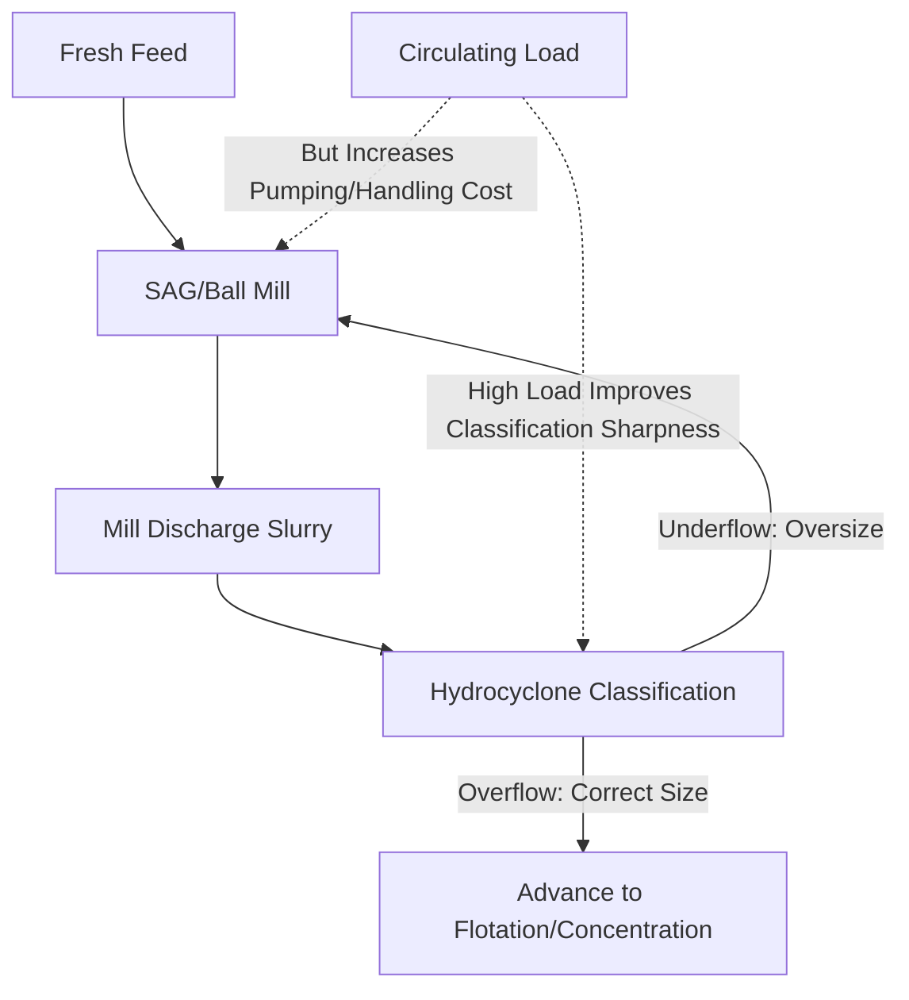
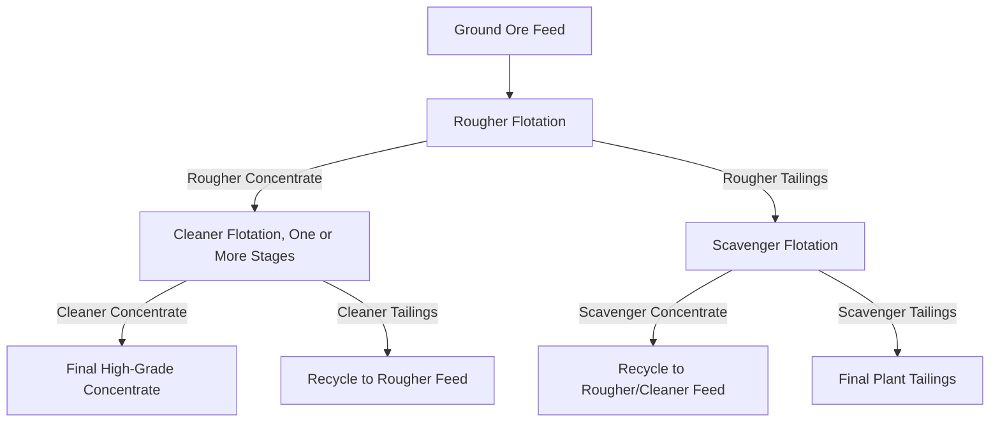

## Comminution, Flotation, and Concentration

### Overview

Comminution, flotation, and concentration form the core unit-operation sequence by which run-of-mine ore is converted into a saleable or smelter-ready concentrate. While the previous discussion of ore beneficiation established the overall flowsheet context, this treatment focuses in depth on the engineering fundamentals, quantitative models, and operational parameters governing each of these three specific stages, with particular emphasis on comminution energy modeling and flotation kinetics — the two areas where quantitative process design tools are most developed and most heavily relied upon in industrial practice.

### Comminution Energy Fundamentals

#### Comminution Laws

Three classical empirical relationships describe the energy required for size reduction, each valid over a different particle size range:

**Rittinger's Law** (surface area theory, most applicable to fine grinding): Energy input is proportional to the new surface area created:

$$E = K_R \left(\frac{1}{d_2} - \frac{1}{d_1}\right)$$

**Kick's Law** (volume theory, most applicable to coarse crushing): Energy input is proportional to the reduction ratio (volume/mass reduced per unit size):

$$E = K_K \ln\left(\frac{d_1}{d_2}\right)$$

**Bond's Law** (the most widely used in industrial practice, bridging the coarse and fine regimes): Energy input is proportional to the square root of surface area created:

$$E = 10 \, W_i \left(\frac{1}{\sqrt{d_2}} - \frac{1}{\sqrt{d_1}}\right)$$

where $E$ is specific energy input (kWh/tonne), $d_1$ and $d_2$ are feed and product 80%-passing sizes (in μm) respectively, and $W_i$ is the Bond Work Index (kWh/tonne), an empirically determined material-specific parameter representing the energy required to reduce material from theoretically infinite size to 80% passing 100 μm.

#### The Bond Work Index in Practice

**Key Points**

- The Bond Work Index is determined via standardized laboratory grindability testing on a representative ore sample and serves as the primary industrial parameter for comminution circuit sizing, energy consumption estimation, and equipment selection, making accurate, representative Work Index determination a critical early-stage input to mineral processing plant design
- Work Index values vary substantially across ore types and even across different zones of a single deposit (reflecting differences in mineral hardness, texture, and competency), meaning a single Work Index value determined from limited sampling can introduce significant design risk if the ore body's Work Index variability is not adequately characterized through representative sampling and testing programs
- Bond's Law, despite its empirical rather than fully mechanistic basis, remains the dominant industrial sizing tool because of its long validated track record and straightforward applicability, even though more mechanistically detailed comminution models (population balance models, discrete element method simulations) have been developed for more detailed circuit optimization work [Unverified: the relative accuracy of Bond's Law versus more advanced models is application- and ore-specific]

### SVG Diagram — Comminution Law Applicability Ranges

<svg xmlns="http://www.w3.org/2000/svg" viewBox="0 0 560 260" font-family="sans-serif">
<text x="280" y="20" text-anchor="middle" font-size="14" font-weight="bold">Comminution Laws by Particle Size Regime (svg_diagram)</text>
<line x1="60" y1="220" x2="520" y2="220" stroke="#333" stroke-width="1.5" />
<text x="290" y="245" text-anchor="middle" font-size="11">Particle Size Decreasing Right (log scale)</text>
<rect x="60" y="150" width="140" height="50" fill="#3498db" fill-opacity="0.3" stroke="#3498db" />
<text x="130" y="180" text-anchor="middle" font-size="11">Kick's Law</text>
<text x="130" y="140" text-anchor="middle" font-size="9">Coarse Crushing (m to cm)</text>
<rect x="200" y="120" width="180" height="80" fill="#2ecc71" fill-opacity="0.3" stroke="#2ecc71" />
<text x="290" y="165" text-anchor="middle" font-size="11">Bond's Law</text>
<text x="290" y="110" text-anchor="middle" font-size="9">Crushing to Fine Grinding (cm to ~100um)</text>
<rect x="380" y="90" width="140" height="110" fill="#e67e22" fill-opacity="0.3" stroke="#e67e22" />
<text x="450" y="150" text-anchor="middle" font-size="11">Rittinger's Law</text>
<text x="450" y="80" text-anchor="middle" font-size="9">Fine/Ultrafine Grinding (below ~100um)</text>
</svg>

### Grinding Circuit Configurations

#### Open vs. Closed Circuit Grinding

- **Open circuit**: Material passes through the mill once with no recirculation of oversize; simpler but generally produces a wider, less controlled product size distribution
- **Closed circuit**: Mill discharge is classified (typically via hydrocyclone), with oversize returned to the mill for further grinding and correctly-sized material advancing to the next process stage; the circulating load (ratio of recirculated material to new feed) is a key operating parameter, with higher circulating loads generally improving classification efficiency and reducing overgrinding at the cost of increased material handling and pumping requirements

#### SAG and AG Milling

Semi-autogenous (SAG) mills use a combination of large ore fragments (typically supplemented with a modest steel ball charge, commonly 6–15% by volume) as grinding media, while fully autogenous (AG) mills rely entirely on the ore itself. These circuits reduce or eliminate steel grinding media consumption and associated cost compared to conventional ball milling, but their performance is more sensitive to ore competency variability (harder or more competent ore zones can significantly reduce SAG mill throughput), making ore variability characterization particularly important for SAG-circuit-based flowsheet design.

### Mermaid Diagram — Closed-Circuit Grinding with Classification

### Froth Flotation: Kinetics and Circuit Design

#### First-Order Flotation Kinetics Model

Flotation recovery is commonly modeled using first-order kinetics, analogous to a chemical reaction rate, where the rate of valuable mineral recovery into the froth is proportional to the remaining floatable mineral concentration in the pulp:

$$R(t) = R_\infty \left(1 - e^{-kt}\right)$$

where $R(t)$ is recovery at time $t$, $R_\infty$ is the maximum achievable (ultimate) recovery, and $k$ is the flotation rate constant, which depends on particle size, degree of liberation, reagent conditioning, and cell hydrodynamics. This model provides a practical basis for flotation circuit residence time design and for diagnosing whether poor plant recovery stems from insufficient residence time (recoverable but not yet floated, i.e., a kinetics problem) versus fundamentally unrecoverable material (liberation or reagent chemistry problem, i.e., an $R_\infty$ problem).

#### Rougher-Cleaner-Scavenger Circuit Configuration

Industrial flotation circuits are rarely single-stage, instead employing a multi-stage configuration to simultaneously achieve high recovery and high concentrate grade — objectives that are typically in tension within any single flotation stage:

- **Rougher flotation**: The first stage, aiming for high recovery from the full ore feed at a relatively unselective, lower grade
- **Cleaner flotation**: Rougher concentrate is reprocessed (often through multiple cleaner stages) to upgrade grade by rejecting entrained gangue, since froth product inevitably carries some non-selectively entrained fine gangue particles alongside truly hydrophobic valuable mineral
- **Scavenger flotation**: Rougher tailings (which still contain some recoverable valuable mineral due to imperfect rougher recovery) are treated to recover additional value, with scavenger concentrate typically recycled back to the rougher or cleaner circuit rather than sold directly given its typically lower grade

This configuration allows the overall circuit to achieve both a high-grade final concentrate (via cleaning) and high overall recovery (via scavenging), which a single-stage flotation cell could not achieve simultaneously due to the inherent grade-recovery trade-off within any individual separation stage.

### SVG Diagram — Grade-Recovery Trade-off Curve

<svg xmlns="http://www.w3.org/2000/svg" viewBox="0 0 480 300" font-family="sans-serif">
<text x="240" y="20" text-anchor="middle" font-size="14" font-weight="bold">Flotation Grade-Recovery Trade-off (svg_diagram)</text>
<line x1="60" y1="260" x2="420" y2="260" stroke="#333" stroke-width="1.5" />
<line x1="60" y1="260" x2="60" y2="50" stroke="#333" stroke-width="1.5" />
<text x="240" y="285" text-anchor="middle" font-size="11">Recovery (%)</text>
<text x="20" y="155" text-anchor="middle" font-size="11" transform="rotate(-90,20,155)">Concentrate Grade</text>
<path d="M80,80 Q200,100 300,180 Q360,220 400,250" fill="none" stroke="#c0392b" stroke-width="2.5" />
<circle cx="140" cy="95" r="5" fill="#2980b9" />
<text x="150" y="90" font-size="9">High-Grade Cleaner Product</text>
<circle cx="350" cy="230" r="5" fill="#27ae60" />
<text x="270" y="245" font-size="9">Scavenger Product</text>

<text x="240" y="65" font-size="10" text-anchor="middle">Achieving both high grade and high recovery</text>

<text x="240" y="78" font-size="10" text-anchor="middle">requires multi-stage circuit configuration</text>

</svg>

### Mermaid Diagram — Rougher-Cleaner-Scavenger Circuit

### Flotation Cell Types and Circuit Hydrodynamics

- **Mechanical cells**: Use an impeller to generate both agitation (particle suspension) and air dispersion, the traditional and still widely used flotation cell design, offering flexible operation across a range of ore types
- **Column flotation cells**: Taller, quiescent cells using sparger-generated fine bubbles and often incorporating wash water addition at the froth zone to reduce gangue entrainment, generally producing higher-grade concentrate than mechanical cells for a given recovery, particularly effective for fine particle flotation and as a cleaning stage
- **Cell sizing and residence time**: Bank (series) configuration of multiple cells provides the total residence time required to approach $R_\infty$ per the flotation kinetics model above, with cell volume and number determined from bench/pilot flotation testing rate constants scaled to plant throughput requirements

### Concentration: Consolidating Separation Outputs

Beyond froth flotation specifically, "concentration" as a general mineral processing term encompasses all methods (gravity, magnetic, flotation, electrostatic, as detailed under ore beneficiation) that upgrade valuable mineral content relative to gangue. The choice and sequencing of concentration methods within a flowsheet is determined by the physical/chemical property contrasts available for a given ore system, often employing more than one method in combination (e.g., gravity pre-concentration of coarse liberated gold ahead of flotation or cyanidation of the finer fraction) to optimize overall plant recovery and economics across the full particle size range present in the ore.

### Common Pitfalls and Practical Considerations

- Applying a single Bond Work Index value across an entire ore deposit without adequate sampling to characterize spatial variability, risking under- or over-sizing of comminution circuit equipment relative to actual ore hardness encountered during operation
- Confusing flotation recovery problems caused by insufficient residence time (a kinetics/circuit-sizing issue, addressable by adding cells or residence time) with those caused by poor liberation or unfavorable reagent chemistry (an $R_\infty$ ceiling issue, not addressable by simply adding more flotation time)
- Operating a single-stage flotation circuit and expecting both high recovery and high concentrate grade simultaneously, without recognizing the fundamental grade-recovery trade-off that necessitates rougher-cleaner-scavenger circuit configuration for commercially viable concentrate quality
- Underestimating the sensitivity of SAG mill throughput to ore competency variability, particularly when circuit design is based on limited or non-representative ore competency test work
- Neglecting gangue entrainment (mechanical carry-up of fine gangue particles with the froth, independent of true flotation) as a concentrate grade-limiting mechanism distinct from insufficient selectivity of the flotation chemistry itself, which is specifically addressed through cleaner-stage wash water and appropriate froth depth/residence time control rather than reagent adjustment alone

**Related Topics**

- Bond Work Index Testing and Comminution Circuit Sizing
- Flotation Reagent Chemistry: Collectors, Depressants, and Activators
- SAG Mill Circuit Design and Ore Competency Variability
- Column Flotation and Gangue Entrainment Control
- Ore Beneficiation and Mineral Processing (broader flowsheet context)
- Hydrometallurgical Processing of Flotation Concentrates