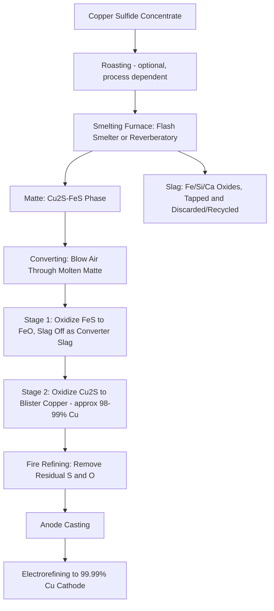

## Pyrometallurgy Fundamentals

### Overview

Pyrometallurgy encompasses the family of extractive metallurgical processes that use heat to effect chemical and physical transformations converting mineral concentrates or ores into refined metals. Operating typically at temperatures from several hundred to over 1600°C, pyrometallurgical processes exploit thermodynamic driving forces (free energy of oxide/sulfide reduction, differential density and immiscibility of molten phases) to separate valuable metal from gangue and impurity elements. Pyrometallurgy remains the dominant extraction route for iron/steel, copper (from sulfide ores), nickel, lead, zinc (partially), and many ferroalloys, complementing hydrometallurgical and electrometallurgical routes discussed separately.

### Thermodynamic Foundations

#### The Ellingham Diagram

The Ellingham diagram plots standard Gibbs free energy of formation ($\Delta G^\circ$) for metal oxide (or sulfide) formation reactions as a function of temperature, providing the foundational thermodynamic tool for predicting which reducing agent can reduce which metal oxide at a given temperature:

$$\Delta G^\circ = \Delta H^\circ - T\Delta S^\circ$$

Because oxide formation reactions consume gaseous oxygen (decreasing entropy), most metal oxide formation lines on the Ellingham diagram slope upward (less negative $\Delta G^\circ$, i.e., oxide becomes less thermodynamically stable) with increasing temperature. A reducing agent's oxide formation line lying below (more negative $\Delta G^\circ$) that of the target metal oxide at the process temperature indicates the reducing agent can thermodynamically reduce that metal oxide, since the overall coupled reaction (reductant oxidized, target metal oxide reduced) has a net negative $\Delta G^\circ$.

**Key Points**

- Carbon's oxide formation line (to CO) has an unusual downward slope (increasing entropy from solid carbon plus gaseous O$_2$ producing more moles of gas as CO) rather than the typical upward slope of most metal oxide lines, meaning carbon becomes a progressively more effective reducing agent at higher temperature and will eventually thermodynamically outcompete essentially any metal oxide at sufficiently high temperature — the fundamental thermodynamic basis for carbothermic reduction (blast furnace ironmaking, among others)
- The temperature at which the carbon-to-CO line crosses below a given metal oxide's line represents the minimum thermodynamic temperature at which carbothermic reduction of that oxide becomes favorable, providing a first-order design parameter for reduction process temperature selection
- Highly stable oxides (Al$_2$O$_3$, MgO, CaO, positioned very low/very negative $\Delta G^\circ$ on the diagram) cannot be practically reduced by carbon even at very high temperature within practical process constraints, which is precisely why aluminum, magnesium, and similarly stable-oxide metals require electrolytic rather than carbothermic reduction routes

### SVG Diagram — Ellingham Diagram Schematic

<svg xmlns="http://www.w3.org/2000/svg" viewBox="0 0 580 320" font-family="sans-serif">
<text x="290" y="20" text-anchor="middle" font-size="14" font-weight="bold">Ellingham Diagram Schematic (svg_diagram)</text>
<line x1="70" y1="60" x2="70" y2="280" stroke="#333" stroke-width="1.5" />
<line x1="70" y1="280" x2="530" y2="280" stroke="#333" stroke-width="1.5" />
<text x="300" y="305" text-anchor="middle" font-size="11">Temperature increasing right</text>
<text x="30" y="170" text-anchor="middle" font-size="11" transform="rotate(-90,30,170)">Delta G (more negative = more stable oxide)</text>
<text x="30" y="70" font-size="9">0</text>

<path d="M90,180 L510,90" stroke="#c0392b" stroke-width="2.5" />
<text x="400" y="80" font-size="10" fill="#c0392b">2C + O2 = 2CO (downward slope)</text>

<path d="M90,220 L510,150" stroke="#2980b9" stroke-width="2" />
<text x="380" y="145" font-size="10" fill="#2980b9">Fe oxide (upward slope)</text>
<path d="M90,250 L510,190" stroke="#27ae60" stroke-width="2" />
<text x="380" y="185" font-size="10" fill="#27ae60">Zn oxide</text>
<path d="M90,270 L510,255" stroke="#8e44ad" stroke-width="2" />
<text x="380" y="248" font-size="10" fill="#8e44ad">Al2O3 (very stable, near bottom)</text>
<circle cx="290" cy="130" r="4" fill="#333" />
<text x="300" y="120" font-size="9">Crossover: C reduces Fe oxide above this T</text>
</svg>

### Roasting

Roasting is a pyrometallurgical pretreatment step, typically performed at 500–1000°C in an oxidizing (or, less commonly, controlled/reducing) atmosphere, applied primarily to sulfide concentrates to convert sulfides to oxides prior to subsequent smelting or leaching, or to achieve partial sulfur removal ahead of smelting.

- **Dead roasting**: Complete conversion of sulfide to oxide, used for ores destined for subsequent reduction or leaching processes that require an oxide feed (e.g., some zinc and nickel processing routes)
- **Partial (sulfating) roasting**: Controlled partial oxidation, sometimes producing a metal sulfate intended for subsequent aqueous leaching (a hydrometallurgical follow-on step) rather than complete oxide conversion
- **Sulfur dioxide capture**: Roasting off-gas contains high concentrations of SO$_2$, which is typically captured and converted to sulfuric acid (via contact process catalytic oxidation and absorption) both as an environmental control measure and as a valuable byproduct, since uncontrolled SO$_2$ emission from roasting/smelting operations is a major historical and ongoing environmental regulatory concern for the nonferrous smelting industry

### Smelting

#### General Principle

Smelting involves heating ore, concentrate, or roasted calcine with appropriate fluxes to a temperature sufficient to produce two or more immiscible molten phases — typically a metal or matte (metal sulfide) phase and a slag phase — which separate by density difference, allowing the valuable metal-bearing phase to be tapped separately from the gangue-bearing slag.

#### Slag Chemistry and Flux Selection

Slag composition is engineered (through flux additions, typically silica, lime, or iron oxide depending on the specific smelting system) to achieve:

- **Appropriate melting point and viscosity**: A slag that is too viscous impedes settling/separation of metal or matte droplets and increases mechanical entrainment losses of valuable metal into the slag; a slag melting point too high increases energy consumption and refractory wear
- **Adequate gangue mineral dissolution capacity**: The slag must be capable of dissolving the specific gangue oxide components (SiO$_2$, Al$_2$O$_3$, CaO, MgO, FeO in various combinations depending on ore mineralogy) present in the feed
- **Minimized valuable metal solubility/entrainment in slag**: Slag chemistry and smelting conditions (temperature, degree of matte/slag equilibration, settling time) are optimized to minimize metal losses to slag, since slag typically represents the largest mass output stream and even small percentage metal losses to slag can represent significant absolute value loss

#### Matte Smelting (Copper, Nickel)

For copper and nickel sulfide ore systems, smelting produces a molten sulfide phase called **matte** (predominantly Cu$_2$S-FeS or Ni$_3$S$_2$-FeS mixtures) rather than metal directly, since direct metal production from sulfide concentrate in a single smelting step is not thermodynamically/practically favorable for these systems. Matte grade (the copper or nickel content of the matte) can be controlled by smelting conditions and flux practice, with higher matte grades reducing the mass of material requiring subsequent converting but increasing smelting furnace complexity/losses.

### Mermaid Diagram — Copper Matte Smelting and Converting Sequence

### Converting

Converting is the pyrometallurgical stage following matte smelting that removes iron and sulfur from matte to produce crude ("blister") metal, historically performed in Peirce-Smith converters (horizontal cylindrical vessels with air/oxygen-enriched air blown through submerged tuyeres) and increasingly in continuous converting technology at modern smelters. The converting reaction proceeds in two sequential stages for copper: first, iron sulfide is preferentially oxidized to iron oxide (which combines with added silica flux to form converter slag, tapped and typically recycled to the smelting furnace), and second, once iron is substantially removed, copper sulfide oxidizes to blister copper (approximately 98–99% Cu) with residual sulfur evolved as SO$_2$.

### Reduction Smelting (Ironmaking as the Archetypal Example)

#### Blast Furnace Process

The blast furnace represents the archetypal carbothermic reduction smelting process: iron ore (as sinter, pellets, or lump ore), coke (serving simultaneously as reducing agent, fuel, and physical support for the burden), and flux (limestone) are charged from the top, while hot air (blast) is injected near the base, creating a countercurrent flow of descending solid burden against ascending hot reducing gas.

**Key reactions** (simplified, occurring across distinct furnace temperature zones from top to bottom):

$$3Fe_2O_3 + CO \rightarrow 2Fe_3O_4 + CO_2 \quad \text{(indirect reduction, upper/cooler zone)}$$

$$Fe_3O_4 + CO \rightarrow 3FeO + CO_2$$

$$FeO + CO \rightarrow Fe + CO_2$$

$$C + CO_2 \rightarrow 2CO \quad \text{(Boudouard/solution-loss reaction, regenerates CO)}$$

Molten iron (hot metal, containing dissolved carbon and other elements) and slag (from gangue plus limestone flux) collect at the furnace base and are tapped separately, exploiting their density difference and mutual immiscibility, analogous in principle to the matte/slag separation in copper smelting though via a fundamentally different (carbothermic reduction rather than sulfide oxidation) chemistry.

#### Direct Reduction Alternatives

Direct reduction processes (e.g., using natural gas-derived reducing gas or, increasingly, hydrogen, to produce direct reduced iron, DRI, at temperatures below the iron melting point) represent an alternative to blast furnace ironmaking that avoids coke consumption and, when using hydrogen as reductant, substantially reduces process carbon emissions compared to conventional carbothermic blast furnace reduction — an area of significant current industry development given decarbonization pressures on the steel industry. [Unverified: the pace and scale of hydrogen-based direct reduction industrial adoption is an actively evolving area]

### Refractory and Furnace Considerations

Pyrometallurgical processes' extreme operating temperatures and chemically aggressive molten metal/slag environments require specialized refractory lining materials (magnesia-chrome, magnesia-carbon, alumina-based, and other refractory systems selected for chemical compatibility with the specific slag/metal chemistry, thermal shock resistance, and erosion resistance), with refractory life and replacement cost representing a significant ongoing operating cost and availability/campaign-length consideration in pyrometallurgical plant economics.

### Common Pitfalls and Practical Considerations

- Assuming Ellingham diagram predictions alone determine practical process feasibility without accounting for reaction kinetics, which can render a thermodynamically favorable reduction impractically slow at the temperatures/timescales available in industrial process equipment
- Neglecting slag viscosity and gangue dissolution capacity when specifying flux additions purely for thermodynamic slag basicity targets, since a slag that is thermodynamically appropriate but too viscous will produce poor metal/matte-slag separation and elevated valuable metal losses regardless of its bulk chemistry being nominally correct
- Underestimating SO$_2$ emission control requirements in sulfide roasting/smelting operations, given both the direct environmental impact and the substantial regulatory and reputational consequences of inadequate sulfur capture in modern smelting operations
- Overlooking refractory chemical compatibility with process-specific slag chemistry when selecting lining materials, risking accelerated refractory wear/failure if an refractory system optimized for one slag chemistry is applied to a different smelting circuit without re-evaluation
- Treating pyrometallurgy and hydrometallurgy as mutually exclusive rather than potentially complementary routes; many modern flowsheets combine roasting (pyrometallurgical) with subsequent leaching (hydrometallurgical) of the resulting calcine, and process route selection should be evaluated at the overall flowsheet level rather than assuming a single technology family must handle the entire extraction sequence

**Related Topics**

- Ellingham Diagram Applications and Reduction Thermodynamics
- Copper Matte Smelting and Converting Process Design
- Blast Furnace Ironmaking and Direct Reduction Alternatives
- Slag Chemistry, Viscosity, and Flux Selection
- SO2 Capture and Sulfuric Acid Byproduct Recovery
- Refractory Material Selection for High-Temperature Metallurgical Vessels
- Hydrometallurgical Processing (complementary/alternative extraction route)