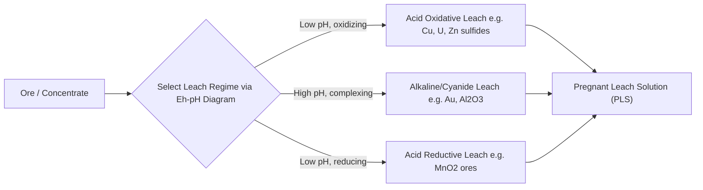
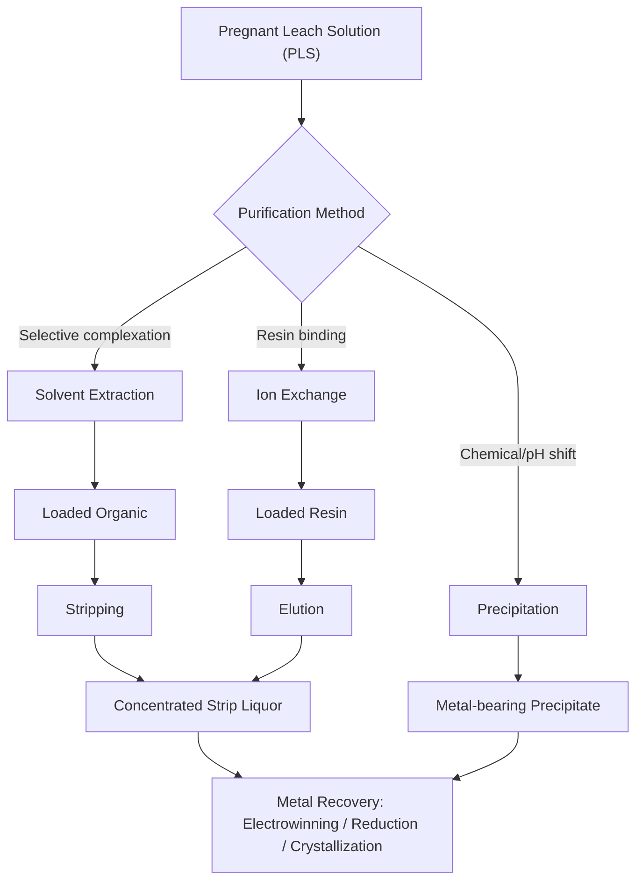

## Hydrometallurgy Fundamentals

### Overview

Hydrometallurgy is the branch of extractive metallurgy that recovers metals from ores, concentrates, and secondary (recycled) materials using aqueous chemistry. Unlike pyrometallurgy, which relies on high-temperature reactions in furnaces, hydrometallurgy operates at or near ambient-to-moderate temperatures (typically 25–250°C) and uses chemical reagents dissolved in water to selectively dissolve and separate metal values. It is the dominant extraction route for gold, copper (increasingly), uranium, nickel laterites, zinc, aluminum (via the Bayer process), and rare earth elements, and is essential to hydrometallurgical recycling of batteries and e-waste.

The three fundamental unit operations that define virtually all hydrometallurgical flowsheets are:

1. **Leaching** — selective dissolution of the target metal from a solid matrix into an aqueous solution (leachate/pregnant leach solution, PLS)
2. **Solution concentration and purification** — separating the dissolved metal from impurities and increasing its concentration (solvent extraction, ion exchange, precipitation)
3. **Metal recovery** — converting the purified metal ion back into a solid product (electrowinning, chemical reduction, crystallization)

### Why Hydrometallurgy? Comparison with Pyrometallurgy

| Factor | Hydrometallurgy | Pyrometallurgy |
| --- | --- | --- |
| Operating temperature | Ambient–250°C (autoclaves higher) | 500–1600°C+ |
| Energy source | Chemical/electrical | Thermal (fuel/electricity) |
| Ore grade suitability | Effective on low-grade ores | Generally needs higher grade |
| Selectivity | High (tunable via chemistry) | Lower (thermodynamically driven) |
| Emissions | Liquid effluents, less SO₂/particulate | SO₂, particulates, GHG-intensive |
| Capital intensity | Often lower for small/medium scale | High (furnaces, smelters) |
| Byproduct handling | Tailings ponds, raffinates | Slag, flue dust |

[Inference] The choice between the two routes is frequently ore-dependent and economic rather than absolute — many operations use hybrid flowsheets (e.g., roast-leach-electrowin for zinc).

### Core Leaching Chemistry

Leaching dissolves a metal (M) from a solid phase into solution via redox and/or complexation reactions. Three chemical mechanisms dominate:

**1. Acid Leaching**

Dissolves metals via proton attack, commonly using sulfuric acid ($H_2SO_4$), hydrochloric acid, or nitric acid.

$$MO_{(s)} + 2H^+_{(aq)} \rightarrow M^{2+}_{(aq)} + H_2O_{(l)}$$

Example — copper oxide leaching:

$$CuO + H_2SO_4 \rightarrow CuSO_4 + H_2O$$

**2. Alkaline Leaching**

Used when the gangue minerals are acid-consuming (e.g., limestone-hosted ores) or when the target metal forms soluble complexes in basic media. The classic example is the **Bayer process** for alumina:

$$Al_2O_3 \cdot 3H_2O + 2NaOH \rightarrow 2NaAlO_2 + 4H_2O$$

**3. Complexation Leaching**

Uses a ligand to form a stable, soluble metal complex. The premier industrial example is **cyanidation** of gold:

$$4Au + 8NaCN + O_2 + 2H_2O \rightarrow 4NaAu(CN)_2 + 4NaOH$$

This is known as the **Elsner equation** and underpins over a century of gold extraction.

**Key Points**

- Leaching is governed by thermodynamics (Eh–pH / Pourbaix diagrams determine which species are stable/soluble) and kinetics (particle size, temperature, reagent concentration, agitation).
- Oxidants (O₂, Fe³⁺, MnO₂, H₂O₂) are often required alongside acid/base/ligand to move the metal into a soluble oxidation state (e.g., Cu⁰ → Cu²⁺, U⁴⁺ → U⁶⁺).
- Passivation (formation of insoluble product layers, e.g., elemental sulfur on sulfide surfaces, jarosite on iron) can stall leaching kinetics and is a major process-design concern.

### Eh–pH (Pourbaix) Diagrams in Leaching Design

Eh–pH diagrams map the thermodynamically stable form of a metal (native metal, oxide, hydroxide, or soluble ion) as a function of solution potential (Eh) and acidity (pH). Process engineers use these diagrams to select the leaching regime that maximizes the soluble-ion stability field for the target metal while minimizing dissolution of gangue metals.

### Leaching Methods (Industrial Configurations)

| Method | Description | Typical Application | Leach Time |
| --- | --- | --- | --- |
| Agitation (tank) leaching | Fine ore slurried in stirred/aerated tanks | High-grade ore, concentrates | Hours |
| Heap leaching | Coarse-crushed ore stacked on lined pads, irrigated with lixiviant | Low-grade Au, Cu ores | Weeks–months |
| Vat leaching | Ore in large static vats, leachant percolated through | Medium-grade ore | Days |
| In-situ leaching (ISL) | Lixiviant injected directly into the ore body underground | Uranium (roll-front deposits) | Months–years |
| Pressure leaching (autoclave) | Elevated T/P (often with O₂ overpressure) to accelerate kinetics | Refractory sulfides, laterites | Hours |
| Bacterial (bio-) leaching | Acidophilic bacteria (e.g., *Acidithiobacillus ferrooxidans*) oxidize sulfides | Low-grade Cu, Au-bearing pyrite | Weeks–months |

**Example — Heap Leach Cross-Section (svg_diagram)**

<svg xmlns="http://www.w3.org/2000/svg" viewBox="0 0 640 340" font-family="sans-serif">
<text x="320" y="24" text-anchor="middle" font-size="16" font-weight="bold">Heap Leach Pad Cross-Section (svg_diagram)</text>

<line x1="80" y1="55" x2="560" y2="55" stroke="#2b6cb0" stroke-width="3" />
<text x="320" y="45" text-anchor="middle" font-size="12" fill="#2b6cb0">Lixiviant Drip/Sprinkler System</text>

<polygon points="80,60 560,60 480,220 160,220" fill="#c08b52" stroke="#7a5230" stroke-width="2" />
<text x="320" y="140" text-anchor="middle" font-size="14" fill="#3a2a15">Crushed / Run-of-Mine Ore Heap</text>
<text x="320" y="160" text-anchor="middle" font-size="11" fill="#3a2a15">(Solution percolates downward)</text>

<rect x="100" y="220" width="440" height="14" fill="#4a4a4a" />
<text x="320" y="250" text-anchor="middle" font-size="12">Impermeable HDPE Liner</text>

<rect x="270" y="234" width="100" height="14" fill="#1a1a1a" rx="6" />
<text x="320" y="270" text-anchor="middle" font-size="12">Collection Pipe → PLS Pond</text>

<ellipse cx="560" cy="300" rx="60" ry="24" fill="#7cc4e8" stroke="#2b6cb0" stroke-width="2" />
<text x="560" y="304" text-anchor="middle" font-size="11">PLS Pond</text>
<path d="M370 248 Q 470 260 500 290" stroke="#2b6cb0" stroke-width="2" fill="none" marker-end="url(#arrow)" />
<line x1="200" y1="90" x2="200" y2="200" stroke="#ffffff" stroke-width="1.5" stroke-dasharray="4,3" />
<line x1="320" y1="90" x2="320" y2="200" stroke="#ffffff" stroke-width="1.5" stroke-dasharray="4,3" />
<line x1="440" y1="90" x2="440" y2="200" stroke="#ffffff" stroke-width="1.5" stroke-dasharray="4,3" />
</svg>

### Solution Purification and Concentration

Once metal is dissolved into the PLS, it must typically be concentrated and separated from impurity ions before recovery.

**1. Solvent Extraction (SX)**

An organic extractant (dissolved in a diluent, forming the "organic phase") selectively complexes with the target metal ion at the aqueous-organic interface, transferring it out of the aqueous phase. A subsequent **stripping** step (usually with strong acid) reverses this, concentrating the metal into a small-volume, high-purity strip liquor.

M^{2+}_{(aq)} + 2HR_{(org)} \rightleftharpoons MR_2_{(org)} + 2H^+_{(aq)}

Common extractants: LIX reagents (oximes) for copper, D2EHPA for zinc/rare earths, Alamine/Aliquat (amines) for uranium and cobalt/nickel separation.

SX-EW (Solvent Extraction–Electrowinning) is the workhorse flowsheet for oxide copper ores worldwide.

**2. Ion Exchange (IX)**

Resin beads with fixed functional groups (cationic or anionic) selectively bind metal ions from dilute solution, later eluted with a strong acid/base regenerant. Widely used for uranium recovery, gold recovery from cyanide solutions (resin-in-pulp/resin-in-leach), and precious/rare earth metal polishing steps.

**3. Precipitation**

Selective pH adjustment, sulfide precipitation, or chemical reagent addition precipitates the target metal (or impurities) as an insoluble compound.

- Iron removal: precipitation as goethite, jarosite, or hematite
- Mixed hydroxide precipitate (MHP): nickel/cobalt laterite processing
- Cementation: displacement of a less active metal by a more active one, e.g., $Cu^{2+} + Fe^0 \rightarrow Cu^0 + Fe^{2+}$ (classic gold/copper cementation with scrap iron, "Merrill-Crowe" for gold uses zinc dust instead)

### Metal Recovery Methods

**1. Electrowinning (EW)**

Electrolysis of the purified, concentrated solution deposits pure metal at the cathode.

Cathode (reduction): $Cu^{2+} + 2e^- \rightarrow Cu^0$

Anode (oxidation, inert lead-alloy anode): $H_2O \rightarrow \frac{1}{2}O_2 + 2H^+ + 2e^-$

[Inference] Energy consumption for copper EW is commonly cited around 2,000–2,200 kWh per tonne of cathode copper, though this figure varies with current density, cell design, and electrolyte chemistry.

**2. Chemical Reduction / Precipitation**

- Gold: reduction with zinc dust (Merrill-Crowe) or adsorption onto activated carbon (CIP/CIL — Carbon-in-Pulp/Carbon-in-Leach) followed by elution and electrowinning
- Nickel/cobalt: hydrogen reduction under pressure (Sherritt-Gordon process)

**3. Crystallization**

Evaporative or cooling crystallization recovers metal salts directly (e.g., $CuSO_4 \cdot 5H_2O$, uranium as "yellowcake" $U_3O_8$/ADU).

### Worked Example: Copper Oxide Ore via SX-EW

1. **Leaching**: Crushed oxide ore heap-leached with dilute $H_2SO_4$ (5–15 g/L) → PLS containing 1–5 g/L Cu²⁺
2. **Solvent Extraction**: PLS contacted with organic phase (LIX-type oxime extractant) in mixer-settlers; Cu²⁺ transfers to organic, raffinate (barren, acidic) returns to the heap
3. **Stripping**: Loaded organic contacted with spent electrolyte (high $H_2SO_4$) → strips Cu²⁺ into a small-volume, high-purity advance electrolyte (~40–50 g/L Cu)
4. **Electrowinning**: Advance electrolyte electrolyzed in EW cells → 99.99% pure copper cathodes deposited over 6–7 days

**Output**: LME Grade A copper cathode, directly saleable without smelting/refining.

### Environmental and Engineering Considerations

- **Acid mine drainage (AMD)**: Uncontrolled oxidation of sulfide minerals (particularly pyrite) generates sulfuric acid and mobilizes heavy metals; a major long-term liability for hydrometallurgical and mining sites generally.
- **Cyanide management**: Requires destruction (INCO SO₂/air process, Caro's acid, or natural degradation) before tailings disposal; governed by the International Cyanide Management Code in many jurisdictions.
- **Water balance**: Hydrometallurgical plants are water-intensive; closed-loop/raffinate recycling is standard practice to reduce fresh-water demand and effluent discharge.
- **Reagent selectivity and cost**: Reagent consumption (acid, cyanide, extractant) is often the dominant operating cost and is highly sensitive to gangue mineralogy (e.g., acid-consuming carbonates).
- [Inference] Behavior of specific reagent systems (extractant loading capacity, resin selectivity coefficients) can vary meaningfully with feed chemistry, temperature, and impurity loading, so pilot-scale testwork is standard practice before flowsheet finalization.

### Related Topics

- Pyrometallurgy Fundamentals (smelting, roasting, converting)
- Mineral Processing: Comminution and Flotation (pre-leach beneficiation)
- Gold Cyanidation and CIP/CIL Circuits
- Copper SX-EW Process Design
- Bayer Process for Alumina Refining
- Bioleaching and Biomining Microbiology
- Rare Earth Element Separation Chemistry
- Battery Recycling Hydrometallurgy (Li-ion black mass processing)
- Eh–pH (Pourbaix) Diagram Construction and Interpretation
- Effluent Treatment and Acid Mine Drainage Remediation