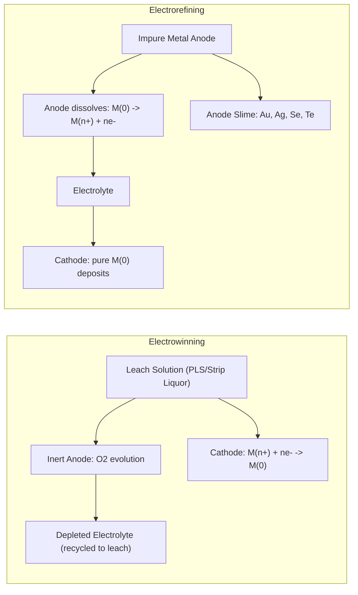
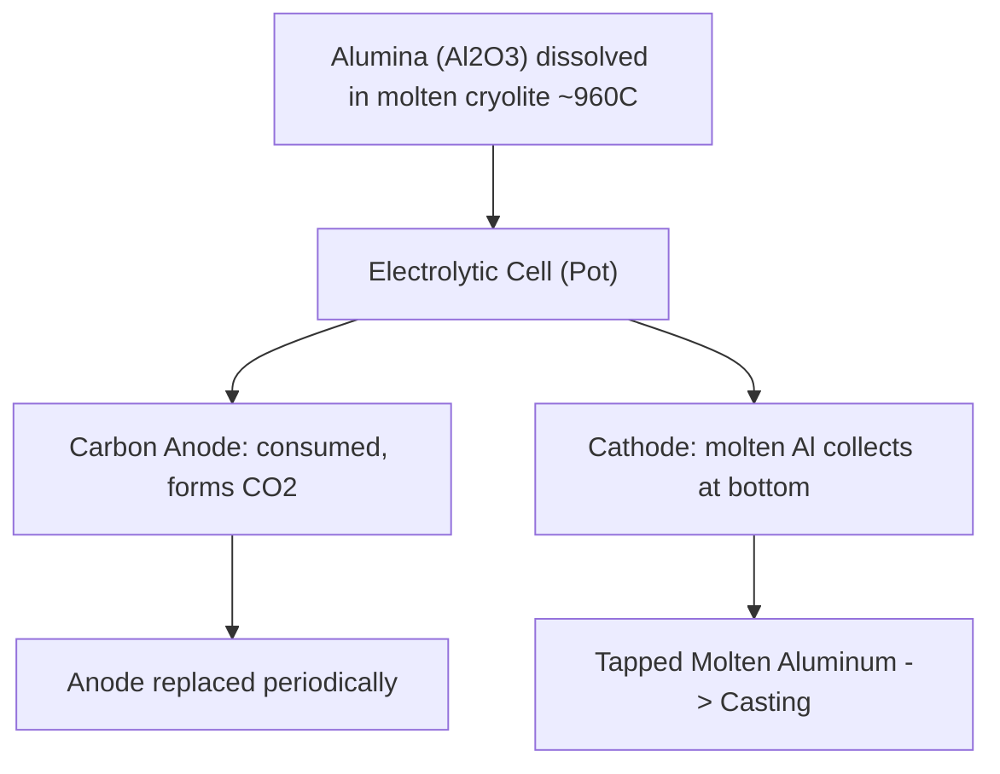

## Electrometallurgy and Electrowinning

### Overview

Electrometallurgy is the branch of extractive metallurgy that uses electrical energy to drive the reduction (or oxidation) of metal ions, enabling extraction, purification, and shaping of metals. It spans three principal industrial applications:

1. **Electrowinning (EW)** — recovering a metal from a leach solution (or fused salt) by depositing it at the cathode, where the metal did not previously exist in metallic form in that circuit
2. **Electrorefining (ER)** — purifying an already-metallic but impure anode (e.g., blister copper, impure nickel) by dissolving it anodically and redepositing pure metal at the cathode
3. **Fused-salt (molten-salt) electrolysis** — used when the metal is too electropositive to be reduced from aqueous solution (Al, Na, Mg, Li, rare earths), requiring electrolysis of a molten salt/oxide mixture instead of water

All three are governed by the same underlying electrochemical principles: Faraday's laws, electrode kinetics, and cell voltage/energy balances.

### Fundamental Electrochemistry

**Faraday's Laws of Electrolysis**

The mass of metal deposited is directly proportional to the charge passed:

$$m = \frac{M \cdot I \cdot t}{n \cdot F}$$

Where:

- $m$ = mass deposited (g)
- $M$ = molar mass of the metal (g/mol)
- $I$ = current (A)
- $t$ = time (s)
- $n$ = number of electrons transferred per ion (valence)
- $F$ = Faraday's constant, $96{,}485 \, C/mol$

**Current Efficiency**

Not all current is used productively; side reactions (hydrogen evolution, short-circuiting, back-reaction) reduce efficiency:

$$\eta_{current} = \frac{m_{actual}}{m_{theoretical}} \times 100\%$$

[Inference] Well-run copper electrowinning circuits typically report current efficiencies in the 90–95% range, though this depends strongly on electrolyte purity, current density, and cell maintenance.

**Cell Voltage and Energy Consumption**

Total cell voltage is the sum of the theoretical decomposition potential plus overpotentials and resistive (ohmic) losses:

$$E_{cell} = E_{decomp} + \eta_{anode} + \eta_{cathode} + IR$$

Specific energy consumption (kWh per tonne of metal) is:

$$W = \frac{E_{cell} \times n \times F}{M \times \eta_{current} \times 3.6 \times 10^6}$$

### Electrowinning vs. Electrorefining

| Feature | Electrowinning | Electrorefining |
| --- | --- | --- |
| Anode material | Inert (Pb-alloy, Ti, or dimensionally stable anode) | Impure metal (e.g., blister Cu, impure Ni) |
| Anode reaction | Water oxidation (O₂ evolution) | Metal dissolution ($M^0 \rightarrow M^{n+} + ne^-$) |
| Feed | Leach solution (from hydrometallurgy) | Impure metal from smelting |
| Cell voltage | Higher (must decompose water) | Lower (anode and cathode reactions are reverse of each other) |
| Byproduct | O₂ gas at anode | Anode slime (Au, Ag, Se, Te concentrate) |
| Purpose | Primary metal recovery | Purification to 99.99%+ |

### Electrowinning Process Design

**Cell Configuration**

Electrowinning cells (tank house) consist of alternating anode and cathode plates immersed in electrolyte, connected in a multiple (parallel) circuit arrangement across the tank house, with tank houses often connected in series (cascade) for overall plant voltage economy.

- **Anodes**: Inert, non-consumable — lead-calcium-tin alloy (traditional, copper EW) or dimensionally stable anodes (DSA, mixed metal oxide-coated titanium, increasingly used to reduce lead contamination and energy loss)
- **Cathodes**: Either permanent stainless-steel "starter sheets" (modern practice, metal stripped mechanically after growth) or thin copper starter sheets (older practice)
- **Electrolyte circulation**: Continuous flow maintains uniform concentration, temperature, and additive distribution across cells

**Key Operating Parameters**

| Parameter | Typical Range (Cu EW) | Effect |
| --- | --- | --- |
| Current density | 200–400 A/m² | Higher = faster deposition, but rougher/lower-quality deposit, higher energy use |
| Electrolyte temperature | 40–50°C | Higher = lower resistivity, improved mass transfer |
| Cu²⁺ concentration | 35–45 g/L | Must stay above critical level to avoid H₂ co-evolution |
| Acid ($H_2SO_4$) concentration | 150–180 g/L | Supports conductivity; balances with strip circuit |
| Additives | Guar gum, cobalt sulfate, chloride ions | Control deposit smoothness, suppress anode corrosion (Pb anodes) |

**Key Points**

- If Cu²⁺ concentration drops too low relative to current density, hydrogen evolution competes at the cathode, producing "burnt," nodular, or spongy deposits and lowering current efficiency.
- Additives such as guar gum act as leveling/smoothing agents by adsorbing preferentially on high-current-density peaks, promoting uniform crystal growth.
- Short-circuits (cathode-anode contact via warped plates or nodules) are a major practical source of current efficiency loss and require regular tank house maintenance.

### Electrorefining: Copper Example

Impure "blister" or fire-refined copper (~98–99.5% Cu) from the smelter is cast into anodes and electrorefined:

Anode: $Cu^0_{(anode)} \rightarrow Cu^{2+}_{(aq)} + 2e^-$

Cathode: $Cu^{2+}_{(aq)} + 2e^- \rightarrow Cu^0_{(cathode)}$

Because the anode and cathode reactions are electrochemically reversed forms of each other, the theoretical decomposition voltage is near zero; the applied voltage (~0.2–0.3 V) mainly overcomes electrolyte resistance and overpotentials — making electrorefining far less energy-intensive per tonne than electrowinning.

**Anode Slime Formation**

Noble impurities (Au, Ag, Se, Te, Pt-group metals) are less electrochemically active than copper and do not dissolve at the anode; they fall to the cell bottom as anode slime, which is subsequently processed as a high-value byproduct stream — often contributing disproportionately to refinery revenue despite being a small mass fraction.

### Fused-Salt (Molten-Salt) Electrolysis

Metals with very negative standard reduction potentials (Al, Mg, Na, Li) cannot be electrowon from aqueous solution because water is preferentially reduced/oxidized first (hydrogen/oxygen evolution dominates). These metals require electrolysis of molten salts or oxide-salt mixtures.

**Hall-Héroult Process (Aluminum)**

Alumina ($Al_2O_3$) is dissolved in molten cryolite ($Na_3AlF_6$) at ~950–980°C, and electrolyzed using carbon anodes and a carbon-lined steel cathode:

Cathode: $Al^{3+} + 3e^- \rightarrow Al^0_{(l)}$

Anode: $2O^{2-} + C_{(s)} \rightarrow CO_2 + 4e^-$ (anode is consumed, requiring periodic replacement)

Overall: $2Al_2O_3 + 3C \rightarrow 4Al + 3CO_2$

[Inference] Modern Hall-Héroult cells commonly operate around 13,000–15,000 kWh per tonne of aluminum produced, though this varies by cell technology (amperage, anode-cathode distance) and is a frequently cited figure that improves incrementally with technology generations.

**Other Fused-Salt Systems**

- **Sodium**: Downs process, molten NaCl-CaCl₂ electrolysis
- **Magnesium**: molten MgCl₂ electrolysis (or thermal Pidgeon process as a non-electrolytic alternative)
- **Lithium**: molten LiCl-KCl eutectic electrolysis

### Worked Example: Faraday's Law Calculation

**Problem**: Calculate the mass of copper deposited in an electrowinning cell operating at 300 A for 24 hours, assuming 92% current efficiency.

**Given**: $M_{Cu} = 63.55 \, g/mol$, $n = 2$, $F = 96{,}485 \, C/mol$

$$m_{theoretical} = \frac{63.55 \times 300 \times (24 \times 3600)}{2 \times 96{,}485}$$

$$m_{theoretical} = \frac{63.55 \times 300 \times 86{,}400}{192{,}970} = \frac{1{,}647{,}187{,}200}{192{,}970} \approx 8{,}537 \, g$$

Applying current efficiency:

$$m_{actual} = 8{,}537 \times 0.92 \approx 7{,}854 \, g \approx 7.85 \, kg \, Cu$$

**Output**: Approximately 7.85 kg of cathode copper deposited per cell over 24 hours at these conditions.

### Environmental and Engineering Considerations

- **Energy intensity**: Fused-salt electrolysis (especially aluminum) is among the most electricity-intensive industrial processes globally; smelter siting is heavily influenced by access to low-cost electricity (hydro, in many cases).
- **Greenhouse gas emissions**: Carbon anode consumption in the Hall-Héroult process generates CO₂ directly at the anode; "inert anode" technology (avoiding carbon anodes) is an active area of industrial R&D. [Speculation] Widespread commercial adoption of inert anode aluminum smelting remains limited as of general industry knowledge, though pilot and early-commercial projects have been announced by several producers.
- **Lead exposure**: Traditional Pb-alloy anodes in copper EW pose occupational lead-exposure risks, motivating the shift toward DSA (dimensionally stable anode) technology in modern tank houses.
- **Perfluorocarbon (PFC) emissions**: "Anode effect" upsets in aluminum cells (alumina depletion causing abnormal voltage spikes) can generate potent greenhouse gases (CF₄, C₂F₆); modern process control targets minimizing anode-effect frequency.
- Behavior of specific tank house additive packages, current efficiency, and deposit morphology can vary meaningfully with electrolyte impurity levels and plant-specific practice, so the operating figures above should be treated as representative rather than universal.

### Related Topics

- Hydrometallurgy Fundamentals (leaching and solution preparation feeding EW circuits)
- Pyrometallurgy: Smelting and Converting (anode production for electrorefining)
- Corrosion Electrochemistry and Overpotential Theory
- Solvent Extraction–Electrowinning (SX-EW) Copper Flowsheet
- Hall-Héroult Process Engineering and Cell Design
- Anode Slime Processing and Precious Metal Recovery
- Molten Salt Electrolysis for Rare Earths and Light Metals
- Corrosion-Resistant Materials for Electrolytic Cells
- Renewable Energy Integration in Smelter Operations