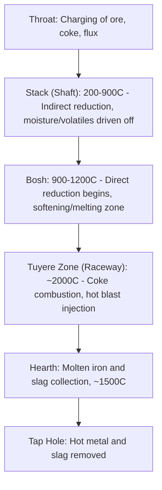

## Blast Furnace Ironmaking

### Overview

The blast furnace is the dominant industrial process for reducing iron oxide ores to molten metallic iron (hot metal/pig iron), which is subsequently refined into steel via the basic oxygen furnace (BOF) or, less commonly today, other steelmaking routes. It is a continuous, countercurrent shaft reactor in which solid burden materials descend while hot reducing gases ascend, achieving highly efficient heat and mass transfer. Blast furnace ironmaking remains, [Inference] by most industry accounts, the largest single source of primary (ore-based) steel production globally, alongside the newer direct reduced iron (DRI)-electric arc furnace (EAF) route.

### Furnace Structure and Zones

A blast furnace is a tall, refractory-lined vertical shaft, typically 30–40+ meters high, divided into functional zones based on temperature and chemical reaction regime:

- **Throat**: Top opening where burden materials (iron ore, coke, limestone flux) are charged in alternating layers via a bell or bell-less charging system
- **Stack (shaft)**: The main reduction zone; descending burden is progressively heated by ascending gas, and indirect reduction (via CO and H₂ gas) occurs here
- **Bosh**: Transition zone where burden begins to soften and melt; direct reduction (solid carbon reacting with iron oxide) becomes significant
- **Tuyeres**: Nozzles near the furnace base through which preheated air ("hot blast," typically 1000–1250°C) and often auxiliary fuels (pulverized coal, natural gas, oil) are injected
- **Raceway**: Small combustion zone immediately in front of each tuyere where coke combusts violently with the blast, reaching the highest temperatures in the furnace (~2000°C+)
- **Hearth**: Bottom reservoir where molten iron and slag collect, separated by density (slag floats above the denser molten iron)

### Raw Materials (Burden)

| Material | Function |
| --- | --- |
| Iron ore (sinter, pellets, lump ore) | Iron oxide source ($Fe_2O_3$, $Fe_3O_4$) |
| Coke | Reducing agent, fuel, and physical support structure (permeability) for the burden column |
| Limestone/dolomite (flux) | Combines with silica/alumina gangue to form fluid slag, removing impurities from the metal |
| Hot blast air (often O₂-enriched) | Supports coke combustion in the raceway |
| Auxiliary injectants (pulverized coal, natural gas) | Supplementary reducing agent/fuel, reduces coke rate |

**Key Points**

- Coke serves three simultaneous roles: chemical reductant, heat source (combustion fuel), and physical "scaffold" maintaining gas permeability through the burden column — a role no single alternative reductant fully replicates, which is why coke remains difficult to eliminate entirely from the conventional blast furnace route.
- Sinter and pellets (agglomerated ore products) are generally preferred over raw fine ore because they provide better gas permeability and more consistent reducibility.

### Core Chemical Reactions

**1. Coke Combustion (Raceway)**

$$C + O_2 \rightarrow CO_2 \qquad (\text{highly exothermic})$$

$$CO_2 + C \rightarrow 2CO \qquad (\text{Boudouard reaction, endothermic})$$

The net result is that coke combustion with the blast air produces primarily CO, the principal reducing gas of the furnace.

**2. Indirect Reduction (Stack Zone, via CO gas)**

Iron oxide is reduced stepwise as it descends through progressively hotter gas:

$$3Fe_2O_3 + CO \rightarrow 2Fe_3O_4 + CO_2$$

$$Fe_3O_4 + CO \rightarrow 3FeO + CO_2$$

$$FeO + CO \rightarrow Fe + CO_2$$

**3. Direct Reduction (Lower Stack/Bosh, via solid carbon)**

$$FeO + C \rightarrow Fe + CO$$

This reaction is strongly endothermic and consumes additional coke; furnace operators generally aim to maximize the more thermally efficient indirect (gas-based) reduction and minimize direct reduction where practical, though some direct reduction is unavoidable in the lower furnace.

**4. Flux/Slag Formation**

$$CaCO_3 \rightarrow CaO + CO_2 \qquad (\text{calcination})$$

$$CaO + SiO_2 \rightarrow CaSiO_3 \qquad (\text{slag formation, removes silica gangue})$$

The resulting slag (calcium-alumino-silicate) is molten at furnace operating temperatures, floats above the denser hot metal in the hearth, and is tapped separately.

### Energy and Mass Balance Concepts

**Countercurrent Heat Exchange**

The efficiency of the blast furnace derives largely from its countercurrent flow arrangement: hot ascending gas transfers heat to the descending, cooler burden, while the burden's own sensible heat preheats the gas as it descends in temperature toward the stack top. This heat recovery is a central reason blast furnaces achieve high thermal efficiency relative to batch reduction processes.

**Coke Rate**

The **coke rate** (kg coke per tonne of hot metal produced) is a key performance and cost metric, [Inference] commonly cited in the range of roughly 300–450 kg/tonne hot metal for modern, well-optimized furnaces, though this varies significantly with ore quality, auxiliary fuel injection rates, and furnace design/operating practice. Pulverized coal injection (PCI) through the tuyeres is widely used to substitute for a portion of coke, reducing overall reductant costs.

**Furnace Productivity**

Productivity is often expressed as tonnes of hot metal per unit furnace working volume per day, influenced by blast volume/temperature, burden permeability, and oxygen enrichment of the blast.

### Byproducts and Gas Utilization

- **Blast furnace gas (BFG)**: The top gas exiting the furnace throat is rich in CO and N₂ with residual calorific value; it is commonly cleaned and reused as fuel for hot blast stoves, power generation, or other plant heating needs — an important element of integrated steelworks energy balance.
- **Slag**: Tapped separately from hot metal; commonly granulated (rapidly water-quenched) for use as a supplementary cementitious material in concrete (ground granulated blast furnace slag, GGBS/GGBFS), or air-cooled for aggregate applications.
- **Hot metal (pig iron)**: Typically contains ~4–4.5% carbon plus silicon, manganese, phosphorus, and sulfur impurities picked up during the process; it is not usable directly as steel and must be refined (typically via the basic oxygen furnace) to reduce carbon content and remove impurities.

### Worked Example: Simplified Overall Reduction Reaction

For hematite ore reduced overall by carbon (combining direct and net indirect pathways into a single overall stoichiometric statement):

$$Fe_2O_3 + 3C \rightarrow 2Fe + 3CO$$

**Example calculation** — theoretical carbon requirement per tonne of iron (ignoring auxiliary fuel substitution, energy losses, and the fact that real furnaces use a mix of CO- and C-based reduction):

$$M_{Fe_2O_3} = 159.7 \, g/mol, \quad M_{Fe} = 55.85 \, g/mol, \quad M_C = 12.01 \, g/mol$$

Per the stoichiometry, 2 mol Fe (111.7 g) requires 3 mol C (36.03 g):

$$\text{Carbon per tonne Fe} = \frac{36.03}{111.7} \times 1000 \, kg \approx 322.6 \, kg \, C/\text{tonne Fe}$$

**Output**: Theoretical minimum ≈ 323 kg carbon per tonne of iron via this simplified overall reaction; actual coke consumption in practice is higher due to combustion losses, Boudouard reaction inefficiencies, and the energy demands of melting, flux calcination, and heat losses — which is consistent with the higher real-world coke rates cited above.

**Illustration — Blast Furnace Zone Temperature Profile (svg_diagram)**

<svg xmlns="http://www.w3.org/2000/svg" viewBox="0 0 500 380" font-family="sans-serif">
<text x="250" y="22" text-anchor="middle" font-size="15" font-weight="bold">Blast Furnace Temperature Profile (svg_diagram)</text>
<polygon points="150,50 350,50 320,320 180,320" fill="#3a2a15" stroke="#000" stroke-width="2" />
<line x1="150" y1="120" x2="332" y2="120" stroke="#e0a030" stroke-width="1" stroke-dasharray="4,3" />
<text x="360" y="124" font-size="11">~400-900C: Stack</text>
<line x1="163" y1="200" x2="319" y2="200" stroke="#e07030" stroke-width="1" stroke-dasharray="4,3" />
<text x="360" y="204" font-size="11">~900-1200C: Bosh</text>
<line x1="180" y1="260" x2="304" y2="260" stroke="#e04010" stroke-width="1" stroke-dasharray="4,3" />
<text x="360" y="264" font-size="11">~1500-2000C: Tuyere/Raceway</text>
<rect x="180" y="290" width="124" height="30" fill="#ffb347" opacity="0.7" />
<text x="360" y="308" font-size="11">Hearth: molten Fe + slag</text>
<text x="250" y="80" text-anchor="middle" fill="#fff" font-size="11">Ore + Coke + Flux Charge</text>
<line x1="80" y1="330" x2="150" y2="330" stroke="#555" stroke-width="4" marker-end="url(#a2)" />
<text x="40" y="345" font-size="11">Hot metal tap</text>
</svg>

### Environmental and Engineering Considerations

- **CO₂ emissions**: The blast furnace–BOF route is one of the most carbon-intensive steps in conventional steelmaking due to coke-based carbothermic reduction, driving industry interest in alternatives such as hydrogen-based direct reduction and electric arc furnace routes using scrap or DRI.
- **Refractory wear**: Hearth and bosh refractories endure extreme thermal and chemical stress; hearth erosion/refractory life is a major determinant of overall campaign length (years between major relines) for a given furnace.
- **Burden permeability**: Fines and degraded pellets can impair gas flow, causing channeling or "hanging" (burden sticking then suddenly slipping), which are operational upset conditions furnace operators actively monitor and manage.
- **Sulfur and phosphorus control**: Both are largely controlled via slag chemistry (basicity) rather than eliminated in the blast furnace itself; final refinement occurs downstream in steelmaking.
- Actual performance figures (coke rate, productivity, campaign life) vary considerably by furnace design, ore/coke quality, and operating practice, so the ranges cited here should be read as representative rather than universal benchmarks.

### Related Topics

- Basic Oxygen Furnace (BOF) Steelmaking
- Direct Reduced Iron (DRI) and Hydrogen-Based Ironmaking
- Sintering and Pelletizing of Iron Ore
- Slag Chemistry and Basicity Control
- Electric Arc Furnace (EAF) Steelmaking
- Coke Production and Coal Carbonization
- Blast Furnace Refractory Materials and Campaign Life
- Steel Decarbonization Pathways (Green Steel)
- Ironmaking Process Control and Instrumentation