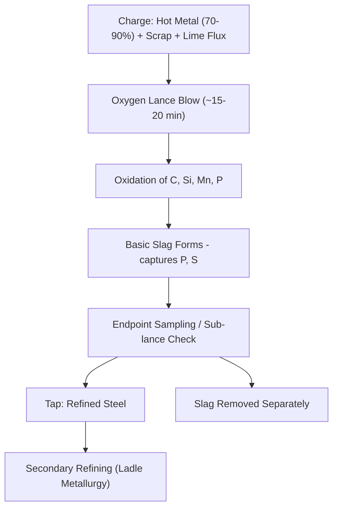
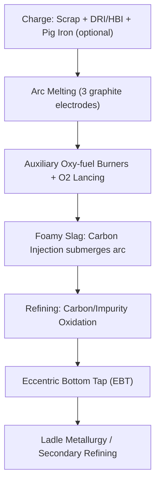

## Steelmaking: Basic Oxygen and Electric Arc Processes

### Overview

Steelmaking converts iron (either molten hot metal from a blast furnace or solid scrap/direct reduced iron) into steel by controlling carbon content and removing impurities (silicon, manganese, phosphorus, sulfur) to achieve target mechanical and chemical specifications. The two dominant industrial routes are:

1. **Basic Oxygen Furnace (BOF)** — refines molten blast-furnace hot metal by blowing high-purity oxygen through/onto the melt, oxidizing carbon and impurities rapidly
2. **Electric Arc Furnace (EAF)** — melts and refines steel scrap (and/or direct reduced iron, DRI) using electric arcs as the primary heat source

Together these two routes account for the overwhelming majority of global crude steel production, with BOF traditionally dominant in integrated (ore-based) steelworks and EAF dominant in scrap-based "mini-mill" operations. [Inference] The relative global share between the two routes has been shifting over recent decades toward EAF, driven by scrap availability, lower capital intensity, and decarbonization pressure, though the precise current split depends on region and year and should be verified against current industry statistics if precision is required.

### Basic Oxygen Furnace (BOF) Process

**Charge and Vessel**

The BOF is a pear-shaped, refractory-lined, tiltable vessel charged with:

- Molten hot metal from the blast furnace (typically ~70–90% of charge by weight)
- Steel scrap (remainder, serving as a coolant to absorb excess heat from oxidation reactions)
- Fluxes (burnt lime, dolomitic lime) to form basic slag

**Oxygen Blowing**

A water-cooled lance is lowered into the vessel and high-purity oxygen (>99.5%) is blown at supersonic velocity onto the surface of the molten bath. This is why the process is often called the "Linz-Donawitz" (LD) process, after its city of commercial origin.

**Key Oxidation Reactions**

$$C + O_2 \rightarrow CO_2 \quad \text{(and } 2C + O_2 \rightarrow 2CO\text{, partial oxidation)}$$

$$Si + O_2 \rightarrow SiO_2$$

$$Mn + \frac{1}{2}O_2 \rightarrow MnO$$

$$2P + \frac{5}{2}O_2 \rightarrow P_2O_5 \quad \text{(subsequently fixed into basic slag)}$$

These reactions are strongly exothermic, and the heat released is sufficient to melt the scrap component of the charge without external fuel — a defining feature that distinguishes BOF from EAF, which requires external electrical energy input.

**Slag Chemistry and Dephosphorization**

Lime additions form a basic (high-CaO) slag that captures phosphorus and sulfur:

$$P_2O_5 + 3CaO \rightarrow Ca_3(PO_4)_2 \quad \text{(fixed into slag)}$$

Basicity (CaO/SiO₂ ratio) is a critical control parameter — [Inference] typically targeted in the range of roughly 2.5–4 for effective dephosphorization, though exact targets vary by steel grade and plant practice.

**Blow Duration and Endpoint Control**

A typical BOF "blow" (oxygen injection cycle) lasts approximately 15–20 minutes, dramatically faster than older open-hearth steelmaking (which could take many hours). Endpoint carbon content and temperature are increasingly controlled via sub-lance sampling and dynamic process models (static/dynamic charge models) rather than purely operator judgment.

### Electric Arc Furnace (EAF) Process

**Charge and Vessel**

The EAF is a cylindrical, refractory-lined vessel with a retractable roof through which three graphite electrodes are lowered. The charge is predominantly steel scrap, often supplemented with DRI/HBI (hot briquetted iron) or pig iron to dilute residual tramp elements from scrap and adjust metallurgy.

**Melting via Electric Arc**

An electric arc is struck between the electrodes and the scrap charge, generating intense localized heat (arc temperatures can reach several thousand degrees Celsius) that melts the charge. Modern EAFs commonly supplement arc heating with:

- Oxy-fuel burners (auxiliary chemical heat, speeds melt-in)
- Oxygen lancing (carbon/impurity oxidation, similar in principle to BOF)
- Carbon/lime injection (foamy slag practice — see below)

**Foamy Slag Practice**

Injecting carbon into the FeO-containing slag generates CO gas bubbles that "foam" the slag, submerging the arc. This improves electrical efficiency, protects the refractory lining from arc radiation, and reduces electrode consumption — a widely adopted operational technique in modern EAF practice.

$$FeO + C \rightarrow Fe + CO \quad (\text{foaming reaction})$$

**Key Operating Stages**

1. **Charging**: Scrap (and DRI/pig iron as applicable) loaded via baskets or continuous feed
2. **Melting**: Arc power applied; bore-in then flat-bath melting phases
3. **Refining**: Oxygen blowing to reduce carbon to target, remove residual impurities; slag adjusted for foaming and, where needed, some desulfurization
4. **Tapping**: Molten steel tapped (often via eccentric bottom tapping, EBT) leaving high-phosphorus slag behind to avoid "slag carryover" (rephosphorization risk)

### BOF vs. EAF: Comparative Summary

| Factor | BOF | EAF |
| --- | --- | --- |
| Primary feedstock | Molten hot metal (blast furnace) + scrap | Scrap, DRI/HBI, pig iron |
| Heat source | Exothermic oxidation reactions | Electric arc (+ auxiliary chemical energy) |
| Cycle time | ~15–20 min blow (tap-to-tap ~30–40 min) | Tap-to-tap commonly ~50–70 min [Inference, varies by furnace/practice] |
| Capital intensity | High (requires integrated blast furnace/coke plant upstream) | Lower (standalone mini-mill feasible) |
| Feedstock flexibility | Limited (needs consistent hot metal supply) | High (scrap-based, flexible product mix) |
| Typical residual/tramp element control | Better (dilutable via fresh hot metal) | More challenging with dirty/mixed scrap |
| CO₂ intensity | Higher (tied to coke-based ironmaking upstream) | Generally lower, especially with low-carbon electricity |
| Common product focus | Flat products (sheet, plate) — historically | Long products (rebar, sections) historically, though EAF flat-product capability has expanded significantly |

[Inference] The historical product-mix association (BOF→flat, EAF→long) has weakened over time as EAF metallurgical control and DRI/scrap quality have improved, enabling EAF producers to serve higher-specification flat-product markets in many regions.

### Secondary Refining (Ladle Metallurgy)

Both BOF and EAF steel are typically further refined in the ladle before casting:

- **Ladle furnace (LF)**: Electrode reheating and alloy trimming, temperature homogenization
- **Vacuum degassing (RH, VOD, VD)**: Removes dissolved hydrogen, nitrogen, and reduces carbon to ultra-low levels (critical for certain automotive and pipeline steel grades)
- **Desulfurization**: Often performed in the ladle using reducing (low-oxygen) slag conditions favorable for sulfur removal, complementing the oxidizing conditions of the primary furnace which favor phosphorus removal instead
- **Alloying and inclusion control**: Precise trim additions (Al, Si, Mn, microalloys such as Nb/V/Ti) and calcium treatment for inclusion morphology control

**Key Points**

- Dephosphorization requires oxidizing, basic slag conditions, while desulfurization favors reducing, basic slag conditions — the two cannot be optimized simultaneously in a single slag regime, which is a core reason steelmaking is split between an oxidizing primary furnace step (BOF/EAF) and a reducing secondary ladle treatment step.

### Worked Example: Simplified Carbon Balance in BOF

**Problem**: A BOF charge contains hot metal at 4.3% C by weight. If the charge is 250 tonnes of hot metal and the target tapped steel carbon is 0.05%, estimate the mass of carbon removed (ignoring scrap dilution and yield losses, for illustrative purposes only).

$$C_{initial} = 250{,}000 \, kg \times 0.043 = 10{,}750 \, kg$$

$$C_{final} = 250{,}000 \, kg \times 0.0005 = 125 \, kg$$

$$C_{removed} \approx 10{,}750 - 125 = 10{,}625 \, kg$$

**Output**: Approximately 10.6 tonnes of carbon oxidized and removed as CO/CO₂ gas per 250-tonne heat under these simplified assumptions. [Inference] Real plant calculations must additionally account for scrap carbon content, yield/blow losses, and dilution effects, so this figure is illustrative of the general order of magnitude rather than a precise operational number.

### Environmental and Engineering Considerations

- **CO₂ emissions**: BOF steelmaking's carbon footprint is dominated by the upstream blast furnace/coke-making stages rather than the BOF vessel itself; EAF's footprint is dominated by electricity source, making EAF-scrap routes a key pathway for steel sector decarbonization when paired with low-carbon grids.
- **Scrap quality and tramp elements**: Copper, tin, and other tramp elements from scrap cannot be removed by oxidative steelmaking (unlike carbon, silicon, phosphorus) and accumulate in EAF-scrap-based steel over recycling cycles — a long-term concern sometimes termed "metal in the loop" degradation, addressed via scrap sorting and dilution with virgin iron units (DRI/pig iron).
- **Off-gas and dust**: Both processes generate significant off-gas requiring capture and treatment (BOF gas can be recovered similarly to blast furnace gas; EAF dust often contains recoverable zinc from galvanized scrap and is processed via dedicated recycling routes, e.g., Waelz kiln).
- **Refractory and electrode consumption**: EAF graphite electrode consumption and BOF refractory wear are both significant operating cost drivers subject to ongoing process optimization.
- Cycle times, energy consumption, and slag basicity targets vary meaningfully with furnace design, scrap/hot-metal quality, and plant-specific practice, so figures cited here should be read as representative ranges rather than fixed universal values.

### Related Topics

- Blast Furnace Ironmaking (upstream hot metal supply for BOF)
- Direct Reduced Iron (DRI) and Hydrogen-Based Ironmaking
- Ladle Metallurgy and Secondary Steel Refining
- Continuous Casting of Steel
- Slag Chemistry and Basicity Control
- Steel Decarbonization Pathways (Green Steel)
- Scrap Recycling and Tramp Element Management
- Vacuum Degassing (RH, VOD) Process Design
- Steel Microalloying and Inclusion Engineering