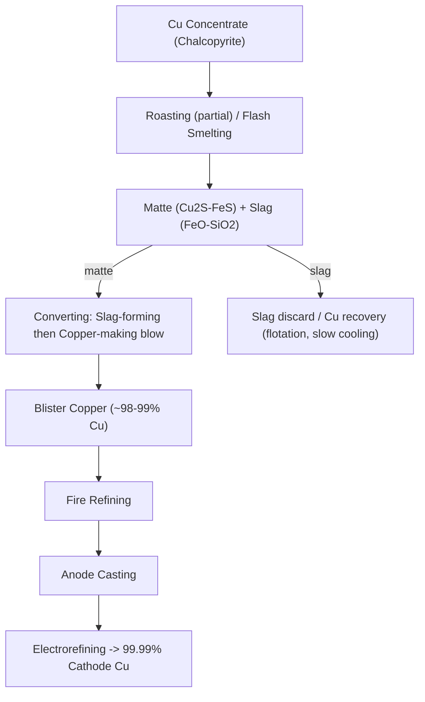

## Reduction and Smelting of Nonferrous Ores

### Overview

Nonferrous smelting encompasses the pyrometallurgical processes used to extract metals other than iron — principally copper, lead, zinc, nickel, and tin — from their ores and concentrates. Unlike ironmaking, which is dominated almost entirely by carbothermic reduction of oxide ore in a single reactor type (the blast furnace), nonferrous smelting is far more heterogeneous: it must accommodate ores that are predominantly **sulfidic** (Cu, Ni, Pb, Zn) rather than oxidic, and each metal's distinct thermochemistry demands a different furnace and reaction sequence. The unifying theme is a sequence of **roasting, matte smelting, converting, and refining** stages tailored to the specific metal system.

### Why Sulfide Ores Require Different Processing

Most economically significant copper, nickel, lead, and zinc ores occur as sulfide minerals (chalcopyrite $CuFeS_2$, galena $PbS$, sphalerite $ZnS$, pentlandite $(Ni,Fe)_9S_8$) rather than oxides. Sulfide ores cannot simply be reduced with carbon the way iron oxide can; instead, sulfide smelting exploits the fact that many base metals have a **higher affinity for sulfur than iron does**, allowing sulfide melts to be separated from iron-oxide-based slag by density and chemical partitioning — the basis of "matte smelting."

### Roasting

Roasting is a controlled, high-temperature oxidation of sulfide concentrates in air, performed prior to smelting to:

- Partially or fully convert sulfides to oxides (or sulfates), depending on target
- Reduce sulfur content to a level appropriate for the subsequent smelting step
- Generate SO₂-rich off-gas suitable for capture as sulfuric acid (a major economic byproduct and environmental necessity)

$$2ZnS + 3O_2 \rightarrow 2ZnO + 2SO_2$$

$$2PbS + 3O_2 \rightarrow 2PbO + 2SO_2$$

For copper concentrates, roasting is often only **partial** ("dead roasting" fully oxidizes; "partial/sweetening roasting" leaves controlled residual sulfide), because subsequent matte smelting depends on retaining some sulfide-iron chemistry.

**Key Points**

- Modern flash smelting furnaces increasingly combine roasting and smelting into a single autogenous step, reducing the need for a discrete roasting furnace — this is a major evolution from older multi-hearth roaster practice.
- SO₂ capture and conversion to sulfuric acid is now essentially mandatory in modern smelters both for environmental compliance and revenue generation, and dictates minimum off-gas SO₂ concentration targets for economical acid-plant operation.

### Copper Smelting: Matte Smelting and Converting

Copper is the archetype of nonferrous sulfide smelting and proceeds through a well-defined multi-stage sequence.

**1. Matte Smelting**

Copper concentrate (chalcopyrite, $CuFeS_2$), flux (silica), and oxygen-enriched air are fed into a smelting furnace (flash smelting furnace or, historically, reverberatory furnace) at ~1200–1300°C. The charge separates into two immiscible liquid phases by density:

- **Matte**: A molten mixture of copper and iron sulfides ($Cu_2S \cdot FeS$), the copper-bearing product, denser and settles below
- **Slag**: An iron-silicate melt ($FeO \cdot SiO_2$, "fayalite" slag) carrying most of the gangue, floats above and is removed/discarded (or further processed for copper recovery)

2CuFeS_2 + O_2 \rightarrow Cu_2S \cdot FeS_{(matte)} + FeO \cdot SiO_2_{(slag)} + SO_2

Matte grade (% Cu in matte) is a key process target; higher-grade mattes reduce converting duty but require more precise furnace control.

**2. Converting**

Molten matte is transferred to a converter (traditionally a Peirce-Smith horizontal rotary vessel, though top-blown rotary converters and continuous converting technologies are also used) where air/oxygen is blown through the melt in two sequential stages:

*Slag-forming (blister) stage* — iron sulfide is oxidized preferentially over copper sulfide (because FeS has a higher affinity for oxygen than $Cu_2S$ under converter conditions), forming FeO which combines with added silica flux into a slag removed periodically:

2FeS + 3O_2 + SiO_2 \rightarrow 2FeO \cdot SiO_2_{(slag)} + 2SO_2

*Copper-making stage* — once iron is substantially removed, continued blowing oxidizes the remaining copper sulfide directly to metallic "blister copper" (~98–99% Cu):

$$Cu_2S + O_2 \rightarrow 2Cu_{(l)} + SO_2$$

Blister copper takes its name from the blistered surface texture caused by SO₂ gas evolving as the melt solidifies.

**3. Fire Refining and Electrorefining**

Blister copper is fire-refined (oxidized then "poled"/reduced to remove residual sulfur and oxygen) and cast into anodes for electrorefining (see Electrometallurgy) to reach 99.99%+ purity cathode copper.

### Lead Smelting

Lead is unusual among major base metals in that its principal sulfide (galena, $PbS$) is often smelted via a **roast-reduction** route more analogous to iron smelting than to copper matte smelting, because lead oxide is comparatively easy to reduce with carbon.

**1. Roasting/Sintering**

$$2PbS + 3O_2 \rightarrow 2PbO + 2SO_2$$

Sintering machines simultaneously roast fine concentrate and agglomerate it into a permeable sinter suitable for blast furnace charging.

**2. Reduction (Blast Furnace or Direct Smelting)**

$$PbO + CO \rightarrow Pb + CO_2$$

Modern practice increasingly favors direct smelting-reduction processes (e.g., Kivcet, QSL, Isasmelt/Ausmelt-based lead processes) that combine oxidation and reduction stages within a single or closely coupled furnace system, reducing SO₂ fugitive emissions and improving energy efficiency relative to older sinter-blast furnace routes. [Inference] The specific choice among these modern direct-smelting technologies varies by smelter and region, so details should be confirmed against current operator documentation for precision.

**3. Drossing and Refining**

Crude lead bullion undergoes pyrometallurgical refining steps (drossing to remove copper, softening to remove antimony/arsenic/tin via oxidation, desilverizing via the Parkes process using zinc addition, and final refining) to reach commercial purity.

### Zinc Extraction: Pyrometallurgical vs. Hydrometallurgical Routes

Zinc presents a distinctive challenge: metallic zinc boils at 907°C, below the temperatures at which zinc oxide is readily carbothermically reduced (~1000°C+), meaning zinc vaporizes immediately upon reduction and must be recovered from vapor rather than tapped as a liquid — a fundamentally different engineering problem from copper, lead, or iron.

**Pyrometallurgical (Retort/Imperial Smelting) Route**

$$ZnO + C \rightarrow Zn_{(v)} + CO$$

Zinc vapor is condensed rapidly (historically in horizontal or vertical retorts, more recently the Imperial Smelting Furnace, ISF, which can simultaneously produce lead) — rapid condensation is essential to prevent re-oxidation of zinc vapor by CO₂ in the furnace gas.

**Hydrometallurgical (Roast-Leach-Electrowin, RLE) Route** — Now Dominant

[Inference] The RLE route accounts for the substantial majority of global primary zinc production today, having largely displaced pyrometallurgical retort/ISF smelting due to lower energy intensity and better environmental control, though exact current market share figures should be checked against up-to-date industry statistics.

1. Roast sphalerite concentrate to zinc oxide (calcine) + SO₂ (captured as sulfuric acid)
2. Leach calcine in sulfuric acid to produce zinc sulfate solution
3. Purify solution (cementation with zinc dust to remove Cu, Cd, Co, Ni)
4. Electrowin zinc metal from purified solution (see Electrometallurgy)

This RLE route is essentially a hydrometallurgical flowsheet bolted onto an initial pyrometallurgical roasting step, illustrating how real-world extraction flowsheets frequently blend both major branches of extractive metallurgy rather than adhering strictly to one.

### Nickel Smelting (Sulfide Ore Route)

Nickel sulfide ores (pentlandite, often associated with pyrrhotite and chalcopyrite) follow a matte-smelting-converting sequence broadly analogous to copper:

1. **Flotation concentration** of nickel sulfide ore
2. **Roasting/smelting** to produce a Ni-Cu-Fe sulfide matte, rejecting iron to slag
3. **Converting** to remove remaining iron, producing a high-grade Ni-Cu matte ("Bessemer matte")
4. **Matte separation** (slow cooling and magnetic/flotation separation, or hydrometallurgical routes such as the Sherritt-Gordon ammonia leach process) to separate nickel and copper sulfides
5. **Refining** via electrorefining or the **Mond process** (nickel carbonyl route, $Ni + 4CO \rightarrow Ni(CO)_4$, decomposed thermally to deposit pure nickel) for very high-purity nickel

[Inference] Nickel laterite ores (oxide/silicate rather than sulfide) require entirely different processing — typically hydrometallurgical (high-pressure acid leach, HPAL) or pyrometallurgical ferronickel/matte smelting routes — reflecting the same ore-mineralogy-dependent branching seen across nonferrous metallurgy generally.

### Comparative Summary of Nonferrous Smelting Routes

| Metal | Principal Ore Mineral | Primary Route | Key Distinguishing Feature |
| --- | --- | --- | --- |
| Copper | Chalcopyrite ($CuFeS_2$) | Matte smelting + converting | Density-based matte/slag separation |
| Lead | Galena ($PbS$) | Roast-reduction (sinter/blast furnace or direct smelting) | Carbothermic reduction of PbO, analogous to Fe |
| Zinc | Sphalerite ($ZnS$) | Roast-Leach-Electrowin (RLE), or pyro retort/ISF | Zinc's low boiling point forces vapor-phase or hydrometallurgical handling |
| Nickel (sulfide) | Pentlandite | Matte smelting + converting + refining | Matte separation into distinct Ni/Cu sulfides |
| Nickel (laterite) | Limonite/saprolite | HPAL (hydro) or ferronickel smelting (pyro) | Oxide/silicate ore, no sulfide matte chemistry applies |

### Worked Example: Matte Grade and Slag Loss Estimation

**Problem**: A copper smelting furnace processes 1000 tonnes of concentrate containing 25% Cu (as chalcopyrite) per day, producing a matte assaying 60% Cu. Assuming 96% of the copper reports to matte (remainder lost to slag), calculate the mass of matte produced daily.

$$Cu_{feed} = 1000 \times 0.25 = 250 \, \text{tonnes Cu}$$

$$Cu_{to\ matte} = 250 \times 0.96 = 240 \, \text{tonnes Cu}$$

$$Matte\ mass = \frac{240}{0.60} = 400 \, \text{tonnes matte/day}$$

**Output**: Approximately 400 tonnes of 60%-grade matte produced per day, with roughly 10 tonnes of copper (250 − 240) reporting to slag as a loss requiring downstream slag treatment (flotation or slow cooling/settling) for economic recovery.

### Environmental and Engineering Considerations

- **SO₂ emissions and acid plants**: All sulfide smelting generates substantial SO₂; modern smelters are generally required to capture this as sulfuric acid, making acid plant integration a near-universal feature of contemporary nonferrous smelter design.
- **Slag copper/metal losses**: Slag from matte smelting and converting retains dissolved and entrained metal losses; slag flotation, slow cooling, or electric furnace slag cleaning are commonly used to recover economic value and reduce environmental slag liability.
- **Fugitive emissions**: Converting (particularly older Peirce-Smith batch converters) can generate significant fugitive SO₂ and particulate emissions during charging/skimming; continuous converting technologies are part of an industry-wide trend toward emissions reduction.
- **Energy intensity**: Flash smelting technologies (autogenous, using the exothermic heat of sulfide oxidation) are markedly more energy-efficient than older reverberatory furnace practice, representing a major historical efficiency gain in the copper industry.
- Matte grades, slag chemistry targets, and metal recovery rates vary considerably by ore composition, furnace technology, and plant-specific practice; figures above should be read as illustrative rather than universal.

### Related Topics

- Hydrometallurgy Fundamentals (leaching routes complementary/alternative to smelting)
- Electrometallurgy and Electrowinning (refining stage for Cu, Ni, Zn)
- Froth Flotation and Ore Concentration (upstream feed preparation)
- Slag Chemistry and Metal Loss Mechanisms
- Flash Smelting Furnace Design (Outotec/Inco technology)
- Sulfuric Acid Plant Integration in Smelters
- Nickel Laterite Processing (HPAL vs. Ferronickel)
- Precious Metal Recovery from Anode Slimes and Slags
- Continuous Converting Technologies in Copper Smelting