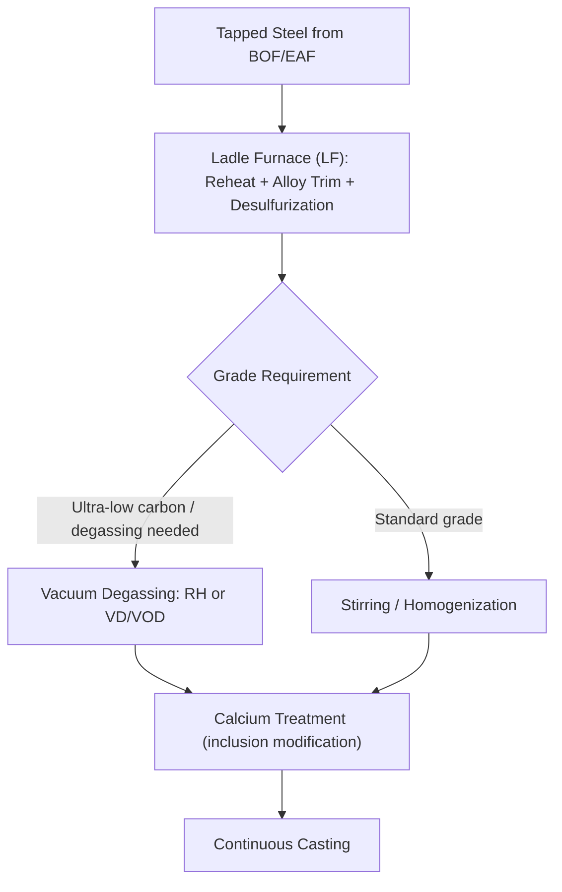

## Ladle Metallurgy and Refining

### Overview

Ladle metallurgy (also called secondary steelmaking or secondary refining) encompasses the suite of treatments applied to liquid steel after it leaves the primary steelmaking vessel (BOF or EAF) but before it is cast. Primary steelmaking is optimized for rapid, bulk decarburization and impurity oxidation; it cannot simultaneously achieve the tight chemical composition, low gas content, precise temperature control, and inclusion cleanliness that modern steel specifications demand. Ladle metallurgy fills this gap, transforming "primary steel" into a product meeting exacting mechanical, chemical, and cleanliness requirements for automotive, pipeline, aerospace, and other demanding applications.

### Why Secondary Refining Is Necessary

The primary furnace (BOF/EAF) operates under **oxidizing** conditions to remove carbon and phosphorus efficiently. However:

- Oxidizing conditions are unfavorable for **sulfur removal**, which requires a reducing, basic slag environment
- Primary furnace tapping and handling introduce dissolved gases (hydrogen, nitrogen) and reoxidation products (oxide inclusions)
- Alloy additions made in the primary furnace suffer poor yield and inconsistent recovery due to the violent, oxidizing conditions
- Temperature and composition homogeneity across a large heat cannot be guaranteed by the primary vessel alone

Ladle metallurgy therefore operates as a **reducing, controlled-atmosphere** environment, functionally complementary to the oxidizing primary furnace.

**Key Points**

- Dephosphorization (favored by oxidizing, basic conditions) and desulfurization (favored by reducing, basic conditions) cannot be optimized simultaneously in one slag system — this is the fundamental metallurgical reason steelmaking is split between primary (oxidizing) and secondary (reducing) stages.

### Core Ladle Metallurgy Unit Operations

**1. Ladle Furnace (LF) Treatment**

The ladle is positioned under an electrode-equipped roof (similar in principle to a small EAF) enabling:

- **Reheating**: Compensates for temperature loss during tapping and transport, allowing precise temperature control ahead of casting
- **Alloy trimming**: Precise, high-yield addition of ferroalloys (FeMn, FeSi, FeCr, microalloys) under a reducing slag, achieving far better recovery than additions made in the oxidizing primary furnace
- **Desulfurization**: A reducing, high-basicity, low-FeO synthetic slag (often lime-alumina based, sometimes with CaC₂ or Al additions as reducing/deoxidizing agents) promotes sulfur transfer from steel to slag

$$[S] + (CaO) \rightarrow (CaS) + [O] \quad \text{(favored under low oxygen potential, reducing slag)}$$

**2. Inert Gas Stirring**

Argon gas is injected through a porous plug in the ladle base (or via a submerged lance) to:

- Homogenize temperature and composition throughout the ladle
- Promote inclusion flotation (small oxide/sulfide inclusions are swept upward by rising bubbles and absorbed into the slag)
- Accelerate reactions between the steel and slag by increasing interfacial contact and renewal

**Key Points**

- Stirring intensity must be carefully controlled: excessive stirring can cause slag "eye" formation (exposure of bare steel to atmosphere) and promote reoxidation and nitrogen pickup, while insufficient stirring limits homogenization and inclusion removal efficiency.

**3. Vacuum Degassing**

Several vacuum treatment technologies remove dissolved hydrogen and nitrogen and enable ultra-low carbon production by shifting the carbon-oxygen reaction equilibrium:

$$[C] + [O] \rightarrow CO_{(g)} \quad \text{(favored at low pressure, per Le Chatelier's principle)}$$

| Process | Mechanism | Typical Application |
| --- | --- | --- |
| RH (Ruhrstahl-Heraeus) degasser | Steel circulated between ladle and vacuum vessel via up-leg/down-leg snorkels using lift gas (Ar) | Ultra-low carbon (ULC) steel for automotive sheet |
| VD (Vacuum Degassing) | Entire ladle placed under vacuum with Ar stirring | Hydrogen removal, general degassing |
| VOD (Vacuum Oxygen Decarburization) | Oxygen blown under vacuum | Stainless steel decarburization without excessive chromium oxidation |

[Inference] RH degassing is widely regarded as capable of achieving very low carbon levels (commonly cited around 10–20 ppm or lower in optimized ULC practice), though exact achievable levels depend strongly on plant-specific equipment, vacuum level, and treatment time.

**4. Calcium Treatment**

Calcium-silicon or calcium-iron wire is injected into the ladle (typically via cored-wire feeding to overcome calcium's high vapor pressure at steelmaking temperatures) to modify the composition and morphology of oxide inclusions:

Al_2O_3_{(inclusion, solid)} + Ca \rightarrow CaO \cdot Al_2O_3_{(liquid\ calcium\ aluminate)}

This converts solid, angular alumina inclusions (which can cause nozzle clogging during casting and act as fatigue crack initiation sites in the final product) into liquid, globular calcium aluminate inclusions that are less harmful to castability and mechanical properties.

**5. Deoxidation**

Prior to or during ladle treatment, strong deoxidizers (Al, Si, Mn, or combinations) are added to remove dissolved oxygen carried over from the oxidizing primary furnace, preventing "rimming" behavior and controlling the population of resulting oxide inclusions:

2[Al] + 3[O] \rightarrow Al_2O_3_{(inclusion)}

"Killed" steel (fully deoxidized, typically with aluminum) is standard for most modern high-quality steel grades, in contrast to older "rimmed" or "semi-killed" practice.

### Inclusion Engineering

Non-metallic inclusions (oxides, sulfides, and their combinations) are unavoidable byproducts of deoxidation and residual reaction products, but their **size, morphology, and distribution** can be engineered rather than merely minimized:

| Inclusion Type | Formation | Concern | Mitigation |
| --- | --- | --- | --- |
| Alumina ($Al_2O_3$) | Aluminum deoxidation | Hard, angular, clusters; nozzle clogging, fatigue initiation | Calcium treatment (liquid calcium aluminates) |
| Manganese sulfide (MnS) | Sulfur + manganese | Elongates during rolling, anisotropic mechanical properties | Low-sulfur practice, calcium treatment (globular CaS) |
| Silica/spinel inclusions | Si deoxidation, refractory interaction | Variable depending on composition | Slag/refractory compatibility control |

**Key Points**

- The overarching goal of modern inclusion engineering is not zero inclusions (metallurgically unrealistic) but rather controlling inclusions to be small, globular, and well-dispersed rather than large, angular, or clustered — this is the practical target embedded in most steel cleanliness specifications.

### Worked Example: Le Chatelier Effect in Vacuum Decarburization

**Problem**: Illustrate qualitatively why reducing pressure promotes the carbon-oxygen reaction for ultra-low carbon steelmaking.

The reaction $[C] + [O] \rightarrow CO_{(g)}$ has an equilibrium constant approximately expressed (in simplified activity terms) as:

$$K = \frac{p_{CO}}{a_C \cdot a_O}$$

At fixed $K$ (temperature-dependent), reducing the partial pressure of CO gas above the melt (via vacuum) means the equilibrium must shift to the right (favoring further formation of CO gas from dissolved carbon and oxygen) to satisfy the equilibrium relationship — i.e., lower achievable $a_C \cdot a_O$ product, and therefore lower attainable dissolved carbon at a given oxygen activity.

**Output**: This is the fundamental thermodynamic justification for why RH/VOD vacuum treatment can achieve carbon levels unattainable at atmospheric pressure using the same oxygen potential — a qualitative rather than a numerically solved example, since real equilibrium constants and activity coefficients require case-specific thermodynamic data.

### Ladle Refractories and Practical Considerations

- Ladle linings (typically magnesia-carbon or dolomite-based refractories) must withstand both the thermal/chemical stress of the reducing slag treatment and mechanical wear from stirring and transport.
- Ladle "furniture" (stopper rods, slide gates, porous plugs) requires careful design and maintenance, as failures (e.g., porous plug blockage, slide gate erosion) directly threaten casting continuity and product quality.
- Temperature loss during ladle transport and treatment is a persistent practical constraint, driving reheating capability requirements in the ladle furnace and influencing scheduling between primary steelmaking, ladle treatment, and casting.

### Environmental and Engineering Considerations

- **Slag reuse and disposal**: Ladle furnace slags (lime-alumina based) differ chemically from primary furnace slags and are often managed as a separate waste/byproduct stream, with some reuse potential depending on composition and regional regulation.
- **Energy consumption**: Ladle furnace reheating and vacuum degasser operation add electrical/energy cost to the overall steelmaking chain, representing a trade-off against the quality and yield benefits gained.
- **Refractory consumption**: Aggressive reducing slags and calcium treatment can increase refractory wear rates relative to less demanding grades, influencing overall lining campaign life and cost.
- Achievable inclusion cleanliness, degassing levels, and desulfurization performance vary meaningfully with plant-specific equipment, slag practice, and steel grade requirements, so figures cited here represent general industry ranges rather than universal guarantees.

### Related Topics

- Steelmaking: Basic Oxygen and Electric Arc Processes (upstream primary refining)
- Continuous Casting of Steel
- Deoxidation Practice and Killed/Rimmed Steel
- Inclusion Engineering and Steel Cleanliness Assessment
- Vacuum Degassing Process Design (RH, VOD, VD)
- Refractory Materials for Ladle and Furnace Linings
- Slag-Metal Reaction Thermodynamics
- Continuous Casting Nozzle Clogging Mechanisms
- Automotive and Pipeline Steel Grade Specifications