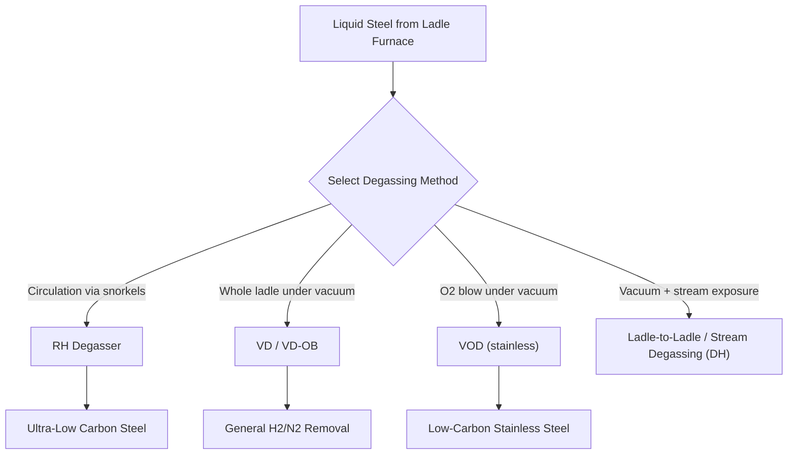

## Vacuum Degassing Techniques

### Overview

Vacuum degassing is a family of secondary steelmaking (and broader metal refining) processes that subject liquid metal to sub-atmospheric pressure to remove dissolved gases (primarily hydrogen and nitrogen) and to enable reactions that are thermodynamically or kinetically unfavorable at atmospheric pressure — most notably ultra-low carbon decarburization and, in stainless steel practice, decarburization without excessive chromium loss. Vacuum degassing sits within the broader ladle metallurgy sequence, typically performed after primary steelmaking (BOF/EAF) and ladle furnace treatment, immediately before continuous casting.

### Thermodynamic Basis

**Gas Solubility Under Vacuum (Sievert's Law)**

The solubility of diatomic gases (H₂, N₂) in liquid metal follows Sievert's Law, where dissolved gas content is proportional to the square root of the gas's partial pressure above the melt:

$$[\%H] = K_H \sqrt{p_{H_2}}$$

$$[\%N] = K_N \sqrt{p_{N_2}}$$

Reducing the ambient pressure (via vacuum) directly reduces $p_{H_2}$ and $p_{N_2}$ above the melt, driving dissolved hydrogen and nitrogen out of solution and into the gas phase to reestablish equilibrium.

**Carbon-Oxygen Reaction Under Vacuum**

$$[C] + [O] \rightarrow CO_{(g)}$$

At atmospheric pressure, this reaction reaches equilibrium at a relatively high carbon level for a given oxygen activity. Under vacuum, the reduced partial pressure of CO gas above the melt shifts the reaction equilibrium toward further CO formation (per Le Chatelier's principle applied to the equilibrium constant $K = p_{CO}/(a_C \cdot a_O)$), enabling decarburization to levels unattainable at atmospheric pressure using the same oxygen potential. This is the central thermodynamic justification for using vacuum treatment to reach ultra-low carbon (ULC) grades.

### Major Vacuum Degassing Technologies

**1. RH Degassing (Ruhrstahl-Heraeus)**

The RH process circulates liquid steel between the ladle and an evacuated vacuum vessel via two refractory-lined "snorkels" (up-leg and down-leg) immersed in the melt. Argon "lift gas" injected into the up-leg reduces the density of steel in that leg, driving circulation: steel rises through the up-leg into the vacuum chamber (where degassing and decarburization occur under reduced pressure), then returns to the ladle via the down-leg.

**Process characteristics:**

- Continuous circulation exposes successive portions of the melt to vacuum, achieving efficient degassing without evacuating the entire ladle volume at once
- Circulation rate is controlled via lift gas flow rate, directly affecting treatment efficiency and cycle time
- Widely used for automotive ultra-low carbon (ULC) sheet steel, where carbon levels [Inference] are commonly targeted in the range of roughly 10–30 ppm or lower in optimized practice, though achievable levels depend on plant-specific equipment and vacuum system capability
- Can be combined with oxygen lancing (RH-OB, "oxygen blowing") to accelerate decarburization via additional chemical heat and reaction driving force

**2. VD (Vacuum Degassing) / VD-OB**

The entire ladle is placed inside a vacuum vessel (or a vacuum tank is lowered over the ladle), with argon stirring via a porous plug maintaining bath circulation and renewing the steel-vacuum interface.

**Process characteristics:**

- Simpler equipment than RH (no snorkels/circulation system required)
- Effective primarily for hydrogen removal and moderate decarburization/desulfurization enhancement
- VD-OB variants add oxygen blowing capability for supplementary decarburization and reheating via chemical energy
- [Inference] Generally considered less aggressive for ultra-low carbon targets compared to RH, though the specific comparative performance depends on vessel design, vacuum pump capacity, and treatment duration

**3. VOD (Vacuum Oxygen Decarburization)**

Developed specifically for stainless steel production, VOD combines vacuum treatment with oxygen blowing to solve a metallurgical problem unique to high-chromium alloys: at atmospheric pressure, oxygen blowing to remove carbon from stainless steel melts also oxidizes valuable chromium (since Cr has a competing affinity for oxygen at typical steelmaking temperatures). Reducing the ambient pressure shifts the carbon-oxygen equilibrium favorably relative to the chromium-oxygen equilibrium, allowing decarburization with substantially reduced chromium loss.

$$[Cr] + [O] \rightleftharpoons (CrO) \quad \text{(competing reaction, suppressed under vacuum relative to C-O reaction)}$$

**Key Points**

- VOD is the standard route for producing low-carbon stainless grades (e.g., 304L, 316L) where both low carbon (for corrosion resistance/weldability) and chromium retention (for cost and alloy performance) are simultaneously required.

**4. Stream Degassing (Ladle-to-Ladle, DH Process)**

Older and less common in modern high-volume practice, stream degassing exposes the steel to vacuum as it is poured (as a thin stream, maximizing surface-area-to-volume ratio for gas removal) from one vessel to another under vacuum, or lifts a ladle into a vacuum chamber cyclically (Dortmund-Hörder, DH process). [Inference] These methods have generally been superseded by RH and VD/VOD technology in most modern integrated and specialty steel plants, though variants may persist in specific regional or legacy installations.

### Comparative Summary

| Process | Primary Purpose | Mechanism | Typical Application |
| --- | --- | --- | --- |
| RH | Ultra-low carbon, degassing | Continuous circulation via snorkels | Automotive sheet (ULC/IF steel) |
| RH-OB | RH + supplementary decarburization/heat | Circulation + oxygen lancing | ULC with faster cycle/reheating needs |
| VD | Hydrogen removal, moderate decarburization | Whole-ladle vacuum + Ar stir | General-purpose degassing |
| VD-OB | VD + supplementary decarburization | Whole-ladle vacuum + O₂ blow | Broader carbon range flexibility |
| VOD | Decarburization with Cr retention | Vacuum + O₂ blow | Stainless steel (304L, 316L, etc.) |

### Hydrogen Removal and Flake/Cracking Prevention

Dissolved hydrogen is a particular concern in heavy steel forgings and castings, where hydrogen can precipitate as molecular H₂ gas at internal defects/voids during cooling, generating internal pressure sufficient to cause "hydrogen flaking" (internal cracks) — a defect that can render large forgings unusable. Vacuum degassing (particularly VD treatment, sometimes supplemented by slow cooling practice for very heavy sections) is a standard mitigation for this failure mode in heavy engineering steel production.

### Worked Example: Sievert's Law Application

**Problem**: If a melt's dissolved hydrogen content is 4 ppm at atmospheric pressure (1 atm, $p_{H_2} \approx 1$ atm partial pressure basis for illustration), estimate the relative reduction in equilibrium hydrogen solubility when vacuum pressure is reduced to 1/100 atm (approximate order-of-magnitude vacuum degasser condition), assuming $K_H$ remains constant.

Since $[\%H] = K_H \sqrt{p_{H_2}}$, the ratio of solubilities at two pressures is:

$$\frac{[\%H]_{vacuum}}{[\%H]_{atm}} = \sqrt{\frac{p_{H_2,vacuum}}{p_{H_2,atm}}} = \sqrt{\frac{0.01}{1}} = \sqrt{0.01} = 0.1$$

**Output**: Under this simplified illustrative assumption, equilibrium hydrogen solubility would fall to approximately 10% of its atmospheric-pressure value (i.e., from 4 ppm toward an equilibrium target near 0.4 ppm), though actual achieved hydrogen content in practice depends on treatment time, degree of approach to equilibrium, melt mixing, and the actual achieved vacuum level — this calculation illustrates the square-root relationship of Sievert's Law rather than a guaranteed operational outcome.

### Practical Equipment and Operating Considerations

- **Vacuum pump systems**: Typically steam ejector systems or mechanical vacuum pumps capable of reaching pressures on the order of a few hundred Pa to sub-100 Pa range depending on process requirements; RH snorkel and vessel refractories must withstand both thermal cycling and the erosive/corrosive combination of circulating steel and vacuum conditions.
- **Cycle time**: Vacuum treatment adds meaningful time to the overall steelmaking sequence (commonly on the order of 15–40 minutes depending on process and target composition), which must be integrated into overall plant scheduling and casting sequence planning.
- **Temperature loss**: Vacuum treatment (particularly extended RH circulation) causes temperature drop, often necessitating either upstream superheat allowance or, where equipment permits, combined heating capability to maintain adequate casting temperature.
- **Snorkel/refractory wear**: RH snorkel refractories are subject to significant erosion from circulating steel flow and require regular inspection/replacement, representing an ongoing maintenance cost specific to the RH technology.

### Environmental and Engineering Considerations

- **Off-gas handling**: Vacuum degassing off-gas (containing CO from decarburization, along with entrained dust) requires capture and treatment; RH-OB and VOD in particular generate substantial CO that must be managed as part of plant emissions control.
- **Energy consumption**: Vacuum pump operation and any supplementary reheating add to overall secondary steelmaking energy consumption, representing a cost/quality trade-off against the alternative of producing lower-specification steel without vacuum treatment.
- **Argon consumption**: RH lift gas and general ladle stirring represent an ongoing argon consumption cost across vacuum degassing operations.
- Achievable carbon, hydrogen, and nitrogen levels, along with cycle times and equipment wear rates, vary considerably with plant-specific equipment design, vacuum capacity, and steel grade targets; figures cited here should be read as representative industry ranges rather than guaranteed outcomes for any specific facility.

### Related Topics

- Ladle Metallurgy and Refining (upstream/parallel secondary steelmaking treatment)
- Steelmaking: Basic Oxygen and Electric Arc Processes (primary furnace feeding vacuum degassing)
- Stainless Steel Metallurgy and Chromium Retention
- Continuous Casting of Steel
- Hydrogen Embrittlement and Flaking in Heavy Forgings
- Deoxidation Practice and Inclusion Control
- Ultra-Low Carbon (Interstitial-Free) Steel Production
- Sievert's Law and Gas Solubility in Metals
- Refractory Wear in Vacuum Vessel Systems