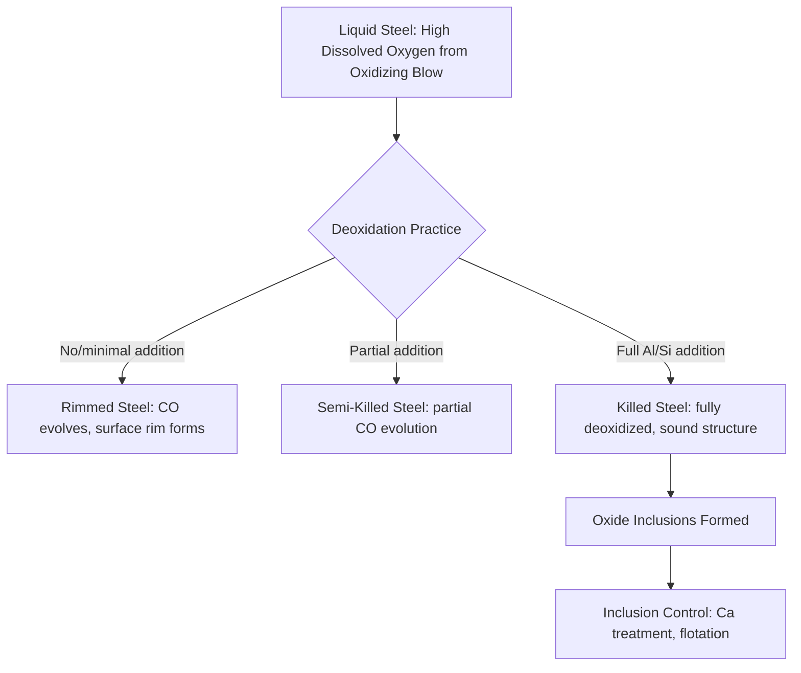

## Deoxidation and Desulfurization

### Overview

Deoxidation and desulfurization are two of the core chemical treatment objectives of secondary steelmaking, targeting the removal (or fixation) of dissolved oxygen and sulfur respectively from liquid steel before casting. Although often discussed together as ladle metallurgy operations, they rely on distinct — and in some respects opposing — chemical driving forces: deoxidation is achieved by adding elements with a higher oxygen affinity than iron, while effective desulfurization requires establishing reducing, low-oxygen-potential slag conditions. Understanding both, and their interaction, is central to producing steel with controlled inclusion content, low sulfur, and reliable castability.

### Deoxidation

**Purpose**

Liquid steel tapped from an oxidizing primary furnace (BOF or EAF) carries substantial dissolved oxygen, in equilibrium with the melt's carbon content at end-of-blow conditions. If not removed, this oxygen would react with carbon during solidification, evolving CO gas and causing porosity, blowholes, and "rimming" behavior in the cast product. Deoxidation additions consume this dissolved oxygen by forming stable oxide compounds before or during casting.

**Common Deoxidizers and Reactions**

Deoxidizing elements are selected for their strong affinity for oxygen relative to iron, ranked approximately (strongest to weakest, though exact ranking is temperature- and concentration-dependent) as: Ca > Al > Ti > Si > Mn.

$$Mn + [O] \rightarrow MnO$$

$$Si + 2[O] \rightarrow SiO_2$$

$$2Al + 3[O] \rightarrow Al_2O_3$$

Aluminum is the most widely used strong deoxidizer in modern steelmaking due to its high oxygen affinity, relatively low cost, and predictable reaction behavior; silicon and manganese are also commonly used, often in combination (complex deoxidation), to tailor the resulting oxide inclusion composition, size, and morphology.

**Degree of Deoxidation: Killed, Semi-Killed, and Rimmed Steel**

| Type | Deoxidation Level | Solidification Behavior | Modern Usage |
| --- | --- | --- | --- |
| Rimmed steel | Minimal/none | CO evolution during solidification causes a "rim" of pure iron at the ingot surface | Largely historical, rare in modern practice |
| Semi-killed steel | Partial | Some CO evolution, moderate porosity control | Niche/specific applications |
| Killed steel | Full (typically Al or Si) | No gas evolution; solid, sound ingot/strand | Standard for most modern quality steel |

[Inference] Fully killed (typically aluminum-killed) steel is the standard for the great majority of contemporary continuously cast steel grades, given the dimensional and internal soundness requirements of modern casting practice; rimmed and semi-killed grades persist mainly in legacy or specialized niche applications.

### Deoxidation Kinetics and Inclusion Formation

Deoxidation is not merely a bulk chemical reaction but a nucleation and growth process: the deoxidation product (e.g., $Al_2O_3$) initially forms as fine particles dispersed throughout the melt, which must then either be removed (float to the slag/steel interface and be absorbed by the slag) or remain as inclusions in the final solidified product.

**Key Points**

- Deoxidation product size and distribution depend on the deoxidizer type, addition rate, melt temperature, and subsequent stirring practice — factors that are actively engineered rather than incidental, since inclusion population directly affects mechanical properties (fatigue life, toughness) and castability (nozzle clogging risk).
- Complex deoxidation (combining, e.g., Al with Ca or Si with Mn) is often used specifically to modify inclusion composition toward more benign, less clog-prone, and more easily removable forms rather than simply to maximize oxygen removal efficiency.

### Desulfurization

**Purpose**

Sulfur is generally an undesirable residual element in steel: it forms manganese sulfide (MnS) inclusions that elongate during hot rolling, creating anisotropic mechanical properties (notably reduced through-thickness ductility and toughness) and contributing to hot shortness (embrittlement during hot working) in certain compositions. Most modern steel specifications, particularly for demanding applications (pipeline, automotive, offshore), impose strict maximum sulfur limits, driving the need for dedicated desulfurization treatment.

**Thermodynamic Requirements**

Effective desulfurization requires a slag with:

- **High basicity** (high CaO content) to provide sulfide-capturing capacity
- **Low oxygen potential** (low FeO/MnO content) — critical, because sulfur removal and oxygen content in the slag/metal system are competitively linked

$$[S] + (CaO) \rightarrow (CaS) + [O]$$

Because this reaction releases oxygen into the metal, it is thermodynamically favored only when the melt is already in a low-oxygen (reduced) state — meaning **effective desulfurization essentially requires that deoxidation has already occurred**, establishing the low residual oxygen activity that drives the sulfur-transfer reaction forward.

**Key Points**

- This oxygen-sulfur coupling is why desulfurization is generally performed in the ladle furnace (a reducing environment) rather than in the oxidizing primary furnace, and typically follows or accompanies deoxidation practice within the ladle treatment sequence.
- Desulfurization slag basicity is [Inference] commonly targeted in a relatively high range (often cited around a CaO/SiO₂ or CaO/Al₂O₃-based basicity index well above unity) to maximize sulfide capacity, though exact numerical targets vary by plant practice and slag system (lime-alumina vs. lime-silica based).

### Sulfide Capacity and Slag Design

The **sulfide capacity** of a slag, $C_S$, is a thermodynamic parameter quantifying a given slag's inherent ability to hold sulfur as sulfide, as a function of slag composition and temperature:

$$C_S = \left(\frac{[\%S]}{p_{S_2}^{1/2}}\right) \cdot p_{O_2}^{1/2}$$

[Inference] While the exact functional form and empirical correlations for sulfide capacity vary across the metallurgical literature and specific slag systems, the general principle — that higher basicity and lower oxygen potential slags exhibit higher sulfide capacity — is well established and forms the practical basis for desulfurization slag design.

Lime-alumina based synthetic slags (rather than lime-silica slags typical of primary steelmaking) are commonly favored for ladle desulfurization because alumina-based slag systems can achieve high basicity and good fluidity simultaneously without the viscosity penalties that very high-basicity lime-silica slags can exhibit.

### External Desulfurization: Hot Metal Pretreatment

Beyond ladle steel treatment, desulfurization is also widely practiced on **hot metal** (molten iron from the blast furnace) before it is charged to the BOF, since achieving very low sulfur is often more efficient and economical at this earlier stage:

**Common Hot Metal Desulfurization Reagents**

$$CaC_2 + [S] \rightarrow CaS + 2C \quad \text{(calcium carbide injection)}$$

$$Mg + [S] \rightarrow MgS \quad \text{(magnesium injection)}$$

Reagents (lime, calcium carbide, magnesium, or combinations) are injected into a torpedo car or ladle of hot metal via a lance, with the resulting sulfide-rich desulfurization slag ("dross") skimmed off before charging to the BOF. [Inference] Magnesium-based reagents are often noted for particularly fast reaction kinetics and efficient sulfur removal, though the specific reagent choice and injection technology vary by plant based on cost, hot metal sulfur level, and target final sulfur specification.

### Comparative Summary: Deoxidation vs. Desulfurization

| Aspect | Deoxidation | Desulfurization |
| --- | --- | --- |
| Driving force | High oxygen affinity of added element vs. Fe | High sulfide capacity of basic, low-oxygen-potential slag |
| Typical timing | Tap/early ladle treatment | Ladle furnace (after/with deoxidation), or hot metal pretreatment |
| Key reagents | Al, Si, Mn, Ca | CaO-based synthetic slag, CaC₂, Mg (hot metal) |
| Product fate | Oxide inclusions (retained in steel or floated to slag) | Sulfide captured in slag (removed with slag) |
| Relationship | Enables desulfurization by lowering melt oxygen activity | Depends on prior/concurrent deoxidation |

### Worked Example: Sulfur Partition Ratio Calculation

**Problem**: A ladle treatment achieves a sulfur partition ratio (Ls = %S in slag / %S in metal) of 200 under a given reducing slag practice. If the initial steel sulfur content is 0.020% and the slag-to-metal mass ratio is 0.03 (3% slag by mass of steel), estimate the approximate final steel sulfur content assuming simple mass balance equilibrium (illustrative, ignoring kinetic limitations).

Let $S_f$ = final steel sulfur (%), and slag sulfur at equilibrium = $L_s \times S_f$.

Mass balance (sulfur conserved between metal and slag, per unit mass of steel):

$$0.020 = S_f + (\text{slag/metal ratio}) \times L_s \times S_f$$

$$0.020 = S_f (1 + 0.03 \times 200)$$

$$0.020 = S_f (1 + 6) = 7 S_f$$

$$S_f = \frac{0.020}{7} \approx 0.00286\%$$

**Output**: Under this simplified equilibrium mass-balance assumption, final steel sulfur would be reduced to approximately 0.0029% (29 ppm) from an initial 0.020% (200 ppm) — roughly an 86% reduction. [Inference] Actual desulfurization performance in practice depends heavily on the approach to equilibrium achieved (governed by stirring intensity, contact time, and slag/metal mixing), so real-world results are commonly somewhat below the full equilibrium potential implied by the partition ratio alone.

### Environmental and Engineering Considerations

- **Refractory attack**: High-basicity, low-oxygen-potential desulfurization slags can be aggressive toward certain refractory linings, requiring compatible refractory selection (commonly magnesia-carbon based) for ladle furnace practice.
- **Slag/dross disposal**: Hot metal desulfurization dross and ladle desulfurization slag differ chemically from primary furnace slag and require separate handling; reuse potential depends on composition and regional regulatory framework.
- **Reoxidation risk**: Deoxidized, low-oxygen steel is thermodynamically prone to reoxidation on exposure to air or oxidizing refractory/slag during subsequent handling and casting, making atmosphere and slag control (e.g., ladle shrouding, tundish flux practice) an important downstream consideration connected directly to upstream deoxidation practice.
- **Reagent cost and yield**: Aluminum deoxidizer yield and calcium treatment efficiency are influenced by melt temperature, oxygen content at addition, and stirring practice, making reagent addition timing and rate an active area of process optimization.
- Sulfide capacity values, achievable sulfur/oxygen levels, and reagent performance vary considerably with slag composition, temperature, and plant-specific practice; the figures and relationships presented here should be read as representative of general metallurgical principles rather than universal fixed benchmarks.

### Related Topics

- Ladle Metallurgy and Refining (parent process context)
- Vacuum Degassing Techniques (complementary secondary refining operation)
- Inclusion Engineering and Steel Cleanliness Assessment
- Steelmaking: Basic Oxygen and Electric Arc Processes (upstream primary refining)
- Slag-Metal Reaction Thermodynamics
- Hot Metal Pretreatment (Desiliconization, Desulfurization, Dephosphorization)
- Calcium Treatment and Inclusion Modification
- Continuous Casting Nozzle Clogging Mechanisms
- Refractory Materials for Ladle and Furnace Linings