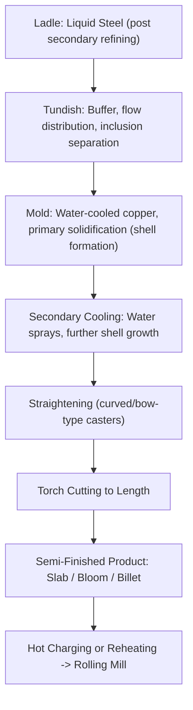
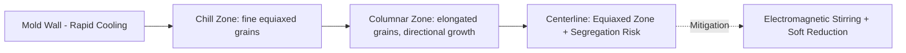

## Continuous Casting Fundamentals

### Overview

Continuous casting is the process by which liquid steel (or other metals, though this treatment focuses on steel as the dominant industrial application) is solidified into a semi-finished shape — slab, bloom, or billet — in a continuous, steady-state operation rather than being cast into discrete ingot molds. Since its widespread industrial adoption from the mid-20th century onward, continuous casting has become the dominant route for converting liquid steel into solid semi-finished product, [Inference] with modern industry accounts commonly citing that well over 95% of global crude steel output is continuously cast, having largely displaced older ingot casting and primary rolling (cogging) practice due to substantially higher yield, energy efficiency, and product consistency.

### Why Continuous Casting Displaced Ingot Casting

| Factor | Ingot Casting (Legacy) | Continuous Casting |
| --- | --- | --- |
| Yield | Lower (cropping losses, piping defects) | Higher (minimal cropping, better solidification control) |
| Energy | Requires reheating (soaking pits) before rolling | Can feed directly to rolling (hot charging/direct rolling possible) |
| Product consistency | More variable | More uniform internal quality |
| Capital/operating cost | Higher labor and handling intensity | More automatable, continuous process economics |
| Throughput | Batch, slower | Continuous, higher overall productivity |

### Core Process Sequence

**1. Ladle and Tundish**

Liquid steel arrives from the ladle furnace/vacuum degasser in a ladle, which is positioned above a **tundish** — a refractory-lined intermediate vessel that:

- Buffers steel supply during ladle changes, enabling truly continuous (uninterrupted) casting across multiple ladle heats ("sequence casting")
- Distributes steel evenly to multiple casting strands in multi-strand casters
- Provides additional residence time for inclusion flotation and separation
- Often incorporates flow control devices (weirs, dams, turbulence inhibitors) to promote favorable flow patterns for inclusion removal

Steel flows from the tundish into the mold through a submerged entry nozzle (SEN), which protects the steel stream from atmospheric reoxidation and controls flow pattern within the mold.

**2. Mold**

The mold is a water-cooled copper tube (or set of copper plates for slab casters) that extracts heat rapidly from the steel surface, forming a thin, solidified outer shell while the interior remains liquid. Key mold design and operating features:

- **Mold oscillation**: The mold oscillates vertically (typically in a sinusoidal or asymmetric non-sinusoidal waveform) to prevent the solidifying shell from sticking to the mold wall, which would otherwise tear and cause a dangerous breakout
- **Mold flux (casting powder)**: A specially formulated powder added to the mold top surface melts to form a liquid flux layer that lubricates the strand-mold interface, controls heat transfer, and absorbs inclusions floating from the steel
- **Taper**: The mold is tapered (narrower at the bottom) to compensate for shell shrinkage during solidification and maintain good contact/heat transfer

**Key Points**

- Mold oscillation parameters (stroke, frequency, and for non-sinusoidal waveforms, the negative strip time — the portion of the cycle where mold velocity exceeds strand withdrawal velocity) are critical, actively tuned variables that directly affect surface quality (oscillation mark depth) and breakout risk.
- Mold flux consumption rate and its melting/crystallization behavior are equally critical, actively engineered parameters, since flux performance directly governs lubrication and heat transfer uniformity around the strand perimeter.

**3. Secondary Cooling**

Below the mold, the strand (now with a solid shell but liquid core) passes through a secondary cooling zone where water or air-water mist sprays continue extracting heat, progressively increasing shell thickness until the entire cross-section solidifies (**full solidification** or "metallurgical length").

**Key Points**

- Secondary cooling intensity must be carefully controlled: too aggressive cooling can cause excessive thermal stress and surface/internal cracking, while insufficient cooling delays full solidification, increasing metallurgical length requirements and risking breakout if the shell is too thin when it exits support rolls.

**4. Strand Support and Guidance**

Support rolls guide and contain the strand as it passes through the caster, resisting the ferrostatic pressure of the still-liquid core (particularly critical just below the mold, where shell thickness is minimal) and preventing bulging between roll supports.

**5. Curved (Bow-Type) vs. Vertical Casters**

Most modern casters use a **curved mold and strand path** design (rather than fully vertical casting) to reduce overall plant height, with a **straightening** section where the solidified (or nearly solidified) strand is bent back to horizontal. [Inference] Straightening while the strand core is still partially liquid or just-solidified requires careful control, since straightening-induced strain can contribute to internal crack formation if not properly managed relative to the solidification front position — a topic of ongoing casting research and plant-specific optimization.

**6. Cutting**

Once fully solidified (or, in continuous/semi-continuous operation, cut to length while still hot for subsequent reheating), the strand is cut by oxy-fuel torch (or increasingly, mechanical shears for smaller sections) into discrete slabs, blooms, or billets for further processing.

### Product Types and Downstream Use

| Product | Cross-Section | Primary Downstream Use |
| --- | --- | --- |
| Slab | Wide, flat rectangular | Flat products: plate, hot/cold-rolled sheet, coil |
| Bloom | Square/rectangular, larger | Structural sections, heavy long products |
| Billet | Smaller square/round | Bar, rod, wire, rebar |
| Thin slab / near-net-shape | Reduced thickness (thin-slab casting) | Direct/compact strip production, reduced rolling reduction needed |

[Inference] Thin-slab casting and other near-net-shape casting technologies have grown in industrial adoption because they reduce the total rolling reduction (and therefore energy and equipment) needed to reach final gauge, though the extent of adoption varies by product mix, regional capacity, and mill vintage.

### Solidification Structure and Segregation

As the strand solidifies from the mold wall inward, it develops a characteristic three-zone cast structure:

1. **Chill zone**: Fine, randomly oriented grains formed by rapid heat extraction immediately at the mold wall
2. **Columnar zone**: Elongated grains growing inward, aligned with the direction of heat flow, as solidification proceeds more slowly
3. **Equiaxed zone**: Fine, randomly oriented grains in the final-solidifying core region, where constitutional undercooling and reduced thermal gradients favor nucleation over directional growth

**Macrosegregation**, particularly **centerline segregation**, is a well-known defect concern in continuous casting: as the strand solidifies, solute elements (carbon, sulfur, phosphorus, alloying elements) partition preferentially into the last-remaining liquid at the strand centerline, concentrating impurities and alloy elements there. This is commonly mitigated via:

- **Electromagnetic stirring (EMS)**: Applied in the mold and/or at the solidification front to disrupt columnar growth, promote equiaxed structure, and homogenize solute distribution
- **Soft reduction**: Light mechanical rolling applied to the strand near the point of final solidification, squeezing out solute-enriched liquid and compensating for solidification shrinkage to reduce centerline porosity/segregation

### Common Casting Defects

| Defect | Cause | Mitigation |
| --- | --- | --- |
| Breakout | Shell too thin/weak, tears open below mold | Proper mold flux, oscillation, cooling control |
| Surface cracks | Thermal stress, oscillation marks, improper flux behavior | Optimized oscillation waveform, flux selection |
| Internal cracks | Excessive straightening strain, uneven cooling (bulging) | Controlled straightening position, roll alignment |
| Centerline segregation/porosity | Solute rejection to last-solidifying liquid, solidification shrinkage | EMS, soft reduction |
| Inclusions/nozzle clogging | Alumina inclusion buildup at SEN | Calcium treatment (see ladle metallurgy), argon shrouding |

### Worked Example: Metallurgical Length Estimation

**Problem**: Using a simplified solidification model, estimate the approximate metallurgical length (distance from mold exit to full solidification) for a slab caster given a solidification constant $K = 25 \, mm/\sqrt{min}$, a strand half-thickness (to center) of 125 mm, and a casting speed of 1.2 m/min.

Simplified square-root-of-time solidification relationship (illustrative form): shell thickness $d = K\sqrt{t}$. Solving for the time to reach full solidification (shell thickness = half-thickness = 125 mm):

$$125 = 25\sqrt{t} \implies \sqrt{t} = 5 \implies t = 25 \, min$$

Metallurgical length = casting speed × solidification time:

$$L = 1.2 \, m/min \times 25 \, min = 30 \, m$$

**Output**: Under this simplified illustrative model, full solidification would occur approximately 30 meters below the mold — [Inference] real metallurgical length calculations in plant practice use more sophisticated heat-transfer models accounting for mold heat extraction, spray cooling zone-by-zone heat transfer coefficients, and steel grade-specific solidification behavior, so this figure represents the underlying square-root-of-time principle rather than a precise operational prediction for any specific caster.

### Environmental and Engineering Considerations

- **Energy efficiency**: Hot charging or direct rolling (feeding the still-hot cast strand directly to the rolling mill without full cooldown and reheating) captures significant energy savings relative to cold-charging practice, where plant logistics and product scheduling permit.
- **Water consumption and treatment**: Secondary cooling and mold cooling water systems require substantial water volumes and closed-loop treatment/recirculation systems to manage both consumption and thermal discharge.
- **Refractory consumption**: Tundish and SEN refractories are consumable items replaced regularly (per sequence or per campaign), representing an ongoing operating cost directly tied to casting sequence length and steel cleanliness (which affects nozzle clogging-driven refractory issues).
- **Casting speed and productivity trade-offs**: Higher casting speeds increase throughput but also increase risk of shell-related defects (breakout, surface cracking) if not matched with adequate mold/cooling design — an ongoing optimization balance specific to caster design and steel grade.
- Solidification behavior, defect susceptibility, and achievable casting speeds vary considerably with steel grade, caster design, and plant-specific practice, so the figures and relationships presented here should be read as illustrative of general principles rather than fixed universal benchmarks.

### Related Topics

- Ladle Metallurgy and Refining (upstream steel preparation for casting)
- Vacuum Degassing Techniques (upstream quality/cleanliness preparation)
- Deoxidation and Desulfurization (inclusion and cleanliness control feeding into castability)
- Solidification Structure and Segregation in Metals
- Electromagnetic Stirring and Soft Reduction Technology
- Hot Rolling and Direct/Compact Strip Production
- Mold Flux Design and Lubrication Mechanisms
- Continuous Casting Defect Analysis and Breakout Prevention
- Thin-Slab and Near-Net-Shape Casting Technologies