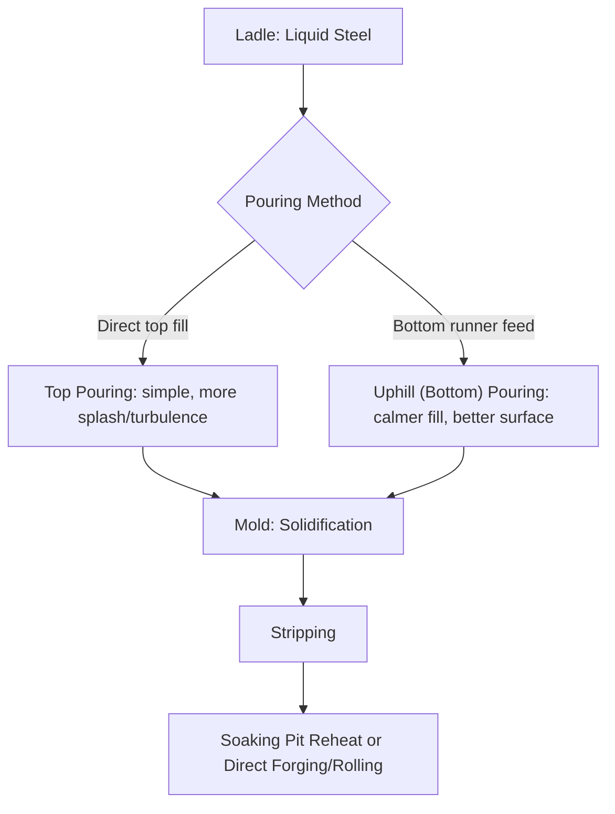
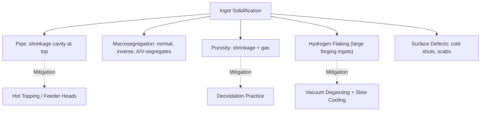

## Ingot Casting and Its Defects

### Overview

Ingot casting is the traditional route for solidifying liquid steel (and other metals) into discrete, individually cast blocks prior to subsequent hot working (forging or rolling). Molten metal is poured into a reusable cast-iron mold, allowed to solidify as a single discrete unit, then stripped and either reheated in a soaking pit or worked directly. Although continuous casting has displaced ingot casting for the overwhelming majority of standard steel production, ingot casting remains industrially important for large forgings, certain specialty and tool steel grades, and applications where continuous casting's product geometry or segregation characteristics are unsuitable — [Inference] notably very large single-piece forgings (turbine rotors, heavy pressure-vessel components) where achievable ingot size and subsequent forging reduction remain advantageous over continuously cast product.

### Ingot Casting Methods

**1. Top Pouring (Bottom-Poured Alternative: Uphill Casting)**

- **Top pouring**: Molten metal is poured directly into the top of the mold. Simple and low-cost, but the falling metal stream can cause splashing, spattering, and surface defects on ingot walls, along with more turbulent, oxidation-prone metal flow.
- **Bottom (uphill) pouring**: Metal is introduced through a central refractory-lined runner system feeding the bottom of one or several molds simultaneously, filling upward with a much calmer, less turbulent flow. This reduces surface defects and splash-related inclusions but requires more complex and costly refractory runner systems (particularly for multi-mold "cluster" bottom pouring arrangements).

**2. Mold Design Considerations**

Ingot molds are typically cast iron, reused many times, and designed with a taper (wider at top or bottom depending on "big-end-up" vs. "big-end-down" convention) to facilitate stripping after solidification. Big-end-up molds are common for steel because they help accommodate the pipe/shrinkage cavity (discussed below) toward the top of the ingot, where it can subsequently be cropped off with less overall yield loss than if it formed mid-body.

### Ingot Solidification Structure

Similar in principle to continuous casting but occurring within a static, finite mold volume, ingot solidification develops the same characteristic zones:

1. **Chill zone**: Fine equiaxed grains at the mold wall, formed by rapid initial heat extraction
2. **Columnar zone**: Elongated grains growing inward along the thermal gradient
3. **Equiaxed zone**: Coarser, randomly oriented grains in the final-solidifying core/top region

**Key Points**

- Because an ingot solidifies as a static, finite volume (rather than being continuously withdrawn as in continuous casting), it experiences much longer overall solidification times and correspondingly more pronounced macrosegregation and shrinkage-related defects — a fundamental structural disadvantage of ingot casting relative to continuous casting for standard product.

### Major Ingot Casting Defects

**1. Pipe (Shrinkage Cavity)**

As liquid metal solidifies and contracts, the last-remaining liquid — typically at the ingot top center — cannot be replenished, leaving a conical or funnel-shaped void known as "pipe."

$$\text{(Illustrative)} \quad V_{shrinkage} \approx \beta \times V_{liquid}$$

where $\beta$ is the volumetric solidification shrinkage coefficient (metal-specific; [Inference] commonly cited on the order of a few percent by volume for steel, though the precise value depends on composition and cooling conditions).

**Mitigation**:

- **Hot topping (feeder heads)**: An insulated or exothermic-lined reservoir placed atop the mold keeps the topmost metal liquid longer, concentrating the pipe into a smaller, more easily cropped region rather than allowing it to extend deep into the usable ingot body
- **Big-end-up mold orientation**: Concentrates the naturally forming pipe near the wider top, which is subsequently cropped and recycled as scrap

**2. Segregation**

As with continuous casting, solute elements partition preferentially into the last-solidifying liquid, but the effect is markedly more severe in ingots due to much longer solidification times:

- **Normal segregation**: Solute enrichment toward the ingot's final-solidifying regions (typically upper-center)
- **Inverse segregation**: Localized solute enrichment near the ingot surface, caused by liquid metal being drawn outward through interdendritic channels under specific solidification conditions
- **A-segregates and V-segregates**: Characteristic macrosegregation patterns (named for their visible shape in etched ingot cross-sections) arising from complex interdendritic fluid flow during solidification, driven by density differences between solute-enriched and solute-depleted liquid

**Key Points**

- Segregation severity in ingots scales strongly with ingot size — larger ingots solidify more slowly and segregate more severely, which is a central engineering constraint on maximum practical ingot size for a given composition and quality requirement.

**3. Porosity**

Distinct from macro-scale pipe, porosity refers to dispersed micro- and macro-voids throughout the ingot body, arising from:

- **Shrinkage porosity**: Localized solidification shrinkage in regions with restricted liquid feed (interdendritic regions cut off from the main liquid pool)
- **Gas porosity**: Dissolved gases (hydrogen, nitrogen, CO from residual carbon-oxygen reaction in insufficiently killed steel) precipitating as the metal solidifies and gas solubility drops sharply between liquid and solid states

**Mitigation**: Adequate deoxidation practice (see Deoxidation and Desulfurization), vacuum degassing prior to casting (particularly for hydrogen control in large forging-grade ingots), and hot topping/feeding practice to maintain liquid feed to solidifying regions.

**4. Hydrogen Flaking**

In heavy forging-grade ingots, dissolved hydrogen that fails to escape during the long solidification and cooling period can precipitate as molecular H₂ at internal defects, generating sufficient internal pressure to cause internal cracks ("flakes") — a defect of particular concern in large ingots due to long diffusion distances and extended cooling times, and a major driver of vacuum degassing adoption for forging-ingot steel production.

**5. Surface Defects**

- **Cold shuts**: Discontinuities on the ingot surface caused by metal splashing and partially solidifying before being covered by subsequently poured metal (more common with top pouring)
- **Scabs and surface cracks**: Related to mold condition, pouring turbulence, and mold coating/lubricant practice

### Ingot Casting vs. Continuous Casting: When Ingot Casting Persists

| Factor | Ingot Casting | Continuous Casting |
| --- | --- | --- |
| Typical modern use | Large forgings, some specialty/tool steels | Standard flat/long products, overwhelming majority of tonnage |
| Segregation severity | Higher (longer solidification times) | Lower (thin sections, rapid solidification) |
| Achievable single-piece size | Very large (multi-hundred-tonne forging ingots possible) | Limited by strand cross-section |
| Yield | Lower (pipe cropping, surface defect removal) | Higher |
| Process flexibility for small/specialty runs | Higher (batch flexibility) | Lower (favors continuous, high-volume runs) |

[Inference] The persistence of ingot casting for very large forging applications reflects a genuine current metallurgical/engineering limitation of continuous casting geometry for extremely large single-piece components, rather than a lag in continuous casting adoption generally — this is a specialized, ongoing use case rather than a legacy holdover awaiting full displacement.

### Worked Example: Pipe Volume Estimation

**Problem**: Estimate the approximate pipe (shrinkage cavity) volume for a cylindrical ingot of 2 m³ liquid steel volume, assuming a solidification shrinkage coefficient of 3% by volume (a representative illustrative figure for steel) and no hot topping/feeder head applied.

$$V_{pipe} \approx \beta \times V_{liquid} = 0.03 \times 2 \, m^3 = 0.06 \, m^3$$

**Output**: Under this simplified illustrative assumption, approximately 0.06 m³ (60 liters) of pipe cavity volume would form absent any hot topping mitigation — representing material that must either be cropped as scrap or, with effective hot topping/feeder head practice, substantially reduced in extent and concentrated into a smaller, more easily removed region. [Inference] Actual shrinkage coefficients and resulting pipe geometry depend on specific steel composition, pouring temperature, and mold/hot-topping design, so this figure illustrates the general order of magnitude rather than a precise value for any specific ingot.

### Environmental and Engineering Considerations

- **Yield losses**: Pipe cropping and surface defect removal represent direct yield losses (recycled as scrap) inherent to ingot casting practice, a key economic disadvantage relative to continuous casting.
- **Energy consumption**: Soaking pit reheating (bringing stripped ingots to uniform forging/rolling temperature) is an energy-intensive step largely avoided in continuous casting practice where hot charging is feasible.
- **Refractory and mold consumption**: Cast-iron ingot molds are reused many times but require periodic replacement due to thermal fatigue cracking; bottom-pour runner refractories are consumable per-cast items.
- **Forging yield considerations**: For large forging ingots specifically, the extent of segregation and porosity directly affects how much forging reduction (and associated material/yield loss) is required to achieve sound, homogeneous final component properties — a major consideration in forging ingot design and sizing.
- Defect severity, achievable ingot size, and mitigation effectiveness vary considerably with steel grade, ingot size, and plant-specific practice (mold design, hot topping technology, pouring method), so the figures and relationships presented here should be read as representative of general principles rather than fixed universal benchmarks.

### Related Topics

- Continuous Casting Fundamentals (dominant modern alternative)
- Deoxidation and Desulfurization (porosity/inclusion mitigation)
- Vacuum Degassing Techniques (hydrogen flaking mitigation)
- Solidification Structure and Segregation in Metals
- Large Forging Ingot Design and Forging Reduction Practice
- Soaking Pit Operation and Reheating Practice
- Hot Topping and Feeder Head Design
- Macrosegregation Mechanisms (A-segregates, V-segregates)
- Tool Steel and Specialty Alloy Ingot Production