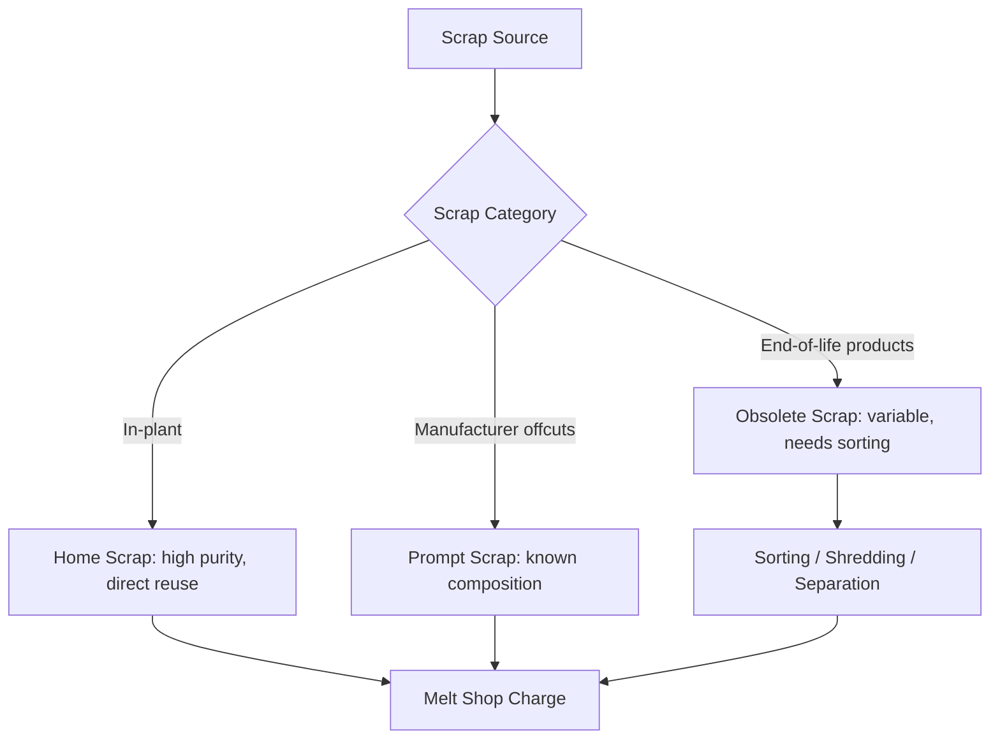

## Recycling of Metals and Scrap Processing

### Overview

Metal recycling recovers metal value from post-consumer and post-industrial scrap, returning it to production as a secondary raw material substitute for (or supplement to) primary ore-derived metal. Recycling is metallurgically and environmentally significant because most structural and engineering metals — steel, aluminum, copper, and others — can, in principle, be recycled indefinitely without fundamental loss of intrinsic metallic properties, though **practical recyclability is constrained by contamination, alloy mixing, and tramp element accumulation** rather than any inherent limit on melting and reprocessing. Recycling forms an increasingly central pillar of steel and non-ferrous industry decarbonization strategy, since remelting scrap generally requires substantially less energy than reducing metal from virgin ore.

### Why Recycling Matters: Energy and Emissions Context

[Inference] It is widely cited across industry and academic sources that recycled aluminum requires only a small fraction (commonly cited around 5%, though the exact figure varies by source and system boundary assumptions) of the energy needed to produce primary aluminum via bauxite mining and Hall-Héroult electrolysis, since remelting avoids both mining/refining energy and the electrolytic reduction step entirely. Steel scrap recycling via the EAF route similarly avoids the energy-intensive coke-based ironmaking (blast furnace) stage entirely, which is a central reason EAF-scrap steelmaking is generally considered less carbon-intensive than the BOF/blast-furnace route, particularly where paired with low-carbon electricity.

**Key Points**

- Recycling's energy/emissions advantage stems specifically from avoiding the reduction step (of ore to metal), not merely from avoiding mining — this distinction matters because it clarifies why recycling benefits scale differently across metals depending on how energy-intensive their primary reduction route is (e.g., aluminum's electrolytic reduction is far more energy-intensive than steel's carbothermic reduction, so aluminum recycling's proportional energy savings tend to be especially large).

### Scrap Classification

Scrap is broadly categorized by its origin in the metal life cycle, which strongly influences its cleanliness, alloy consistency, and processing requirements:

| Category | Origin | Characteristics |
| --- | --- | --- |
| Home scrap (runaround) | Generated and recycled within the same producing plant (trimmings, rejects) | Highest purity/consistency, known composition |
| Prompt (new production) scrap | Generated by manufacturers/fabricators downstream (stamping offcuts, machining swarf) | Good known composition, relatively clean |
| Obsolete (post-consumer) scrap | End-of-life products (vehicles, appliances, construction demolition, packaging) | Most variable composition, highest contamination risk, requires most extensive sorting |

### Scrap Preparation and Sorting Technologies

Obsolete scrap in particular requires substantial preprocessing before it can be melted as a reliable metallurgical input:

**1. Shredding**

Automobile shredders and similar large hammermill-type equipment reduce bulky scrap (end-of-life vehicles, appliances) into smaller, more uniform fragments, liberating different material types from composite assemblies for subsequent separation.

**2. Magnetic Separation**

Ferrous metals (iron, steel) are separated from non-ferrous and non-metallic fractions using magnetic drums or overhead magnets, exploiting the strong magnetic response of ferrous alloys versus the non-magnetic behavior of most non-ferrous metals and non-metallic materials.

**3. Eddy Current Separation**

Non-ferrous metals (aluminum, copper, brass) are separated from remaining non-metallic material using eddy current separators, which induce currents in conductive (metallic) particles via a rapidly alternating magnetic field, generating a repulsive force that physically ejects metallic particles from the non-metallic waste stream.

**4. Density-Based and Sensor-Based Sorting**

- **Sink-float/heavy media separation**: Exploits density differences among non-ferrous metals (e.g., separating aluminum from heavier zinc or copper-based scrap)
- **X-ray transmission (XRT) and laser-induced breakdown spectroscopy (LIBS) sorting**: [Inference] Increasingly deployed sensor-based sorting technologies capable of alloy-specific identification and separation (e.g., distinguishing different aluminum alloy series, or separating stainless from carbon steel scrap), representing an active area of technological development aimed at improving scrap purity and enabling more precise alloy-specific recycling streams

**Key Points**

- Sensor-based sorting technology is a genuinely evolving field; the specific capabilities, throughput, and accuracy of commercially available systems continue to advance, so specific vendor/technology claims should be verified against current documentation when precision matters for a given application.

### Metal-Specific Recycling Considerations

**Steel**

Steel scrap is charged primarily to the EAF (see Steelmaking) though it also serves as a coolant/dilutant in BOF charges. Key challenges:

- **Tramp elements** (copper, tin, nickel, chromium from coated/alloyed scrap) cannot be removed by oxidative steelmaking and accumulate with repeated recycling cycles, progressively constraining the range of steel grades that heavily-recycled scrap can produce without dilution by virgin iron units (DRI, pig iron, or reduced iron sources)
- Galvanized (zinc-coated) scrap introduces zinc into EAF dust, which is subsequently processed as a separate zinc-recovery stream (e.g., via Waelz kiln processing) rather than remaining in the steel

**Aluminum**

- Aluminum alloys are numerous and not always mutually compatible when melted together; alloy mixing can degrade mechanical properties or require "downcycling" (using mixed scrap for lower-specification castings rather than high-performance wrought products)
- Used beverage can (UBC) recycling is a particularly well-established, high-volume closed-loop recycling stream in many regions
- Dross (oxide skim formed during aluminum melting) represents a metal loss requiring dedicated dross-processing recovery techniques (rotary salt furnace processing, among others) to reclaim entrained metallic aluminum

**Copper**

- Copper and copper alloy (brass, bronze) scrap recycling is well-established and economically favorable given copper's high value and good separability via density and conductivity-based sorting methods
- Electronic scrap (e-waste) represents a growing, more complex copper (and precious metal) recycling stream requiring specialized hydrometallurgical/pyrometallurgical processing (see Hydrometallurgy Fundamentals) due to the complex mixture of materials in circuit boards and electronic assemblies

**Key Points**

- The general recycling principle across metals is a trade-off between **scrap purity/consistency** (favoring cleaner, more valuable end products) and **collection volume/cost** (favoring accepting more mixed, contaminated obsolete scrap) — sorting technology investment is fundamentally about shifting this trade-off favorably.

### Melting and Remelting Practice

Once sorted and prepared, scrap is charged to an appropriate melting furnace depending on the metal and target product:

- **Steel**: EAF (dominant), or as BOF charge coolant
- **Aluminum**: Reverberatory furnaces, rotary furnaces (often with salt flux to protect against oxidation and improve metal recovery from dross-forming conditions), or induction furnaces for smaller/specialty operations
- **Copper/copper alloys**: Induction furnaces, reverberatory furnaces, or (for lower-grade/complex feed such as e-waste) integrated smelters combining pyrometallurgical recovery with subsequent electrorefining

### Worked Example: Tramp Element Dilution Calculation

**Problem**: A steel producer's scrap supply contains 0.35% copper (as a tramp element). The target steel grade requires maximum 0.20% copper. If pure (copper-free) DRI is blended with the scrap to dilute copper content, calculate the minimum fraction of DRI (by mass) required in the total charge.

Let $x$ = fraction of scrap (with 0.35% Cu), and $(1-x)$ = fraction of DRI (0% Cu, illustrative assumption).

$$0.35x + 0 \times (1-x) = 0.20$$

$$0.35x = 0.20$$

$$x = 0.571 \, (57.1\% \, \text{scrap})$$

Therefore, DRI fraction required = $1 - 0.571 = 0.429$, or approximately 42.9%.

**Output**: Under this simplified illustrative mass-balance calculation, approximately 43% of the charge would need to be copper-free DRI to dilute the tramp copper content from 0.35% down to the 0.20% target — [Inference] a real plant charge calculation would also need to account for DRI's own residual gangue/metallic iron content, other tramp elements present simultaneously, and overall charge mix optimization for cost and metallurgical performance, so this figure illustrates the general dilution principle rather than a complete plant charge-mix calculation.

### Environmental and Engineering Considerations

- **Energy and emissions savings**: As discussed above, recycling generally offers substantial energy and associated greenhouse gas emissions savings relative to primary metal production, particularly for energy-intensive-to-reduce metals like aluminum.
- **Landfill diversion and resource conservation**: Metal recycling reduces landfill burden and conserves finite ore resources, supporting broader circular economy objectives increasingly embedded in regulatory and corporate sustainability frameworks.
- **Contamination and downcycling risk**: Inadequate sorting can lead to "downcycling" — using recycled metal only in lower-specification applications due to unremovable contamination — which represents a loss of potential value and environmental benefit relative to closed-loop, alloy-matched recycling.
- **E-waste and hazardous material handling**: Electronic scrap recycling must address hazardous materials (lead in older solder, brominated flame retardants, mercury in certain components) alongside metal recovery, requiring specialized environmental controls beyond standard scrap metal handling.
- **Zinc and dust recovery**: EAF dust (containing recovered zinc from galvanized scrap) and aluminum dross both represent secondary recovery streams in their own right, illustrating how recycling economics often depend on capturing value from multiple co-product streams rather than the primary metal alone.
- Achievable recycling rates, energy savings, and sorting technology performance vary considerably by metal, scrap source, and regional collection/processing infrastructure, so the figures and general claims presented here should be read as representative of widely cited industry principles rather than precise universal benchmarks.

### Related Topics

- Steelmaking: Basic Oxygen and Electric Arc Processes (EAF scrap-based steelmaking route)
- Electrometallurgy and Electrowinning (copper/aluminum recycling-adjacent refining)
- Hydrometallurgy Fundamentals (e-waste and complex scrap processing)
- Circular Economy Principles in Metals Industries
- Life Cycle Assessment (LCA) of Metal Production
- Aluminum Dross Processing and Salt Flux Recovery
- Electronic Waste (E-Waste) Metal Recovery
- Tramp Element Management in Steel Recycling
- Sensor-Based Sorting Technologies (XRT, LIBS) in Scrap Processing