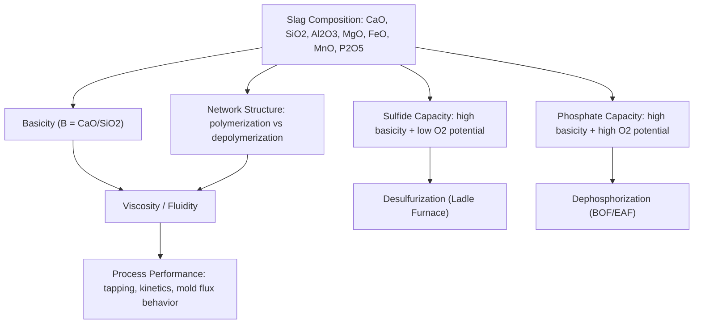

## Slag Chemistry in Metallurgical Operations

### Overview

Slag is the molten, non-metallic phase that forms in essentially every high-temperature metallurgical process — ironmaking, steelmaking, ladle refining, and nonferrous smelting alike — through the combination of gangue minerals, flux additions, and reaction products (oxidized impurities) into a fluid oxide melt distinct from the metal phase. Far from being simply "waste," slag is an actively engineered process medium: its composition and physical properties are deliberately controlled to achieve specific metallurgical objectives — impurity removal, thermal insulation, refractory protection, and inclusion absorption — at every stage from primary reduction through final ladle treatment.

### Fundamental Slag Components and Classification

Slags are conventionally classified as **acidic**, **basic**, or **neutral** based on the relative proportions of acidic oxides (network-forming, e.g., $SiO_2$, $Al_2O_3$, $P_2O_5$) versus basic oxides (network-modifying, e.g., $CaO$, $MgO$, $FeO$, $MnO$).

**Basicity Index**

The most common quantitative measure is the binary basicity ratio:

$$B = \frac{\%CaO}{\%SiO_2}$$

More refined indices incorporate additional components:

$$B_4 = \frac{\%CaO + \%MgO}{\%SiO_2 + \%Al_2O_3}$$

| Basicity Regime | Approximate B Range | Typical Application |
| --- | --- | --- |
| Acidic slag | B < 1 | Some historical open-hearth/acid Bessemer practice; limited modern use |
| Neutral slag | B ≈ 1 | Transitional; less common as a deliberate target |
| Basic slag (primary steelmaking) | B ≈ 2–4 | BOF, EAF — favors P removal |
| Highly basic (ladle/desulfurizing) | B > 3–5 | Ladle furnace — favors S removal |

[Inference] Exact basicity targets vary meaningfully by process, steel grade, and plant-specific practice; the ranges above represent commonly cited general industry guidance rather than fixed universal specifications.

### Slag Structure: The Silicate Network Model

At a molecular level, slag behavior is governed by the polymeric structure of the silicate network. Silicon in $SiO_2$ forms $SiO_4^{4-}$ tetrahedra that can link together (via shared oxygen "bridging" atoms) into chains, sheets, and three-dimensional networks — analogous in concept to polymer chemistry.

- **Basic oxides** (CaO, MgO, FeO) donate free oxygen ions ($O^{2-}$) that break silicate network bonds ("depolymerize" the melt), converting bridging oxygens into non-bridging oxygens and reducing average chain/network length
- **Acidic oxides** ($SiO_2$, $P_2O_5$) promote network formation and polymerization

**Key Points**

- This network-breaking/forming behavior directly explains the practical relationship between basicity and slag fluidity: increasing basicity (up to a point) generally decreases viscosity by depolymerizing the silicate network, which is why highly basic ladle desulfurization slags are often formulated with alumina rather than silica as the secondary network-forming oxide — alumina-based basic slags can achieve high basicity while maintaining adequate fluidity, avoiding the excessive viscosity that very high-basicity lime-silica slags can exhibit at typical steelmaking temperatures.

### Key Slag Properties and Their Metallurgical Significance

**1. Viscosity**

Slag viscosity governs mass transfer rates (reaction kinetics between slag and metal), tapping/pouring behavior, and mold flux lubrication performance in continuous casting. Viscosity is strongly temperature-dependent and composition-dependent, generally decreasing with increasing basicity (within the practical range used industrially) and increasing sharply as temperature approaches the slag's liquidus.

**2. Melting Point / Liquidus Temperature**

Slag must remain fully molten at process operating temperature to perform its intended function (fluidity for tapping, adequate reaction kinetics); a slag that begins to freeze or form solid precipitates prematurely can cause operational problems (furnace/ladle buildup, tap hole blockage).

**3. Sulfide Capacity**

As discussed in ladle metallurgy, sulfide capacity ($C_S$) quantifies a slag's thermodynamic capacity to hold sulfur as sulfide, strongly favored by high basicity and low oxygen potential (low FeO content):

$$[S] + (CaO) \rightarrow (CaS) + [O]$$

**4. Phosphate Capacity**

Analogously, phosphate capacity governs a slag's ability to fix phosphorus (as phosphate species), favored by high basicity **and** high oxygen potential — the opposite oxygen requirement from sulfide capacity, which is the fundamental reason dephosphorization (primary furnace, oxidizing) and desulfurization (ladle furnace, reducing) occur in separate process stages:

$$2[P] + 5(FeO) + 3(CaO) \rightarrow (Ca_3(PO_4)_2) + 5[Fe]$$

**5. Interfacial Tension and Foaming**

In EAF steelmaking, slag foaming (via CO gas generation from carbon injection into FeO-bearing slag) depends on slag composition and interfacial properties that stabilize gas bubbles within the slag layer, a practically important behavior for arc submersion and refractory protection (see Steelmaking).

### Slag Systems Across Different Metallurgical Processes

| Process | Slag Type | Primary Function | Typical Basicity Regime |
| --- | --- | --- | --- |
| Blast furnace ironmaking | Calcium-alumino-silicate | Gangue removal, S partial removal | Moderate basicity |
| BOF/EAF steelmaking | Lime-iron oxide-silicate | Dephosphorization (oxidizing) | Basic (B ≈ 2–4) |
| Ladle furnace | Lime-alumina based | Desulfurization (reducing), inclusion absorption | Highly basic |
| Copper matte smelting | Iron silicate ("fayalite," $FeO \cdot SiO_2$) | Gangue rejection from matte | Acidic to neutral |
| Copper converting | Iron silicate (similar to smelting) | FeS oxidation product removal | Acidic to neutral |

**Key Points**

- Nonferrous matte smelting slags (fayalitic, iron-silicate based) are compositionally very different from ferrous steelmaking slags (lime-based) because their function — separating gangue from a sulfide matte by density and chemical partitioning — differs fundamentally from the impurity-oxide-fixing role of steelmaking slag; this reflects the broader principle that slag composition is always engineered around the specific separation or reaction the process requires, not a fixed universal formula.

### Slag-Metal-Refractory Interactions

Slag chemistry does not operate in isolation from refractory selection — the two are interdependent:

- **Basic slags** (lime-based) are generally compatible with basic refractories (magnesia, magnesia-carbon, dolomite), since basic slags would chemically attack and dissolve acidic (silica-based) refractory linings over time
- **Acidic slags** (silica-based, as in some nonferrous smelting) are compatible with acidic or neutral refractories
- Refractory dissolution into slag is a continuous, unavoidable process to some degree; refractory selection aims to minimize this dissolution rate to acceptable levels over the vessel's campaign life rather than eliminate it entirely

### Slag as a Recoverable/Reusable Byproduct

- **Blast furnace slag**: Commonly granulated (rapid water quenching) to produce ground granulated blast furnace slag (GGBS/GGBFS), a valuable supplementary cementitious material in concrete production, or air-cooled for aggregate use
- **Steelmaking slag (BOF/EAF)**: Increasingly processed for use in road construction aggregate, cement clinker raw material, or (where iron/metallic content is recoverable) reprocessed via magnetic separation to recover entrained metallic iron
- **Nonferrous smelting slag**: Copper smelting/converting slags often retain economically significant entrained copper, recovered via slag flotation, slow cooling and gravity/magnetic separation, or electric furnace slag cleaning

**Key Points**

- The evolution from slag as pure waste toward slag as a valorized byproduct is a significant trend across essentially all major metallurgical sectors, driven jointly by environmental regulation (reducing landfill burden) and economic incentive (recovering entrained metal value and displacing virgin raw materials in construction applications).

### Worked Example: Basicity Calculation and Classification

**Problem**: A ladle furnace slag sample analyzes as 55% CaO, 12% SiO₂, 20% Al₂O₃, 8% MgO, and the remainder other oxides. Calculate the binary basicity (B) and the B4 basicity index, and classify the slag.

**Binary basicity:**

$$B = \frac{55}{12} \approx 4.58$$

**B4 basicity:**

$$B_4 = \frac{55 + 8}{12 + 20} = \frac{63}{32} \approx 1.97$$

**Output**: A binary basicity of approximately 4.6 confirms this is a highly basic slag, consistent with a ladle furnace desulfurization slag formulation. The lower B4 value (≈2.0) reflects the significant alumina content diluting the basicity index when network-forming oxides beyond silica are included — illustrating why the choice of basicity index (binary vs. B4) matters for accurately characterizing alumina-rich ladle slags versus silica-dominant primary steelmaking slags, and why a single basicity number should always be interpreted alongside knowledge of which formula was used.

### Environmental and Engineering Considerations

- **Slag valorization vs. disposal**: The trend toward slag reuse (construction aggregate, cement additive, metal recovery) reduces landfill burden and can offset primary raw material extraction elsewhere in the economy, though suitability depends on slag composition (e.g., leachability of trace elements, expansion potential from free lime/magnesia content in some steelmaking slags).
- **Refractory life and slag aggressiveness**: More aggressive (highly basic or highly fluid) slags generally increase refractory wear rates, creating a persistent economic trade-off between metallurgical performance (better desulfurization, faster reaction kinetics) and refractory campaign life/cost.
- **Gas emissions from slag processing**: Slag granulation (rapid water quenching) generates steam and can release minor gaseous emissions depending on slag sulfur content; process design and ventilation account for this.
- **Volume stability**: Some steelmaking slags contain free lime (uncombined CaO) or free MgO that can hydrate and expand over time, requiring aging/weathering treatment before use in certain construction applications to ensure long-term volume stability.
- Slag composition targets, viscosity behavior, and sulfide/phosphate capacity values vary considerably with specific process, temperature, and plant practice; the ranges and relationships presented here should be read as representative of general slag chemistry principles rather than fixed universal specifications.

### Related Topics

- Ladle Metallurgy and Refining (desulfurization slag practice)
- Deoxidation and Desulfurization (phosphate/sulfide capacity application)
- Blast Furnace Ironmaking (fayalitic/calcium-silicate slag formation)
- Reduction and Smelting of Nonferrous Ores (matte smelting slag systems)
- Refractory Materials for Ladle and Furnace Linings
- Recycling of Metals and Scrap Processing (slag byproduct valorization)
- Continuous Casting Fundamentals (mold flux as an engineered slag system)
- Silicate Melt Structure and Network Theory
- Slag-Metal Equilibrium Thermodynamics